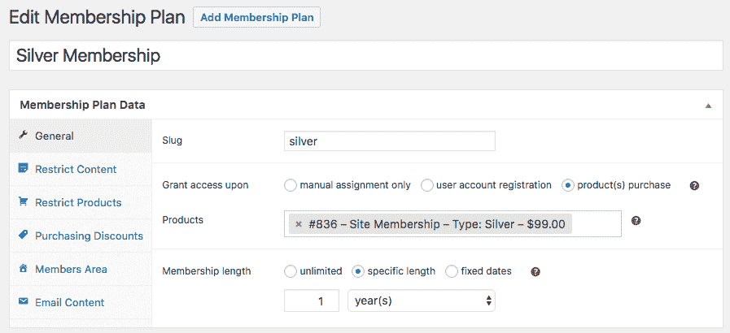
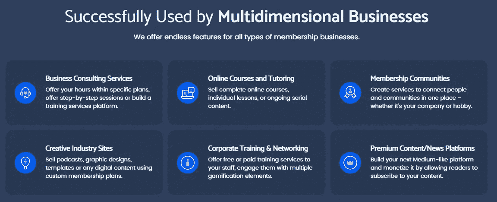

# 6 个最佳 WordPress 会员插件

> 原文：<https://medium.com/javarevisited/6-best-wordpress-membership-plugins-cf1e305e5641?source=collection_archive---------5----------------------->

会员制网站是将顾客转化为忠诚客户的好方法。认为做这样一个网站又麻烦又费钱是一种错觉。有很棒的插件可以帮你完成大部分工作。

[来源](https://unsplash.com/photos/YUuSAJkS3U4)

# 会员网站创意

也许你是某个领域的专家，你有一个名为 Instagram 的页面，或者只是一群离线听你讲课的学生。是时候扩大你的工作和收入，创建一个会员网站了。但是你应该在那里添加什么样的内容呢？

在决定之前，请记住人们通常对付费会员感兴趣的原因。其中只有几个:

1.  掌握新知识
2.  加入一个兴趣团体

你可以确切地知道你的客户需要什么，但是，可以肯定的是，你需要问他们！调查社交网络，无论是线下还是任何其他可用的形式。

一般来说，你可以为你的会员网站考虑这样的内容形式。

*   **网络直播会议**——每个人都喜欢 Instagram 直播。对你来说，这种格式很方便，因为你不需要提前制作内容
*   **课程**——可能是最广泛的会员网站内容，也是非常有价值的一个
*   文件存档库——为那些拥有大量必要资料的人准备的。或许你有很棒的模板，或者手册，或者任何很酷很有价值的东西，那么为什么不卖掉它呢？
*   **兴趣社区** —人们可以相互交流的地方。疫情最真实的事情。是的，人们真的愿意付钱和自己的同类一起出去玩。只是不要忘记照顾这个社区，为他们想出活动，创造 merch 和其他愉快的接触

# 6 款最佳会员插件

相似的功能，但不同的微妙之处。不可能在一次分析中描述所有这些问题。因此，在决定购买任何插件之前，我建议您更详细地研究每一个插件。阅读详细的评论，在 YouTube 上观看视频说明，要求演示，如果有这样的选择。

# [喷气引擎](https://crocoblock.com/plugins/jetengine/membership/?ref=2817)

JetEngine 是旗舰动态内容插件，您可以使用它通过几个步骤 [**创建一个完整的会员网站**](https://crocoblock.com/blog/building-membership-site-with-jetengine/?ref=2817) 。JetEngine 允许您设置会员级别，连接支付网关，限制不同用户角色的内容可见性，等等。

JetEngine 会员功能允许您创建四种类型的网站:

1.  **完全访问** —允许注册用户访问所有内容。例如，你可以限制下载，这样只有付费用户才能保存文件
2.  **固定期限** —仅授予用户访问权限，直到他们达到特定目标
3.  **—允许你设置一个特殊的时间表，在这个时间表内你的用户将会收到新的内容**
4.  ****服务模式** —适用于基于服务的网站，根据用户订阅提供不同级别的内容**

****JetEngine 核心功能:****

*   **允许创建和配置不同的成员级别**
*   **PayPal 和 Stripe 网关**
*   **网络商务整合**
*   **允许创建不同的形式:注册，定价，感谢页，等等**
*   **允许为每个用户角色设置自定义成员区域**
*   **允许向成员个人资料添加任意数量和类型的自定义字段**
*   **支持用户通过联系表单进行交互**
*   **允许用户创建和发布他们的内容**
*   **允许为不同的成员级别设置内容可见性条件**
*   **支持四种不同类型的成员模型**

****喷气引擎优点:****

*   **该插件适用于所有动态内容管理，而不仅仅是会员功能**
*   **适用于古腾堡和元素**
*   **有史以来最好的支持服务**

****喷气发动机缺点:****

*   **如果您只需要会员功能，JetEngine 可能看起来是一个复杂的解决方案**

****喷气发动机价格:****

*   **单一站点—26/年**

# **[MemberPress](https://memberpress.com/)**

****

**MemberPress 是顶级 WordPress 会员插件之一。它为建立正式会员资格提供了大量选择。有了这个插件，你可以无限制地为不同的用户组配置不同内容组的可见性，连接支付系统，等等。这是一个方便的插件，用于创建和管理不同类别的付费订阅。**

****核心功能:****

*   **限制对你的 WordPress 站点中的页面、文章、自定义文章类型和大多数其他文件的访问**
*   **创建动态定价页面**
*   **通过 API 集成支付网关**
*   **自动维护您创建的订阅**
*   **允许创建和应用优惠券**
*   **将统计数据收集到方便的报告中**
*   **为构建在线课程提供附加课程**
*   **还有一个简单的联盟附加组件，可以轻松启动联盟计划**

****支持者:****

*   **Zapier integration 开放了与数百个第三方服务的集成**
*   **专为建立会员网站而创建的可靠的长期存在的插件**
*   **适用于任何主题**

****成员压力缺点:****

*   **没有免费版本**
*   **最实惠的订阅非常有限**

****会员价格:****

*   **基本— 129 美元/年—1 个站点，基本功能，标准支持**
*   **外加— 249 美元/年—2 个站点，基本+功能，Zapier 集成，优先支持**
*   **专业版—349 美元/年— 5 个站点，所有可能的功能，许多第三方集成选项**

# **[终极成员](https://wordpress.org/plugins/ultimate-member/)**

****

**终极会员是一个会员插件，所有的基本功能都是免费的。这些包括用户配置文件、用户注册和登录、内容限制和成员目录。**

**还有 23 个付费附加组件，提供不同的深度功能。扩展不需要单独购买，它们都可以通过一次订阅获得，并且适用于不限数量的站点。这些扩展特别适合于开发网站的社交部分，因为它们允许用户相互交流、添加照片、定制个人资料等等。**

****终极成员** **核心功能:****

*   **前端用户配置文件管理**
*   **支持条件逻辑的自定义表单域**
*   **允许限制内容**
*   **用户帐户页面**
*   **自定义用户角色**
*   **成员目录**
*   **网络商务整合**
*   **允许通过社交媒体设置用户注册**
*   **允许用户通过相互关注、向书签添加内容等方式进行互动**

****终极会员优点:****

*   **所有的核心功能都是免费且有用的**
*   **简单的设置，轻量级，提供良好的文档**

****终极成员缺点:****

*   **通过电子邮件的支持不多**
*   **除了通过 WooCommerce，没有支付网关设置机会**

****终极会员价:****

*   **核心插件— $0 —用户配置文件、用户注册和登录、内容限制、成员目录**
*   **扩展通行证——249 美元/年——所有核心功能，访问所有扩展，通过电子邮件提供支持**
*   **扩展+主题通行证——299 美元/年——所有功能和扩展访问，以及终极会员主题**

# **[WooCommerce 会员资格](https://woocommerce.com/products/woocommerce-memberships/#)**

****

**WooCommerce 是你们都知道的电子商务插件。该团队还创建了一个插件，允许你将会员网站元素添加到你的在线商店。例如，您可以确保只有特定的订户组可以看到折扣。或者创建优惠券，为某些用户群开放对某些产品的访问，等等。**

**提供几种类型的会员资格:**

1.  **作为独立产品的会员资格**
2.  **作为产品购买一部分的会员资格**
3.  **从多个产品获得相同的会员资格**
4.  **您手动添加成员资格的仅限受邀成员区域**

**这个插件不是一个独立的解决方案，它与 WooCommerce 协同工作。此外，如果你需要设置定期支付功能，你必须购买另一个 WooCommerce 插件 WooCommerce Subscriptions。**

****WooCommerce 会员核心功能:****

*   **允许创建和销售会员资格**
*   **允许您为不同成员看到的内容外观设置时间表的点滴内容功能**
*   **针对不同群体的可调产品可视性条件**
*   **优惠券生成**
*   **成员管理仪表板**

****WooCommerce 会员优势:****

*   **WooCommerce 非常顺利的扩展，允许你把一个电子商店变成一个完全成熟的会员区**

****WooCommerce 会员缺点:****

*   **仅适用于 WooCommerce 核心插件，为了获得最大容量，您还需要购买一个其他插件**

****WooCommerce 会员价:****

*   **199.00 美元/年**

# **[成员](https://wordpress.org/plugins/armember-membership/)**

****

**一个轻量级的快速会员插件，不仅有高级版，还有免费版，甚至高级演示版也是一个 ARMember。除了会员插件的标准功能之外，这个插件还具有暴力登录保护和反垃圾邮件过滤器等功能。付费版本与营销服务有各种集成。**

**这并不是说免费版本非常有限，但同时它缺乏用户通过社交网络注册的能力等重要选项，没有优惠券、表格、发票等等。然而，对于一个小的会员制网站来说，免费功能已经足够了。此外，这个插件有各种付费插件，你可以根据需要购买。**

****arm member 核心特性:****

*   **会员资格无限制创建和管理**
*   **内置安全功能**
*   **允许启动定期付款**
*   **PayPal、Authorize.net、Stripe、2Checkout、银行转帐和更多可用的支付网关**
*   **所有页面和帖子的内容限制选项**
*   **用户的社交媒体注册选项**
*   **滴出内容功能(能够安排)**
*   **电子邮件服务集成**

****会员优点:****

*   **提供一个方便的免费版本**

****成员反对:****

*   **不支持聊天**

****会员价格:****

*   **1 个网站— $0 —创建会员网站所需的所有基本功能**
*   **1 个站点——49 美元——您需要的一切加上许多方便的微调功能**

# **[ProfileGrid](https://wordpress.org/plugins/profilegrid-user-profiles-groups-and-communities/)**

****

**ProfileGrid 是一个免费的会员插件，设置非常灵活。核心插件只提供最基本的功能，然后你可以安装扩展来扩展功能。有免费的，也有付费的。**

**最初，插件只提供最必要的特性，这很方便。这就是为什么它是轻量级的，不会降低网站的速度。另一方面，对于初学者来说，想弄清楚到底要安装什么是相当困难的。**

****ProfileGrid 核心特性:****

*   **允许创建具有不同定价的用户组**
*   **用户 CSV 导入**
*   **允许成员相互交流(添加好友、聊天等)**
*   **允许为每个用户组设置不同的注册表单**
*   **反垃圾邮件和安全基本功能，如 reCAPTCHA**
*   **内容限制选项**
*   **MailChimp、WooCommerce 和其他集成选项**
*   **Instagram 内容整合**

****ProfileGrid 优点:****

*   **灵活的特性你可以自己定义是否添加到插件中**
*   **以合理的价格提供终身定价计划**

****ProfileGrid 缺点:****

*   **没有实时支持**

****ProfileGrid 价格:****

*   **核心—0-90 美元以上的功能**
*   **高级——79 美元——核心功能、条纹支付网关、社交登录等**
*   **高级+——159 美元——从高级到终身**

# **而不是结论**

**我相信你会为你的**会员网站**选择一个好主意，并使用其中一个插件来实现它。现在最主要的是用高质量的内容填充这个网站。**

**记住，有用和增值是任何会员制网站的本质。按时发布内容，带着激情去做，不允许未经核实的数据。不要忘记不断学习，找出你所在领域的最新信息和趋势。声誉是你的一切！**

**还想吃吗？**

**</javarevisited/5-best-wordpress-courses-for-beginners-and-experienced-website-developers-b45f7976ee40> **