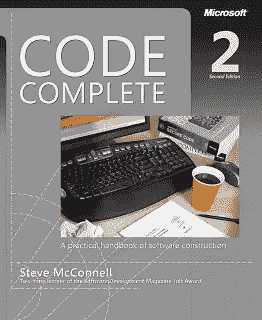
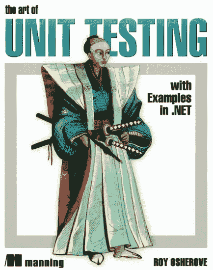
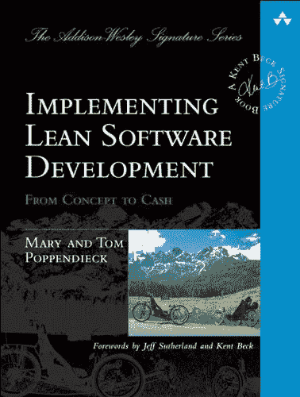
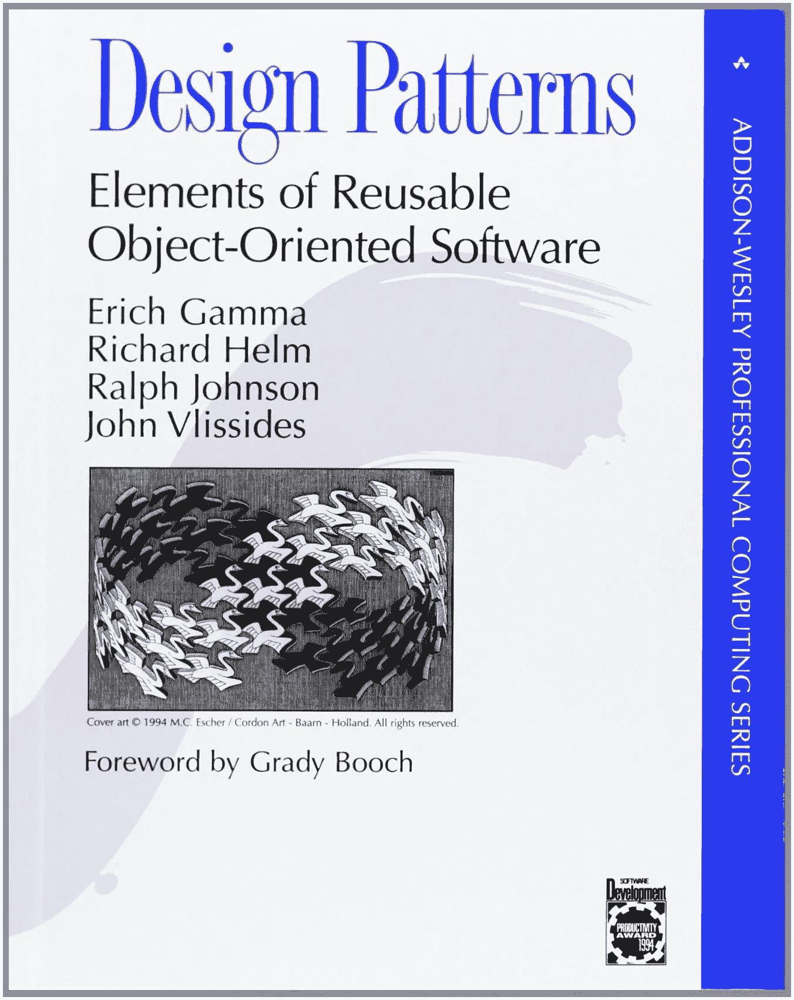

# 每个程序员和软件开发人员都应该阅读的 6 本编码书

> 原文：<https://medium.com/javarevisited/6-coding-books-every-programmers-and-software-developers-should-read-620124886c8f?source=collection_archive---------0----------------------->

编码是编程中不可或缺的一部分，我们都通过到处学习例子来学习编码。是的，我说的是自学的程序员和计算机专业的毕业生。专注的话学习编码很容易，但是更难的是写出好的代码。

你可以很容易地在 [Java](http://www.java67.com/2018/08/top-10-free-java-courses-for-beginners-experienced-developers.html) 、 [C++](http://www.java67.com/2018/02/5-free-cpp-courses-to-learn-programming.html) 、 [Ruby](http://www.java67.com/2018/02/5-free-ruby-and-rails-courses-to-learn-online.html) 或 [Python](https://javarevisited.blogspot.com/2018/12/10-free-python-courses-for-programmers.html) 中找到程序员，但是找到同时也是优秀程序员的程序员是非常困难的。一些大学有很好的课程和实践课来教授比其他人更好的编程，但是这些伟大的程序员大多数都是自学的程序员，他们通过看书、参加在线课程和自己做事来学习。

重点是自学在编程和编码领域非常重要，你不能仅仅依靠你的学院和大学来使你成为一名专业的程序员，你必须付出额外的努力来使你自己从群体中脱颖而出，还有什么比从那些经历过同样道路的人那里学习编码和编程智慧更好的呢？
Martin Fowler 是软件设计、开发和测试领域的另一位伟人，他关于重构的书是任何严肃的程序员的必读之作。

最近我看到一张信息图，是关于让你成为编程专家的 10 本书的。虽然我不同意他们所有的书，但我绝对同意前 6 本书和最后一本书，这是一本关于设计模式的经典之作。

我想和大家分享一下，如果你更倾向于 web 编程，你也会发现其余的书更有价值，但如果你是服务器端或[全栈 Java 程序员](/javarevisited/top-10-frameworks-full-stack-java-developers-can-learn-in-2020-5995021401e5)，你肯定会发现值得一读的前 5 本。

在编写更好的代码时，还有一件事对我帮助很大，那就是扎实的设计原则的知识，它们是一个小的指导原则集，如果遵循这些原则，就会产生更好的内聚性和松散耦合。

如果你不熟悉它们，我建议你通过 Udemy 上的 [**面向对象设计和架构的坚实原理**](https://click.linksynergy.com/deeplink?id=JVFxdTr9V80&mid=39197&murl=https%3A%2F%2Fwww.udemy.com%2Fsolid-principles-object-oriented-design-architecture%2F) 课程来学习它们。它们完全值得你花费时间和金钱。

 [## 面向对象设计和架构的坚实原则

### 我是一名专业的 Android 开发人员，有着广泛的技术兴趣。在微电子工作后…

udemy.com](https://click.linksynergy.com/deeplink?id=JVFxdTr9V80&mid=39197&murl=https%3A%2F%2Fwww.udemy.com%2Fsolid-principles-object-oriented-design-architecture%2F) 

# 提高编码技能的最佳书籍

这里有一个书单，会让你成为编码和编程方面的专家。如果你遵循这些书中给出的实用建议，你肯定会学到很多关于编码和编程的技巧。

这些不是告诉你如何写一个 for 循环或者如何检查 if 块上的条件的书，因为这可以从任何一本书学到。他们会教你如何使用这些工具来解决现实世界中的问题。

## 1.[重构，改进现有代码的设计](http://www.amazon.com/Refactoring-Improving-Design-Existing-Code/dp/0201485672?tag=javamysqlanta-20)

这本书是用 Java 写的，因为它是主要语言，但是它的概念和思想适用于任何面向对象的语言，比如 C++或 c#。这本书将教你如何将一个平庸的代码转换成一个伟大的代码，可以承受生产负荷和现实世界的软件开发噩梦，变化。最棒的是，Martin 实际上是带着你一步一步地学习你经常看到的代码，然后一步一步地转换成更灵活、更有用的代码。通过阅读他的例子，你将了解到[干净代码](http://javarevisited.blogspot.sg/2014/05/law-of-demeter-example-in-java.html)的真正定义。重构也是有经验的程序员的一个特征，因为你的工作领域现在不仅包括改进代码，还包括你的开发伙伴的代码。

**这里是购买本书的链接**——[重构，改进现有代码的设计](http://www.amazon.com/Refactoring-Improving-Design-Existing-Code/dp/0201485672?tag=javamysqlanta-20)

## 2.[清理代码](http://www.amazon.com/Clean-Code-Handbook-Software-Craftsmanship/dp/0132350882?tag=javamysqlanta-20)

这是我最喜欢的书，我一次又一次地把它推荐给我的程序员同事、读者、同事和学生。如果你问我关于编码、软件开发和编程的最好的书是什么，这就是了。

鲍伯·马丁叔叔不需要任何介绍，他已经撰写了一系列敏捷软件开发书籍，其中一些来自自己

1.  [清洁码](http://www.amazon.com/Clean-Code-Handbook-Software-Craftsmanship/dp/0132350882?tag=javamysqlanta-20)，
2.  [清洁编码器](https://www.amazon.com/Clean-Coder-Conduct-Professional-Programmers/dp/0137081073?tag=javamysqlanta-20)，
3.  [敏捷软件开发:原则、模式和实践](https://www.amazon.com/Software-Development-Principles-Patterns-Practices/dp/0135974445?tag=javamysqlanta-20)，
4.  [面向 Java 程序员的 UML](https://javarevisited.blogspot.com/2017/07/top-5-books-to-learn-uml-unified-modelling-language-java.html)
5.  [洁净建筑](https://www.amazon.com/Clean-Architecture-Craftsmans-Software-Structure/dp/0134494164?tag=javamysqlanta-20)，
6.  以及，[极限编程实践。](https://www.amazon.com/Extreme-Programming-Practice-James-Newkirk/dp/0201709376?tag=javamysqlanta-20)

虽然他的大部分书都是十年前的了，但它们仍然很有价值，我相信它们还会继续存在 20 年，或者至少会一直存在到面向对象编程进入商业领域。干净的代码不仅教你做什么，也教你不要做什么。

**这里是购买这本书的链接**——[干净代码](http://www.amazon.com/Clean-Code-Handbook-Software-Craftsmanship/dp/0132350882?tag=javamysqlanta-20)

《干净的代码》一书有代码味道的章节，这是一个各种程序员常见错误的大集合。它还有一些章节讲述了如何纠正它们，比如如何将一个长的 switch 语句转换成一个更好的基于开闭设计原则的模型，并利用继承和多态的力量。

它也有章节解释关于[**面向对象设计的坚实原则**](https://click.linksynergy.com/deeplink?id=JVFxdTr9V80&mid=39197&murl=https%3A%2F%2Fwww.udemy.com%2Fsolid-principles-object-oriented-design-architecture%2F) ，这是编写干净代码的关键。事实上，我第一次听说它们是在这本书里，从那以后，它们在编写更好的代码方面帮助了我很多。

这是任何程序员的必读之书。虽然示例是用 Java 给出的，这使得它对 Java 程序员更有价值，但它对其他程序员也同样有用，比如 C、 [C++](https://hackernoon.com/top-5-free-c-courses-to-learn-programming-in-2019-d27352277da0) 、 [Python](https://javarevisited.blogspot.com/2018/12/10-free-python-courses-for-programmers.html) 、 [JavaScript](https://javarevisited.blogspot.com/2018/06/top-10-courses-to-learn-javascript-in.html) 或任何其他 [OO 实践者。](/javarevisited/10-oop-design-principles-you-can-learn-in-2020-f7370cccdd31)

## 3.[代码完成](http://www.amazon.com/Code-Complete-Practical-Handbook-Construction/dp/0735619670?tag=javamysqlanta-20)

我想这是大多数人读过的关于编码实践的书。在 10000 英尺的高空，它对我来说就像是 C++开发人员的干净代码的对应物。尽管我在阅读《干净的代码》之前已经通读了这本书。很久以前，我的一个朋友告诉我，在他的小公司里，每个新加入公司的开发人员都会收到一份全新的完整代码。

对于那个小公司来说，这是一个很棒的做法，但后来我知道，即使是微软也给他们的员工分发这本书，我不知道这有多少真实性，但这本书确实让我相信了。

这是任何程序员的必读之作，但更是 C、C++程序员的必读之作。就像我推荐 [Java 开发者](https://javarevisited.blogspot.com/2018/05/10-tips-to-become-better-java-developer.html)在阅读代码完整之前先阅读[干净代码](/javarevisited/clean-code-a-must-read-coding-book-for-programmers-9dc80494d27c)一样，我也推荐 C++开发者在接触干净代码之前先阅读这本书。

尽管它们在[最佳实践和要避免的常见错误](http://javarevisited.blogspot.sg/2012/02/java-mistake-1-using-float-and-double.html)方面有很多重叠，但它们都值得一试。最终，你会发现其中一本比其他的更贴近你的心。

**这里是购买本书的链接**——[代码完整](http://www.amazon.com/Code-Complete-Practical-Handbook-Construction/dp/0735619670?tag=javamysqlanta-20)

鉴于我的 Java 背景和 Bob 叔叔的写作风格，我发现阅读干净的代码比完整的代码更多。正如信息图所示，*“代码完成帮助开发人员用最高质量的代码写出更好的软件。”*

顺便说一句，如果你热衷于编写干净的代码，你也可以看看 Pluralsight 上科里之家的 [**干净的代码:为人类编写代码**](https://pluralsight.pxf.io/c/1193463/424552/7490?u=https%3A%2F%2Fwww.pluralsight.com%2Fcourses%2Fwriting-clean-code-humans) 。这是一门罕见的在线课程，它不仅讲述了如何编写干净的代码，还介绍了一些例子。

## 4.单元测试的艺术

如果有一件事我想对项目和程序员进行改进，那就是他们的单元测试能力。经过这么多年或者认识到单元测试对于一个专业开发人员来说是必须的，你很难找到一个好的单元测试并遵循 TDD 的开发人员。虽然我并不严格遵循 TDD，但至少你必须为你编写的代码和你维护的代码编写单元测试。项目也没有什么不同，除了开源项目，许多商业内部企业项目都缺乏单元测试。

如果你是项目经理、团队领导或技术领导，创建一个适当的软件开发过程，包括代码审查、单元测试、JIRA、编码标准、SVN 提交策略和部署实践。你的工作不仅仅是创建这些过程，还要确保开发人员不仅遵循这些过程，还要从中学习。

**这里是购买这本书的链接** — [单元测试的艺术](http://javarevisited.blogspot.com/2014/08/top-5-books-to-learn-unit-testing-junit-tdd-Java-programmers.html)

即使您投入了少量的资金来帮助开发人员学习和采用这种实践，您也将在代码质量、错误修复、维护和培训方面获得大量的时间。带有单元测试的项目更容易维护和更改。

开发人员也发现学习一个新的带有单元测试的代码库比学习那些需要[数据库](/javarevisited/7-free-courses-to-learn-database-and-sql-for-programmers-and-data-scientist-e7ae19514ed2)、MQ 和企业服务器设置的单片代码更容易。单元测试的艺术解决了这个问题。这本书告诉你一个失败的项目和一个成功的项目之间的区别，以及一个可维护的代码库和你在测试数据库和其他技术时的代码库之间的区别。

这本书有 the.NET 的例子，但对任何程序员来说都不难。顺便说一下，对于 Java 开发人员，我也分享了几本好的 JUnit 书籍和几门免费课程来学习 JUnit，这是用 Java 编写单元测试的最重要的工具。

并且，如果你只是想做一件事，从 Udemy 上的 30 步 课程中的 [**开始用 Junit & Mockito 学习 Java 单元测试。学习 Java 中的单元测试是一门很棒的课程。**](https://click.linksynergy.com/deeplink?id=JVFxdTr9V80&mid=39197&murl=https%3A%2F%2Fwww.udemy.com%2Fcourse%2Fmockito-tutorial-with-junit-examples%2F)

 [## 学习 Mockito 和 JUnit 教程(单元测试)

### 编写伟大的单元测试将优秀的程序员与伟大的程序员区分开来。在本课程中，您将学习如何…

udemy.com](https://click.linksynergy.com/deeplink?id=JVFxdTr9V80&mid=39197&murl=https%3A%2F%2Fwww.udemy.com%2Fcourse%2Fmockito-tutorial-with-junit-examples%2F) 

## 5.[实施精益软件开发:从概念到现金](https://www.amazon.com/Implementing-Lean-Software-Development-Addison-Wesley-ebook/dp/B00HNB3VQE?tag=javamysqlanta-20)

这本书告诉你如何在整个软件组织中推动高价值的变革，并使之持续下去。它向您展示了如何在真实的项目、环境和公司中实施精益。汤姆和玛丽·波彭迪克(poppendieck.com)在世界范围内教授和咨询软件精益原则。她的方法确定了真正的商业价值，并使产品团队认识到这种价值，她的新书《领先精益软件开发》是为各种类型的领导者而写的，比如项目领导者、项目经理、C 级管理人员等等。

我知道这本书有点晚，但它对你的书本身是一个很好的补充，尤其是如果你渴望成为一名技术领导者或已经在做这份工作。

**这里是购买这本书的链接** — [实施精益软件开发:从概念到现金](https://www.amazon.com/Implementing-Lean-Software-Development-Addison-Wesley-ebook/dp/B00HNB3VQE?tag=javamysqlanta-20)

## 6.[设计模式，可复用面向对象软件的要素](http://javarevisited.blogspot.com/2013/06/5-must-read-books-to-learn-object.html)

如果你还没有读过，我相信你一定听说过这本书。这是经典的 GOF(四人帮)设计模式的书籍。

我们应该感谢四人帮；Eric Gamma、Richard Helm、Ralph Johnson 和 John Vlissides，感谢他们创造、巩固并将其引入主流软件开发的优秀作品。这本书列出了常见设计问题的简单明了的解决方案。它包含了 23 种面向对象的设计模式来创建更加灵活、优雅、最终可重用的设计，而无需重新发现设计方案本身。

**这里是购买这本书的链接**——[设计模式，可重用面向对象软件的要素](http://javarevisited.blogspot.com/2013/06/5-must-read-books-to-learn-object.html)

您可以通过参加 Pluralsight 上的 [**设计模式库**](https://pluralsight.pxf.io/c/1193463/424552/7490?u=https%3A%2F%2Fwww.pluralsight.com%2Fcourses%2Fpatterns-library) 课程来进一步加强您的学习，该课程不仅会教授这 23+种模式，还会教授其他重要的软件设计模式，这些模式对于构建能够经受住时间考验的长寿、良好的软件来说至关重要。

顺便说一句，你需要一个 [**Pluralsight 会员**](https://pluralsight.pxf.io/c/1193463/424552/7490?u=https%3A%2F%2Fwww.pluralsight.com%2Flearn) 才能进入这门课程，费用大约是每月 29 美元或每年 299 美元。这可能看起来有点昂贵，但这是我去年做的最好的投资。

它让您可以访问 Pluralsight 上超过 5000 门关于最新技术的在线课程，这是提升您作为专业程序员的技能的关键。

即使你没有会员资格，你也可以通过参加他们的 [**10 天免费通行证**](http://pluralsight.pxf.io/c/1193463/424552/7490?u=https%3A%2F%2Fwww.pluralsight.com%2Flearn) 来免费参加这门课程，该通行证允许你有 200 分钟的时间观看他们的任何课程。

这就是学习编码和编程的前六本书的全部内容。我知道阅读和学习一些东西很难，但这是当你成为一名程序员时所面临的挑战。在这个领域，学习和适应的能力决定了一个好的和伟大的开发者。

其他**编程** **文章你可能喜欢**探讨

*   Java 和 Web 开发人员应该学习的 10 件事
*   [Java 开发者应该知道的 10 个测试工具](http://javarevisited.blogspot.sg/2018/01/10-unit-testing-and-integration-tools-for-java-programmers.html)
*   [Java 开发者应该学习的 5 个框架](http://javarevisited.blogspot.sg/2018/04/top-5-java-frameworks-to-learn-in-2018_27.html)
*   [学习 Python 编程语言的 10 个理由](https://javarevisited.blogspot.sg/2018/05/10-reasons-to-learn-python-programming.html)
*   [每个程序员都应该读的十大算法书](http://www.java67.com/2015/09/top-10-algorithm-books-every-programmer-read-learn.html)
*   [每个 Java 开发者都应该学习的 20 个库](https://javarevisited.blogspot.com/2018/01/top-20-libraries-and-apis-for-java-programmers.html)
*   【Java 开发人员在日常工作中使用的 10 种工具
*   [每个 Java 程序员都应该阅读的 10 本书](http://www.java67.com/2018/02/10-books-java-developers-should-read-in.html)
*   [深入学习数据结构和算法的 10 门免费课程](http://www.java67.com/2019/02/top-10-free-algorithms-and-data.html)
*   [十大编程语言开始学习编码](http://www.java67.com/2017/12/10-programming-languages-to-learn-in.html)

感谢您阅读本文。如果你喜欢这些编码和编程书籍，那么请与你的朋友和同事分享。如果您有任何问题或反馈，请留言。

> 如果你想翻译这篇文章，或者在你的博客、网站或出版物上重新发表，请给我的电子邮件 savingfunda@gmail.com 留言，我通常会答应的。

**附言**——把书当成你的朋友，听播客，看干净的代码讲座，最重要的是写代码并重构它，直到你能说它是干净的。如果你渴望成为一名更好的开发人员，请务必阅读我的 [**10 条成为专业程序员的技巧**](http://javarevisited.blogspot.sg/2014/01/10-tips-to-improve-programming-skill-become-better-programmer.html) 。

 [## 提高编程技能并成为更好的程序员、开发人员的 10 个技巧

### 很多 Java 开发者问我如何成为一个更好的程序员？我如何提高我的编程技能？或者我擅长…

javarevisited.blogspot.sg](http://javarevisited.blogspot.sg/2014/01/10-tips-to-improve-programming-skill-become-better-programmer.html) 

**p . s . s .**——如果你是编程世界的新手，想学习编程成为一名程序员，那么我建议你从 Python 开始，没有比何塞·波尔蒂利亚的《Python 3:从零到英雄 》更好的课程了。

 [## Python 训练营:学习 Python 编程和代码培训

### 这是 Udemy 上最全面、最直接的 Python 编程语言课程！你是否…

bit.ly](http://bit.ly/2BY5LJC) 

**P. P. S —** 快速更新，[**Pluralsight 免费周末**](https://pluralsight.pxf.io/c/1193463/871467/7490) 就在这里，你可以在这个周末免费访问所有 7000+ Pluralsight 课程和项目。好好利用这一点，学习一项新技能或提升现有技能。不要错过这个，这只是这个周末。这又是一个链接:

 [## Pluralsight |免费周末

### 注册以获得免费周末开始时的通知，这样你就不会错过了。免费周末从 8 月 14 日星期五上午 9 点开始…

pluralsight.pxf.io](https://pluralsight.pxf.io/c/1193463/871467/7490)