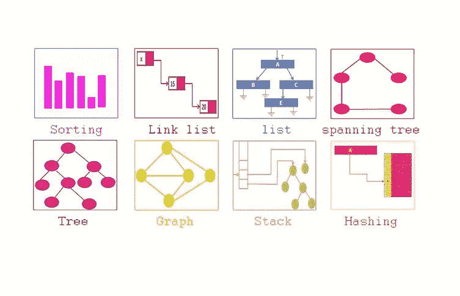
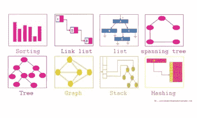
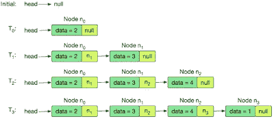
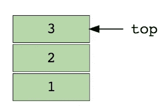
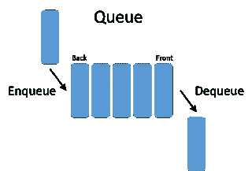
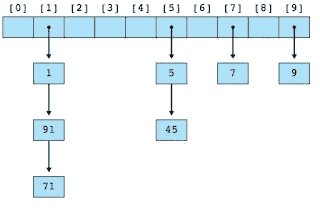

# 每个程序员都应该学习的 6 种数据结构

> 原文：<https://medium.com/javarevisited/6-data-structures-every-programmer-should-learn-a24de0f3fc3b?source=collection_archive---------0----------------------->

## 数据结构和算法是编程的支柱，这里是每个 Java 程序员都应该学习的 6 个基本数据结构

大家好，数据结构是程序的组成部分。甚至有人说**“数据结构+算法=程序”**。这就是为什么良好的数据结构知识对任何程序员都非常重要，包括 Java 开发人员，这也是为什么每个程序员都应该努力学习尽可能多的数据结构和算法。

早些时候，我已经分享了[最佳数据结构和算法课程](/javarevisited/top-10-data-structure-and-algorithms-courses-for-java-developers-25161ee2edc0)、[书籍](/javarevisited/10-best-books-for-data-structure-and-algorithms-for-beginners-in-java-c-c-and-python-5e3d9b478eb1)、[数据结构问题](/javarevisited/50-data-structure-and-algorithms-interview-questions-for-programmers-b4b1ac61f5b0)和[网站来练习数据结构](/javarevisited/7-best-places-to-practice-coding-problems-and-learn-data-structures-and-algorithms-for-interviews-646f7fe41350)，在这篇文章中，我将分享每个程序员应该学习的 6 种基本数据结构以及何时使用它们。

数据结构为您提供了存储数据的选项，以便您可以根据自己的需求访问数据。例如，如果您想要基于用户名进行快速搜索，那么您可以使用 [HashMap](https://www.java67.com/2013/02/10-examples-of-hashmap-in-java-programming-tutorial.html) ，但是这只有在您知道数据结构及其在您所使用的编程语言中的实现的情况下才有可能，这也是您将在本文中学到的。

Java API 提供了对通用数据结构的内置支持，这对于编写数组、链表、映射、集合、堆栈和队列等程序是必不可少的。不需要自己实现这些数据结构，可以直接在程序中使用，这得益于 Java API 提供的丰富高效的实现。

这也是为什么 Java 是最好的编程语言的一个原因。因为数据结构是任何程序的核心，而特定数据结构的选择会显著影响 Java 应用程序的功能和性能，所以探索 Java 中可用的不同数据结构是值得的。

这些数据结构中许多是非常流行的 Java 集合框架的一部分，几乎所有的 Java 程序都可能使用集合，除了 [hello world](http://java67.blogspot.sg/2013/03/helloworld-in-java-how-to-write-compile-example-tutorial.html) 以这样或那样的形式使用集合。

在本 Java 教程中，我们将看一看标准的数据结构。数组、链表、堆栈、队列、映射、集合，以及它们在 Java 中是如何实现的，以及如何使用它们。

顺便说一句，如果你是数据结构与算法领域的完全初学者，那么我也建议你先去上一堂类似 [**数据结构与算法:使用 Java**](https://click.linksynergy.com/fs-bin/click?id=JVFxdTr9V80&subid=0&offerid=323058.1&type=10&tmpid=14538&RD_PARM1=https%3A%2F%2Fwww.udemy.com%2Fdata-structures-and-algorithms-deep-dive-using-java%2F) 的综合课程，学习基础知识并掌握它。

数据结构和算法对于成为一名更好的开发人员至关重要，您在时间、金钱和学习努力方面的任何投资都将在未来很长一段时间内为您带来回报。

# Java 程序员和软件开发人员的 6 种基本数据结构

这里是我列出的来自标准 Java API 和编程语言本身的基本数据结构，因为数组是编程语言本身的一部分，而其他数组是流行的 Java 集合框架的一部分。

随着 Java 8 的出现，出现了 [Lambda 表达式](http://www.java67.com/2017/06/10-points-about-lambda-expressions-in-java-8.html)、[函数接口](https://www.java67.com/2018/10/java-8-stream-and-functional-programming-interview-questions-answers.html)和[流](https://www.java67.com/2014/04/java-8-stream-examples-and-tutorial.html)，这将赋予 Java 集合框架新的生命，尤其是在利用现代 CPU 的多核架构的背景下。初学者应该意识到 Java 编程中可用的基本数据结构，并充分利用它们。

## 1.排列

Java 编程语言在语言本身中提供了对数组的内置支持。它有一个特殊的语法来声明类似 int[]的数组，这是一个原始 int 类型的数组。您可以创建引用类型和基元的数组。

此外，与 C 编程语言不同，Java 中的数组是有界的，如果使用无效的索引，将会出现 ArrayIndexOutOfBoundException。

Java 中的数组也是同构的，你不能在一个数组中存储多种类型的对象——就像你只能在一个 String[]中存储一个 String，如果你试图存储 Integer，你会在运行时得到 ArrayStoreException。

您可以查看进一步查看 [**数据结构和算法:使用 Java**](https://click.linksynergy.com/fs-bin/click?id=JVFxdTr9V80&subid=0&offerid=323058.1&type=10&tmpid=14538&RD_PARM1=https%3A%2F%2Fwww.udemy.com%2Fdata-structures-and-algorithms-deep-dive-using-java%2F) 深入了解数组和其他基本数据结构和算法，更重要的是如何在 Java 程序中使用它们。

## 2.链表

除了数组，链表是编程中另一种基本的数据结构。Java 提供了一个双向链表实现，如 java.util.LinkedList，只要需要链表数据结构，就可以使用这个类。

由于 LinkedList 是集合框架的一部分，它还实现了集合和 Iterable 接口，这允许对它们进行迭代。您可以查看这篇文章，了解更多关于 Java 中的 [LinkedList。](http://java67.blogspot.com/2012/12/difference-between-arraylist-vs-LinkedList-java.html)

## 3.哈希表

哈希表、映射或字典是我见过的最通用的数据结构之一。我偶尔会使用 Map，幸运的是，Java API 为不同的需求提供了几种 Map 数据结构的实现，比如 HashMap、Hashtable 和 ConcurrentHashMap。

它也被称为 map 或 dictionary 数据结构，你可能听说过 Python 中的 Dictionary，和 Java 中的 Map 一样。

如果您知道键，map 为您提供了 O(1)函数来获取一个值，这在大多数 Java 应用程序中是一个非常自然的用例。

你可以进一步查看 Pluralsight 上的 [**算法和数据结构—第 1 部分和第 2 部分**](https://pluralsight.pxf.io/c/1193463/424552/7490?u=https%3A%2F%2Fwww.pluralsight.com%2Fcourses%2Fads-part1) 课程，了解更多关于 Java 中的哈希表、映射或字典数据结构的知识。

## 4.堆

Java API 还提供了一个实现为 java.util.Stack 的堆栈数据结构，这个类扩展了传统的 Vector 类来存储元素。因为堆栈是 LIFO(后进先出)数据结构，所以它提供了一个 push()方法来插入对象，并提供了一个 pop()方法来从顶部消费元素。

堆栈在不同的编程任务中非常流行，比如计算表达式。对了，不要把栈数据结构和[栈内存](http://javarevisited.blogspot.com/2013/01/difference-between-stack-and-heap-java.html)混为一谈，栈内存在 Java 中是用来存储局部变量和方法帧的。

顺便说一句，如果你正在为面试复习你的数据结构概念，我也建议你去参加关于 Educative 的[**Java 中的数据结构:面试复习**](https://www.educative.io/collection/5642554087309312/5724822843686912?affiliate_id=5073518643380224) 课程，为你的面试做好准备。

## 5.长队

Java 集合框架中也有队列数据结构作为接口，还有一些具体的实现，如 [ArrayBlockingQueue](https://javarevisited.blogspot.com/2012/12/blocking-queue-in-java-example-ArrayBlockingQueue-LinkedBlockingQueue.html#axzz6iYmMFnsA) 、 [LinkedList](https://www.java67.com/2012/12/difference-between-arraylist-vs-LinkedList-java.html) 和 [PriorityQueue](http://www.java67.com/2015/07/how-to-use-priorityqueue-in-java-example.html) 。

虽然您也可以通过使用 LinkedList 或 array 来实现 Queue，但是使用已经过测试的现有类要好得多。

这不仅减少了开发时间，还降低了应用程序的整体代码质量和性能。BlockingQueue 是队列接口的线程安全扩展，可用于在 Java 中实现[生产者-消费者模式。](http://javarevisited.blogspot.co.uk/2012/02/producer-consumer-design-pattern-with.html)

## 6.一组

集合是一种特殊的数据结构，它**不允许重复**。这是一个很好的数据结构，可以存储 Id 之类的唯一元素，例如 EmployeeId、OrderId、TradeId 等。当你存储需要唯一的数据时，你可以使用集合数据结构。如果您尝试插入重复项，Set 将不会接受它，它的方法将返回 false 以指示插入失败。

Java 集合 API 提供了一些集合的实现，比如 [HashSet、TreeSet 和 LinkedHashSet](http://javarevisited.blogspot.com/2012/11/difference-between-treeset-hashset-vs-linkedhashset-java.html) ，这对于大多数情况来说已经足够了。那些集合，除了开始集合，还提供排序和插入顺序。

这就是 Java 开发人员最基本的数据结构。除了这些基本的数据结构，Java 集合框架中还有很多，包括并发数据结构，如 BlockingQueue 和 ConcurrentHashMap。对于任何经验水平的 Java 开发人员来说，探索 Java 5 和 6 中引入的新集合类都有助于更好地利用 Java API。

**继续学习**
[数据结构和算法:深度学习使用 Java](https://click.linksynergy.com/fs-bin/click?id=JVFxdTr9V80&subid=0&offerid=323058.1&type=10&tmpid=14538&RD_PARM1=https%3A%2F%2Fwww.udemy.com%2Fdata-structures-and-algorithms-deep-dive-using-java%2F)
[Thomas h . Corman 的算法简介](http://www.amazon.com/dp/0072970545/?tag=javamysqlanta-20)
[探索编码面试:编码问题的模式](https://www.educative.io/collection/5668639101419520/5671464854355968?affiliate_id=5073518643380224)

您可能喜欢的其他**数据结构和算法**

*   学习 Java 数据结构的 10 门课程([门课程](/javarevisited/top-10-data-structure-and-algorithms-courses-for-java-developers-25161ee2edc0))
*   5 深入学习数据结构和算法的书籍([书籍](https://javarevisited.blogspot.com/2015/07/5-data-structure-and-algorithm-books-best-must-read.html))
*   程序员 75+编码面试问题([题](http://www.java67.com/2018/06/data-structure-and-algorithm-interview-questions-programmers.html))
*   如何在 Java 中反转一个数组？([解](https://javarevisited.blogspot.com/2015/03/how-to-reverse-array-in-place-in-java.html))
*   7 门学习数据结构与算法的最佳课程([最佳课程](/javarevisited/7-best-courses-to-learn-data-structure-and-algorithms-d5379ae2588))
*   如何在 Java 中去除数组中的重复元素？([解](https://javarevisited.blogspot.com/2014/01/how-to-remove-duplicates-from-array-java-without-collection-API.html))
*   10 门面向程序员的免费数据结构与算法课程([课程](http://www.java67.com/2019/02/top-10-free-algorithms-and-data.html))
*   如何用 Java 实现一个递归的前序算法？([解](http://www.java67.com/2016/08/binary-tree-inorder-traversal-in-java.html)
*   如何用 Java 实现二叉查找树？([解](https://javarevisited.blogspot.com/2015/10/how-to-implement-binary-search-tree-in-java-example.html)
*   无递归的后序二叉树遍历([解](http://www.java67.com/2017/05/binary-tree-post-order-traversal-in-java-without-recursion.html))
*   7 本学习数据结构和算法的免费书籍([书籍](/javarevisited/7-free-books-to-learn-data-structure-and-algorithms-in-java-346b2d70db10))
*   如何不用递归打印二叉树的叶节点？([解](http://www.java67.com/2016/10/how-to-print-leaf-nodes-of-binary-tree-without-recursion-in-java.html))
*   10 数据结构与编程课程破解面试([课程](/hackernoon/10-data-structure-algorithms-and-programming-courses-to-crack-any-coding-interview-e1c50b30b927))
*   二叉树中的迭代前序遍历([解](http://www.java67.com/2016/07/binary-tree-preorder-traversal-in-java-without-recursion.html)
*   递归后序遍历算法([解](http://www.java67.com/2016/10/binary-tree-post-order-traversal-in.html))
*   递归有序遍历算法([解](http://www.java67.com/2016/09/inorder-traversal-of-binary-tree-java-example.html))
*   来自访谈的 100+数据结构编码问题([问题](http://www.java67.com/2018/06/data-structure-and-algorithm-interview-questions-programmers.html))

感谢您阅读本文。如果你喜欢这个 Java 数据结构和算法教程，那么请分享给你的朋友和同事。如果您有任何问题或反馈，请发表评论。

**P. S.** —如果你正在寻找一些免费的算法课程来提高你对数据结构和算法的理解，那么你也应该查看 Udemy 上的[**Java 初学者数据结构**](http://bit.ly/2hhloDL) 课程。这是免费的，你只需要一个 Udemy 帐户就可以参加这个课程。

<https://coursera.pxf.io/c/3294490/1164545/14726?u=https%3A%2F%2Fwww.coursera.org%2Flearn%2Falgorithms-part1> 