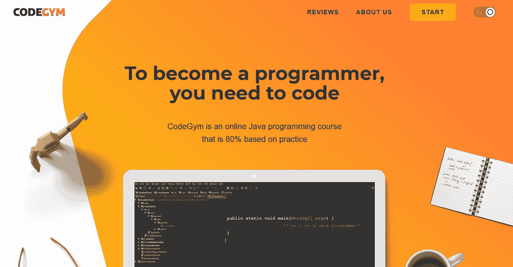
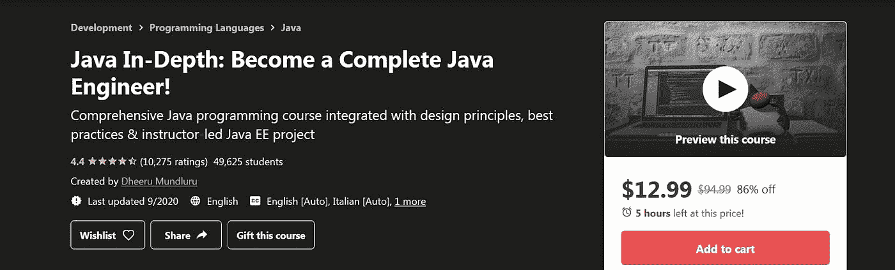

# 6 门有效的 Java 初学者课程

> 原文：<https://medium.com/javarevisited/6-effective-java-courses-for-beginners-53aa68d9026f?source=collection_archive---------2----------------------->

[Firos nv](https://unsplash.com/@firosnv?utm_source=unsplash&utm_medium=referral&utm_content=creditCopyText) 在 [Unsplash](https://unsplash.com/?utm_source=unsplash&utm_medium=referral&utm_content=creditCopyText) 上的照片

作为一名经验丰富的 Java 导师，我可以看到，多年来，Java 仍然是最流行的语言之一。最近的 T4 TIOBE 指数支持这一证据。这种语言仍然是就业市场上最受欢迎的语言之一。这就是为什么很多人都在努力学习它，成为一名 [Java 开发者](/javarevisited/top-10-frameworks-full-stack-java-developers-can-learn-in-2020-5995021401e5)。

好消息是，借助一些优秀的在线资源，你可以自学 Java。当然，前提是你在学习上花了足够的时间和精力！

因此，如果你下定决心要掌握这项技术，看看你有哪些触手可及的选择吧。这里有一些我最喜欢的学习 Java 的在线地方。

# 6 门有效的 Java 初学者课程

## 1. [CodeGym](https://codegym.cc/)

CodeGym 是一个精心构建的非常方便的 Java 学习平台，基于“边做边学”的理念。它非常适合那些有很多承诺的人和那些努力分配更多空闲时间学习的人。它是游戏化的，组织良好的。这门课 80%是实践，只有 20%是理论。

**主要好处:**

*   该资源基于超过 1200 个编码任务。它们都是实用的，并包括真实世界的例子
*   该课程包含解释性讲座，涵盖从初级到高级的所有主题。你可以很容易地从零开始，逐渐成为一名有经验的程序员
*   一个很大的优势是用户友好的移动应用程序。你可以在任何地方学习，随时随地，在公园里，在家里，在你选择的任何地方
*   虚拟导师将帮助你完成学习过程。
*   为了某种讨论或精神支持，CodeGym 有一个活跃的 Java 学习者社区
*   结构良好的课程将引导你一步一步地完成学习过程。你不必在每次前进的时候都去想下一步该做什么

**支持的平台** : [桌面](https://codegym.cc/)，[安卓](https://play.google.com/store/apps/details?id=com.hitechrush.codegym&hl=en)。

**定价**:包括免费选项，每月最高 50 美元。

**主要功能:**

*   对超过 1200 个编码任务的访问
*   关于核心 Java 主题和更高级别的讲座
*   即时代码验证功能，解决代码任务的技巧
*   本课程以线性游戏化故事的形式组织
*   小型讲座允许你计划你的学习时间

## 2. [Java 深入:成为一名完整的 Java 工程师！](https://www.udemy.com/course/java-in-depth-become-a-complete-java-engineer/)

《Java 深度》是一门非常详细的 Udemy 课程，完美的帮助实现了从零开始学习 Java 的目标。这些解释很容易理解。这些主题涵盖了新手想要了解的核心主题，如[集合框架](/javarevisited/7-best-java-collections-and-stream-api-courses-for-beginners-in-2020-3ad18d52c38)、[泛型](https://javarevisited.blogspot.com/2020/04/50-java-collection-and-generics-interview-questions-answers.html)、[多线程](/javarevisited/6-multithreading-and-concurrency-books-every-java-programmer-should-read-b6a08d2aae54)等。在这类学习上花足够的时间，会让你对这些方面有深入的了解。

**主要好处:**

*   该课程不仅介绍了 Java 语言的核心和高级特性，还讲授了 Java 虚拟机(JVM)的内部原理
*   作为一个更复杂的挑战，学习者可以在教师的帮助下，通过开发基于 Java EE 的 web 应用程序来获得真实世界的经验
*   学习如何在实际任务中使用 JSP、Servlets 和 MySQL 等技术的可能性
*   本课程包括 Java 相关技术的概述，例如 web 应用程序
*   提供电视或移动接入

**支持的平台** : [桌面](https://www.udemy.com/course/java-in-depth-become-a-complete-java-engineer/)，[安卓](https://play.google.com/store/apps/details?id=com.udemy.android&hl=en)， [iOS](https://apps.apple.com/us/app/udemy-online-video-courses/id562413829) 。

价格:全程 74.99 美元

**主要特点:**

*   学习路径将引导您浏览超过 66 小时的视频、22 篇文章、291 个可下载资源和 15 个编码练习
*   基于项目的学习从一开始就提供实践经验
*   成功的学生将获得结业证书。此外，您还可以成为甲骨文认证助理

## 3.[Java Fundamentals by plural sight](https://www.pluralsight.com/paths/java)

这门课程的目的是在短时间内提供初步的基础知识。它不需要任何以前的编程经验，涵盖了所有主要的开发环境，如服务器端、客户端或 Android。

该课程的创建者拥有 30 多年的软件开发经验。他的课程非常注重实践，由于任务数量相对较少，因此很容易完成。学完[【Java 基础】](https://www.java67.com/2018/08/top-10-free-java-courses-for-beginners-experienced-developers.html)，你一定会觉得自己是一个成功者！

**主要好处:**

*   该课程对[固体](/javarevisited/10-oop-design-principles-you-can-learn-in-2020-f7370cccdd31)的概念进行了扎实的介绍。SOLID 是五个主要面向对象设计原则的首字母缩写，这些原则使您的代码有意义
*   实际任务是通过做一些与现实相关的事情来学习技术的好方法
*   课时少，很容易在很短的时间内完成课程

**支持的平台** : [桌面](https://www.pluralsight.com/courses/java-fundamentals-language)，[安卓](https://play.google.com/store/apps/details?id=com.pluralsight&hl=en)， [iOS](https://apps.apple.com/gb/app/pluralsight-learn-tech-skills/id431748264)

**定价:**月费 29 美元，年费——299 美元，保费——449 美元。团队和企业包也是可用的。

**主要功能:**

*   本课程简短明了，每一个学习班次不需要太多时间
*   它包含互动视频和测验，这本身就很有趣
*   有许多真实世界的例子可以帮助你弄清楚它到底是如何工作的
*   它不仅包括语法，还包括设计模式

## 4.[杜克大学 Java 认证(Coursera)](https://www.coursera.org/specializations/java-programming)

杜克大学的课程涵盖了 Java 本身之外的几个重要主题。它侧重于用解决问题的方法教授编码。这是通过基于项目的学习和提供软件开发的基本技能来实现的。这门课程不需要任何编程经验。此外，您还将学习 Android 开发的基础知识。

**主要好处:**

*   本课程以项目为基础。在学习过程中，你会做一个推荐引擎，一个互动网页，以及其他类型的工作。课程结束时，你将有一个作品集可以展示
*   学习过程意味着接受分级作业和同龄人的反馈
*   你可以选择在 LinkedIn 上分享你的结业证书

**支持的平台** : [桌面](https://www.coursera.org/specializations/java-programming)，[安卓](https://play.google.com/store/apps/details?id=org.coursera.android&hl=en_US)， [iOS](https://apps.apple.com/us/app/coursera-learn-new-skills/id736535961)

**定价:**免费

**主要功能:**

*   该课程教授任何软件工程师都需要的基本技能
*   你将学习如何设计算法，测试和调试你的程序
*   认证分为五个子课程，涵盖语言的各个方面
*   本课程包括几个应用你知识的实际项目

## 5. [Java 编程完全初学者 250 步](https://www.udemy.com/course/java-programming-tutorial-for-beginners/)

这是最近的 Java 课程之一。它包括只在 Java 9 中引入的新闻工具(例如 JShell)。该课程涵盖了基本的编程概念和高级的面向对象概念。此外，它包含 200 多个代码示例。该课程的创建者承诺，在学习结束时，你将拥有足够的专业知识来应对工作面试。

**主要好处:**

*   一个非常清晰的解释，涵盖了函数式和面向目标的编程，以及相当现代的教学方法
*   本课程由 302 节课组成，总时长约为 26 小时
*   开始学习不需要任何编程经验

**支持的平台** : [桌面](https://www.udemy.com/course/java-programming-tutorial-for-beginners/)，[安卓](https://play.google.com/store/apps/details?id=com.udemy.android&hl=en)， [iOS](https://apps.apple.com/us/app/udemy-online-video-courses/id562413829)

**定价:** $149.99

**主要功能:**

*   该课程包含 200 多个真实世界的代码示例
*   学生学习函数式编程和面向对象编程的基础。包括高级主题
*   成功的学员将获得结业证书

## 6.[完整的 Java Masterclass](https://www.udemy.com/course/java-the-complete-java-developer-course/)

这是关于 Java 的顶级 Udemy 课程之一。讲师拥有超过 18 年的 Java 编程经验，教授如何使用 [Java 8](https://dzone.com/articles/top-5-free-java-8-and-9-courses-for-programmers) 和 Java 11。该课程包含一个重要的基础，将进一步导致对 [Spring 框架](/javarevisited/10-best-online-courses-to-learn-spring-framework-in-2020-f7f73599c2fd?source=---------7------------------)、 [Android 开发](/javarevisited/top-5-courses-to-learn-android-for-java-programmers-667e03d995b4)以及更多内容的理解。如果您成功完成本课程，您将能够通过 Oracle Java 认证。

**主要好处:**

*   教师认真对待学生的反馈，并在此基础上做出改进。此外，在开始新的讲座之前，他会回顾前一讲的知识
*   这门课程非常全面，许多学生在完成后能够找到他们的第一份工作
*   除了技术方面，你还将了解工程师用来提高生产力的方法

**支持的平台** : [桌面](https://www.udemy.com/course/java-the-complete-java-developer-course/)，[安卓](https://play.google.com/store/apps/details?id=com.udemy.android&hl=en)， [iOS](https://apps.apple.com/us/app/udemy-online-video-courses/id562413829)

**定价:** $149.99

**主要功能:**

*   400 场讲座，大约 80 小时的内容
*   36 个编码练习
*   每个话题后的挑战
*   竣工证明
*   通过手机和电视访问

# 包裹

如你所见，你可以选择如何学习 Java。选择最适合自己的，在学习的过程中获得乐趣就好。最主要的一点其实就是开始学习，坚持有规律的做。然后一步一步，你会成为你想要成为的人:一个有经验的 Java 开发人员。这可能会增加你的动力:一旦你找到了第一份工作，你将会是一名多年来需求量很大的专业人士。自己看吧！