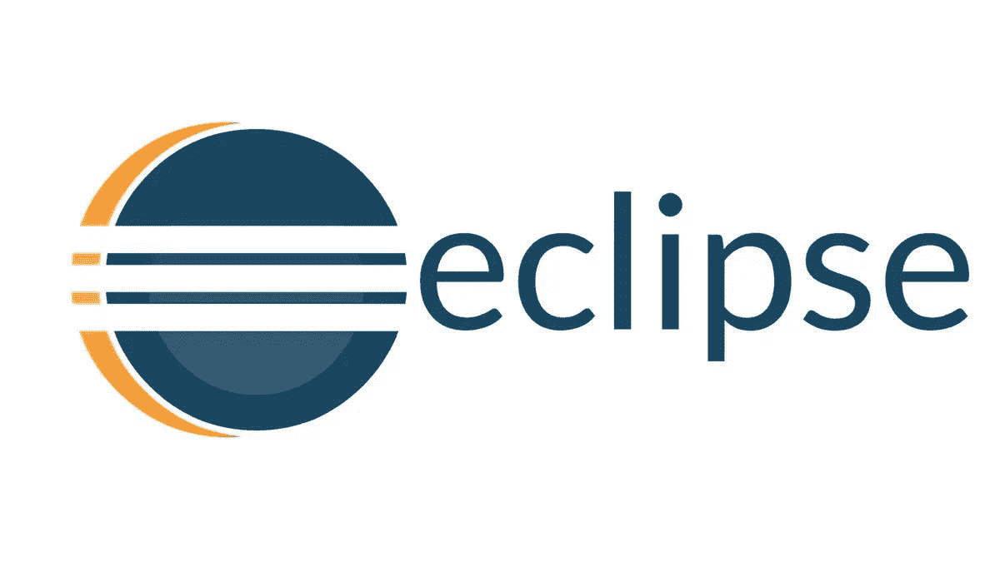
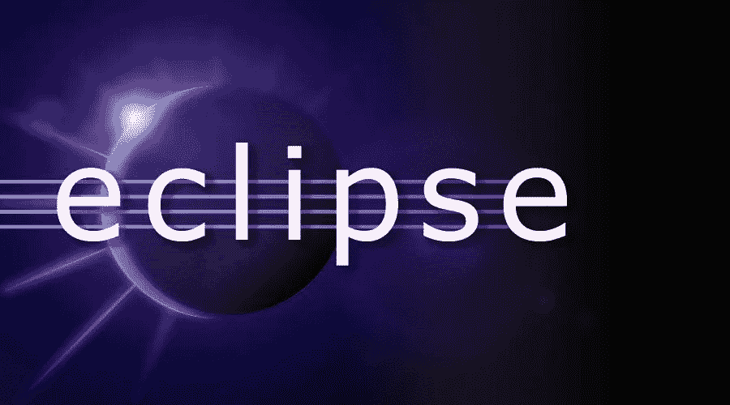
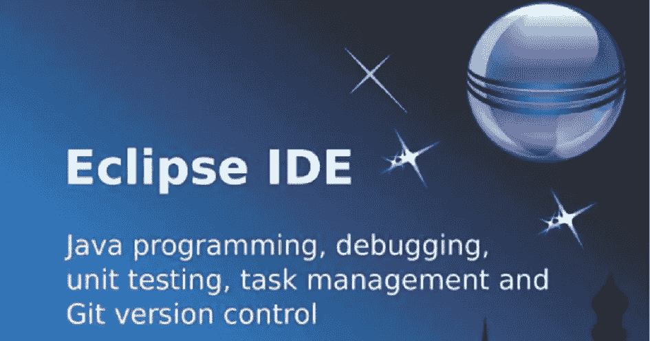
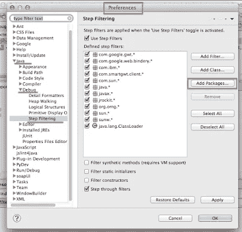

# 2023 年学习 Eclipse IDE 的 6 门最佳课程

> 原文：<https://medium.com/javarevisited/6-free-best-eclipse-ide-courses-for-java-programmers-1229ee9e5d87?source=collection_archive---------2----------------------->

## 我最喜欢的在线课程 2023 年学习 Eclipse IDE，在 Java 开发中变得富有成效。还包括免费的 Eclipse 课程。

大家好，如果您想从头开始学习 Eclipse IDE for Java 开发，或者想学习新的 Eclipse 技巧和窍门来提高您的工作效率，并寻找最好的免费资源，那么您来对地方了。

早些时候，我已经分享了 [**最佳 Java 课程**](/javarevisited/top-5-java-online-courses-for-beginners-best-of-lot-1e1e240a758) 和 [**最佳 IntelliJ IDEA 课程**](/javarevisited/7-best-courses-to-learn-intellij-idea-for-beginners-and-experienced-java-programmers-2e9aa9bb0c05) ，在本文中，我将分享学习 Eclipse IDE 进行 Java 开发的最佳课程。该列表包括 Udemy 和 Pluralsight 等网站的免费和付费在线课程。

如果您从事 Java 开发，那么您可能知道 Eclipse 是最流行的 Java 开发 ide 之一，全世界有数百万的 Java 开发人员在使用它。因为，像 [Eclipse](https://javarevisited.blogspot.com/2016/09/3-maven-eclipse-tips-for-java-developers.html) 、 [NetBeans](https://javarevisited.blogspot.com/2017/03/10-tools-used-by-java-programming-Developers.html) 和 [IntelliJIDEA](https://javarevisited.blogspot.com/2018/09/top-5-courses-to-learn-intellij-idea-java-and-android-development.html) 这样的 ide 是 Java 开发人员生活中不可或缺的一部分。

花一些时间像学习 Eclipse 一样学习您的 IDE 并使用它提高效率是有意义的。这不仅会节省你在[开发](https://javarevisited.blogspot.com/2020/03/top-20-skills-java-developers-can-learn.html#axzz6k4XBgTw4)、[测试](https://www.freecodecamp.org/news/these-are-the-top-testing-tools-libraries-and-frameworks-for-java-developers-8c0e3f9bc11d/?source=user_profile---------1---------------------)和[调试](https://javarevisited.blogspot.com/2011/07/java-debugging-tutorial-example-tips.html#axzz6bYzaddcE)期间的大量时间，还会让你成为一个更好的开发者。

据说工匠和他们的工具一样好，对程序员来说也是如此。一般来说，专家开发人员拥有更好的工具，他们也更了解自己的工具，这也是他们与普通程序员的不同之处。

在过去的 15 年里，我个人一直在使用 Eclipse，我可以说，学习快捷方式、视角、特性和不同的 Eclipse 插件在 Java 开发、测试和调试过程中对我帮助很大。

给你举个例子，在我开始职业生涯的时候，我还不知道 Eclipse 的[**远程调试特性**](https://www.java67.com/2018/01/how-to-remote-debug-java-application-in-Eclipse.html) 可以让你调试一个运行在远程服务器上的 Java 程序。

在那之前，我很难找到或解决任何问题。我需要手动创建包含很多调试信息的 JAR 文件，比如额外的[日志](https://javarevisited.blogspot.com/2011/05/top-10-tips-on-logging-in-java.html)并将它们部署到我们的 UAT 服务器中。

这不仅很累，而且破坏环境，影响其他人使用我们的 UAT 环境。我很幸运地与一群优秀的开发人员一起工作，其中一人向我展示了如何在 Eclipse 中进行远程调试，这对我帮助很大。现在，我可以从我的 Windows 机器上调试，查看变量值，单步执行代码，等等。

这只是一个例子，还有很多例子可以说明学习 Eclipse 特性让我的开发人员生活变得更加轻松。

既然你已经确信学习 Eclipse 特性很重要，那就让我们来看看一些最好的在线培训课程，以 [**学习 Eclipse IDE**](/javarevisited/top-10-courses-to-learn-eclipse-junit-and-mockito-for-java-developers-4de1e8d62b96) 进行 Java 开发。在与 Java 开发人员和专家讨论后，我特意选择了这些课程。

我还确保将免费和付费的 Eclipse 培训课程**都包含在内，这样就不会有人错过了。这些课程对初学者、中级和高级 Java 开发人员同样有用，因为您将从基础到高级学习开发和调试知识。

即使你知道 Eclipse，你也一定会学到更多的技巧或者实现一些你以前不知道的关于 Eclipse 的惊人功能，比如用 Eclipse 开发 Java web 应用程序或者[调试远程 Java 应用程序](https://javarevisited.blogspot.com/2011/02/how-to-setup-remote-debugging-in.html)。

如果你是一个 [IntelliJIDEA](https://itnext.io/top-5-intellijidea-and-android-studio-courses-for-java-and-android-programmers-afcc27309b60) 或 NetBeans 迷，并且因为你的所有队友都在使用 Eclipse 而转投 Eclipse，你会发现这些 Eclipse 培训课程非常有用。为了避免不必要的问题，使用与您的团队相同的工具实际上是一个更好的主意。

例如，在一个项目中，几个队友在使用 IntelliJIDEA，他们的 git commit 经常包含一些额外的空白，这使得审查他们的 PR ( [Git pull request](https://www.java67.com/2019/04/top-5-courses-to-learn-git-and-github.html) )很麻烦。一旦每个人都改用 Eclipse，问题就自动消失了。**

# 2023 年 Java 开发人员的 6 个最佳 Eclipse 培训课程

为了不浪费您的时间，这里是我为 Java 开发人员列出的一些最好的 Eclipse 培训课程。正如我所说的，这个列表包括在线学习 Eclipse 的免费和付费课程。

我还收录了来自 Udemy 和 Pluralsight 的课程，这样你就可以在不同的在线平台之间进行选择，如果你已经是 Pluralsight 的会员，就可以参加。

## 1.【Eclipse Java IDE 初学者培训课程

这是学习 Eclipse IE for Java 开发最全面的课程之一。本课程由 Infinite Skills 创建，将向您传授与单元测试、重构、调试和运行 Java 应用程序相关的重要 Eclipse 特性。

这是在 Udemy 上学习月食的**最全面的课程之一，内容超过 4 个小时。本课程从教授如何下载和安装 Eclipse IDE for Windows、 [Mac](https://javarevisited.blogspot.com/2022/02/top-5-macos-courses-for-beginners-in.html) 和 [Linux 环境](/javarevisited/6-best-websites-to-learn-linux-4861ac21bfdf)开始，然后继续设置一个 Java 项目并使用分步指南运行。

之后，您将学习基本的 [**Eclipse 键盘快捷键**](https://javarevisited.blogspot.com/2018/07/top-30-eclipse-keyboard-shortcuts-java-programming.html) ，[调试技巧](https://javarevisited.blogspot.com/2011/07/java-debugging-tutorial-example-tips.html)，如何重构代码，并学习不同的 Eclipse 插件来处理高级工作，如重构、测试、调试，以及使用高级 Eclipse 特性来提高生产率。**

**这里是加入本课程的链接**—[Eclipse Java IDE 初学者培训课程](https://click.linksynergy.com/deeplink?id=JVFxdTr9V80&mid=39197&murl=https%3A%2F%2Fwww.udemy.com%2Fcourse%2Fbeginners-eclipse-java-ide-training-course%2F)

谈到社会证明，这门课程在近 201 名参与者中平均获得 4.3 分，超过 1，313 名学生注册了这门课程，这令人惊讶。

## 2.[Tod Gentille 的日食导游之旅第一部分](https://pluralsight.pxf.io/c/1193463/424552/7490?u=https%3A%2F%2Fwww.pluralsight.com%2Fcourses%2Feclipse-guided-tour-part1)

这是在 Pluralsight 上学习 Eclipse 的最佳课程之一。该课程由 Tod Gentille 创建，将提供对 Eclipse 的详细探索，Eclipse 是一个运行在 Windows、Mac OS X 和 Linux 上的开源集成开发环境。

本课程将指导你如何使用 Eclipse 的强大功能进行 Java 开发并快速提高工作效率。

顺便说一句，你需要一个 [**多重视野会员**](https://pluralsight.pxf.io/c/1193463/424552/7490?u=https%3A%2F%2Fwww.pluralsight.com%2Flearn) 才能加入这个课程。如果您是 Pluralsight 会员，并且正在寻找学习 Eclipse IDE 的课程，那么您应该参加这个课程。

以下是加入本课程的链接—[Eclipse 导游](https://pluralsight.pxf.io/c/1193463/424552/7490?u=https%3A%2F%2Fwww.pluralsight.com%2Fcourses%2Feclipse-guided-tour-part1)

或者，你也可以从他们的 [**10 天免费试用**](https://pluralsight.pxf.io/c/1193463/424552/7490?u=https%3A%2F%2Fwww.pluralsight.com%2Flearn) 中获益，免费加入这个课程。它提供了 200 分钟的免费访问他们所有 7000 多个在线培训课程的机会，这些课程有助于学习最新最棒的 Java 技术。此外，所有 Pluralsight 课程在本月都是免费的，因为他们正在运行四月份的免费课程。

 [## 对个人来说

### 无论你想进入一个新的领域，改善你的角色，还是把你的伟大想法变成现实，Pluralsight…

pluralsight.pxf.io](https://pluralsight.pxf.io/c/1193463/424552/7490?u=https%3A%2F%2Fwww.pluralsight.com%2Flearn) 

## 3.[Jose pau mard 的《面向 Java 开发人员的 Eclipse》](https://pluralsight.pxf.io/c/1193463/424552/7490?u=https%3A%2F%2Fwww.pluralsight.com%2Fcourses%2Feclipse-java-developers)

这是另一个在 Pluralsight 上学习 Eclipse 的很棒的课程，由 Jose Paumard 创建，他是 java 冠军，也是流行的 Java 课程的作者，如 [Java 多线程课程](https://javarevisited.blogspot.com/2018/06/top-5-java-multithreading-and-concurrency-courses-experienced-programmers.html)。
在课程中，你将通过非常清晰的分步演示了解 Eclipse for Java 开发的最重要特性。

以下是你将在本课程中了解到的关于月蚀的事情
1。如何在 Eclipse
2 中从头创建一个 Java 项目？Java 开发如何配置 Eclipse
3。如何在 Eclipse
4 内使用 [Maven](/javarevisited/6-best-maven-courses-for-beginners-in-2020-23ea3cba89) 。如何在 Eclipse
5 内使用 Git？如何使用 Eclipse 作为 SQL 客户端连接数据库
6。如何在 Eclipse

中创建 Java EE 应用完成本课程后，您将对 Eclipse IDE for Java 和 Java EE 开发有足够的了解。您还将拥有如何在 Eclipse 中集成像 [Maven](https://dev.to/javinpaul/10-free-devops-courses-to-learn-jenkins-docker-and-maven-for-programmers-ohp) 、 [Git](https://dev.to/javinpaul/5-free-courses-to-learn-git-and-github-in-depth-jpp) 和 [SQL](/javarevisited/7-free-courses-to-learn-database-and-sql-for-programmers-and-data-scientist-e7ae19514ed2) 这样的工具的经验，以便进行更快的集成开发。总的来说，这是 Java 程序员学习 Eclipse 的一门很好的实践课程。

**这里是加入 Eclipse 课程**——[面向 Java 开发人员的 Eclipse](https://pluralsight.pxf.io/c/1193463/424552/7490?u=https%3A%2F%2Fwww.pluralsight.com%2Fcourses%2Feclipse-java-developers)的链接

## 4. [Eclipse 调试技巧和窍门](https://click.linksynergy.com/deeplink?id=JVFxdTr9V80&mid=39197&murl=https%3A%2F%2Fwww.udemy.com%2Fcourse%2Feclipse-debugging-techniques-and-tricks%2F)

这是一门实用的课程，专门致力于提高您在 Eclipse 中的调试技能。由于调试对于 Java 开发人员来说是一项重要的技能，所以我强烈推荐您参加这个课程。在本课程中，你将学到调试 Java 应用程序的所有知识。例如，您将了解如何检查变量以查看它们的值，如何查看集合及其元素，[如何远程调试运行在远程服务器上的 Java 应用](https://www.java67.com/2018/01/how-to-remote-debug-java-application-in-Eclipse.html)，等等。

本课程也是**完全实践和基于示例的**，它将帮助您理解不同的调试概念和提示，如命中计数、断点、条件断点、单步执行、单步跳过、进入框架等等。

**这里是加入本课程** — [Eclipse 调试技术和技巧](https://click.linksynergy.com/deeplink?id=JVFxdTr9V80&mid=39197&murl=https%3A%2F%2Fwww.udemy.com%2Fcourse%2Feclipse-debugging-techniques-and-tricks%2F)的链接

谈到社会证明，该课程是 Udemy 上评分最高的课程之一，受到 2000 多名 Java 开发人员的信任，用于提高他们的 Eclipse 调试技能。如果你是初学者，你可以加入这个课程，让你的 [Java 调试技能](https://javarevisited.blogspot.com/2011/07/java-debugging-tutorial-example-tips.html#axzz6bYzaddcE)更上一层楼。

## 5. [**Eclipse IDE 初学者:提高您的 Java 生产率**](https://click.linksynergy.com/deeplink?id=JVFxdTr9V80&mid=39197&murl=https%3A%2F%2Fwww.udemy.com%2Fcourse%2Fluv2code-eclipse-ide-for-beginners%2F) **【免费】**

这是另一个免费的 Udemy 课程，为 Java 初学者学习 Eclipse IDE，提高他们的生产力。您将学习为代码生成、调试和重构而创建的基本键盘快捷键和 Eclipse 特性，从而成为一名更高效的 Java 开发人员。

这门课程的创始人不是别人，正是 Udemy 上我最喜欢的春季和冬眠课程的作者查德·达比(Chad Darby)，这是一门很棒的课程，可以学习一些有用的 Eclipse 技巧和诀窍，而且完全免费。

以下是您将在本课程中学到的内容:

1.  如何在自己的计算机上安装 Eclipse IDE
2.  如何用 Eclipse 创建 Java 应用程序
3.  如何定制 Eclipse 用户界面
4.  如何使用 Eclipse 向导生成 Java 源代码
5.  如何[重构](/javarevisited/7-best-courses-to-learn-refactoring-and-clean-coding-in-java-47bea3c67006)并调试 Java 源代码
6.  如何运行 [JUnit 测试](/javarevisited/5-courses-to-learn-junit-and-mockito-in-2019-best-of-lot-f217d8b93688)
7.  如何导入和导出项目
8.  如何向您的 Eclipse 项目添加外部 JAR 文件

如果你喜欢 Eclipse 作为你的 Java IDE，但是负担不起上面的课程，并且正在寻找一些免费的课程，那么你应该参加这个课程。您只需要创建一个免费的 Udemy 帐户来注册本课程。

**下面是链接** — [Eclipse IDE 初学者:提高您的 Java 生产率](https://click.linksynergy.com/deeplink?id=JVFxdTr9V80&mid=39197&murl=https%3A%2F%2Fwww.udemy.com%2Fcourse%2Fluv2code-eclipse-ide-for-beginners%2F)

## 6. [Eclipse 初学者教程:10 步学会 Java IDE](https://click.linksynergy.com/deeplink?id=JVFxdTr9V80&mid=39197&murl=https%3A%2F%2Fwww.udemy.com%2Fcourse%2Feclipse-java-tutorial-for-beginners%2F)【免费】

这是学习 Eclipse 并在 2023 年成为更有生产力的 Java 开发人员的最佳免费课程之一。本课程将从如何创建 Java 程序并在 Eclipse 中运行这些程序等基础知识开始，然后继续学习一些高级功能来提高您的工作效率，如快捷方式、提示、技巧、插件和不同的 Eclipse 视角。

由同为 Java 开发人员的 Udemy 最畅销讲师 [Ranga Karnam](https://click.linksynergy.com/deeplink?id=JVFxdTr9V80&mid=39197&murl=https%3A%2F%2Fwww.udemy.com%2Fuser%2Fin28minutes%2F) 创建，他的 [Spring Boot 和微服务课程](https://click.linksynergy.com/deeplink?id=JVFxdTr9V80&mid=39197&murl=https%3A%2F%2Fwww.udemy.com%2Fcourse%2Fmicroservices-with-spring-boot-and-spring-cloud%2F)是真正的瑰宝，这门课程将教你 Java 开发人员应该知道的关于 Eclipse 的所有基本知识。

您将学习如何从 [Git](/@javinpaul/top-10-free-courses-to-learn-git-and-github-best-of-lot-967aa314ea) 和 [Maven](/javarevisited/top-10-free-courses-to-learn-maven-jenkins-and-docker-for-java-developers-51fa7a1e66f6) 导入 Java 项目，学习如何运行和调试它们，以及使用 Eclipse 重构工具尝试一些代码重构。

本课程还涉及了 Eclipse 代码生成、保存动作自动化和全面加速 Java 开发的主题。简而言之，这是 Java 开发人员学习 Eclipse 的最佳免费课程之一

**这里是加入这个免费 Eclipse 课程的链接**——[Eclipse 初学者教程:10 步学会 Java IDE](https://click.linksynergy.com/deeplink?id=JVFxdTr9V80&mid=39197&murl=https%3A%2F%2Fwww.udemy.com%2Fcourse%2Feclipse-java-tutorial-for-beginners%2F)

谈到社交证明，这是 Udemy 上最受欢迎的 Eclipse 课程之一，在近 3000 名参与者中，平均得分为 4.4 分。超过 44，000 名学生注册了这门课程，这充分说明了它的质量。

**最重要的是这门课程完全免费**。如果您有一个 Udemy 帐户，那么您现在就可以注册这个课程，否则，只需创建一个免费的 Udemy 帐户。

以上是 Java 开发人员学习 Eclipse 的一些最佳课程。由于 IDE 对于任何 Java 开发人员来说都是最重要的工具，所以花一些时间和精力来更好地学习 IDE 是有意义的。如果您使用 Eclipse 作为您的 Java IDE，那么这些课程将帮助您更好地学习 Eclipse 并实现其全部潜力。你会发现，随着你在代码导航、搜索、故障排除和程序调试方面技能的提高，你已经成为一名更有成就的开发人员。

您可能喜欢阅读的其他 **Java 和编程文章**

*   [完整的 Java 开发者路线图](https://javarevisited.blogspot.com/2019/10/the-java-developer-roadmap.html)
*   [面向 Java 开发者的 5 门免费 Spring 框架课程](http://www.java67.com/2017/11/top-5-free-core-spring-mvc-courses-learn-online.html)
*   [与 Spring Boot 一起学习微服务的 5 大课程](https://javarevisited.blogspot.com/2018/02/top-5-spring-microservices-courses-with-spring-boot-and-spring-cloud.html#axzz6JJFPbsyP)
*   学习 learn RESTful Web 服务的 10 门课程
*   [深入学习 Spring 的五大课程](https://javarevisited.blogspot.com/2018/06/top-6-spring-framework-online-courses-Java-programmers.html)
*   Java 开发人员应该学习的 5 个基本框架
*   [5 门免费学习核心 Java 的在线课程](http://javarevisited.blogspot.sg/2017/11/top-5-free-java-courses-for-beginners.html#axzz4zuIICRs9)
*   [面向有经验的 Java 开发人员的 5 大 Java 设计模式课程](http://javarevisited.blogspot.sg/2018/02/top-5-java-design-pattern-courses-for-developers.html)
*   [学习 Java 微服务的 7 大课程](/javarevisited/top-5-courses-to-learn-microservices-in-java-and-spring-framework-e9fed1ba804d)
*   [学习 Spring Security 和 OAuth2 的 10 门课程](/javarevisited/top-10-courses-to-learn-spring-security-and-oauth2-with-spring-boot-for-java-developers-8f0222d6066d)
*   [编程/编码工作面试的 10 门课程](http://javarevisited.blogspot.sg/2018/02/10-courses-to-prepare-for-programming-job-interviews.html)
*   [面向 Java 开发人员的 10 门高级 Spring Boot 课程](/javarevisited/10-advanced-spring-boot-courses-for-experienced-java-developers-5e57606816bd)
*   [初学者学习 Spring Cloud 的 5 大课程](https://javarevisited.blogspot.com/2018/04/top-5-spring-cloud-courses-for-java.html)
*   [学习 learn Shell 脚本的 5 门课程](http://javarevisited.blogspot.sg/2018/02/5-courses-to-learn-shell-scripting-in-linux.html)
*   [10 个面向 Java 开发者的免费 Spring Boot 教程和课程](/javarevisited/10-free-spring-boot-tutorials-and-courses-for-java-developers-53dfe084587e)

感谢您阅读本文。如果您喜欢这些最好的 Eclipse IDE 培训课程，那么请与您的朋友和同事分享。如果您有任何问题或反馈，请留言。

**P.S.** —如果您是 Java 编程世界的新手，并且正在寻找一门全面的结构化课程来学习 Java，那么我强烈推荐您加入 Udemy 网站上由 Tim Buchalaka 举办的 [**完整 Java 大师班**](https://click.linksynergy.com/deeplink?id=JVFxdTr9V80&mid=39197&murl=https%3A%2F%2Fwww.udemy.com%2Fcourse%2Fjava-the-complete-java-developer-course%2F) 。这个长达 80 小时的课程是学习 Java 的最全面和最新的课程，它也非常实惠，因为你可以在 Udemy sales 上只花 10 美元购买。

 [## 完整的 Java 软件开发人员大师班(针对 Java 10)

### 你刚刚在网上偶然发现了最完整、最深入的 Java 编程课程。拥有超过 480，000 名学生…

udemy.com](https://click.linksynergy.com/deeplink?id=JVFxdTr9V80&mid=39197&murl=https%3A%2F%2Fwww.udemy.com%2Fcourse%2Fjava-the-complete-java-developer-course%2F)