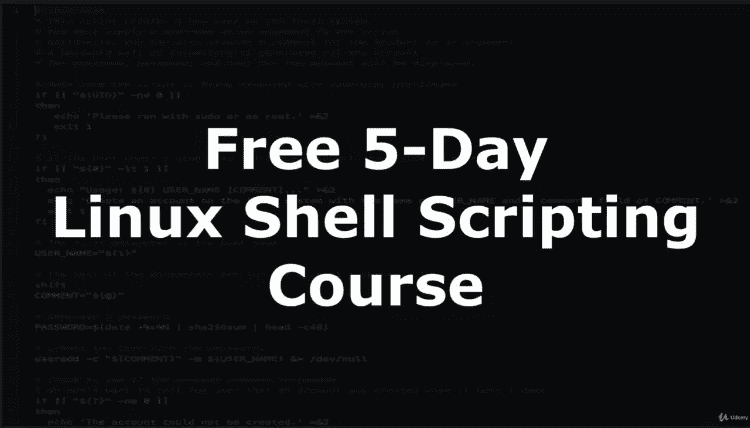
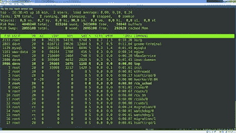
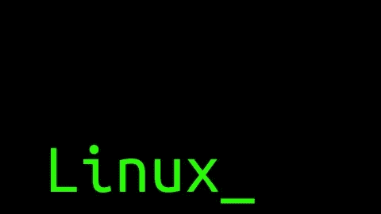
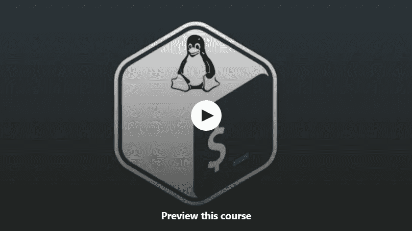

# 2023 年要学习的 6 门最佳免费 Bash & Shell 脚本课程

> 原文：<https://medium.com/javarevisited/6-free-courses-to-learn-bash-shell-scripting-in-linux-and-unix-a50461ecd4fe?source=collection_archive---------0----------------------->

image_credit —教育性([程序员的狂欢](https://www.educative.io/courses/bash-for-programmers?affiliate_id=5073518643380224)

大家好，如果你想在 2023 年学习 Bash & Shell 脚本并寻找免费的 Bash 脚本在线课程，那么你来对地方了。早些时候，我已经分享了[最佳 Shell 脚本课程](/javarevisited/7-best-shell-scripting-courses-for-programmers-and-it-professionals-d1f1486accc9)和 [Linux 命令课程](/javarevisited/top-10-courses-to-learn-linux-command-line-in-2020-best-and-free-f3ee4a78d0c0?source=collection_home---4------0-----------------------)，今天，我将分享*面向初学者的免费 bash 脚本课程*。

虽然 Linux 命令的重要性是众所周知的，但是许多程序员不知道如何编写 shell 脚本来充分利用它。他们中的一些人甚至不熟悉各种 Linux shells，如`bash`、`csh`或`ksh`，这进一步限制了他们的能力。

如果你不知道，bash 是一种 UNIX shell 和命令语言，也是很多 [Linux](http://www.java67.com/2018/02/5-free-linux-unix-courses-for-programmers-learn-online.html) 系统和 Mac OS 的默认登录 shell。

它提供了编写脚本的能力，以编程的方式做事情，并自动执行重复和枯燥的任务，如在服务器之间复制文件，检查所有服务器中的特定文件等。

Shell 脚本是成为更好的开发人员或程序员的重要技能。它允许你自动完成琐碎的任务，否则会占用你宝贵的时间。还能让你快速做事。

例如，如果你必须将一个文件复制到 10 台 Linux 主机上，如果你使用 **ssh** 或 SCP 手工完成，可能需要 10 分钟。不过，如果你知道 shell 脚本，那么你可以在 5 分钟内快速创建一个脚本，然后在 1 分钟内复制文件，你不仅节省了 4 分钟，而且对于所有未来的工作，你有一个脚本可以在一分钟内完成这项工作。

只要知道一些简单的控制和循环结构以及 [bash 变量](https://javarevisited.blogspot.com/2011/06/special-bash-parameters-in-script-linux.html)就会有很大的不同。这就是我建议每个程序员用 Linux 学习 shell 脚本的原因。这也是将伟大的开发人员与平庸的开发人员区分开来的技能之一。我遇到的一些程序员认为学习 Python 比 shell 脚本更好，因为它们更强大，你可以用它们做更多的事情。**嗯，这是真的**， [Python](/javarevisited/10-free-python-tutorials-and-courses-from-google-microsoft-and-coursera-for-beginners-96b9ad20b4e6) 几乎为每一种可能的事情都提供了一个模块，如果你了解 Python，并且你可以在你正在工作的主机中安装 Python，那么就坚持使用它，但大多数时候这是没有保证的。

有时候，你在服务器里找不到 [Python](https://javarevisited.blogspot.com/2018/12/10-free-python-courses-for-programmers.html) 或者 [Perl](/javarevisited/top-10-popular-programming-languages-and-their-creators-java-ruby-python-c-javascript-php-f52e28618e4f) ，或者你就是没有权限访问它们。在这种情况下，简单的 shell 命令和脚本技巧很有帮助。而且，学习 Shell 脚本不会花很长时间，因为需要学习的东西很少。所以，你可以很快变得富有成效。

几个月前，我分享了一些学习 Shell 脚本的[最佳课程，但后来我的读者在询问一些免费课程，于是这篇文章诞生了。但是，如果你不介意在学习上投资一些钱，那么你也可以看看这个清单。正如我以前说过的，我已经使用 shell 脚本为自己节省了很多时间的繁琐和无聊的工作。更重要的是，编写 shell 脚本的能力在我的职业生涯中给了我很大的帮助，尤其是在发布、支持和解决生产问题的过程中。](https://javarevisited.blogspot.com/2018/02/5-courses-to-learn-shell-scripting-in-linux.html)

顺便说一句，如果你只是需要一门全面的课程来学习 bash shell 脚本，那么我也建议你去看看 Udemy 上的[**【Bash 脚本和 shell 编程(Linux 命令行)**](https://click.linksynergy.com/deeplink?id=JVFxdTr9V80&mid=39197&murl=https%3A%2F%2Fwww.udemy.com%2Fcourse%2Fbash-scripting%2F) 。这是最好的开始之一，尤其是如果你遵循动手实践和边做边学的方法。

<https://click.linksynergy.com/deeplink?id=JVFxdTr9V80&mid=39197&murl=https%3A%2F%2Fwww.udemy.com%2Fcourse%2Fbash-scripting%2F>  

# 学习 Learn Shell 脚本的 6 门最佳免费课程

无论如何，这里是我列出的在 Linux 中学习 Shell 脚本的一些免费课程。有些人认为[免费资源](/javarevisited/top-20-sites-to-learn-coding-in-2020-f57ff63d9cb3)不值得他们花费时间，因为它们通常是劣质的，并且没有涵盖所有的主题。

虽然我同意免费课程通常不如付费课程全面，这一点很明显，但 Udemy 上的大多数[免费课程质量都很好，尤其是那些最近推出的、由讲师出于宣传和教育原因免费提供的课程。

如果您今年决定学习 Shell 脚本，这些课程是开启您旅程的绝佳方式。](/javarevisited/100-free-programming-and-web-development-courses-on-udemy-free-resource-center-3f8415eb5e6f)

## 1.[Linux Shell 脚本简介(免费课程)](https://click.linksynergy.com/deeplink?id=JVFxdTr9V80&mid=39197&murl=https%3A%2F%2Fwww.udemy.com%2Flinux-shell-scripting-free%2F)

这是一个迷你课程，可以在大约 1 小时内快速掌握 Linux shell 脚本，非常适合刚刚开始使用 bash shell 的初学者。这个在线 shell 脚本课程将教你编写自己的 Linux shell 脚本的要点，还将帮助你避免没有经验的 Linux 用户第一次编写 shell 脚本时最常犯的错误。

您还将了解最佳实践和标准约定，比如一种简单的技术，它可以使极其复杂的脚本在未来变得易于编写、阅读和维护。

由于 Linux 中没有 IDE，你不得不依赖 [VIM](https://javarevisited.blogspot.com/2011/06/vi-editor-in-unix-example-tutorial-and.html#axzz5SdlHplZc) ，所以创建简单的脚本更容易阅读和维护是有意义的。根据我多年编写 shell 脚本的经验，这是我能给你的最重要的建议。总的来说，这是一门在 1 小时内学习 Linux shell 脚本的优秀免费课程。

**这里是免费加入本课程的链接—**[Linux Shell 脚本简介(免费课程)](https://click.linksynergy.com/deeplink?id=JVFxdTr9V80&mid=39197&murl=https%3A%2F%2Fwww.udemy.com%2Flinux-shell-scripting-free%2F)

## 2. [Bash Shell 脚本(10 小时免费内容)](https://click.linksynergy.com/deeplink?id=JVFxdTr9V80&mid=39197&murl=https%3A%2F%2Fwww.udemy.com%2Fcourse%2Fcomplete-bash-shell-scripting%2F)

正如我告诉你的，Bash shell 脚本允许你在 UNIX 系统上自动完成任何任务，本课程将教你如何在短时间内完成。

在本课程中，您将学习如何为 UNIX 系统上的自动化任务编写 shell 脚本，学习如何在命令行上执行基本的网络任务——使用 [cURL](http://javarevisited.blogspot.sg/2017/03/10-examples-of-curl-command-in-unix-and-Linux.html) 和 [wget](https://javarevisited.blogspot.com/2015/10/how-to-send-http-request-from-unix-or-linux-curl-wget-example.html) 进行文件传输，以及使用 [ping](https://javarevisited.blogspot.com/2010/10/basic-networking-commands-in-linuxunix.html#axzz51cz4IU96) 和 [telnet](https://javarevisited.blogspot.com/2016/06/how-to-close-telnet-terminal-in-linux-windows-quite-exit-not-working.html#axzz5SdojWGiZ) 命令检查连接。

这是一个全面的免费课程，有超过 9.5 小时的内容来学习 shell 脚本和自动化。您将从头开始使用 bash 编写 shell 脚本。本课程从什么是 Shell 脚本以及为什么应该学习开始，然后讲述如何创建脚本并在 Linux 中执行它。

**这里是免费加入本课程的链接—** [Bash Shell 脚本(10 小时免费内容)](https://click.linksynergy.com/deeplink?id=JVFxdTr9V80&mid=39197&murl=https%3A%2F%2Fwww.udemy.com%2Fcourse%2Fcomplete-bash-shell-scripting%2F)

然后，它继续解释其他部分，如变量、控制结构、 [bash 特殊字符](https://javarevisited.blogspot.com/2011/06/special-bash-parameters-in-script-linux.html)、函数，以及 String 的一些乐趣。谈到社会证明，这门课程平均有 4.2 分，来自近 47，859 名学生，非常优秀。

## 3. [Red Hat Enterprise Linux Shell 脚本基础](https://pluralsight.pxf.io/c/1193463/424552/7490?u=https%3A%2F%2Fwww.pluralsight.com%2Fcourses%2Fred-hat-enterprise-linux-shell-scripting-fundamentals)

这是另一个令人印象深刻的学习 shell 脚本基础的课程，但是来自 Pluralsight。

由 Pluralsight 上著名的 [Docker Deep Dive](https://pluralsight.pxf.io/c/1193463/424552/7490?u=https%3A%2F%2Fwww.pluralsight.com%2Fcourses%2Fdocker-deep-dive-updat) 课程的作者 Nigel Poulton 创建，这个课程的思路非常好，组织也很好，课程的节奏也适合初学者。

它从非常基础的概念开始，比如什么是脚本以及如何创建一个简单的 bash 脚本。然后，通过向您介绍变量、[、bash 参数](https://javarevisited.blogspot.com/2011/06/special-bash-parameters-in-script-linux.html)、位置参数、条件、循环和函数等基本概念，它逐渐增加了脚本的复杂性。这意味着在完成本课程后，您不仅能够阅读现有的 shell 脚本并对其进行修改，还能从头开始创建自己的 bash 脚本。

**以下是加入本课程的链接—**[**Red Hat Enterprise Linux Shell 脚本基础**](https://pluralsight.pxf.io/c/1193463/424552/7490?u=https%3A%2F%2Fwww.pluralsight.com%2Fcourses%2Fred-hat-enterprise-linux-shell-scripting-fundamentals)

唯一的问题是，这门课程**并不完全免费，因为你需要 Pluralsight 会员资格**才能进入这门课程，费用约为每月 29 美元或每年 299 美元。不过，我去年在他们的一次销售中仅花了 199 美元就获得了正式会员资格。

无论如何，即使你没有 Pluralsight 会员资格，你仍然可以利用他们的 [**10 天免费通行证**](http://pluralsight.pxf.io/c/1193463/424552/7490?u=https%3A%2F%2Fwww.pluralsight.com%2Flearn) **，**免费学习他们的所有课程，时间为 200 分钟。本课程时长 2.5 小时，这意味着您可以轻松免费观看完整课程。

<http://pluralsight.pxf.io/c/1193463/424552/7490?u=https%3A%2F%2Fwww.pluralsight.com%2Flearn>  

## 4. [Linux shell &脚本教程](https://click.linksynergy.com/deeplink?id=JVFxdTr9V80&mid=39197&murl=https%3A%2F%2Fwww.udemy.com%2Fcourse%2Flinux-unix-shell-scripting-tutorial%2F)

这是学习基本 Bash 命令和基本脚本技巧的又一个极好的课程。

如果你曾经在类似[亚马逊网络服务或 AWS](http://www.java67.com/2018/05/top-5-amazon-web-services-or-aws-courses-to-learn-online.html) 、[微软 Azure](https://javarevisited.blogspot.com/2019/07/top-5-courses-to-crack-azure-architecture-technologies-certification-az-300-exam.html) ，甚至[谷歌云](https://javarevisited.blogspot.com/2019/07/top-5-google-cloud-platform-gcp-courses-certifications-online.html)这样的云中工作过，那么你就会知道 bash 命令和脚本是在云中高效工作的一个非常重要的部分。在这个课程中，你不仅会学到一些常见的 bash 概念，比如如何编写 shell 脚本，还会学到不同的 bash 变量，等等，这些都是编写复杂的 bash 脚本所必需的。

**这里是免费加入本课程的链接** — [Linux shell &脚本教程](https://click.linksynergy.com/deeplink?id=JVFxdTr9V80&mid=39197&murl=https%3A%2F%2Fwww.udemy.com%2Fcourse%2Flinux-unix-shell-scripting-tutorial%2F)

谈到社会证明，这门课程平均得到了 10，000 多名学习者的 3.5 分，这对于一门免费课程来说是不错的。

## 5. [Linux 命令行变得简单](https://click.linksynergy.com/deeplink?id=JVFxdTr9V80&mid=39197&murl=https%3A%2F%2Fwww.udemy.com%2Fcourse%2Flinux-command%2F)

这是另一个从 Udemy 学习 Linux 命令行的免费课程，您可以用它来编写 bash shell 脚本。本课程不会教你如何编写 bash 脚本，但会向你介绍一些常见的 Linux 命令，这些命令对于任何 Linux 用户、开发人员或系统管理员来说都是必不可少的。

在本课程中，您将学习以下命令:

1.  终端命令简介:`date`、`cal`、`man`、`history`、`clear`
2.  导航和探测系统命令:`pwd`、`cd`、`ls`
3.  文件管理命令:`mkdir`、`cp`、`mv`、`rm`、`find`、`locate`、`wildcards`
4.  文件内容命令:`cat`、`head`、`tail`、`less`、`touch`、`nano`、`grep`
5.  过程命令:`top`、`ps`、`kill`
6.  网络命令:`ifconfig`、`ping`、`wget`

**这里是免费加入本课程的链接** — [Linux 命令行变得简单](https://click.linksynergy.com/deeplink?id=JVFxdTr9V80&mid=39197&murl=https%3A%2F%2Fwww.udemy.com%2Fcourse%2Flinux-command%2F)

## 6.[Linux 和 Mac OSX 上的实用 Bash 脚本](https://click.linksynergy.com/deeplink?id=JVFxdTr9V80&mid=39197&murl=https%3A%2F%2Fwww.udemy.com%2Fcourse%2Fpractical-bash-scripting%2F)

这是学习 Linux 中 Bash shell 和自动化的又一个非常棒的免费课程。在本课程中，您将首先学习在 [Linux](https://hackernoon.com/top-5-free-linux-courses-for-programmers-4a433b4edade) 和 Mac OS X.

上开始使用 bash 所需的基本概念和命令。之后，您将继续学习使用 bash 的 shell 脚本，使用变量、函数和其他技术来编写适当的 Bash 脚本。简而言之，这是一门在 Linux 或 Mac OS 上学习 bash shell 的好课程。

**这里是免费加入本课程的链接—**[**Linux 和 Mac 上的实用 Bash 脚本 OSX**](https://click.linksynergy.com/deeplink?id=JVFxdTr9V80&mid=39197&murl=https%3A%2F%2Fwww.udemy.com%2Fcourse%2Fpractical-bash-scripting%2F)

以上是关于使用 bash、csh、ksh 或其他 shell 程序学习 Linux 中的 shell 脚本的一些免费课程。你不需要学习所有的 shell，我建议你坚持使用 bash，因为它不仅是最流行的 Linux shell，也是 Mac OS 的默认登录 shell。

我在许多不同的组织中工作过，并且我发现 bash shell 在大多数时候都是可用的。最后但同样重要的是，与其他 shells 相比，它功能强大且易于操作。

其他**免费在线课程**面向程序员
[15 门免费 Python 编程课程面向初学者](/swlh/5-free-python-courses-for-beginners-to-learn-online-e1ca90687caf)
[10 门免费课程面向初学者学习 Linux](/javarevisited/top-10-courses-to-learn-linux-command-line-in-2020-best-and-free-f3ee4a78d0c0)
[15 门课程学习 AWS、Docker、 和 kubernetes](/javarevisited/top-15-online-courses-to-learn-docker-kubernetes-and-aws-for-fullstack-developers-and-devops-d8cc4f16e773)
[2023 年 10 门免费课程学习 Docker](/@javinpaul/10-free-courses-to-learn-docker-and-devops-for-frontend-developers-691ac7652cee)
[2023 年 10 门免费课程学习 TypeScript](/javarevisited/top-10-free-typescript-courses-to-learn-online-best-of-lot-44bce9da41d1)
[2023 年 10 门免费课程学习 JavaScript](/javarevisited/12-free-courses-to-learn-javascript-and-es6-for-beginners-and-experienced-developers-aa35874c9a32)
[我最喜欢的免费课程深入学习 Java](/javarevisited/10-free-courses-to-learn-java-in-2019-22d1f33a3915)
[2023 年 10 门免费课程学习 Angular](/javarevisited/top-10-free-courses-to-learn-angular-framework-in-2020-bb62148c73d3)
[10](/javarevisited/top-10-free-courses-to-learn-react-js-c14edbd3b35f)

感谢您阅读本文。如果您喜欢这些用 Linux bash 学习 Shell 脚本的*最佳免费课程*，那么请与您的朋友和同事分享它们。如果您有任何问题或反馈，请留言。

如果你不介意花几块钱学习一些值得学习的东西，并寻找最好的课程，那么 [**Linux Shell Scripting:一种基于项目的学习方法**](https://click.linksynergy.com/deeplink?id=JVFxdTr9V80&mid=39197&murl=https%3A%2F%2Fwww.udemy.com%2Fcourse%2Flinux-shell-scripting-projects%2F) 是最好的开始之一，特别是如果你遵循边做边学的方法。

<https://click.linksynergy.com/deeplink?id=JVFxdTr9V80&mid=39197&murl=https%3A%2F%2Fwww.udemy.com%2Fcourse%2Flinux-shell-scripting-projects%2F> 