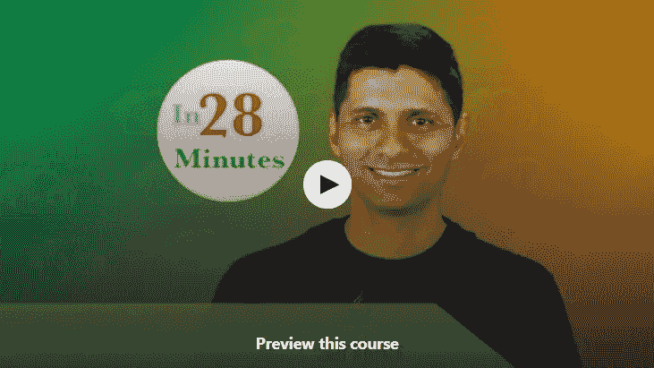
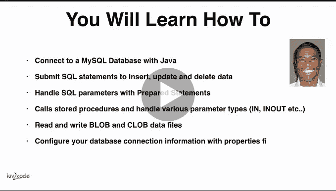
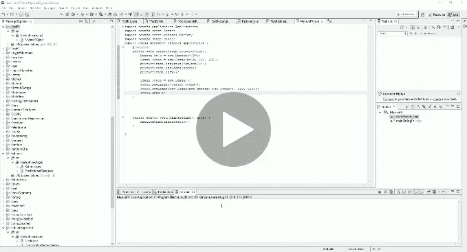
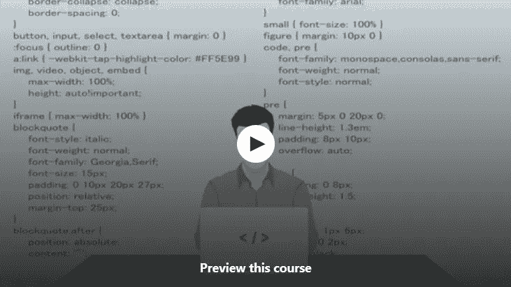

# 2023 年学习 Servlet、JSP 和 Java FX 的 6 大免费课程——最好的

> 原文：<https://medium.com/javarevisited/6-free-courses-to-learn-servlet-jsp-and-java-fx-in-2020-best-of-lot-720201c84f63?source=collection_archive---------0----------------------->

潘卡杰·帕特尔在 [Unsplash](https://unsplash.com?utm_source=medium&utm_medium=referral) 上的照片

大家好，如果你想在 2023 年学习 Servlet、JSP 和 JavaFX，并寻找免费的在线课程，那么你来对地方了。之前我已经分享了[最佳 Servlet 课程](https://javarevisited.blogspot.com/2020/08/top-5-courses-to-learn-servlet-and-jsp.html)和[最佳 JavaFX 课程](https://javarevisited.blogspot.com/2020/06/top-5-courses-to-learn-java-fx-in-2020.html)，今天我要分享的是学习 Servlet、JSP、Java FX forms scratch 的免费课程。

如果你是一名从事 Java web application 等 Java JEE 项目的 Java 开发人员，或者你想通过学习 Servlet、JSP 和 JDBC 等服务器端技术进入这个领域，那么你来对地方了。在本文中，我将分享一些免费的在线培训课程，让你按照自己的进度学习 Servlet、JSP 和 JDBC。

如果你想成为一名摇滚之星 Java web 开发人员，那么你必须在学习像 [Spring](http://www.java67.com/2017/11/top-5-free-core-spring-mvc-courses-learn-online.html) 和 [Hibernate](http://javarevisited.blogspot.sg/2018/01/top-5-hibernate-and-jpa-courses-for-java-programmers-learn-online.html) 这样的框架之前，很好地理解这些基本的 web 技术。这些框架在这些基础技术之上工作，如果你不知道它们，那么你将经常在现实世界中努力调试和解决问题。

在你开始学习 Servlet、JSP、 [JDBC](/javarevisited/top-5-courses-to-learn-jdbc-and-database-connectivity-for-java-developers-free-and-best-of-lot-7945156fcc3) 和 Java FX 这些课程之前，让我简单介绍一下这些技术是什么，以及它们在 Java web 应用程序中的作用。

Servlet 是运行在容器内部的 Java 类。它允许您处理 HTTP 请求并生成动态网页，但它更像是 Java 而不是 HTML，也就是说，您需要在 Java 中编写 [HTML](/javarevisited/5-free-html-and-css-courses-to-learn-front-end-web-development-online-8b04517c6ecb) ，这是错误的，不推荐使用。

Servlet 主要用作使用 MVC 设计模式创建的 web 应用程序中的控制器。其中一个流行的例子是 [Spring MVC 框架](/javarevisited/why-spring-is-the-best-framework-for-developing-rest-apis-in-java-784590e484a4)的 [DispatcherServlet](http://www.java67.com/2017/06/what-is-use-of-dispatcherservlet-in-spring-mvc.html) ，它充当前端控制器。

它的工作是接收请求并处理它，但是视图生成或动态网页生成功能被传递给 JSP。尽管它提供了需要在 JSP 中显示的数据，这使得视图成为了**模型视图控制器(MVC)设计模式的一部分。**

【JDBC】你可以在核心 Java 和 Java web 应用程序中使用它。它代表 [Java 数据库连接](/javarevisited/top-5-courses-to-learn-jdbc-and-database-connectivity-for-java-developers-free-and-best-of-lot-7945156fcc3)，它提供 API 来连接数据库，并检索和保存应用层生成的数据。JDBC 经常在持久层中使用 [DAO 模式](http://javarevisited.blogspot.sg/2013/01/data-access-object-dao-design-pattern-java-tutorial-example.html)。与这三种技术相比，Java FX 是一种相对较新的技术，但它允许你创建 GUI。这是 Swing 的一个替代品，你们中的许多人可能以前都曾使用它来创建胖客户端。

顺便说一句，如果你可以花几块钱学习一些有用的东西，如 Servlet 和 JSP，那么你也可以查看一下 [**JSP、Servlet 和初学者 JDBC:在 Udemy 上构建一个数据库应用**](https://click.linksynergy.com/deeplink?id=JVFxdTr9V80&mid=39197&murl=https%3A%2F%2Fwww.udemy.com%2Fcourse%2Fjsp-tutorial%2F) 。Java web 开发人员学习 Servlet 和 JSP 的一门很好的实践课程。

<https://click.linksynergy.com/deeplink?id=JVFxdTr9V80&mid=39197&murl=https%3A%2F%2Fwww.udemy.com%2Fcourse%2Fjsp-tutorial%2F>  

# 面向初学者的五大免费 Servlet、JSP、JDBC 和 Java FX 在线课程

我已经分享了很多免费资源，比如在线课程和书籍，如果你是第一次来这里，那么你可以通过这个博客搜索找到关于 [Java](http://javarevisited.blogspot.sg/2017/11/top-5-free-java-courses-for-beginners.html#axzz4zuIICRs9) 、 [Python](http://www.java67.com/2018/02/5-free-python-online-courses-for-beginners.html) 、 [Linux](http://www.java67.com/2018/02/5-free-linux-unix-courses-for-programmers-learn-online.html) 、 [Angular](http://www.java67.com/2018/01/top-5-free-angular-js-online-courses-for-web-developers.html) 、 [Oracle](http://www.java67.com/2018/02/5-free-oracle-and-microsoft-sql-server-online-courses.html) 以及更多技术的免费课程。在本文中，我将分享一些免费的在线培训课程，你可以用它们来学习 Java web 技术，如 JSP、Servlet、JDBC 和 Java FX。

这些课程大部分来自 [Udemy](https://click.linksynergy.com/fs-bin/click?id=JVFxdTr9V80&offerid=323058.9410&type=3&subid=0) ，它们是合法的免费资源，就像它们的作者让它们免费回馈社区一样。这些课程不像付费课程那样全面，但提供了上述技术的良好概述。

它们非常适合那些想学习 Java web 开发并期待将来学习像 [Spring Boot](/javarevisited/10-free-spring-boot-tutorials-and-courses-for-java-developers-53dfe084587e) 、 [Hibernate](/javarevisited/top-5-books-to-learn-hibernate-for-java-developers-b2cb4b16ccd6) 和 JSF 等 web 框架的人。

## 1.[**Java servlet 和 JSP——25 步构建 Java EE(JEE)app**](https://click.linksynergy.com/fs-bin/click?id=JVFxdTr9V80&subid=0&offerid=323058.1&type=10&tmpid=14538&RD_PARM1=https%3A%2F%2Fwww.udemy.com%2Flearn-java-servlets-and-jsp-web-application-in-25-steps%2F)

这是一个非常棒的学习 Servlet 和 JSP 的免费课程，它来自 Udemy 上的一个关于 JSP、Servlet 和 JSTL 的付费课程“Java 服务器页面(JSP)、Servlet 和 JSTL 教程”。

本课程的目的是向学生和初学 web 开发的人教授 Java web 技术的基础知识，以便他们将来学习像 Spring、Hibernate 和 JSF 这样的流行框架。

本课程涵盖了[servlet](http://javarevisited.blogspot.sg/2011/09/servlet-interview-questions-answers.html)和 [JSP](http://javarevisited.blogspot.sg/2017/01/best-books-to-learn-servlet-and-jsp.html) 的大部分基础知识，学生将对 JSP 应用程序 web 应用程序是如何从头构建的有一个大致的了解。

**这里是免费报名本课程的链接—**[Java servlet 和 JSP —用 25 个步骤构建 Java EE(JEE)app](https://click.linksynergy.com/fs-bin/click?id=JVFxdTr9V80&subid=0&offerid=323058.1&type=10&tmpid=14538&RD_PARM1=https%3A%2F%2Fwww.udemy.com%2Flearn-java-servlets-and-jsp-web-application-in-25-steps%2F)

您不仅会学到 Servlet 生命周期、JSP 脚本元素、部署描述符和注释等理论知识，还会获得一些关于为 [Java web 开发](/javarevisited/10-of-the-most-popular-javascript-frameworks-libraries-for-web-development-in-2019-a2c8cea68094)设置开发环境和创建基于 MVC 模式的基本应用程序的实践知识。总的来说，这是一门很好的免费课程，从 Servlet 和 JSP 等 Java web 技术开始。

## 2.面向初学者的 JSP 和 servlet

这是 Udemy 的另一个免费课程，它将教你 JSP 和 Servlet 基础知识。这是一门初级课程，即使你应该熟悉 Java，你也不应该有任何使用 [Eclipse](http://www.java67.com/2018/01/how-to-remote-debug-java-application-in-Eclipse.html) 、 [Maven](http://www.java67.com/2018/02/6-free-maven-and-jenkins-online-courses-for-java-developers.html) 或 Tomcat 的经验。

由 Bhushan Singh 创建，在这个长达 6 个半小时的在线培训课程中，您将通过 25 个步骤学习使用 Java Servlets 和 JSP 开发具有登录和注销功能的待办事项管理应用程序的基础知识。您还将学习 web 应用程序架构的基础知识，如模型 1 和模型 2 MVC 模式，Java EE 技术，如 Servlet、JSP、scriptlets、JSTL、部署描述符和表达式语言。

**这里是免费注册本课程的链接—** [JSP 和 Servlets 初学者](https://click.linksynergy.com/deeplink?id=JVFxdTr9V80&mid=39197&murl=https%3A%2F%2Fwww.udemy.com%2Fcourse%2Fjsp-and-servlets-for-beginners%2F)

作为本课程的一部分，您将学习如何安装 Eclipse，并自己启动和运行 [Maven](http://javarevisited.blogspot.com/2016/09/3-maven-eclipse-tips-for-java-developers.html) 和 Tomcat。

## [**3.Java 数据库连接:JDBC 和 MySQL**](https://click.linksynergy.com/fs-bin/click?id=JVFxdTr9V80&subid=0&offerid=323058.1&type=10&tmpid=14538&RD_PARM1=https%3A%2F%2Fwww.udemy.com%2Fhow-to-connect-java-jdbc-to-mysql%2F)

由于数据库是现代 web 应用程序不可或缺的一部分，对 Java 开发人员来说，很好的 JDBC 知识是必不可少的，这个免费课程将从头开始教你 JDBC。

正如我告诉过你的，JDBC 提供 API 来连接数据库，并通过运行 [SQL 查询](/javarevisited/7-free-courses-to-learn-database-and-sql-for-programmers-and-data-scientist-e7ae19514ed2)来请求信息。JDBC 提供了不同的类来执行简单的 SQL 查询和复杂的存储过程，本课程将教你两者。

课程首先简要介绍 JDBC，然后教你如何使用 Java JDBC 连接到 [MySQL 数据库](/@javinpaul/top-5-courses-to-learn-mysql-in-2020-4ffada70656f)。

它向您展示了如何使用 MySQL 数据库驱动程序设置您的开发环境，然后如何执行 SQL 查询和处理结果集以获得您需要的数据。它还向您展示了如何执行基本的 SQL 命令，例如选择、插入、更新和删除。

**这里是免费报名本课程的链接—** [Java 数据库连接:JDBC 和 MySQL](https://click.linksynergy.com/fs-bin/click?id=JVFxdTr9V80&subid=0&offerid=323058.1&type=10&tmpid=14538&RD_PARM1=https%3A%2F%2Fwww.udemy.com%2Fhow-to-connect-java-jdbc-to-mysql%2F)

然后，课程继续进行高级主题，如 [PreparedStatement](http://javarevisited.blogspot.sg/2012/03/why-use-preparedstatement-in-java-jdbc.html) 处理 SQL 参数并防止 Java web 应用程序中的 SQL 注入。

然后展示了如何使用各种参数类型(IN、INOUT、OUT 和`ResultSet`)调用存储过程，以及如何处理 BLOBs 和 CLOBs 之类的大型数据类型。最后，本课程以从配置文件中读取数据库连接信息的部分结束。总的来说，这是一个免费开始学习 JDBC API 的好课程。

## 4. [JSP (Java 服务器页面)和 Servlet 基础知识](https://click.linksynergy.com/deeplink?id=JVFxdTr9V80&mid=39197&murl=https%3A%2F%2Fwww.udemy.com%2Fcourse%2Fjsp-servlet-free%2F)

这是另一个在 Udemy 上学习 JSP 和 Servlet 的免费课程。本课程也是初级课程，教授 JSP 和 servlets 的基本概念。学生可以开始学习 Chaand Sheikh 和 StudyEasy Organization 创建的 Spring、JSF 等

框架，本课程还解释了 JDBC、Servlets 和 JSP 在 web 应用程序中的作用，并提供了一个使用 JDBC 与数据库通信的演示程序。这也是一门免费的课程，你可以利用这门课程和之前的课程来更好地了解 JDBC。

**这里是免费报名本课程的链接—** [JSP (Java 服务器页面)和 servlet 基础](https://click.linksynergy.com/deeplink?id=JVFxdTr9V80&mid=39197&murl=https%3A%2F%2Fwww.udemy.com%2Fcourse%2Fjsp-servlet-free%2F)

## [**5。JavaFX 速成班:制作 GUI 应用程序的最佳方式**](https://click.linksynergy.com/fs-bin/click?id=JVFxdTr9V80&subid=0&offerid=323058.1&type=10&tmpid=14538&RD_PARM1=https%3A%2F%2Fwww.udemy.com%2Fcrash-course-into-javafx-the-best-way-to-make-gui-apps%2F)

Java FX 允许您使用 Java 编程语言创建基于 GUI 的应用程序，就像您使用 Swing 库创建像 Eclipse 和 IntelliJ IDEA 这样的桌面应用程序一样。

它被吹捧为 Swing 的替代品，被认为更加轻量级，提供更多功能和更好的性能。本课程将教授您 JavaFX 的基础知识，如 GUI 组件和概念，如节点、按钮和窗格，以及稍微复杂一些的东西，如形状、颜色和属性绑定。本课程还会在每课开始时解释所有的语法和术语，但会在整个课程中贯彻这些概念。

**这里是免费注册本课程的链接—**[Java FX 速成班:制作 GUI 应用的最佳方式](https://click.linksynergy.com/fs-bin/click?id=JVFxdTr9V80&subid=0&offerid=323058.1&type=10&tmpid=14538&RD_PARM1=https%3A%2F%2Fwww.udemy.com%2Fcrash-course-into-javafx-the-best-way-to-make-gui-apps%2F)

这意味着，如果你知道这些术语，但不知道如何实施它们，你仍然可以享受这门课程。此外，我们将有广泛的案例研究，这将使我们能够用我们讨论过的想法解决现实世界的问题。该课程还使用 [Eclipse](/javarevisited/top-10-courses-to-learn-eclipse-junit-and-mockito-for-java-developers-4de1e8d62b96) 和标准 [Java 工具](/javarevisited/top-10-tools-for-automation-testing-in-java-b615c2d57f54)进行编码和演示。

## 6.[使用 Spring MVC 和 MyBatis 开发数据库应用](https://click.linksynergy.com/deeplink?id=JVFxdTr9V80&mid=39197&murl=https%3A%2F%2Fwww.udemy.com%2Fcourse%2Fdeveloping-database-application-using-spring-mvc-and-mybatis%2F)

Bushan Sirgur 创建了一个速成班，介绍如何使用 Spring MVC 和 Mybatis 开发数据库 web 应用程序。这是两种最流行的 java 框架，用于构建行业标准的企业应用程序。

这不是 Spring MVC 和 Mybatis 的综合课程，但本课程将帮助您集成这两个不同的框架，这将帮助您创建基于 web 的企业应用程序。

**这里是免费注册本课程的链接—** [使用 Spring MVC 和 MyBatis 开发数据库应用](https://click.linksynergy.com/deeplink?id=JVFxdTr9V80&mid=39197&murl=https%3A%2F%2Fwww.udemy.com%2Fcourse%2Fdeveloping-database-application-using-spring-mvc-and-mybatis%2F)

以上是一些学习 Servlet、JSP 和 JDBC 的最好的**免费在线课程。您可以使用这些课程从 Java web 技术开始，并创建自己的应用程序，该应用程序可以生成动态网页并与数据库进行交互。**

要进一步学习 Spring 和 Hibernate 等行业标准框架，需要良好的 JSP 和 Servlet 知识。如果你想进入桌面和 GUI 开发领域，那么 JavaFX 是一项需要学习的关键技术。

其他**你可能喜欢探索的免费在线课程**

1.  [完整的 Web 开发者路线图](/hackernoon/the-2019-web-developer-roadmap-ab89ac3c380e)
2.  [我最喜欢的免费 JavaScript 初学者教程](/javarevisited/my-favorite-free-tutorials-and-courses-to-learn-javascript-8f4d0a71faf2)
3.  [15 面向 Web 开发人员的 Docker、Kubernetes 和 AWS 课程](/javarevisited/top-15-online-courses-to-learn-docker-kubernetes-and-aws-for-fullstack-developers-and-devops-d8cc4f16e773)
4.  [Web 开发者可以学习的 10 个 JavaScript 框架](/javarevisited/10-of-the-most-popular-javascript-frameworks-libraries-for-web-development-in-2019-a2c8cea68094)
5.  [学习 Web 开发的五大课程](/better-programming/my-5-favorite-courses-to-learn-web-development-in-2019-a5e74167f8b2)
6.  [我最喜欢的学习 HTML 和 CSS 的免费课程](/javarevisited/5-free-html-and-css-courses-to-learn-front-end-web-development-online-8b04517c6ecb?source=collection_home---4------0-----------------------)
7.  [面向前端开发者的 5 门免费 Docker 课程](/javarevisited/top-5-free-courses-to-learn-docker-for-beginners-best-of-lot-b2b1ad2b98ad)
8.  [初学者学习 SQL 和数据库的 7 门免费课程](/javarevisited/7-free-courses-to-learn-database-and-sql-for-programmers-and-data-scientist-e7ae19514ed2)
9.  [完整的 React.js 开发者路线图](/javarevisited/the-2019-react-js-developer-roadmap-9a8e290b8a56)
10.  [2023 年学习 Angular 的 10 本书和课程](/javarevisited/top-10-angular-books-and-courses-for-beginners-and-experienced-web-developers-best-of-lot-9a2dae87f04c)

感谢您阅读本文。如果你喜欢这些免费的 JSP、Servlet 和 JDBC 课程，请与你的朋友和同事分享。如果您有任何问题或反馈，请留言。

> **p . s .**——如果你能花几块钱学习一些有用的东西，比如 Servlet 和 JSP，那么你也可以看看 [**JSP、Servlet 和面向初学者的 JDBC:在 Udemy 上构建一个数据库应用**](https://click.linksynergy.com/deeplink?id=JVFxdTr9V80&mid=39197&murl=https%3A%2F%2Fwww.udemy.com%2Fcourse%2Fjsp-tutorial%2F) 。Java web 开发人员学习 Servlet 和 JSP 的一门很好的实践课程。

<https://click.linksynergy.com/deeplink?id=JVFxdTr9V80&mid=39197&murl=https%3A%2F%2Fwww.udemy.com%2Fcourse%2Fjsp-tutorial%2F> 