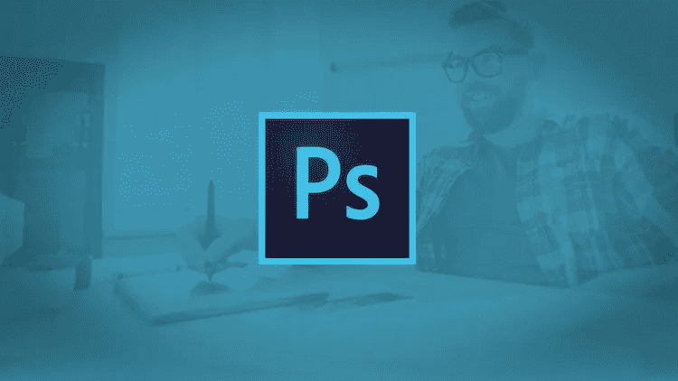
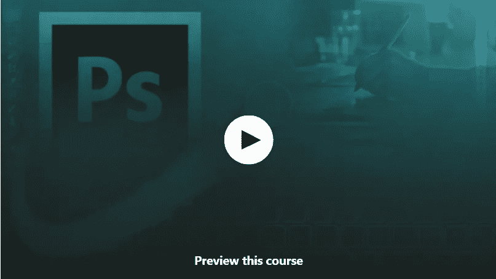
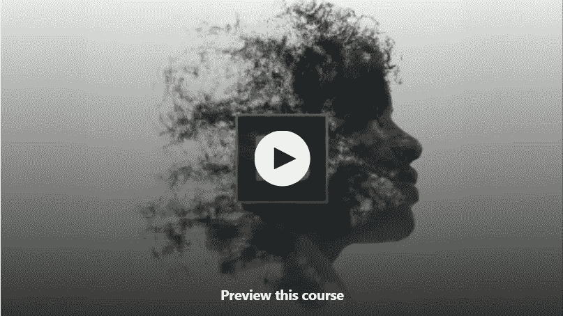
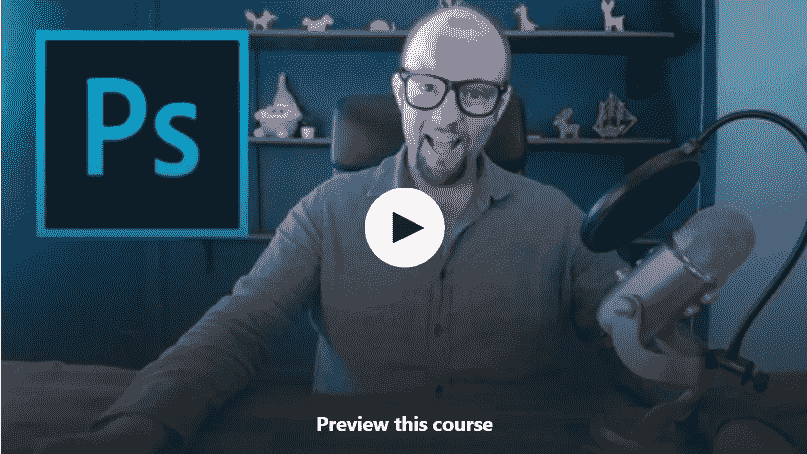
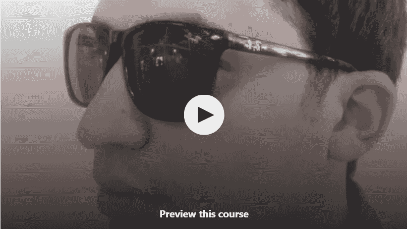
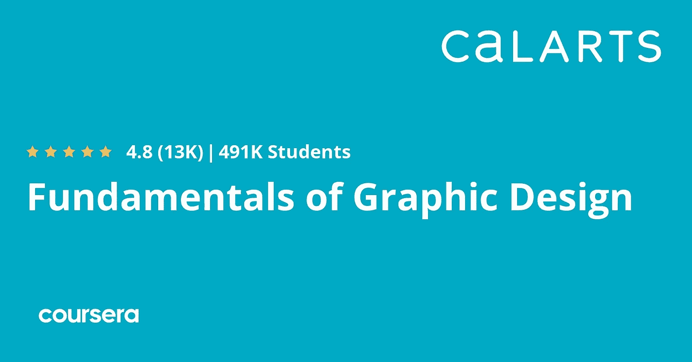

# 2023 年在线学习 Adobe Photoshop CC 的 6 门免费课程

> 原文：<https://medium.com/javarevisited/6-free-online-courses-to-learn-adobe-photoshop-cc-for-beginners-47edcd2bdda5?source=collection_archive---------0----------------------->

## 我最喜欢的免费在线课程是学习 2023 年 Udemy、Coursera 和 Pluralsight 的平面设计和网页设计的 Photoshop 工具

image_credit — udemy

大家好，如果你想成为一名网页设计师或图形设计师，想学习 Adobe Photoshop CC，这是最流行的设计工具之一，并在 Udemy、YouTube 和 Coursera 上寻找最好的免费在线课程来从头学习 Photoshop，那么你来对地方了。

以前我已经分享过 [**免费网页设计课程**](/javarevisited/7-free-online-courses-to-become-a-web-designer-and-frontend-developer-in-2020-dca73bc7fdc4?source=---------14------------------) ，在这篇文章里，我准备分享 Udemy 和 Coursera 的 5 门免费课程，从零开始学习 Photoshop online。

这些 Adobe Photoshop 课程由专业图形设计师和 Photoshop 专家创建，如 [Daniel Walter Scott](https://click.linksynergy.com/deeplink?id=CuIbQrBnhiw&mid=39197&murl=https%3A%2F%2Fwww.udemy.com%2Fuser%2Fdanielwalterscott%2F) ，Adobe 认证讲师& Adobe 认证专家，受到成千上万开发人员的信任，可以学习 Photoshop 技能，而且它们是绝对免费的。

你可以用它们来学习 Photoshop 技巧，开始你的平面设计师或网页设计师的职业生涯。

对具有 Photoshop 技能的专业人员有巨大的需求，各种规模的公司都需要一名 UI 设计师。这也是建立自己的事业和做自由职业者的一大技巧。像 Fiverr 和 Upwork 这样的网站有很多适合 Photoshop 专业人士的工作。

在过去的十年里，每个行业都经历了剧烈的演变，纸和笔几乎从社会中消失了。大多数人现在都在转向数字技术。

在这个时代，每个企业都在互联网上寻找客户。企业更加注重在线促销，而不是在杂志或报纸上刊登广告。这意味着对图形设计师和网页设计师的需求呈指数增长，对 Photoshop 技能的需求也是如此。毫无疑问，Photoshop 是最受欢迎和最成熟的平面设计工具之一，对于任何网页设计师或平面设计师来说都是必不可少的。如今，客户对图形(图像和视频)更感兴趣。

商业行业的这些发展为图形设计师提供了广泛的机会。早先，图形设计不被认为是主流工作，但现在，它是收入最高的职业之一。本文为图形设计爱好者挑选了 6 门*最好的免费在线课程*。所有这些课程都侧重于 Photoshop，因为它被认为是创建图形的最强大的工具。

顺便说一句，如果你不介意为一门高质量的课程支付一些钱，那么我也推荐 Udemy 网站上克里斯蒂安·多鲁·巴林的[**Photoshop 终极培训:从初学者到专业者**](https://click.linksynergy.com/deeplink?id=JVFxdTr9V80&mid=39197&murl=https%3A%2F%2Fwww.udemy.com%2Fcourse%2Fultimate-photoshop-training-from-beginner-to-pro%2F) 课程。你可以在优购上花 10 美元买到它。

 [## Photoshop 终极培训:从初学者到专业人员

### Chris Barin 是一名专业的网页和应用程序设计师，拥有近 10 年的 Photoshop 经验。他也是土坯工…

udemy.com](https://click.linksynergy.com/deeplink?id=JVFxdTr9V80&mid=39197&murl=https%3A%2F%2Fwww.udemy.com%2Fcourse%2Fultimate-photoshop-training-from-beginner-to-pro%2F) 

# 2023 年 6 个最适合初学者在线学习的免费 Photoshop 课程

这些是 2023 年你可以加入学习 Photoshop 的最好的在线课程。这些课程是由专家创建的，受到成千上万学习 Photoshop 的开发者和设计师的信任。

他们也很实惠，尤其是 [Udemy](/javarevisited/15-best-udemy-courses-programmers-can-buy-on-black-friday-and-cyber-monday-2020-a803874f41d9) 的 Photoshop 课程。你可以在不时发生的几次 Udemy 大减价中只花 10 美元买到它们。

## 1. [Photoshop 基础](https://click.linksynergy.com/deeplink?id=JVFxdTr9V80&mid=39197&murl=https%3A%2F%2Fwww.udemy.com%2Fcourse%2Fphotoshop-fundamentals-in-one-hour%2F)【Udemy 免费课程】

这可能是 Udemy 上初学者学习 Photoshop 的最好的免费课程。为了在图形设计领域取得成功，你必须彻底了解基础知识。

本课程将帮助你学习与 photoshop 相关的所有基础知识，在课程结束时，你将有足够的能力创作你的第一幅数字绘画。

这些课程的所有环节就像一个坚实的基础，在这里你可以建立一个光明的职业生涯。除此之外，这个课程没有年龄限制，任何人，小孩或老人都可以参加。这是一个相当短(38 分钟的课程)和简单的课程，有超过 68，000 名学生报名参加。[哈迪·福勒](https://click.linksynergy.com/deeplink?id=CuIbQrBnhiw&mid=39197&murl=https%3A%2F%2Fwww.udemy.com%2Fuser%2Fhardyfowler%2F)是这门课程的创始人，他不收取任何费用，这样任何人都可以学习 photoshop，并开始他们的职业生涯。

**这里是加入这个免费课程的链接** — [Photoshop 基础](https://click.linksynergy.com/deeplink?id=JVFxdTr9V80&mid=39197&murl=https%3A%2F%2Fwww.udemy.com%2Fcourse%2Fphotoshop-fundamentals-in-one-hour%2F)

## 2. [Photoshop CC:短短 2 个小时的 Photoshop 精华](https://click.linksynergy.com/deeplink?id=CuIbQrBnhiw&mid=39197&murl=https%3A%2F%2Fwww.udemy.com%2Fcourse%2Fphotoshop-cc-introduction-tutorial-quick-start%2F)

如果你正在寻找一个免费的在线但详细的 Photoshop 课程，这个课程是给你的。这位名叫[亚当·佐林格](https://click.linksynergy.com/deeplink?id=CuIbQrBnhiw&mid=39197&murl=https%3A%2F%2Fwww.udemy.com%2Fuser%2Fadamzollinger2%2F)的教师将教你如何从头开始使用 photoshop，并让你成为一名 photoshop 专家。除此之外，你还会学到 photoshop 中所有可用的工具。简而言之，这门课程将帮助你获得 photoshop 的所有必要知识，你不需要任何关于 Photoshop 的其他课程。这是一门 2.5 小时的课程，评分为 4.5 分(满分为 5 分)，目前已有超过 55，000 名学生注册了这门课程。如果你需要一步到位的解决方案，你必须看看这个。

**这里是加入这个免费课程的链接**——[短短 2 小时内的 Photoshop 精要](https://click.linksynergy.com/deeplink?id=CuIbQrBnhiw&mid=39197&murl=https%3A%2F%2Fwww.udemy.com%2Fcourse%2Fphotoshop-cc-introduction-tutorial-quick-start%2F)

## 4.[网页设计初学者 Photoshop CC](https://click.linksynergy.com/deeplink?id=JVFxdTr9V80&mid=39197&murl=https%3A%2F%2Fwww.udemy.com%2Fcourse%2Fphotoshop-for-web-design-beginners-version2%2F)【Udemy 免费课程】

这是另一个很棒的免费在线课程，学习 Udemy 上的 Photoshop CC。网页设计已经成为主流，每个公司都有一个独立的团队。这门课程将教你如何在网页设计中使用图形。

讲师[卡尔·希顿](https://click.linksynergy.com/deeplink?id=CuIbQrBnhiw&mid=39197&murl=https%3A%2F%2Fwww.udemy.com%2Fuser%2Fwebcoursesbangkokcarl%2F)将教授如何使用 photoshop 制作网页图片。除此之外，在本课程中，你将学习如何创建简单的网页设计。

超过 18 万名学生报名参加了这一长达 2 小时的课程。如果你想从事网页设计，你必须尝试这门课程。它将教授[网页设计](/javarevisited/7-free-courses-to-learn-bootstrap-for-web-designers-and-developers-5135215648f1)中与图形相关的一切。

**这是加入本课程的链接** — [网页设计初学者 Photoshop CC](https://click.linksynergy.com/deeplink?id=JVFxdTr9V80&mid=39197&murl=https%3A%2F%2Fwww.udemy.com%2Fcourse%2Fphotoshop-for-web-design-beginners-version2%2F)

## 4.[Photoshop 中惊人的照片效果](https://click.linksynergy.com/deeplink?id=JVFxdTr9V80&mid=39197&murl=https%3A%2F%2Fwww.udemy.com%2Fcourse%2Famazing-photo-effects-in-photoshop%2F)【免费 Udemy 课程】

这是另一个免费学习 Photoshop 的最好的 Udemy 课程。本课程着重于图形设计的一个特殊方面，即照片编辑。通过本课程，您将学习所有可用于编辑照片的不同元素。

导师 Enver Gubran 将教你将普通照片转换成令人惊叹的照片的艺术。照片编辑是一种魔法，一旦你学会了这种魔法，你实际上可以在图形设计中拥有一个光明的未来。

除此之外，如果你愿意，照片编辑可以帮助你获得一些行业曝光率，有几十家公司在寻找优秀的照片编辑。这门课程将帮助你成为一名优秀的图片编辑。这是一个 100 分钟的课程，因此，你不会花太多时间来学习魔术。根据指导老师的说法，照片编辑需要练习和耐心。在本课程中，你将使用 PhotoShop CC。因此，在开始会话之前，最好在系统上安装这个工具。

**这里是加入这个免费课程的链接**——[Photoshop 中令人惊叹的照片效果](https://click.linksynergy.com/deeplink?id=JVFxdTr9V80&mid=39197&murl=https%3A%2F%2Fwww.udemy.com%2Fcourse%2Famazing-photo-effects-in-photoshop%2F)

## 5.初学 Photoshop 免费课程【Evnato Tuts+ Youtube】

这是另一个惊人的免费课程，学习 Photoshop 的初学者。本课程的主讲人不是别人，正是 Udemy 上的 [Daniel Walter Scott](https://click.linksynergy.com/deeplink?id=CuIbQrBnhiw&mid=39197&murl=https%3A%2F%2Fwww.udemy.com%2Fuser%2Fdanielwalterscott%2F) 、Adobe 认证讲师& Adobe 认证专家和[Adobe Photoshop CC-Essentials 培训课程 T5。](https://click.linksynergy.com/deeplink?id=CuIbQrBnhiw&mid=39197&murl=https%3A%2F%2Fwww.udemy.com%2Fcourse%2Fadobe-photoshop-cc-essentials-training-course%2F)

本课程是为初学者开设的，因此没有先决条件，没有 Photoshop 经验的人也可以参加本课程。您将在 23 节课中从初学者到专业人员，探索所有基本的 Photoshop 工具和技术。

你将从头开始，并很快进入更令人兴奋的技术。了解如何使用 Photoshop 图层样式，如何更改色阶，如何修饰和处理图像，等等。

如果你是一名摄影师、营销人员或设计师，本课程将为你提供所需的核心技能。你可以在 Youtube 的 Envato Tuts+频道或者就在这里观看这个免费课程。

## 6.[平面设计基础](https://coursera.pxf.io/c/3294490/1164545/14726?u=https%3A%2F%2Fwww.coursera.org%2Flearn%2Ffundamentals-of-graphic-design)【免费 Coursera 课程】

这是一门 Coursera 课程，据其讲师称，50%的学生在参加课程后开始了他们的图形设计生涯。到目前为止，超过 49 万名学生注册了这门课程，它的评分为 4.8 分(满分 5 分)。这门课几乎没有任何负面反馈，每个学生都很喜欢。这门课程并不完全是关于 photoshop 的，但是它会给你一个基础，在这个基础上你可以继续你的图形设计生涯。

本课程是 [**平面设计专业**](https://coursera.pxf.io/c/3294490/1164545/14726?u=https%3A%2F%2Fwww.coursera.org%2Fspecializations%2Fgraphic-design) 的一部分，它为你提供了所有关于平面设计的基本信息。教师将教你创造引人入胜的设计，响应排版所需的所有元素。

 [## 装帧设计艺术

### 做出引人注目的设计。学习和应用平面设计的原则，建立一个全面的品牌项目…

coursera.pxf.io](https://coursera.pxf.io/c/3294490/1164545/14726?u=https%3A%2F%2Fwww.coursera.org%2Fspecializations%2Fgraphic-design) 

一旦你完成了，你将成为颜色、形状和排版的专家。指导将帮助你理解图形设计的每一个小方面。除此之外，这是一个为期 4 周的课程，有实时作业。顺便说一句，你不能跳过这些作业，你必须完成它们，稍后老师会检查你的作业，并给你相应的分数。

**这里是加入本课程**——[平面设计基础](https://coursera.pxf.io/c/3294490/1164545/14726?u=https%3A%2F%2Fwww.coursera.org%2Flearn%2Ffundamentals-of-graphic-design)的链接

而且，如果你觉得 Coursera 的课程和认证有用，那么我也建议你加入 Coursera Plus**，这是 Coursera 的一个订阅计划，让你可以无限制地访问他们最受欢迎的课程、专业、专业证书和指导项目。**

** [## Coursera Plus |无限制访问 7，000 多门在线课程

### 用 Coursera Plus 投资你的职业目标。无限制访问 90%以上的课程、项目…

coursera.pxf.io](https://coursera.pxf.io/c/3294490/1164545/14726?u=https%3A%2F%2Fwww.coursera.org%2Fcourseraplus) 

以上就是 2023 年 **6 门学习 Adobe Photoshop CC 的最佳免费在线课程**。毫无疑问，Adobe Photoshop 是最受欢迎和最受欢迎的设计工具之一，学习 Photoshop 可以为你打开作为 UI 和 UX 设计师的大门。

有了这些*免费的 Photoshop 在线课程和教程，*你会知道要成为一名成功的图形设计师需要付出多少努力。你必须注意，你可以在参加一些课程后立即开始你的职业生涯，但建议首先彻底学习所有的基础知识，一旦你有信心，你可以在实际项目中尝试。

您可能想探索的其他**网页设计和网页开发文章**

*   [学习响应式网页设计的 5 门最佳课程](https://www.java67.com/2020/08/top-5-courses-to-learn-responsive-web-design-best.html)
*   [在线学习 React.js 的五大课程](https://javarevisited.blogspot.com/2018/08/top-5-react-js-and-redux-courses-to-learn-online.html)
*   [学习使用 Python 进行全栈 web 开发的 5 门课程](https://javarevisited.blogspot.com/2020/06/top-5-courses-to-learn-python-full-stack-web-development.html)
*   [2023 年学习 Web 开发的十大课程](https://dev.to/javinpaul/top-6-courses-to-learn-web-development-best-of-lot-2fae)
*   [完整的前端开发路线图](https://javarevisited.blogspot.com/2019/02/the-2019-web-developer-roadmap.html)
*   [Web 开发的五大 Python 框架](https://javarevisited.blogspot.com/2019/04/top-5-python-web-development-frameworks.html)
*   [初学者学习 WordPress 的 5 个最佳在线课程](https://javarevisited.blogspot.com/2020/08/top-5-courses-to-learn-wordpress-in.html)
*   [成为全栈式 Web 开发人员的 10 大在线课程](/@javinpaul/top-10-online-courses-to-become-a-fullstack-web-developer-in-2020-d608a6b63232)
*   【Java 和 Web 开发人员应该学习的 10 个框架
*   [Web 开发人员学习 Angular 的 10 门免费课程](https://javarevisited.blogspot.com/2019/04/10-free-angular-and-react-courses-for.html)
*   [10 JavaScript 教程 Web 开发人员应该查看](https://javarevisited.blogspot.com/2018/06/top-10-courses-to-learn-javascript-in.html)
*   [每个 Fullstack 开发者都应该知道的 10 个框架](https://javarevisited.blogspot.com/2019/01/10-web-development-frameworks-fullstack-developer-should-learn.html)
*   [2023 年学习 JavaScript 的 12 门免费课程](/javarevisited/12-free-courses-to-learn-javascript-and-es6-for-beginners-and-experienced-developers-aa35874c9a32)
*   [学习 Node.js 和 Express.js 框架的前 5 门课程](http://javarevisited.blogspot.sg/2018/01/top-5-nodejs-and-express-js-online-courses-for-web-developers.html)
*   [完整的 React.js 开发者路线图](https://javarevisited.blogspot.com/2018/10/the-2018-react-developer-roadmap.html)
*   [10 门免费学习网页开发打字稿的课程](/javarevisited/top-10-free-typescript-courses-to-learn-online-best-of-lot-44bce9da41d1)
*   [2023 年 Java 开发人员应该学会的 10 件事](https://javarevisited.blogspot.com/2017/12/10-things-java-programmers-should-learn.html#axzz5atl0BngO)
*   [2023 年学习 Web 开发的前 5 门课程](https://javarevisited.blogspot.com/2018/02/top-5-online-courses-to-learn-web-development.html)
*   [初学者学习渐进式网络应用的 5 门课程](https://javarevisited.blogspot.com/2020/08/top-5-courses-to-learn-progressive-web-app-development.html)
*   [成为全栈 Java 开发者的 10 门免费课程](/javarevisited/10-free-full-stack-java-development-courses-for-beginners-and-experienced-programmers-8473390bec03)

感谢您阅读本文。如果你喜欢这些*最好的平面和网页设计免费 Photoshop 课程*，那么请与你的朋友和同事分享。如果您有任何问题或反馈，请留言。

如果你不介意在学习上投资一些钱，那么我也推荐 Udemy 网站上克里斯蒂安·多鲁·巴林的[**Photoshop 终极培训:从初学者到专业者**](https://click.linksynergy.com/deeplink?id=JVFxdTr9V80&mid=39197&murl=https%3A%2F%2Fwww.udemy.com%2Fcourse%2Fultimate-photoshop-training-from-beginner-to-pro%2F) 课程。我在优购网上只花了 10 美元就买到了它，它超级棒。

 [## Photoshop 终极培训:从初学者到专业人员

### Chris Barin 是一名专业的网页和应用程序设计师，拥有近 10 年的 Photoshop 经验。他也是土坯工…

udemy.com](https://click.linksynergy.com/deeplink?id=JVFxdTr9V80&mid=39197&murl=https%3A%2F%2Fwww.udemy.com%2Fcourse%2Fultimate-photoshop-training-from-beginner-to-pro%2F)**