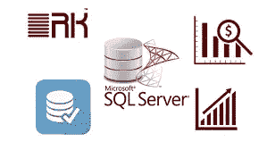

# 6 2023 年最佳免费 T-SQL 和微软 SQL Server 初学者在线课程

> 原文：<https://medium.com/javarevisited/6-free-t-sql-and-microsoft-sql-server-online-courses-for-beginners-7f500358dfd8?source=collection_archive---------0----------------------->

## 这些是你可以参加的从零开始学习微软 SQL Server 和 T-SQL 的最好的免费在线课程。

大家好，如果你想学习微软 SQL 和 T-SQL，并寻找免费的在线课程，那么你来对地方了。早些时候，我已经分享了[最佳 SQL Server 课程](https://javarevisited.blogspot.com/2020/02/top-5-courses-to-learn-microsoft-sql-server-mssql.html)和[数据库课程](/hackernoon/top-5-sql-and-database-courses-to-learn-online-48424533ac61)，在本文中，我将为初学者分享最佳免费 T-SQL 课程。

Microsoft SQL Server 不仅是流行的数据库解决方案之一，也是微软提供的最复杂的软件之一。它需要你有网络、[数据库](https://javarevisited.blogspot.com/2018/05/top-5-sql-and-database-courses-to-learn-online.html)，和[编程](https://javarevisited.blogspot.com/2014/01/10-tips-to-improve-programming-skill-become-better-programmer.html)的基础。

如果没有严格的学习和多年的实践经验，这种广泛的技能通常很难获得。因为学习和掌握 SQL Server 很难，所以对 SQL Server 数据库管理员和程序员的需求一直很高，尤其是在银行业。

我知道我在伦敦和世界各地的许多朋友在从程序员开始为那些大银行工作并赚取高薪后成为了 SQL Server DBAs。
作为一名开发人员，我还需要运行 [SQL 查询](https://javarevisited.blogspot.com/2017/01/a-better-way-to-write-sql-queries.html)来解决问题、生成报告或进行数据分析。有时，我还需要为部署和回滚、存储过程、触发器和其他数据库东西编写 SQL 脚本。如果你的工作也需要一些关于微软 SQL server 的知识，并且你正在寻找一些优秀的资源从零开始学习 SQL Server，那么你来对地方了。

在本文中，我将分享一些**最好的微软 SQL Server 在线课程，**这些课程也是免费的。

如果你不介意从免费资源中学习(这听起来可能很荒谬，但有些人因为质量而不喜欢免费资源，他们反而想把时间花在付费的东西上，如果你是这样的人，你也可以查看这个列表的[最佳 SQL 课程](https://javarevisited.blogspot.com/2018/05/top-5-sql-and-database-courses-to-learn-online.html))，那么这些课程真的可以帮助你学习和理解 SQL Server 或 MSSQL，这是人们更普遍知道的。

# 2023 年学习微软 SQL Server 和 T-SQL 的 6 大免费课程

在过去，我已经分享了很多资源，如[书籍](https://javarevisited.blogspot.com/2018/07/top-5-advanced-sql-books-for.html)，课程，和[教程](https://javarevisited.blogspot.com/2015/11/2nd-highest-salary-in-oracle-using-rownumber-rank-example.html)来学习其他数据库，如 [Oracle](http://www.java67.com/2018/02/5-free-oracle-and-microsoft-sql-server-online-courses.html) 和 [MySQL](https://javarevisited.blogspot.com/2018/05/top-5-mysql-courses-to-learn-online.html) 等。如果你是新来的，那么你也可以检查一下，但是这里有一些免费的微软 SQL Server 和 T-SQL 在线课程的列表，你可以用它们来在线学习。

## [1。数据库和 SQL 查询介绍](http://bit.ly/2BQuq2O)【Udemy】

这是学习 SQL Server 和 T-SQL 的第一批免费课程之一。本课程逐步介绍了数据库的概念和 SQL 查询。

本课程没有先决条件。如果你想在下一次作为分析师的面试中熟悉数据库和查询的概念，这是一门适合你的课程。

您所需要的只是一台 windows 机器，我们将一步一步地介绍，从设置您的环境到创建您的第一个表，再到编写您的第一个查询。

本课程的组织方式可以让你跟得上我。学完本课程后，你应该能够熟练地编写简单的查询，包括与日期、字符串操作、聚合等相关的查询。

**这里是免费加入本课程的链接**——[数据库和 SQL 查询简介](http://bit.ly/2BQuq2O)

## 2.[高级数据库和 SQL 查询](http://bit.ly/2DaX8vH)

这是另一个学习高级 T-SQL 查询概念的非常棒的免费在线课程。从初学 SQL 程序员到编写复杂的 SQL 查询。

本课程是高级 TSQL 查询课程。本课程期望学生已经了解基本的数据库概念，并能熟练地编写基本的 TSQL 查询，如选择、连接等。

以下是你将在这个**免费 T-SQL 课程**中学到的主要东西

1.  如何编写复杂的 T-SQL 查询？
2.  如何了解现有的不同 TSQL 功能
3.  如何编写更高效的 T-SQL 代码

学生应该学过作者以前的课程([数据库和查询介绍](http://bit.ly/2BQuq2O))。本课程涵盖了视图、触发器、动态查询等高级概念。所有演示的 TSQL 脚本都已上传。这门课程大约 2 个多小时，在每个概念的结尾都有作业。

**这是加入本课程** — [高级数据库和 SQL 查询](http://bit.ly/2DaX8vH)的链接

## 3. [SQL Server 婴儿步骤:安装和配置](https://click.linksynergy.com/fs-bin/click?id=JVFxdTr9V80&subid=0&offerid=323058.1&type=10&tmpid=14538&RD_PARM1=https%3A%2F%2Fwww.udemy.com%2Fsql-server-baby-step%2F)

这是另一个面向初学者的免费在线 SQL Server 学习课程，您将学习如何设置您的开发环境。本课程是一个绝对的初学者教程，旨在快速学习如何在您的计算机上设置 Microsoft SQL Server 练习环境。

学完本课程后，您将知道如何安装 SQL Server 并为自己创建一个练习环境。

以下是加入这一免费课程的链接— [SQL Server 初级步骤:安装和配置](https://click.linksynergy.com/fs-bin/click?id=JVFxdTr9V80&subid=0&offerid=323058.1&type=10&tmpid=14538&RD_PARM1=https%3A%2F%2Fwww.udemy.com%2Fsql-server-baby-step%2F)

## 4.[成为 SQL Server 数据库管理员的终极指南](https://click.linksynergy.com/fs-bin/click?id=JVFxdTr9V80&subid=0&offerid=323058.1&type=10&tmpid=14538&RD_PARM1=https%3A%2F%2Fwww.udemy.com%2Fthe-ultimate-guide-in-becoming-a-sql-server-dba%2F)

关于成为 SQL Server DBA，您想知道但又不敢问的一切。本课程的主要目的是让学员了解什么是 SQL Server 管理，成为 SQL DBA 的必备课程是什么。

您还将获得一些关于工作期望的指导，并获得一些安装和浏览 SQL Server management studio 的实践经验。

这门免费的 SQL 课程将提供所需课程的总结，使学生能够为现实世界的 IT 行业做好准备。

以下是加入本课程的链接— [成为 SQL Server 数据库管理员的终极指南](https://click.linksynergy.com/fs-bin/click?id=JVFxdTr9V80&subid=0&offerid=323058.1&type=10&tmpid=14538&RD_PARM1=https%3A%2F%2Fwww.udemy.com%2Fthe-ultimate-guide-in-becoming-a-sql-server-dba%2F)

## 5.[如何开始您的 SQL Server DBA 职业生涯](https://click.linksynergy.com/fs-bin/click?id=JVFxdTr9V80&subid=0&offerid=323058.1&type=10&tmpid=14538&RD_PARM1=https%3A%2F%2Fwww.udemy.com%2Fhow-to-become-a-real-world-sql-server-dba%2F)

SQL Server 数据库管理员负责 SQL Server 数据库的设计、实现、支持和维护。该角色还包括为未来的数据增长和容量设计、构建和扩展数据库。

DBA 还负责数据对用户和客户的安全性、性能和可用性。本课程将为您如何开始 SQL Server DBA 之旅提供一些指导。

以下是加入这一免费课程的链接— [如何开始您的 SQL Server DBA 职业生涯](https://click.linksynergy.com/fs-bin/click?id=JVFxdTr9V80&subid=0&offerid=323058.1&type=10&tmpid=14538&RD_PARM1=https%3A%2F%2Fwww.udemy.com%2Fhow-to-become-a-real-world-sql-server-dba%2F)

## [6。SQL Server 简介](https://pluralsight.pxf.io/c/1193463/424552/7490?u=https%3A%2F%2Fwww.pluralsight.com%2Fcourses%2Fintro-sql-server)

这是一门关于 SQL Server 的入门课程。本课程从关系数据库的高级介绍开始。它接着介绍了作为 SQL Server 一部分的数据修改和数据定义语言的使用。

这是一个很好的课程，但不是完全免费的，你需要一个 Pluralsight 会员才能进入这个课程，费用约为每月 29 美元或每年 299 美元(14%的折扣)。

以下是参加本课程的链接—[SQL Server 简介](https://pluralsight.pxf.io/c/1193463/424552/7490?u=https%3A%2F%2Fwww.pluralsight.com%2Fcourses%2Fintro-sql-server)

如果你还没有 [Pluralsight 会员资格](http://pluralsight.pxf.io/c/1193463/424552/7490?u=https%3A%2F%2Fwww.pluralsight.com%2Flearn)，我鼓励你申请一个，因为它可以让你访问他们 7000 多门关于所有最新主题的在线课程，如前端和后端开发、机器学习等。

它还包括互动测验、练习和最新认证材料。这更像是软件开发人员的网飞，因为学习是我们工作不可或缺的一部分，Pluralsight 会员资格是在竞争中保持领先的一个很好的方式。

他们还提供一个 [**10 天的免费试用**](http://pluralsight.pxf.io/c/1193463/424552/7490?u=https%3A%2F%2Fwww.pluralsight.com%2Flearn) 无需任何承诺，这是一个很好的方式，不仅可以免费参加这个课程，还可以在加入 Pluralsight 之前检查课程的质量。

 [## 个人技术技能|多视角

### 借助 Pluralsight，在开发运维、机器学习、云、安全基础设施等领域构建所需技能…

pluralsight.pxf.io](http://pluralsight.pxf.io/c/1193463/424552/7490?u=https%3A%2F%2Fwww.pluralsight.com%2Flearn) 

以上是一些最好的免费在线课程，供你自己学习微软 SQL Server **和 T-SQL** 。你可以在办公室或家里参加这些课程，按照自己的进度学习。

这些课程最好的部分是它们是由 SQL Server 开发专家和 DBA 编写的，出于社区和营销目的，这些课程是免费的。

你不需要付出什么，但是是的，你要花时间；因此，我建议你浏览每门课程的预习，选择你能联系到的课程。这很重要。

其他**免费编程课程**你可能喜欢
[5 门课程学习 Oracle 和微软 SQL Server 数据库](http://www.java67.com/2018/02/5-free-oracle-and-microsoft-sql-server-online-courses.html)
[5 门免费课程学习 Servlet、JSP、 和 JDBC](http://www.java67.com/2018/02/5-free-servlet-jsp-and-jdbc-online-courses-for-java-developers.html)
[7 门免费学习数据库和 SQL 的课程](/javarevisited/7-free-courses-to-learn-database-and-sql-for-programmers-and-data-scientist-e7ae19514ed2)
[10 门面向程序员和开发人员的教育性课程](https://javarevisited.blogspot.com/2020/05/top-10-educative-courses-for-programmers.html)
[5 门免费学习 Java 和 DevOps 工程师的 Docker 课程](http://www.java67.com/2018/02/5-free-docker-courses-for-java-and-DevOps-engineers.html)
[5 门免费学习 Ruby 和 Rails 的课程](http://www.java67.com/2018/02/5-free-ruby-and-rails-courses-to-learn-online.html)
[5 门免费学习区块链技术的课程](http://www.java67.com/2018/02/5-free-blockchain-technology-courses.html)
[前端和后端开发者路线图](https://javarevisited.blogspot.com/2019/02/the-2019-web-developer-roadmap.html)
[3](http://www.java67.com/2018/02/3-books-and-courses-to-learn-restful-web-services-with-spring.html)
[学习 Oracle 和 MSSQL 的 10 门免费课程](/javarevisited/top-10-free-courses-to-learn-microsoft-sql-server-and-oracle-database-in-2020-6708afcf4ad7)
[Java 和 Web 开发人员的 10 大 Pluralsight 课程](http://javarevisited.blogspot.sg/2017/12/top-10-pluralsight-courses-java-and-web-developers.html)
[Udemy](http://javarevisited.blogspot.sg/2018/01/top-10-udemy-courses-for-java-and-web-developers.html#axzz5B6EWE6M7)的 10 大 Java 和 Web 开发课程

感谢您阅读本文。如果你喜欢这些*最好的免费微软 SQL Server 和 T-SQL 在线课程*，那么请分享给你的朋友和同事。如果您有任何问题或反馈，请留言。

**P. S. —** 如果你不介意花点钱学习微软 SQL Server 的宝贵技能，那么我也建议你看看 Udemy 上 Brewster Knowlton 的 [**微软 SQL 初学者**](http://bit.ly/2zLX4Bu) 课程。这是一门综合课程，同时学习 SQL Server 和 T-SQL。

 [## Microsoft SQL Server 和 T-SQL:从初级到高级

### Brewster Knowlton 曾在商业智能行业的各个方面工作过。具有丰富的写作经验…

udemy.com](http://bit.ly/2zLX4Bu)