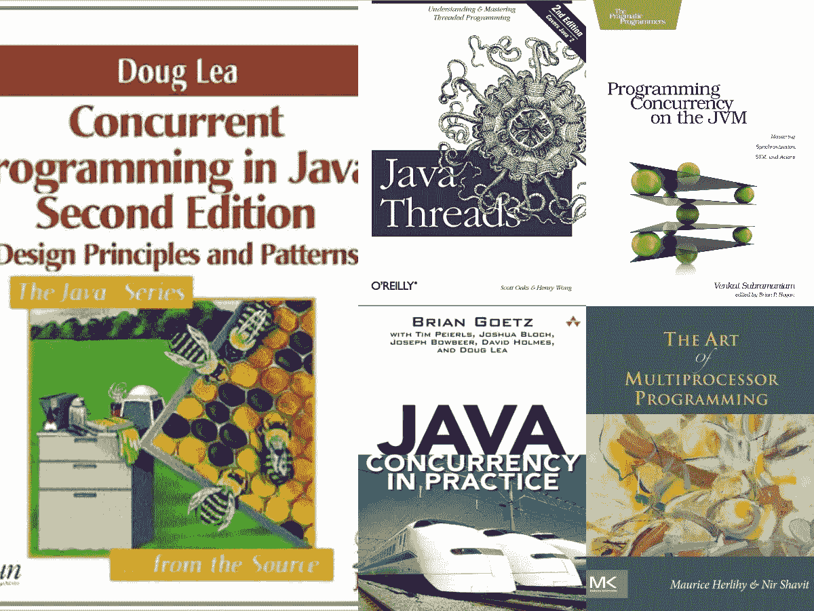
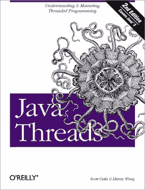
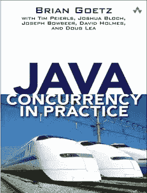
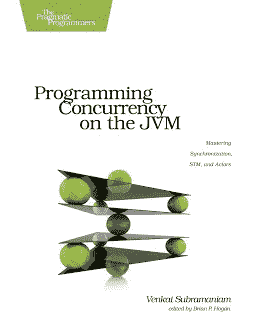
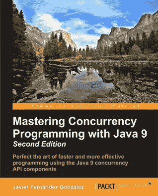

# Java 程序员的 6 本最佳多线程和并发书籍

> 原文：<https://medium.com/javarevisited/6-multithreading-and-concurrency-books-every-java-programmer-should-read-b6a08d2aae54?source=collection_archive---------0----------------------->

大家好，你们可能知道书籍对于学习新的东西是必不可少的，尽管处于电子时代，书籍在互联网和博客面前已经失去了一些光彩，但我仍然阅读并推荐它们以获得任何主题的完整和权威的知识，如并发编程。

并发性是一个很难掌握的话题，但同时也是非常重要的，这也是书籍扮演重要角色的原因。之前，我已经分享了 [**最佳 Java 并发课程**](/javarevisited/8-best-multithreading-and-concurrency-courses-for-experienced-java-developers-8acfd3b25094) ，在本文中，我将分享**学习 Java 中多线程和并发的六本最佳书籍**。你可以把它们和那些课程结合起来，深入学习多线程和并发。

这些书涵盖了基础知识，从如何创建和启动线程开始，并行编程，[并发设计模式](http://java67.blogspot.com/2015/12/producer-consumer-solution-using-blocking-queue-java.html)，并发的优势，当然还有陷阱、问题和多线程带来的问题。

学习并发编程是一项艰巨的任务，即使是在 Java 中也是如此，在其他语言中也是如此，如 c++(T1)或现代 JVM 语言，如 T2 Groovy(T3)、T4 Scala(T5)、科特林(T7)、闭包和 JRuby。

由于我从事动态 Java 开发已经超过 10 年，我可以说这是从并发编程开始的最佳语言，因为它的结构，内置的并发支持，如[同步](http://javarevisited.blogspot.com/2011/04/synchronization-in-java-synchronized.html)、[易变](http://javarevisited.blogspot.com/2011/06/volatile-keyword-java-example-tutorial.html)和[最终](http://java67.blogspot.com/2015/07/how-to-use-final-keyword-in-java-example.html)关键字，最后还因为互联网和社区中有大量可用的信息。

顺便说一句，在深入研究多线程和并发性之前，需要对 Java 的基本概念有一个很好的了解。如果你是 Java 世界的新手，我建议你首先通过 Udemy 上的 [**完整的 Java MasterClass**](https://click.linksynergy.com/fs-bin/click?id=JVFxdTr9V80&subid=0&offerid=323058.1&type=10&tmpid=14538&RD_PARM1=https%3A%2F%2Fwww.udemy.com%2Fjava-the-complete-java-developer-course%2F) 课程来学习基础知识，然后阅读这些书籍会更有意义。

<https://click.linksynergy.com/fs-bin/click?id=JVFxdTr9V80&subid=0&offerid=323058.1&type=10&tmpid=14538&RD_PARM1=https%3A%2F%2Fwww.udemy.com%2Fjava-the-complete-java-developer-course%2F>  

# 值得一读的 6 本关于 Java 多线程和并发性的最佳书籍

下面是我列出的掌握线程基础知识、多线程陷阱以及 Java 并发编程的原则和模式的书籍。他们不仅会教你该做什么，还会教你不该做什么。

由于多线程是一个棘手的话题，所以最好参考多本书，因为你会发现你与一些作者的联系比其他人更好。

## 1.[多处理器编程的艺术](https://www.amazon.com/Art-Multiprocessor-Programming-Revised-Reprint/dp/0123973376?tag=javamysqlanta-20)

理想情况下，这本书应该是任何程序员阅读的第一本关于并发和多处理器编程的书，它涵盖了学术内容，如经典的[生产者-消费者](http://javarevisited.blogspot.com/2015/06/java-lock-and-condition-example-producer-consumer.html)和[读者-作者](http://javarevisited.blogspot.com/2014/07/top-50-java-multithreading-interview-questions-answers.html)问题，并解释了多处理器和共享内存的一些基础知识。

Maurice Herlihy 和 Nir Shavit 修订的《多处理器编程的艺术》也是任何 Java 开发人员的必读之作，他们只知道如何使用线程 Java，但不熟悉并发编程的基本原理，如[临界区](http://java67.blogspot.com/2016/04/why-double-checked-locking-was-broken-before-java5.html)、[互斥](http://java67.blogspot.com/2013/01/difference-between-synchronized-block-vs-method-java-example.html)、[锁定](http://javarevisited.blogspot.com/2014/10/how-to-use-locks-in-multi-threaded-java-program-example.html)、[共享内存](http://javarevisited.blogspot.com/2012/01/memorymapped-file-and-io-in-java.html)、[内存障碍](http://javarevisited.blogspot.com/2015/10/133-java-interview-questions-answers-from-last-5-years.html)和同步等。我必须说，你必须读这本书才能知道它的实际价值，它真是太神奇了。

如果你需要一门课程来结合这本书，特别是关于并发和性能优化的课程，那么我还建议你去看看 Udemy 网站上 Michael Pogrebinsy 的[**Java 多线程、并发和性能优化**](https://click.linksynergy.com/deeplink?id=JVFxdTr9V80&mid=39197&murl=https%3A%2F%2Fwww.udemy.com%2Fcourse%2Fjava-multithreading-concurrency-performance-optimization%2F) 课程。学习多线程和并发性高级概念的最佳课程之一，重点强调高性能。

简而言之，这是一本真正优秀的书，不仅是 Java 程序员的必读之作，也是任何想要学习并发编程基础知识的人的必读之作，比如 [C++](https://hackernoon.com/top-5-free-c-courses-to-learn-programming-in-2019-d27352277da0) 、 [C#](https://www.java67.com/2019/03/5-free-c-net-courses-to-learn-online.html) 、 [Scala](https://javarevisited.blogspot.com/2019/01/5-free-scala-programming-courses-for-java-programmers-learn-online.html#axzz5jSDZJeu0) 。

## 2. [Java 线程第三版](http://www.amazon.com/dp/0596007825/?tag=javamysqlanta-20)

我读过的第一本书，特别是关于 Java 多线程的，是 Scott Oaks 和 Henry Wong 的《Java Thread 第二版》。这本书棒极了，它教授了创建一个线程的基础知识，以及如何用一些简单明了的例子来使用它们。

他们有关于教学的最好章节之一，[如何使用 Java 中的等待和通知机制](http://javarevisited.blogspot.com/2015/07/how-to-use-wait-notify-and-notifyall-in.html)。第二版唯一的缺点是它没有涵盖新的并发类，如 Java 1.5 中引入的 [CountDownLatch](http://java67.blogspot.com/2015/06/java-countdownlatch-example.html) 、 [CyclicBarrier](http://java67.blogspot.com/2015/06/how-to-use-cyclicbarrier-in-java.html) 或 [Semaphore](http://javarevisited.blogspot.com/2012/05/counting-semaphore-example-in-java-5.html) 。

新的 **Java Thread 第三版**填补了这一空白，现在它涵盖了 J2SE 5.0 的所有新的并发性和同步实用程序。如果你是一个初学者，不太了解什么是线程，它们如何帮助，以及如何使用它们来创建一个多线程应用程序，这是这本书，你应该阅读。

如果你愿意的话，你也可以把这个和 [**将并发和多线程应用到通用 Java 模式**](https://pluralsight.pxf.io/c/1193463/424552/7490?u=https%3A%2F%2Fwww.pluralsight.com%2Fcourses%2Fjava-patterns-concurrency-multi-threading) 课程结合起来，学习一些真实世界的东西。

尽管这本书关注的是 Java 编程语言，但如果你想从其他 [JVM](/javarevisited/7-best-courses-to-learn-jvm-garbage-collection-and-performance-tuning-for-experienced-java-331705180686) 语言开始，比如 [Scala](https://hackernoon.com/10-reasons-to-learn-scala-and-functional-programming-2fce385e6ec7?source=user_profile---------24-----------------------) ，它对学习线程的基础知识也很有用。

## 3.[实践中的 Java 并发](http://www.amazon.com/dp/0321349601/?tag=javamysqlanta-20)

实践中许多 Java 并发性的铁杆粉丝会因为没有将这本书放在这个列表的首位而感到愤怒。嗯，我已经订购了《从初级程序员到高级程序员》这本书，这本书当然涵盖了 [Java 并发的高级方面。](https://javarevisited.blogspot.com/2016/06/5-books-to-learn-concurrent-programming-multithreading-java.html)

顺便说一下，如果让我向 Java 程序员推荐一本关于并发和多线程的书，我会推荐这本书。

**Java Concurrency in Practice**是 Java 开发人员关于并发和并发编程的*圣经*，也是任何认真对待并行编程的人的必读之作。这本书有很多好的地方，从他们展示腐败行为的图标开始，然后加以改进。唯一让我担心的是这些概念本身并不容易，很多时候程序员发现阅读这样的书真的很难。如果你也面临同样的问题，我建议你参加由 Heinz M. Kabutz 博士主持的 [**Java 并发实践捆绑包**](https://learning.javaspecialists.eu/courses/concurrency-in-practice-bundle?affcode=92815_johrd7r8) 课程，他是 Java 的拥护者，也是我最喜欢的导师之一。

他开创了这门课程，让你更容易理解书中所阐述的概念。这是本书的一个很好的伙伴，如果你把这本书和这门课程结合起来，你可能会学到更多更深入的东西。

其中一个亮点是他们的术语，这是非常清楚的，当你解释一个复杂和令人困惑的话题时非常重要。

另一个亮点是他们的作者群，其中包括 Java 并发专家 Brian Goetz、编写过 [Effective Java](https://javarevisited.blogspot.com/2017/10/effective-java-3rd-edition-coming-soon.html#axzz5Nf1J69kw) 和 [Java 集合 API](http://javarevisited.blogspot.com/2013/02/concurrent-collections-from-jdk-56-java-example-tutorial.html) 的 Joshua Bloch、`java.util. Concurrent`包中许多类的作者 Doug Lea，比如 Java 中使用最多的并发集合之一`ConcurrentHashMap`。

> 总之，**每个 Java 开发人员都必须在他们的书 self 和 smartphone 中有一本 Java 的并发实践**，以便在他们有时间的时候阅读。

## 4.[Java 并发编程:设计原则和模式](https://www.amazon.com/Concurrent-Programming-Java%C2%99-Principles-Pattern/dp/0201310090?tag=javamysqlanta-20)

这本书是 Doug Lea 关于并发和多线程的另一部杰作。这本书也面向有经验的高级 Java 程序员，他们了解 Java 中多线程的基础知识以及一点并发性。

这本书解释了许多关于 [Java 编程语言](/javarevisited/10-free-courses-to-learn-java-in-2019-22d1f33a3915?source=collection_home---4------8-----------------------)内置同步特性的设计、模式和细节。道格·李在编写`java.util.concurrent`软件包时使用了本书中描述的许多模式和设计。这些书可以通过下面的例子和 Doug Lea 自己写的并发代码得到最好的利用。

这本书还涵盖了 [Java 内存模型](http://javarevisited.blogspot.com/2014/05/double-checked-locking-on-singleton-in-java.html)，这对任何 Java 程序员来说都是非常重要的。尽管我建议任何初学者首先阅读来自[Java Concurrency in Practice](https://javarevisited.blogspot.com/2018/07/is-java-concurrency-in-practice-still-relevant-in-era-of-java8.html)的 Java 内存模型章节，因为它的语言稍微容易理解一些。

如果你愿意的话，你也可以把这个和 Arun Kumar 在 Udemy 上的 [**高效的 Java 多线程和带执行器的并发**](https://click.linksynergy.com/deeplink?id=JVFxdTr9V80&mid=39197&murl=https%3A%2F%2Fwww.udemy.com%2Fcourse%2Fefficient-java-multithreading-with-executors%2F) 课程结合起来，学习更多如何使用执行器在 Java 中获得更好的性能。

## 5.[JVM 上的编程并发](https://www.amazon.com/Programming-Concurrency-JVM-Mastering-Synchronization/dp/193435676X?tag=javamysqlanta-20)

这是并发编程、同步和多线程领域相对较新的一本书。

这是我最喜欢的作者之一 Venkat Subramanian 写的，这本书不仅解释了 Java 中的概念，还解释了其他 JVM 编程语言中的概念，如 [Scala](http://javarevisited.blogspot.com/2014/01/top-5-free-books-to-learn-scala-programming-PDF.html) 、 [Groovy](https://dev.to/javinpaul/scala-groovy-or-kotlin-which-programming-language-java-developers-should-learn-5an5) 、Closure 和 JRuby。

本书的主要亮点是**软件跨国模型(STM)** 和**基于角色的并发**。这本书解释了并发编程的新技术，它允许你比较和选择前沿的东西。

这本书在桌子上放了很多新东西，我想这是最好的卖点。如果你愿意，也可以将本书与 [**实用 Java 并发与 Akka Actor 模型**](https://click.linksynergy.com/deeplink?id=JVFxdTr9V80&mid=39197&murl=https%3A%2F%2Fwww.udemy.com%2Fcourse%2Fpractical-java-concurrency-with-the-akka-actor-model%2F) Udemy 课程相结合，两全其美。

## 6.[用 Java 9 掌握并发编程](https://www.amazon.com/Mastering-Concurrency-Programming-Java/dp/1785887947)

这是少有的涵盖最新 Java 版本并发性变化的书籍之一。

这本书是为有经验的 Java 开发人员编写的，他们对并发有基本的了解，但是想学习如何创建现代并发 Java 应用程序，或者不需要使用流来提高处理效率

以下是你将在本书中学到的主要内容:

1.  如何使用并行流和反应流
2.  如何并行化一个顺序算法以获得更好的性能而不出现数据不一致和死锁
3.  如何实现“映射并减少”和[映射并收集](/javarevisited/how-to-use-streams-map-filter-and-collect-methods-in-java-1e13609a318b)编程模型
4.  使用分治法解决问题的 Fork join 框架
5.  如何使用 Phaser 组件高效地执行基于阶段的任务

总的来说，这是一本给资深和有经验的 JAva 开发人员的令人印象深刻的书，可以让他们的并发技能更上一层楼。如果愿意，你也可以将本书与 Udemy 上 Holczer Balazs 的 [**并行计算和 Java 多线程**](https://click.linksynergy.com/deeplink?id=JVFxdTr9V80&mid=39197&murl=https%3A%2F%2Fwww.udemy.com%2Fcourse%2Fmultithreading-and-parallel-computing-in-java%2F) 课程结合起来。这是这方面最好的课程之一，我真的很喜欢。

这些是我最喜欢的 6 本 **Java 并发和多线程书籍**，它们将有助于学习并发编程和利用当今先进的多核处理器。

所有的书对于初学者和有经验的 Java 程序员都是有用的，可以填补基础知识的空白，学习经过实践检验的并发设计原则、模式、最佳实践和需要避免的事情。话虽如此，如果您发现了其他关于并发和线程的好书，请告诉我们。

你可能喜欢的其他**编程资源**和**书籍**

*   [学习多线程和并发性的前 5 门课程](https://javarevisited.blogspot.com/2018/06/top-5-java-multithreading-and-concurrency-courses-experienced-programmers.html)
*   [Java 和 Web 开发人员应该学习的 10 件事](http://javarevisited.blogspot.sg/2017/12/10-things-java-programmers-should-learn.html#axzz53ENLS1RB)
*   [Java 开发者应该知道的 10 个测试工具](http://javarevisited.blogspot.sg/2018/01/10-unit-testing-and-integration-tools-for-java-programmers.html)
*   [Java 并发实践书评](https://dzone.com/articles/does-java-concurrency-in-practice-still-valid-toda)
*   [破解编码面试的 5 个必备技巧](https://javarevisited.blogspot.com/2020/04/5-essential-skills-to-crack-coding-interviews.html)
*   [成为全栈 Java 开发人员的前 5 门课程](https://javarevisited.blogspot.com/2020/04/top-5-courses-to-become-full-stack-java-developer-with-Angular-and-Reactjs.html#axzz6Nq9yk7Sc)
*   【Java 开发者应该学习的 5 个框架
*   [面向有经验程序员的 10 门高级核心 Java 课程](https://javarevisited.blogspot.com/2020/04/top-10-advanced-core-java-courses-for-experienced-developers.html)
*   [学习 Python 编程语言的 10 个理由](https://javarevisited.blogspot.sg/2018/05/10-reasons-to-learn-python-programming.html)
*   [每个程序员都应该阅读的十大算法书籍](http://www.java67.com/2015/09/top-10-algorithm-books-every-programmer-read-learn.html)
*   [每个 Java 开发人员都应该学习的 20 个库](https://javarevisited.blogspot.com/2018/01/top-20-libraries-and-apis-for-java-programmers.html)
*   [Java 开发人员在日常工作中使用的 10 种工具](http://javarevisited.blogspot.sg/2017/03/10-tools-used-by-java-programming-Developers.html#axzz55lrMRnNC)
*   [每个 Java 程序员都应该阅读的 10 本书](http://www.java67.com/2018/02/10-books-java-developers-should-read-in.html)
*   [10 门深入学习数据结构和算法的免费课程](http://www.java67.com/2019/02/top-10-free-algorithms-and-data.html)
*   [十大编程语言开始学习编码](http://www.java67.com/2017/12/10-programming-languages-to-learn-in.html)

感谢您阅读本文。如果你喜欢这篇文章，那么请分享给你的朋友和同事。如果您有任何问题或反馈，请留言。

**P.S.** —如果你正在寻找一套完整的 Java 书籍，想成为一名专业的 Java 开发人员，你必须看看 [10 本面向有经验程序员的 Java 书籍](http://javarevisited.blogspot.com/2013/01/top-5-java-programming-books-best-good.html)。

</javarevisited/my-favorite-books-to-learn-java-in-depth-must-read-9c4468aeec99>  

**p . s . s .**——如果你想提高你的编程技能，不管是什么编程技能，那么你应该看看这 [5 本永恒的经典编程书籍](http://java67.blogspot.com/2016/02/5-books-to-improve-coding-skills-of.html)。

</javarevisited/6-coding-books-every-programmers-and-software-developers-should-read-620124886c8f>  

**P. P. S —** 快速更新，[**Pluralsight 免费周末**](https://pluralsight.pxf.io/c/1193463/871467/7490) 在这里，你可以在这个周末免费访问所有 7000+ Pluralsight 课程和项目。好好利用这一点，学习一项新技能或提升现有技能。不要错过这个，这只是这个周末。这又是一个链接:

<https://pluralsight.pxf.io/c/1193463/871467/7490> 