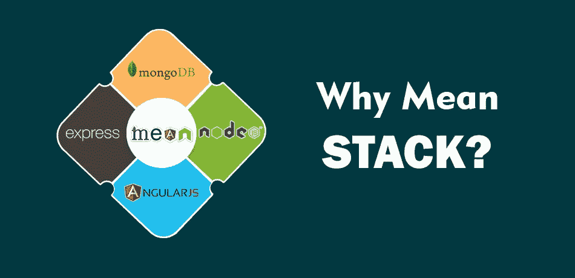
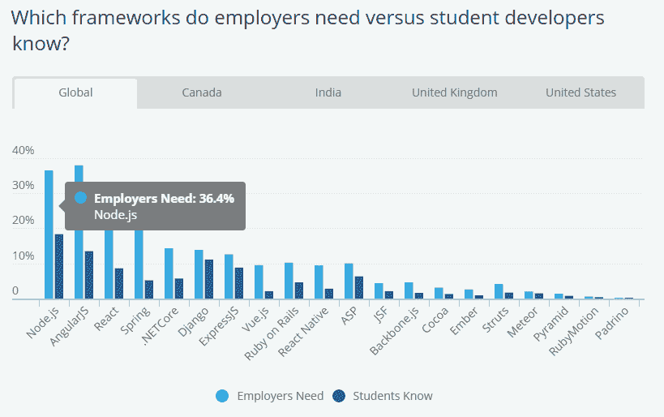
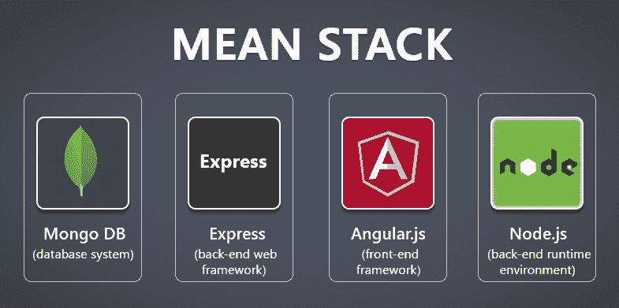
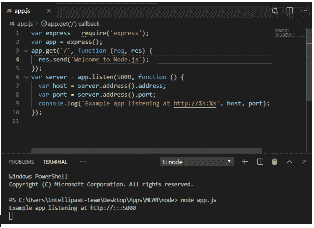
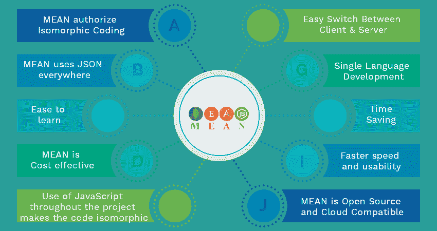

# 企业应用程序开发应该选择 MEAN Stack 的 6 个理由

> 原文：<https://medium.com/javarevisited/6-reasons-why-you-should-pick-mean-stack-for-enterprise-application-development-e81f8257d62?source=collection_archive---------3----------------------->

## MEAN 支持在任何地方使用 JavaScript，并提供更高的可伸缩性

## MEAN stack 基于 JavaScript，使企业应用程序开发更高效、更快速。了解为什么你必须选择它

对于 web 和移动应用程序开发的 MEAN stack，全世界都有很大的反响。当然，您也会想使用这种技术堆栈来创建您的企业应用程序。世界各地的软件公司正在实现各种技术的融合，以迎合动态和快速加载应用程序。

在这些技术的组合中，MEAN 是最受欢迎的组合，同时吸引了开发者和企业。尽管它很受欢迎，但是在使用这种技术组合进行企业应用程序开发时会出现一些问题。

在本文中，我们将看一下为什么我们应该考虑将 [MEAN stack](/javarevisited/5-best-courses-to-learn-mean-stack-for-beginners-and-experienced-developers-31162f8e3c03) 用于企业应用程序开发。所以，请继续关注我。

***下图显示了当前最热门的两种技术在 MEAN stack 中的应用。***

[图像来源](https://www.altexsoft.com/blog/engineering/the-good-and-the-bad-of-node-js-web-app-development/)

# 什么是平均堆栈？

MEAN 是表示技术栈的首字母缩写的名称: [MongoDB](/javarevisited/10-free-online-courses-to-learn-mongodb-and-nosql-942609611664) 、 [ExpressJS](https://www.java67.com/2020/06/top-5-courses-to-learn-mern-stack-for-web-development.html) 、 [AngularJS](/javarevisited/10-courses-to-learn-angular-for-web-development-6da1bd2856dc) 和 [NodeJS](/javarevisited/7-free-courses-to-learn-node-js-in-2020-2f1dd6722b49?source=---------24------------------) 。这些是在不同时期开发的独立技术，但是组合在一起提供了流畅和无缝的 web/移动应用程序开发服务。这四种技术的结合被称为 MEAN stack，这在动态 web 应用开发中非常流行。

**那么，这些技术是什么呢？**

MongoDB 是一个使用 JSON 格式和 [NoSQL 数据库](https://javarevisited.blogspot.com/2019/03/top-5-nosql-database-web-developers-should-learn.html#ixzz64aBvbXQ4)格式的数据库系统。

ExpressJS 是一个后端 web 开发框架，旨在构建 API。

AngularJS 是一个前端开发框架，用于处理应用程序的视图。

NodeJS 是运行在 V8 引擎上并执行 JS 代码的后端运行时环境。

如果你渴望开发一个应用程序，订阅意味着栈开发服务可以带来丰硕的成果。先不说这个，让我们详细了解一下这些技术，为什么利用它们是必要的。

**1)MongoDB**

存储和传递信息的能力是整个应用程序的主要部分。 [MongoDB](/javarevisited/5-best-mongodb-courses-to-learn-nosql-for-beginners-in-2020-42df5af5496c?source=---------13----------------------------) 对于监管海量信息的信息库框架来说是一个不错的决定。与其他一些数据库相比，在 MongoDB 中刷新整个数据更容易。在 MongoDB 中，档案与面向对象编程语言中的对象有关联。

**2)快递 JS**

[Express](https://javarevisited.blogspot.com/2018/01/top-5-nodejs-and-express-js-online-courses-for-web-developers.html#axzz5VllnxgVT) 是一个后端系统，它为我们提供了一个不太困难的接口来创建/请求端点并处理 cookies。以下是快速系统的中心亮点。

*   允许设置中间件来响应 HTTP 请求。
*   描述了一个路由表，用于根据 HTTP 方法和 URL 执行各种活动。
*   允许逐步交付 HTML 页面，绕过布局竞争。

[图像来源](https://jeremyvsjeremy.medium.com/what-is-the-mean-stack-9d11ae2cd384)

**3)角度 JS**

Angular.js 是一个前端 [JavaScript 开发框架](/javarevisited/10-javascript-frameworks-and-libraries-to-learn-in-2020-best-of-lot-5f61f86c60b4)，用于创建单页面应用。Angular 是一种完美的方法，可以为客户端添加 AJAX 驱动的富分段和容量。AngularJS 的一个尖端部分是用于创建单页面应用程序，它不需要客户在查看页面时继续恢复页面。

**4)节点 JS**

[Node.js](/javarevisited/top-10-online-courses-to-learn-node-js-in-depth-8ef0e31ca139) 是一个不可思议的基于 JavaScript 的系统/stage，基于 Google Chrome 的 JavaScript V8 引擎。它用于创建 I/O 密集型 web 应用程序，如视频流站点、单页应用程序和其他 web 应用程序。用 [JavaScript](/javarevisited/10-best-online-courses-to-learn-javascript-in-2020-af5ed0801645) 编写，这个开源的跨阶段环境落户 NodeJS，这对于实时应用来说是一个体面的决定。NodeJS 的另一个好处是，它不受操作系统的限制，也就是说，它可以在 Windows、OS X 和 [Linux](/javarevisited/7-best-linux-courses-for-developers-cloud-engineers-and-devops-in-2021-7415314087e1) 上以相似的速度运行，并且易于在任何操作系统上创建。

从这个描述中，你现在应该已经理解了平均堆栈的基础；让我们更深入地了解选择 MEAN stack 进行企业应用程序开发的原因。

# **为什么选择 MEAN Stack 进行企业应用开发？**

## 为什么是指堆栈？

在这里，我将列出软件开发者和公司选择均值堆栈的迷人理由。

## **1。基于 JavaScript 的开发随处可见**

推荐和偏爱 MEAN stack 的主要原因是在整个开发过程中使用单一语言。这意味着客户端和服务器端，完整的开发将使用 JavaScript 进行。

[图像来源](https://intellipaat.com/blog/what-is-mean-stack/)

在 MEAN stack 中，所有的技术都是用 JavaScript 编写的，并且要求在所有的 web 开发过程中使用 JavaScript。它支持在整个开发过程中使用简洁的代码。 [NodeJS](https://www.java67.com/2019/07/top-5-free-nodejs-courses-for-web-development.html) 处理服务器端编码，将 JavaScript 带到后端，AngularJS 处理前端编码。它还支持从后端到前端的代码重用。

## **2。降低开发成本**

另外，卑鄙。JS，就像它丰富的环境一样，是完全开源的，允许使用。企业利用平均堆栈可以获得的主要优势之一是整体成本较低。由于栈内广泛的代码共享和重用(回想一下，意思是关于 JavaScript)，web 开发时间可以减少，从而促使改进成本降低。

## **3。快速 MVP 开发和可扩展性**

除了快速和理想的展示机会之外，MEAN stack 还为构建可伸缩的编程解决方案提供了坚实的基础。在栈内部可以访问无数的额外结构、库和可重用模块(仅 npm 库就记录了将近 500，000 个包)，这加快了开发速度:即时的安排可以节省时间，同时减少开发的疲劳。这就是新企业喜欢这种堆栈的原因。

[图像来源](https://www.mongodb.com/blog/post/the-modern-application-stack-part-1-introducing-the-mean-stack)

## **4。扩展了开发人员的适应性和熟练程度**

这对于更小的 web 项目来说非常有用，比如强大的单页应用程序、完整的业务应用程序，或者当你可以将整个任务分配给仅仅一个[平均堆栈开发者](https://www.valuecoders.com/hire-developers/hire-mean-stack-developers)时。为你的项目雇佣平均[全栈工程师](https://www.valuecoders.com/hire-developers/hire-full-stack-developers)给你一个优势:更好的适应性和扩展的团队熟练度&效率。你的所有同事将“用相似的语言交流”(例如，[JavaScript](https://www.java67.com/2019/01/best-websites-to-learn-javascript-online.html))；通过这种方式，他们实际上会希望看到对方，并完美地交换差事，带来更好的盈利能力。这鼓励合作，并简化团队内部的项目管理工作。

## **5。免费的&开源组件**

所有意味着栈组件都是免费的、开源的，并且经常升级。它们还使开发人员能够根据需要定制代码，同时 NodeJS 提供了丰富的 JS 模块库。

## **6。JSON (JavaScript 符号)的使用**

虽然您将使用 [MEAN stack development](https://www.valuecoders.com/top-mean-stack-development-services-company-india) ，但是您将在 AngularJS 和 NodeJS 中使用 JSON 格式来存储数据。这种格式非常适合大型项目。这意味着在整个应用程序中，您将使用 JSON，并且不需要重新格式化数据。

那么，你说 MEAN stack 对应用开发没什么用呢？如果你还不相信，那么我们来看看均值堆栈的优缺点。

> **优点**

现在您已经看了一眼为企业开发选择 MEAN stack 的原因，现在让我们看看它提供的一些优势。

*   **有助于质量配置**

利用 MEAN 创建的 web 应用程序将支持自动化测试。沿着这些思路，在组件分离的任何点上，开发人员都将获得即时信息。

组织 [**雇佣低级堆栈开发人员**](https://www.valuecoders.com/hire-developers/hire-mean-stack-developers) 的主要原因之一是让质量检查变得简单。检查 QA 的理想方法是将它与开发阶段协调起来，这是由平均堆栈保证的。

*   **支持 MVC 开发**

模型视图控制器是用于执行应用程序 UI 的设计计划。

为了巩固 MVC 设计，您的应用程序应该被隔离成三个相关联的部分。:模型、视图、控制器。这将数据的内部视图与用户看到的方式隔离开来。

基本上，这确保了 MEAN Stack 开发团队保持很高的盈利能力。

[图像来源](https://www.amarinfotech.com/top-10-advantage-of-mean-stack-app-development.html)

*   **持续扩大的社区**

Mean 是一项传闻已久的技术，它被证明可以为全球众多开发人员出色地工作。

许多与 MEAN 一起工作的精力充沛的开发人员已经提出提升到一个稳固的、包容的社区。你只需要谷歌一个问题，你就可以找到完整的程序解决方案，以及如何复杂地关联持有它。

这是因为 MEAN Stack 是为开发人员演示的工具，您应该毫无阻碍地选择它。

> **缺点**

**均值叠加的主要缺点如下:**

*   对于大规模应用程序开发，不推荐使用 MEAN stack。
*   JS 编码没有具体的指导方针。
*   在使用 MEAN stack 开发了第一个站点之后，就不能再回到老方法了。
*   它提供了非常差的服务器与业务逻辑的隔离
*   数据丢失的几率更高。

## 最终裁决:

对于中小型应用程序开发来说，MEAN stack 是一个非常方便和经济的技术堆栈，并提供了很好的可伸缩性。而对于大规模的应用程序开发，不推荐使用这种技术堆栈，并且这种技术堆栈不能很好地提供无缝体验。

# **包装**

MEAN 是用于 [fullstack web 应用程序开发](https://www.valuecoders.com/web-application-development)的 JS 技术的流行技术组合。而 MongoDB 是其开发开源、跨平台数据库的主要部分，这为其提供了处理大型数据集的能力。

Express 支持轻量级应用程序的开发。建议用于创建单个、多个和混合应用程序。使用 Node 和 [AngularJS](/javarevisited/10-free-angular-and-react-js-courses-from-udemy-and-coursera-best-of-lot-e67f7d811e6b) ，前端和后端都可以轻松开发。

如果你想创建一个令人兴奋的企业解决方案，那么咨询一家拥有专家团队和卓越声誉的 [mean stack 开发公司。](https://www.valuecoders.com/top-mean-stack-development-services-company-india)