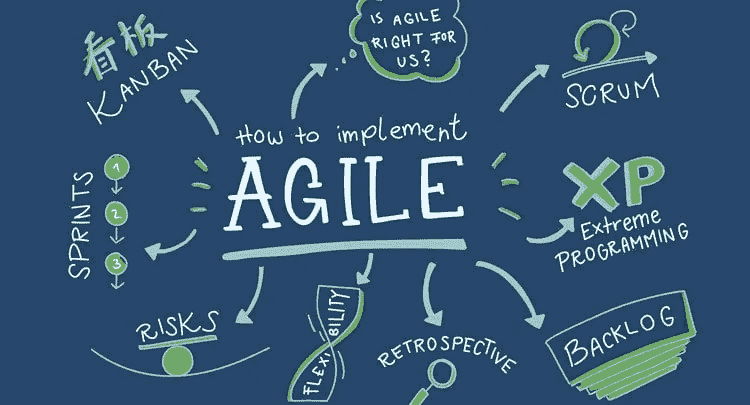
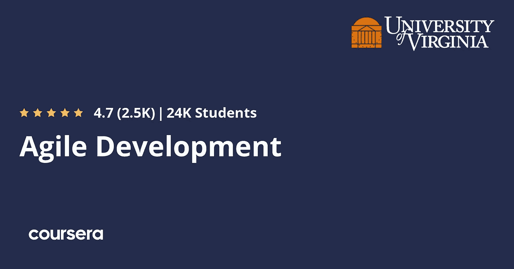
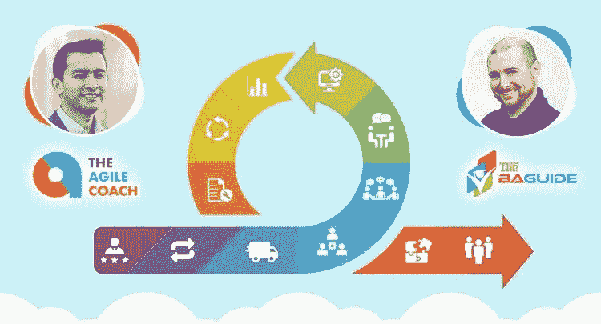
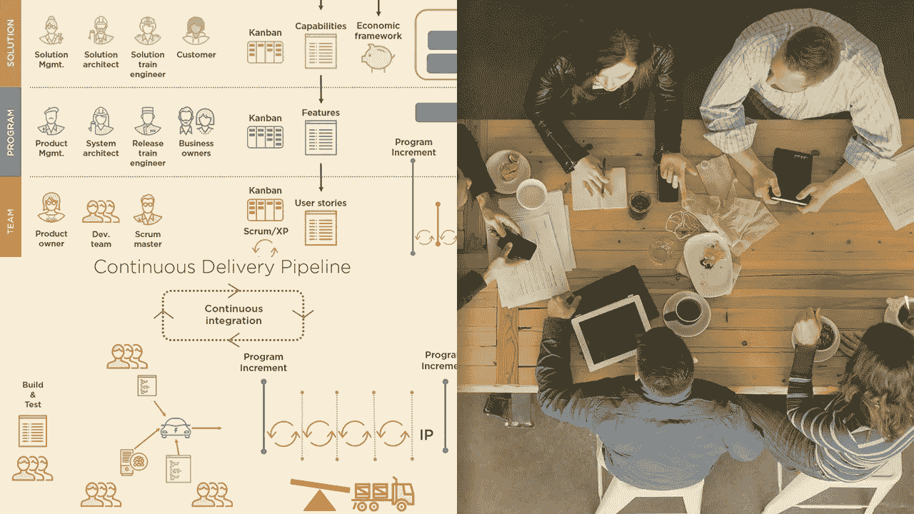
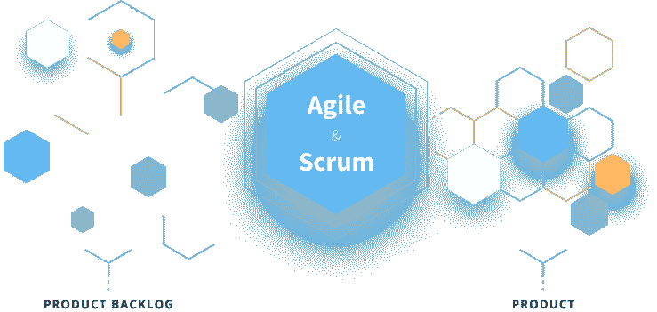
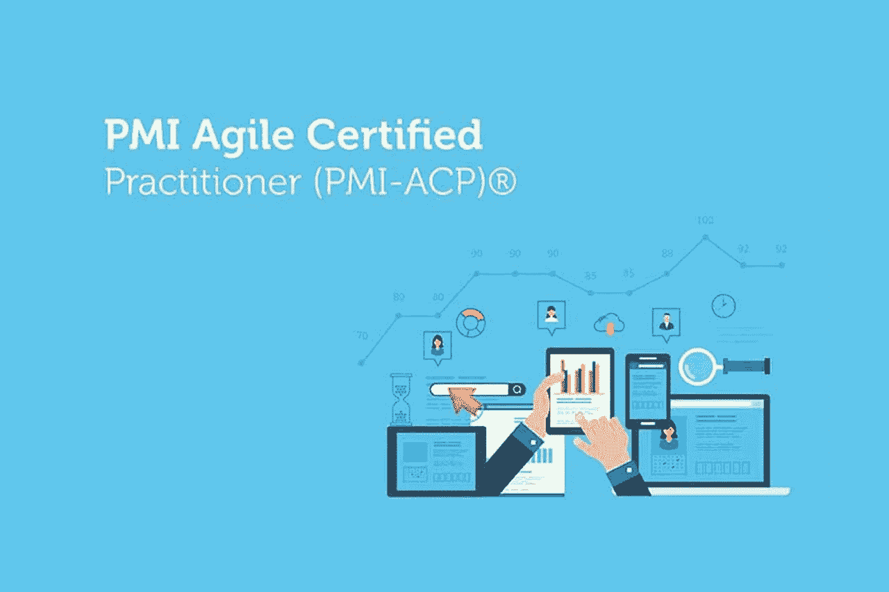

# 2023 年学习敏捷和 Scrum 的 7 门最佳课程

> 原文：<https://medium.com/javarevisited/7-best-agile-and-scrum-online-training-courses-3b191e9b65eb?source=collection_archive---------0----------------------->

## 我最喜欢的在线培训课程，从 Udemy、Pluralsight、Coursera 和 GreyCampus 学习敏捷、Scrum、Spring、看板等

如果你是一名程序员、软件开发人员、团队领导或项目经理，并希望在 2023 年学习敏捷和 Scrum，并寻找*最佳敏捷和 Scrum 在线课程*，那么你来对地方了。

前面我已经分享了最好的 [**编程**](/javarevisited/7-best-coding-course-to-learn-programming-with-zero-experience-in-2020-52f7d0d9cb80) 和 [**web 开发课程**](/better-programming/my-5-favorite-courses-to-learn-web-development-in-2019-a5e74167f8b2) ，今天我要分享的是 2023 年你可以加入的最好的敏捷和 Scrum 在线课程，来学习这些抢手的技能。

敏捷软件开发方法是一种强大的方法，在开发社区中非常流行。随着技术的飞速发展，客户的期望值越来越高，交付时间也越来越短。

开发过程中有太多的事情要做——规划、开发、测试等等。时间是一个主要因素。任何参与项目的团队总是面临着在截止日期前交付产品的压力。今天的最后期限很短，工作量很大。因此，为了按时完成工作，团队选择了敏捷的开发方法。

在[敏捷软件开发](https://www.java67.com/2020/10/best-agile-and-scrum-courses-for-programmers-developers.html)中，几个自组织的和跨职能的团队一起进行计划、开发、交付和改进。这是一个非常系统的方法，包括各种关键术语，如看板、scrum、sprint、用户故事、积压等等。为了理解敏捷，与之相关的术语，以及它是如何工作的，你需要参加一个适当的课程，因为里面有很多东西。所以在这篇文章中，你会发现一份帮助你学习敏捷的最佳在线课程列表。

# 2023 年程序员和项目经理的 7 门最佳在线敏捷和 Scrum 课程

在不浪费你更多时间的情况下，这里列出了初学者和有经验的开发人员学习敏捷和 Scrum 的最佳在线课程。

## 1.[敏捷速成班:敏捷项目管理；敏捷交付](https://click.linksynergy.com/deeplink?id=JVFxdTr9V80&mid=39197&murl=https%3A%2F%2Fwww.udemy.com%2Fcourse%2Fagile-crash-course%2F)

这是 Udemy 最畅销的敏捷课程之一。这个速成课程由 AgileKB 的创始人 Mauricio Rubio 创建，涵盖了与敏捷开发、敏捷项目交付和敏捷项目管理相关的所有基本概念。

要求
不需要敏捷或其他任何知识。

课程为初级课程，总视频内容近三个小时。讲师遵循一个流畅的流程，解释敏捷中需要的每一个重要工具，以及如何使用各种有用的提示和技巧。

**这里是加入这个敏捷课程**——[敏捷速成班](https://click.linksynergy.com/deeplink?id=JVFxdTr9V80&mid=39197&murl=https%3A%2F%2Fwww.udemy.com%2Fcourse%2Fagile-crash-course%2F)的链接

## 2.[敏捷开发专业化](https://coursera.pxf.io/c/3294490/1164545/14726?u=https%3A%2F%2Fwww.coursera.org%2Fspecializations%2Fagile-development)【Coursera】

Coursera 最好的敏捷课程基本上是分为四门课程的专业化。这个专业的四门课程是——敏捷符合设计思维、假设驱动的开发、敏捷分析和管理敏捷团队。

要求
不需要敏捷或其他任何知识。

这些都是弗吉尼亚大学精心设计的课程。所有主要的敏捷概念都包含在这个专业中。这是一门初级课程，也提供经济资助。

**这是加入本课程的链接** — [敏捷开发专业化](https://coursera.pxf.io/c/3294490/1164545/14726?u=https%3A%2F%2Fwww.coursera.org%2Fspecializations%2Fagile-development)

顺便说一句，如果你计划参加多个 Coursera 课程或专业，那么考虑参加 [**Coursera Plus**](https://coursera.pxf.io/c/3294490/1164545/14726?u=https%3A%2F%2Fwww.coursera.org%2Fcourseraplus) 订阅，它为你提供无限制的访问他们最受欢迎的课程、专业、专业证书和指导项目的机会。

<https://coursera.pxf.io/c/3294490/1164545/14726?u=https%3A%2F%2Fwww.coursera.org%2Fcourseraplus>  

## 3.[敏捷基础:包括 Scrum 和看板——2023 年](https://click.linksynergy.com/deeplink?id=JVFxdTr9V80&mid=39197&murl=https%3A%2F%2Fwww.udemy.com%2Fcourse%2Fagile-fundamentals-scrum-kanban-scrumban%2F)

Udemy 的另一个畅销书，这个课程是学习敏捷基础的另一个很好的选择。在本课程中，除了所有必要的敏捷概念之外，讲师还关注敏捷的两个重要概念——看板和 scrum。看板和 scrum 是敏捷的两个基本术语。

要掌握敏捷的基础知识，必须正确理解这些术语。在本课程中，讲师很好地涵盖了所有这些概念。

这是一个相对较长的课程，视频内容总计四个半小时。这是一门初级课程。不需要敏捷方面的经验。

**这是加入敏捷课程**——[敏捷基础](https://click.linksynergy.com/deeplink?id=JVFxdTr9V80&mid=39197&murl=https%3A%2F%2Fwww.udemy.com%2Fcourse%2Fagile-fundamentals-scrum-kanban-scrumban%2F)的链接

## 4.[敏捷基础](https://pluralsight.pxf.io/c/1193463/424552/7490?u=https%3A%2F%2Fwww.pluralsight.com%2Fcourses%2Fagile-fundamentals)【plural sight】

这个课程是 Pluralsight 最好的敏捷课程。在本课程中，讲师以简洁的方式解释了敏捷方法的基础，涵盖了所有内容，如软件开发方法的历史、敏捷的需求、敏捷的基础以及与之相关的术语，如 scrum。

需求
对敏捷的基本理解。本课程不适合初学者。是中级课程，总视频内容近三个小时。

**这是加入本课程的链接** — [敏捷基础](https://pluralsight.pxf.io/c/1193463/424552/7490?u=https%3A%2F%2Fwww.pluralsight.com%2Fcourses%2Fagile-fundamentals)

你还需要一个 Pluralsight 会员才能参加这个课程，费用大约是每月 29 美元或每年 299 美元(14%的折扣)。我向所有程序员强烈推荐这个订阅，因为它提供了超过 7000 个在线课程的即时访问，以学习任何技术技能。或者，你也可以使用他们的 [**10 天免费通行证**](https://pluralsight.pxf.io/c/1193463/424552/7490?u=https%3A%2F%2Fwww.pluralsight.com%2Flearn) 免费观看这门课程。

<https://pluralsight.pxf.io/c/1193463/424552/7490?u=https%3A%2F%2Fwww.pluralsight.com%2Flearn>  

## 5. [Scrum 认证准备+ Scrum 大师+敏捷 Scrum 培训](https://click.linksynergy.com/deeplink?id=JVFxdTr9V80&mid=39197&murl=https%3A%2F%2Fwww.udemy.com%2Fcourse%2Fscrum-certification%2F)

这个课程是为那些想学习敏捷和 scrum 的人准备的，尤其是那些准备 scrum 认证的人。在本课程中，讲师重点介绍了 scrum，他还解释了如何破解认证。本课程还提供了常见问题和提示。

需求
不需要敏捷或 scrum 的先验知识。

这是一个相对较小的课程，总视频内容为两个小时。这是一门初级课程。

**这是加入本课程**——[Scrum 认证预备+ Scrum 大师](https://click.linksynergy.com/deeplink?id=JVFxdTr9V80&mid=39197&murl=https%3A%2F%2Fwww.udemy.com%2Fcourse%2Fscrum-certification%2F)的链接

## 6.[敏捷 Scrum Master 认证培训](http://shrsl.com/2y5vy)【在线直播培训】

这是互联网上最深入的敏捷培训课程之一。这个课程的独特之处在于，它是一个生动的、在线的、讲师指导的敏捷 Scrum 大师培训。

既然没有比课堂培训更好的学习方法，如果你真的想提高或学习敏捷和 Scrum 技能，我强烈推荐你参加这个课程。

通过这个在线实时培训项目，你将掌握在敏捷(和 scrum)环境中工作所必需的知识和技能。

通过我们特别设计的项目课程，你会学得更好，并亲身体验敏捷和 Scrum。是的，我们甚至为您提供了一些项目，让您亲自动手…

**这里是参加本培训课程的链接—** [敏捷 Scrum 大师认证培训](http://shrsl.com/2y5vy)

## 7. [PMI 敏捷认证从业者培训](https://click.linksynergy.com/deeplink?id=JVFxdTr9V80&mid=42536&murl=https%3A%2F%2Fwww.edureka.co%2Fpmi-acp%3FqId%3D1b723c5678efc078d079d606b8e6cb48%26index_name%3Dprod_search_results_courses%26objId%3D685%26objPos%3D1&LSNSUBSITE=LSNSUBSITE)

这是 Edureka 提供的另一个全面的敏捷培训项目，edu reka 是一个在线门户，提供讲师指导的在线直播课程。

PMI-ACP 是项目管理领域中发展最快的认证之一，组织正在采用“敏捷”来在不断变化的市场动态中保持竞争力。

通过 PM-ACP 认证增加了您对敏捷技术的适应性，这将提高团队的生产力。

本预备课程旨在帮助您获得这一全球知名的证书，并超越这一目标。

**以下是参加本课程的链接—** [PMI 敏捷认证从业者培训](https://click.linksynergy.com/deeplink?id=JVFxdTr9V80&mid=42536&murl=https%3A%2F%2Fwww.edureka.co%2Fpmi-acp%3FqId%3D1b723c5678efc078d079d606b8e6cb48%26index_name%3Dprod_search_results_courses%26objId%3D685%26objPos%3D1&LSNSUBSITE=LSNSUBSITE)

以上是 2023 年程序员和项目经理学习敏捷和 Scrum 的**最佳课程。互联网上有数以百计的敏捷课程，有免费的，也有付费的。**

这篇文章中列出的课程都是从一些最好的教育网站如 [Udemy](/javarevisited/100-free-programming-and-web-development-courses-on-udemy-free-resource-center-3f8415eb5e6f) 和 [Coursera](/javarevisited/top-15-free-coursera-courses-and-certifications-for-it-professionals-384207d56f45) 上摘下来的高质量课程。这些课程大多是初级课程。所以根据你的要求来选择。

您可能喜欢的其他**软件开发文章**

*   [深入了解 JIRA 的 5 门最佳课程](https://javarevisited.blogspot.com/2020/08/top-5-courses-to-learn-jira-for.html#axzz6br5RuKYg)
*   [成为 Scrum 大师的 5 本书](https://www.java67.com/2020/06/top-5-books-to-become-scrum-master-in.html)
*   [2023 年 Java 开发者路线图](https://javarevisited.blogspot.com/2019/10/the-java-developer-roadmap.html#axzz6N3akNoox)
*   [面向 Java 和 DevOps 专业人员的 10 门免费 Docker 课程](https://javarevisited.blogspot.sg/2018/02/10-free-docker-container-courses-for-Java-Developers.html)
*   [学习 Jenkins 自动化和开发运维的五大课程](https://javarevisited.blogspot.com/2018/09/top-5-jenkins-courses-for-java-and-DevOps-Programmers.html)
*   [2023 年学习 Kubernetes 的 7 门免费在线课程](/javarevisited/7-free-online-courses-to-learn-kubernetes-in-2020-3b8a68ec7abc)
*   [2023 年 DevOps 开发者路线图](/hackernoon/the-2018-devops-roadmap-31588d8670cb)
*   [学习亚马逊网络服务我最喜欢的课程](https://javarevisited.blogspot.com/2020/05/top-5-amazon-web-services-aws-courses-for-beginners-and-experienced-programmers.html)
*   [学习 Docker、Kubernetes 和 Jenkins 的 10 门免费课程](/javarevisited/top-10-free-courses-to-learn-jenkins-docker-and-kubernetes-for-devops-in-2020-best-of-lot-62a0541ffeb3)
*   [我最喜欢的为有经验的人学习 DevOps 的课程](https://javarevisited.blogspot.com/2018/09/10-devops-courses-for-experienced-java-developers.html)
*   [2023 年 Java 开发人员应该学习的 10 个工具](http://www.java67.com/2018/04/10-tools-java-developers-should-learn.html)
*   [5 个自由弹簧框架和 Spring Boot 课程](http://www.java67.com/2017/11/top-5-free-core-spring-mvc-courses-learn-online.html)
*   [学习 Azure 云平台的前 5 门课程](https://javarevisited.blogspot.com/2020/09/top-5-courses-to-learn-microsoft-azure.html)
*   [面向程序员的 10 门 Docker 和 Kubernetes 课程](https://dev.to/javinpaul/top-10-courses-to-learn-docker-and-kubernetes-for-programmers-4lg0)
*   [面向 Java 开发人员的 6 门 Maven 课程](http://www.java67.com/2018/02/6-free-maven-and-jenkins-online-courses-for-java-developers.html)
*   [2023 年 Java 开发人员应该学会的 10 件事](http://javarevisited.blogspot.sg/2017/12/10-things-java-programmers-should-learn.html#axzz53ENLS1RB)
*   [面向 Java JEE 开发者的 5 大 Hibernate 和 JPA 课程](http://javarevisited.blogspot.sg/2018/01/top-5-hibernate-and-jpa-courses-for-java-programmers-learn-online.html)
*   [程序员学习 AWS 和云的 10 门免费课程](/javarevisited/top-10-courses-to-learn-amazon-web-services-aws-cloud-in-2020-best-and-free-317f10d7c21d)

感谢阅读到目前为止。如果你喜欢这些学习敏捷和 Scrum 方法论的最佳在线课程，那么请与你的朋友和同事分享。如果您有任何问题或反馈，请留言。

**【p . s .】**——如果你热衷于学习敏捷和 Scrum 方法论，但正在寻找免费的在线课程，那么你也可以看看这个 [**敏捷 PM 101——从 Udemy 了解敏捷与瀑布的真相**](https://click.linksynergy.com/deeplink?id=JVFxdTr9V80&mid=39197&murl=https%3A%2F%2Fwww.udemy.com%2Fcourse%2Flearn-the-truth-about-agile-versus-waterfall%2F) 。在这个 2 小时的免费课程中，你将学习敏捷和 Scrum 基础知识。它是完全免费的，你只需要一个 Udemy 帐户就可以注册这个课程。

<https://click.linksynergy.com/deeplink?id=JVFxdTr9V80&mid=39197&murl=https%3A%2F%2Fwww.udemy.com%2Fcourse%2Flearn-the-truth-about-agile-versus-waterfall%2F> 