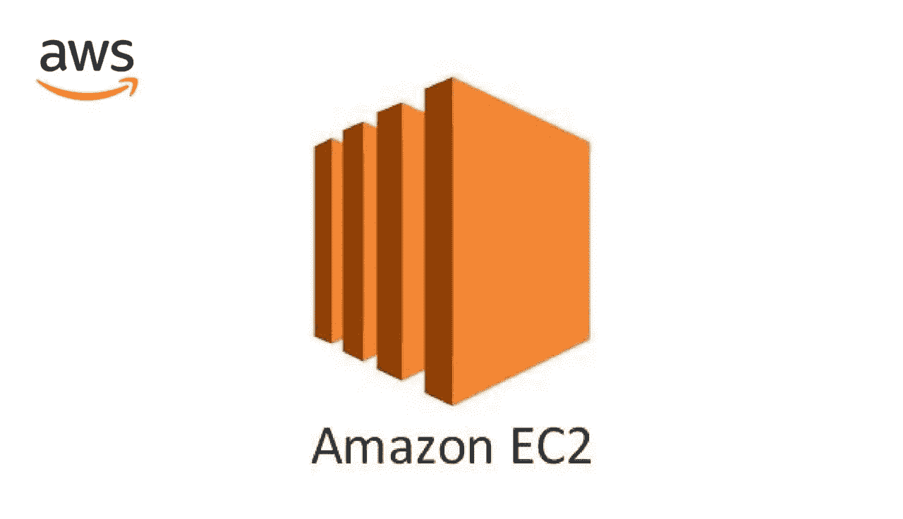
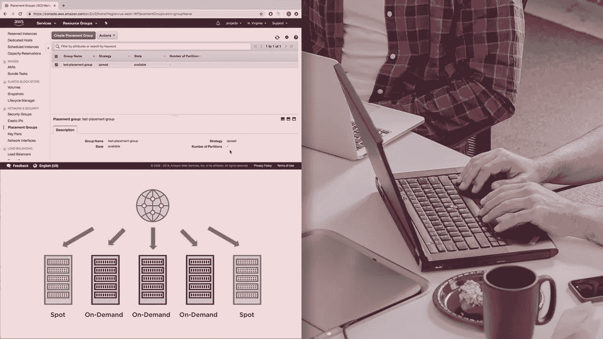
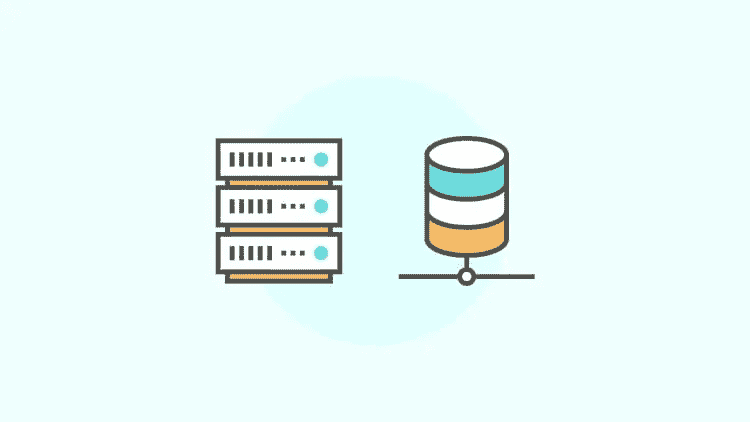
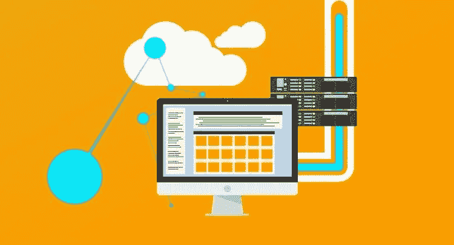
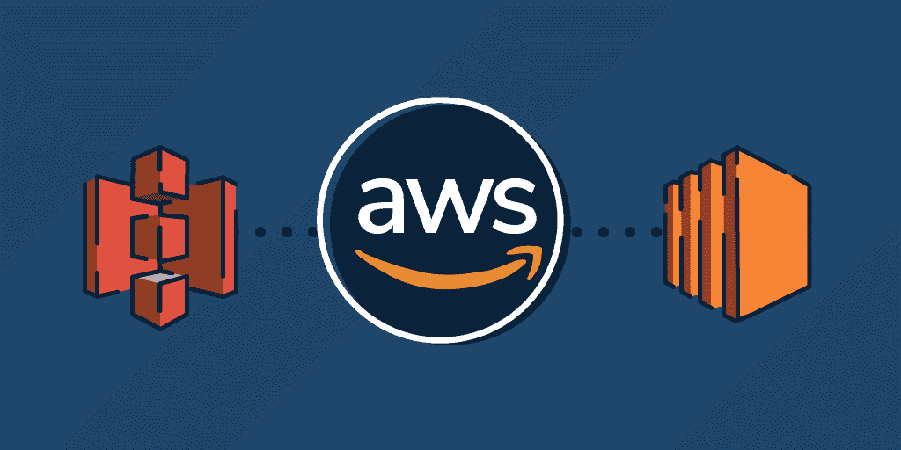
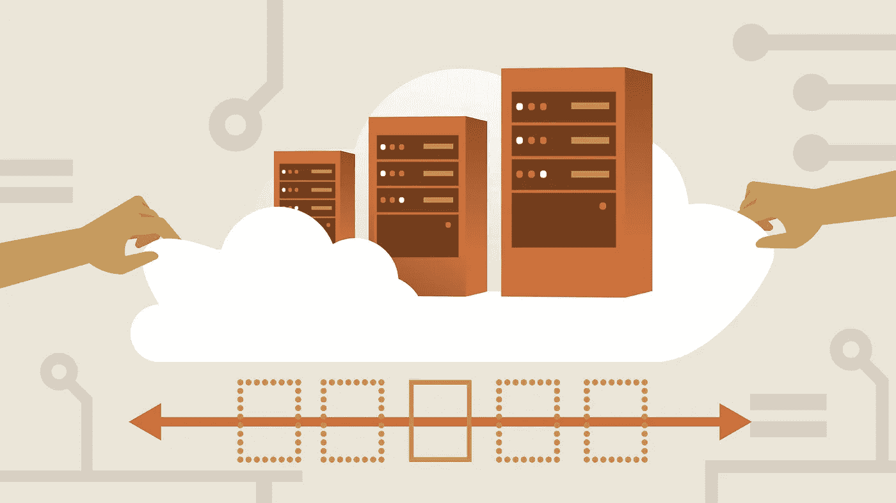

# 2023 年 7 门最佳 AWS EC2[亚马逊弹性计算云]初学者在线课程

> 原文：<https://medium.com/javarevisited/7-best-aws-ec2-amazon-elastic-compute-cloud-online-courses-for-beginners-in-2021-f7a1a55ea719?source=collection_archive---------1----------------------->

## 我最喜欢的在线课程 2023 年深入学习 AWS EC2

如果你一直在 AWS 工作，那么你肯定知道 Amazon EC2，它是最重要和最受欢迎的 AWS 服务之一。如果你是 AWS 新手，不要担心，我会简单介绍一下什么是 Amazon EC2 以及为什么要学习它。

如果您正在寻找在线课程来了解更多关于 AWS EC2 服务的信息，那么您来对地方了。过去，我已经分享了针对初学者的[最佳 AWS 课程](https://javarevisited.blogspot.com/2020/05/top-5-amazon-web-services-aws-courses-for-beginners-and-experienced-programmers.html)和针对程序员通过 AWS 认证的几个[课程](https://javarevisited.blogspot.com/2019/05/top-5-courses-to-crack-aws-solutions-architect-associate-certification-exam-SAA-C01.html)，在本文中，我将分享来自 Udemy 和 Pluralsight 的最佳在线 AWS 课程，以深入学习 AWS EC2 服务。

这些是非常集中的课程，由 AWS 专家创建，用于深入教授 EC2，您可以在家中或办公室在线参加。无论如何，在进入课程之前，让我们先看看什么是 AWS EC2，以及学习它的重要性。

亚马逊 EC2 基本上是一个虚拟服务器或电脑，就像任何电脑一样，它也有一个存储数据的硬盘，一个运行数据的操作系统，一个处理器，一个网卡和几乎所有的东西，除了它比你家里可能有的普通电脑功能强大。

看起来简单？没有吗？是的，这基本上就是 AWS EC2，但让我们更详细地了解一下。亚马逊 EC2 有一个叫做**实例**的东西，它是一台大型计算机中的一台小型计算机，为了让你更清楚，让我们想象一下，你将托管你的网站，你只需要一个小功率来使用，所以你将购买一个小型实例来托管你的网站并为你省钱。

每个实例都有一些像存储和处理器这样的功能，无论是 Linux还是 Windows，或者 Mac，你都必须选择其中一个来托管和运行你的网站。

如果你是一名首席技术官或技术主管，思考一下**亚马逊 EC2** 是否是托管和运行你的应用的最佳选择，然后继续阅读这篇文章，学习一些课程，教你如何深入使用亚马逊 EC2。

顺便说一句，如果你是 AWS 新手，并且正在寻找一个全面的课程来深入学习 AWS，那么我也建议你加入 Udemy 上的 AWS 大师 Stéphane Maarek 的 [**【新】终极 AWS 认证云从业者-2023**](https://click.linksynergy.com/deeplink?id=JVFxdTr9V80&mid=39197&murl=https%3A%2F%2Fwww.udemy.com%2Fcourse%2Faws-certified-cloud-practitioner-new%2F)课程。这是一门很好的课程，可以全面了解 AWS，并为云从业者认证(入门级 AWS 认证)做好准备。

<https://click.linksynergy.com/deeplink?id=JVFxdTr9V80&mid=39197&murl=https%3A%2F%2Fwww.udemy.com%2Fcourse%2Faws-certified-cloud-practitioner-new%2F>  

# 深入学习 AWS EC 2 的 7 门最佳在线课程

在不浪费你更多时间的情况下，这里有 2020 年学习 AWS EC2 的最佳在线课程。这些是由专家创建的最好的在线课程，受到成千上万在线学习 AWS EC2 的开发人员的信任。您也可以在线加入他们，深入了解这项重要的 AWS 服务。

## 1.[亚马逊 EC2 主类(带自动伸缩&负载均衡器)](https://click.linksynergy.com/deeplink?id=JVFxdTr9V80&mid=39197&murl=https%3A%2F%2Fwww.udemy.com%2Fcourse%2Faws-ec2-masterclass%2F)

在这个 AWS EC2 在线课程中，将向您介绍 Amazon EC2 基础知识，例如如何使用 ssh 进行连接等等。然后转到 amazon 机器映像，如何为您的下一个项目选择正确的实例类型，以及安全性和网络，您将在本课程中发现更多主题。这是学习 AWS EC2 的最好的 Udemy 课程，由 Stephanie Maarek 创建，她是 Udemy 上我最喜欢的 AWS 讲师之一。参加了夏羽的 [AWS 解决方案架构师](https://click.linksynergy.com/deeplink?id=JVFxdTr9V80&mid=39197&murl=https%3A%2F%2Fwww.udemy.com%2Fcourse%2Faws-certified-solutions-architect-associate-saa-c02%2F)课程后，我非常确定这是一门很棒的课程，我必须说我没有失望。以下是您将在本课程中学到的关键技能:

*   亚马逊 AWS ec2 实例。
*   安全性和网络。
*   部署应用程序。

如果你想在 Amazon AWS EC2 上部署你的网站或项目，但你不知道该怎么做。你可以在这个课程中看到如何实现这一点以及更多。

**这里是加入本课程的链接**——[亚马逊 EC2 大师班](https://click.linksynergy.com/deeplink?id=JVFxdTr9V80&mid=39197&murl=https%3A%2F%2Fwww.udemy.com%2Fcourse%2Faws-ec2-masterclass%2F)

## 2.[AWS-EC2 部署基础介绍](https://click.linksynergy.com/deeplink?id=JVFxdTr9V80&mid=39197&murl=https%3A%2F%2Fwww.udemy.com%2Fcourse%2Fintroduction-to-aws-ec2-deployment-fundamentals%2F)

这是在 Udemy 上学习 AWS EC2 的另一个很棒的课程。如果你已经有一个项目准备好部署，并且你不知道如何使用 amazon AWS ec2 来实现，那么你可以观看这个 Udemy 课程来实现。

从了解什么是 AWS EC2 及其一些基础知识开始，然后转向最重要的部分，即在 EC2 上部署您的项目，以及如何在 [Linux](/javarevisited/top-10-courses-to-learn-linux-command-line-in-2020-best-and-free-f3ee4a78d0c0?source=collection_home---4------0-----------------------) 和 Windows 实例中进行部署。此外，您还将了解如何进行监控和报告，以及安全性等等。

在本课程中，您将学到:

*   如何部署您的项目。
*   监测和报告。
*   在 EC2 实例上创建应用程序。

**以下是加入本 EC2 课程的链接**—[AWS 简介— EC2 部署基础](https://click.linksynergy.com/deeplink?id=JVFxdTr9V80&mid=39197&murl=https%3A%2F%2Fwww.udemy.com%2Fcourse%2Fintroduction-to-aws-ec2-deployment-fundamentals%2F)

## 3.[管理 AWS EC2 实例](https://pluralsight.pxf.io/c/1193463/424552/7490?u=https%3A%2F%2Fwww.pluralsight.com%2Fcourses%2Faws-managing-ec2-instances) [Pluralsight]

假设您选择了 amazon AWS 来托管和运行您的应用程序，并且您想学习如何管理和配置它，您可以查看这个 *best Pluralsight AWS EC2 课程*。

在本课程中，您将学到:

*   amazon 实例之间的差异。
*   选择最适合您需求的服务器。
*   对您的数据进行恢复和备份。

**以下是加入本 EC2 课程的链接—** [管理 AWS EC2 实例](https://pluralsight.pxf.io/c/1193463/424552/7490?u=https%3A%2F%2Fwww.pluralsight.com%2Fcourses%2Faws-managing-ec2-instances)

顺便说一句，你需要一个 [Pluralsight 会员](https://pluralsight.pxf.io/c/1193463/424552/7490?u=https%3A%2F%2Fwww.pluralsight.com%2Flearn)才能观看这个课程，费用大约是每月 29 美元，一年 299 美元(14%的折扣)。

我强烈推荐这个会员资格，因为它不仅提供了这门课程，还提供了 7000 多门关于最新技术的在线课程。或者，你也可以使用他们的 [**10 天免费通行证**](https://pluralsight.pxf.io/c/1193463/424552/7490?u=https%3A%2F%2Fwww.pluralsight.com%2Flearn) 免费观看这个课程。

<https://pluralsight.pxf.io/c/1193463/424552/7490?u=https%3A%2F%2Fwww.pluralsight.com%2Flearn>  

## 4.[亚马逊 AWS EC2 大师班](https://click.linksynergy.com/deeplink?id=JVFxdTr9V80&mid=39197&murl=https%3A%2F%2Fwww.udemy.com%2Fcourse%2Famazon-aws-ec2-masterclass%2F)【Udemy 课程】

如果你不仅想学习 amazon EC2，还想了解整个 Amazon AWS EC2 的基础架构及其操作方式，以及实例之间的差异等等，你可以参加这个顶级的 Udemy AWS EC2 课程。

您将深入了解 Amazon AWS 基础设施、实例的生命周期以及 amazon machine images (AMI)如何创建和共享实例。此外，如何监控您的 EC2 实例和网络安全，等等。

在本课程中，您将学到:

*   AWS 基础设施。
*   网络和安全。
*   亚马逊机器图片。

**这里是加入这个 AWS EC2 课程的链接**——[亚马逊 AWS EC2 大师班](https://click.linksynergy.com/deeplink?id=JVFxdTr9V80&mid=39197&murl=https%3A%2F%2Fwww.udemy.com%2Fcourse%2Famazon-aws-ec2-masterclass%2F)

## 5.[在 AWS EC2 上为新开发人员部署 web 应用](https://click.linksynergy.com/deeplink?id=JVFxdTr9V80&mid=39197&murl=https%3A%2F%2Fwww.udemy.com%2Fcourse%2Fdeploying-web-apps-simplified-quick-or-in-depth-on-aws%2F)【Udemy】

另一个关于如何在 Udemy 上的 Amazon AWS EC2 上部署 web 应用程序的大型课程旨在面向新开发人员和任何初学者以及希望学习 AWS 部署的人。

您将获得如何部署项目和前端项目的实践经验，以及使用 FTP 等协议、处理[数据库](https://hackernoon.com/top-5-sql-and-database-courses-to-learn-online-48424533ac61)和权限以及部署 flask 项目的实践经验。

你将在本课程中学到:

*   部署前端项目。
*   使用一些协议。
*   处理数据库。

**这是加入 AWS EC2 课程的链接** — [在 AWS EC2 上为新开发人员部署 web 应用](https://click.linksynergy.com/deeplink?id=JVFxdTr9V80&mid=39197&murl=https%3A%2F%2Fwww.udemy.com%2Fcourse%2Fdeploying-web-apps-simplified-quick-or-in-depth-on-aws%2F)

## 6.[AWS 的好部分:穿过杂乱的东西](https://www.educative.io/courses/good-parts-of-aws?affiliate_id=5073518643380224)

这是学习实用 AWS 的最佳课程之一，你可以在网上找到。该课程由前亚马逊工程师 Daniel Vassallo 创建，他在 AWS 方面有超过 15 年的工作经验。

在本课程中，你将学习一种技术，这种技术可以帮助你做出可靠的技术选择，而不会在面对如此多的选择时手足无措。

你将从浏览 AWS 提供的最基本的服务开始，比如 DynamoDB、S3、EC2。每一部分都详细说明了它的用法、优缺点、为什么应该(或不应该)使用它，等等。

这不是典型的 AWS 参考课程。你不会在 AWS 文档中找到这里分享的大部分知识。这里的目标是帮助你认识到不使用 AWS 的哪些功能是愚蠢的——这些功能已经通过了时间的考验，是互联网上大多数东西的支柱。

**这里是报名参加本课程的链接—**[AWS 的优点:穿越杂乱](https://www.educative.io/courses/good-parts-of-aws?affiliate_id=5073518643380224)

你可以购买这门课程，也可以获得教育会员资格来学习这门课程。如果你问我，我建议你买一个 [**教育订阅**](https://www.educative.io/subscription?affiliate_id=5073518643380224) ，每月花费 **$17** (现在打五折)，对于一个需要不断学习的程序员和软件工程师来说，完全值得。

<https://www.educative.io/subscription?affiliate_id=5073518643380224>  

如果你喜欢看书，那么你会很高兴地知道，这门课程在 Gumroad 上也有电子书，如果你喜欢看书，那么你也可以查看一下[**AWS**](https://gumroad.com/a/703100019/MsVlG?offer_code=javinpaul)电子书的精彩部分。你也可以通过我的链接获得这本 AWS 书的 20%折扣

<https://gumroad.com/a/703100019/MsVlG?offer_code=javinpaul>  

## 7.[亚马逊 EC2 基础](http://linkedin-learning.pxf.io/c/1193463/449670/8005?u=https%3A%2F%2Fwww.linkedin.com%2Flearning%2Famazon-ec2-fundamentals-2)【LinkedIn 学习】

这是在 LinkedIn Learning 上学习亚马逊 EC2 的初级课程。

亚马逊弹性计算云(Amazon EC2)在云中提供安全、可调整大小的计算能力。

本课程描述了这种网络服务的基本原理。了解 Amazon EC2 的特性，了解它在哪里可用，并根据实例偏好探索购买选项:预订、预定、现货或专用。了解如何使用 AMI (Amazon 机器映像)，如何启动实例，以及如何使用 Linux、Mac 或 Windows 连接到实例。

**以下是加入本 EC2 课程**——[亚马逊 EC2 基础](http://linkedin-learning.pxf.io/c/1193463/449670/8005?u=https%3A%2F%2Fwww.linkedin.com%2Flearning%2Famazon-ec2-fundamentals-2)的链接

顺便说一下，你需要一个 [LinkedIn Learning 会员](http://linkedin-learning.pxf.io/c/1193463/449670/8005?u=https%3A%2F%2Fwww.linkedin.com%2Flearning%2Fsubscription%2Fproducts)来观看这个课程，这个课程每月花费大约 29.99 美元，但是你也可以通过参加他们的 [**1 个月免费试用**](http://linkedin-learning.pxf.io/c/1193463/449670/8005?u=https%3A%2F%2Fwww.linkedin.com%2Flearning%2Fsubscription%2Fproducts) 来免费观看这个课程，这是一个探索他们 16000 多门最新技术在线课程的好方法。

以上是关于深入学习 AWS EC2 的**最佳在线课程。**如今，网络正在为全球的每一家企业提供支持，没有一家公司或组织能够在没有网站或网络应用的情况下正常运营他们的业务，因此他们需要一个强大的服务器来托管他们的网站，于是亚马逊 EC2 开始发挥作用。

你可能喜欢的其他 **AWS 在线课程和文章**

*   [初学者学习 AWS 的 5 大课程](https://www.java67.com/2020/08/top-5-free-courses-to-pass-aws-developer-associate-certification.html)
*   [如何通过 AWS 解决方案架构师助理考试](https://www.java67.com/2020/04/how-to-paas-aws-certified-solution-architect-exam-in-2020.html)
*   [面向 Java 开发人员的五大 AWS 和云课程](https://javarevisited.blogspot.com/2020/05/top-5-cloud-courses-for-java-and-spring-boot-developers.html)
*   [通过 AWS 认证开发人员助理考试的前 5 门课程](https://javarevisited.blogspot.com/2020/05/top-5-courses-to-crack-aws-certified-developer-associate-certification-exam.html)
*   [学习亚马逊网络服务的 5 门免费课程](https://www.java67.com/2018/05/top-5-amazon-web-services-or-aws-courses-to-learn-online.html)
*   [破解 AWS DevOps 工程师考试的前 5 门课程](https://javarevisited.blogspot.com/2020/04/top-5-course-to-crack-aws-certified-devops-engineer-professional-exam-certification.html)
*   [5 次免费 AWS 解决方案架构师助理实践测试，转储](https://javarevisited.blogspot.com/2019/08/top-5-free-aws-solution-architect-Associate-certification-dumps-practice-questions.html)
*   [成为 AWS DevOps 工程师专家的 5 门课程](https://javarevisited.blogspot.com/2020/04/top-5-course-to-crack-aws-certified-devops-engineer-professional-exam-certification.html)
*   [破解 AWS 解决方案架构师专业考试的前 5 门课程](https://javarevisited.blogspot.com/2020/04/top-5-course-to-crack-aws-solution-architect-professional-sap-c01-certification-exam.html)
*   [破解 AWS 解决方案架构师助理认证的前 5 门课程](/javarevisited/top-5-aws-training-courses-to-crack-amazon-web-service-solutions-architect-associate-certification-3f4affa8f660?source=collection_home---4------0-----------------------)
*   [成为 AWS 开发人员助理的前 5 名模拟测试](https://javarevisited.blogspot.com/2020/07/top-5-aws-certified-developer-associate-practice-tests-mock-exams.html)
*   [学习 GCP 云认证的前 5 门课程](https://javarevisited.blogspot.com/2019/07/top-5-google-cloud-platform-gcp-courses-certifications-online.html)
*   [成为 AWS 解决方案架构师专家的前 5 门课程](https://javarevisited.blogspot.com/2020/04/top-5-course-to-crack-aws-solution-architect-professional-sap-c01-certification-exam.html)
*   [AWS 云从业者五大模拟测试和考试转储(CLF-C01](https://javarevisited.blogspot.com/2020/03/top-5-aws-certified-cloud-practitioner-mock-test-practice-questions.html) )
*   [如何通过 Azure 基础知识考试(AZ-900)](https://javarevisited.blogspot.com/2020/04/how-to-crack-microsoft-azure-fundamentals-certification-az-900-exam.html)
*   [初学者和有经验的开发人员学习 AWS 的 5 大课程](https://javarevisited.blogspot.com/2020/05/top-5-amazon-web-services-aws-courses-for-beginners-and-experienced-programmers.html)
*   [我最喜欢的深入学习 AWS 的课程](/javarevisited/top-10-courses-to-learn-amazon-web-services-aws-cloud-in-2020-best-and-free-317f10d7c21d)
*   [通过 AWS 云从业者考试的 5 门最佳课程](https://javarevisited.blogspot.com/2020/02/top-5-courses-to-crack-aws-certified-cloud-practitioner-exam-certification-clf-c01.html)
*   [如何准备 AWS 解决方案架构师认证](/javarevisited/top-10-courses-to-learn-amazon-web-services-aws-cloud-in-2020-best-and-free-317f10d7c21d)
*   [初学者学习 AWS Quicksight 的 5 大课程](https://javarevisited.blogspot.com/2020/08/top-5-courses-to-learn-amazon-aws-quicksight.html)

感谢您阅读这篇文章。如果您觉得这些 AWS EC2 课程有用，请与您的朋友和同事分享。如果您有任何问题或反馈，请留言。

**p . s .**——如果你热衷于学习 AWS 并寻找免费的在线培训课程，那么你也可以在 Udemy 上查看 Linux Academy 提供的 [**AWS 基础知识**](https://click.linksynergy.com/deeplink?id=JVFxdTr9V80&mid=39197&murl=https%3A%2F%2Fwww.udemy.com%2Fcourse%2Flinux-academy-aws-essentials-2019%2F) 课程。这个课程是完全免费的，你只需要一个 Udemy 帐户就可以加入这个课程。

<https://click.linksynergy.com/deeplink?id=JVFxdTr9V80&mid=39197&murl=https%3A%2F%2Fwww.udemy.com%2Fcourse%2Flinux-academy-aws-essentials-2019%2F> 