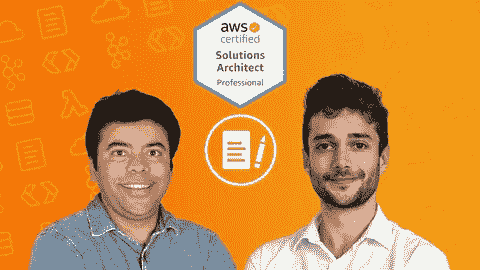
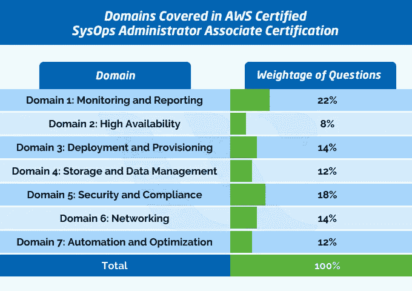
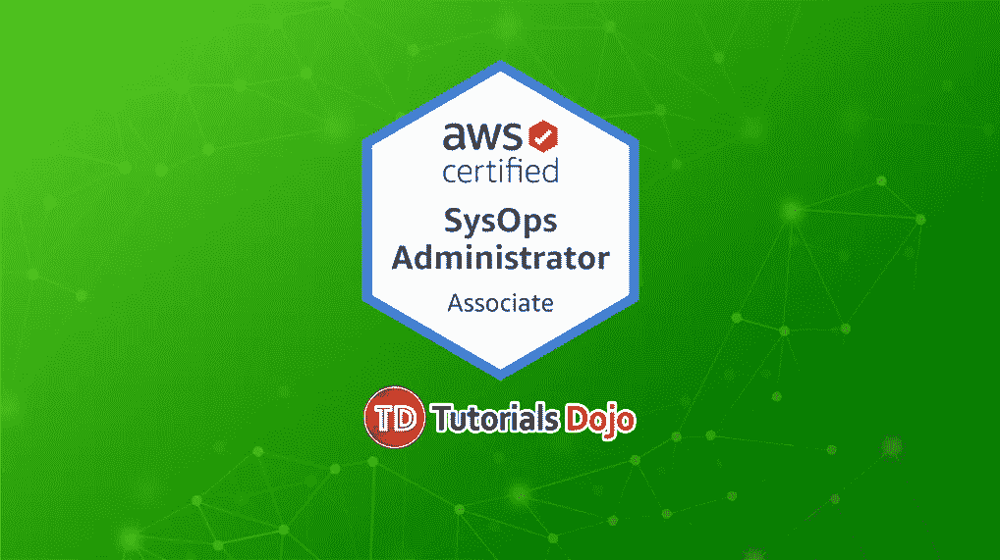
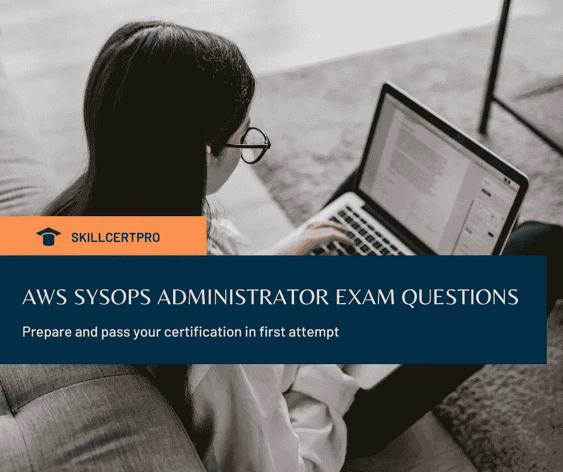
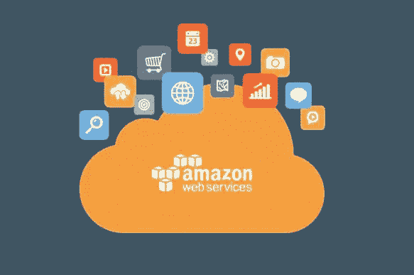
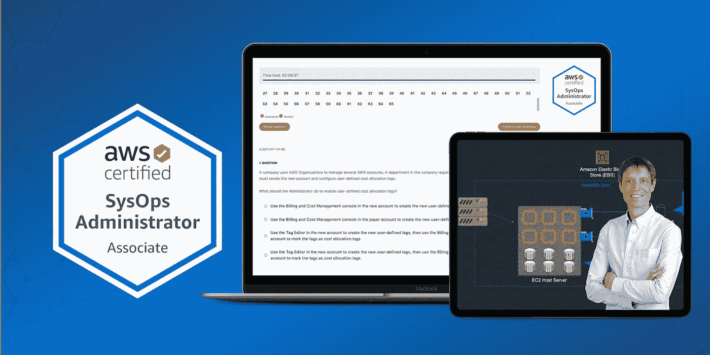

# 7 2023 年最佳 AWS SysOps 管理员助理认证实践测试、模拟考试和转储

> 原文：<https://medium.com/javarevisited/7-best-aws-sysops-administrator-associate-certification-practice-test-mock-exams-and-dumps-3578d07e4f5b?source=collection_archive---------0----------------------->

## 2000 多个练习问题和转储，为 2023 年的 AWS SysOps 管理员助理认证做准备

大家好，如果你正在准备 AWS 认证，如 **AWS SysOps 管理员助理认证考试**，并寻找一些具有挑战性的实践测试和模拟测试，那么你来对地方了。

过去，我曾分享过[最佳 AWS 系统操作管理员课程](/javarevisited/6-best-aws-sysops-online-courses-for-devops-engineers-to-become-a-certified-aws-sysops-5c2ae9dad31d)，在本文中，我将分享 7 个**最佳 AWS 系统操作实践测试** s、模拟测试和**考试转储**，为这一困难而著名的 AWS 认证做好准备。

除了书籍、在线培训课程和动手实验，模拟测试和练习题是通过任何 [AWS 认证](https://javarevisited.blogspot.com/2019/08/how-to-crack-aws-certified-solution-architect-exam.html)考试的第三个重要部分，AWS 认证 SysOps 管理员助理也不例外。

即使你有很好的现实经验，参加了[最佳 AWS 课程](https://javarevisited.blogspot.com/2020/05/top-5-amazon-web-services-aws-courses-for-beginners-and-experienced-programmers.html)，并且做了大量的实验室实践，你的准备也是不完整的，除非你解决了大量的模拟测试，因为只有这样才能为你提供真实的反馈，告诉你你在实际考试中会做得如何。

模拟题和模拟考试让你**在网上定时测试你的知识**，就像真正的考试一样。它们还可以让你进一步巩固你的知识，并在考试前找到你的弱项和强项。

他们还帮助你巩固知识，熟悉考试模式，*学习解决有多个答案的问题的窍门*等等。我的意思是，它们可能是仅仅通过 [AWS 考试](/javarevisited/top-5-aws-training-courses-to-crack-amazon-web-service-solutions-architect-associate-certification-3f4affa8f660?source=collection_home---4------0-----------------------)或获得高分之间最重要的区别。我也知道很多人因为没有花足够的时间在练习卷和模拟考试上，所以仅仅考了几分就不及格。由于考试费用为 **$150 美元**，并且准备考试需要大量的时间，因此您应该尽最大努力在第一次尝试时通过 *AWS 认证系统运行管理员助理*考试。

要做到这一点，你需要努力准备并完成拼图的所有三块——我的意思是，参加一门好的课程，在 AWS 免费层上做大量的实践实验，并尽可能多地解决练习题。

顺便说一下，如果你真的想在第一次尝试中通过这个著名的考试，那么我也强烈推荐你参加 Udemy 网站上夏羽·马雷克的 [**终极 AWS 认证系统管理员助理 2023**](https://click.linksynergy.com/deeplink?id=JVFxdTr9V80&mid=39197&murl=https%3A%2F%2Fwww.udemy.com%2Fcourse%2Fultimate-aws-certified-sysops-administrator-associate%2F) 课程。

 [## 终极 AWS 认证系统运行管理员助理 2023

### 50 多个视频已更新，以跟上 AWS 用户界面的变化。

udemy.com](https://click.linksynergy.com/deeplink?id=JVFxdTr9V80&mid=39197&murl=https%3A%2F%2Fwww.udemy.com%2Fcourse%2Fultimate-aws-certified-sysops-administrator-associate%2F) 

# 2023 年 7 个最佳 AWS SysOps 管理员认证练习题、模拟测试和考试转储

在过去的几篇文章中，我分享了一些[最佳 AWS 认证 SysOps 管理员助理在线课程](/javarevisited/10-free-courses-to-crack-aws-sysops-administrator-associate-certification-exam-so1-c01-20fc02c9471e)和资源，如白皮书、案例研究和有用的博客帖子，为 AWS SysOps 认证考试做准备。

今天，我将分享来自 [Udemy](https://javarevisited.blogspot.com/2019/08/top-10-udemy-courses-and-certifications-for-programmers.html) 、 [Whizlabs](https://shrsl.com/25qji) 、[认证-问题](https://www.certification-questions.com/practice-exam/amazon/aws-sysops?affiliateCode=fcff36fd-557a-4713-abf6-973e9924770f&utm_source=Javin&utm_medium=affiliate&utm_campaign=affiliate)和其他来源的最佳 AWS SysOps 模拟测试和练习题，以做好 AWS 认证 SysOps 管理员助理认证和代码 SOA-C01。

## 1.[模拟考试:AWS 认证 SysOps 管理员助理【195 题】](https://click.linksynergy.com/deeplink?id=JVFxdTr9V80&mid=39197&murl=https%3A%2F%2Fwww.udemy.com%2Fcourse%2Fpractice-exams-aws-certified-sysops-administrator-associate%2F)

你会很高兴地知道，夏羽·马雷克已经发布了 AWS 系统管理员助理考试的模拟测试。我已经等了很长时间，尤其是在参加了他的课程[Ultimate AWS Certified SysOps Administrator Associate 2023](https://click.linksynergy.com/deeplink?id=JVFxdTr9V80&mid=39197&murl=https%3A%2F%2Fwww.udemy.com%2Fcourse%2Fultimate-aws-certified-sysops-administrator-associate%2F)之后，该课程和本次模拟测试是准备这一具有挑战性的 AWS 认证的最佳资源

如果你不知道，[夏羽·马雷克](https://click.linksynergy.com/deeplink?id=JVFxdTr9V80&mid=39197&murl=https%3A%2F%2Fwww.udemy.com%2Fuser%2Fstephane-maarek%2F)是 AWS 的英雄，他以优异的成绩通过了大多数 AWS 认证，比如满分 1000 分中的 984 分。在解释 AWS 和卡夫卡时，他也是最好的导师之一。

谈到练习题，这些练习题是由 Stéphane Maarek 和 [Abhishek Singh](https://click.linksynergy.com/deeplink?id=JVFxdTr9V80&mid=39197&murl=https%3A%2F%2Fwww.udemy.com%2Fuser%2Fabhishek-singh-20032%2F) 共同编写的，他们带来了通过 **18 个 AWS 认证**的集体经验。

这些问题模拟了真实的考试，并且在解释中提供了详细的描述和“考试提醒”。他们还广泛参考了 AWS 文档，以帮助您快速了解 SOA-C01 考试中测试的所有领域。

在参加真正的考试之前，你可以用这些问题来测试你的最终准备水平。

**以下是参加本次考试的链接** — [模拟考试:AWS 认证系统管理员助理](https://click.linksynergy.com/deeplink?id=JVFxdTr9V80&mid=39197&murl=https%3A%2F%2Fwww.udemy.com%2Fcourse%2Fpractice-exams-aws-certified-sysops-administrator-associate%2F)

## 2. [Whizlabs 的 AWS 认证 SysOps 管理员模拟模拟器](https://shrsl.com/25qji)【700 多个问题】

当谈到实践测试和考试模拟器时，我比任何人都更信任 Whizlabs。我用他们的模拟测试通过了许多认证，包括 Java 和 AWS，这次认证也不例外。

他们有一个全面的 AWS SysOps 管理员考试模拟测试，其中有 12 个全长模拟测试和 **700 多个独特的问题**，这足以为考试做好准备。

每个模拟考试包含 60–65 个模拟问题，与真实考试非常相似。还有基于目标的实践测试和对每个问题的详尽解释，不仅向你解释为什么一个特定的答案是正确的，而且解释为什么其他答案也是不正确的。

这些练习测试还附带报告，以**找到你的优势和劣势。在真正考试之前，你可以利用这些反馈和报告找出你的强项和弱项。**

在此基础上，你可以努力克服你的弱点，让它们变得强大。如果你卡住了，他们也有一个内置的反馈机制，向作者发送问题，并得到快速响应

他们还根据最新的认证考试大纲不断更新。总的来说，如果你想第一次通过 AWS SysOps 管理员助理认证，这是一份必备的培训材料。

**这里是加入这个令人敬畏的测试**——[whiz labs 的 AWS 认证系统管理员模拟模拟器](https://shrsl.com/25qji)的链接

顺便说一句，如果你正在准备多个 AWS 认证，可以考虑参加 [**Whizlabs 年度订阅**](https://shareasale.com/r.cfm?b=1551042&u=880419&m=43514&urllink=&afftrack=) ，它提供对他们所有在线培训课程和不同认证的实践测试的完全访问，如 [AWS](https://www.java67.com/2020/09/top-10-cloud-certification-you-can-aim.html) 、 [Java](/javarevisited/my-favorite-books-and-courses-to-pass-java-se-8-certification-ocajp-8-and-ocpjp-8-b657a195aa07) 、 [Cloud](/javarevisited/5-best-cloud-computing-courses-to-learn-in-2020-f5f091159401) 、 [Docker](/javarevisited/top-15-online-courses-to-learn-docker-kubernetes-and-aws-for-fullstack-developers-and-devops-d8cc4f16e773) 和 [Kubernetes](/javarevisited/7-free-online-courses-to-learn-kubernetes-in-2020-3b8a68ec7abc) ，每年只需**99 美元**(现在有 50%的折扣)。我强烈推荐这个订阅计划，因为 Whizlabs 有最好的材料来准备 IT 认证。

## 3. [AWS 认证系统管理员助理实践考试](https://click.linksynergy.com/deeplink?id=JVFxdTr9V80&mid=39197&murl=https%3A%2F%2Fwww.udemy.com%2Fcourse%2Faws-certified-sysops-administrator-associate-practice-exams-soa-c01%2F)【330 道题】

除了 Whizlabs 之外，这是另一套模拟测试，我强烈推荐给任何准备这个著名的 AWS 认证的系统管理员或 DevOps 工程师。

由 Jon Bonso 和 Tutorials Dojo 打造的这个 Udemy 课程有超过 325 个全新的 AWS SysOps 问题，分为 **5 个练习测试**。

每个模拟测试包含 65 个模拟真实考试的问题。你应该每隔几天在一个真正的考试中参加一次考试，比如在一个安静的房间里，有一个特定的时间段，然后看看你的分数。由于你需要至少取得 76%的分数才能通过考试，我建议你只有在这些模拟测试中不断取得 80%的分数时才应该去。好的一点是，他们还提供了进一步学习的解释和链接，这样你就可以了解更多关于你错了的问题。

**以下是参加本练习考试** — [AWS 认证系统管理员助理练习考试](https://click.linksynergy.com/deeplink?id=JVFxdTr9V80&mid=39197&murl=https%3A%2F%2Fwww.udemy.com%2Fcourse%2Faws-certified-sysops-administrator-associate-practice-exams-soa-c01%2F)的链接

如果你在优惠价购买的话，花费不会超过 10 美元，但是可以为你节省 150 美元和真正考试的宝贵时间。

## 4.[亚马逊 AWS SysOps 考试通过认证问题转储](https://www.certification-questions.com/practice-exam/amazon/aws-sysops?affiliateCode=fcff36fd-557a-4713-abf6-973e9924770f&utm_source=Javin&utm_medium=affiliate&utm_campaign=affiliate)【835 个问题】

这是我向准备 AWS SysOps 认证的人强烈推荐的另一个资源。它与其他模拟考试略有不同，因为它们是来自实际认证考试的真题。考试转储基于经历过实际考试的人的记忆。

这些考试转储可以方便地找出任何认证考试的实际难度，认证问题拥有最大的 **AWS SysOps 考试转储**。在这个 *AWS 认证系统运行管理员(SOA-C01)考试转储*中，您将找到超过 835 个问题及其解决方案，并附有适当的解释。

下面是你将在 David Mayer 的 AWS 认证转储中找到的内容的快速快照:

—亚马逊 AWS SysOps 实践考试:
—问题数量:835
—考试测试:17
**下面是加入本实践考试的链接** — [亚马逊 AWS SysOps 考试转储](https://www.certification-questions.com/practice-exam/amazon/aws-sysops?affiliateCode=fcff36fd-557a-4713-abf6-973e9924770f&utm_source=Javin&utm_medium=affiliate&utm_campaign=affiliate)

这些 AWS SysOps 考试转储得到了 9000 多名开发人员和软件工程师的信任，如果你对这个考试很认真，我强烈建议你通读一下。还有一个 [**免费版**](https://www.certification-questions.com/amazon-exam/aws-sysops-dumps.html?affiliateCode=fcff36fd-557a-4713-abf6-973e9924770f&utm_source=Javin&utm_medium=affiliate&utm_campaign=affiliate) 的这些考试转储，你可以在这里访问。

## 5. [AWS 认证 SysOps 管理员 2023 模拟测试转储](https://click.linksynergy.com/deeplink?id=JVFxdTr9V80&mid=39197&murl=https%3A%2F%2Fwww.udemy.com%2Fcourse%2Faws-certified-sysops-administrator-2018-practice-questions%2F)【620 多个问题】

这是你可以在 Udemy 上参加的另一个 AWS SysOps 考试模拟测试。这包含 620 多个 AWS 认证系统管理员助理认证考试 2023 的练习题。

这是由 SKILLCERTPRO 创建的，受到了超过 1373 名学生的信任。近 245 名参与者平均给它打了 4.0 分。为了配合最新的考试大纲，他们还在 2023 年**增加了大约 200 个新问题**。他们还为每个问题提供详细的解释，这将有助于你理解问题，他们还提供 100%的退款保证，以防你对他们的考试模拟器的质量不满意。

如果你准备获得**1000/1000**这样的 100%测试结果，那么你可以用 Whizlabs 或 TutorialsDojo 添加他们的练习测试，一起练习。或者，练习 5 次左右的模拟测试或 600+道题就足以破解这个考试。

**以下是参加本课程的链接** — [AWS 认证 SysOps 管理员 2023 模拟测试转储](https://click.linksynergy.com/deeplink?id=JVFxdTr9V80&mid=39197&murl=https%3A%2F%2Fwww.udemy.com%2Fcourse%2Faws-certified-sysops-administrator-2018-practice-questions%2F)

## 6. [AWS 认证系统管理员助理实践测试](https://click.linksynergy.com/deeplink?id=JVFxdTr9V80&mid=39197&murl=https%3A%2F%2Fwww.udemy.com%2Fcourse%2Faws-certified-sysops-administrator-practice-exam%2F)【255 道题】

这是 Udemy 的另一个练习，可以帮助你为 AWS 认证系统管理员考试做最后的准备。这个模拟测试的好处是，它为你准备了在实际的 AWS SysOps 管理助理考试中很难回答的主题。

本课程包含 5 套模拟测试和一个单独的测验，分别针对监控和指标、部署和数据管理以及高可用性。每次测试的及格分数为 80%,尽管我们建议您在这些模拟测试中达到 80%以上的分数。

这些模拟测试是为那些想在参加 [*AWS 注册系统管理员—助理考试*](https://www.java67.com/2020/08/top-5-free-courses-to-pass-aws-sysops-administrator-associate-exam.html) *之前测试自己知识的人设计的。完成课程后，你会收到最后的建议和笔记——这是你通过考试所需要知道的一切*

*以下是参加本次模拟考试* — [AWS 认证系统管理员助理实践考试](https://click.linksynergy.com/deeplink?id=JVFxdTr9V80&mid=39197&murl=https%3A%2F%2Fwww.udemy.com%2Fcourse%2Faws-certified-sysops-administrator-practice-exam%2F)的链接

## 7. [AWS 认证系统管理员助理实践考试](https://click.linksynergy.com/deeplink?id=JVFxdTr9V80&mid=39197&murl=https%3A%2F%2Fwww.udemy.com%2Fcourse%2Faws-certified-sysops-administrator-associate-aws-practice-exams%2F)【Neal Davis】

如果这些问题还不够，您还可以在 Udemy 上查看 Neal Davis 的 AWS SysOps 认证考试练习题。这类似于夏羽的模拟测试，只有 195 个问题，但质量非常高。

这三套 **AWS 模拟测试**(每套有 65 个模拟问题)反映了[亚马逊网络服务考试问题](https://javarevisited.blogspot.com/2020/06/top-5-aws-certified-sysops-admin-associate-certification-exam.html)的难度，并且与 Udemy 上提供的真实 AWS 认证考试体验最为相似。

通过本 AWS 认证培训课程，您将知道自己何时准备好参加 **AWS 认证 SysOps 认证**考试。每个模拟考试都与真正的 AWS 考试具有相同的格式、风格、时间限制和及格分数(130 分钟回答 65 个问题)。

所有的问题都是独一无二的，并且符合最新的 AWS SOA-C01 考试蓝图，这使得它们对于想要第一次通过这个考试的人来说绝对是非常棒的。

**以下是参加本练习考试** — [AWS 认证系统管理员助理练习考试](https://click.linksynergy.com/deeplink?id=JVFxdTr9V80&mid=39197&murl=https%3A%2F%2Fwww.udemy.com%2Fcourse%2Faws-certified-sysops-administrator-associate-aws-practice-exams%2F)的链接

以上是为 AWS 认证系统管理员代码为 SOA- C01 的助理认证考试准备的**最佳模拟测试和练习题。**

正如我所说的，这是开发人员、系统操作员和解决方案架构师之间最难的 AWS 助理级别考试之一，我强烈建议您在参加这个考试之前完成 [AWS 认证开发人员](https://javarevisited.blogspot.com/2020/05/top-5-courses-to-crack-aws-certified-developer-associate-certification-exam.html)和 [AWS 解决方案架构师助理](https://www.java67.com/2020/04/how-to-paas-aws-certified-solution-architect-exam-in-2020.html)级别的考试。

如果你问我，我建议你把 Whizlabs 或者 TutorialsDojo 的实践考试和夏羽·马瑞克在 Udemy 上的[**Ultimate AWS Certified SysOps Administrator Associate 2023**](https://click.linksynergy.com/deeplink?id=JVFxdTr9V80&mid=39197&murl=https%3A%2F%2Fwww.udemy.com%2Fcourse%2Fultimate-aws-certified-sysops-administrator-associate%2F)课程结合起来，更好地准备这次考试。如果你诚实地花时间和精力在这两个资源上，你将有很好的机会在第一次尝试时通过考试。

其他**认证资源**面向 **IT 专业人士**和 Java 程序员

*   [破解 AWS 解决方案架构师认证的 5 大课程](https://javarevisited.blogspot.com/2019/05/top-5-courses-to-crack-aws-solutions-architect-associate-certification-exam-SAA-C01.html#axzz5rHwAwycj)
*   [破解 Azure 云架构师(AZ-300)考试的前 5 门课程](https://javarevisited.blogspot.com/2019/07/top-5-courses-to-crack-azure-architecture-technologies-certification-az-300-exam.html#axzz6E6VuRMsx)
*   [破解 AWS DevOps 工程师考试的 5 大课程](https://javarevisited.blogspot.com/2020/04/top-5-course-to-crack-aws-certified-devops-engineer-professional-exam-certification.html)
*   [破解 AWS 解决方案架构师专业考试的前 5 门课程](https://javarevisited.blogspot.com/2020/04/top-5-course-to-crack-aws-solution-architect-professional-sap-c01-certification-exam.html)
*   如何成为 Azure 认证管理员助理？
*   [程序员前 5 名 AZ-900 模拟测试](https://javarevisited.blogspot.com/2020/02/top-5-AZ-900-exam-Azure-Fundamentals-certification-practice-tests-and-mock-exams-to.html)
*   [通过谷歌助理云工程师认证的前 5 门课程](https://javarevisited.blogspot.com/2019/07/top-5-google-cloud-platform-gcp-courses-certifications-online.html)
*   [如何破解甲骨文 2023 年 Java 认证？](https://medium.freecodecamp.org/how-to-pass-oracles-java-certifications-a-practical-guide-for-developers-e9b607ba6173)
*   [成为 GCP 云工程师助理的前 5 名课程](https://javarevisited.blogspot.com/2020/05/top-5-course-to-crack-google-cloud-associate-cloud-engineer-certification-exam.html) r
*   [如何通过 AZ-300 Azure 解决方案架构师考试？](https://javarevisited.blogspot.com/2020/04/how-to-crack-microsoft-azure-solution-architect-exam-az-300.html)
*   [5 次免费 AWS 解决方案架构师实践测试](https://javarevisited.blogspot.com/2019/08/top-5-free-aws-solution-architect-Associate-certification-dumps-practice-questions.html)
*   [如何破解 Azure Fundamentals (AZ-900)认证](https://javarevisited.blogspot.com/2020/04/how-to-crack-microsoft-azure-fundamentals-certification-az-900-exam.html)
*   [学习 Docker 和 Kubernetes 的十大课程](https://dev.to/javinpaul/top-10-courses-to-learn-docker-and-kubernetes-for-programmers-4lg0)
*   [通过谷歌助理云工程师认证的前 5 门课程](https://javarevisited.blogspot.com/2019/07/top-5-google-cloud-platform-gcp-courses-certifications-online.html)
*   [通过 AWS 云从业者认证的前 5 门课程](https://javarevisited.blogspot.com/2020/02/top-5-courses-to-crack-aws-certified-cloud-practitioner-exam-certification-clf-c01.html)

感谢您阅读本文。如果您喜欢这些 *AWS 认证系统运行管理员助理模拟测试和练习问题*，请与您的朋友和同事分享。如果这些问题帮助你通过了考试，那么请把它传播出去，让其他人也能受益。

**P. S.** —如果你是 AWS 和云计算的新手，正在寻找一些在线课程来学习 AWS 并准备 AWS SysOps admin 考试，那么你也可以在 Udemy 上查看这个 [**终极 AWS 认证 SysOps 管理员助理 2023**](https://click.linksynergy.com/deeplink?id=JVFxdTr9V80&mid=39197&murl=https%3A%2F%2Fwww.udemy.com%2Fcourse%2Fultimate-aws-certified-sysops-administrator-associate%2F) **课程**。这是你能得到的准备这次困难考试的最好材料。

 [## 终极 AWS 认证系统运行管理员助理 2023

### 50 多个视频已更新，以跟上 AWS 用户界面的变化。

udemy.com](https://click.linksynergy.com/deeplink?id=JVFxdTr9V80&mid=39197&murl=https%3A%2F%2Fwww.udemy.com%2Fcourse%2Fultimate-aws-certified-sysops-administrator-associate%2F)