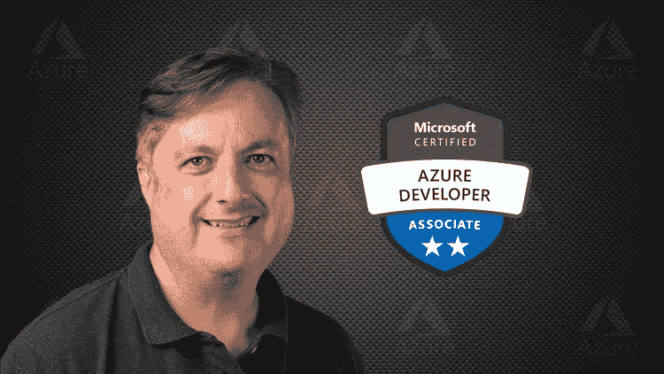
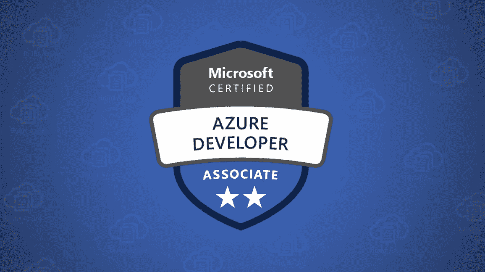

# 2023 年微软 Azure 开发者助理认证考试的 7 门最佳 AZ-204 在线课程

> 原文：<https://medium.com/javarevisited/7-best-az-204-online-courses-for-microsoft-azure-developer-associate-certification-exam-in-2021-1bee42a03e7c?source=collection_archive---------0----------------------->

## 瞄准 Azure Developer Associate—2023 年 AZ 203/204 考试？这里是你可以参加的最好的在线课程和模拟测试，以便第一次通过考试。

大家好，如果你的目标是在 2023 年成为**微软认证:Azure 开发者助理，并准备 AZ -204 微软 Azure 考试开发解决方案，那么你来对地方了。此前，我已经分享了 [**最佳 AZ 900 课程**](/javarevisited/5-best-azure-fundamentals-courses-to-pass-az-900-certification-exam-in-2020-9e602aea035d) ，今天，我将分享 Azure Developer associate 考试的最佳 AZ 204 在线课程和练习测试。**

*披露——顺便说一句，其中一些链接是附属链接，如果你使用我的链接加入这些课程，我可能会得到报酬。*

微软 Azure 是一种基于云的服务，作为企业管理其服务和应用程序的框架，以及其他使他们能够成功运营业务的东西。

微软 Azure 认证目前正在成为 IT 行业中要求最高的认证之一。

有理由影响云服务器并对来自不同地点的各种远程智能服务有很高需求的企业是使用微软 Azure 最多的企业。

现在，精通微软 Azure 的开发人员是那些知道如何在微软 Azure 中设计和创建云解决方案(如服务和应用程序)的人。这涵盖了从设计、开发、部署或启动到持续维护的项目开发的全过程。

**AZ 204，** **为微软 Azure 开发解决方案考试**测试开发者开发 Azure 基础设施即服务计算解决方案、Azure 存储、监控、故障排除和优化 Azure 解决方案以及实施 Azure 安全的能力。它还检查连接和使用 Azure 和第三方服务的能力。如果你是一名软件开发人员，希望成为微软认证的 Azure 开发人员，那么你可以在[微软页面](https://docs.microsoft.com/en-us/learn/certifications/exams/az-203)注册。在美国，考试费用为 165 美元，并以英语授课。

当你报名的时候，微软给你提供了两个备考选项。一个是免费的，另一个是收费的。[免费课程](/javarevisited/my-favorite-free-microsoft-azure-cloud-courses-for-beginners-to-learn-in-2020-3418524bb531)涵盖了微软 Azure 的大部分方面，而付费课程由讲师指导，专门针对*微软认证:Azure 开发人员-助理认证考试 AZ-204。如果你买不起付费的，不要失望，因为还有很多更实惠的选择。我在这篇文章中分享了**最好的微软 Azure 开发者助理课程**，你可以在 Udemy 上花 10 美元轻松买到。*

其中一些也是免费的。你可以使用这些免费和付费的在线课程来准备 2023 年的微软 Azure 开发者助理认证。

</javarevisited/my-favorite-free-microsoft-azure-cloud-courses-for-beginners-to-learn-in-2020-3418524bb531>  

# 考试 AZ-204 的前 7 名 Microsoft Certified Azure Developer Associate 认证在线培训课程

在不浪费你更多时间的情况下，这里有一份来自 [Udemy](/javarevisited/my-favorite-udemy-online-courses-for-programmers-and-software-engineers-f9d941dd0035) 、 [Pluralsight](/javarevisited/top-10-javascript-courses-from-pluralsight-to-learn-in-2021-26352abe4fcd) 和 [edX](/javarevisited/10-free-best-edx-certifications-and-courses-to-learn-online-3473d466f968) 的最佳在线培训课程列表，教你如何通过考试 AZ-204:为微软 Azure 考试开发解决方案，以便在 2023 年成为微软认证:Azure 开发者助理。

这些在线课程不仅涵盖考试主题和教学大纲，还提供一些使用核心 Azure 服务的真实体验，这也使它们非常适合学习。

## 1. [AZ-204 为微软 Azure 考试准备开发解决方案](https://click.linksynergy.com/deeplink?id=JVFxdTr9V80&mid=39197&murl=https%3A%2F%2Fwww.udemy.com%2Fcourse%2F70532-azure%2F)

除了在 Udemy 上获得最高评级的微软认证:Azure Developer-Associate Exam AZ-204 课程；它还有德语、意大利语、波兰语、葡萄牙语、西班牙语、法语和英语版本。它有将近 48000 名注册学生，由斯科特·达菲创建。在本课程中，将为您提供一次定时的模拟考试，以检查您的表现以及您对实际考试的准备情况。

在你考虑学习这门课程之前，你必须免费或付费订阅[微软 Azure](https://javarevisited.blogspot.com/2020/09/top-5-courses-to-learn-microsoft-azure.html) 并对了解微软云平台充满热情。像[这样的编程语言背景。NET](/javarevisited/7-best-online-courses-to-learn-asp-net-core-and-mvc-in-depth-a68c1b728090?source=---------28------------------) 、 [NodeJS](/javarevisited/top-10-online-courses-to-learn-node-js-in-depth-8ef0e31ca139) 和 [PHP](/javarevisited/top-10-free-courses-to-learn-php-and-mysql-for-web-development-e96e69982675?source=---------34------------------) 将被证明是非常有价值的。这门课一生一次。一旦你买了它，你将永远可以使用它。在这个在线课程中，你将学习如何成为一名微软专家:开发 Azure 解决方案认证，通过微软 AZ-204 开发微软 Azure 解决方案测试，并掌握 Azure 的主要概念，超出你通常使用的概念。

**这里是加入 AZ 204 课程的链接**——[AZ-204 为微软 Azure 考试准备开发解决方案](https://click.linksynergy.com/deeplink?id=JVFxdTr9V80&mid=39197&murl=https%3A%2F%2Fwww.udemy.com%2Fcourse%2F70532-azure%2F)

以防你仍然不相信，这里是课程内容的预览。它涵盖了去年更新的新 AZ-204 教学大纲，包括虚拟机、Azure 批处理服务、容器化解决方案、Azure 应用服务、移动应用、API 应用、函数应用、Azure 存储帐户。

它还涵盖了 Cosmos DB、SQL 数据库、Blob 容器、Azure 身份验证、Azure 访问控制、扩展应用和服务、缓存和内容交付网络、监控和日志记录，以及使用 Azure 服务。

## 2.[考试 AZ-204——为微软 Azure 开发解决方案](https://click.linksynergy.com/deeplink?id=JVFxdTr9V80&mid=39197&murl=https%3A%2F%2Fwww.udemy.com%2Fcourse%2Fexam-microsoft-azure-dev%2F)

这是另一个精心设计的课程，为学生准备微软 AZ-204 认证考试，最后有近 200 个模拟问题。它的评级为 4.4，有 3700 名学生注册。它是由艾伦·罗德里格斯创作的，用英语授课。在你考虑学习这门课程之前，你必须精通至少一门编程语言(大多数不是面向对象的)，并有一年或一年以上的程序员经验。你还需要有一点云计算的经验。

本课程不仅教授 [Microsoft Azure](https://javarevisited.blogspot.com/2020/02/top-5-courses-to-crack-az-900-microsoft-azure-fundamentals-certification-exam.html) 的概念，还教授从考试角度来看所要求的重要方面，并使您更好地准备编写 AZ-204 认证考试。看一下课程就知道涵盖了以下主题。

从 Azure(可选)开始，开发 Azure 基础设施即服务计算解决方案，开发 Azure 平台即服务计算解决方案，为 Azure 存储开发，实施 Azure 安全，监控、故障排除和优化解决方案，通过模拟考试连接和消费 Azure 和第三方服务。

**这里是加入这个 Azure 课程的链接** — [考试 AZ-204——为微软 Azure 开发解决方案](https://click.linksynergy.com/deeplink?id=JVFxdTr9V80&mid=39197&murl=https%3A%2F%2Fwww.udemy.com%2Fcourse%2Fexam-microsoft-azure-dev%2F)

## 3.[微软 Azure 开发者:AZ-204 考试简介——plural sight](https://pluralsight.pxf.io/c/1193463/424552/7490?u=https%3A%2F%2Fwww.pluralsight.com%2Fcourses%2Fmicrosoft-azure-developer-introduction-az-204-exam)

这是一门关于 AZ 204 考试的入门课程，让你熟悉考试目标以及如何准备这场考试。在本课程中，你将学到开始准备 AZ-204 考试所需的一切知识。

首先，你将探索 [AZ-204 考试](https://javarevisited.blogspot.com/2020/06/top-5-course-to-crack-Microsoft-Azure-Developer-Certification-Exam-AZ-203.html)的目的和重要性。接下来，你会发现整个 AZ-204 考试涵盖的所有不同的主题领域。

最后，您将了解在后续课程中能够利用的工具和技术。

完成本课程后，您将掌握 AZ-204 考试所涵盖的技能和知识，以及在考试过程中可以帮助您的工具和技术。[云计算](/javarevisited/5-best-cloud-computing-courses-to-learn-in-2020-f5f091159401)是一个很大的优势，但不是强制性的，因为云计算的所有部分都有详细的解释。

**这里是加入这个 AZ 204 路径的链接**——[微软 Azure 开发者:AZ-204 考试简介](https://pluralsight.pxf.io/c/1193463/424552/7490?u=https%3A%2F%2Fwww.pluralsight.com%2Fcourses%2Fmicrosoft-azure-developer-introduction-az-204-exam)

顺便说一下，你需要一个 [**Pluralsight 会员**](https://pluralsight.pxf.io/c/1193463/424552/7490?u=https%3A%2F%2Fwww.pluralsight.com%2Flearn) 才能进入这门课程，费用大约是每月 29 美元或每年 199 美元(现在有 33%的折扣)。

虽然我强烈推荐这种会员资格，因为它可以让你访问 7000 多门关于最新技术的在线课程，但你也可以使用他们的 [**10 天免费试用**](https://pluralsight.pxf.io/c/1193463/424552/7490?u=https%3A%2F%2Fwww.pluralsight.com%2Flearn) 来尝试一些课程。

<https://pluralsight.pxf.io/c/1193463/424552/7490?u=https%3A%2F%2Fwww.pluralsight.com%2Flearn>  

## 4.[开发微软 Azure 解决方案— AZ 204 考试 edX](https://www.awin1.com/cread.php?awinmid=6798&awinaffid=631878&clickref=&p=%5B%5Bhttps%3A%2F%2Fwww.edx.org%2Fcourse%2Fdeveloping-microsoft-azure-solutions-microsoft-dev233-2)

本课程向学生讲授更多有关 Microsoft Azure 的功能和特性，以及如何探索这些功能和特性来创建更强大、高度可用的基于云的解决方案应用程序。你需要一点关于[编程](/javarevisited/7-best-coding-course-to-learn-programming-with-zero-experience-in-2020-52f7d0d9cb80)的背景知识来充分利用这门课程。

课程大纲涵盖了如何配置和部署 web 应用，从图库创建 **Azure Web 应用**，部署和监控 Azure Web 应用，创建和配置 Azure 虚拟机，创建和管理存储帐户，管理存储帐户中的 blobs 和容器。

您还将学习创建、配置并连接到 [SQL 数据库](/hackernoon/top-5-sql-and-database-courses-to-learn-online-48424533ac61)实例，识别导入 SQL 独立数据库的含义，并在 Azure Active Directory 实例中处理用户和组订阅，创建虚拟网络并实施点对点网络。

**这里是加入这个 AZ 204 课程的链接** — [开发微软 Azure 解决方案](https://www.awin1.com/cread.php?awinmid=6798&awinaffid=631878&clickref=&p=%5B%5Bhttps%3A%2F%2Fwww.edx.org%2Fcourse%2Fdeveloping-microsoft-azure-solutions-microsoft-dev233-2)

## 5.[准备微软 Azure 考试(AZ-204)中的开发解决方案— LinkedIn 学习](http://linkedin-learning.pxf.io/c/1193463/449670/8005?u=https%3A%2F%2Fwww.linkedin.com%2Flearning%2Fpaths%2Fprepare-for-the-developing-solutions-in-microsoft-azure-exam-az-204)

这是为 AZ 204 准备的 12 门最佳在线课程的集合——在 LinkedIn learning 的 Microsoft Azure 考试中开发解决方案。

云开发者需要了解从设计到部署的过程。AZ-204 考试涵盖了开发人员规划、实施、监控和优化最佳 Azure 解决方案所需的技能。

该学习路径提供了开发人员准备考试所需的背景和支持。

**这里是加入这个 AZ 204 路径的链接** — [准备微软 Azure 考试中的开发解决方案](http://linkedin-learning.pxf.io/c/1193463/449670/8005?u=https%3A%2F%2Fwww.linkedin.com%2Flearning%2Fpaths%2Fprepare-for-the-developing-solutions-in-microsoft-azure-exam-az-204)

顺便说一下，你需要一个 LinkedIn Learning 会员资格来观看这个课程，这个课程每月花费大约 29.99 美元，但是你也可以通过参加他们的 [**1 个月免费试用**](http://linkedin-learning.pxf.io/c/1193463/449670/8005?u=https%3A%2F%2Fwww.linkedin.com%2Flearning%2Fsubscription%2Fproducts) 来免费观看这个课程，这是一个探索他们 16000 多门最新技术在线课程的好方法。

  

## 6. [AZ-204 为 MS Azure 实践测试开发解决方案](https://click.linksynergy.com/deeplink?id=JVFxdTr9V80&mid=39197&murl=https%3A%2F%2Fwww.udemy.com%2Fcourse%2Faz-204-developing-solutions-for-microsoft-azure-practice-tests%2F)

本课程根据最新的教学大纲为微软 AZ-204 认证考试提供了 5 个完整的模拟测试和 4 个案例分析。在您购买本课程之前，建议阅读一些关于 Azure 技术的背景资料。

本 [Udemy 课程](/javarevisited/my-favorite-udemy-online-courses-for-programmers-and-software-engineers-f9d941dd0035?source=---------14----------------------------)包含 5 个完整的定时练习测试。每个测试包含 50 多个问题，即 **250 多个独特的问题**来测试你对真正的考试准备得如何。这些测试也有案例研究。

本模拟考试课程旨在涵盖每一个主题，其难度级别与真实考试相似。他们解释了如何为特定应用选择正确的云服务，以及如何创建安全的数据库。

**这里是加入这个测试的链接** — [AZ-204 为 MS Azure 实践测试开发解决方案](https://click.linksynergy.com/deeplink?id=JVFxdTr9V80&mid=39197&murl=https%3A%2F%2Fwww.udemy.com%2Fcourse%2Faz-204-developing-solutions-for-microsoft-azure-practice-tests%2F)

## 7.[微软 AZ-204 证书课程:开发 Azure 解决方案— Udemy](https://click.linksynergy.com/deeplink?id=JVFxdTr9V80&mid=39197&murl=https%3A%2F%2Fwww.udemy.com%2Fcourse%2Fmicrosoft-az-204%2F)

这是 Udemy 上的一门全新课程，为 2023 年微软 AZ-204 Cert 课程:开发 Azure 解决方案认证考试做准备。由 Skylines Academy 和 Joe Fecht 创建的这个 5.5 小时的课程将帮助您准备 Microsoft AZ-204:开发 Azure 解决方案考试。

本课程基于微软的 [**AZ-204 认证**](https://docs.microsoft.com/en-us/learn/certifications/exams/az-204) 课程，并根据技能测试文档进行设置。在本课程中，Skylines Academy 作者兼讲师 Joe Fecht 将带领您了解:

1.  为您的学习做准备的课程介绍
2.  了解 Azure 基础设施即服务(IaaS)
3.  利用容器资源
4.  Azure 应用服务和 Azure 功能
5.  Cosmos DB 存储和 Azure Blob 存储
6.  身份验证和 Azure 密钥库
7.  应用交付和监控应用
8.  逻辑应用
9.  API 管理
10.  基于事件的解决方案

使用 Skylines Academy 的方法，讲座将*向*你讲授 Azure 解决方案的条款和原则，演示将*让*你通过使用场景的实践体验*让*你在现实世界中更有能力。

**这里是加入这个 AZ 204 课程的链接**——[微软 AZ-204 证书课程:开发 Azure 解决方案](https://click.linksynergy.com/deeplink?id=JVFxdTr9V80&mid=39197&murl=https%3A%2F%2Fwww.udemy.com%2Fcourse%2Fmicrosoft-az-204%2F)

以上是关于通过代码为 AZ-204 的微软 Azure 认证开发人员认证考试的**最佳课程。现在是成为认证云开发者的好时机，微软 Azure 是最有前途的云平台之一。**

越来越多的公司采用微软 Azure 进行迁移，对 Azure 认证程序员和专业人员的需求也在增加。您可以参加任何在线培训课程，开始准备。

其他**微软 Azure 和云认证**你可能想了解一下

*   [破解 Azure 开发人员助理考试的前 5 门课程](https://javarevisited.blogspot.com/2020/06/top-5-course-to-crack-Microsoft-Azure-Developer-Certification-Exam-AZ-203.html)
*   [如何破解 AWS 解决方案架构师考试](https://javarevisited.blogspot.com/2019/08/how-to-crack-aws-certified-solution-architect-exam.html)
*   [通过 Azure 管理员考试的前 5 门课程](https://javarevisited.blogspot.com/2020/06/top-5-course-to-become-microsoft-azure-administrator-certification-exam.html)
*   [微软 Azure 基础前 5 名模拟测试](https://javarevisited.blogspot.com/2020/02/top-5-AZ-900-exam-Azure-Fundamentals-certification-practice-tests-and-mock-exams-to.html)
*   [破解 AWS 解决方案架构师认证的 5 大课程](https://javarevisited.blogspot.com/2019/05/top-5-courses-to-crack-aws-solutions-architect-associate-certification-exam-SAA-C01.html#axzz5rHwAwycj)
*   [破解 Azure 云架构师(AZ-300)考试的前 5 门课程](https://javarevisited.blogspot.com/2019/07/top-5-courses-to-crack-azure-architecture-technologies-certification-az-300-exam.html#axzz6E6VuRMsx)
*   [通过 Azure 开发人员助理认证(AZ-204)的 5 门在线课程](https://javarevisited.blogspot.com/2020/06/top-5-course-to-crack-Microsoft-Azure-Developer-Certification-Exam-AZ-203.html)
*   [通过 Azure 云架构考试的前 5 门课程](https://javarevisited.blogspot.com/2019/07/top-5-courses-to-crack-azure-architecture-technologies-certification-az-300-exam.html)
*   [2023 年通过 AZ-900 认证的前 5 名课程](https://javarevisited.blogspot.com/2020/02/top-5-courses-to-crack-az-900-microsoft-azure-fundamentals-certification-exam.html)
*   [学习 Docker 和 Kubernetes 的十大课程](https://dev.to/javinpaul/top-10-courses-to-learn-docker-and-kubernetes-for-programmers-4lg0)
*   [程序员前 5 名 AZ-900 模拟测试](https://javarevisited.blogspot.com/2020/02/top-5-AZ-900-exam-Azure-Fundamentals-certification-practice-tests-and-mock-exams-to.html)
*   [通过谷歌助理云工程师认证的前 5 门课程](https://javarevisited.blogspot.com/2019/07/top-5-google-cloud-platform-gcp-courses-certifications-online.html)
*   [破解 AWS 解决方案架构师认证的 5 大课程](https://javarevisited.blogspot.com/2019/05/top-5-courses-to-crack-aws-solutions-architect-associate-certification-exam-SAA-C01.html#axzz5rHwAwycj)
*   [如何通过 Spring Core Professional 5.0 认证](https://javarevisited.blogspot.com/2018/08/how-to-crack-spring-core-professional-certification-exam-java-latest.html)
*   [如何在 2023 年成为 Azure 解决方案架构师助理](https://javarevisited.blogspot.com/2020/04/how-to-crack-microsoft-azure-solution-architect-exam-az-300.html)
*   [学习数据结构和算法的 10 门免费课程](http://www.java67.com/2019/02/top-10-free-algorithms-and-data.html)
*   [如何破解 2023 年 AZ-103 Azure 行政考试](https://javarevisited.blogspot.com/2020/04/how-to-crack-microsoft-az-103-azure-administrator-associate-exam-certification.html)
*   [如何破解 Azure Fundamentals (AZ-900)认证](https://javarevisited.blogspot.com/2020/04/how-to-crack-microsoft-azure-fundamentals-certification-az-900-exam.html)
*   [OCAJP 和 OCPJP 考试 10 道免费样题](http://www.java67.com/2017/05/10-free-java-8-certification-sample-questions-OCAJP8-OCPJP8-Mock-Exams.html)

感谢您阅读本文。如果你发现这些微软 Azure 管理员课程，*AZ-103 和 AZ-104 都有用，那么，请与你的朋友和同事分享。如果您有任何问题或反馈，请留言。

**P. S. —** 如果你是微软 Azure 的新手，正在寻找一个免费的初学者课程来开始学习微软 Azure 平台的关键概念，那么你也可以查看一下 [**微软 Azure 概念**](https://click.linksynergy.com/deeplink?id=JVFxdTr9V80&mid=39197&murl=https%3A%2F%2Fwww.udemy.com%2Fcourse%2Flinux-academy-microsoft-azure-concepts%2F)——Udemy 上 Linux Academy 提供的免费课程。这是完全免费的，你只需要一个免费的 Udemy 帐户就可以在线参加这个课程。*

<https://click.linksynergy.com/deeplink?id=JVFxdTr9V80&mid=39197&murl=https%3A%2F%2Fwww.udemy.com%2Fcourse%2Flinux-academy-microsoft-azure-concepts%2F> 