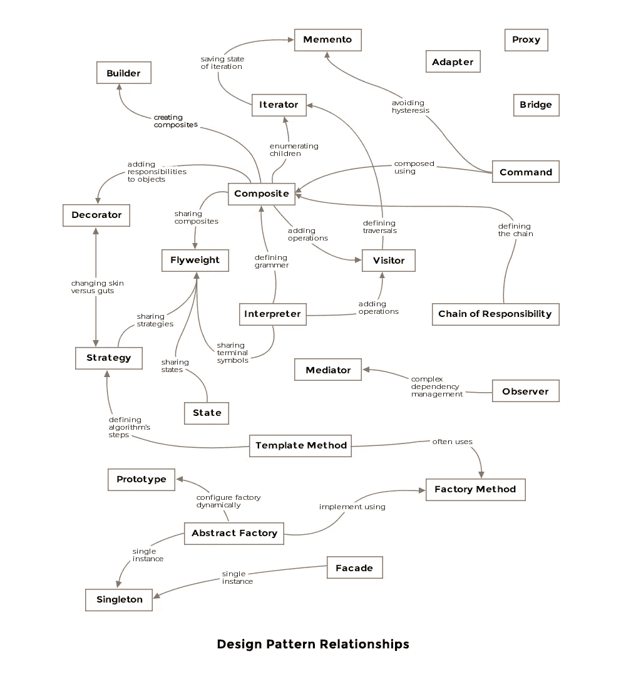
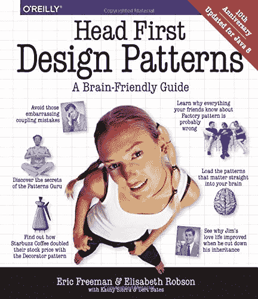
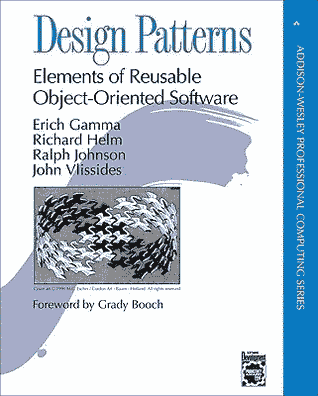
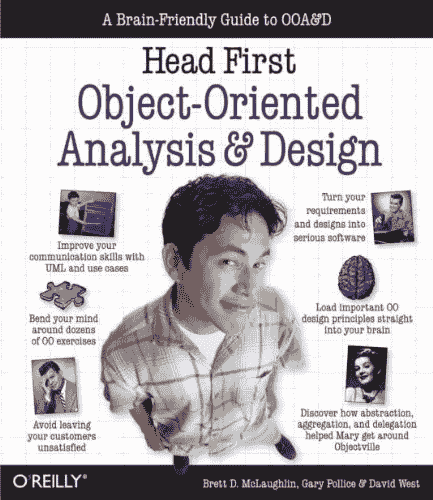
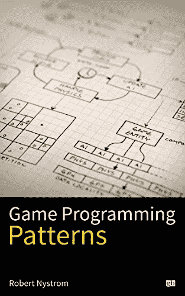
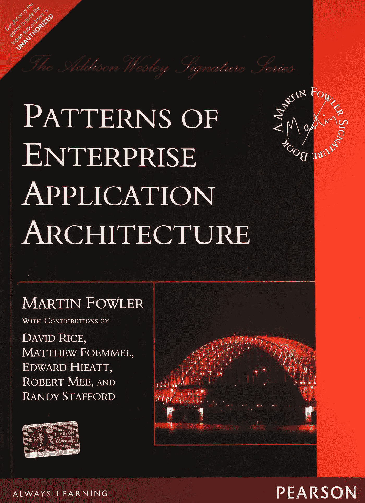

# 初学者和有经验的程序员的 7 本最佳 Java 设计模式书

> 原文：<https://medium.com/javarevisited/7-best-books-to-learn-design-patterns-for-java-programmers-5627b93eefdb?source=collection_archive---------0----------------------->

## 我最喜欢的学习面向对象设计模式和 Java 软件架构模式的书籍

image_credit —软件设计模式:软件开发人员的最佳实践

对于面向对象的程序员来说，设计模式是一个重要的话题，比如 Java 和 C++。随着你经验的增长，这变得更加重要，因为每个人都开始在编写高质量代码方面对你有更多的期望。

我经常收到来自中级和高级 Java 开发人员的电子邮件，内容是关于如何进入下一个阶段，比如如何成为技术领导、团队领导或软件架构师；设计模式的知识在承担更多的技术责任方面起着重要的作用。

虽然 [GoF 设计模式书](http://javarevisited.blogspot.sg/2013/06/5-must-read-books-to-learn-object.html)是面向对象设计模式的圣经，但在我看来，它有点太枯燥和学术化了。

你们中的许多人可能已经读过了，但我怀疑你们是否喜欢它。我读的第一本真正关于设计模式的书是[头一本](http://www.amazon.com/dp/0596007124/?tag=javamysqlanta-20)。它充满了激动人心的故事、漫画、UML 图、炉边聊天来分析每种设计模式的利弊、填空、练习，最重要的是，还有一些不平凡的代码示例。

另一个好处是，它不是关注所有的模式，而是关注一组好的核心模式，比如[装饰者](http://java67.blogspot.sg/2013/07/decorator-design-pattern-in-java-real-life-example-tutorial.html)、[观察者](http://javarevisited.blogspot.sg/2011/12/observer-design-pattern-java-example.html)、[工厂](http://javarevisited.blogspot.com/2015/06/difference-between-dependency-injection.html)、[命令](http://javarevisited.blogspot.sg/2016/05/command-design-pattern-in-java-example-code.html)、[策略](http://www.java67.com/2014/12/strategy-pattern-in-java-with-example.html)和门面模式。

我还发现 **Head First 的书比 GoF boo** k 的书可读性强得多，这是一本很棒的书，信息量也很大，但不是最好的读物。

因为现在我已经读了几本关于设计模式的书，我有点知道哪些是最好的书，为什么，这个列表是一个经验的集合。你可以选择一本或几本书来更新你对 [*设计模式*](https://dzone.com/articles/5-courses-to-learn-java-design-patterns-in-2019) 的知识，或者从头开始学习。

# 面向 Java 程序员的 7 大设计模式书籍

那么，我们还在等什么，这里是我收集的一些在 [Java EE](/javarevisited/top-7-online-courses-to-learn-java-ee-jakarta-ee-in-2020-216c1a5eea99) 开发者中学习面向对象设计模式和通用设计模式的最佳书籍。

## 1.[头先设计图案](http://www.amazon.com/dp/0596007124/?tag=javamysqlanta-20)

如果你是一个有 2 到 3 年经验的 Java 开发人员，并且从未听说过设计模式，这可能是最好的一本书。你可以在读完这本书后开始学习和理解它们。

这本书通过首先解释问题和设计模式如何解决问题来介绍设计模式。它不是学术性的，相反，可读性更强。你将学习一些最重要的设计模式，比如装饰者、命令模式、外观模式和观察者模式。该书还针对 Java 8 进行了更新。如果你想买一本书来学习设计模式，那么这本书应该是最好的。

这本书唯一的问题是它没有涵盖所有的设计模式。所以，如果你看完这本书还想学习更多的模式，我建议你看看 Pluralsight 上的[**设计模式库**](https://pluralsight.pxf.io/c/1193463/424552/7490?u=https%3A%2F%2Fwww.pluralsight.com%2Fcourses%2Fpatterns-library) 课程。它非常全面，并提供了交互式的真实世界的例子来理解更多的设计模式。

这里是在线购买这本书的链接— [头先设计模式](http://www.amazon.com/dp/0596007124/?tag=javamysqlanta-20)

## 2.[设计模式:可重用面向对象软件的元素](http://www.amazon.com/Design-Patterns-Object-Oriented-Professional-Computing/dp/0201634988?tag=javamysqlanta-20)

这是一本经典的 GOF 设计模式书，到处都被引用。这是第一本汇编了 24 种面向对象模式的书，并且很快流行起来。这可能是一本优秀的设计模式参考书，因为它涵盖了所有的设计模式，而且可能是以最详细的方式。我不喜欢这本书的唯一一点是它的可读性不强，这意味着你读几页就会感到厌倦。另一方面，你可以像 Head First Design Patterns 一样一口气读完上一本书的许多章节。

这里是在线购买这本书的链接— [设计模式:可重用面向对象软件的元素](http://www.amazon.com/Design-Patterns-Object-Oriented-Professional-Computing/dp/0201634988?tag=javamysqlanta-20)

如果你在理解文本方面有困难，你可以将这本书与 Udemy 的 [**从 0 到 1:设计模式——24 个重要的 Java 中的**](https://click.linksynergy.com/fs-bin/click?id=JVFxdTr9V80&subid=0&offerid=323058.1&type=10&tmpid=14538&RD_PARM1=https%3A%2F%2Fwww.udemy.com%2Ffrom-0-to-1-design-patterns%2F) 课程结合起来，该课程也涵盖了所有这些设计模式。在参加了那门课程并阅读了这本书之后，我对设计模式的理解有了显著的提高。

 [## 从 0 到 Java 中的设计模式——24 种重要模式

### 先决条件:对 Java 的基本理解由一个斯坦福毕业、前谷歌员工、超过 50 人的夫妻团队教授

udemy.com](https://click.linksynergy.com/fs-bin/click?id=JVFxdTr9V80&subid=0&offerid=323058.1&type=10&tmpid=14538&RD_PARM1=https%3A%2F%2Fwww.udemy.com%2Ffrom-0-to-1-design-patterns%2F) 

## 3.[头一次面向对象的分析与设计](http://www.amazon.com/dp/0596008678/?tag=javamysqlanta-20)

这是 Head First 系列中另一本关于面向对象分析和设计的优秀书籍，也是我一直以来的最爱。如果你能先看这本书再看头像设计图案。这将教会你 OOP 基础，比如为什么组合比继承更好，为什么你应该先编程接口再编程实现。在阅读任何关于设计模式的书籍之前，你应该先阅读这本书，因为它会教你面向对象的基础知识，这是任何设计原则和模式的核心。

如果你对什么是类、对象、函数以及如何使用抽象、继承、多态和封装有很好的理解，你就能理解任何模式。

为了获得最佳效果，我也建议你将本书与 Udemy 的 Dmitri Nestruk 的 Jav **a** 课程中的 [**设计模式结合起来。我亲自试过，它真的很棒。本课程还提供了许多练习材料，你可以用它们来巩固你在书中学到的概念，反之亦然。**](https://click.linksynergy.com/deeplink?id=JVFxdTr9V80&mid=39197&murl=https%3A%2F%2Fwww.udemy.com%2Fcourse%2Fdesign-patterns-java%2F)

这里是网上购买这本书的链接— [头头面向对象分析与设计](http://www.amazon.com/dp/0596008678/?tag=javamysqlanta-20)

如果你想快速浏览一下设计原则，你也可以在这里查看我关于程序员的 10 个基本面向对象原则的帖子。

## 4.鲍勃大叔为 Java 程序员开发的 UML

UML 对于任何严肃的面向对象程序员来说都是一项基本技能，尤其是对于 Java 程序员，为什么呢？因为一张图抵得上千言万语，UML 让您向所有团队成员传达您心中的设计。

当你使用 UML 来设计你的系统时，你也会很早就发现设计中的缺口和问题，你可以在不重写代码的情况下解决它们。它还能帮助你发展设计技能，提高思维的清晰度。

鲍勃大叔的《Java 程序员 UML》是你需要了解的 UML。它还带来了一些设计问题，比如设计一台咖啡机，类似于我们的[自动售货机设计问题](http://javarevisited.blogspot.sg/2016/06/design-vending-machine-in-java.html)。

这里是在线购买这本书的链接 Bob 叔叔的【Java 程序员的 UML

## 5. [Java EE 模式和最佳实践](http://www.amazon.com/Real-World-Java-Patterns-Rethinking-Practices/dp/1300149310/?tag=javamysqlanta-20)

这是 JEE 程序员的必备书籍之一，也可能是 JEE 开发人员的最新相关书籍。作者 [Adam Bien](http://www.oracle.com/technetwork/java/javaone2010-adam-bien-168666.html) 是 Java JEE 世界中的知名人物，Java 冠军，也为 JEE 开发者举办培训。

这本书大部分是他在 JEE 世界的经历。它会教你为什么要用[刀设计模式](http://javarevisited.blogspot.com/2013/01/data-access-object-dao-design-pattern-java-tutorial-example.html)以及 J2EE 和 JEE 有什么不同。

**这里是在线购买这本书的链接** — [Java EE 模式和最佳实践](http://www.amazon.com/Real-World-Java-Patterns-Rethinking-Practices/dp/1300149310/?tag=javamysqlanta-20)

## 6。[**Java 中的设计模式**Steven Metsker](https://www.amazon.com/Design-Patterns-Java-paperback-Software/dp/0134277880/?tag=javamysqlanta-20)

有一本书不在这个列表中，因为我是后来才找到的，这本书是史蒂文·梅茨克和威廉·c·威克写的《Java 中的设计模式 》。这是一本很棒的书，用边做边学的方法教你设计模式。

没有哪本书像这样向你展示场景，并询问你如何使用特定的设计模式来解决这个问题。如果你真的想掌握设计模式，我也强烈推荐这本书。

**这里是在线购买这本书的链接**—[Steven Metsker 的 Java 设计模式](https://www.amazon.com/Design-Patterns-Java-paperback-Software/dp/0134277880/?tag=javamysqlanta-20)

## 7.[游戏编程模式](https://www.amazon.com/Game-Programming-Patterns-Robert-Nystrom-ebook/dp/B00P5URD96/?tag=javamysqlanta-20)

这是我最喜欢的另一本书，以更清晰和实用的方式学习 GOF 设计模式。*游戏编程模式*这本书是由 Robert Nystrom 写的，他根据游戏开发中的使用情况对所有的设计模式进行了建模，这使得这个话题变得非常有趣。

这本书比一本[技术书](https://www.java67.com/2016/10/top-5-object-oriented-analysis-and-design-patterns-book-java.html)好得多，因为它将自身与技术分离，并专注于解决如何设计代码的问题。

此外，作者网站上的所有内容都是免费的，但你也可以同时使用实体书和 Kindle 版本来支持作者的出色工作。你可以在亚马逊上购买平装本或 Kindle 版本。

**这里是在线购买这本书的链接**——[游戏编程模式](https://www.amazon.com/Game-Programming-Patterns-Robert-Nystrom-ebook/dp/B00P5URD96/?tag=javamysqlanta-20)

## 8.[Martin Fowler 的《企业应用架构模式》](https://www.amazon.com/Patterns-Enterprise-Application-Architecture-Martin/dp/0321127420/?tag=javamysqlanta-20)

马丁·福勒的**企业应用架构模式(PEAA)** 一书无疑是软件工程领域的经典读物。在书中，他举例说明了软件行业中最普遍使用的模式。

这本书是在 2002 年写的，但它现在和它第一次出版时一样有意义。这本书最好的一点是所有的例子都是用 Java 给出的，这使得它成为 Java 程序员的一本优秀的设计模式书。

但是，同时，这些模式也可以应用于任何面向对象的编程语言。你也可以把这本书和 Udemy 的 [**企业架构师**](https://click.linksynergy.com/deeplink?id=CuIbQrBnhiw&mid=39197&murl=https%3A%2F%2Fwww.udemy.com%2Fcourse%2Fsoftware-architecture-for-the-enterprise-architect%2F) 软件架构课程结合起来，更好地进一步学习企业模式。

如果你想成为一名软件架构师，我强烈推荐这本书。我甚至把它列入了我的 [**最佳软件架构书籍**](/javarevisited/5-best-software-architecture-books-for-experienced-java-developers-1267d05a6b1d) 的名单。

 [## 成为软件架构师或解决方案架构师的 5 本必读书籍

### 我收到了很多来自高级 Java 开发人员的询问，他们渴望成为软件架构师或解决方案架构师…

javarevisited.blogspot.com](https://javarevisited.blogspot.com/2018/02/5-must-read-books-to-become-software-architect-solution.html#axzz6LCJoCRf9) 

这就是学习 Java 设计模式的几本好书的全部内容。如果你想学习它们，没有什么比 Head First 设计模式更好的了——尽管它不是一个很好的参考文本。我不会太在意设计模式。和大多数好的一样，如果你是一个优秀的软件开发人员，无论如何你都会写。

不好的开发者可能会照本宣科，把简单的问题变成灾区。在网络课程时代，你也可以将这些书与 Dmitri Nestruk 的 Jav a course 中的 [**设计模式相结合，这是我最喜欢的学习模式的课程之一。他真的很好地解释了模式，也建议了经典模式的现代实现。**](https://click.linksynergy.com/deeplink?id=JVFxdTr9V80&mid=39197&murl=https%3A%2F%2Fwww.udemy.com%2Fcourse%2Fdesign-patterns-java%2F)

 [## 面向工程师、设计师和架构师的 Java 设计模式

### 本课程从实用的角度全面概述了 Java 中的设计模式。

udemy.com](https://click.linksynergy.com/deeplink?id=JVFxdTr9V80&mid=39197&murl=https%3A%2F%2Fwww.udemy.com%2Fcourse%2Fdesign-patterns-java%2F) 

还想吃吗？这里有更多的编程书籍和资源供您探索

*   [程序员 10 本算法书](http://www.java67.com/2015/09/top-10-algorithm-books-every-programmer-read-learn.html)
*   [面向有经验程序员的 5 大设计模式课程](https://javarevisited.blogspot.com/2018/02/top-5-java-design-pattern-courses-for-developers.html)
*   干净的代码——程序员必读的代码书
*   [搜索算法——算法初学者指南](/hackernoon/grokking-algorithms-book-review-aa4459da93f5)
*   [每个程序员都应该读的 5 本书](http://www.java67.com/2016/02/5-books-to-improve-coding-skills-of.html)
*   [10 本免费 Java 编程书籍](http://www.java67.com/2013/11/10-free-java-programing-books-download-PDF-HTML.html)
*   [学习 Java 8 和函数式编程的 5 本书](http://www.java67.com/2015/07/5-books-learn-java-8-functional-programming.html)
*   [每个程序员都应该读的 10 本书](http://www.java67.com/2015/07/5-books-learn-java-8-functional-programming.html)
*   [初学者学习 Java 编程的最佳书籍](http://www.java67.com/2015/05/best-book-to-learn-java-for-beginners.html)
*   [每个程序员都应该阅读的 5 本 SQL 书籍](http://www.java67.com/2016/09/sql-5-best-books-to-learn-and-master.html)
*   [12 中级程序员必读高级 Java 书籍](http://www.java67.com/2016/06/12-must-read-advance-java-books-for-intermediate-programmers.html)
*   [面向 Java JEE 程序员的 3 本免费 Struts 书籍](http://www.java67.com/2015/12/4-FREE-struts-books-for-java-ee-developers.html)
*   [程序员 20+系统设计面试问题](https://www.java67.com/2018/05/top-20-system-design-interview-questions-answers-programming.html)
*   [学习 Java 微服务的 5 大课程](/javarevisited/top-5-courses-to-learn-microservices-in-java-and-spring-framework-e9fed1ba804d)

感谢您阅读到目前为止，如果您有任何书籍要添加到这个面向对象分析和设计模式书籍列表中，请通过评论告诉我，我会添加它们以方便大家。

**P. S. —** 如果你喜欢免费资源，正在寻找一门优秀的免费在线课程来深入学习设计模式，你也可以在 Udemy 上看到 [**Java 设计模式与架构**](http://bit.ly/java-design-patterns-tutorial) ，一门免费课程。这是完全免费的，你不需要支付任何费用。你只需要创建一个 Udemy 帐户就可以学习这门课程。

 [## 免费 Java 教程——Java 设计模式和架构

### 在作为软件开发人员和承包商为包括 CSC 在内的许多公司工作了 14 年后…

bit.ly](http://bit.ly/java-design-patterns-tutorial)