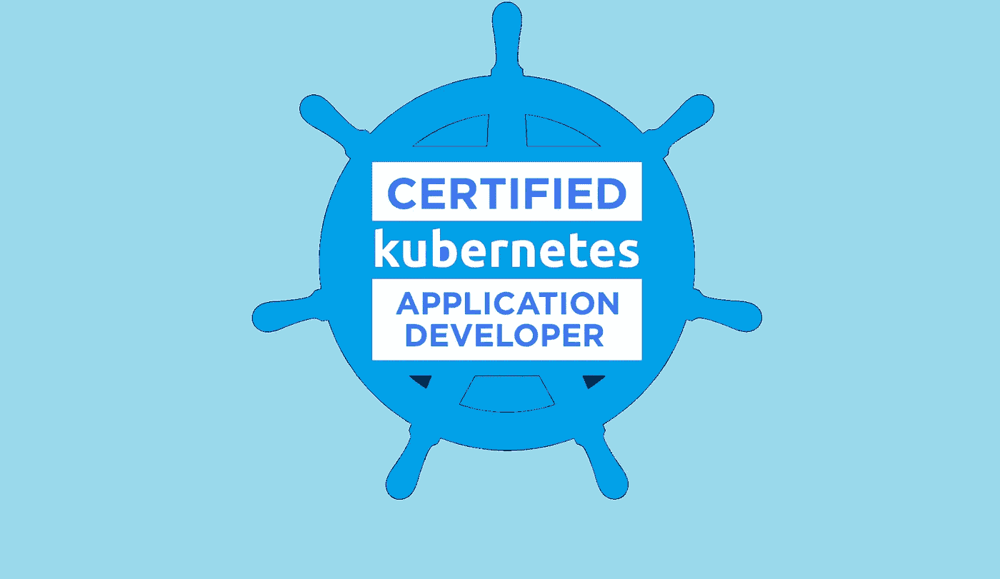
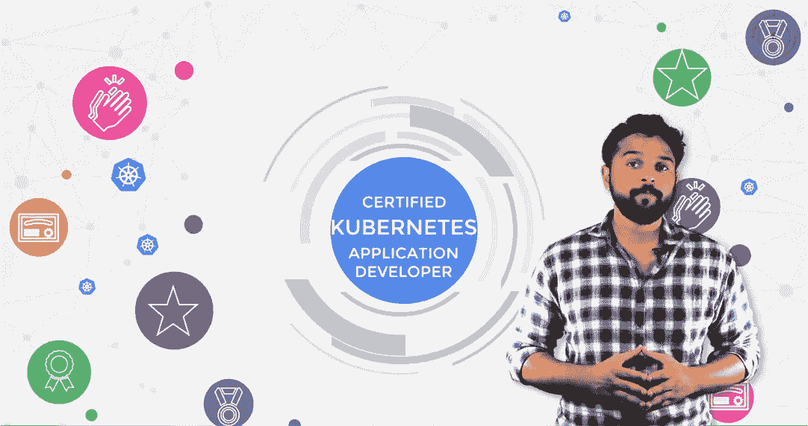
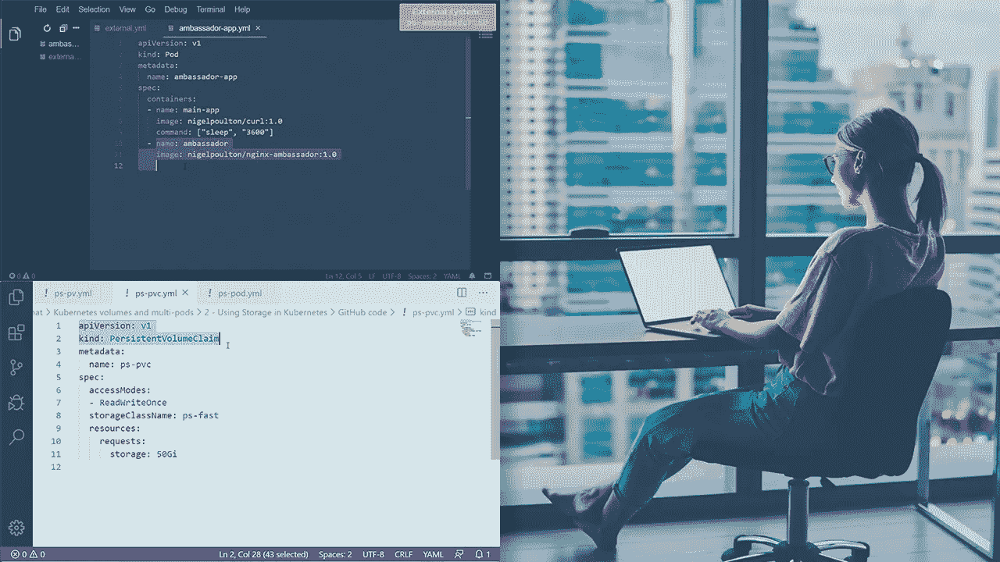
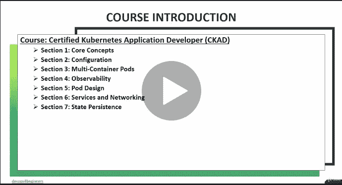

# 2023 年通过实践测试获得 Kubernetes 应用程序开发人员认证(CKAD)的 7 门最佳课程

> 原文：<https://medium.com/javarevisited/7-best-certified-kubernetes-application-developer-ckad-courses-practice-tests-in-2021-9b8b7d2c375?source=collection_archive---------1----------------------->

## 这些是 Udemy、Whizlabs 和 Pluralsight 为准备认证 Kubernetes 应用程序开发人员(CKAD)认证考试而提供的最佳在线课程

大家好，如果你正在准备 2023 年的*认证 Kubernetes 应用程序开发人员认证*或想要成为认证 Kubernetes 应用程序开发人员( **CKAD** )并寻找最好的在线课程来准备这一认证，那么你来对地方了。

前面我已经分享了学习 Kubernetes[Docker](https://javarevisited.blogspot.com/2019/05/top-5-courses-to-learn-docker-and-kubernetes-for-devops.html)[CKA 课程](https://javarevisited.blogspot.com/2020/09/top-5-courses-to-become-certified-Kubernetes-administrator-KCA.html)的 [**最佳课程，今天我要分享的是破解 Kubernetes 开发者认证，也就是 CKAD 的最佳在线课程。**](/javarevisited/top-15-online-courses-to-learn-docker-kubernetes-and-aws-for-fullstack-developers-and-devops-d8cc4f16e773)

这些是来自 [Udemy](https://click.linksynergy.com/fs-bin/click?id=JVFxdTr9V80&offerid=323058.9410&type=3&subid=0) 、 [Pluralsight](https://pluralsight.pxf.io/c/1193463/424552/7490?u=https%3A%2F%2Fwww.pluralsight.com%2Flearn) 和 Whizlabs 的最好、最实惠的在线课程，帮助您准备认证考试期间测试的关键考试主题。

请记住，这是一次实践考试，您需要扎实的经验和知识才能通过这个 *Kubernetes 开发人员认证。*

你实际上需要在命令行环境中展示你的 Kubernetes 技能，但你不能通过强记概念来做到这一点，你需要真正知道事情是如何工作的，以及如何使用它们来通过这项久负盛名的认证，但所有破解这项认证的努力都是值得的。

Kubernetes 应用开发者的需求近年来大幅增长。Kubernetes 是计算机应用程序社区的新趋势。认证 Kubernetes 应用程序开发人员，也称为 CKAD，是由**云本地计算基金会**和 Linux 基金会开发的一项认证，旨在推广这项新技术。

[Kubernetes](/javarevisited/7-free-online-courses-to-learn-kubernetes-in-2020-3b8a68ec7abc) 是新的，但它在逐年扩大。云原生计算基金会正试图扩展这项技术，以便更多的人能够加入。通过 CKAD 计划，基金会正在帮助世界各地的组织雇佣高质量的 Kubernetes 应用程序开发人员。

CKAD 认证是有价值的认证。在就业市场上认可度很高。作为一名 Kubernetes 应用程序开发人员，这个认证肯定会帮助你找到一份体面的工作。

但这是一个高水平的考试，需要对各种 Kubernetes 概念进行适当的引导和理解。在本文中，我们将列出*七大认证 Kubernetes 应用程序开发人员(CKAD)课程*，帮助您通过认证。

# 破解 Kubernetes 应用开发人员(CKAD)认证的 7 门最佳在线课程

以下是 2023 年通过 Kubernetes 应用开发者(CKAD)考试的最佳在线课程列表。这个列表包括初学者和高级课程，帮助你开始并掌握考试的关键主题。

你不仅会深入学习 Kubernetes，还会成为一名经过认证的 Kubernetes 应用程序开发人员(CKAD ),这是在这个云计算时代添加到你简历中的一项重要技能。

## 1. [Kubernetes 认证应用开发人员(CKAD)测试](https://click.linksynergy.com/deeplink?id=JVFxdTr9V80&mid=39197&murl=https%3A%2F%2Fwww.udemy.com%2Fcourse%2Fcertified-kubernetes-application-developer%2F)

这是 Udemy 最好的，当然也是最受欢迎的 CKAD 课程之一。这是一个长达几个小时的课程，包含 62 篇组织良好的文章。

本课程涵盖的主题包括在集群上设计和部署应用程序、开发云优先应用程序、通过网络策略保护 Kubernetes 集群、创建和调度作业、配置持久卷以及就绪性和活性探测，以及使用日志对部署的应用程序进行故障排除等。

要求
1。系统管理
2。使用 python 进行应用程序开发的知识。
3。Kubernetes 的基础知识。

**以下是参加 Kubernetes 课程** — [Kubernetes 认证应用开发人员(CKAD)考试](https://click.linksynergy.com/deeplink?id=JVFxdTr9V80&mid=39197&murl=https%3A%2F%2Fwww.udemy.com%2Fcourse%2Fcertified-kubernetes-application-developer%2F)的链接

## 2.[认证 Kubernetes 应用开发者 2023](https://click.linksynergy.com/deeplink?id=JVFxdTr9V80&mid=39197&murl=https%3A%2F%2Fwww.udemy.com%2Fcourse%2Fmastering-certified-kubernetes-application-developer%2F)【Udemy】

拥有超过 4000 名学生的“认证 Kubernetes 应用程序开发人员 2023”是 Udemy 的另一门热门课程。该课程是专门为那些想清除 CKAD 计划的人设计的。这是一个很长的课程，视频内容总共有十个小时。

本课程解释了强大的 Kubernetes 基础，以及如何部署 Kubernetes 应用程序。此外，该课程是专门为准备 CKAD 考试而设计的。

要求
1。Docker

知识如果你对第一门课不感兴趣，或者不太可能与讲师沟通，那么你可以探索这门课。它还侧重于 Kubernetes 应用程序开发人员，并涵盖所有考试主题。

**这里是加入这个令人敬畏的课程**——[认证 Kubernetes 应用开发者 2023](https://click.linksynergy.com/deeplink?id=JVFxdTr9V80&mid=39197&murl=https%3A%2F%2Fwww.udemy.com%2Fcourse%2Fmastering-certified-kubernetes-application-developer%2F) 的链接

## 3.[认证 Kubernetes 应用程序开发人员(CKAD)](http://shrsl.com/2h59b) — Whizlabs

这是 whizlabs 的一门新课程，涵盖了通过认证 Kubernetes 应用程序开发人员(CKAD)考试所需的所有必要概念。

课程分为各个板块。这些部分是:核心概念、服务和网络、Pod 设计、状态持久性、配置、可观察性和多容器 Pod。此外，在最后，它有一个单独的部分，描述如何正确地参加考试。

要求
1。Kubernetes 的基础知识。本课程包含 37 节课，共 7 个小时。它提供无限制的访问，可以在不同的设备上访问，如 PC、Mac、iPad、iPhone 和 Android。这是 whizlabs 最好的课程。

**以下是参加 CKAD 课程的链接**—[Kubernetes 认证应用程序开发人员(CKAD)](http://shrsl.com/2h59b)

顺便说一句，如果你正在准备 IT 认证，我强烈建议你参加 [**Whizlabs 订阅**](https://shareasale.com/r.cfm?b=1551042&u=880419&m=43514&urllink=&afftrack=) ，它提供了对他们所有在线培训课程、动手实验室以及不同认证(如 AWS、Java、Cloud、Docker 和 Kubernetes)的模拟测试的全面访问，每年仅需 99 美元(现在有 50%的折扣)。

## 4. [Kubernetes for Developers:核心概念](https://pluralsight.pxf.io/c/1193463/424552/7490?u=https%3A%2F%2Fwww.pluralsight.com%2Fcourses%2Fkubernetes-developers-core-concepts) — Pluralsight

对于那些想要学习 Kubernetes 核心概念以通过认证 Kubernetes 应用程序开发人员(CKAD)考试的人来说，这是 Pluralsight 的最佳课程。该课程特别关注开发人员在 Kubernetes 中的角色。

它涵盖了开发人员的职责，例如创建 pod、部署、服务、配置图、机密以及了解存储选项。

要求
1。建议具备 Kubernetes 的基础知识。这是初级课程，任何人都可以参加。核心概念对于明确 CKAD 考试非常重要。这个长达四个小时的课程是专门为解释 Kubernetes 的核心概念而设计的。

**这是加入本课程的链接**—[Kubernetes for Developers:核心概念](https://pluralsight.pxf.io/c/1193463/424552/7490?u=https%3A%2F%2Fwww.pluralsight.com%2Fcourses%2Fkubernetes-developers-core-concepts)

## 5. [Kubernetes for Developers:集成卷和使用多容器 Pods](https://pluralsight.pxf.io/c/1193463/424552/7490?u=https%3A%2F%2Fwww.pluralsight.com%2Fcourses%2Fkubernetes-developers-integrating-volumes-using-multi-container-pods) — Pluralsight

这是 Pluralsight 为开发人员创建的另一个受欢迎的课程。这是一门高级课程，适合中级和有经验的 Kubernetes 开发人员。由 Docker captain 和我最喜欢的导师之一 Nigel Poulton 创建的这个课程将教你 Kubernetes 的关键概念。

要求
1。Kubernetes 的基础知识。
2。Kubernetes 的基础知识。

除了核心概念，集成卷和使用多容器单元是 Kubernetes 应用程序开发人员(CKAD)认证考试的两个重要主题。

这两个小时的课程专门针对这两个主题进行深入探讨。所以如果你想详细学习如何集成卷和使用多容器 pod，这是最好的课程。

**这是参加本课程的链接**—[Kubernetes for Developers:集成卷和使用多容器容器](https://pluralsight.pxf.io/c/1193463/424552/7490?u=https%3A%2F%2Fwww.pluralsight.com%2Fcourses%2Fkubernetes-developers-integrating-volumes-using-multi-container-pods)

顺便说一下，你需要一个 Pluralsight 会员才能参加这个课程，费用大约是每月 29 美元或每年 299 美元(14%的折扣)。我向所有程序员强烈推荐这个订阅，因为它提供了超过 7000 个在线课程的即时访问，以学习任何技术技能。或者，你也可以使用他们的 [**10 天免费通行证**](https://pluralsight.pxf.io/c/1193463/424552/7490?u=https%3A%2F%2Fwww.pluralsight.com%2Flearn) 免费观看本课程。

 [## 个人技术技能|多视角

### 借助 Pluralsight，在开发运维、机器学习、云、安全基础设施等领域构建所需技能…

pluralsight.pxf.io](https://pluralsight.pxf.io/c/1193463/424552/7490?u=https%3A%2F%2Fwww.pluralsight.com%2Flearn) 

## 6.库伯内特:实用指南

虽然本课程与 kubernetes 应用程序开发人员认证没有直接关系，但它是学习 Docker 和 Kubernetes 的好课程，对您的 Docker 和 Kubernetes 认证都有帮助。

这门课程的创始人不是别人，正是 Maximilian Schwarzmuller，他是 udemy 最好的讲师之一，也是几门关于 web 开发、云计算和 JavaScript 的 Udemy 课程的作者。

在本课程中，您将学习:

*   什么是 Docker 和 Kubernetes，为什么你可能想使用它们
*   如何在任何系统上安装和使用 [Docker](/javarevisited/10-free-courses-to-learn-docker-and-devops-for-frontend-developers-691ac7652cee?source=---------94------------------)
*   如何使用 Docker 创建和使用图像和容器
*   如何学习复杂的主题，如使用卷管理和保存数据
*   如何通过 Docker Networks 和 DNS 服务发现了解容器网络
*   如何学习如何部署 Docker 应用程序——手动、使用托管服务或使用 Kubernetes

简而言之，这是一门很好的课程，可以从头开始学习 Docker、Docker Compose、多容器项目、部署以及所有关于 Kubernetes 的内容！

**这是加入本课程的链接** — [Docker & Kubernetes:实用指南](https://click.linksynergy.com/deeplink?id=JVFxdTr9V80&mid=39197&murl=https%3A%2F%2Fwww.udemy.com%2Fcourse%2Fdocker-kubernetes-the-practical-guide%2F)

## 7. [Docker 基础到高级(DCA) & Kubernetes (CKAD)](https://click.linksynergy.com/deeplink?id=JVFxdTr9V80&mid=39197&murl=https%3A%2F%2Fwww.udemy.com%2Fcourse%2Fdeep-dive-into-docker%2F)

这是另一个很棒的 2 合 1 Udemy 课程，为 2023 年的 Docker Certified Associate (DCA)和 Certified Kubernetes Application Developer Certification(CKAD)做准备。

在本课程中，我们将介绍使用 Docker 和 Kubernetes 所需的所有概念和基础知识。

本课程涵盖的章节重点介绍了 Docker Community Edition (CE)在 Ubuntu 和 CentOS 上的安装、Docker 容器和映像管理、存储、容器协调、网络和安全性。

这些章节将帮助学习者通过使用容器有效地创建、部署和运行应用程序。本课程旨在包括更多实践练习、命令和演示，以教授核心 Docker 基础知识和功能。

如果你正在准备 2023 年的 Docker 和 Kubernetes 认证，那么这个二合一课程是一个很好的开始。

**以下是参加本课程的链接** — [Docker 基础到高级(DCA) & Kubernetes (CKAD)](https://click.linksynergy.com/deeplink?id=JVFxdTr9V80&mid=39197&murl=https%3A%2F%2Fwww.udemy.com%2Fcourse%2Fdeep-dive-into-docker%2F)

以上是关于通过 Kubernetes 应用程序开发人员认证考试并成为认证 Kubernetes 应用程序开发人员的**最佳在线课程。认证 Kubernetes 应用程序开发人员(CKAD)考试长达三个小时，需要对各种 Kubernetes 概念有正确的理解。这些文章中列出的课程是你能在网上找到的最好的课程。这些课程属于知名网站，如 [Udemy](/javarevisited/10-best-udemy-online-courses-for-java-developers-4c9ab70cd01f) 、Whizlabs 和 [Pluralsight](/javarevisited/pluralsight-free-weekend-2020-3e0ff26e7a31) 。所有这些课程都是精心挑选的。因此，在做出选择之前，请随意浏览它们。

其他 **DevOps、云、编程课程**你可能喜欢**

*   [2023 年 DevOps 开发者路线图](/hackernoon/the-2018-devops-roadmap-31588d8670cb)
*   [10 Docker 和 Kubernetes 程序员课程](https://dev.to/javinpaul/top-10-courses-to-learn-docker-and-kubernetes-for-programmers-4lg0)
*   [面向 Java 和 DevOps 专业人员的 10 门免费 Docker 课程](https://javarevisited.blogspot.sg/2018/02/10-free-docker-container-courses-for-Java-Developers.html)
*   [学习 Jenkins 自动化和开发运维的五大课程](https://javarevisited.blogspot.com/2018/09/top-5-jenkins-courses-for-java-and-DevOps-Programmers.html)
*   [2023 年学习 Kubernetes 的 7 门免费在线课程](/javarevisited/7-free-online-courses-to-learn-kubernetes-in-2020-3b8a68ec7abc)
*   [破解 AWS 解决方案架构师专业考试的 5 门最佳课程](https://javarevisited.blogspot.com/2020/04/top-5-course-to-crack-aws-solution-architect-professional-sap-c01-certification-exam.html)
*   [如何通过 Spring Core Professional 5.0 认证](https://javarevisited.blogspot.com/2018/08/how-to-crack-spring-core-professional-certification-exam-java-latest.html)
*   [如何破解 Azure Fundamentals (AZ-900)认证](https://javarevisited.blogspot.com/2020/04/how-to-crack-microsoft-azure-fundamentals-certification-az-900-exam.html)
*   [学习亚马逊网络服务我最喜欢的课程](https://javarevisited.blogspot.com/2020/05/top-5-amazon-web-services-aws-courses-for-beginners-and-experienced-programmers.html)
*   [5 门免费硒课程学习自动化测试](https://javarevisited.blogspot.sg/2018/02/top-5-selenium-webdriver-with-java-courses-for-testers.html)
*   [如何成为 Azure 认证管理员助理？](https://javarevisited.blogspot.com/2020/04/how-to-crack-microsoft-az-103-azure-administrator-associate-exam-certification.html)
*   [程序员前 5 名 AZ-900 模拟测试](https://javarevisited.blogspot.com/2020/02/top-5-AZ-900-exam-Azure-Fundamentals-certification-practice-tests-and-mock-exams-to.html)
*   [如何破解甲骨文 2023 年 Java 认证？](https://medium.freecodecamp.org/how-to-pass-oracles-java-certifications-a-practical-guide-for-developers-e9b607ba6173)
*   [Spring 认证对工作和事业有帮助吗？](https://javarevisited.blogspot.com/2017/07/does-spring-certification-help-in-job-and-career.html)
*   [如何通过 AZ-300 Azure 解决方案架构师考试？](https://javarevisited.blogspot.com/2020/04/how-to-crack-microsoft-azure-solution-architect-exam-az-300.html)
*   [通过谷歌助理云工程师认证的前 5 门课程](https://javarevisited.blogspot.com/2019/07/top-5-google-cloud-platform-gcp-courses-certifications-online.html)
*   [破解 Azure 云架构师(AZ-300)考试的前 5 门课程](https://javarevisited.blogspot.com/2019/07/top-5-courses-to-crack-azure-architecture-technologies-certification-az-300-exam.html#axzz6E6VuRMsx)
*   [通过 AWS 云从业者认证的前 5 门课程](https://javarevisited.blogspot.com/2020/02/top-5-courses-to-crack-aws-certified-cloud-practitioner-exam-certification-clf-c01.html)
*   [程序员学习 AWS 和云的 10 门免费课程](/javarevisited/top-10-courses-to-learn-amazon-web-services-aws-cloud-in-2020-best-and-free-317f10d7c21d)

感谢阅读到目前为止。如果您喜欢这些*最佳 Kubernetes 应用程序开发人员(CKAD)认证课程*，请与您的朋友和同事分享。如果您有任何问题或反馈，请留言。

**附言——**如果你刚接触 Kubernetes，正在寻找免费课程，那么你也可以在 Udemy 上查看这个 [**Kubernetes:入门**](https://click.linksynergy.com/deeplink?id=JVFxdTr9V80&mid=39197&murl=https%3A%2F%2Fwww.udemy.com%2Fcourse%2Fkubernetes-getting-started%2F) 免费课程。这是完全免费的，你需要的只是一个免费的 Udemy 帐户来注册这个在线培训课程。

 [## 免费 Kubernetes 教程- Kubernetes:入门

### 请考虑“在您评价和回顾”本课程之前:这只是一个入门课程，还有更多…

udemy.com](https://click.linksynergy.com/deeplink?id=JVFxdTr9V80&mid=39197&murl=https%3A%2F%2Fwww.udemy.com%2Fcourse%2Fkubernetes-getting-started%2F)