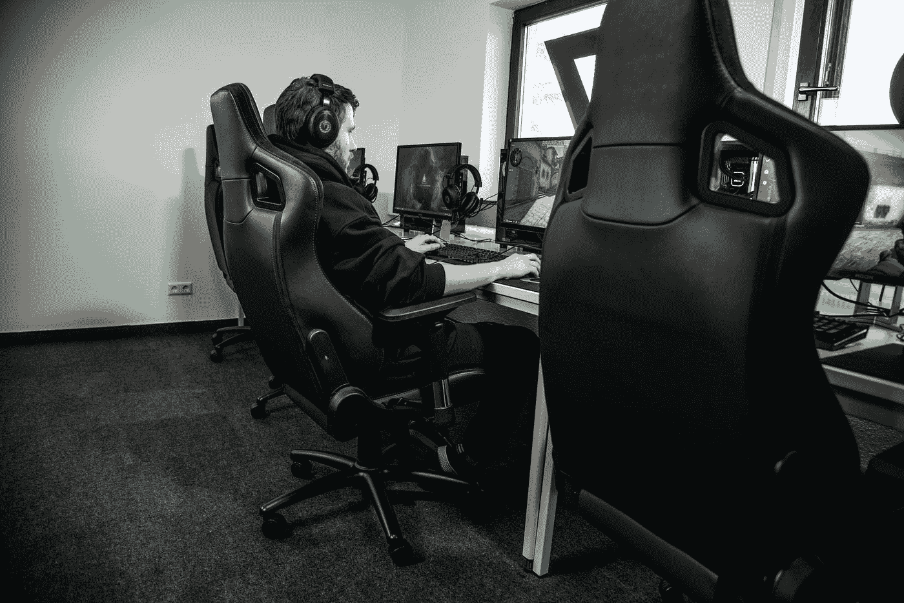
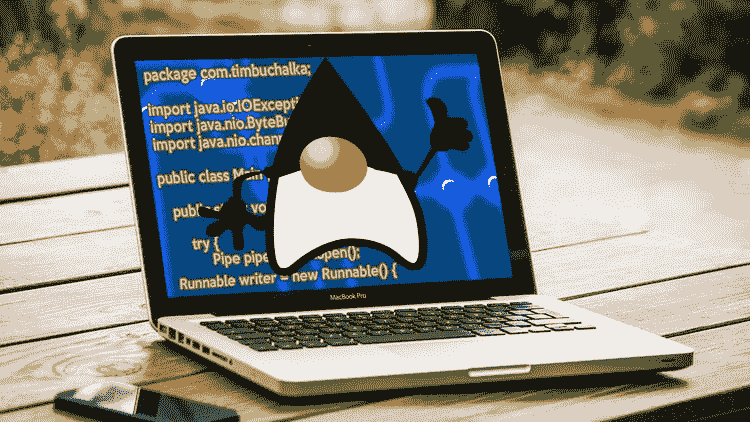
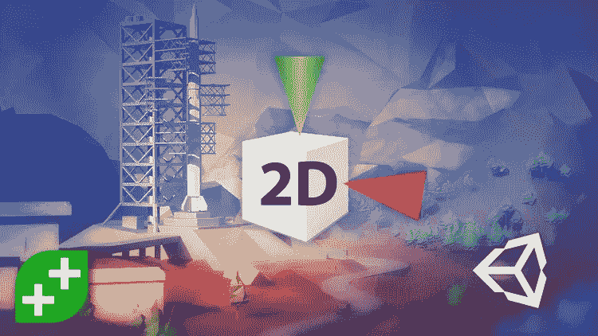
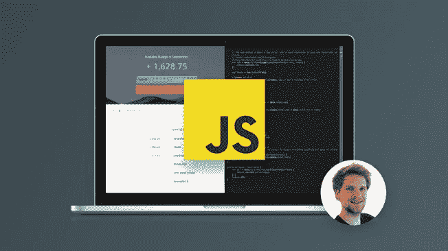
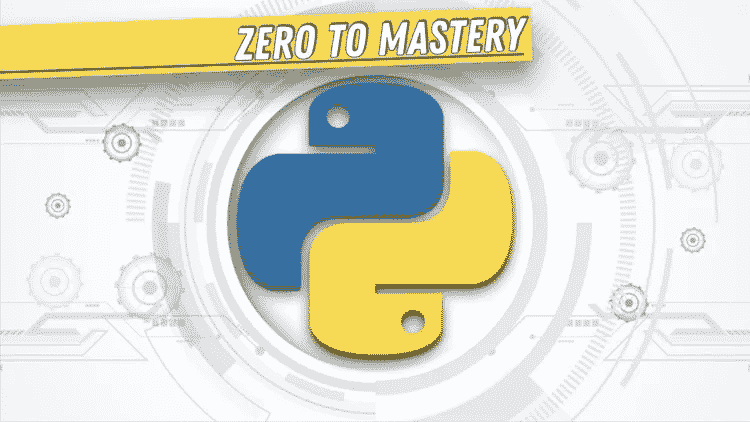

# 2023 年学习编程和编码的 7 门最佳在线课程

> 原文：<https://medium.com/javarevisited/7-best-coding-course-to-learn-programming-with-zero-experience-in-2020-52f7d0d9cb80?source=collection_archive---------0----------------------->

照片由[艾拉·唐](https://unsplash.com/@elladon?utm_source=medium&utm_medium=referral)在 [Unsplash](https://unsplash.com?utm_source=medium&utm_medium=referral) 拍摄

伙计们，如果你是一个完全没有编程经验的初学者，并且想在 2023 年学习编码，开始你的软件开发生涯，那么你来对地方了。前面我已经分享了 [**最佳 python 课程**](/better-programming/top-5-courses-to-learn-python-in-2018-best-of-lot-26644a99e7ec)[**最佳 Java 课程**](/javarevisited/top-5-java-online-courses-for-beginners-best-of-lot-1e1e240a758) ，[**最佳 JavaScript 课程**](/javarevisited/10-best-online-courses-to-learn-javascript-in-2020-af5ed0801645) ，今天我要分享的是初学者的最佳编码课程。

编程和/或编码是当今技术世界的基本技能之一，对编码的认识与日俱增。

大约 20 年前，在我进入工程学院攻读计算机科学和工程学位(T21)的时候，我只学习了编程，但是从那以后事情发生了很大的变化。

现在，甚至孩子们也开始学习编码，甚至我的女儿也能编码，比我在大学里能做的还要好得多。iPad、iPhone、智能手机和笔记本电脑等更容易使用的计算设备已经真正改变了环境，并使[编码](http://javarevisited.blogspot.sg/2015/06/2-websites-to-learn-coding-in-java-online-free.html)或[编程](http://www.java67.com/2018/05/top-75-programming-interview-questions-answers.html)更容易使用。如今，学校正在教孩子们编程，像 code.org 这样的网站正在帮助越来越多的人学习编程。编码的重要性如此之大，以至于许多人将编码视为一项基本技能，就像阅读、写作和说话一样。所有这些对编码的认识使得越来越多的人从不同的年龄组和领域开始学习编码。我认识一些 45 岁左右的人，他们正在学习找一份网络开发人员或应用程序开发人员的工作，或者做一名自由职业者。

然后是大量来自不同背景的学生，他们正在学习编码，找到一些工作，包括全职/兼职工作。甚至妇女也不落后，许多家庭主妇和来自不同行业的妇女正在学习编程和编码，以提高她们的技能并教导她们的孩子。如果你是其中之一，并决定今年学习编码，但不知道如何开始，那么你来对地方了。在这篇文章中，我将分享一些学习编码的最好的在线课程。我特别选择了既有趣又不需要编程经验的途径，涵盖了不同的兴趣领域，比如[网页开发](https://javarevisited.blogspot.com/2019/01/10-web-development-frameworks-fullstack-developer-should-learn.html)、 [iOS 开发](https://javarevisited.blogspot.com/2018/11/5-free-ios-app-development-courses-for.html)和[游戏开发。](https://javarevisited.blogspot.com/2019/03/5-free-game-development-courses-unity-corona-libgdx-java.html)

# 初学者学习编程的 7 大在线编码课程

为了学习编码，第一步是选择一种编程语言，这不是一件容易的事情。有很多流行的编程语言，像 [Java](http://www.java67.com/2018/08/top-10-free-java-courses-for-beginners-experienced-developers.html) ， [C++](http://www.java67.com/2018/02/5-free-cpp-courses-to-learn-programming.html) ， [C#](http://www.java67.com/2019/03/5-free-c-net-courses-to-learn-online.html) ， [Python](http://javarevisited.blogspot.sg/2018/03/top-5-courses-to-learn-python-in-2018.html) ， [Swift](https://javarevisited.blogspot.com/2019/01/top-5-ios-developer-course-to-learn-ios.html) ， [JavaScript，](http://www.java67.com/2018/04/top-5-free-javascript-courses-to-learn.html)和 [PHP，](http://www.java67.com/2018/02/5-free-php-and-mysql-courses-for-web-developers.html)被数百万程序员使用。我个人认为游戏开发是学习编码的最佳途径，这也是我选择了不止一门使用游戏教授编码和编程的课程的原因。这是一个行之有效的策略，甚至像 Code.org 这样的大网站也在通过开发像《我的世界》这样的游戏来教孩子们如何编程。对于那些不喜欢游戏的人，我已经加入了关于网页开发和应用程序开发的[课程，这是程序员和自由职业者的另外两个热门领域。](/better-programming/my-5-favorite-courses-to-learn-web-development-in-2019-a5e74167f8b2)

虽然对于初学者来说，我有四个选择， [Python](https://javarevisited.blogspot.com/2018/12/10-free-python-courses-for-programmers.html) ， [Java](https://javarevisited.blogspot.com/2018/05/top-5-java-courses-for-beginners-to-learn-online.html) ， [C#](/javarevisited/9-free-c-c-sharp-courses-and-tutorials-for-beginners-and-intermediate-programmers-best-of-lot-dc8c793aab31) ， [JavaScript，](https://javarevisited.blogspot.com/2018/06/top-10-courses-to-learn-javascript-in.html)你可以试着选择一个最适合你的。由于我是 Java 开发人员，所以我有点偏向 Java，但 Python 也是一种很棒的编程语言，同样容易学习。

## 1.[完整的 Python Bootcamp:在 Python 3 中从零到英雄](https://click.linksynergy.com/deeplink?id=JVFxdTr9V80&mid=39197&murl=https%3A%2F%2Fwww.udemy.com%2Fcomplete-python-bootcamp%2F)

Python 的受欢迎程度在过去几年里呈爆炸式增长，它已经成为所有想学习代码、想成为[数据科学家](https://javarevisited.blogspot.com/2018/10/data-science-and-machine-learning-courses-using-python-and-R-programming.html)、[学习 Web 开发](/javarevisited/top-10-courses-to-learn-python-for-web-development-in-2020-best-of-lot-efe11fb6d212)或者只是想自动化繁琐任务的人的首选编程语言。毫无疑问，Python 是第一编程语言，它简单易学，使用这种编程语言你几乎可以做任何事情。它有一些最好的 API 和库集合，只用几行代码就可以完成大多数困难的任务。

如果你想*学习使用 Python 编程，*那么这可能是你能参加的最好的课程。它将以训练营的方式教你 Python，这是学习编码的好方法。

导师— [何塞·马西亚尔·波尔蒂利亚](https://medium.com/u/703ff67f629f?source=post_page-----52f7d0d9cb80--------------------------------)

**这里是加入本课程的链接**——[完整的 Python 训练营:在 Python 3 中从零到英雄](https://click.linksynergy.com/deeplink?id=JVFxdTr9V80&mid=39197&murl=https%3A%2F%2Fwww.udemy.com%2Fcomplete-python-bootcamp%2F)

谈到社交证明，这门课程平均得到了近 50 万名学生的 4.5 分，这简直令人难以置信，顺便说一句，如果你需要另一种选择，你也可以看看 [**一个月 Python**](https://mbsy.co/sFqPj) 课程，这是另一种训练营式的课程，将在一个月内教你 Python。它还提供了一个结业证书，你可以在你的 LinkedIn 个人资料中展示。

<https://mbsy.co/sFqPj>  

## 2.[完整的 Java MasterClass](https://click.linksynergy.com/deeplink?id=JVFxdTr9V80&mid=39197&murl=https%3A%2F%2Fwww.udemy.com%2Fjava-the-complete-java-developer-course%2F)

如果出于某种原因，你不喜欢 Python 编程语言，或者想学习 Java 以及如何编码，那么这是最适合你的课程。Java 是过去 20 年来最流行的编程语言之一，用于开发关键任务应用程序。它也无处不在，你会在智能手机中发现 Java，就像你可以用 Java 创建[安卓应用](http://www.java67.com/2019/01/top-5-free-android-app-development-courses-for-programmers.html)。

它还大量用于编写服务器端应用程序，如日常生活中使用的门户、链接银行门户、订票 web 应用程序，其中许多都是用 Java 编写的。

Java 无论是学习编码，还是作为编程语言获得工作，都是绝佳的选择；如果你不相信，你可以查看一下 [Python 和【Java 的对比。本课程将教你使用 Java 编程语言编写代码所需要知道的一切。

这也是 Udemy 上最受欢迎的编程课程之一，有近 450 万名学生给出了平均 4.6 分的评分，这是一个巨大的数字。简而言之，用 Java 学习编码的最佳在线课程。](http://javarevisited.blogspot.sg/2013/11/java-vs-python-which-programming-laungage-to-learn-first.html#axzz55UE6mabh)

**这里是加入本课程的链接** — [完整的 Java 大师班](https://click.linksynergy.com/deeplink?id=JVFxdTr9V80&mid=39197&murl=https%3A%2F%2Fwww.udemy.com%2Fjava-the-complete-java-developer-course%2F)

## 3.[网络开发者训练营](https://click.linksynergy.com/deeplink?id=JVFxdTr9V80&mid=39197&murl=https%3A%2F%2Fwww.udemy.com%2Fthe-web-developer-bootcamp%2F)

我们都有网站，它按需提供你需要的信息，在当今世界，每一个企业都需要它的网站。这种趋势刺激了 Web 开发者市场，越来越多的人想成为 Web 开发者或全栈开发者。

像 JavaScript 这样的语言和像 Angular、React、Node JS 和 T21 这样的框架的发展确实使得 Web 开发比以前更加容易和有效。

所以，如果你想学习 JavaScript 这种编程语言进行编码，这是正确的选择，并且想学习 Web 开发，那么没有比柯尔特·斯蒂尔的[*Web Developer boot camp*](https://click.linksynergy.com/deeplink?id=JVFxdTr9V80&mid=39197&murl=https%3A%2F%2Fwww.udemy.com%2Fthe-web-developer-bootcamp%2F)更好的课程了。

它涵盖的不仅仅是编码和网页开发。你将学习到创建和维护新兵训练营风格的网站所需的所有有用的技术。

讲师— [柯尔特 _ 斯蒂尔](https://medium.com/u/b74a1e474498?source=post_page-----52f7d0d9cb80--------------------------------)

**这是加入本课程** — [网络开发人员训练营](https://click.linksynergy.com/deeplink?id=JVFxdTr9V80&mid=39197&murl=https%3A%2F%2Fwww.udemy.com%2Fthe-web-developer-bootcamp%2F)的链接

这个课程实际上将提供你在训练营中花费 8000 美元——10000 美元所获得的所有知识，而这只是这个价格的一小部分，比如最多 15 美元。

谈到社会证明，这门课程平均有近 41 万名学生给出 4.6 分的评分，这简直令人难以置信。同样，如果你感兴趣，遵循 [**2023 年 Web 开发者路线图**](https://javarevisited.blogspot.com/2019/02/the-2019-web-developer-roadmap.html) 也是成为当今世界现代 Web 开发者的绝佳指南。

</javarevisited/the-2019-web-developer-roadmap-ab89ac3c380e>  

## 4.[iOS&Swift——完整的 iOS 应用开发训练营](https://click.linksynergy.com/deeplink?id=JVFxdTr9V80&mid=39197&murl=https%3A%2F%2Fwww.udemy.com%2Fcourse%2Fios-13-app-development-bootcamp%2F)

另一个吸引了很多人编码的领域是移动或应用程序开发。谷歌的 Android 和苹果的 iOS 确实让今天的手机比昨天的电脑和笔记本电脑强大得多。我还记得在 10-15 年前，我用的是一台 500 兆的笔记本电脑，它是顶尖的，但今天的手机拥有比那更强大的计算能力。 [Android](https://javarevisited.blogspot.com/2017/12/top-5-android-online-training-courses-for-Java-developers.html) 和 [iOS](/javarevisited/top-5-online-courses-to-learn-ios-12-swift-in-2019-a35ae1be7b2b) 都为开发关键任务应用提供了强大的工具和平台。如果你有兴趣开发移动应用程序，并学习使用 Swift 编程语言(苹果的教育革命产品之一)进行编码，那么这是最适合你的课程。简而言之，使用 Swift 学习编码的最佳编程课程

**这里是参加本课程的链接** — [iOS 13 & Swift 5 —完整的 iOS 应用程序开发训练营](https://click.linksynergy.com/deeplink?id=JVFxdTr9V80&mid=39197&murl=https%3A%2F%2Fwww.udemy.com%2Fcourse%2Fios-13-app-development-bootcamp%2F)

导师 [Angela Yu](https://medium.com/u/5a5584f78d27?source=post_page-----52f7d0d9cb80--------------------------------) 是世界上最好的导师之一，你会喜欢她的教学风格。她清晰简洁，也在她的训练营课上教过很多学生。这门课程还获得了近 18 万名学生平均 4.8 分的评分，令人印象深刻。

5.[HTML、CSS 和 JavaScript 编码简介](https://offers.internationalopenacademy.com/rk/course/introduction-to-coding)

嘿，各位，如果你想知道学习 JavaScript 的最佳方法，你来对地方了。为了学习 Javascript，我知道我需要学习一门有视频的课程，这样我就可以看到正在发生的事情，而不仅仅是阅读它。

我找到了我一直在寻找的东西——国际开放学院的[HTML、CSS 和 JavaScript 编码介绍](https://offers.internationalopenacademy.com/rk/course/introduction-to-coding)在线课程。如果你使用这个链接，它的价格是 19 美元。国际开放学院已经在 150 个国家培养了 100 多万名学生。它的课程得到了认可和国际认可。

这门编码课程非常适合绝对的初学者以及对编码有一点了解的人。它是视频引导的，所以你可以看到导师输入代码，更重要的是，他在哪里输入代码。

JavaScript 对于网站所有者和博主来说是超级棒的，因为它能够让浏览者与你互动。你可以使用 JS 来提问，创建一个有趣的测验或收集电子邮件地址，以了解更多关于你的观众，并使他们在你的网站上停留更长时间。快乐的日子！

在本课程中，您将了解 JavaScript 以及它如何与 HTML 和 CSS 一起工作。这些模块包括:

*   基础知识，比如计算机如何工作，什么是编程，什么是互联网，什么是网页
*   JS Bin 允许你编辑和测试你的代码
*   什么是 HTML 以及如何用 HTML 创建网页
*   如何用 CSS 设计网页的样式和大小
*   使用 JavaScript 进行更改和添加元素，以便查看者可以与您的页面进行交互
*   学完所有的理论，你就有一个项目要完成。这是课程中很棒的一部分，因为你在自己的网站上自由活动之前会尝试自己编码
*   每个模块结束时都有一次考试，当你通过考试时，你会得到一张证书

本课程从简单开始，然后逐步积累，所以开始编码时不会感觉太累。

在这篇文章中，我提到了我发现的学习 JavaScript 定制网页的最佳方法。

## 5.[完成 C# Unity 开发者 2D:学习代码制作游戏](https://click.linksynergy.com/deeplink?id=JVFxdTr9V80&mid=39197&murl=https%3A%2F%2Fwww.udemy.com%2Funitycourse%2F)

本课程将教你如何使用 C#编程语言和通过开发游戏来编码，这可以说是学习编程和编码的最佳途径。C#是微软的一种领先的编程语言，主要用于开发桌面 GUI 应用程序。它也被用于 [Unity](https://unity.com/) 游戏引擎，这是开发游戏最流行的游戏引擎。

这门课程不仅会教你如何编码，还会教你一门 [C#编程语言](https://javarevisited.blogspot.com/2019/11/top-5-courses-to-learn-c-sharp-in.html)以及如何使用 Unity 开发游戏。正如我以前说过的，没有比开发游戏更好的开始编码的方法了，我强烈建议所有初学者都加入这个课程。

通过开发游戏，你还会学到[数据结构](https://javarevisited.blogspot.com/2018/01/top-5-free-data-structure-and-algorithm-courses-java--c-programmers.html)和[算法](https://javarevisited.blogspot.com/2018/11/top-5-data-structures-and-algorithm-online-courses.html)，对于编写有用的程序非常重要。谈到社会证明，这门课程平均有 4.6 分，来自近 290，000 名学生，这是非常惊人的。总之，学习使用 C#编码的最佳编程课程

**这里是加入本课程的链接**——[完整的 JavaScript 课程 2023:构建真实的项目](https://click.linksynergy.com/fs-bin/click?id=JVFxdTr9V80&subid=0&offerid=323058.1&type=10&tmpid=14538&RD_PARM1=https%3A%2F%2Fwww.udemy.com%2Fthe-complete-javascript-course%2F)

## [6。完整的 JavaScript 课程 2023:构建真实的项目](https://click.linksynergy.com/fs-bin/click?id=JVFxdTr9V80&subid=0&offerid=323058.1&type=10&tmpid=14538&RD_PARM1=https%3A%2F%2Fwww.udemy.com%2Fthe-complete-javascript-course%2F)

如果你想学习使用另一种流行的编程语言 JavaScript 编程，那么这是你能参加的最好的编程课程。本课程非常全面，涵盖了现代 Javascript 语法。

它还包括项目、挑战、期末考试、ES6 和一位令人敬畏的讲师，这使它成为刚刚开始使用 JavaScript 的初学者和之前使用过 Javascript 的中级开发人员的理想课程。

超过 300，000 名学生参加了该课程，近 77，000 名参与者对该课程的平均评分为 4.6 分，这是非常了不起的，充分说明了该课程的质量。

讲师— [乔纳斯·施梅特曼](https://medium.com/u/1144650514a7?source=post_page-----52f7d0d9cb80--------------------------------)

**这里是加入本课程的链接**—[2023 年完整 JavaScript 课程:构建真实项目](https://click.linksynergy.com/fs-bin/click?id=JVFxdTr9V80&subid=0&offerid=323058.1&type=10&tmpid=14538&RD_PARM1=https%3A%2F%2Fwww.udemy.com%2Fthe-complete-javascript-course%2F)

## 7.[2023 年的完全 Python 开发者:零到精通](https://academy.zerotomastery.io/p/complete-python-developer-zero-to-mastery?affcode=441520_zytgk2dn)

如果你想在没有经验的情况下学习编码，Andrei Neagoie 是我极力推荐的另一位导师。这个在线课程是 2023 年学习 Python 编程的另一个高评级的实践课程。本课程将教你如何成为一名 Python 3 开发者并被录用。

您将*通过构建 12 个以上的项目*来学习 Python，并在此过程中学习 web 开发、机器学习、自动化等等。

该课程也非常吸引人，有许多测验、练习、小项目和互动动画。如果你是一个完全没有任何经验的 Python 3 初学者，并且想成为 Python 专家，我强烈推荐你参加这个课程。

讲师——Andrei Neagoie

**这里是加入本课程的链接**——[2023 年的完全 Python 开发者](https://academy.zerotomastery.io/p/complete-python-developer-zero-to-mastery?affcode=441520_zytgk2dn)

顺便说一句，你需要一个 [ZTM 会员](https://academy.zerotomastery.io/p/academy?affcode=441520_zytgk2dn)来观看这个课程，这个课程每月花费大约 29 美元，但是也提供了许多超级吸引人和有用的课程，比如这个 Python 课程和这个 [JavaScript Web 项目:20 个项目来建立你的投资组合](https://academy.zerotomastery.io/p/javascript-projects?affcode=441520_zytgk2dn)课程。你也可以用朋友 10 优惠券来打九折。

## 结束语

以上是一些没有任何编程经验的学习编程的最佳课程。这些课程是学习编程的最佳途径。我特别喜欢游戏开发课程，因为它们既令人兴奋，又能迅速将你正在做的事情联系起来。

同样，选择一种编程语言是一个困难的选择，但你不需要过多考虑，因为一旦你学会了一种编程语言，学习第二种就会很容易。

我强烈推荐**从 Python 或者 Java** 开始，如果你喜欢游戏开发，C#是最好的编程语言，因为有 Unity 游戏引擎。

其他**编程文章和资源**你可能喜欢的
[2023 年你可以学习的 10 种编程语言](http://www.java67.com/2017/12/10-programming-languages-to-learn-in.html)
[每个 Java 开发者应该知道的 10 种工具](http://www.java67.com/2018/04/10-tools-java-developers-should-learn.html)
[2023 年 DevOps 开发者路线图](https://javarevisited.blogspot.com/2018/09/the-2018-devops-roadmap-your-guide-to-become-DevOps-Engineer.html)
[学习 Java 编程语言的 10 个理由](http://javarevisited.blogspot.sg/2013/04/10-reasons-to-learn-java-programming.html)
[Java 和 Web 开发者应该学习的 10 种框架](http://javarevisited.blogspot.sg/2018/01/10-frameworks-java-and-web-developers-should-learn.html)
[11 学习 2023 年](http://javarevisited.blogspot.sg/2018/05/10-tips-to-become-better-java-developer.html)
[2023 年 React JS 开发者路线图](https://javarevisited.blogspot.com/2018/10/the-2018-react-developer-roadmap.html)
[每个 Web 开发者都应该知道的 10 个 JavaScript 框架](http://www.java67.com/2019/01/top-10-javascript-frameworks-and-libraries-for-web-developers.html)
[10 个测试库每个 Java 开发者都应该知道的](https://javarevisited.blogspot.sg/2018/01/10-unit-testing-and-integration-tools-for-java-programmers.html)
[学习 Scala 编程语言的 10 个理由](http://javarevisited.blogspot.sg/2018/01/10-reasons-to-learn-scala-programming.html)
[6 本编码书籍每个程序员都应该阅读的](/javarevisited/6-coding-books-every-programmers-and-software-developers-should-read-620124886c8f)
[5 种学习编码的最佳编程语言](https://javarevisited.blogspot.com/2018/08/5-programming-language-every-programmer-learn.html)

非常感谢您阅读这篇文章。如果你喜欢这些编码课程，那么请分享给你的朋友和同事。如果您有任何问题或反馈，请留言。

这些课程由像[何塞·马西亚尔·波尔蒂利亚](https://medium.com/u/703ff67f629f?source=post_page-----52f7d0d9cb80--------------------------------)、[安吉拉·于](https://medium.com/u/5a5584f78d27?source=post_page-----52f7d0d9cb80--------------------------------)、[安德烈·尼戈伊](https://medium.com/u/942670ffec21?source=post_page-----52f7d0d9cb80--------------------------------)、[科尔特·斯蒂尔](https://medium.com/u/b74a1e474498?source=post_page-----52f7d0d9cb80--------------------------------)和[乔纳斯·施梅德曼](https://medium.com/u/1144650514a7?source=post_page-----52f7d0d9cb80--------------------------------)这样的讲师教授，并经过精心挑选。考虑到参与度和细节水平，我强烈建议您加入这些课程中的任何一门，根据您选择的编程语言(如 Java、Python、C#、Swift 和 JavaScript)来学习编码。

**P. S. —** 如果你正在寻找免费资源来启动你的编程生涯，那么你也可以看看我关于[**2023 年学习编程的 21 个免费网站的帖子**](https://www.java67.com/2018/06/21-websites-to-learn-how-to-code-for.html) 。它们不像这些课程那样是最好的和最全面的，但仍然是足够好的开始。

</javarevisited/top-20-sites-to-learn-coding-in-2020-f57ff63d9cb3> 