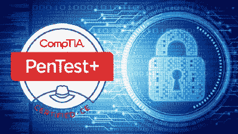
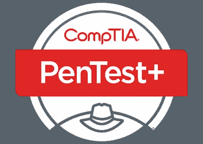

# 2023 年 7 门最佳 CompTIA PenTest+认证课程和实践测试

> 原文：<https://medium.com/javarevisited/7-best-comptia-pentest-certification-courses-and-practice-tests-46d827689cdc?source=collection_archive---------1----------------------->

## 我最喜欢的 2023 年考 CompTIA PenTest+(PT0–001)的资源。这包括来自 Udemy、Pluralsight、认证问题等的在线课程和实践测试

大家好，如果你正在准备 2023 年的 **CompTIA PenTest+考试** **并寻找最好的在线课程和练习测试来提高你的准备水平，那么你来对地方了。**

过去，我曾分享过通过 CompTIA 认证的最佳在线课程，如[**CompTIA A+**](/javarevisited/6-best-comptia-a-220-1001-and-220-1002-online-training-courses-practice-tests-and-dumps-cfc25759b808)[**CompTIA Linux+**](/javarevisited/6-best-comptia-linux-plus-certification-exam-xk0-004-courses-and-practice-tests-in-2021-a244c98eda4d)、 [Cloud+](https://javarevisited.blogspot.com/2020/07/top-5-courses-to-crack-comptia-cloud-certification-exam.html) 和 [Security+](https://javarevisited.blogspot.com/2020/06/top-5-courses-to-crack-comptia-security-certification-exam-sy0-501.html) ，在本文中，我将分享最佳课程、实践测试和考试模拟器，为久负盛名的 **CompTIA Pentest+认证**做准备。

如果你想成为一名专业的钢笔测试员，那么这是你应该瞄准的考试。

[CompTIA PenTest+certification](https://www.comptia.org/certifications/pentest)是一个教你如何发现系统内部的弱点、如何利用它们、执行漏洞扫描和分析数据等等的程序。

鉴于[网络安全](/javarevisited/7-best-cyber-security-courses-for-programmers-and-developers-50afafae050b)和[互联网安全](https://javarevisited.blogspot.com/2020/03/top-5-courses-to-learn-cyber-security.html)的重要性，对笔测试员的需求巨大，如果你想成为笔测试员，那么 **CompTIA PenTest+认证**可以是一个很好的起点。

如果你已经在准备这个认证，并在寻找像在线课程和模拟测试这样的资源，那么你来对地方了。在这篇文章中，我将分享 6 个*最佳在线课程和实践测试*以在第一次尝试中通过这个困难但享有盛誉的 CompTIA 渗透测试 IT 认证。

正式考试包含*85 个问题*多项选择，用于验证您在与[渗透测试](/javarevisited/10-free-courses-to-learn-ethical-hacking-and-penetration-testing-for-beginners-84e40104aa6c)相关的许多主题中的技能和知识，如漏洞扫描和法律合规性要求等，时间为 165 分钟，75%的及格分数(750/1000)，每次考试的费用约为 370 美元。

过去，我也曾分享过学习网络安全的 [**最佳课程**](https://javarevisited.blogspot.com/2020/03/top-5-courses-to-learn-cyber-security.html) ，这是此次认证的一个重要主题，我也建议您查看那篇文章以做好准备。

现在，让我们看看一些课程，这些课程将帮助你学习如何成为一名 pentester，如果你想参加并通过官方考试，成为 CompTIA PenTest+认证，也可以帮助你。

# 2023 年破解 CompTIA Pentest+认证的 7 门最佳课程和实践测试

为了不浪费您的时间，这里列出了通过 2023 年 CompTIA Pentest+认证考试的最佳在线课程和实践测试。这些是你可以在网上获得的准备这个享有盛誉的网络安全认证的最佳材料。

## 1. [CompTIA Pentest+(道德黑客)课程&实践考试](https://click.linksynergy.com/deeplink?id=JVFxdTr9V80&mid=39197&murl=https%3A%2F%2Fwww.udemy.com%2Fcourse%2Fpentestplus%2F)

有时候，你不仅仅需要一门课程来教授你 CompTIA PenTest+认证，你还需要在进入正式考试之前测试你在该主题上的技能和知识，这就是本课程为你提供的。

在本课程中，您将学到:

*   收集信息和漏洞。
*   如何利用这些漏洞。
*   创建关于这些易受攻击系统的报告。

您将首先看到规划和范围界定，然后进入第二阶段，即信息收集阶段，您必须使用现有的许多工具来发现这些安全系统内部的漏洞。

然后，您将进入第三阶段，利用这些弱点并验证这些系统可以被黑客攻击。最后，为组织创建一份关于这些系统存在的安全问题的报告。

**以下是加入本课程** — [CompTIA Pentest+(道德黑客)课程&实践考试](https://click.linksynergy.com/deeplink?id=JVFxdTr9V80&mid=39197&murl=https%3A%2F%2Fwww.udemy.com%2Fcourse%2Fpentestplus%2F)的链接

## 2.总计:道德黑客& CompTIA PenTest+ + 2 免费测试。

udemy 上的另一个大型课程将教你如何成为 CompTIA PenTest+认证，在完成课程后，通过两次免费测试来提高和测试你的技能和知识，并成为一名道德黑客。

你将在本课程中学习到:

*   使用 [kali Linux](/javarevisited/6-best-kali-linux-courses-for-beginners-to-learn-online-da7f7139d8cb) 和 Metasploit。
*   利用系统并创建报告。
*   两次模拟考试来测试你的技能。

在进行 pentest 之前，您会看到一些要求，例如法律合规性，以及您将在这些系统上测试哪些类型的漏洞，然后再了解有关该系统的共享信息，例如其版本和其上安装的软件，然后利用这些信息进行渗透测试，并为您的组织创建一份报告。

**这是加入本课程的链接** — [总计:道德黑客& CompTIA PenTest+](https://click.linksynergy.com/deeplink?id=JVFxdTr9V80&mid=39197&murl=https%3A%2F%2Fwww.udemy.com%2Fcourse%2Fethical-hacking-and-comptia-pentest-exam-prep-pt0-001%2F)

## 3.[CompTIA PenTest+](https://pluralsight.pxf.io/c/1193463/424552/7490?u=https%3A%2F%2Fwww.pluralsight.com%2Fcourses%2Flaying-foundation-penetration-testing)【plural sight】渗透测试

也许你有一些黑客技能，如使用 Metasploit 来攻击 Windows 和 Android 等系统，或者你知道如何使用一些简单的技术来破解密码，但你想成为一名正式的 pentester，但你不知道从哪里开始，那么这个课程就是为你准备的。

您将从一些概念开始，如什么是抗议及其背后的好处，然后转到用于进行漏洞扫描的工具社交工程攻击设置您的环境安装您的虚拟目标以及更多概念。

在本课程中，您将学到:

*   设置您的虚拟环境。
*   黑客攻击中使用的工具。
*   计划你的订婚。

**以下是参加本课程的链接—**[CompTIA PenTest+渗透测试](https://pluralsight.pxf.io/c/1193463/424552/7490?u=https%3A%2F%2Fwww.pluralsight.com%2Fcourses%2Flaying-foundation-penetration-testing)

顺便说一句，你需要一个 [*Pluralsight 会员*](https://pluralsight.pxf.io/c/1193463/424552/7490?u=https%3A%2F%2Fwww.pluralsight.com%2Flearn) 才能加入这个课程，费用大约是每月 29 美元或每年 299 美元(14%的折扣)。如果你没有 Pluralsight 订阅，那么我强烈推荐一个，因为它使学习变得容易。

想学东西不用买课程，一次订阅就能看 7000 多门课程。或者，你也可以使用他们的 [**10 天免费试用**](https://pluralsight.pxf.io/c/1193463/424552/7490?u=https%3A%2F%2Fwww.pluralsight.com%2Flearn) 免费观看这门课程。

<https://pluralsight.pxf.io/c/1193463/424552/7490?u=https%3A%2F%2Fwww.pluralsight.com%2Flearn>  

# 3 次最佳 CompTIA Pentest+认证实践测试

现在我们已经看到了 CompTIA Pentest+认证的最佳在线课程，是时候看看实践测试了。它们是提高速度和准确性的最重要的工具之一，有助于第一次通过考试并获得高分。他们也可以用来找到你的强项和弱项，并在真正的考试前解决它们。

## 4. [CompTIA PenTest+考试(PT0–001)练习题](https://click.linksynergy.com/deeplink?id=JVFxdTr9V80&mid=39197&murl=https%3A%2F%2Fwww.udemy.com%2Fcourse%2Fcomptia-pentest-exam-pt0-001-practice-questions-a%2F)

也许你已经通过许多资源学习了 CompTIA PenTest+认证，如 Udemy 和 YouTube 视频或任何资源，你想在一些实践课程中验证你的技能，那么这是实现这一目标的其中之一。

您将获得两次模拟考试，每次有 85 个问题，将测试您在许多主题上的知识，因此您可以充满信心地通过真正的考试，它旨在为专业人士服务。

您将在本考试课程中学习:

*   参加两次模拟考试。
*   参加大约 170 道题的考试。
*   增强你的知识和技能。

**以下是参加本模拟考试的链接—** [CompTIA PenTest+考试(PT0–001)模拟试题](https://click.linksynergy.com/deeplink?id=JVFxdTr9V80&mid=39197&murl=https%3A%2F%2Fwww.udemy.com%2Fcourse%2Fcomptia-pentest-exam-pt0-001-practice-questions-a%2F)

## 5.[CompTIA PenTest+练习考试:340 道题，PT0–001](https://click.linksynergy.com/deeplink?id=JVFxdTr9V80&mid=39197&murl=https%3A%2F%2Fwww.udemy.com%2Fcourse%2Fpractice-comptia-pentest-exam-340-questions-pt0-001%2F)

最后一个建议是 Udemy 上的一个实践课程，它有大约 340 个问题来测试和提高你的技能，然后再参加正式考试并获得认证。

您将在本课程中学到:

*   回答大约 340 个问题。
*   测试你在许多话题上的知识。
*   增强你的技能。

本考试课程有四个部分，每个部分有 85 个问题，将测试您在计划和挖掘以及信息收集、利用系统和更多主题方面的知识。

**以下是参加本次模拟考试**——[模拟 CompTIA PenTest+考试:340 题，](https://click.linksynergy.com/deeplink?id=JVFxdTr9V80&mid=39197&murl=https%3A%2F%2Fwww.udemy.com%2Fcourse%2Fpractice-comptia-pentest-exam-340-questions-pt0-001%2F)

## 6.[CompTIA PT0–001:CompTIA PenTest+认证考试](https://www.certification-questions.com/practice-exam/comptia/pt0-001?affiliateCode=fcff36fd-557a-4713-abf6-973e9924770f&utm_source=Javin&utm_medium=affiliate&utm_campaign=affiliate)

如果你正在准备 Certification-questions.com CompTIA PenTest+认证，这是另一个很棒的资源，在这个课程中，你会发现 PT0–001 考试转储供你准备。可以用它们来熟悉考试格式，测试自己的备考水平。它受到 15，000 多名开发人员和软件工程师的信任。

以下是您将在本课程中获得的内容:

CompTIA PT0–001 模拟考试:CompTIA PenTest+认证考试

-问题数量:196

-考试测试:4

-最后更新时间:2023 年 2 月 10 日

他们还用社区中新发现的问题来更新考试，以使问题与最近的考试变化保持同步。

**以下是参加本模拟考试**—[CompTIA PT0–001:CompTIA PenTest+认证考试](https://www.certification-questions.com/practice-exam/comptia/pt0-001?affiliateCode=fcff36fd-557a-4713-abf6-973e9924770f&utm_source=Javin&utm_medium=affiliate&utm_campaign=affiliate)的链接

<https://www.certification-questions.com/practice-exam/comptia/pt0-001?affiliateCode=fcff36fd-557a-4713-abf6-973e9924770f&utm_source=Javin&utm_medium=affiliate&utm_campaign=affiliate>  

## 4.[CompTIA PenTest+练习考试:340 道题，PT0–001](https://click.linksynergy.com/deeplink?id=JVFxdTr9V80&mid=39197&murl=https%3A%2F%2Fwww.udemy.com%2Fcourse%2Fpractice-comptia-pentest-exam-340-questions-pt0-001%2F)

这是 CompTIA PenTest+认证考试的新模拟考试，代码为 PTO-001。本模拟测试包含 340 个问题，并附有完整的解释。

以下是您将在本次模拟测试中获得的内容

*   **CompTIA PenTest +考试一**:所有考试领域的 85 个问题(165 分钟)
*   **CompTIA PenTest +考试二**:所有考试领域的 85 个问题(165 分钟)
*   **CompTIA PenTest +考试三**:所有考试领域的 85 个问题(165 分钟)
*   **CompTIA PenTest +考试四:**所有考试领域的 85 个问题(165 分钟)

以下是参加该考试的链接—[CompTIA PenTest+考试练习:340 道题](https://click.linksynergy.com/deeplink?id=JVFxdTr9V80&mid=39197&murl=https%3A%2F%2Fwww.udemy.com%2Fcourse%2Fpractice-comptia-pentest-exam-340-questions-pt0-001%2F)

## 6 个 CompTIA PenTest+考试技巧

下面是一些考试时的小贴士:

1.  您可以随时暂停测试，稍后再继续。

2.你可以想重考几次就重考几次。

3.屏幕顶部的进度条将显示您的进度以及测试剩余的时间。如果时间用完了，不要着急；你仍然可以完成测试。

4.你可以跳过一个问题，在考试结束时再来回答。

5.您也可以使用“标记为审阅”来返回到您在提交测试之前不确定的问题。

6.如果您想完成测试并立即看到结果，请按停止按钮。

以上是关于通过 CompTIA PenTest+认证的**最佳在线课程和实践。**安全性是这个世界上要考虑的最重要的事情之一，每个公司业务都应该尽可能地验证其系统的安全性，他们需要雇用笔测试人员来保持最新的安全性，要成为这些笔测试人员中的一员，你需要一个*专业认证*，这就需要 *CompTIA PenTest+* 发挥作用了。

其他 **CompTIA 认证文章**您可能喜欢:

*   [准备 CompTIA Security+考试的前 5 门课程](https://javarevisited.blogspot.com/2020/06/top-5-courses-to-crack-comptia-security-certification-exam-sy0-501.html)
*   [五大 CompTIA A+认证课程](https://javarevisited.blogspot.com/2020/07/top-5-comptia-a-plus-certification-courses-and-practice-tests.html)
*   CompTIA Linux+认证的前 5 门课程
*   [通过 CompTIA Cloud+认证的前 5 门课程](https://javarevisited.blogspot.com/2020/07/top-5-courses-to-crack-comptia-cloud-certification-exam.html)
*   [五大 CompTIA 网络+认证课程](https://javarevisited.blogspot.com/2020/07/top-5-courses-to-pass-comptia-network-plus-certification-exam.html)
*   [破解 AWS 解决方案架构师专业考试前 5 门课程](https://javarevisited.blogspot.com/2020/04/top-5-course-to-crack-aws-solution-architect-professional-sap-c01-certification-exam.html)
*   [如何成为 Azure 认证管理员助理？](https://javarevisited.blogspot.com/2020/04/how-to-crack-microsoft-az-103-azure-administrator-associate-exam-certification.html)
*   [5 次免费的 AWS 解决方案架构师实践测试](https://javarevisited.blogspot.com/2019/08/top-5-free-aws-solution-architect-Associate-certification-dumps-practice-questions.html)
*   [学习 Docker 和 Kubernetes 的 10 大课程](https://dev.to/javinpaul/top-10-courses-to-learn-docker-and-kubernetes-for-programmers-4lg0)
*   [程序员前 5 名 AZ-900 模拟测试](https://javarevisited.blogspot.com/2020/02/top-5-AZ-900-exam-Azure-Fundamentals-certification-practice-tests-and-mock-exams-to.html)
*   [如何通过 AZ-300 Azure 解决方案架构师考试？](https://javarevisited.blogspot.com/2020/04/how-to-crack-microsoft-azure-solution-architect-exam-az-300.html)
*   [如何破解甲骨文 2023 年 Java 认证？](https://medium.freecodecamp.org/how-to-pass-oracles-java-certifications-a-practical-guide-for-developers-e9b607ba6173)
*   [学习谷歌云平台的前 5 门课程](https://javarevisited.blogspot.com/2019/07/top-5-google-cloud-platform-gcp-courses-certifications-online.html)
*   [深入学习网络安全的五大课程](https://javarevisited.blogspot.com/2020/03/top-5-courses-to-learn-cyber-security.html)
*   [通过谷歌助理云工程师认证的前 5 门课程](https://javarevisited.blogspot.com/2019/07/top-5-google-cloud-platform-gcp-courses-certifications-online.html)
*   [准备 AWS 系统管理员认证的前 5 门课程](https://javarevisited.blogspot.com/2020/06/top-5-aws-certified-sysops-admin-associate-certification-exam.html)
*   [破解 Azure 云架构师(AZ-300)考试的前 5 门课程](https://javarevisited.blogspot.com/2019/07/top-5-courses-to-crack-azure-architecture-technologies-certification-az-300-exam.html#axzz6E6VuRMsx)
*   [2023 年成为 Salesforce 认证开发者的前 5 名课程](https://javarevisited.blogspot.com/2020/06/top-5-salesforce-development-certification-training-courses.html)
*   [如何通过 AZ-300 Azure 解决方案架构师考试？](https://javarevisited.blogspot.com/2020/04/how-to-crack-microsoft-azure-solution-architect-exam-az-300.html)

感谢您阅读本文。如果您喜欢这个 *CompTIA PenTest+认证*在线培训课程，无论是免费的还是付费的，请与您的朋友和同事分享。这确实有所不同，然后你提前分享。我真的很感激。

**P. S. —** 网络安全对于任何 Pen 测试人员来说都是一个重要的话题，也是通过 CompTIA PenTest+认证考试的关键。如果你想深入学习网络安全，我强烈推荐你在 Udemy 上查看内森大厦的 [**完整网络安全课程**](https://click.linksynergy.com/deeplink?id=JVFxdTr9V80&mid=39197&murl=https%3A%2F%2Fwww.udemy.com%2Fcourse%2Fthe-complete-internet-security-privacy-course-volume-1%2F) 。这是在线学习网络安全的绝佳资源。

<https://click.linksynergy.com/deeplink?id=JVFxdTr9V80&mid=39197&murl=https%3A%2F%2Fwww.udemy.com%2Fcourse%2Fthe-complete-internet-security-privacy-course-volume-1%2F> 