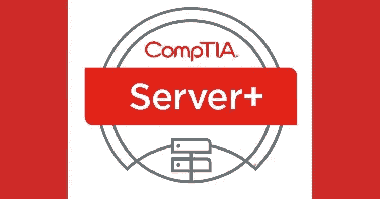
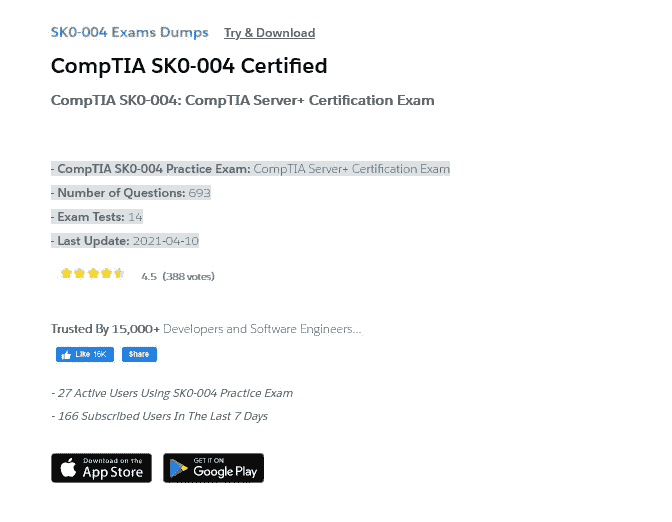

# 2022 年 7 个最佳 CompTIA 服务器+认证资源[课程+实践测试]

> 原文：<https://medium.com/javarevisited/7-best-comptia-server-certification-resources-courses-practice-tests-7e5e07dcda30?source=collection_archive---------0----------------------->

## 收集最佳在线资源，为 CompTIA Server+认证做准备，如 Udemy、Pluralsight 和 LinkedIn Learning 在 2022 年提供的在线课程和模拟测试。

大家好，如果你正在准备 **CompTIA Server+认证**并寻找在线培训课程和实践测试等最佳资源，那么你来对地方了。

*披露——顺便说一句，其中一些链接是附属链接，如果你使用我的链接加入这些课程，我可能会得到报酬。*

过去，我曾分享过通过 CompTIA 认证的最佳在线课程，如 [**CompTIA A+**](/javarevisited/6-best-comptia-a-220-1001-and-220-1002-online-training-courses-practice-tests-and-dumps-cfc25759b808) 、 [**CompTIA Linux+**](/javarevisited/6-best-comptia-linux-plus-certification-exam-xk0-004-courses-and-practice-tests-in-2021-a244c98eda4d) 、[**CompTIA Pentest+**](/javarevisited/7-best-comptia-pentest-certification-courses-and-practice-tests-46d827689cdc)、 [Cloud+](https://javarevisited.blogspot.com/2020/07/top-5-courses-to-crack-comptia-cloud-certification-exam.html) 和 [Security+](https://javarevisited.blogspot.com/2020/06/top-5-courses-to-crack-comptia-security-certification-exam-sy0-501.html) ，在本文中，我将分享最佳课程、练习测试和考试模拟器，为这一著名的考试做准备。

这些在线课程是由专家创建的，成千上万的服务器+认证有志者加入了本课程。如果你也很想在第一次尝试中通过 **CompTIA Server+考试**，你应该检查一下它们，至少注册一门课程和一次模拟测试，做好扎实的准备。

回到认证本身，如果你不知道，[*CompTIA Server+*](https://www.comptia.org/certifications/server)是由 CompTIA 这个大公司提供的一个证书，它的目的是教你如何从管理、维护和故障排除等方面来管理服务器，以便正常工作。

这个证书不像其他证书那样过期，也不像他们那样难，只需要 90 分钟的考试，而大多数人需要两个小时。它的好处是，当你拿到它并通过考试时，它会自动为你更新你的 [CompTIA A+](https://javarevisited.blogspot.com/2020/07/top-5-comptia-a-plus-certification-courses-and-practice-tests.html) 和 [CompTIA Network+](https://javarevisited.blogspot.com/2020/07/top-5-courses-to-pass-comptia-network-plus-certification-exam.html) 证书。
T5*CompTIA Server+certification*如果你想在这个年薪 6.2 万美元左右的服务器行业工作，有时在其他一些有经验的公司会更高，那么这已经成为一个必不可少的证书。

现在，让我们来看看网上的一些课程，如果你在 IT 或网络行业工作，这些课程肯定会帮助你掌握[**【CompTIA Server+】**](https://javarevisited.blogspot.com/2020/07/top-5-courses-to-pass-compTIA-Server-certifcation-exam.html)并轻松通过考试，还能提高你的技能。

# 2022 年通过 CompTIA Server+认证的 7 门最佳在线课程

为了不浪费您的时间，这里有您可以参加的准备 *CompTIA Server+认证*考试的最佳在线课程和模拟测试。正如我之前所说的，这些是最好的在线课程，由专家培训师创建，受到成千上万开发人员的信任，可以通过 CompTIA Server+认证考试，您应该加入它们以便更好地准备。

## 1.[CompTIA Server+(SK0–004)的服务器管理](https://pluralsight.pxf.io/c/1193463/424552/7490?u=https%3A%2F%2Fwww.pluralsight.com%2Fcourses%2Fserver-administration-for-comptia-server-plus-sk0-004)

如果您对服务器行业有所了解，并且计划参加并通过 CompTIA Server+考试，成为一名服务器管理员，您可以在 Pluralsight 上观看关于服务器管理目标的课程。

你将在本课程中学到以下内容:

*   构建虚拟实验室环境。
*   管理和配置服务器。
*   监控服务器性能。

**以下是参加本课程的链接**—[CompTIA Server+(SK0–004)的服务器管理](https://pluralsight.pxf.io/c/1193463/424552/7490?u=https%3A%2F%2Fwww.pluralsight.com%2Fcourses%2Fserver-administration-for-comptia-server-plus-sk0-004)

顺便说一句，你需要一个 [Pluralsight 会员](https://pluralsight.pxf.io/c/1193463/424552/7490?u=https%3A%2F%2Fwww.pluralsight.com%2Flearn)来访问这个课程和以前的课程，费用大约为每月 29 美元或每年 299 美元，但也提供超过 7000 个在线培训课程，以学习最新的技术和通过认证。或者，你也可以使用他们的 [**10 天免费试用**](https://pluralsight.pxf.io/c/1193463/424552/7490?u=https%3A%2F%2Fwww.pluralsight.com%2Flearn) 来观看这个课程。

<https://pluralsight.pxf.io/c/1193463/424552/7490?u=https%3A%2F%2Fwww.pluralsight.com%2Flearn>  

## 2. [CompTIA 服务器+考试 SK0–004—练习【607 题】](https://click.linksynergy.com/deeplink?id=JVFxdTr9V80&mid=39197&murl=https%3A%2F%2Fwww.udemy.com%2Fcourse%2Fcomptia-server-exam-sk0-004-practice-qa-real-stuff%2F)

假设您已经从 [Pluralsight](https://pluralsight.pxf.io/c/1193463/424552/7490?u=https%3A%2F%2Fwww.pluralsight.com%2Flearn) 、 [LinkedIn Learning](http://linkedin-learning.pxf.io/c/1193463/449670/8005?u=https%3A%2F%2Fwww.linkedin.com%2Flearning%2Fsubscription%2Fproducts) 、Youtube 和许多其他学习网站学习了许多关于 CompTIA Server+认证的课程，并且您想要通过实践考试来测试您的知识，那么可以在 udemy 上随意查看该考试课程。

以下是您将在本考试课程中获得的内容:

*   在 CompTIA Server+考试中测试您的知识。
*   考 607 题类似于正式考试。
*   在许多话题上测试你的技能。

**这里是加入这个 CompTIA 服务器+测试**——[CompTIA 服务器+模拟测试](https://click.linksynergy.com/deeplink?id=JVFxdTr9V80&mid=39197&murl=https%3A%2F%2Fwww.udemy.com%2Fcourse%2Fcomptia-server-exam-sk0-004-practice-qa-real-stuff%2F)的链接

## 3.[CompTIA Server+(SK0–004)Cert Prep:2 服务器架构](http://linkedin-learning.pxf.io/c/1193463/449670/8005?u=https%3A%2F%2Fwww.linkedin.com%2Flearning%2Fcomptia-server-plus-sk0-004-cert-prep-2-server-architecture-2)

如果您对 IT 行业有所了解，对网络和 DNS 有所了解，并且希望通过 CompTIA Server+考试，那么本课程将教您服务器架构。

首先介绍有关服务器、机房和机架单元的概念，然后转到实际课程，例如安装、配置、维护服务器、网络存储固件、电源技术、机房冷却等，您将在本课程中了解更多内容。

您将在本课程中学到以下内容:

*   关于服务器的概念。
*   安装和配置服务器。
*   服务器的架构。

**以下是参加本课程的链接—**[CompTIA 服务器的服务器架构+](http://linkedin-learning.pxf.io/c/1193463/449670/8005?u=https%3A%2F%2Fwww.linkedin.com%2Flearning%2Fcomptia-server-plus-sk0-004-cert-prep-2-server-architecture-2)

顺便说一句，你需要 LinkedIn Learning 会员才能观看这门课程，每月费用约为 29.99 美元，但你也可以通过参加他们的 [**1 个月免费试用**](http://linkedin-learning.pxf.io/c/1193463/449670/8005?u=https%3A%2F%2Fwww.linkedin.com%2Flearning%2Fsubscription%2Fproducts) 来免费观看这门课程，这是探索他们 16000 多门最新技术在线课程的好方法。

  

## 4.[CompTIA Server+(SK0–004)认证考试模拟测试](https://click.linksynergy.com/deeplink?id=JVFxdTr9V80&mid=39197&murl=https%3A%2F%2Fwww.udemy.com%2Fcourse%2Fcomptia-server-sk0-004-certification-exam-practice-test%2F)

完成模拟考试后，Udemy 上的另一个测试将通过多个问题测试您在 CompTIA Server+认证方面的知识和经验。

本考试课程有 150 个问题，将测试您在服务器存储故障排除、硬件网络监控工具、软件安装和升级等方面的知识。

您将在本考试课程中学习:

*   增强你的知识。
*   在许多话题上测试你的技能。
*   获得 150 个左右的问题。

以下是参加该测试的链接—[CompTIA Server+(SK0–004)认证测试问题](https://click.linksynergy.com/deeplink?id=JVFxdTr9V80&mid=39197&murl=https%3A%2F%2Fwww.udemy.com%2Fcourse%2Fcomptia-server-sk0-004-certification-exam-practice-test%2F)

## 5.[CompTIA SK0–004:CompTIA 服务器+认证考试转储](https://www.certification-questions.com/practice-exam/comptia/sk0-004?affiliateCode=fcff36fd-557a-4713-abf6-973e9924770f&utm_source=Javin&utm_medium=affiliate&utm_campaign=affiliate)

这是另一个为 CompTIA Server+认证做准备的极好资源，考试代码为 SK0–004，来自 Certification-questions.com，作者是 David Mayer。这些是考试中的真题，是由许多过去参加过考试的人提供的。

以下是您将在本次考试中获得的内容:

-CompTIA SK0–004 模拟考试:CompTIA 服务器+认证考试

-问题数量:693

-考试测试:14

*   最后更新时间:2022 年 4 月 10 日

**这里是获得本模拟测试** — [CompTIA 服务器+认证考试转储](https://www.certification-questions.com/practice-exam/comptia/sk0-004?affiliateCode=fcff36fd-557a-4713-abf6-973e9924770f&utm_source=Javin&utm_medium=affiliate&utm_campaign=affiliate)的链接

他们还有一个 [**免费的 CompTIA 服务器+测试**](https://www.certification-questions.com/comptia-dumps/sk0-004.html?affiliateCode=fcff36fd-557a-4713-abf6-973e9924770f&utm_source=Javin&utm_medium=affiliate&utm_campaign=affiliate) ，你可以用 10 个以上的问题进行测试。

## 6. [CompTIA Server+认证考试—模拟考试](https://click.linksynergy.com/deeplink?id=JVFxdTr9V80&mid=39197&murl=https%3A%2F%2Fwww.udemy.com%2Fcourse%2Fcomptia-server-certification%2F)【605 题】

以 Udemy 上最大的实践考试课程结束本文，该课程有大约 605 个问题来测试您在 CompTIA Server+考试方面的知识。

您会收到类似于官方问题的问题，例如虚拟化存储在服务器上安装和配置系统、安全问题和故障排除。

您将在本考试课程中学习:

*   回答 605 个问题。
*   了解更多关于 CompTIA Server+认证的信息。
*   准备正式考试。

**以下是参加本课程的链接—** 。 [CompTIA 服务器+认证考试—模拟考试](https://click.linksynergy.com/deeplink?id=JVFxdTr9V80&mid=39197&murl=https%3A%2F%2Fwww.udemy.com%2Fcourse%2Fcomptia-server-certification%2F)

以上是 2022 年的**最佳 CompTIA Server+课程和实践测试。如果您正在准备 CompTIA Server+认证，那么我强烈建议您至少通过一门课程和一次模拟测试，以便在第一次尝试中通过这个著名的考试，并节省您的领带和金钱。**

服务器或超级计算机是我们今天生活的核心，因为我们每天使用的网站和脸书等平台都托管在一直运行的服务器上，所以我们可以使用这些服务，管理它们需要专业人员来做，这就是 CompTIA Server+认证。

您可能喜欢的其他 **IT 认证资源**

*   [准备 CompTIA Security+考试的前 5 门课程](https://javarevisited.blogspot.com/2020/06/top-5-courses-to-crack-comptia-security-certification-exam-sy0-501.html)
*   [排名前五的 CompTIA A+认证课程](https://javarevisited.blogspot.com/2020/07/top-5-comptia-a-plus-certification-courses-and-practice-tests.html)
*   [如何成为 Azure 认证管理员助理？](https://javarevisited.blogspot.com/2020/04/how-to-crack-microsoft-az-103-azure-administrator-associate-exam-certification.html)
*   [通过 CompTIA Cloud+认证的前 5 门课程](https://javarevisited.blogspot.com/2020/07/top-5-courses-to-crack-comptia-cloud-certification-exam.html)
*   [如何破解 Azure Fundamentals (AZ-900)认证](https://javarevisited.blogspot.com/2020/04/how-to-crack-microsoft-azure-fundamentals-certification-az-900-exam.html)
*   [通过 Salesforce 管理员认证的前 5 门课程](https://javarevisited.blogspot.com/2020/06/top-5-courses-to-crack-salesforce-administrator-certification.html)
*   [学习 Docker 和 Kubernetes 的十大课程](https://dev.to/javinpaul/top-10-courses-to-learn-docker-and-kubernetes-for-programmers-4lg0)
*   [破解 Azure 云架构师(AZ-300)考试的前 5 门课程](https://javarevisited.blogspot.com/2019/07/top-5-courses-to-crack-azure-architecture-technologies-certification-az-300-exam.html#axzz6E6VuRMsx)
*   [成为 Salesforce 认证开发人员的前 5 门课程](https://javarevisited.blogspot.com/2020/06/top-5-salesforce-development-certification-training-courses.html)
*   [如何通过 AZ-300 Azure 解决方案架构师考试？](https://javarevisited.blogspot.com/2020/04/how-to-crack-microsoft-azure-solution-architect-exam-az-300.html)
*   [程序员前 5 名 AZ-900 模拟测试](https://javarevisited.blogspot.com/2020/02/top-5-AZ-900-exam-Azure-Fundamentals-certification-practice-tests-and-mock-exams-to.html)
*   [破解 Salesforce App Builder 认证的 5 门课程](https://javarevisited.blogspot.com/2020/06/top-5-courses-to-crack-salesforce-platform-app-builder-certification-exam.html)
*   [学习 Docker 和 Kubernetes 的十大课程](https://dev.to/javinpaul/top-10-courses-to-learn-docker-and-kubernetes-for-programmers-4lg0)
*   [破解 AWS DevOps 工程师考试的前 5 门课程](https://javarevisited.blogspot.com/2020/04/top-5-course-to-crack-aws-certified-devops-engineer-professional-exam-certification.html)
*   [如何破解甲骨文 2022 年 Java 认证？](https://medium.freecodecamp.org/how-to-pass-oracles-java-certifications-a-practical-guide-for-developers-e9b607ba6173)
*   [5 次免费的 AWS 解决方案架构师实践测试](https://javarevisited.blogspot.com/2019/08/top-5-free-aws-solution-architect-Associate-certification-dumps-practice-questions.html)
*   [通过谷歌助理云工程师认证的前 5 门课程](https://javarevisited.blogspot.com/2019/07/top-5-google-cloud-platform-gcp-courses-certifications-online.html)
*   [准备 AWS 系统运营管理员认证的前 5 门课程](https://javarevisited.blogspot.com/2020/06/top-5-aws-certified-sysops-admin-associate-certification-exam.html)
*   [通过 CompTIA 网络+认证的前 5 门课程](https://javarevisited.blogspot.com/2020/07/top-5-courses-to-pass-comptia-network-plus-certification-exam.html)
*   [破解 AWS 解决方案架构师专业考试的前 5 门课程](https://javarevisited.blogspot.com/2020/04/top-5-course-to-crack-aws-solution-architect-professional-sap-c01-certification-exam.html)

感谢您阅读本文。如果您发现这些在线课程和练习测试对您的 *CompTIA Server+认证考试*有所帮助，请与您的朋友和同事分享。

**P. S.** —如果你是服务器管理新手，正在寻找一门免费的课程来学习服务器部署和管理，那么你也可以在 Udemy 上查看由 Glady Self 开设的 [**Linux 基础知识和创建服务器**](http://bit.ly/2ENywtF) 课程。这是一个免费的课程，你只需要一个 Udemy 帐户就可以参加。

<http://bit.ly/2ENywtF> 