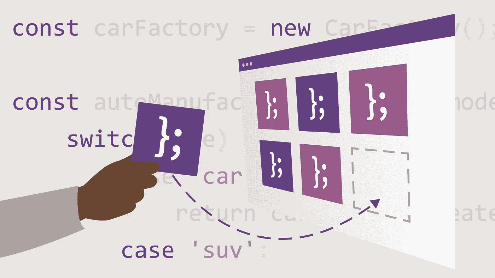

# 2023 年学习 JavaScript 设计模式的 7 个最佳课程和书籍

> 原文：<https://medium.com/javarevisited/7-best-courses-and-books-to-learn-design-patterns-in-javascript-5b0b30fa5c3?source=collection_archive---------0----------------------->

## 我最喜欢的学习使用 Udemy、Pluralsight 和 Coursera 的 JavaScript 编程语言学习设计模式的在线课程和书籍。

image_credit —教育性

该死的 JavaScript 开发人员，如果你想学习设计模式来进一步提高你的编码和开发技能，并寻找最好的 JavaScript 设计模式资源，如书籍和在线课程，那么你来对地方了。

早些时候，我已经分享了 [**最佳 JavaScript 在线课程**](/javarevisited/10-best-online-courses-to-learn-javascript-in-2020-af5ed0801645) ，今天，我将分享 Udemy、Pluralsight、Udacity、Educative 和 LinkedIn Learning 等网站上学习 JavaScript 设计模式的最佳课程。这些都是非常棒的在线课程，你可以加入学习这种有用的技能，成为一名更好的 JavaScript 开发人员。

软件开发就是解决问题，不管你是初学者还是有经验的开发人员，问题总是会出现。当代码中出现几个问题时，您可能会发现其中的一些相似之处，当将尝试解决这些问题时，您可能会注意到一些常见的模式。这就是术语**“设计模式”**的由来。

因此，当软件工程中遇到一个常见的问题时，通用的可重用解决方案称为设计模式。

随着 [Node.js](/javarevisited/top-10-online-courses-to-learn-node-js-in-depth-8ef0e31ca139) 的出现，JavaScript 已经成为 web 开发社区中最突出的编程语言。它既用于客户端，也用于服务器端。所以 JavaScript 中的设计模式对于一个有经验的开发人员来说是最重要的技能之一。

编写糟糕的代码很容易，但编写干净的代码**并不容易，但你不需要担心，有了对设计模式的理解，你就可以编写更好的、可维护的代码。**

**在本文中，我分享了学习 JavaScript 设计模式的最佳在线课程和书籍。**

**顺便说一下，如果你完全是 JavaScript 初学者，那么我强烈建议你首先通过一个全面的 JavaScript 课程来学习现代语法和功能，如箭头函数，这使得编码更加简洁明了。如果需要资源，我建议查看 [**完整的 JavaScript 课程 2023:构建真实项目！**](https://click.linksynergy.com/deeplink?id=JVFxdTr9V80&mid=39197&murl=https%3A%2F%2Fwww.udemy.com%2Fcourse%2Fthe-complete-javascript-course%2F) 课程由乔纳斯在 Udemy 上策划。**

** [## 学习现代 Javascript(构建和测试应用)-完整课程

### 2020 年 10 月完全从零开始重建(65 小时视频)***“真的真的制作精良的球场。超级深入…

udemy.com](https://click.linksynergy.com/deeplink?id=JVFxdTr9V80&mid=39197&murl=https%3A%2F%2Fwww.udemy.com%2Fcourse%2Fthe-complete-javascript-course%2F) 

# 2023 年 Web 开发人员的 7 本最佳 JavaScript 设计模式书籍和课程

在不浪费你更多时间的情况下，这里列出了学习 JavaScript 设计模式的最佳在线课程。这些课程是由专家创建的，受到成千上万已经加入这个课程来学习模式和改进编码的开发人员的信任。你也可以这样做。它们也非常划算，尤其是在促销期间只需 10 美元就能买到的 [Udemy 课程](https://click.linksynergy.com/deeplink?id=CuIbQrBnhiw&mid=39197&murl=https%3A%2F%2Fwww.udemy.com%2F)。

## 1.JavaScript 中的设计模式

对于想要学习 JavaScript 设计模式的现代实现的 JavaScript 开发人员来说，这是 udemy 最好的课程之一。这门课程有 25 个部分和 103 个讲座，包含 10 多个小时的视频。

讲师 [Dmitri Nestruck](https://click.linksynergy.com/deeplink?id=CuIbQrBnhiw&mid=39197&murl=https%3A%2F%2Fwww.udemy.com%2Fcourse%2Fdesign-patterns-javascript%2F) 深入讲解每个主要主题的概念。本课程涉及的一些主题是可靠的设计原则、构建器、工厂、原型、单例、适配器、桥、装饰器、轻量级、代理、迭代器、观察者、状态、策略、模板方法等等。

要求
1。对 JavaScript 的理解
2。了解面向对象编程
3。了解 JavaScript 的最新特性

本课程的主要重点是识别和应用设计模式。讲师还解释了如何折射现有的设计来使用设计模式。它是一门中级课程。如果你只能参加一门课程，我建议你参加这门课程。

**这是加入这个令人敬畏的课程**——[JavaScript 设计模式](https://click.linksynergy.com/deeplink?id=JVFxdTr9V80&mid=39197&murl=https%3A%2F%2Fwww.udemy.com%2Fcourse%2Fdesign-patterns-javascript%2F)的链接

**

## **2. [JavaScript 设计模式:专家代码的 20 种模式](https://click.linksynergy.com/deeplink?id=JVFxdTr9V80&mid=39197&murl=https%3A%2F%2Fwww.udemy.com%2Fcourse%2Fjavascript-design-patterns-20-patterns-for-expert-code%2F)【Udemy】**

**这是 udemy 的另一门高级 JavaScript 课程。它是为那些想要深入研究设计模式的人设计的。讲师主要讲述如何在现实生活中编写出色的代码。**

**要求
1。对 JavaScript
2 有很强的理解。JavaScript 经验
3。理解面向对象编程**

**由于这是一门高级课程，讲师涵盖了模块化和压缩代码、优化内存和协商设计问题等概念。**

**本课程中的其他重要主题是在应用程序设计中实现抽象，控制多个对象，以及通过使用结构化设计模式来共享 API。**

****这是加入本课程** — [JavaScript 设计模式:专家代码的 20 种模式](https://click.linksynergy.com/deeplink?id=JVFxdTr9V80&mid=39197&murl=https%3A%2F%2Fwww.udemy.com%2Fcourse%2Fjavascript-design-patterns-20-patterns-for-expert-code%2F)的链接**

****

## **3.[编码面试的 JavaScript 设计模式](https://www.educative.io/courses/javascript-design-patterns-for-coding-interviews?affiliate_id=5073518643380224)【教育性】**

**对于有经验的开发人员来说，这是学习 JavaScript 设计模式的最佳互动课程之一。本课程由 Educative 提供，这是一个新的基于文本的交互式学习平台。**

**在这个 JavaScript 设计模式课程中，您将学习如何有效地部署设计模式来回答面试问题。**

**本课程分为四个部分:创建模式、结构模式、行为模式和架构模式。每个部分都有自己的一套[设计模式](/javarevisited/7-best-online-courses-to-learn-object-oriented-design-pattern-in-java-749b6399af59)，你将在各种挑战中学会使用它们。每个挑战都包含详细的解决方案解释。**

**当你完成这门课程时，你将能够自信地使用设计模式来解决 JavaScript 中的高级编码面试问题，并写出经得起时间考验的 JavaScript 代码。**

****这里是加入本课程的链接**——[编码面试的 JavaScript 设计模式](https://www.educative.io/courses/javascript-design-patterns-for-coding-interviews?affiliate_id=5073518643380224)**

****

**而且，如果你发现教育平台和他们的搜索课程，像[搜索系统设计面试](https://www.educative.io/collection/5668639101419520/5649050225344512?affiliate_id=5073518643380224)，搜索面向对象编程面试，然后考虑获得 [**教育订阅**](https://www.educative.io/subscription?affiliate_id=5073518643380224) ，提供每月 14.99 美元的 250 多门课程。非常划算，非常适合准备编码面试。**

** [## 教育无限:保持领先

### 我们听到了您的反馈。你现在只需支付一次费用，就可以获得 Educative 上的所有课程。

www.educative.io](https://www.educative.io/subscription?affiliate_id=5073518643380224)** 

## **4.[JavaScript 中的实用设计模式](https://pluralsight.pxf.io/c/1193463/424552/7490?u=https%3A%2F%2Fwww.pluralsight.com%2Fjavascript-practical-design-patterns)【plural sight】**

**这是在 Pluralsight 学习设计模式的最佳课程。本课程将帮助你理解在 JavaScript 中使用设计模式以整洁的方式编写代码的技巧。它是一门中级课程。教师增加了一个特殊的章节，解释 JavaScript 中设计模式的含义。其他章节涵盖了 Javascript 中的[面向对象编程](/javarevisited/my-favorite-courses-to-learn-object-oriented-programming-and-design-in-2019-197bab351733?source=extreme_sidebar---------0-2----------------------)，创造和结构设计模式，以及行为设计模式。**

**要求
1。对 JavaScript 的理解。
2。JavaScript 方面的经验。**

****这里是加入本课程的链接**—[JavaScript 实用设计模式](https://pluralsight.pxf.io/c/1193463/424552/7490?u=https%3A%2F%2Fwww.pluralsight.com%2Fjavascript-practical-design-patterns)**

****

**顺便说一下，你需要一个 Pluralsight 会员才能参加这个课程，费用大约是每月 29 美元或每年 299 美元(14%的折扣)。我向所有程序员强烈推荐这个订阅，因为它提供了超过 7000 个在线课程的即时访问，以学习任何技术技能。或者，你也可以使用他们的 [**10 天免费通行证**](https://pluralsight.pxf.io/c/1193463/424552/7490?u=https%3A%2F%2Fwww.pluralsight.com%2Flearn) 免费观看这个课程。**

** [## 对个人来说

### Pluralsight 的使命一直是公平的技术竞争环境。不管你想学什么，或者…

pluralsight.pxf.io](https://pluralsight.pxf.io/c/1193463/424552/7490?u=https%3A%2F%2Fwww.pluralsight.com%2Flearn)** 

## **5. [JavaScript 设计模式](https://imp.i115008.net/c/1193463/786224/11298?u=https%3A%2F%2Fwww.udacity.com%2Fcourse%2Fjavascript-design-patterns--ud989)【uda city】**

**这是 Udacity 的高级课程，免费。本课程旨在让你了解如何在 [JavaScript](/javarevisited/10-best-online-courses-to-learn-javascript-in-2020-af5ed0801645) 中组织代码。它分为五节课和一个期末专题。**

**因为这是一门高级课程，所以课程要求对现代 JavaScript 有适当的知识和理解。**

**要求
1。对 [JavaScript](/javarevisited/my-favorite-free-tutorials-and-courses-to-learn-javascript-8f4d0a71faf2) 的理解。
2。理解高级 JavaScript 概念。**

****这里是免费加入本课程的链接** — [JavaScript 设计模式](https://imp.i115008.net/c/1193463/786224/11298?u=https%3A%2F%2Fwww.udacity.com%2Fcourse%2Fjavascript-design-patterns--ud989)**

****

## **6.[学习 JavaScript 设计模式](https://www.amazon.com/Learning-JavaScript-Design-Patterns-Developers/dp/1449331815?tag=javamysqlanta-20)【书】**

**如果你喜欢书胜过在线课程，或者只是喜欢看书，那么这是一本学习 JavaScript 设计模式的好书。由 Addy Osmani 创作，这本书将教你如何应用经典和现代设计模式编写可维护的 JavaScript 代码。**

**以下是您将在本课程中学到的内容:**

1.  **理解什么是设计模式，它解决什么问题？**
2.  **理解不同类别的模式，如创造模式、行为模式和结构模式**
3.  **20 多种经典 OOP 模式的实现和演练**
4.  **发现在 jQuery 等流行 JavaScript 库中实现的设计模式**
5.  **学习编写模块化代码。**

**总的来说，这是一门很棒的实用课程，包含了编写模块化、更简洁、可维护和高效的 JavaScript 代码的最佳实践。强烈推荐这本书给体验 JavaScript 开发者。**

****这里是了解这本书更多信息的链接**——[学习 JavaScript 设计模式](https://www.amazon.com/Learning-JavaScript-Design-Patterns-Developers/dp/1449331815?tag=javamysqlanta-20)**

****

**如果你需要这本书的更多选项，那么雅虎出版社的[**JavaScript Patterns**](https://www.amazon.com/JavaScript-Patterns-Better-Applications-Coding-ebook/dp/B0046RERXE?tag=javamysqlanta-20)也是一本学习 JavaScript 设计模式的好书。**

## **7. [JavaScript 设计模式【LinkedIn Learning](http://linkedin-learning.pxf.io/c/1193463/449670/8005?u=https%3A%2F%2Fwww.linkedin.com%2Flearning%2Fjavascript-patterns-2)**

**这是 Lynda 或 LinkedIn Learning 的 JavaScript 设计模式的最佳课程。这是一门简短的中级课程，涵盖了所有必要的概念，如创造模式、结构模式和行为模式。**

**要求
1。对 JavaScript 的理解。
2。JavaScript 方面的经验。**

**讲师简要地关注关键概念。如果你没有时间去上一个冗长、详细的课程，你可以去上这个课程，因为它不到两个小时。**

****这里是加入本课程** — [JavaScript 设计模式](http://linkedin-learning.pxf.io/c/1193463/449670/8005?u=https%3A%2F%2Fwww.linkedin.com%2Flearning%2Fjavascript-patterns-2)的链接**

****

**顺便说一句，你需要 LinkedIn Learning 会员才能观看这门课程，每月费用约为 29.99 美元，但你也可以通过参加他们的 [**30 天免费试用**](http://linkedin-learning.pxf.io/c/1193463/449670/8005?u=https%3A%2F%2Fwww.linkedin.com%2Flearning%2Fsubscription%2Fproducts) 来免费观看这门课程，这是探索他们 16000 多门最新技术在线课程的好方法。**

 **[## LinkedIn Learning 免费试用和订阅价格

### 从初级到高级的 17，000 多门专家指导课程的个性化、高质量内容。基于社区的…

linkedin-learning.pxf.io](http://linkedin-learning.pxf.io/c/1193463/449670/8005?u=https%3A%2F%2Fwww.linkedin.com%2Flearning%2Fsubscription%2Fproducts)** 

**以上是学习 JavaScript 设计模式的最佳在线课程。这些课程将教你如何编写好的面向对象的代码来解决现实世界中的问题，因为你将使用季节性开发人员提供的久经考验的解决方案。

以一种有组织的、恰当的方式写出好的代码和掌握编程概念一样重要。同样，编程时面临的问题也要妥善解决。**

**程序员通常会忽略这样重要的方面。在本文中，我们列出了前五门课程，它们将帮助你理解 JavaScript 中的[设计模式。文章中已经提到了设计模式对于编写好代码和解决错误的重要性。所以你可以浏览这些课程，并做出相应的选择。但是请记住，这些课程需要对 JavaScript 有适当的理解。](https://www.java67.com/2020/11/top-5-course-to-learn-design-patterns-javascript.html)**

**您可能想探索的其他 **JavaScript 和 Web 开发课程****

*   **[前端和后端开发者路线图](https://javarevisited.blogspot.com/2019/02/the-2019-web-developer-roadmap.html)**
*   **成为全栈 Web 开发人员的 10 门课程**
*   **[2023 年学习打字稿的 10 门免费课程](/javarevisited/top-10-free-typescript-courses-to-learn-online-best-of-lot-44bce9da41d1)**
*   **[我最喜欢的初学者学习棱角分明的课程](/javarevisited/10-courses-to-learn-angular-for-web-development-6da1bd2856dc)**
*   **[全栈开发者路线图](/javarevisited/the-2019-web-developer-roadmap-ab89ac3c380e)**
*   **[2023 年学习 JavaScript 的 13 门免费课程](/javarevisited/12-free-courses-to-learn-javascript-and-es6-for-beginners-and-experienced-developers-aa35874c9a32)**
*   **[完整的 React JS 开发者路线图](https://javarevisited.blogspot.com/2018/10/the-2018-react-developer-roadmap.html#axzz5dPh5g7tg)**
*   **[2023 年学习 MERN 堆栈的 5 门最佳课程](https://www.java67.com/2020/06/top-5-courses-to-learn-mern-stack-for-web-development.html)**
*   **[2023 年学习 MEAN Stack 的前 5 门课程](/javarevisited/5-best-courses-to-learn-mean-stack-for-beginners-and-experienced-developers-31162f8e3c03?source=extreme_sidebar---------0-2----------------------)**
*   **【Fullstack 开发者应该学习的 10 个框架**
*   **[初学者学习 Node.js 的 5 门免费课程](/javarevisited/7-free-courses-to-learn-node-js-in-2020-2f1dd6722b49)**
*   **[网页设计师的 6 门最佳 HTML 5 和 CSS 3 课程](https://www.java67.com/2020/08/5-best-online-courses-to-learn-html-5.html)**

**感谢您阅读本文。如果你喜欢这些*最好的 JavaScript 设计模式在线课程*，那么请分享给你的朋友和同事。如果您有任何问题或反馈，请发表评论。

**附言——**如果您是 JavaScript 新手，并且正在寻找免费的 JavaScript 课程，那么您也可以从 Udemy 查看这个 [**免费的 JavaScript 基础课程**](http://bit.ly/2zNH9Tj) 。这是完全免费的，你只需要一个 Udemy 帐户就可以加入这个课程。**

** [## 免费 JavaScript 教程- Javascript 基础

### 这个讲座很容易理解。我现在完全明白我错过了什么，什么让我困惑。我一直…

bit.ly](http://bit.ly/2zNH9Tj)**