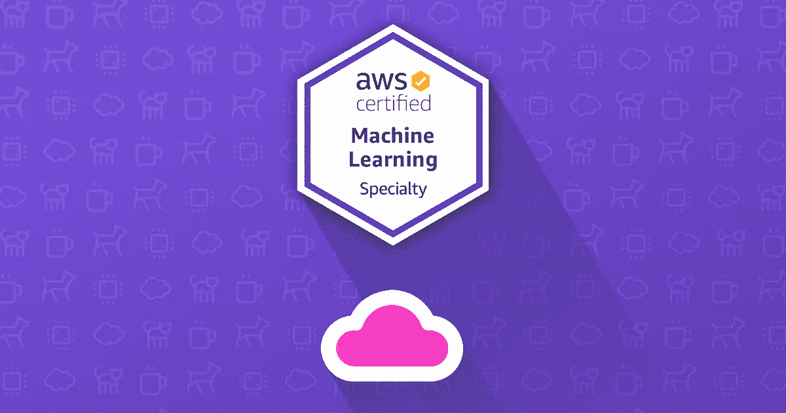
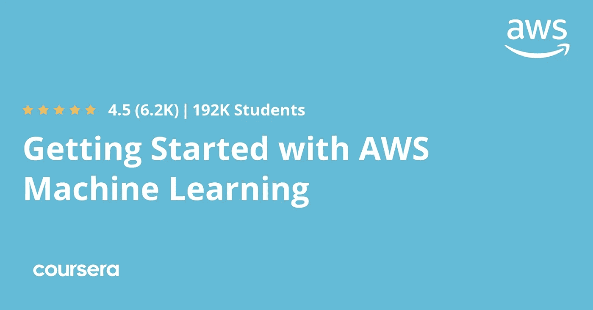
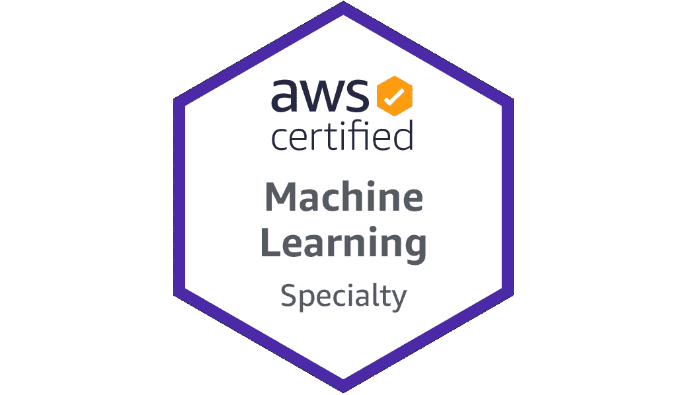
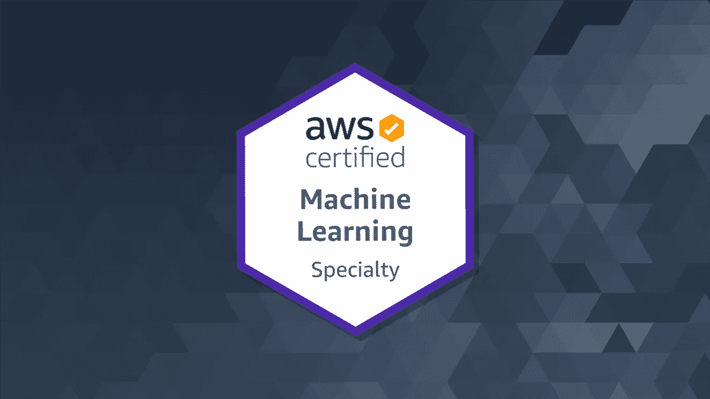
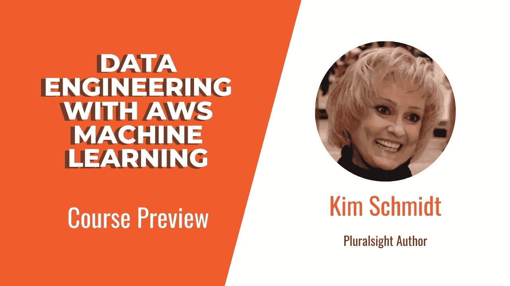

# 2023 年 AWS 认证机器学习专业(MLS-C01)考试的 7 门最佳课程

> 原文：<https://medium.com/javarevisited/7-best-courses-for-aws-certified-machine-learning-specialty-mls-c01-exam-in-2022-466a5240cbae?source=collection_archive---------0----------------------->

## 想知道 AWS 机器学习专业认证从哪里开始？这些是为 2023 年 AWS 机器学习认证做准备的最好的在线课程

大家好，如果你正在准备 2023 年的 AWS 认证机器学习-专业(MLS-C01)考试，并且正在寻找最好的在线课程来开始你的准备，那么你来对地方了。

早些时候，我已经分享了通过 [AWS 云从业者](/javarevisited/10-best-aws-certified-cloud-practitioner-clf-c01-online-courses-and-practice-test-to-crack-ecc0f913091e)、 [AWS 开发人员](/javarevisited/top-5-online-courses-to-become-aws-certified-developer-associate-in-2020-best-of-lot-9b22baf84ca8)、 [AWS 系统操作员](/javarevisited/6-best-aws-sysops-online-courses-for-devops-engineers-to-become-a-certified-aws-sysops-5c2ae9dad31d)和 [AWS 解决方案架构师助理](/javarevisited/top-5-aws-training-courses-to-crack-amazon-web-service-solutions-architect-associate-certification-3f4affa8f660)考试的最佳课程，今天，我将分享通过最难的 AWS 认证之一，也可能是最难的**云认证之一**的最佳课程，是的，你猜对了。我说的是 **AWS 认证机器学习—专业(MLS-C01)考试**认证。

重要的事情先来。AWS 机器学习专业到底是什么？这是一项认证，可帮助组织和企业识别和培养具备实施云计划关键技能的人才。

如果你清除了 [*AWS 认证机器学习专业考试*](https://aws.amazon.com/certification/certified-machine-learning-specialty/) ，就意味着你是在 AWS 上构建、训练、调优、部署机器学习模型的专家。

*AWS 认证机器学习专业考试*面向从事开发或数据科学工作并在 AWS 云中拥有一年以上开发、设计或运行机器学习工作负载经验的个人。

作为该考试的候选人，您应该至少有两年在 AWS 云中开发、设计和运行机器学习工作负载的实践经验。

你应该有能力表达基本机器学习算法背后的直觉。理想情况下，你应该有一些使用机器学习和深度学习框架执行基本超参数优化的经验。您应该能够遵循模型培训、部署和操作最佳实践。

该考试还验证考生完成以下任务的能力:

1.  为给定的业务问题选择并论证适当的 ML 方法
2.  确定适当的 AWS 服务来实施 ML 解决方案
3.  设计和实施可扩展、成本优化、可靠且安全的 ML 解决方案

AWS 认证机器学习-专业(MLS-C01)考试是通过或失败的考试。该考试是根据遵循认证行业最佳实践和指导方针的 AWS 专业人员建立的最低标准进行评分的。

考试由 50 道选择题和多项回答题组成，你有 180 分钟的时间充分尝试考试。您的考试成绩以 100-1，000 分的比例显示。最低及格分数是 750 分。

# AWS 机器学习专业考试的 7 大在线课程

这里我们整理了 AWS 机器学习专业的 5 门最佳课程列表。请继续阅读，了解更多信息。

## 1. [AWS 认证机器学习专业 2023](https://click.linksynergy.com/deeplink?id=JVFxdTr9V80&mid=39197&murl=https%3A%2F%2Fwww.udemy.com%2Fcourse%2Faws-machine-learning%2F) [Udemy]

这是为 2023 年 AWS 机器学习专业认证做准备的最好的在线课程之一。由两位专家 AWS Hero 夏羽·马瑞克和机器学习大数据专家弗兰克·凯恩创建，这门奇妙的课程将为您参加 AWS 认证机器学习专业考试做好充分准备。

您将学习 SageMaker、特征工程、数据工程和建模。

在本课程中，您将学习插补、异常值、宁滨和归一化等特征工程技术。你还将通过 S3、Glue、Kinesis 和 DynamoDB 学习数据工程。你将能够使用 SageMaker 的内置机器学习算法，如 XGBoost、BlazingText 和 Object Detection。

您还将获得高级机器学习服务，如理解、翻译、Polly、转录、Lex 和 Rekognition。

**这里是加入本课程的链接—** [AWS 认证机器学习专业 2023](https://click.linksynergy.com/deeplink?id=JVFxdTr9V80&mid=39197&murl=https%3A%2F%2Fwww.udemy.com%2Fcourse%2Faws-machine-learning%2F)

## 2.[AWS 机器学习入门](https://coursera.pxf.io/c/1193463/1164545/14726?u=https%3A%2F%2Fwww.coursera.org%2Flearn%2Faws-machine-learning)【Coursera】

在本课程中，您将学习如何开始使用 AWS 机器学习。您将了解到一些重要的主题，如 AWS 上的机器学习、AWS 上的计算机视觉和 AWS 上的自然语言处理。

该课程由几个模块组成，深入探讨各种机器学习概念、AWS 服务以及专家将这些概念付诸实践的见解。

您还将学习如何使用亚马逊人工智能服务(如 Amazon understand、Amazon Rekognition 和 Amazon Translate)构建智能应用程序。

**这里是加入本课程的链接**——[AWS 机器学习入门](https://coursera.pxf.io/c/1193463/1164545/14726?u=https%3A%2F%2Fwww.coursera.org%2Flearn%2Faws-machine-learning)

顺便说一句，如果你计划参加多个 Coursera 课程或专业，那么考虑参加 [**Coursera Plus 订阅**](https://coursera.pxf.io/c/3294490/1164545/14726?u=https%3A%2F%2Fwww.coursera.org%2Fcourseraplus) ，它可以让你无限制地访问他们最受欢迎的课程、专业、专业证书和指导项目。它每年花费大约 399 美元，但很值得，因为你可以访问 7000 多门课程和项目，还可以获得无限的证书。

<https://coursera.pxf.io/c/3294490/1164545/14726?u=https%3A%2F%2Fwww.coursera.org%2Fcourseraplus>  

## 3. [AWS 认证机器学习专业(MLS-C01)](https://click.linksynergy.com/deeplink?id=CuIbQrBnhiw&mid=39197&murl=https%3A%2F%2Fwww.udemy.com%2Fcourse%2Faws-machine-learning-a-complete-guide-with-python%2F)【Udemy】

在本课程中，您将获得如何在 AWS 云中培训、优化、部署和集成机器学习的实践经验。本课程是 AWS 认证机器学习专业考试的完整指南。

购买本课程后，您将终身获得超过 17 小时的点播视频讲座、84 篇文章、34 种可下载的教育资源和 1 次模拟测试。

该课程还包括一个高质量的定时练习测试，这对您准备 AWS 认证机器学习专业考试非常重要。

**这里是加入这个 ML 课程的链接**——[AWS 认证机器学习专业(MLS-C01)](https://click.linksynergy.com/deeplink?id=CuIbQrBnhiw&mid=39197&murl=https%3A%2F%2Fwww.udemy.com%2Fcourse%2Faws-machine-learning-a-complete-guide-with-python%2F)

## 4. [AWS 机器学习认证考试:完整指南](https://click.linksynergy.com/deeplink?id=JVFxdTr9V80&mid=39197&murl=https%3A%2F%2Fwww.udemy.com%2Fcourse%2Famazon-web-services-machine-learning%2F)

在本课程中，您将学习如何部署、监控和扩展您的机器学习解决方案，为 AWS 机器学习专业考试做准备。这门课的授课老师是大卫·塔克(David Tucker)，他是一位获奖的云顾问。

您将从探索不同的 AWS 服务开始本课程，这些服务可以支持生产中的机器学习解决方案。您将发现如何使用 Amazon SageMaker 部署和扩展机器学习模型。在课程结束时，您将学习如何使用 AWS 为您的机器学习解决方案实现安全性。

**这里是加入本课程的链接**——[AWS 机器学习认证考试:完全指南](https://click.linksynergy.com/deeplink?id=JVFxdTr9V80&mid=39197&murl=https%3A%2F%2Fwww.udemy.com%2Fcourse%2Famazon-web-services-machine-learning%2F)

## 5.[采用 AWS 机器学习的数据工程](https://pluralsight.pxf.io/c/1193463/424552/7490?u=https%3A%2F%2Fwww.pluralsight.com%2Fcourses%2Fdata-engineering-aws-machine-learning)【plural sight】

在本课程中，您将学习如何以经济高效的方式在各种 AWS 数据存储库、摄取服务和转换服务之间做出正确选择。本课程的讲师是 Kim Schmidt，他是 AWS 的合作伙伴和供应商。

本课程一开始，您将探索 AWS 上各种各样的数据存储解决方案，以及每种存储的用途。您还将发现用于将数据接收到特定于 ML 的服务中的不同 AWS 服务，以及何时使用每种服务。您将通过学习如何将原始数据转换为各种 AWS 服务使用的适当格式来完成本课程。

**以下是加入本课程的链接—** [带 AWS 机器学习的数据工程](https://pluralsight.pxf.io/c/1193463/424552/7490?u=https%3A%2F%2Fwww.pluralsight.com%2Fcourses%2Fdata-engineering-aws-machine-learning)

不过，你需要一个 [Pluralsight 会员](https://pluralsight.pxf.io/c/1193463/424552/7490?u=https%3A%2F%2Fwww.pluralsight.com%2Fpricing%2Fskills)才能加入这个课程，费用约为每月 29 美元或每年 299 美元(14%的折扣)。我向所有程序员强烈推荐这个订阅，因为它提供了超过 7000 个在线课程的即时访问，以学习任何技术技能。或者，你也可以使用他们的 [**10 天免费通行证**](https://pluralsight.pxf.io/c/1193463/424552/7490?u=https%3A%2F%2Fwww.pluralsight.com%2Fpricing%2Ffree-trial) 免费观看本课程。

<https://pluralsight.pxf.io/c/1193463/424552/7490?u=https%3A%2F%2Fwww.pluralsight.com%2Fpricing%2Ffree-trial>  

# AWS 机器学习专业常见问题

以下是关于 AWS 机器学习专业认证考试的重要问题

**1。AWS 机器学习专业是什么？**

这是一项认证，可帮助组织和企业识别和培养具备实施云计划关键技能的人才。如果你通过了 AWS 认证机器学习专业考试，这意味着你是在 AWS 上构建、培训、调优和部署机器学习模型的专家。

**2。可以写 AWS 机器学习专业考试吗？** 你应该有能力表达基本机器学习算法背后的直觉。理想情况下，你应该有一些使用机器学习和深度学习框架执行基本超参数优化的经验。您应该能够遵循模型培训、部署和操作最佳实践。

**3。AWS 机器学习专业考试的形式是怎样的？**

考试由 65 道选择题组成，你有 180 分钟的时间充分尝试考试。

以上就是 2023 年 AWS 机器学习专业考试的 b **est 在线课程。你现在唯一需要做的就是从这个列表中选择一门课程并开始学习。现在轮到你了。那你还在等什么？开始学习。**

如果你喜欢 AWS 机器学习专业的 5 门最佳课程，请随时与你的朋友和家人分享。如果您有任何疑问或问题，您也可以发表评论，我们会立即回复您。

您可能喜欢的其他 **AWS 和云认证文章**:

*   [AWS 认证解决方案架构师专业考试转储](https://www.certification-questions.com/practice-exam/amazon/aws-certified-solutions-architect-professional?affiliateCode=fcff36fd-557a-4713-abf6-973e9924770f&utm_source=Javin&utm_medium=affiliate&utm_campaign=affiliate)
*   [破解 AWS 解决方案架构师认证的 5 大课程](https://javarevisited.blogspot.com/2019/05/top-5-courses-to-crack-aws-solutions-architect-associate-certification-exam-SAA-C01.html#axzz5rHwAwycj)
*   [通过谷歌助理云工程师认证的前 5 门课程](https://javarevisited.blogspot.com/2019/07/top-5-google-cloud-platform-gcp-courses-certifications-online.html)
*   [如何成为 DevOps 工程师？](https://javarevisited.blogspot.com/2018/09/the-2018-devops-roadmap-your-guide-to-become-DevOps-Engineer.html)
*   [如何破解 Azure 管理员助理认证](https://javarevisited.blogspot.com/2020/04/how-to-crack-microsoft-az-103-azure-administrator-associate-exam-certification.html)
*   [如何破解 Azure Fundamentals (AZ-900)认证](https://javarevisited.blogspot.com/2020/04/how-to-crack-microsoft-azure-fundamentals-certification-az-900-exam.html)
*   [AWS 解决方案架构师专业考试官方指南](https://aws.amazon.com/certification/certified-solutions-architect-professional/)
*   [程序员前 5 名 AZ-900 模拟测试](https://javarevisited.blogspot.com/2020/02/top-5-AZ-900-exam-Azure-Fundamentals-certification-practice-tests-and-mock-exams-to.html)
*   [10 门数据科学和机器学习认证课程](https://dev.to/javinpaul/10-data-science-and-machine-learning-courses-for-programmers-looking-to-switch-career-57kd)
*   [破解 Azure 云架构师(AZ-300)考试的前 5 门课程](https://javarevisited.blogspot.com/2019/07/top-5-courses-to-crack-azure-architecture-technologies-certification-az-300-exam.html#axzz6E6VuRMsx)
*   [OCAJP 和 OCPJP 考试 10 道免费样题](http://www.java67.com/2017/05/10-free-java-8-certification-sample-questions-OCAJP8-OCPJP8-Mock-Exams.html)

感谢您阅读本文。如果你发现这些 AWS 机器学习课程，请与你的朋友和同事分享。如果您有任何问题或反馈，请留言。

</javarevisited/top-10-courses-to-learn-amazon-web-services-aws-cloud-in-2020-best-and-free-317f10d7c21d> 