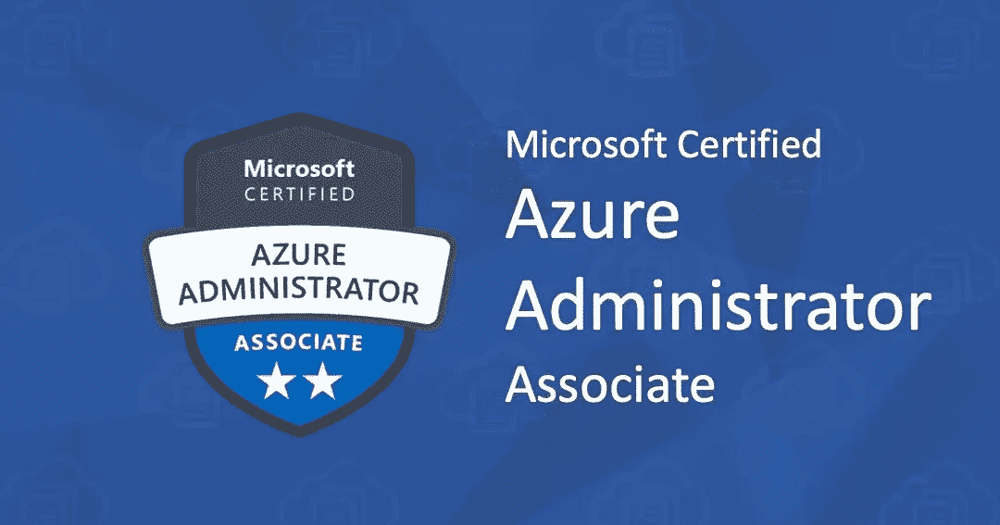
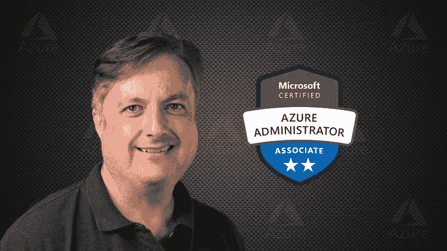
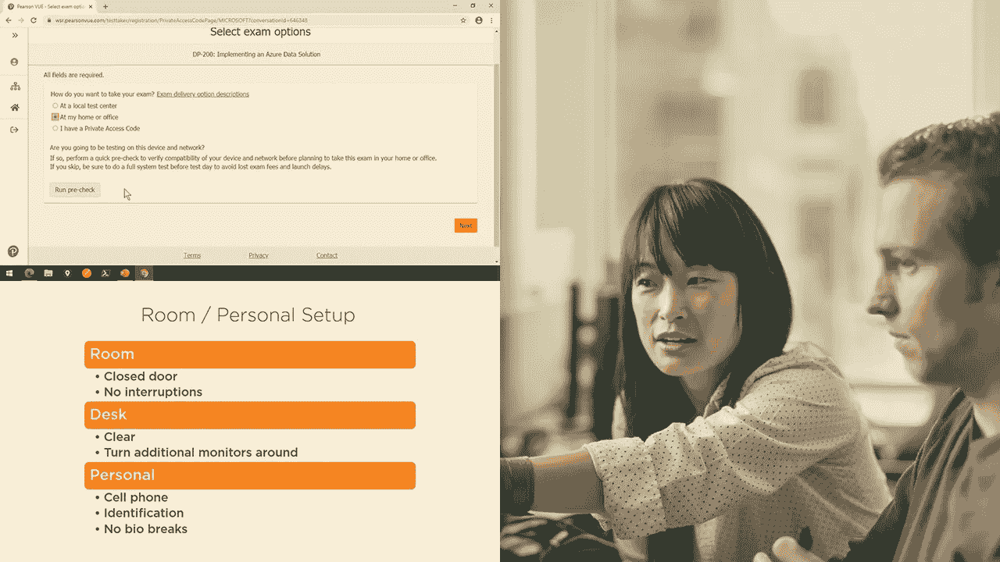
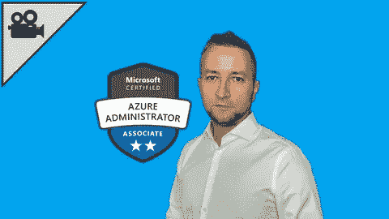

# 2023 年微软 Azure 管理员助理认证考试的 7 门最佳 AZ 104 课程和练习测试

> 原文：<https://medium.com/javarevisited/7-best-courses-for-az-104-microsoft-azure-administrator-associate-certification-exam-in-2021-7b620d61dcd8?source=collection_archive---------0----------------------->

## 这些是 Udemy、Pluralsight、Whizlabs 为初学者提供的 AZ 104 考试或微软 Azure 管理员助理认证的最佳在线课程

image_credit — Udemy

大家好，如果你正在准备 AZ-104 考试或微软 Azure 管理员认证，并在寻找最好的在线课程，那么你来对地方了。前面我已经分享过[最佳 AZ-900 课程](/javarevisited/5-best-azure-fundamentals-courses-to-pass-az-900-certification-exam-in-2020-9e602aea035d)和[最佳 AZ-204 课程](/javarevisited/7-best-az-204-online-courses-for-microsoft-azure-developer-associate-certification-exam-in-2021-1bee42a03e7c)，今天我要分享的是 2023 年破解 AZ-104 考试的*最佳课程。*

获得云计算方面的技能正迅速成为一种机会和资产，因为大多数公司都在他们的所有业务中应用云技术，或者寻找学习如何做到这一点的方法。这就是为什么获得微软 Azure 管理员认证是向提升一个人的运营商迈出的一大步。

根据当前的行业趋势，可以肯定地说，学习如何创建将部分(如果不是全部)组件托管在云中的应用程序已经成为一项非常需要的技能。

考虑学习本课程的候选人必须具备云基础设施、ARM 模板、Azure 门户、PowerShell、虚拟化、存储结构、网络、命令行界面和操作系统方面的工作知识。

如果你不确定这个证书是否会让你受益，那么问问你自己，你是否是一个使用云计算的 Azure 管理员，比如计算云功能和服务，比如存储、安全、网络等。如果你做到了，那么拥有这个证书将是你迈向更高职业生涯的一大步。

**微软 Azure 管理员助理考试 AZ-104** (考试的新版本)测试你管理 Azure 订阅和资源的能力。他们希望确保您可以使用存储和虚拟机(VM)、配置虚拟网络以及处理身份。以下课程将帮助你准备[微软 Azure 考试](https://javarevisited.blogspot.com/2020/02/top-5-AZ-900-exam-Azure-Fundamentals-certification-practice-tests-and-mock-exams-to.html)。

# 微软认证 Azure 管理员助理认证的 7 门在线课程-考试 AZ-104

不要再浪费你的时间，这里有一个最好的在线培训课程列表，可以为代码为 [AZ-104](https://javarevisited.blogspot.com/2020/06/top-5-course-to-become-microsoft-azure-administrator-certification-exam.html#axzz6jaweW3o1) 的微软认证 Azure 管理员认证做准备。

这些课程由专业培训师和经过认证的 Azure 管理员创建。你可以在两个最著名的在线学习平台上加入他们。

## 1. [AZ-104 微软 Azure 管理员考试认证 2023](https://click.linksynergy.com/deeplink?id=JVFxdTr9V80&mid=39197&murl=https%3A%2F%2Fwww.udemy.com%2Fcourse%2F70533-azure%2F)

这是微软 Azure 管理员认证或 AZ-104 认证的最佳在线课程。该课程由 Scott Duffy 创建，被称为 Udemy 上的畅销书，有近 80，000 名学生注册。

该课程已全面更新，涵盖了 AZ-104 考试的最新变化，也是 Azure 管理员考试最全面的课程之一。

课程内容包括:

*   Microsoft Azure 管理员认证课程
*   Azure 和 PowerShell 的高级概述
*   管理 Azure 订阅
*   分析资源利用和消耗
*   管理资源组
*   创建和配置存储帐户
*   将数据导入和导出到 Azure
*   配置 Azure 文件
*   Azure 备份
*   Azure 虚拟机

它的目标受众是接触过 Azure 的高级技术人员、希望了解更多关于实现云解决方案的运营团队，以及参加 Azure AZ-104 测试的人员。然而，它并没有涵盖 Azure 开发或架构

**这里是加入这个令人敬畏的 AZ-104 课程的链接**——[AZ-104 微软 Azure 管理员考试认证 2023](https://click.linksynergy.com/deeplink?id=JVFxdTr9V80&mid=39197&murl=https%3A%2F%2Fwww.udemy.com%2Fcourse%2F70533-azure%2F)

## 2. [AZ-104:微软 Azure 管理员——全程](https://click.linksynergy.com/deeplink?id=JVFxdTr9V80&mid=39197&murl=https%3A%2F%2Fwww.udemy.com%2Fcourse%2Fexam-az-104-microsoft-azure-administrator%2F)

这个课程对于掌握 Azure 的基础非常好。它涵盖了门户导航的概念，是 MS Azure 初学者的绝佳选择。但是，它要求您对 PowerShell / CLI 命令有所了解。

如果你是新手的话，本课程结束后推荐额外资料。它有 6000 多名注册学生，评分为 4.5 分，用英语授课。该课程由 Anand Nednur 创建。

在你开始之前，你需要对 Azure 资源有一个初步的了解，比如虚拟网络、虚拟机、Azure AD、存储和订阅，以及使用付费或试用 Azure 来完成任务。

它还涵盖了各种 Microsoft Azure 管理员概念，从如何管理 Azure 订阅到如何将它们集成到本地网络和 Azure 虚拟网络。

**这里是加入这个完整课程的链接**——[AZ-104:微软 Azure 管理员](https://click.linksynergy.com/deeplink?id=JVFxdTr9V80&mid=39197&murl=https%3A%2F%2Fwww.udemy.com%2Fcourse%2Fexam-az-104-microsoft-azure-administrator%2F)

## 3.[微软 Azure 管理员(AZ-104) — Pluralsight](https://pluralsight.pxf.io/c/1193463/424552/7490?u=https%3A%2F%2Fwww.pluralsight.com%2Fpaths%2Fmicrosoft-azure-administrator-az-103)

如果你已经注册了微软认证 Azure 管理员助理考试 AZ-104，那么本课程将帮助你通过考试。在本课程中，您将学习如何管理 Azure 和安全存储上的订阅和资源，实施和管理虚拟机和高级虚拟网络

本课程分为三个部分，因此您可以直接进入目前所属的级别。它有初级、中级和高级三个级别。

初级班课程包括:

*   管理 Microsoft Azure 订阅
*   使用 Microsoft Azure 资源组
*   分析 Microsoft Azure 订阅资源利用率
*   监控 Microsoft Azure 资源和工作负载
*   管理 Microsoft Azure 基于角色的访问控制
*   创建和配置 Microsoft Azure 存储帐户
*   将数据导入和导出到 Microsoft Azure
*   配置 Microsoft Azure 文件
*   实施 Microsoft Azure 备份

**这里是加入这个 AZ 104 培训路径的链接** — [微软 Azure 管理员(AZ-104)](https://pluralsight.pxf.io/c/1193463/424552/7490?u=https%3A%2F%2Fwww.pluralsight.com%2Fpaths%2Fmicrosoft-azure-administrator-az-103)

它还有一个中间部分，从 Azure 管理员考试的角度涵盖了以下关键技能:

*   在 Microsoft Azure 中部署虚拟机
*   在 Microsoft Azure 中配置虚拟机
*   在 Microsoft Azure 中备份虚拟机
*   在 Microsoft Azure 中部署多个虚拟机
*   将物理和虚拟服务器迁移到 Microsoft Azure
*   管理 Microsoft Azure 虚拟网络
*   连接 Microsoft Azure 虚拟网络
*   在 Microsoft Azure 中管理公共网络
*   使用 Azure 虚拟网络连接内部网络
*   在 Microsoft Azure 中管理网络负载平衡

此外，高级部分课程包括:

*   实施和管理 Microsoft Azure 多因素身份认证
*   在 Microsoft Azure Active Directory 中管理身份
*   Microsoft Azure 混合身份—概述
*   为 Microsoft Azure 资源实现托管身份
*   实施 Microsoft Azure 特权身份管理

顺便说一下，要进入这门课程，你需要一个 [Pluralsight 会员](https://pluralsight.pxf.io/c/1193463/424552/7490?u=https%3A%2F%2Fwww.pluralsight.com%2Flearn)，费用大约为每月 29 英镑或每年 299 美元。或者，你也可以试试他们的 [**10 天免费试用**](https://pluralsight.pxf.io/c/1193463/424552/7490?u=https%3A%2F%2Fwww.pluralsight.com%2Flearn) 来看看这些课程。

 [## 个人技术技能|多视角

### 借助 Pluralsight，在开发运维、机器学习、云、安全基础设施等领域构建所需技能…

pluralsight.pxf.io](https://pluralsight.pxf.io/c/1193463/424552/7490?u=https%3A%2F%2Fwww.pluralsight.com%2Flearn) 

## 3.[微软 AZ-104: Azure 管理员考试认证](https://click.linksynergy.com/deeplink?id=JVFxdTr9V80&mid=39197&murl=https%3A%2F%2Fwww.udemy.com%2Fcourse%2Faz-100-skylines-academy%2F)

本课程包含结构良好的视频，这些视频对每个主题进行了概述，但仍有助于您学习具体内容。

它以英语提供，超过 13，748 名学生注册，评分为 4.4 分(满分为 5.0 分)。这门课程的目标受众是 Azure 管理员、工程师和系统管理员，他们希望扩展到 [Azure](/javarevisited/10-best-aws-google-cloud-and-azure-courses-and-certification-from-coursera-to-join-in-2021-5c5e2029a8e7) 。

需要网络基础知识，OS (Windows/ [Linux](/javarevisited/7-best-linux-courses-for-developers-cloud-engineers-and-devops-in-2021-7415314087e1) )背景，有在 macOS 或 Windows 上使用 PowerShell 客户端的经验，以及微软的 Azure 试用版或付费订阅。

本课程遵循 Microsoft Certified Azure Administrator-Associate Exam AZ-104 大纲，该大纲将使考生能够专门学习 Skylines Academy sky labs Guide to practice 的考试，即使在离线时也是如此。

有一个 ARM 和自动化奖金课程，虽然不是强制性的，但它是管理 Azure 的一个非常坚实的基础。

**这里是加入这个 Azure 课程的链接**——[微软 AZ-104: Azure 管理员考试认证](https://click.linksynergy.com/deeplink?id=JVFxdTr9V80&mid=39197&murl=https%3A%2F%2Fwww.udemy.com%2Fcourse%2Faz-100-skylines-academy%2F)

## 5. [AZ-104 微软 Azure 管理员—2023 年更新](https://click.linksynergy.com/deeplink?id=JVFxdTr9V80&mid=39197&murl=https%3A%2F%2Fwww.udemy.com%2Fcourse%2Fmicrosoft-certified-azure-administrator%2F)

这是 Udemy 评分最高的 Azure 管理员课程之一。该课程由 Alan Rodrigues 创建，为您参加 Microsoft Azure 管理员考试 AZ-104 做准备，评分为 4.6，有 26，444 名学生注册。

该课程非常吸引人，你会发现测验、练习以及实验任务都是从 Azure 管理员的角度来学习基本的 Azure 概念。

课程内容揭示以下主题。

*   Azure 管理员工具
*   Azure 存储
*   Azure 网络
*   Azure 虚拟机
*   跨网络连接
*   网络流量管理
*   数据保护
*   监视
*   Azure 活动目录
*   治理和合规
*   数据服务
*   评估测验

但是，在学习本课程之前，您需要了解内部虚拟化技术、网络配置、Active Directory 概念以及弹性和灾难恢复。

**这里是加入这个 AZ-104 在线课程的链接**——[AZ-104 微软 Azure 管理员](https://click.linksynergy.com/deeplink?id=JVFxdTr9V80&mid=39197&murl=https%3A%2F%2Fwww.udemy.com%2Fcourse%2Fmicrosoft-certified-azure-administrator%2F)

## 6.[微软 AZ-104:微软 Azure 管理员考试模拟器](https://www.certification-questions.com/practice-exam/microsoft/az-104?affiliateCode=fcff36fd-557a-4713-abf6-973e9924770f&utm_source=Javin&utm_medium=affiliate&utm_campaign=affiliate)

这是另一套练习题，我强烈建议你在参加微软 AZ 104 考试之前检查一下。这个 AZ 104 考试模拟器是由 Certification-questions.com 的 David Mayer 提供的，它包含大约 250 个问题，最重要的是它总是更新以涵盖最近的考试变化。

以下是关于这个考试模拟器的一些重要细节:

-微软 AZ-104 模拟考试:微软 Azure 管理员

-问题数量:246

-考试测试:5

-最后更新时间:2023 年 1 月 10 日

**这里是加入这个 AZ 104 考试模拟器**——[微软 AZ-104 问题](https://www.certification-questions.com/practice-exam/microsoft/az-104?affiliateCode=fcff36fd-557a-4713-abf6-973e9924770f&utm_source=Javin&utm_medium=affiliate&utm_campaign=affiliate)的链接

## 7. [AZ-104 —微软 Azure 管理员实践测试 2023](https://click.linksynergy.com/deeplink?id=JVFxdTr9V80&mid=39197&murl=https%3A%2F%2Fwww.udemy.com%2Fcourse%2Fmicrosoft-azure-administrator-practice-tests%2F)

模拟测试是 Azure 认证准备策略的一个非常重要的部分，因为你可以使用它来提高在规定的时间内解决考试问题所需的速度和准确性。

Udemy 上的这个练习 AZ-104 Azure 管理员考试有 250 道高质量的题，有详细的讲解，让你可以放心通过 AZ-104！

有很多课程声称他们的课程是完全更新的，但实际上不是！Udemy 上的这个模拟测试包含了新 AZ-104 主题的最新内容，考试在 2023 年 1 月收到了更新。

这些 Microsoft Azure 管理员练习测试是根据最新的考试格式设计的，并且是根据他们报名参加我们 Azure 预备课程的 **40，000 多名学生**的反馈精心制作的。

每个问题都有**详细的解释**在每组的最后，这将帮助你更深入地了解 Azure 服务。

**这里是加入这个 AZ 104 模拟测试** — [AZ-104 —微软 Azure 管理员模拟测试 2023](https://click.linksynergy.com/deeplink?id=JVFxdTr9V80&mid=39197&murl=https%3A%2F%2Fwww.udemy.com%2Fcourse%2Fmicrosoft-azure-administrator-practice-tests%2F) 的链接

以上就是学习微软认证 Azure 管理员考试的一些**最佳课程。这些在线培训课程非常适合准备这一久负盛名的考试，它们涵盖了所有考试主题，并提供结构化的学习体验。**

这意味着你可以在更短的时间内准备考试，同时还可以获得高分。虽然，你不需要参加所有这些课程，即使你参加了列表中的一两门课程，你也可以做得很好。

IT 专业人员和 Java 程序员的其他**认证资源**

*   [破解 Azure 开发人员助理考试的前 5 门课程](https://javarevisited.blogspot.com/2020/06/top-5-course-to-crack-Microsoft-Azure-Developer-Certification-Exam-AZ-203.html)
*   [如何破解 AWS 解决方案架构师考试](https://javarevisited.blogspot.com/2019/08/how-to-crack-aws-certified-solution-architect-exam.html)
*   [学习微软 Azure 概念的 5 门免费课程](https://www.java67.com/2020/07/5-free-courses-to-learn-microsoft-azure-cloud.html)
*   [如何破解 2023 年 AZ-104 蔚蓝行政考试](https://javarevisited.blogspot.com/2020/04/how-to-crack-microsoft-az-103-azure-administrator-associate-exam-certification.html)
*   [如何在 2023 年成为 Azure 解决方案架构师助理](https://javarevisited.blogspot.com/2020/04/how-to-crack-microsoft-azure-solution-architect-exam-az-300.html)
*   [微软 Azure 基础知识前 5 名模拟测试](https://javarevisited.blogspot.com/2020/02/top-5-AZ-900-exam-Azure-Fundamentals-certification-practice-tests-and-mock-exams-to.html)
*   [破解 Azure 云架构师(AZ-300)考试的前 5 门课程](https://javarevisited.blogspot.com/2019/07/top-5-courses-to-crack-azure-architecture-technologies-certification-az-300-exam.html#axzz6E6VuRMsx)
*   [通过 Azure 开发人员助理认证(AZ-203)的 5 门在线课程](https://javarevisited.blogspot.com/2020/06/top-5-course-to-crack-Microsoft-Azure-Developer-Certification-Exam-AZ-203.html)
*   [通过 Azure 云架构考试的前 5 门课程](https://javarevisited.blogspot.com/2019/07/top-5-courses-to-crack-azure-architecture-technologies-certification-az-300-exam.html)
*   [2023 年通过 AZ-900 认证的 5 大球场](https://javarevisited.blogspot.com/2020/02/top-5-courses-to-crack-az-900-microsoft-azure-fundamentals-certification-exam.html)
*   [学习 Docker 和 Kubernetes 的十大课程](https://dev.to/javinpaul/top-10-courses-to-learn-docker-and-kubernetes-for-programmers-4lg0)
*   [10 门数据科学和机器学习认证课程](https://dev.to/javinpaul/10-data-science-and-machine-learning-courses-for-programmers-looking-to-switch-career-57kd)
*   [破解 AWS 解决方案架构师认证的 5 大课程](https://javarevisited.blogspot.com/2019/05/top-5-courses-to-crack-aws-solutions-architect-associate-certification-exam-SAA-C01.html#axzz5rHwAwycj)
*   [程序员前 5 名 AZ-900 模拟测试](https://javarevisited.blogspot.com/2020/02/top-5-AZ-900-exam-Azure-Fundamentals-certification-practice-tests-and-mock-exams-to.html)
*   [通过谷歌助理云工程师认证的前 5 门课程](https://javarevisited.blogspot.com/2019/07/top-5-google-cloud-platform-gcp-courses-certifications-online.html)
*   [如何通过 Spring Core Professional 5.0 认证](https://javarevisited.blogspot.com/2018/08/how-to-crack-spring-core-professional-certification-exam-java-latest.html)
*   [10 门免费学习数据结构和算法的课程](http://www.java67.com/2019/02/top-10-free-algorithms-and-data.html)
*   [如何成为 DevOps 工程师？](https://javarevisited.blogspot.com/2018/09/the-2018-devops-roadmap-your-guide-to-become-DevOps-Engineer.html)
*   [如何破解 Azure Fundamentals (AZ-900)认证](https://javarevisited.blogspot.com/2020/04/how-to-crack-microsoft-azure-fundamentals-certification-az-900-exam.html)

感谢您阅读本文。如果你觉得这些针对 AZ-104 考试的*微软 Azure 管理员课程有用，那么请与你的朋友和同事分享。如果您有任何问题或反馈，请留言。

**P. S. —** 如果你渴望通过微软 Azure 管理员认证，但正在寻找免费的在线培训课程，那么你也可以在 Udemy 上看到[**微软 Azure 概念**](https://click.linksynergy.com/deeplink?id=JVFxdTr9V80&mid=39197&murl=https%3A%2F%2Fwww.udemy.com%2Fcourse%2Flinux-academy-microsoft-azure-concepts%2F)——Linux academy 的免费课程。这是完全免费的，你只需要一个免费的 Udemy 帐户就可以在线参加这个课程。*

 [## 免费微软 Azure 教程-微软 Azure 概念

### Linux 学院是建立在这样一个信念上的，即提供高质量的，深入的培训应该在一个…

udemy.com](https://click.linksynergy.com/deeplink?id=JVFxdTr9V80&mid=39197&murl=https%3A%2F%2Fwww.udemy.com%2Fcourse%2Flinux-academy-microsoft-azure-concepts%2F)