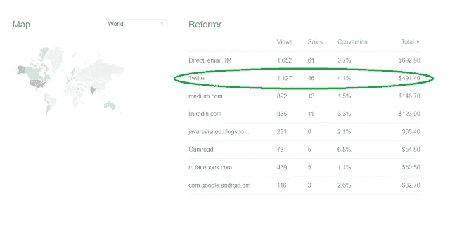
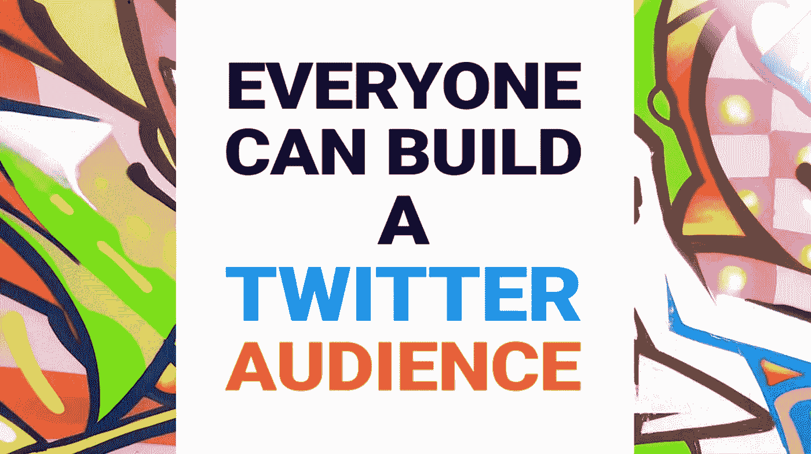
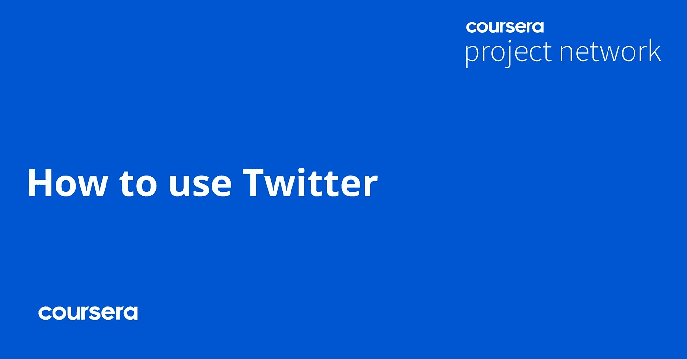
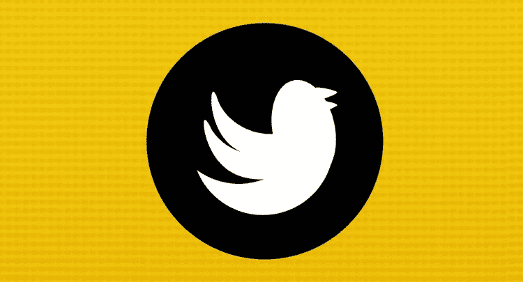
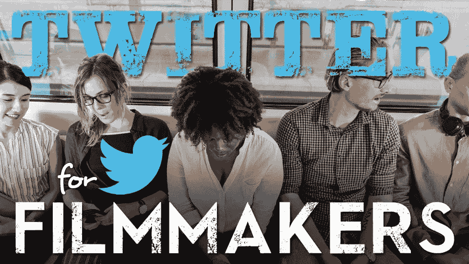
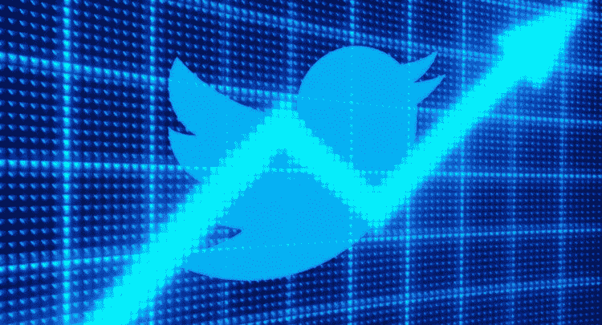

# 2023 年发展受众、增加关注和参与度的 7 个最佳 Twitter 课程

> 原文：<https://medium.com/javarevisited/7-best-courses-to-build-your-twitter-audience-grow-following-and-engagement-6561812869b4?source=collection_archive---------0----------------------->

## 这些是在 Twitter 上建立受众的最佳在线课程，Twitter 是数字营销人员的最佳在线平台之一。在这些课程中，你会找到增加你的追随者、增加信任和参与度的技巧。

大家好，如果你是一名博客作者、有影响力的人、数字标记者或在线课程创建者，并且想在 Twitter 上建立或扩大你的受众，寻找获得成功的资源，那么你来对地方了。

在过去，我已经分享了[脸书营销](https://javarevisited.blogspot.com/2021/12/5-best-courses-to-learn-facebook.html)、[数字营销](https://javarevisited.blogspot.com/2022/02/top-5-courses-to-learn-digital-marketing.html)和 [Instagram 营销课程](https://javarevisited.blogspot.com/2021/12/5-best-online-courses-for-instagram.html)，在这篇文章中，我将分享**最佳在线课程**你可以加入学习一些可行的技巧，以在 2023 年建立你的 Twitter 受众，增加你的追随者和参与度。

你可能知道 **Twitter** ，很有可能你已经有了一个令人印象深刻的 Twitter 个人资料和大量的观众，但是如果你没有，那么不要担心，你来对地方了。

Twitter 是最受欢迎的社交媒体平台之一。[程序员](/javarevisited/the-java-programmer-roadmap-f9db163ef2c2)、[开发者](/javarevisited/top-10-online-courses-to-become-a-fullstack-web-developer-in-2020-d608a6b63232)、企业家、创始人、艺术家、运动员、政治家，几乎各个领域的人都出现在 Twitter 上。

该平台已成为公众与名人互动的场所。Twitter 每月活跃用户超过 3.3 亿，是访问量最大的网站之一，也是使用最多的移动应用。

如果你想成为一名成功的在线课程创建者或博客作者，那么 Twitter 真的可以帮助你，我可以从我的个人经历中说出这一点。我有大约 2.8 万名推特粉丝，我在推特上呆了超过 11 年。

当我推出我的第一本书， [**寻找 Java 面试**，](https://www.amazon.com/Grokking-Java-Interview-interview-essential/dp/B08VBMD33V?tag=javamysqlanta-20)和我的第一个 Udemy 课程， [**春季认证考试**](https://www.udemy.com/course/spring-professional-practice-test-questions-vmware-edu-certification/?couponCode=UDEMY_SALE_MAY21) 时，正是 Twitter 带来了大部分的销售，那时我才意识到 Twitter 的真正潜力。你可以看到下面的截图，我的大部分销售来自 Twitter。

加入和使用 Twitter 很容易。它有一个简单的接口和机制。人们在推特上互相关注。但随着使用量的增加，如今在 Twitter 上建立受众变得越来越困难。

嗯，对于艺术家和运动员这样的受欢迎人物来说，建立受众并不是什么大事，但对于博客和课程创作者这样的普通人来说，他们的目标是建立受众，因为各种原因，如推广他们的内容，这是一项艰巨的工作。

如果你希望在 Twitter 上拥有大量受众，你需要适当的引导。一个人不可能在 Twitter 上获得成千上万的观众。这并不容易。因此，在本文中，我们将列出五大课程，帮助你在 Twitter 上建立更好的受众。

# 7 个适合初学者的最佳 Twitter 在线课程，以建立受众并增加关注者

在不浪费你更多时间的情况下，这里是我列出的最好的在线课程，你可以参加这些课程来学习如何建立你的 Twitter 受众，增加追随者，增加参与度，并把你自己树立为权威。

## 1.丹尼尔·瓦萨洛

这是我最喜欢的 Twitter 成长课程，也可能是最新的课程，采用了久经考验的策略，将你的 Twitter 账户从零增长到 4 万粉丝。

我知道这一点，因为我一直在 Twitter 上关注该课程的创始人丹尼尔·瓦萨洛(Daniel Vassallo)，我看到他的关注者从几千人增长到现在的 70000 多人。

这个广受欢迎的*T*T[T*witter 受众培养课程*将教你如何创建和优化你的 Twitter 账户以获得更多的关注者。导师解释一切，比如如何写一篇完美的简历，账号应该叫什么名字，发什么微博，不发什么微博等等。](https://gumroad.com/a/703100019/PBkrO)

这门课将近两个小时。它也有退款政策，这意味着如果你不喜欢，那么你可以免费得到你的钱，并保留你学到的技巧，但这很少发生，因为我一直遵循他的一些技巧，效果很好。

**这是加入本课程的链接**——[每个人都可以建立一个 Twitter 受众](https://gumroad.com/a/703100019/PBkrO)

建立 Twitter 的观众群可能真的很难，但是在这个视频课程中，丹尼尔解释了建立观众群应该做什么和不应该做什么。它包含了来自那些真正成功的人的建议，这些建议总是有用的。

## 2.[推特营销:1000%的参与度&更多的推特粉丝](https://click.linksynergy.com/deeplink?id=CuIbQrBnhiw&mid=39197&murl=https%3A%2F%2Fwww.udemy.com%2Fcourse%2Ftwitter-marketing-course%2F)

这是 Udemy 上最畅销的 Twitter 营销课程。在这个课程中，讲师解释了 Twitter 营销的真正含义。您将学习如何通过使用各种社交媒体和 Twitter 营销策略来获得更多关注者和增加推文的覆盖范围。

课程将近两个小时，是初级课程。这是最受欢迎的培养 Twitter 用户的在线课程之一。

要求

*   一个推特账号。
*   对社交媒体和 Twitter 营销感兴趣。

总的来说，这是一个很好的课程，可以培养你的 Twitter 受众，获得更多的客户，转发&如何获得更多的 Twitter 关注者，以及 2023 年的 Twitter 广告。

**这是加入本课程的链接** — [Twitter 营销:1000%参与度&更多 Twitter 关注者](https://click.linksynergy.com/deeplink?id=CuIbQrBnhiw&mid=39197&murl=https%3A%2F%2Fwww.udemy.com%2Fcourse%2Ftwitter-marketing-course%2F)

## 3.[如何使用 Twitter](https://coursera.pxf.io/c/3294490/1164545/14726?u=https%3A%2F%2Fwww.coursera.org%2Fprojects%2Fhow-to-use-twitter)【Coursera 初级课程】

如果你是一个初学者，刚刚开始使用 Twitter 或者对 Twitter 一无所知，那么以上两个课程可能会让你感到有些不知所措。相反，你应该先从这个动手的 Coursera 项目课程开始。

在这个 1 小时的基于项目的课程中，您将学到

1.  如何创建你的 Twitter 账户
2.  如何浏览 twitter 的仪表板
3.  了解 twitter 的术语和活动。

如果你不知道 [*Coursera 项目*](https://coursera.pxf.io/c/3294490/1164545/14726?u=https%3A%2F%2Fwww.coursera.org%2Fcourses%3Fquery%3Dguided%2520projects) 非常实用，因为你不需要下载任何东西，但你可以在你的浏览器上运行程序和练习，讲师还会以侧屏视频格式在线教你。对于 Twitter 初学者来说，这是最好的加入课程。

**这是加入本课程的链接** — [如何使用 Twitter](https://coursera.pxf.io/c/3294490/1164545/14726?u=https%3A%2F%2Fwww.coursera.org%2Fprojects%2Fhow-to-use-twitter)

顺便说一句，如果你计划参加多个 Coursera 课程或专业，那么考虑参加 [**Coursera Plus 订阅**](https://coursera.pxf.io/c/3294490/1164545/14726?u=https%3A%2F%2Fwww.coursera.org%2Fcourseraplus) ，它可以让你无限制地访问他们最受欢迎的课程、专业、专业证书和指导项目。它每年花费大约 399 美元，但很值得，因为你可以访问 7000 多门课程和项目，还可以获得无限的证书。

<https://coursera.pxf.io/c/3294490/1164545/14726?u=https%3A%2F%2Fwww.coursera.org%2Fcourseraplus>  

## 4. [Twitter for Business:最佳潜在客户生成系统——Udemy](https://click.linksynergy.com/deeplink?id=JVFxdTr9V80&mid=39197&murl=https%3A%2F%2Fwww.udemy.com%2Fcourse%2Ftwitter-followers-lead-generation-system%2F)

这是 Udemy 的另一个高级和最畅销的 Twitter 受众培养课程。对于那些想了解 Twitter 及其用户的人来说，这是一门非常好的课程。在本课程中，讲师将解释如何锁定受众并与他们互动。

讲师描述了 Twitter 上不同类型的受众之间的差异，以及如何将他们转化为忠实的追随者。你所需要的只是一个 Twitter 账户。

是一个简短的课程，总视频内容不到两个小时。这意味着你不需要花太多时间来学习成长，你可以通过实施你在本课程中学到的技巧来花时间来发展你的 Twitter 账户。

**这是参加本课程的链接** — [Twitter for Business:最佳的销售线索生成系统](https://click.linksynergy.com/deeplink?id=JVFxdTr9V80&mid=39197&murl=https%3A%2F%2Fwww.udemy.com%2Fcourse%2Ftwitter-followers-lead-generation-system%2F)

## 5.用于电影制作的推特:电影营销和品牌建设

电影制作业正在蓬勃发展。今天，它不仅仅局限于电影院。人们在 YouTube 和其他社交媒体平台上介绍他们的才能。为了自我推销，艺术家需要大量的观众。

Udemy 的这门课程是专门为那些希望在 Twitter 上获得大量观众以进行电影营销的艺术家而创建的。在本课程中，讲师将解释如何优化您的 Twitter 帐户，以获得对您的项目感兴趣的关注者。

这是一个初级课程，视频总内容为两个小时。如果你想在 Twitter 上学习电影营销，请选择本课程。但是，它也有一些通用的品牌建设和发展你的 Twitter 账户的技巧，对每个有 Twitter 账户的人都有用。

**这是加入本课程的链接**——[电影制作的推特:电影营销和品牌建设](https://click.linksynergy.com/deeplink?id=JVFxdTr9V80&mid=39197&murl=https%3A%2F%2Fwww.udemy.com%2Fcourse%2Ftwitter-for-filmmakers-film-marketing-filmmaking%2F)

## 6.[推特商业大师——推特家庭商业帝国](https://click.linksynergy.com/deeplink?id=CuIbQrBnhiw&mid=39197&murl=https%3A%2F%2Fwww.udemy.com%2Fcourse%2Ftwitter-home-business-mastery%2F)

这是 Udemy 上最好的 Twitter 受众建设资源之一。在本课程中，讲师将解释如何创建一个合适的 twitter 活动，以获得更好的关注和影响。兴趣、广告、管理广告、分析和见解，一切都在本课程中描述。

在这个课程中，你将学习如何从一个 Twitter 账户每月赚 1000 元，发展一个追随者，并统治 Twitter

以下是您将在本课程中学到的重要内容:

*   如何获得大量的推特粉丝
*   如何将 Twitter 货币化
*   如何从 Twitter 销售产品
*   如何在 Twitter 上获得付费推广
*   如何创造每次都能击中观众的 fire 内容

这个课程最棒的一点是，你将获得可操作的内容，以很小的尺寸分发，你可以立即应用到你的 Twitter 账户。

**这是参加本课程的链接** — [Twitter 业务精通——Twitter 家庭商业帝国](https://click.linksynergy.com/deeplink?id=CuIbQrBnhiw&mid=39197&murl=https%3A%2F%2Fwww.udemy.com%2Fcourse%2Ftwitter-home-business-mastery%2F)

## 7. [Twitter、LinkedIn 和 YouTube 营销](https://coursera.pxf.io/c/3294490/1164545/14726?u=https%3A%2F%2Fwww.coursera.org%2Flearn%2Ftwitter-linkedin-youtube-marketing)【Coursera 课程】

这是 Coursera 的另一门课程，学习社交媒体营销，尤其是 Twitter、Linked In 和 YouTube 营销。本课程由数字营销协会创建，该协会是数字营销认证的全球标准之一。

本课程也是 [**数字营销学院社交媒体营销专业**](https://coursera.pxf.io/c/3294490/1164545/14726?u=https%3A%2F%2Fwww.coursera.org%2Fspecializations%2Fsocial-media-marketing-practice) 的一部分，完成本课程可获得认证。在本课程中，您将学习在 Twitter、Linked In 和 YouTube 上做广告的基本原则。完成本课程后，您将能够:

1.  应用在 Twitter 上发布推文和使用标签的最佳实践
2.  管理和优化 Twitter 广告活动的绩效
3.  在 LinkedIn 上建立公司形象
4.  衡量 LinkedIn 广告活动的绩效
5.  认识到社交视频和 YouTube 在在线营销中的关键作用
6.  在 YouTube 上创建引人入胜的广告活动

本课程还介绍了 B2B 销售和营销的社会销售和个人品牌的概念。它涵盖了传统销售和社交销售之间的差异，以及为什么企业采用社交销售策略来吸引买家。

**这是参加本课程的链接** — [Twitter、LinkedIn 和 YouTube 营销](https://coursera.pxf.io/c/3294490/1164545/14726?u=https%3A%2F%2Fwww.coursera.org%2Flearn%2Ftwitter-linkedin-youtube-marketing)

顺便说一下，如果你觉得 Coursera 的课程很有用，因为它们是由世界各地知名的公司和大学创建的，我建议你加入 Coursera Plus 的订阅计划，它可以让你无限制地访问他们最受欢迎的课程、专业知识、专业证书和指导项目。每月花费大约 59 美元。

<https://coursera.pxf.io/c/3294490/1164545/14726?u=https%3A%2F%2Fwww.coursera.org%2Fcourseraplus>  

以上是你可以参加的关于如何在 2023 年培养 Twitter 用户的最佳在线课程。一个没有足够粉丝的推特账号是没有用的。只有趋势标签对你没有帮助。需要一个合适的策略来吸引观众。在这篇文章中，我们列出了五大课程，这将有助于你理解 Twitter 营销。

这些 twitter 课程是经过精心挑选的，是 Twitter 在线受众培养的最佳课程。

我大多选择分享可操作的技巧来增加信任、追随者和参与度的课程，因为这是真正有效的三件事。

我也打算保持这个列表的更新，所以当我找到更多的 Twitter 课程时，我会把它们包括进来，如果你有，请随意分享。

**附言**——如果你渴望在 2023 年建立自己的 Twitter 档案和受众，但正在寻找免费的 Twitter 营销课程，那么你也可以在 Udemy 上查看这个[**Twitter 营销【免费**](https://click.linksynergy.com/deeplink?id=CuIbQrBnhiw&mid=39197&murl=https%3A%2F%2Fwww.udemy.com%2Fcourse%2Fmarketing-on-twitter%2F)**】**课程。这个 37 分钟的短期速成班是完全免费的，已经有超过 29，000 人加入了这个课程。

<https://click.linksynergy.com/deeplink?id=CuIbQrBnhiw&mid=39197&murl=https%3A%2F%2Fwww.udemy.com%2Fcourse%2Fmarketing-on-twitter%2F> 