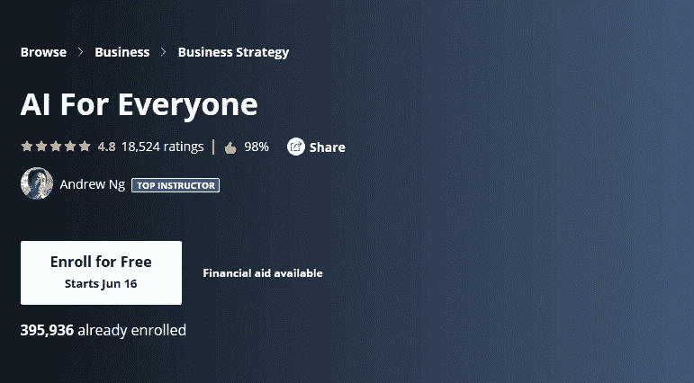
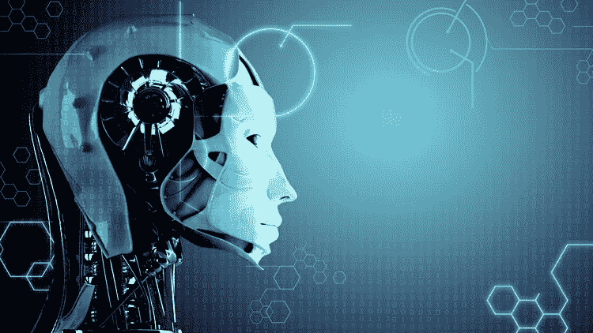
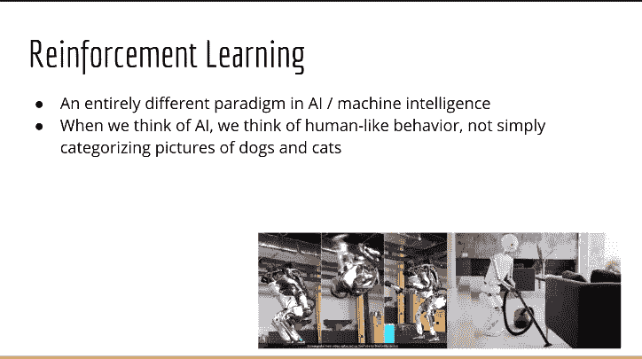

# 2023 年学习人工智能的 7 门最佳课程

> 原文：<https://medium.com/javarevisited/7-best-courses-to-learn-artificial-intelligence-in-2020-26d59d62f6fe?source=collection_archive---------0----------------------->

迈克尔·泽兹奇在 [Unsplash](https://unsplash.com?utm_source=medium&utm_medium=referral) 上的照片

大家好，**人工智能**是技术领域中不断增长的领域之一，许多开发人员正试图学习人工智能，以使他们的职业生涯更上一层楼。如果你是一名 [**Python 开发者**](/swlh/5-free-python-courses-for-beginners-to-learn-online-e1ca90687caf) 并且正在寻找用 Python 学习人工智能的最佳课程，那么你来对地方了。

前面我已经分享了[最佳数据科学课程](/javarevisited/my-favorite-data-science-and-machine-learning-courses-from-coursera-udemy-and-pluralsight-eafc73acc73f)、[最佳机器学习课程](/javarevisited/top-10-machine-learning-and-data-science-certifications-and-training-courses-for-beginners-and-a6308497b764)，在本文中我将分享学习 AI 基础知识的最佳课程以及一些用 [Python 库](https://becominghuman.ai/10-free-courses-to-learn-python-machine-learning-libraries-scikit-learn-numpy-pandas-keras-3c77ba1a6907?source=---------13------------------)实践 AI 的动手课程。我第一次接触 AI 是在 DeepMind 击败国际象棋最优秀的选手之一加里·卡斯帕罗夫的时候。

早在 20 世纪 90 年代，人工智能已经走过了漫长的道路。现在，**谷歌正在使用相同的 DeepMind 将其数据中心的电费减少 40%** ，埃隆·马斯克正在谈论自动驾驶汽车。

如果你是一名科技极客或者程序员，这些都是人工智能的一些迷人例子，每次听到一个人工智能的故事，我都真的被迷住了。虽然所有这些都很好，也很有趣，但作为一名程序员，我也花了一些时间在如何编写人工智能的 h **上？我不是在谈论大问题，只是学习如何为你的利益使用人工智能或根据你自己的需要定制人工智能将在不久的将来大有作为，我正在通过加入在线课程和查看像 **Open AI gym 这样的网站上的代理来学习所有这些。**

如果你不知道，**开 AI 健身房**是埃隆·马斯克这样的企业家支持的项目。它为开发和比较强化学习算法提供了一个工具包。它支持教导代理从走路到玩游戏(如 Pong、Goes、Doom、Breakout 或 Pinball)的一切。由于游戏是我的另一个兴趣领域，如果你不知道，我通过编写像井字游戏、突围、俄罗斯方块和国际象棋这样的游戏来学习编码，开发 AI 来构建游戏似乎是学习人工智能的一个好主意。

仔细看，游戏为构建人工智能提供了完美的环境。当你有一个能够打败游戏的[算法](https://www.java67.com/2019/07/top-10-online-courses-to-learn-data-structure-and-algorithms-in-java.html)时，你就知道同样的原理也可以应用于解决现实世界的问题。这正是谷歌和特斯拉等许多科技巨头遵循的方法。

如果你和我一样，**想在 2023 年用 Python** 学习 AI 或人工智能，并寻找一些优秀的在线课程，那么你来对地方了。在这篇文章中，我将分享一些 2023 年学习人工智能的*最佳在线课程*。**

我还建议你**学习 Python** 如果你还不知道它，如果你需要推荐，那么你可以在 Udemy 上查看这个[**Python 3 boot camp**](http://bit.ly/2BY5LJC)课程。由何塞·马西亚尔·波尔蒂利亚创建，它是在线学习 Python 的最佳资源之一。

 [## Python 训练营:学习 Python 编程和代码培训

### 这是 Udemy 上最全面、最直接的 Python 编程语言课程！你是否…

bit.ly](http://bit.ly/2BY5LJC) 

# 2023 年学习人工智能的 7 门最佳在线课程

网上有很多学习人工智能的课程，但是大部分都很枯燥或者太专业，即使是有多年经验的程序员也不例外。

因为我总是相信简单和令人兴奋的东西，所以我只选择了一门理论和实践相结合的课程。这些课程不仅教你如何构建人工智能，还会启发你学习人工智能。

## 1.吴恩达的《AI for Every One》

吴恩达是一个通过他经典的机器学习课程启发了数百万人工智能和机器学习开发者的人。

他也是 Coursera 的创始人之一，谷歌大脑的领导者，百度的首席科学家，地球上最受欢迎的机器学习课程的讲师。

如果你在想这是不是真的？是的，[Coursera 上的机器学习课程](https://click.linksynergy.com/fs-bin/click?id=JVFxdTr9V80&subid=0&offerid=467035.1&type=10&tmpid=18061&RD_PARM1=https%3A%2F%2Fwww.coursera.org%2Flearn%2Fmachine-learning)已经有超过 260 万学生学习，这使得它成为一门受欢迎的机器学习课程。你可以自己查数字。当吴恩达在推特上宣布这门课程时，我知道这是我必须加入的事情，尽管我已经参加了几堂关于人工智能的课程，我从这门课程中学到了很多。

本课程全面概述了什么是人工智能，以及在人工智能背景下讨论的各种概念的含义。它帮助你建立你的词汇，这样你就可以在线上和线下与程序员同事和其他人讨论人工智能。

**这里是在线参加本课程的链接**——[吴恩达(Coursera)的《人工智能为所有人》(T11)](https://coursera.pxf.io/c/3294490/1164545/14726?u=https%3A%2F%2Fwww.coursera.org%2Flearn%2Fai-for-everyone)

顺便说一下，这门课程提供了 AI 的非技术视角，但你也可以通过这门课程学习 AI 的商业方面。如果你想为你的公司建立一个人工智能战略，或者想与人工智能团队合作，加入这个课程。

如果你觉得 Coursera 的课程很有用，因为它们是由知名公司创建的，如**谷歌**、 **IBM** 、**亚马逊**以及世界上最好的大学，我建议你加入 Coursera 的订阅计划 [**Coursera Plus**](https://coursera.pxf.io/c/3294490/1164545/14726?u=https%3A%2F%2Fwww.coursera.org%2Fcourseraplus)

这种单次订阅可以让你无限制地访问他们最受欢迎的**课程**、**专业化**、**专业证书**和**指导项目**。它每年花费大约 399 美元，但是它完全物有所值，因为你可以获得无限的证书。

## [2。人工智能 A-Z:学习如何构建人工智能(Udemy)](https://click.linksynergy.com/deeplink?id=JVFxdTr9V80&mid=39197&murl=https%3A%2F%2Fwww.udemy.com%2Fcourse%2Fartificial-intelligence-az%2F)

这是我学习人工智能的第一门课，这是一门很聪明的课程，因为我是导师基里尔·叶列缅科和他的超级数据科学团队的超级粉丝。参加过他的深入学习课程后，我知道这是多么吸引人，鉴于这门学科的复杂性，这是我的首要要求。我不想因为大量使用数学和神经网络而陷入困境，相反，我想要一门能激励我学习更多的课程，而且我必须说，我没有失望。

本课程将教你如何结合数据科学、机器学习和深度学习的力量，为现实世界的应用创建强大的人工智能，就像在《突围》中创建人工智能来击败游戏，在《毁灭战士》中通过一个关卡，以及为自动驾驶汽车创建逻辑。

**这是在线加入本课程的链接**——[人工智能 A-Z:学习如何构建人工智能(Udemy)](https://click.linksynergy.com/deeplink?id=JVFxdTr9V80&mid=39197&murl=https%3A%2F%2Fwww.udemy.com%2Fcourse%2Fartificial-intelligence-az%2F)

课程材料真的很吸引人，很令人兴奋，特别是如果你喜欢游戏，而且你以前没有参加过任何人工智能课程，我建议你参加这个课程。你不会后悔的。谈到社会证明，已经有超过 101，411 名学生注册了这门课程，平均而言，这门课程从 11，452 个评分中获得了 4.4 个评分，这是非常惊人的。非常感谢基里尔·叶列缅科和他的整个@superdatascience 团队创造了这个令人敬畏的课程。

## [3。Unity 人工智能入门指南。](https://click.linksynergy.com/deeplink?id=JVFxdTr9V80&mid=39197&murl=https%3A%2F%2Fwww.udemy.com%2Fcourse%2Fartificial-intelligence-in-unity%2F)

这是我在 Udemy 上的另一门课程，学习如何在游戏中使用 AI。如果你不知道，Unity 是开发各种视频游戏的最受欢迎的**游戏引擎**之一，他们使用人工智能根据玩家的能力让游戏变得困难。如果你是一名游戏设计师或游戏开发者，如果你的非玩家角色缺乏动力和野心，那么你可以参加这个课程，学习如何让他们更加真实可信。

在本课程中，本课程的讲师 Penny 使用她在游戏、图形领域超过 25 年的国际知名教学风格和知识，揭示了用于在游戏中创建可信角色行为的最受欢迎的人工智能技术，并撰写了两本关于游戏人工智能的获奖书籍。

**这里是在线加入本课程的链接**——[Unity 人工智能入门指南。](https://click.linksynergy.com/deeplink?id=JVFxdTr9V80&mid=39197&murl=https%3A%2F%2Fwww.udemy.com%2Fcourse%2Fartificial-intelligence-in-unity%2F)

在整个课程中，你将跟随实践工作坊，这些工作坊旨在教授你当今游戏中使用的基本人工智能技术。如果你喜欢视频游戏，并想了解更多关于人工智能在那里的应用，这是为你开设的课程。

## 4.[人工智能(AI) Coursera 简介](https://coursera.pxf.io/c/3294490/1164545/14726?u=https%3A%2F%2Fwww.coursera.org%2Flearn%2Fintroduction-to-ai)

这是 Coursera 中学习人工智能的另一个精彩课程。在这门课程中，你将学习什么是人工智能(AI)，探索人工智能的用例及应用，理解人工智能的概念，以及像[机器学习](/javarevisited/top-10-resources-to-learn-data-science-and-machine-learning-best-of-lot-f153e1f44e89)、[、](https://javarevisited.blogspot.com/2019/08/top-5-courses-to-learn-deep-learning.html)和神经网络这样的术语。

你还将接触到围绕人工智能的各种问题和担忧，如道德和偏见、&工作，并从专家那里获得关于学习和开始人工智能[职业生涯的建议](/javarevisited/top-10-coursera-certificates-to-start-your-career-in-cloud-data-science-ai-mainframe-and-it-558690c83587)。

您还将通过一个迷你项目展示人工智能的实际应用，并在成功完成项目后获得证书

本课程不需要任何编程或计算机科学专业知识，旨在向任何人介绍人工智能的基础知识，无论您是否有技术背景。

**这里是在线加入本课程的链接**——[人工智能(AI)入门 Coursera](https://coursera.pxf.io/c/3294490/1164545/14726?u=https%3A%2F%2Fwww.coursera.org%2Flearn%2Fintroduction-to-ai)

## 5.[商业人工智能](https://click.linksynergy.com/deeplink?id=JVFxdTr9V80&mid=39197&murl=https%3A%2F%2Fwww.udemy.com%2Fcourse%2Fai-for-business%2F)

这是基里尔·叶列缅科和他的 SuperDataScience 团队关于如何用人工智能解决现实世界的商业问题的又一个精彩课程。如果你是一个商人或者只是好奇人工智能如何帮助你，那么你应该参加这个课程。

关于[人工智能](https://www.java67.com/2019/11/top-5-artificial-intelligence-courses.html)和[机器学习](https://becominghuman.ai/9-data-science-and-machine-learning-courses-by-harvard-ibm-udemy-and-others-12a0c7c23ec1)的复杂话题在不涉及太多技术的情况下得到了最好的呈现。我向试图提高他们的技能并帮助他们的企业使用人工智能的商业专业人士强烈推荐它。

谈到社交证明，这门课程受到了 14，000 多名学生的信任，平均得分为 4.3，这是一门了不起的课程。

**这是在线参加本课程的链接**——[商业人工智能](https://click.linksynergy.com/deeplink?id=JVFxdTr9V80&mid=39197&murl=https%3A%2F%2Fwww.udemy.com%2Fcourse%2Fai-for-business%2F)

## 6.[高级 AI:Python 中的深度强化学习](https://click.linksynergy.com/deeplink?id=JVFxdTr9V80&mid=39197&murl=https%3A%2F%2Fwww.udemy.com%2Fcourse%2Fdeep-reinforcement-learning-in-python%2F)

在上一个课程中，我们已经看到了一个简单的，不太技术性的人工智能初学者课程，这是完全相反的。这是一门高级人工智能课程，重点是使用 [Python](/javarevisited/10-free-python-tutorials-and-courses-from-google-microsoft-and-coursera-for-beginners-96b9ad20b4e6) 进行深度强化学习。

这个课程是由懒程序员和他的团队创建的，内容都是关于**深度学习**和**神经网络**到**强化学习**的应用。

您还将了解到 **OpenAI Gym** ，这在他的课程中被大量用于练习和演示。它允许世界上任何地方的任何人在标准环境中训练他们的强化学习代理。如果你想深入研究人工智能，那么这是最适合你的课程。

**这里是在线加入本课程的链接**——[高级人工智能:Python 中的深度强化学习](https://click.linksynergy.com/deeplink?id=JVFxdTr9V80&mid=39197&murl=https%3A%2F%2Fwww.udemy.com%2Fcourse%2Fdeep-reinforcement-learning-in-python%2F)

## 7。人工智能:Python 中的强化学习

如果你不知道，强化学习是 AI 的一大部分，本课程提供了深度强化学习的完整指南。它帮助你在技术层面上理解强化学习。

也有助于你理解强化学习和心理学的关系。

强化学习最近因在 AI 中做了一些奇妙的事情而出名，比如在 2016 年，我们看到谷歌的 AlphaGo 击败了围棋世界冠军。我们看到人工智能在玩像《毁灭战士》和《超级玛丽》这样的电子游戏。与深度学习非常相似，许多理论是在 70 年代和 80 年代发现的，但直到最近我们才能够直接观察到可能的惊人结果。

**这里是在线加入本课程的链接**——[人工智能:Python 中的强化学习](https://click.linksynergy.com/deeplink?id=JVFxdTr9V80&mid=39197&murl=https%3A%2F%2Fwww.udemy.com%2Fcourse%2Fartificial-intelligence-reinforcement-learning-in-python%2F)

谈到社会证明，这门课程已经得到了超过 28000 名学生的信任，平均而言，它得到了近 5000 名参与者的 4.6 分，这是非常了不起的。如果你正在寻找一个纯粹的[人工智能技术课程，](https://javarevisited.blogspot.com/2019/10/top-5-courses-to-learn-artificial-intelligence-AI.html)这是一个加入。

以上就是 2023 年用 Python 学习人工智能或 AI 的部分**最佳课程。我试图在每门课程中加入一些人工智能的非技术性课程，比如伟大的吴恩达的《人工智能》,只是为了理解人工智能的商业和一般方面，这远比实际学习如何为特定领域或问题构建人工智能重要得多。

其他**面向程序员的机器学习和 AI 资源****

*   [2023 年学习数据科学的 10 本书和课程](/javarevisited/top-10-resources-to-learn-data-science-and-machine-learning-best-of-lot-f153e1f44e89)
*   [面向数据科学和机器学习的 8 大 Python 库](https://javarevisited.blogspot.com/2018/10/top-8-python-libraries-for-data-science-machine-learning.html)
*   [2023 年学习 Python 的 5 大课程](https://hackernoon.com/top-5-courses-to-learn-python-in-2018-best-of-lot-26644a99e7ec)
*   [面向数据科学家的 10 大 TensorFlow 课程](https://dev.to/javinpaul/10-of-the-best-tensorflow-courses-to-learn-machine-learning-from-coursera-and-udemy-37bf)
*   [面向程序员的 10 门机器学习和深度学习课程](https://hackernoon.com/top-5-courses-to-learn-python-in-2018-best-of-lot-26644a99e7ec)
*   [2023 年学习 Python 的 10 个理由](https://hackernoon.com/10-reasons-to-learn-python-in-2018-f473dc35e2ee)
*   [学习机器学习的 5 大免费课程](https://www.java67.com/2019/01/5-free-courses-to-learn-machine-and-deep-learning-in-2019.html)
*   [初学者学习 TensorFlow 的 5 大课程](https://hackernoon.com/top-5-tensorflow-and-ml-courses-for-programmers-8b30111cad2c)
*   [学习高级数据科学的前 5 门课程](https://hackernoon.com/top-5-data-science-and-machine-learning-course-for-programmers-e724cfb9940a)
*   [学习数据科学数学和统计的 5 门课程](https://javarevisited.blogspot.com/2019/09/top-5-statistics-and-mathematics-course-for-data-science.html)
*   [学习数据科学 Tableau 的前 5 门课程](https://javarevisited.blogspot.com/2019/07/top-5-tableau-online-courses-and-certifications-for-data-science-engineers.html)
*   [学习数据科学 Python 的 5 本书](https://javarevisited.blogspot.com/2019/08/top-5-python-books-for-data-science-and-machine-learning.html)
*   [初学者学习数据科学的 10 门课程](https://hackernoon.com/10-machine-learning-data-science-and-deep-learning-courses-for-programmers-7edc56078cde)
*   [初学者学习 Python 的 10 门免费课程](https://hackernoon.com/10-free-python-programming-courses-for-beginners-to-learn-online-38312f3b9912)
*   [学习熊猫数据分析的 5 大课程](https://javarevisited.blogspot.com/2019/10/top-5-courses-to-learn-pandas-for-data-analysis-python.html)

感谢您阅读本文。如果你喜欢这些最好的人工智能或 AI 课程，那么请分享给你的朋友和同事。如果您有任何问题或反馈，请留言。

**P. S.** —如果你是认真的想进入 AI 和机器学习领域，我也建议你学习 Python，这是机器学习和 AI 最有价值的技能之一。如果你需要资源，看看这个列表中的 [**最好的 Python 课程**](/better-programming/top-5-courses-to-learn-python-in-2018-best-of-lot-26644a99e7ec) ，开始你的旅程。

 [## Python 训练营:学习 Python 编程和代码培训

### 这是 Udemy 上最全面、最直接的 Python 编程语言课程！你是否…

bit.ly](http://bit.ly/2BY5LJC)