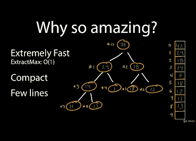
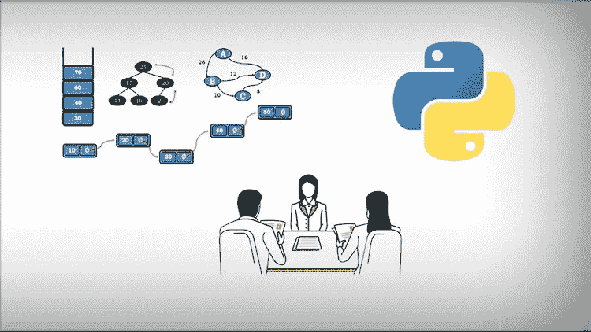
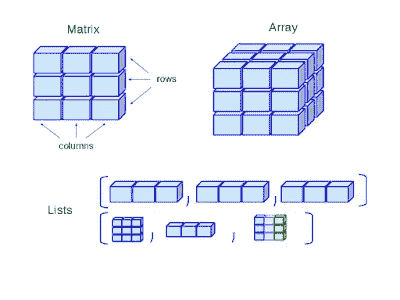
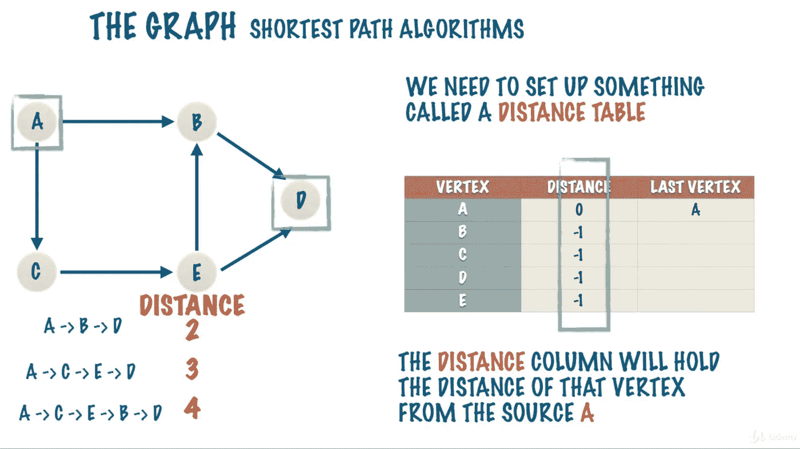
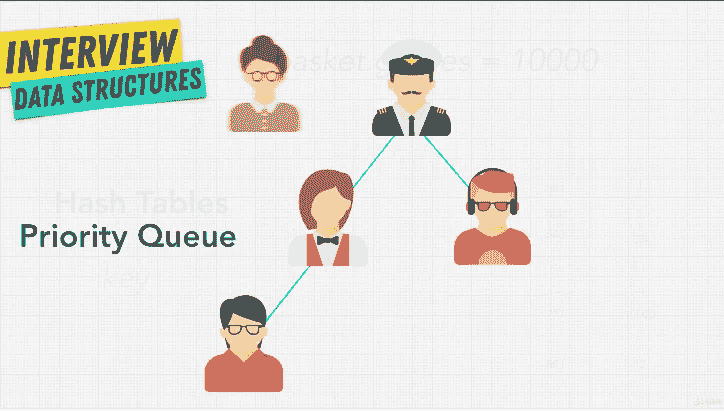

# 学习数据结构和算法的 7 门最佳课程

> 原文：<https://medium.com/javarevisited/7-best-courses-to-learn-data-structure-and-algorithms-d5379ae2588?source=collection_archive---------0----------------------->

## 这些是学习数据结构和算法的最佳课程，适用于两种面试，也是成为一名更好的软件工程师的最佳课程

image _ credit—Trie(教育性)的一个例子

大家好，[数据结构](http://www.java67.com/2013/08/ata-structures-in-java-programming-array-linked-list-map-set-stack-queue.html)和[算法](https://dzone.com/articles/5-free-courses-to-learn-data-structure-and-algorit)都是程序员最重要的课题之一，如果你想在 2023 年学习数据结构和算法，那么你来对地方了。

最棒的是**它们永远不会过时**，你在时间和金钱方面的任何投资都将在很长一段时间内获得丰厚的回报。我还发现，擅长算法和数据结构的人往往是比其他人更好的程序员。

它们有助于提高你的编程技能和编码意识，这也是我建议各类程序员，从初级到高级，花些时间修改、更新和磨练你的数据结构和算法技能的主要原因。

我们大多数人第一次听说他们是在学校和大学，但当时并不理解。至少我可以对我自己这么说。我第一次听说我工程学院的[数组](http://www.java67.com/2017/06/5-difference-between-array-and-linked.html)和[链表](https://javarevisited.blogspot.com/2017/03/how-to-reverse-linked-list-in-java-using-iteration-and-recursion.html)。那一次我不知道数组和链表的真正用途是什么，因为我们面临的大多数问题都是基于理论知识，没有任何实际应用。

比如数组与链表的 [*区别*](https://javarevisited.blogspot.com/2013/07/difference-between-array-and-linked-list-java.html) 是考试中出现的必答题，只要抢答就足以得高分。也许你在你的大学和学校里自己学习会更好，但这是一个普遍的模式。

我第一次认识到数组的真正用途，是在我第一家公司为移动设备写游戏的时候。我的任务是**写一个棋盘 gam** e，然后我发现我可以使用一个[二维数组](http://www.java67.com/2014/10/how-to-create-and-initialize-two-dimensional-array-java-example.html)作为棋盘，只存储 1 或 0 来指示特定的地方是否被占用。这是我第一次在现实世界中体验数据结构以及它们在现实应用中的作用。我知道它来得很晚，我很幸运地在不太了解数据结构、算法和编程的情况下找到了自己的路，但那都是过去的事了。

现在的环境已经变得竞争非常激烈，你就是不能错过这些至关重要的概念。你还需要比上一代人更积极主动地学习。

如果你是其中一员，并积极寻找学习算法和数据结构，寻找一些优秀的课程开始你的旅程，那么你来对地方了。在这篇文章中，我将为 [Java](http://www.java67.com/2018/08/top-10-free-java-courses-for-beginners-experienced-developers.html) 、 [Python](http://javarevisited.blogspot.sg/2018/03/top-5-courses-to-learn-python-in-2018.html) 、 [JavaScript](http://www.java67.com/2018/04/top-5-free-javascript-courses-to-learn.html) 开发者分享一些最好的数据结构和算法课程。

# 程序员的 7 门最佳数据结构和算法课程

当我在 Java 上发布我的[免费数据结构课程列表时，我的许多读者都在问我关于各种编程语言的数据结构和算法课程，大多是在](https://www.java67.com/2019/07/top-10-online-courses-to-learn-data-structure-and-algorithms-in-java.html) [Java](http://www.java67.com/2018/08/top-10-free-java-courses-for-beginners-experienced-developers.html) 、 [Python](https://javarevisited.blogspot.com/2018/12/10-free-python-courses-for-programmers.html) 和 [JavaScript](http://www.java67.com/2019/01/top-10-javascript-frameworks-and-libraries-for-web-developers.html) 上。

我告诉他们，数据结构和算法是一般的编程概念，一旦你熟悉了这些概念，你就可以在任何语言中工作，但是通过我与他们的一点点互动，**我意识到，人们对 Java 或 Python 这样的编程语言的了解要多于对数据结构如** [**链表**](http://javarevisited.blogspot.sg/2017/07/top-10-linked-list-coding-questions-and.html#axzz4xXS86IVo) **或** [**二叉树**](http://www.java67.com/2016/07/how-to-implement-preorder-traversal-of-binary-tree-in-java.html) **的了解。**

这就是为什么**如果用他们更熟悉的语言来解释和实现数据结构和算法，会对他们最有利**。这对我来说很有意义，这就是为什么我在这三种编程语言中加入了数据结构和算法课程。但是，即使你不使用这些语言，你仍然可以从这些课程中受益，因为归根结底，数据结构和算法是通用的，它们只是可以在任何语言中实现的概念。

反正下面是 2023 年**学数据结构和算法最好的课程**

## 1.[数据结构和算法:使用 Java 进行深入研究](https://click.linksynergy.com/fs-bin/click?id=JVFxdTr9V80&subid=0&offerid=634352.1&type=10&tmpid=14538&RD_PARM1=https%3A%2F%2Fwww.udemy.com%2Fdata-structures-and-algorithms-deep-dive-using-java%2F)

这是关于使用 Java 的数据结构和算法的最全面的课程之一。它为从头开始实现最新的算法提供了一个优秀而直接的指南:数组、链表、图形算法和排序等等。

你还将学习[二叉树](https://javarevisited.blogspot.com/2015/10/how-to-implement-binary-search-tree-in-java-example.html)，平衡树如 **AVL 树**和红黑树，堆包括堆排序算法，以及关联数组和字典。

如果你是一名 Java 开发人员，正在寻找一门优秀的数据结构和算法课程，那么你应该加入这个。它很全面，但同时，既令人兴奋又富有挑战性。

**这里是报名参加本课程的链接** — [数据结构和算法:使用 Java 的深度探索](https://click.linksynergy.com/fs-bin/click?id=JVFxdTr9V80&subid=0&offerid=634352.1&type=10&tmpid=14538&RD_PARM1=https%3A%2F%2Fwww.udemy.com%2Fdata-structures-and-algorithms-deep-dive-using-java%2F)

## 2. [JavaScript 算法和数据结构 Masterclass](https://click.linksynergy.com/fs-bin/click?id=JVFxdTr9V80&subid=0&offerid=634352.1&type=10&tmpid=14538&RD_PARM1=https%3A%2F%2Fwww.udemy.com%2Fjs-algorithms-and-data-structures-masterclass%2F)

这是学习 JavaScript 中数据结构和算法的最好的课程之一，说真的，你不会找到比这更好的课程了，而且价格还这么离谱。

我在**仅花 10 美元在 Udemy 的每月一次的快闪拍卖**上买了这个课程，我对它的质量感到惊讶。我买这门课的原因是因为柯尔特·斯蒂尔，他是 Udemy 最好的老师之一，他的课非常棒。

参加过他的课程[**Web 开发者训练营**](https://click.linksynergy.com/fs-bin/click?id=JVFxdTr9V80&subid=0&offerid=323058.1&type=10&tmpid=14538&RD_PARM1=https%3A%2F%2Fwww.udemy.com%2Fthe-web-developer-bootcamp%2F) **，**我对质量很有把握，当我看到他涵盖了数据结构和算法时，我忍不住买了这个课程。正如柯尔特·斯蒂尔提到的，这门课程将几个月的计算机科学和面试准备材料浓缩到 20 个小时的内容中，这帮助他的训练营学生在大型科技公司如谷歌、特斯拉、亚马逊和脸书的面试中胜出。

**这里是了解本课程更多信息的链接**——[JavaScript 算法和数据结构大师班](https://click.linksynergy.com/fs-bin/click?id=JVFxdTr9V80&subid=0&offerid=634352.1&type=10&tmpid=14538&RD_PARM1=https%3A%2F%2Fwww.udemy.com%2Fjs-algorithms-and-data-structures-masterclass%2F)

该课程不仅涵盖基本的数据结构，如数组、链表和二叉树，还包括“高级主题”，如[堆](http://www.java67.com/2016/10/difference-between-heap-and-stack-memory-in-java-JVM.html)、图形和 Dijkstra 的最短路径算法。你不仅会学到数据结构，还会学到如何使用大 O 符号和技术来分析代码的时间和空间复杂度，通过空间-时间权衡来降低它们。

本课程还涵盖了[递归](http://www.java67.com/2016/05/java-program-to-perform-binary-search-without-recursion.html)的来龙去脉，递归是解决许多链表和基于二叉树的问题的重要技术。您还将学习解决第一次可能会遇到的[困难的编码问题](https://codeburst.io/100-coding-interview-questions-for-programmers-b1cf74885fb7)的技术。总之是学习 JavaScript 中数据结构和算法最好的课程之一。

## 3.[从零开始学习 Python 中的数据结构和算法](https://click.linksynergy.com/deeplink?id=JVFxdTr9V80&mid=39197&murl=https%3A%2F%2Fwww.udemy.com%2Fcourse%2Flearning-data-structures-algorithms-in-python-from-scratch%2F)

这是我遇到的 Python 开发者最好的数据结构和算法课程。

它涵盖了基本和高级数据结构，如数组、链表、树、[哈希表](https://javarevisited.blogspot.com/2011/02/how-hashmap-works-in-java.html#axzz4sZOoYUxv)、堆栈、队列、堆，排序算法，如[快速排序](https://javarevisited.blogspot.com/2014/08/quicksort-sorting-algorithm-in-java-in-place-example.html)、[合并排序](http://www.java67.com/2018/03/mergesort-in-java-algorithm-example-and.html)和[插入排序](https://javarevisited.blogspot.com/2014/12/insertion-sort-algorithm-in-java-to-array-example.html)，以及搜索算法，如[线性](http://www.java67.com/2016/10/how-to-implement-linear-search-in-java.html)和[二分搜索法](https://javarevisited.blogspot.com/2017/04/recursive-binary-search-algorithm-in-java-example.html)。

本课程还涵盖了一些高级算法，如最短路径算法、Dijkstra 算法、Bellman-Ford 算法、Kruskal 算法、生成树等。

在排序算法方面，它涵盖了基本的排序算法，如冒泡排序、选择排序和插入排序，以及快速排序和合并排序。它还包括基于非比较的排序算法，如[计数排序](http://www.java67.com/2017/06/counting-sort-in-java-example.html)和[基数排序](http://www.java67.com/2018/03/how-to-implement-radix-sort-in-java.html)。

所有的代码示例和问题都是用 Python 编程语言实现的，这样你在理解如何自己应用它们时就不会有任何困难。

**这里是了解本课程更多信息的链接**—[Python 中的算法和数据结构](https://click.linksynergy.com/fs-bin/click?id=JVFxdTr9V80&subid=0&offerid=634352.1&type=10&tmpid=14538&RD_PARM1=https%3A%2F%2Fwww.udemy.com%2Falgorithms-and-data-structures-in-python%2F)

## 4.[算法和数据结构—第一部分和第二部分](https://pluralsight.pxf.io/c/1193463/424552/7490?u=https%3A%2F%2Fwww.pluralsight.com%2Fcourses%2Fads-part1)

作为一名 Java 开发人员，我有点偏向于包含比任何其他语言更多的数据结构和算法课程。

另一个原因是我团队的大部分时间都在用 Java 编程，所以我刚刚参加了比 [JavaScript](https://javarevisited.blogspot.com/2018/06/top-10-courses-to-learn-javascript-in.html) 或 [Python](https://dzone.com/articles/why-every-programmer-should-learn-python) 更多的 [Java](https://javarevisited.blogspot.com/2018/05/top-5-java-courses-for-beginners-to-learn-online.html) 课程。

这是我参加过的又一门印象深刻的学习数据结构和算法的课程，觉得很适合。在本课程中，您将学习日常应用中使用的核心数据结构和算法。

**这里是了解本课程更多信息的链接**—[Python 中的算法和数据结构](https://click.linksynergy.com/fs-bin/click?id=JVFxdTr9V80&subid=0&offerid=634352.1&type=10&tmpid=14538&RD_PARM1=https%3A%2F%2Fwww.udemy.com%2Falgorithms-and-data-structures-in-python%2F)

您将了解选择每种数据结构所涉及的权衡，以及遍历、检索和更新算法。这是包含算法和数据结构的两部分系列课程的第一部分。在课程的第二部分，你将学习[链表](http://javarevisited.blogspot.sg/2017/07/top-10-linked-list-coding-questions-and.html#axzz4xXS86IVo)、[栈](https://javarevisited.blogspot.com/2017/03/difference-between-stack-and-queue-data-structure-in-java.html)、[队列](http://javarevisited.blogspot.sg/2013/10/what-is-priorityqueue-data-structure-java-example-tutorial.html#axzz55TV25G5I)、[二叉树](https://javarevisited.blogspot.com/2016/10/post-order-binary-tree-traversal-in-java-iteration-recursion.html)和[哈希表](https://javarevisited.blogspot.com/2013/02/how-to-get-key-from-value-in-hashtable.html)。我建议您通读这两篇文章，了解基本和高级数据结构。

## 5.[从 0 到 Java 中的数据结构&算法](https://click.linksynergy.com/fs-bin/click?id=JVFxdTr9V80&subid=0&offerid=634352.1&type=10&tmpid=14538&RD_PARM1=https%3A%2F%2Fwww.udemy.com%2Ffrom-0-to-1-data-structures%2F)

顾名思义，这个课程是针对初学者的，带你从 0 到 1。该课程由在谷歌、微软和 Flipkart 拥有丰富经验的教师团队讲授。

这门课程最大的好处是它是一种学习数据结构和算法的动画、视觉和空间方式，许多初学者会觉得既有趣又舒服。

我见过许多程序员努力挑选像[递归](https://javarevisited.blogspot.com/2016/12/how-to-count-number-of-leaf-nodes-in-java-recursive-iterative-algorithm.html)、数据结构和算法这样的主题，因为他们无法可视化正在发生的事情；本课程通过运用技术和创造力来帮助解决这个问题。

如果你是一个初学者，并且很难理解数据结构、算法和递归，那么这是一门非常适合你的课程。

**这里是了解本课程更多信息的链接** — [从 0 到 Java 中的数据结构&算法](https://click.linksynergy.com/fs-bin/click?id=JVFxdTr9V80&subid=0&offerid=634352.1&type=10&tmpid=14538&RD_PARM1=https%3A%2F%2Fwww.udemy.com%2Ffrom-0-to-1-data-structures%2F)

## 6.[掌握编码面试:数据结构+算法](https://academy.zerotomastery.io/a/aff_nqb6sg6w/external?affcode=441520_zytgk2dn)【ZTM】

这可能是程序员和开发者最好的编码面试课程。虽然不需要编程语言，但如果你不懂 JavaScript，作者 Andrei Neagoie 仍然让它很容易理解。在本课程中，您将学习如何分析算法，如搜索、排序和其他算法。

你还将学习如何将代码复杂度从一个 Big-O 级别降低到另一个级别，这是打动面试官的重要技能。此外，您将学习不同类型的数据结构，以及如何选择正确的数据结构来解决问题。

请记住，精心选择的数据结构可以极大地提高应用程序的 CPU 和内存性能。例如，用一个集合来解决[重复元素问题](https://javarevisited.blogspot.com/2015/06/3-ways-to-find-duplicate-elements-in-array-java.html)就变得容易多了。您还将学习如何为每个数据结构找到 Big-O。

到最后，你将能够写出运行速度更快、使用内存更少的代码。您还将学习如何使用动态编程来分析问题，这是许多程序员忘记准备的一种技术。

**这里是了解本课程更多信息的链接** — [掌握编码面试:数据结构+算法](https://academy.zerotomastery.io/a/aff_nqb6sg6w/external?affcode=441520_zytgk2dn)

顺便说一句，你需要一个 [**ZTM 会员**](https://academy.zerotomastery.io/a/aff_c0gnlvf7/external?affcode=441520_zytgk2dn) 来观看这个课程，这个课程每月花费大约 39 美元，但也提供了许多超级吸引人和有用的课程，如他的 [*Python Bootcamp 课程*](https://academy.zerotomastery.io/a/aff_yp0m7fjx/external?affcode=441520_zytgk2dn) 和他的 JavaScript Web 项目:20 个项目来建立你的作品集课程。您还可以使用我的代码 **FRIENDS10** 获得您选择的任何套餐的 10%折扣。

<https://academy.zerotomastery.io/a/aff_c0gnlvf7/external?affcode=441520_zytgk2dn>  

虽然这是所有级别程序员的理想课程，尤其是 JavaScript 和 Web 开发人员。顺便说一下，如果你正在寻找一个好的 Java 编程/编码面试课程，那么你也可以查看 Tim Buchalaka 的[数据结构和算法:使用 Java 的深度探索](https://click.linksynergy.com/fs-bin/click?id=JVFxdTr9V80&subid=0&offerid=323058.1&type=10&tmpid=14538&RD_PARM1=https%3A%2F%2Fwww.udemy.com%2Fdata-structures-and-algorithms-deep-dive-using-java%2F)。你可以用它从头开始，或者只是在去面试前复习一下知识。

<https://click.linksynergy.com/fs-bin/click?id=JVFxdTr9V80&subid=0&offerid=323058.1&type=10&tmpid=14538&RD_PARM1=https%3A%2F%2Fwww.udemy.com%2Fdata-structures-and-algorithms-deep-dive-using-java%2F>  

## 7.[寻找编码面试:编码问题的模式](https://www.educative.io/collection/5668639101419520/5671464854355968?affiliate_id=5073518643380224)

对于准备编码面试的人来说，这是另一个很好的面试复习课程。与之前关注具体问题的课程不同，本课程关注的是潜在模式。一旦你知道了这个模式，你就可以根据这个模式解决数十个编码问题。

这意味着不用解决成百上千的 Leetcode 编码问题。你只要掌握这些 **15 种基本模式**来面试问题，你就能应对面试中遇到的任何问题。

1.  推拉窗
2.  两点
3.  快速和慢速指针
4.  合并间隔，
5.  循环排序，
6.  前 K 个元素

这会节省很多时间，如果你下周有一个编码面试，这是你应该参加的课程。

**这里是了解本课程更多信息的链接** — [探索编码面试:编码问题的模式](https://www.educative.io/collection/5668639101419520/5671464854355968?affiliate_id=5073518643380224)

总的来说，所有有教育意义的课程都被很好地组合在一起了！这些课程神奇地将 3 年的 CS 浓缩在简短的课程和讲座中(我试过[系统设计](https://www.java67.com/2018/05/top-20-system-design-interview-questions-answers-programming.html)、[面向对象设计](https://javarevisited.blogspot.com/2018/08/5-object-oriented-programming-and-design-courses-for-Java-programmers.html)和编码模式)。

寻找课程对于准备面试来说非常棒，我推荐这三个关于教育的寻找课程，我指的是这一个，寻找系统设计面试[和面向对象设计面试](https://www.educative.io/collection/5668639101419520/5649050225344512?affiliate_id=5073518643380224)。

<https://www.educative.io/collection/5668639101419520/5692201761767424?affiliate_id=5073518643380224>  

以上就是 2023 年学习数据结构与算法的一些**最好的课程。我已经包括了 Java 和 Python 程序员的课程，但是正如我以前说过的，数据结构和算法是与语言无关的主题。一旦你知道一个特定的数据结构或算法是如何工作的，你就可以用你选择的任何编程语言来实现它。

其他**你可能喜欢的编程资源****

*   [Java 开发者路线图](https://javarevisited.blogspot.com/2019/10/the-java-developer-roadmap.html)
*   [50+数据结构与算法面试题](https://hackernoon.com/50-data-structure-and-algorithms-interview-questions-for-programmers-b4b1ac61f5b0)
*   [面向 Java 开发者的 5 门免费 Spring 框架课程](http://www.java67.com/2017/11/top-5-free-core-spring-mvc-courses-learn-online.html)
*   [2023 年学习 Web 开发的 5 门课程](http://javarevisited.blogspot.sg/2018/02/top-5-online-courses-to-learn-web-development.html#axzz57wed1PWd)
*   [5 门免费学习核心 Java 的在线课程](http://javarevisited.blogspot.sg/2017/11/top-5-free-java-courses-for-beginners.html#axzz4zuIICRs9)
*   [面向有经验的 Java 开发人员的 5 大 Java 设计模式课程](http://javarevisited.blogspot.sg/2018/02/top-5-java-design-pattern-courses-for-developers.html)
*   [学习大数据和 Apache Spark 的 5 门课程](http://javarevisited.blogspot.com/2017/12/top-5-courses-to-learn-big-data-and.html)
*   [编程/编码工作面试 10 门课程](http://javarevisited.blogspot.sg/2018/02/10-courses-to-prepare-for-programming-job-interviews.html)
*   [用 Spring Boot 和云学习 Spring 微服务的 5 门课程](http://javarevisited.blogspot.sg/2018/02/top-5-spring-microservices-courses-with-spring-boot-and-spring-cloud.html#axzz59dN6YO2K)
*   [程序员的 10 个技巧和 101 个编码问题](https://dev.to/javinpaul/101-coding-problems-and-few-tips-to-crack-your-next-programming-interviews-402a)
*   [我最喜欢的 2023 年学 AWS 的课程](/javarevisited/top-10-courses-to-learn-amazon-web-services-aws-cloud-in-2020-best-and-free-317f10d7c21d)
*   [2023 年学习 Kubernetes 的 7 门免费课程](/javarevisited/7-free-online-courses-to-learn-kubernetes-in-2020-3b8a68ec7abc)

感谢您阅读本文。如果你喜欢这些数据结构和算法课程，那么请分享给你的朋友和同事。如果您有任何问题或反馈，请留言。
**P. S.** —如果你正在寻找一些学习数据结构和算法的免费课程和书籍，那么你也可以在 Medium 上查看一下这个 [**免费数据结构课程**](/free-code-camp/these-are-the-best-free-courses-to-learn-data-structures-and-algorithms-in-depth-4d52f0d6b35a) 和[书籍](/javarevisited/10-best-books-for-data-structure-and-algorithms-for-beginners-in-java-c-c-and-python-5e3d9b478eb1)的列表。

</free-code-camp/these-are-the-best-free-courses-to-learn-data-structures-and-algorithms-in-depth-4d52f0d6b35a>  </javarevisited/6-best-dynamic-programming-courses-for-coding-interviews-14744060923c>  <https://bytebytego.com?fpr=javarevisited> 