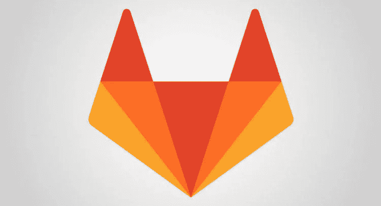
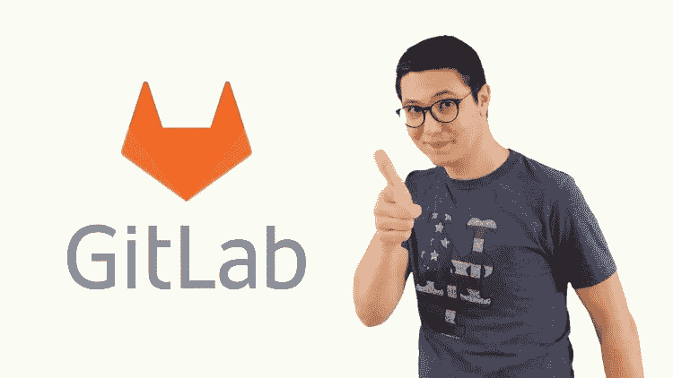
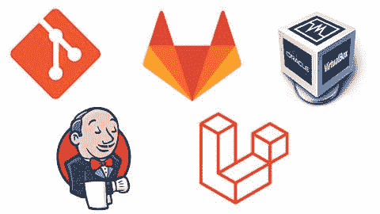
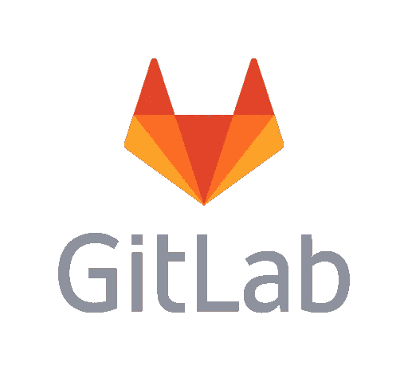

# 2023 年开发人员和 DevOps 工程师学习 GitLab 的 7 门最佳课程

> 原文：<https://medium.com/javarevisited/7-best-courses-to-learn-gitlab-for-developers-and-devops-engineers-10d4de4ae206?source=collection_archive---------0----------------------->

## 我最喜欢的学习 GitLab、持续集成、持续交付和 2023 年 DevOps 的在线课程

image_credit — Udemy

大家好，如果你想在 2023 年学习 GitLab 并寻找最好的在线课程，那么你来对地方了。之前，我已经分享了经验丰富的程序员的最佳 DevOps 课程<https://javarevisited.blogspot.com/2018/09/10-devops-courses-for-experienced-java-developers.html#axzz6hB6A1qlY>**，今天，我将分享 DevOps 工程师的最佳 GitLab 课程。**

***披露——顺便说一句，其中一些链接是附属链接，如果你使用我的链接加入这些课程，我可能会得到报酬。***

**在 DevOps 世界中有大量的工具，处理不同的 DevOps 阶段，如创建、打包、部署、保护、监控等，但 Gitlab 完成了所有这些工作，这就是 GitLab 获得大量关注的原因。**

**像高盛、英伟达、西门子这样的公司正在使用 GitLab 创建一个端到端的 DevOps 平台。你可以像 [Github](https://javarevisited.blogspot.com/2019/05/10-free-websites-to-learn-git-online.html#axzz6q75zU54y) 一样做源代码管理，像 [Jenkins](https://javarevisited.blogspot.com/2018/09/top-5-jenkins-courses-for-java-and-DevOps-Programmers.html) 和 TeamCity 一样做 CI/CD，像 [Ansible](/javarevisited/5-best-ansible-courses-for-devops-engineers-cc87692fdf52) 和 [Puppet](/javarevisited/7-best-puppet-online-courses-for-system-administrators-and-devops-engineers-889b5ab8aeca) 一样配置基础设施，等等。**

**如果你的目标是在 2023 年成为一名</hackernoon/the-2018-devops-roadmap-31588d8670cb>**devo PS 工程师，那么学习 GitLab 可能会改变游戏规则，因为有 GitLab 经验的人不多，而对拥有 GitLab 技能的 IT 专业人士的需求很大。****

****如果你已经在考虑在 2023 年学习 GitLab，并寻找*最好的 Gitlab CI/CD 课程*，那么你来对地方了。这份名单包括来自 [Udemy](https://click.linksynergy.com/deeplink?id=CuIbQrBnhiw&mid=39197&murl=https%3A%2F%2Fwww.udemy.com%2F) 、 [Pluralsight](http://pluralsight.pxf.io/c/1193463/424552/7490?u=https%3A%2F%2Fwww.pluralsight.com%2Flearn) 和 [LinkedIn Learning](http://linkedin-learning.pxf.io/c/1193463/449670/8005?u=https%3A%2F%2Fwww.linkedin.com%2Flearning%2Fsubscription%2Fproducts) 等网站的最佳 GitLab 课程，这些课程被数百万开发者用来学习技术技能。****

****这些在线培训课程也是由专家创建的，并且已经被许多想要学习 GitLab 平台的开发人员使用。我还确保只包括负担得起的课程，这样你就可以在不倾家荡产的情况下学习这项有用的技能。

如果你还在考虑学习 GitLab 是否值得，那么让我告诉你，有了 GitLab，你可以获得作为单一应用交付的完整 DevOps 平台——一个界面、一个对话线程、一个数据存储，零麻烦。****

****这对公司来说是一个很大的话题，这也是许多公司采用 GitLab 的原因。它已经被全球 100，000 多个组织使用！

GitLab 帮助高盛每两周进行一次构建，到每天成千上万次构建，WorldLine 将他们的代码审查潜力提高了 120 倍，这是巨大的。这些只是一些案例研究，总的趋势是 GitLab 已经帮助客户快速交付更好的软件，这是 GitLab 的主要目标，也是你应该在 2023 年学习 GitLab 的原因****

# ****2023 年 DevOps 工程师要参加的 7 门最佳 GitLab 课程****

****在不浪费你更多时间的情况下，这里列出了 2023 年学习 GitLab 的最佳在线课程。这些是来自 [Udemy](https://click.linksynergy.com/deeplink?id=CuIbQrBnhiw&mid=39197&murl=https%3A%2F%2Fwww.udemy.com%2F) 、 [Pluralsight](http://pluralsight.pxf.io/c/1193463/424552/7490?u=https%3A%2F%2Fwww.pluralsight.com%2Flearn) 和 [LinkedIn Learning](http://linkedin-learning.pxf.io/c/1193463/449670/8005?u=https%3A%2F%2Fwww.linkedin.com%2Flearning%2Fsubscription%2Fproducts) 的最好的 GitLab 课程，是我最喜欢的程序员和开发人员在线学习平台。****

****顺便说一下，如果你知道任何其他 GitLab 课程应该在这个列表中，但没有出现，给我留言，我会添加它。不管怎样，现在就从这个开始吧。****

## ****1. [GitLab CI:面向初学者的管道、CI/CD 和 DevOps】](https://click.linksynergy.com/deeplink?id=JVFxdTr9V80&mid=39197&murl=https%3A%2F%2Fwww.udemy.com%2Fcourse%2Fgitlab-ci-pipelines-ci-cd-and-devops-for-beginners%2F)****

****这是用 Docker 和 DevOps 学习 GitLab CI / CD 最好的 Udemy 课程。本课程由 Udemy 最畅销的讲师之一 Valentine Despa 创建，将帮助您获得宝贵的 DevOps 技能并建立管道。

在本课程中，讲师 [Valentine Despa](https://click.linksynergy.com/deeplink?id=CuIbQrBnhiw&mid=39197&murl=https%3A%2F%2Fwww.udemy.com%2Fuser%2Fvalentin-despa%2F) 从 pipeline 和 CI 等非常基础的概念开始，然后逐渐过渡到 CI/CD 和 GitLab 等更高层次的概念。这不是一门高级课程，所以不要指望它能让你成为 GitLab 专家。这是一门基础课程，涵盖了与 GitLab 相关的所有必要概念。****

****您还将学习构建 CI/CD 管道的行业“最佳实践”,使用 [AWS](/javarevisited/5-best-aws-courses-for-beginners-and-experienced-developers-to-learn-in-2021-563212409fbd?source=rss-bb36d8439904------2&utm_source=dlvr.it&utm_medium=linkedin) 解决实际作业和自动部署的问题，并构建包含代码质量检查、单元测试和 API 测试的管道。总体而言，这是 2023 年学习 GitLab CI 的绝佳课程****

****要求****

*   ****[Linux](/javarevisited/7-best-linux-courses-for-developers-cloud-engineers-and-devops-in-2021-7415314087e1) 的知识。****
*   ****使用 Linux 和终端命令的经验。****
*   ****[Git](/javarevisited/11-best-online-places-to-learn-git-for-beginners-in-2021-6dc2b7c6ef48) 基础知识。****
*   ****管理权限。****

****本课程的总视频内容为五个小时。这是一门初级课程。如果你想在 2023 年从头开始学习 GitLab，那么我强烈推荐你加入 Udemy 上的 GitLab 课程。它也很实惠，在 Udemy 上只需 10 美元就能买到。****

******这里是加入 GitLab 课程的链接** — [GitLab CI: Pipelines、CI/CD 和 DevOps for 初学者](https://click.linksynergy.com/deeplink?id=JVFxdTr9V80&mid=39197&murl=https%3A%2F%2Fwww.udemy.com%2Fcourse%2Fgitlab-ci-pipelines-ci-cd-and-devops-for-beginners%2F)****

********

## ****2. [DevOps 项目:CICD 与 Git GitLab Jenkins 和 Laravel](https://click.linksynergy.com/deeplink?id=JVFxdTr9V80&mid=39197&murl=https%3A%2F%2Fwww.udemy.com%2Fcourse%2Fdevops-project-cicd-with-git-gitlab-jenkins-and-laravel%2F)****

****这是 Udemy 的另一个精彩的 GitLab 课程，学习如何使用 Git Gitlab 和 Jenkins for CI/CD 将 Laravel 应用程序部署到生产环境中。这是一门基于项目的课程，你将在实践中学习。****

****本课程由 [Dare Soremi](https://click.linksynergy.com/deeplink?id=CuIbQrBnhiw&mid=39197&murl=https%3A%2F%2Fwww.udemy.com%2Fuser%2Fdare-soremi-2%2F) 创建，将教你如何建立一个本地 DevOps 实验室环境。想想虚拟专用网，如何使用 Git、GitLab 和 Jenkins 配置 CICD 管道，以及如何将 Laravel 应用程序部署到生产环境中。****

****是中级课程，总视频内容四个小时。****

****要求****

*   ****[Linux 命令的基础知识。](/javarevisited/top-10-courses-to-learn-linux-command-line-in-2020-best-and-free-f3ee4a78d0c0?source=collection_home---4------0-----------------------)****
*   ****[PHP](/javarevisited/top-10-free-courses-to-learn-php-and-mysql-for-web-development-e96e69982675) 或者 [Laravel](/javarevisited/7-best-laravel-online-courses-for-beginners-and-php-developers-61deac95f6b4) 的基础知识。****
*   ****使用 [Git](/javarevisited/7-best-courses-to-master-git-and-github-for-programmers-d671859a68b2?source=---------9------------------) 和版本控制的经验。****

****如果你是一个喜欢使用 Laravel 框架的 PHP 开发人员，并且想用 GitLab 学习 DevOps，那么这个课程适合你。在本课程中，讲师将解释如何在 GitLab、Git、Jenkins 和 Laravel 的帮助下执行 CI/CD。该课程不仅关注 GitLab，还关注 Git、Jenkins 和 Laravel。****

******以下是加入本课程的链接** — [DevOps 项目:CICD 与 Git GitLab Jenkins 和 Laravel](https://click.linksynergy.com/deeplink?id=JVFxdTr9V80&mid=39197&murl=https%3A%2F%2Fwww.udemy.com%2Fcourse%2Fdevops-project-cicd-with-git-gitlab-jenkins-and-laravel%2F)****

********

## ****3. [DevOps 项目:CICD 与 Git GitLab Jenkins 和 Django](https://click.linksynergy.com/deeplink?id=JVFxdTr9V80&mid=39197&murl=https%3A%2F%2Fwww.udemy.com%2Fcourse%2Fdevops-project-cicd-with-git-gitlab-jenkins-and-django%2F)****

****这是上一个课程的作者 Dare Soremi 的另一个课程，这个课程主要教你如何为任何 [Python](/javarevisited/8-advanced-python-programming-courses-for-intermediate-programmer-cc3bd47a4d19) 或 Django 应用程序建立一个全功能的 CICD 管道。****

****本课程与前一门课程非常相似，但本课程没有使用 [PHP](/javarevisited/top-10-free-courses-to-learn-php-and-mysql-for-web-development-e96e69982675) 和 [Laravel](https://www.java67.com/2020/07/top-5-courses-to-learn-laravel.html) ，而是使用 [Django](/javarevisited/my-favorite-courses-to-learn-django-for-beginners-2020-ac172e2ab920) 来教你 GitLab。

在本课程中， [Dare Soremi](https://click.linksynergy.com/deeplink?id=CuIbQrBnhiw&mid=39197&murl=https%3A%2F%2Fwww.udemy.com%2Fuser%2Fdare-soremi-2%2F) 将教你如何为 Python / Django 应用建立一个全功能的 CICD 管道。您将手动将 Django 应用程序部署到生产环境中，然后使用 CICD 的 [Git](https://www.java67.com/2019/04/top-5-courses-to-learn-git-and-github.html) 、 [GitLab](https://javarevisited.blogspot.com/2021/03/best-courses-to-learn-gitlab-cicd-for-devops.html) 和 [Jenkins](/javarevisited/7-best-courses-to-learn-jenkins-and-ci-cd-for-devops-engineers-and-software-developers-df2de8fe38f3) 作为管道工具来自动化这个过程。如果你正在寻找一份开发人员或 DevOps 工程师的工作，并且需要在你的简历中增加一些分数，这个课程是你应该参加的课程之一。****

******以下是加入本课程的链接** — [DevOps 项目:CICD 与 Git GitLab Jenkins 和 Django](https://click.linksynergy.com/deeplink?id=JVFxdTr9V80&mid=39197&murl=https%3A%2F%2Fwww.udemy.com%2Fcourse%2Fdevops-project-cicd-with-git-gitlab-jenkins-and-django%2F)****

********

## ****4. [Gitlab / GitLab CI 初学者:立即成为 DevOps 专家](https://click.linksynergy.com/deeplink?id=JVFxdTr9V80&mid=39197&murl=https%3A%2F%2Fwww.udemy.com%2Fcourse%2Fgitlab-for-beginners%2F)****

****这是 udemy 的另一门热门课程，这门课程是为那些想在更短的时间内了解 GitLab 的人开设的。****

****在本课程中，讲师[Startup Central](https://click.linksynergy.com/deeplink?id=CuIbQrBnhiw&mid=39197&murl=https%3A%2F%2Fwww.udemy.com%2Fuser%2Fpeterdalgaard%2F)涵盖 Git 和 GitLab 的基础知识、问题管理、CI/CD、版本控制的基础知识以及与 GitLab 相关的其他概念。****

****这是一个简短的课程，总视频内容为两个半小时。也是初级水平的课程。****

****要求****

*   ****[Git](https://javarevisited.blogspot.com/2018/01/5-free-git-courses-for-programmers-to-learn-online.html) 的基础知识。****
*   ****熟悉版本控制。****

****完成本课程后，您将对 GitLab 有很好的了解，能够规划、执行并完全控制任何 DevOps 生命周期或开发项目。****

******这里是加入本课程的链接**——[git lab/git lab CI 初学者:现在就成为 DevOps 专家](https://click.linksynergy.com/deeplink?id=JVFxdTr9V80&mid=39197&murl=https%3A%2F%2Fwww.udemy.com%2Fcourse%2Fgitlab-for-beginners%2F)****

********

## ****5.[用 GitLab 连续交付](http://linkedin-learning.pxf.io/c/1193463/449670/8005?u=https%3A%2F%2Fwww.linkedin.com%2Flearning%2Fcontinuous-delivery-with-gitlab)【领英学习】****

****这是 LinkedIn Learning 上最受欢迎的 GitLab 课程之一，之前被称为 Lynda。它是为那些熟悉 CI/CD 和 GitLab 并希望更进一步的个人准备的。****

****该在线课程包括导航 GitLab 界面、合并请求、使用 GitLab 进行协作、持续集成和持续交付、创建和运行管道以及使用 GitLab 部署项目等主题****

****要求****

*   ****GitLab 和 CI/CD 的基础知识****

****是中级课程，总视频内容两个小时。****

******以下是参加本课程**—[git lab 连续交付](http://linkedin-learning.pxf.io/c/1193463/449670/8005?u=https%3A%2F%2Fwww.linkedin.com%2Flearning%2Fcontinuous-delivery-with-gitlab)的链接****

********

****顺便说一句，你需要 LinkedIn Learning 会员才能观看这门课程，每月费用约为 29.99 美元，但你也可以通过参加他们的 [**1 个月免费试用**](http://linkedin-learning.pxf.io/c/1193463/449670/8005?u=https%3A%2F%2Fwww.linkedin.com%2Flearning%2Fsubscription%2Fproducts) 来免费观看这门课程，这是探索他们 16000 多门最新技术在线课程的好方法。****

## ****7.[使用 GitLab CLI 了解 GitLab for Auto DevOps】](https://click.linksynergy.com/deeplink?id=JVFxdTr9V80&mid=39197&murl=https%3A%2F%2Fwww.udemy.com%2Fcourse%2Flearn-gitlab-for-auto-devops-using-gitlab-cli%2F)****

****这个在线 GitLab DevOps 课程是 Udemy 上另一个受欢迎的 GitLab 课程。它是为那些想使用 GitLab 深入研究 GitLab 和 CI/CD 的人准备的。****

****在本课程中，[讲师](https://click.linksynergy.com/deeplink?id=CuIbQrBnhiw&mid=39197&murl=https%3A%2F%2Fwww.udemy.com%2Fuser%2Fpacktpublishing%2F)解释了什么是 GitLab，以及如何使用其功能来优化和自动化开发运维周期。与 GitLab 和 CI/CD 相关的各种其他概念将在本课程中详细解释。****

****这是一个初级课程，视频总内容为七个小时。****

****要求****

*   ****有版本控制的经验。****
*   ****软件开发过程的基本知识。****

****这实际上是两个课程的结合，第一个课程是学习 GitLab，在这里您将了解 GitLab 工具以及如何在您的组织中使用它们进行开发操作，而第二个课程是[使用 GitLab](https://click.linksynergy.com/deeplink?id=CuIbQrBnhiw&mid=39197&murl=https%3A%2F%2Fwww.udemy.com%2Fcourse%2Fhands-on-auto-devops-with-gitlab-ci%2F) 进行实际操作的开发操作。您将创建一个 GitLab DevOps 管道来自动化您的构建和测试。****

******以下是参加本课程的链接** — [使用 GitLab CLI 学习 GitLab for Auto DevOps】](https://click.linksynergy.com/deeplink?id=JVFxdTr9V80&mid=39197&murl=https%3A%2F%2Fwww.udemy.com%2Fcourse%2Flearn-gitlab-for-auto-devops-using-gitlab-cli%2F)****

********

****以上是 2023 年 DevOps 的**最佳 GitLab 课程**。正如我所说，GitLab 可能是目前最受欢迎的 DevOps 平台，公司正在寻找了解 GitLab 的人，这就是为什么学习 GitLab 不仅可以帮助你目前的工作，还可以增加你获得更好工作的机会。将 GitLab 添加到你的简历中会为许多公司和招聘人员提供一个与众不同的因素。****

****[GitLab](https://about.gitlab.com/) 是最流行和最强大的 [DevOps 工具](/javarevisited/10-best-kubernetes-courses-for-developers-and-devops-engineers-94c35cd3a2fd)之一。GitLab 的主要用途是简单地创建持续集成/持续部署管道。*CI/CD 不需要多个工具*。光是 GitLab 就够了。此外，它是快速和开源的。****

****最初，很难理解 GitLab。这是一个有点复杂的工具，有一些复杂的术语。但是通过适当的指导，人们可以理解 GitLab 是什么以及如何使用它。****

****要完全掌握 GitLab，应该从事实时项目。但在实时项目中使用 GitLab 之前，有必要了解 GitLab 的基本工作原理。在本文中，我们将列出有助于您了解 GitLab 的前五门课程。****

****说实话，网上能用来深入了解 GitLab 的资源并不多。我们从顶尖的教育网站上精心挑选了这五门课程。这些课程中的大部分是针对初学者的，但我们也为之前有 GitLab 经验的人提供了一些课程。

其他**程序员**和开发者的最佳资源****

*   ****[深入学习 AWS 的 10 门课程](/javarevisited/top-10-courses-to-learn-amazon-web-services-aws-cloud-in-2020-best-and-free-317f10d7c21d)****
*   ****[Web 开发人员需要学习的五大课程](https://javarevisited.blogspot.com/2018/08/top-5-react-js-and-redux-courses-to-learn-online.html)****
*   ****[Web 开发人员学习 TypeScript 的五大课程](https://javarevisited.blogspot.com/2018/07/top-5-courses-to-learn-typescript.html)****
*   ****[面向 Web 开发人员的十大 JavaScript 教程和课程](https://javarevisited.blogspot.com/2018/06/top-10-courses-to-learn-javascript-in.html)****
*   ****[初学者学习 Docker 的 5 门免费课程](/javarevisited/top-5-free-courses-to-learn-docker-for-beginners-best-of-lot-b2b1ad2b98ad)****
*   ****[面向 Java 开发者的 5 门免费 Spring 框架课程](http://www.java67.com/2017/11/top-5-free-core-spring-mvc-courses-learn-online.html)****
*   ****[2023 年学习 Web 开发的五大课程](https://javarevisited.blogspot.com/2018/02/top-5-online-courses-to-learn-web-development.html)****
*   ****[学习大数据和 Apache Spark 的 5 门课程](http://javarevisited.blogspot.com/2017/12/top-5-courses-to-learn-big-data-and.html)****
*   ****[2023 年学习 Spring Boot 的 5 大课程](https://javarevisited.blogspot.com/2018/05/top-5-courses-to-learn-spring-boot-in.html)****
*   ****[面向 Java 开发人员的最佳 Apache Kafka 课程— 2023 年](https://javarevisited.blogspot.com/2018/04/top-5-apache-kafka-course-to-learn.html)****
*   ****面向程序员的 15 门 AWS、Docker 和 Kubernetes 课程****
*   ****[2023 年学习 React Native 的 5 门课程](http://javarevisited.blogspot.sg/2018/02/5-react-native-courses-to-learn-mobile-development-using-JavaScript.html)****
*   ****[我最喜欢的免费课程学习 Maven、Jenkins 和 Docker](/javarevisited/top-10-free-courses-to-learn-maven-jenkins-and-docker-for-java-developers-51fa7a1e66f6)****
*   ****[初学者学习 Kubernetes 的 7 门免费课程](/javarevisited/7-free-online-courses-to-learn-kubernetes-in-2020-3b8a68ec7abc)****

****感谢您阅读本文。如果你觉得这些*最佳 GitLab 课程*有用，那么请与你的朋友和同事分享。如果您有任何问题或反馈，请留言。****

******P. S. —** 如果你是 DevOps 世界的新手，并且正在寻找通用的 DevOps 课程来开始你的 DevOps 之旅，那么你也可以看看[**devo PS——入门课程**](https://click.linksynergy.com/deeplink?id=CuIbQrBnhiw&mid=39197&murl=https%3A%2F%2Fwww.udemy.com%2Fcourse%2Flearn-devops%2F) ，这是由[kode cloud](https://click.linksynergy.com/deeplink?id=CuIbQrBnhiw&mid=39197&murl=https%3A%2F%2Fwww.udemy.com%2Fuser%2Fkodekloud%2F)提供的 Udemy 免费课程，已经有超过 50，000 人加入了这个课程，你也可以加入。它是免费的。****

****<https://click.linksynergy.com/deeplink?id=CuIbQrBnhiw&mid=39197&murl=https%3A%2F%2Fwww.udemy.com%2Fcourse%2Flearn-devops%2F> ****