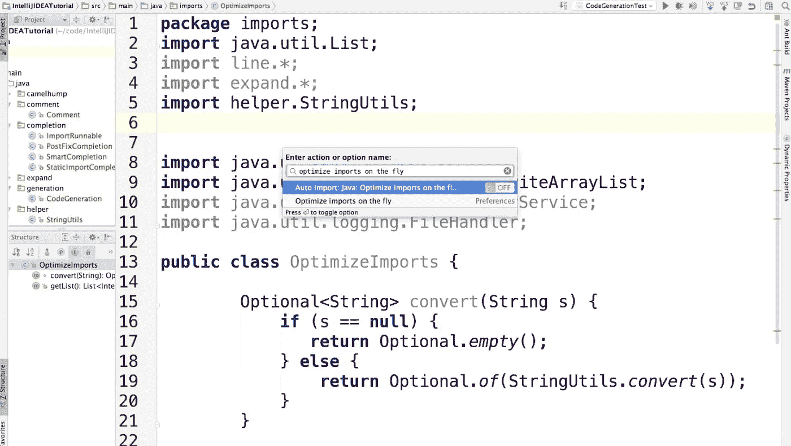
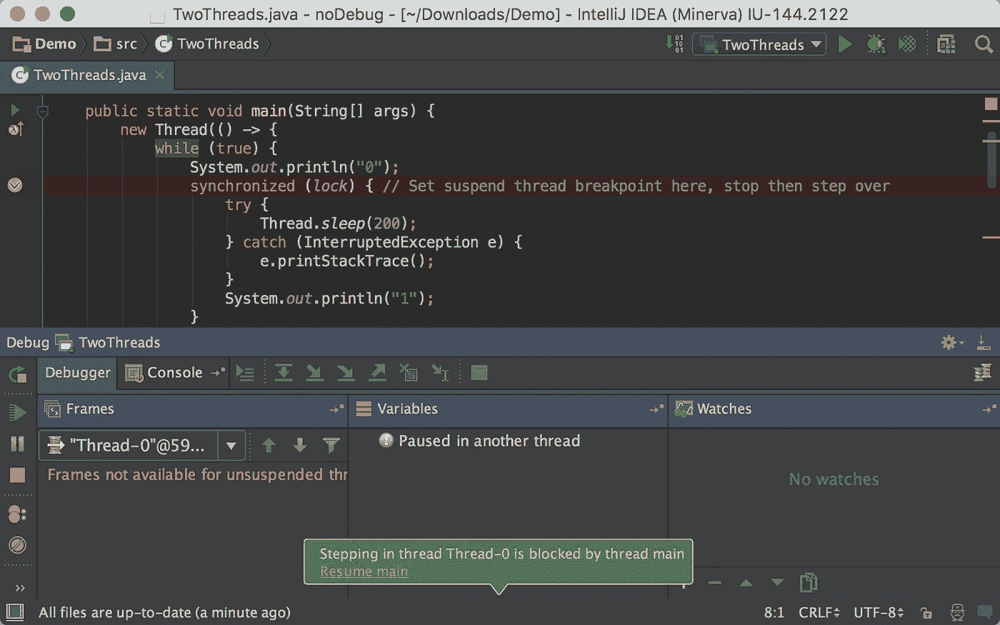
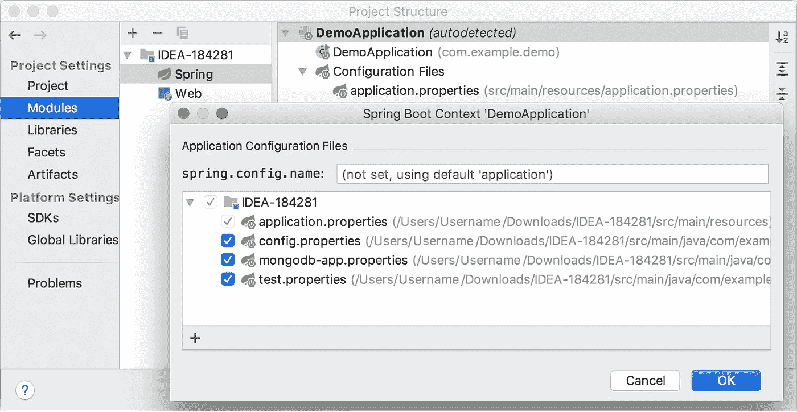
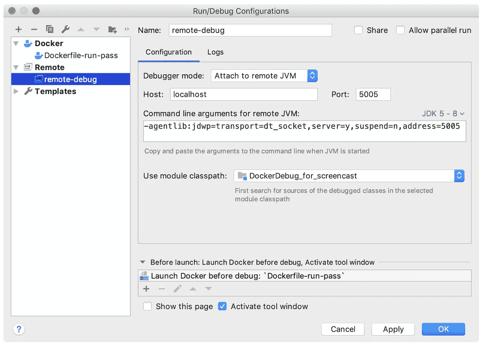
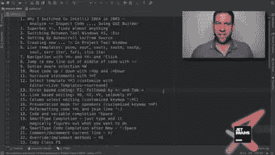
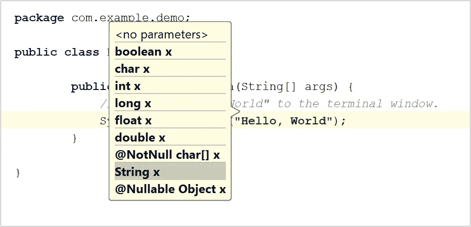

# 2023 年学习 IntelliJ IDEA 的 7 门最佳在线课程

> 原文：<https://medium.com/javarevisited/7-best-courses-to-learn-intellij-idea-for-beginners-and-experienced-java-programmers-2e9aa9bb0c05?source=collection_archive---------0----------------------->

毫无疑问， [IntelliJ IDEA](https://www.jetbrains.com/idea/) 是【Java 开发的最佳 IDE 之一，尽管 [Eclipse](https://javarevisited.blogspot.com/2018/07/top-30-eclipse-keyboard-shortcuts-java-programming.html) 可能仍会被比 IDEA 更多的人使用，主要是因为它是免费的，IntelliJ IDEA 是功能最丰富、最完整的 IDE。

Android Studio 是 Java 中 Android 开发的官方 IDE，它也基于 IntelliJ IDEA，这进一步巩固了它作为每个 Java 开发人员都应该学习的 IDE 的地位。

过去，阻止我和许多其他 Java 开发人员迁移到 IntelliJ IDEA 的唯一原因是缺乏资源，这也是我过去从 Eclipse 中感受到的不足之处。

因为 Eclipse 从一开始就是免费的，所以有大量的资源可供使用，比如[书籍](https://javarevisited.blogspot.com/2016/03/3-books-to-learn-eclipse-ide-for-java-jee-programmers.html)、[课程](http://www.java67.com/2018/02/5-free-eclipse-and-junit-online-courses-java-developers.html)和[教程](http://www.java67.com/2018/01/how-to-remote-debug-java-application-in-Eclipse.html)。

也有很多学习生产力技巧的资源，像[键盘快捷键](https://javarevisited.blogspot.com/2018/07/top-30-eclipse-keyboard-shortcuts-java-programming.html)和[调试技术](http://bit.ly/2J9SVYQ)，但是 IntelliJ IDEA 的资源并不多。

但是，正如我所说的，事情已经发生了变化。现在网上有很多有用的资源可以学习和掌握 IntelliJ IDEA 和 Android Studio。

在 [Udemy](http://javarevisited.blogspot.sg/2018/01/top-10-udemy-courses-for-java-and-web-developers.html) 和 [Pluralsight](http://javarevisited.blogspot.sg/2017/12/top-10-pluralsight-courses-java-and-web-developers.html) 上有很多很好的课程，在 Youtube 上有截屏，甚至在 [JetBrains 博客](https://blog.jetbrains.com/)上也有一些有用的内容— —你唯一需要的就是找到适合你的课程，这就是这篇文章可以帮助你的地方！

在本文中，我将分享一些**最佳 IntelliJIDEA 课程，供 Java 和 Kotlin 开发人员**学习和掌握 IntelliJ IDEA 和 Android Studio。

这些课程还会教你使用键盘快捷键、调试和导航技术，从而帮助你提高工作效率。

# 面向 Java 开发人员的 7 大智能在线培训课程

如果你是一名 Java 开发人员，正在学习 IntelliJIDEA，并且正在寻找一些很棒的课程来提高你的 IDE 技能，那么你来对地方了。

以下是我为 Java 和 Android 开发者列出的一些最好的 IntelliJ IDEA 课程。

即使你正在使用 [Kotlin](https://javarevisited.blogspot.com/2018/02/5-courses-to-learn-kotlin-programming-java-android.html) 进行 Android 开发，你也可以从 learning IDEA 中受益，并会发现其中一些课程很有用。

此外，值得注意的是，Kotlin 来自 JetBrains，这是 IntelliJ IDEA 和 Android Studio 背后的公司。

## [1。提高 Java 开发人员生产率的 IntelliJ IDEA 技巧](https://click.linksynergy.com/fs-bin/click?id=JVFxdTr9V80&subid=0&offerid=323058.1&type=10&tmpid=14538&RD_PARM1=https%3A%2F%2Fwww.udemy.com%2Fintellij-idea-secrets-double-your-coding-speed-in-2-hours%2F)

这是 Udemy 上最受欢迎的 IntelliJ IDEA 课程之一，已经有超过 3000 名学生注册。

在本课程中，您将学习 IntelliJ IDEA 的快速编码技巧，这将使您成为一名更高效的 Java 开发人员，记住:工匠和他的工具一样好。

本文作者陶和李中清是实践型软件工程师，在[大数据](http://www.java67.com/2018/05/top-5-free-big-data-courses-to-learn-Hadoop-Apache-Spark.html)领域工作。詹姆斯也曾与谷歌和亚马逊等技术巨头合作。

在日常工作中，他与 Cassandra 和 ElasticSearch 等大数据技术打交道，他是一个绝对的 [Docker](https://javarevisited.blogspot.com/2018/02/10-free-docker-container-courses-for-Java-Developers.html) 技术极客和 IntelliJIDEA 爱好者，非常注重效率和简单性。

这充分说明了你将从本课程中获得什么。简而言之，你将学习超过 70 种快捷方式来提高你的生产力(在 Mac、 [Linux](http://www.java67.com/2018/02/5-free-linux-unix-courses-for-programmers-learn-online.html) 和 Windows 上)，并学习如何使用 IntelliJ IDEA 的分析工具的神奇力量来创建更好的代码。

**这里是加入本课程的链接**—[IntelliJ IDEA Tricks to Boost Productivity for Java dev](https://click.linksynergy.com/fs-bin/click?id=JVFxdTr9V80&subid=0&offerid=323058.1&type=10&tmpid=14538&RD_PARM1=https%3A%2F%2Fwww.udemy.com%2Fintellij-idea-secrets-double-your-coding-speed-in-2-hours%2F)

## 2.[用 IntelliJ 思想重构 Java](https://click.linksynergy.com/fs-bin/click?id=JVFxdTr9V80&subid=0&offerid=323058.1&type=10&tmpid=14538&RD_PARM1=https%3A%2F%2Fwww.udemy.com%2Frefactoring-java-with-intellij-idea%2F)

除了单元测试，重构是另一种区分新手和专业开发人员的艺术，为了成为一个好的重构者，你需要一个你可以信任的工具。

虽然 [Eclipse](https://javarevisited.blogspot.com/2020/05/top-5-courses-to-learn-eclipse-ide-for-java-developers.html) 和 [NetBeans](http://javarevisited.blogspot.sg/2017/03/10-tools-used-by-java-programming-Developers.html#axzz55lrMRnNC) 都提供了强大的重构工具来重构 Java 代码，例如**将代码提取到方法**，类，并且在不破坏 IntelliJ 的重构能力的情况下改变代码的设计是无法比拟的。

IntelliJ IDEA 提供了大量的工具来使非常大的代码库的重构变得安全和没有麻烦，并且[这门课程](https://click.linksynergy.com/fs-bin/click?id=JVFxdTr9V80&subid=0&offerid=323058.1&type=10&tmpid=14538&RD_PARM1=https%3A%2F%2Fwww.udemy.com%2Frefactoring-java-with-intellij-idea%2F)将教你如何利用 IntelliJ IDEA 的内置重构来提高你的代码质量。

该课程首先展示如何使用 IntelliJ IDEA 的自动化工具重构一个小的代码库，然后建立可以毫不费力地应用于巨大源代码树的技能。

你可以把这本书和马丁·福勒的重构书一起使用，像专家一样重构 Java 代码。

**这里是加入本课程的链接**——[用 IntelliJ 思想重构 Java](https://click.linksynergy.com/fs-bin/click?id=JVFxdTr9V80&subid=0&offerid=323058.1&type=10&tmpid=14538&RD_PARM1=https%3A%2F%2Fwww.udemy.com%2Frefactoring-java-with-intellij-idea%2F)

## 3.[用 IntelliJ 思想进行 Spring Boot 和 Java 开发](https://click.linksynergy.com/fs-bin/click?id=JVFxdTr9V80&subid=0&offerid=323058.1&type=10&tmpid=14538&RD_PARM1=https%3A%2F%2Fwww.udemy.com%2Fintellij-idea-for-java-and-spring-developers%2F)

Spring Boot 真的把 Spring 的 Java 开发带到了另一个高度。它的自动配置和 starter 依赖特性消除了你在用 Spring 开发 Java 项目时面临的所有初始摩擦。

如果您将这种便利与 IntelliJ IDEA 的强大功能结合起来，您将拥有一套用于快速 Java 和 Spring 框架开发的工具和库。

在[这门课](https://click.linksynergy.com/fs-bin/click?id=JVFxdTr9V80&subid=0&offerid=323058.1&type=10&tmpid=14538&RD_PARM1=https%3A%2F%2Fwww.udemy.com%2Fintellij-idea-for-java-and-spring-developers%2F)中，你将学习如何用 IntelliJ IDEA 开发和运行一个 [Spring Boot](https://javarevisited.blogspot.com/2018/02/top-5-spring-microservices-courses-with-spring-boot-and-spring-cloud.html) 项目，**学习 IntelliJ IDEA 键盘快捷键**，用 IntelliJ 调试和测试 Java 应用，在 IntelliJ IDEA 中轻松搜索和编辑源代码。简而言之，Java 和 Spring 开发人员的完美课程。

**这里是加入本课程的链接** — [用 IntelliJ 思想进行 Spring Boot 和 Java 开发](https://click.linksynergy.com/fs-bin/click?id=JVFxdTr9V80&subid=0&offerid=323058.1&type=10&tmpid=14538&RD_PARM1=https%3A%2F%2Fwww.udemy.com%2Fintellij-idea-for-java-and-spring-developers%2F)

## 4.[成为 IntelliJ 思想大师](http://https://click.linksynergy.com/fs-bin/click?id=JVFxdTr9V80&subid=0&offerid=323058.1&type=10&tmpid=14538&RD_PARM1=https%3A%2F%2Fwww.udemy.com%2Fexperience-intellij%2F)

我之前说过，工匠和他的工具一样好，Java 开发者和他的 IDE 一样好。但是有了 IntelliJ IDEA，你还需要学习如何利用 IDEA 的所有力量。

如果您刚刚开始使用 IntelliJ IDEA，那么您应该像专业人士一样学习和使用 IDEA。

[本课程](http://https://click.linksynergy.com/fs-bin/click?id=JVFxdTr9V80&subid=0&offerid=323058.1&type=10&tmpid=14538&RD_PARM1=https%3A%2F%2Fwww.udemy.com%2Fexperience-intellij%2F)将教你如何使用自动完成和智能完成更快地编写代码，快速查找和替换所有文件中的文本，轻松导航你的代码库，并从 IntelliJ 中构建和运行 Java 程序(无需使用命令行)。

**这是加入本课程的链接**——[成为 IntelliJ 思想大师](http://https://click.linksynergy.com/fs-bin/click?id=JVFxdTr9V80&subid=0&offerid=323058.1&type=10&tmpid=14538&RD_PARM1=https%3A%2F%2Fwww.udemy.com%2Fexperience-intellij%2F)

## 5. [Java 和 Android IntelliJ Wizardry Lite 与 Heinz Kabutz](https://javaspecialists.teachable.com/p/intellij-wizardry?affcode=92815_johrd7r8)

如果你从事 Java 开发已经有几年了，那么你可能听说过 Heinz Kabutz 博士，他是 Java 冠军之一，也是著名的 [Java 并发](https://learning.javaspecialists.eu/courses/concurrency-in-practice-bundle?affcode=92815_johrd7r8)和[设计模式](http://bit.ly/2L7psTI)课程的作者。

他也是 IntelliJ IDEA 最有影响力的用户之一，并在他的课程中使用它，如果您参加过他的任何网络研讨会或讲座，他的 IntelliJ 技能肯定会引起您的注意。

在这个[实践课程](https://javaspecialists.teachable.com/p/intellij-wizardry?affcode=92815_johrd7r8)中，Heinz 分享了他的大部分神奇的 IntelliJIDEA 技巧，任何 [Java](http://javarevisited.blogspot.sg/2017/11/top-5-free-java-courses-for-beginners.html) 或 [Android](http://javarevisited.blogspot.sg/2017/12/top-5-android-online-training-courses-for-Java-developers.html) 开发人员都可以使用 IntelliJ IDEA 或 Android Studio 来提高工作效率。

如果你真的想在 IntelliJ IDEA 上提高你的生产力，我强烈推荐这个课程。

**这里是加入本课程的链接** — [Java 和 Android IntelliJ wizard ry Lite With Heinz Kabutz](https://javaspecialists.teachable.com/p/intellij-wizardry?affcode=92815_johrd7r8)

## 6.[掌握 IntelliJ IDEA 和 Android Studio](https://click.linksynergy.com/deeplink?id=JVFxdTr9V80&mid=39197&murl=https%3A%2F%2Fwww.udemy.com%2Fcourse%2Fmastering-intellij-idea-and-android-studio%2F)

如果你想学习用于移动应用开发的 IntelliJ IDEA，那么这个课程就是为你准备的。它将教你 Android Studio，这是开发 Android 应用程序最流行的 ide 之一，也是基于 IntelliJ IDEA 的。

由@Tim Buchalaka 和他的团队创建的这个课程将教你关于 Android studio 和 IntelliJ 本身需要知道的一切。该课程长达 10 个小时，是 Udemy 上关于智能的最全面的课程之一

**这里是加入本课程的链接**——[掌握 IntelliJ IDEA 和 Android Studio](https://click.linksynergy.com/deeplink?id=JVFxdTr9V80&mid=39197&murl=https%3A%2F%2Fwww.udemy.com%2Fcourse%2Fmastering-intellij-idea-and-android-studio%2F)

## 7.[用 IntelliJ 思想调试 Java】](https://click.linksynergy.com/deeplink?id=JVFxdTr9V80&mid=39197&murl=https%3A%2F%2Fwww.udemy.com%2Fcourse%2Fjava-debugging-with-intellij-idea%2F)

人们学习 IDE 的一个主要原因是为了他们的调试能力，如果你没有调试你的 Java 程序来发现错误，那么你就是在浪费大量的时间。

这也是 Java 开发人员最重要的技能之一，像 [Eclipse](https://hackernoon.com/10-best-courses-to-master-eclipse-and-junit-to-become-a-better-java-developer-y5123zak) 和 [IntellijIDEA](https://dev.to/javinpaul/5-best-courses-to-learn-intellij-idea-for-java-developers-5e6n) 这样强大的 ide 有这么多好的特性，你可以用它们在调试 Java 应用程序时找到很多有用的信息，比如变量值和集合类中的内容。

本课程将教你在 IntelliJ IDEA 中调试 Java 程序所需要知道的一切。

**这里是加入本课程的链接** — [用 IntelliJ IDEA 进行 Java 调试](https://click.linksynergy.com/deeplink?id=JVFxdTr9V80&mid=39197&murl=https%3A%2F%2Fwww.udemy.com%2Fcourse%2Fjava-debugging-with-intellij-idea%2F)

# Eclipse vs IntelliJ IDEA？Java 开发哪个好？

如果你还在考虑 Eclipse，你可能需要重新考虑，因为从下面的图表来看，Eclipse 显然已经在与 IntelliJ IDEA 的竞争中失败了，可能只是 Android Studio 扭转了对 Eclipse 的趋势。

但是，如果你仍然想学习 Eclipse，那么不要失望，我前面已经分享了许多学习 Eclipse 的[最佳课程](https://javarevisited.blogspot.com/2020/05/top-5-courses-to-learn-eclipse-ide-for-java-developers.html)，你可以选择任何一门课程来学习 Eclipse，

关于学习 Java 和 Android 开发 IntelliJ 理念的**最佳课程到此结束**。这些课程将使您的 IntelliJ IDEA 技能更上一层楼，并提高您的生产力和开发经验。

如果你有任何其他的 IntelliJ IDEA 课程想与我们分享，请在下面的评论中自由地这样做。你在这些课程中学到的大部分技巧和提示也适用于 Android Studio。

其他 **Java 编程资源**你可能喜欢:
[10 门面向高级 Java 开发者的 DevOps 课程](https://javarevisited.blogspot.com/2018/09/10-devops-courses-for-experienced-java-developers.html)
[10 本书和课程 2023 年学习 Angular](/javarevisited/top-10-angular-books-and-courses-for-beginners-and-experienced-web-developers-best-of-lot-9a2dae87f04c)
[10 门面向 Java 开发者的高级 Spring Boot 课程](/javarevisited/10-advanced-spring-boot-courses-for-experienced-java-developers-5e57606816bd)
[10 门免费课程 2023 年学习 Spring Boot](/javarevisited/10-free-spring-boot-tutorials-and-courses-for-java-developers-53dfe084587e)
[7 门课程学习 Java 中的微服务与 Spring Boot](/javarevisited/top-5-courses-to-learn-microservices-in-java-and-spring-framework-e9fed1ba804d)
[我最喜欢的课程学习 Spring Boot
初学者免费 JavaScript 教程](/javarevisited/top-10-courses-to-learn-spring-boot-in-2020-best-of-lot-6ffce88a1b6e)
[学习网页设计与开发的 7 门最佳课程](/javarevisited/7-free-online-courses-to-become-a-web-designer-and-frontend-developer-in-2020-dca73bc7fdc4)
[学习网页设计师自举的 7 门免费课程](/javarevisited/7-free-courses-to-learn-bootstrap-for-web-designers-and-developers-5135215648f1)
[2023 年学习人工智能的 7 门最佳课程](/javarevisited/7-best-courses-to-learn-artificial-intelligence-in-2020-26d59d62f6fe)
[Java 程序员的 25 道软件设计面试题](/javarevisited/25-software-design-interview-questions-to-crack-any-programming-and-technical-interviews-4b8237942db0)

## 结束语

谢谢，你坚持到了文章的结尾…祝你的 Java 开发之旅好运！

通过了解一些像 JetBrains 的 IntelliJ IDEA 这样的令人敬畏的工具，你离成为你一直想成为的更好的 Java 开发人员又近了一步。

如果你是一名经验丰富的 Java 开发人员，并且想学习更多关于 Java 工具和实践的知识来提高性能，那么我也建议你去看看 Udemy 网站上由 Michael Pogerbinsky 开设的 [**Java 多线程、并发性&性能优化**](https://click.linksynergy.com/deeplink?id=JVFxdTr9V80&mid=39197&murl=https%3A%2F%2Fwww.udemy.com%2Fcourse%2Fjava-multithreading-concurrency-performance-optimization%2F) 课程。这是我最喜欢的高级 Java 开发人员课程之一。

<https://click.linksynergy.com/deeplink?id=JVFxdTr9V80&mid=39197&murl=https%3A%2F%2Fwww.udemy.com%2Fcourse%2Fjava-multithreading-concurrency-performance-optimization%2F> 