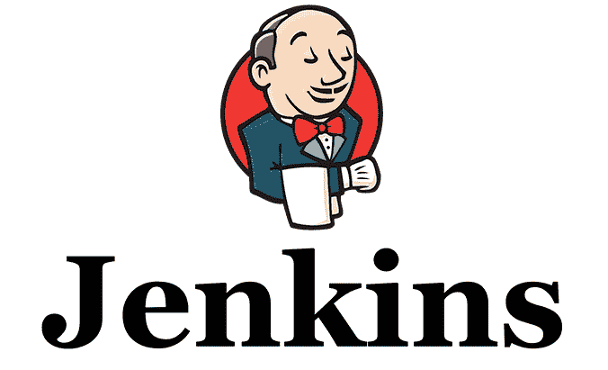
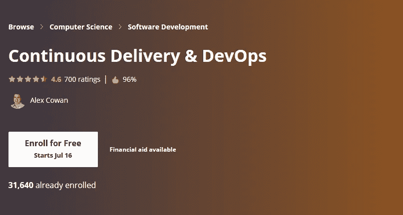
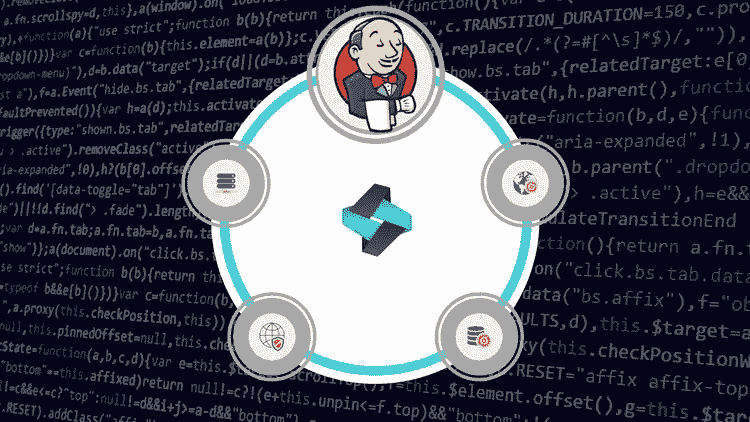

# 2023 年 DevOps 工程师和软件开发人员学习 Jenkins 和 CI/CD 的 7 门最佳课程

> 原文：<https://medium.com/javarevisited/7-best-courses-to-learn-jenkins-and-ci-cd-for-devops-engineers-and-software-developers-df2de8fe38f3?source=collection_archive---------0----------------------->

## 这些是 2023 年 Java 和 Web 开发人员从 Udemy、Coursera 和 Pluralsight 学习 Jenkins for CI/CD 和 DevOps 的最佳在线课程

在当今这个充满敏捷和 T2 的世界，Jenkins 已经成为 Java 程序员和 DevOps 工程师不可或缺的工具。Jenkins 允许您建立持续集成(CI)和持续部署(CD)管道，这降低了软件开发和交付的风险。

这意味着轻松的开发和部署。这也意味着更快的反馈，因为一旦提交到像 [Git](https://javarevisited.blogspot.com/2018/01/5-free-git-courses-for-programmers-to-learn-online.html) 这样的源代码控制系统中，Jenkins 就可以开始构建工件并运行[单元测试](https://javarevisited.blogspot.com/2018/01/10-unit-testing-and-integration-tools-for-java-programmers.html)。

如果构建由于某个问题而失败，或者如果单元测试没有通过，您会立即收到一封电子邮件。这个快速的反馈循环确保了你的代码库没有错误。就其对软件开发和运营实践的破坏而言，它也是过去十年中最引人注目的技术之一。许多人认为 [Jenkins](/javarevisited/top-10-free-courses-to-learn-maven-jenkins-and-docker-for-java-developers-51fa7a1e66f6?source=collection_home---4------3-----------------------) 通过提供持续集成和持续部署开启了 DevOps 革命。

在[敏捷](http://javarevisited.blogspot.sg/2017/06/top-5-books-to-learn-agile-and-scrum-methodology.html)时代，Jenkins 持续集成解决方案已经成为各种规模的组织提高生产力和简化软件开发的备用方案。它拥有广泛的社区支持，通过开发数千个有用的插件扩展了 Jenkins 的核心功能。

一个超过 1100 个插件的生态系统已经出现，使客户能够添加各种功能，并将 **Jenkins 与从 Active Directory 到 GitHub 再到 Tomcat** 的一切集成。

詹金斯也正在成为 [DevOps](http://www.java67.com/2018/02/5-free-docker-courses-for-java-and-DevOps-engineers.html) 的必备工具。它允许公司非常快速地构建非常复杂的构建管道，从而显著降低软件开发生命周期中的风险。

数以吨计的公司已经在使用 Jenkins 实施持续集成管道。今天，您可以在自己的台式机上使用同样的技术。

# 面向 DevOps 工程师和程序员的 7 门最佳 Jenkins 和 CI/CD 课程

事不宜迟，下面是我为 Java 程序员和 DevOps 工程师列出的一些最好的 Jenkins 课程。初级和高级程序员都可以从这些课程中受益。我注意到只选择实践课程，这些课程不仅教你理论，更重要的是，教你如何在现实世界中运用它们。

## 1.[詹金斯，从零到英雄:成为 DevOps 詹金斯大师](https://click.linksynergy.com/deeplink?id=JVFxdTr9V80&mid=39197&murl=https%3A%2F%2Fwww.udemy.com%2Fcourse%2Fjenkins-from-zero-to-hero%2F)

本课程涵盖了关于 Jenkins 的所有基础知识，并教您建立 Jenkins 构建管道所需的一切，从持续检查(构建、测试和静态分析)开始，一直到持续部署(部署到试运行和生产)。

本 10.5 课程是学习 CI/CD 和 DevOps 的绝佳资源。以下是您将在本课程中学到的重要内容:

*   深入了解什么是 Jenkins 及其工作原理
*   学习持续集成和持续部署
*   了解如何将 Jenkins 与 Docker、Ansible、AWS、GIT、Email、Maven 等集成在一起！
*   学习如何使用一系列工具设计和构建自己的工作
*   编排当今最流行的开发工具

该课程也是 Udemy 上评分最高的 Jenkins 课程之一，受到已经注册该课程的 40，800 多人的信任。它还有令人印象深刻的平均 4.3 分的评分。

**以下是加入本课程的链接**——[詹金斯，从零到英雄:成为 DevOps 詹金斯大师](https://click.linksynergy.com/deeplink?id=JVFxdTr9V80&mid=39197&murl=https%3A%2F%2Fwww.udemy.com%2Fcourse%2Fjenkins-from-zero-to-hero%2F)

## 3.[连续交货&devo PS](https://coursera.pxf.io/c/3294490/1164545/14726?u=https%3A%2F%2Fwww.coursera.org%2Flearn%2Fuva-darden-continous-delivery-devops)【Coursera】

你知道亚马逊每 11.6 秒就发布一个新代码吗？就在几年前，这是不可想象的:许多“尖端”公司会每季度发布软件。说到数字创新，速度至关重要，许多人会说这是成功最可靠的决定因素。

以下是您将在本课程中学到的重要内容:

1.  诊断团队的交付管道，并提出优先建议来改进它
2.  解释开发运维中涉及的技能集和角色，以及它们如何对持续交付能力做出贡献
3.  评审并交付整个开发栈的自动化测试
4.  解释系统运营的关键工作，以及当今领先的技术和工具如何应用于这些工作
5.  解释高功能团队如何使用开发运维及相关方法来达到持续交付能力
6.  促进优先化的、迭代的团队改进交付渠道的进展

该课程由弗吉尼亚大学达顿商学院开发，由顶级教师授课，将为您提供跨学科的技能组合，以培养您组织中的持续部署能力。

**以下是加入本课程** — [连续交付& DevOps](https://coursera.pxf.io/c/3294490/1164545/14726?u=https%3A%2F%2Fwww.coursera.org%2Flearn%2Fuva-darden-continous-delivery-devops) 的链接

顺便说一下，如果你计划参加多个 Coursera 课程或专业，那么考虑参加 [**Coursera Plus 订阅**](https://coursera.pxf.io/c/3294490/1164545/14726?u=https%3A%2F%2Fwww.coursera.org%2Fcourseraplus) ，它将为你提供无限制的访问他们最受欢迎的课程、专业、专业证书和指导项目的机会。它每月花费大约 59 美元，但它完全值得你的钱，因为你可以获得无限的证书。

 [## Coursera Plus |无限制访问 7，000 多门在线课程

### 用 Coursera Plus 投资你的职业目标。无限制访问 90%以上的课程、项目…

coursera.pxf.io](https://coursera.pxf.io/c/3294490/1164545/14726?u=https%3A%2F%2Fwww.coursera.org%2Fcourseraplus) 

## 3. [Jenkins Bootcamp:通过部署完全自动化构建](https://click.linksynergy.com/fs-bin/click?id=JVFxdTr9V80&subid=0&offerid=323058.1&type=10&tmpid=14538&RD_PARM1=https%3A%2F%2Fwww.udemy.com%2Fjenkins-continuous-integration-bootcamp%2F)

这是一门综合课程，旨在展示如何设置和运行 Jenkins CI 服务器，从持续检查(构建、测试和分析)一直到持续部署。本课程为在您的公司或工作室实施持续检查、持续集成、持续交付甚至持续部署提供了坚实的基础。

以下是您将在本课程中学到的重要内容:

*   如何在 Windows 上安装 Jenkins CI 服务器
*   如何安装和配置 Jenkins 常用的几种工具
*   理解持续检查、持续集成和持续部署的基础
*   有效地使用 Jenkins 来构建、测试、分析和部署 [Java 项目](/javarevisited/10-free-courses-to-learn-java-in-2019-22d1f33a3915?source=collection_home---4------8-----------------------)
*   应用技术和经验来实施 Jenkins 和/或持续集成系统

这个课程在 Udemy 上也很受欢迎，受到了超过 17K 人的信任，它的平均评分是 4.3 分，还不错。

**这是参加本课程的链接** — [Jenkins Bootcamp:通过部署完全自动化构建](https://click.linksynergy.com/fs-bin/click?id=JVFxdTr9V80&subid=0&offerid=323058.1&type=10&tmpid=14538&RD_PARM1=https%3A%2F%2Fwww.udemy.com%2Fjenkins-continuous-integration-bootcamp%2F)

## 4. [Jenkins:与 Java 和。网络](https://click.linksynergy.com/fs-bin/click?id=JVFxdTr9V80&subid=0&offerid=323058.1&type=10&tmpid=14538&RD_PARM1=https%3A%2F%2Fwww.udemy.com%2Fjenkins-learn-continuous-integration%2F)

这是另一门优秀的 Jenkins 课程，面向使用 [Java](/javarevisited/top-5-java-online-courses-for-beginners-best-of-lot-1e1e240a758) 或[的开发者和 DevOps 人员。网](https://javarevisited.blogspot.com/2019/10/top-5-courses-to-learn-asp-net-in-2019.html)。

在本课程中，您将了解 CI 及其重要性，Jenkins 是什么，如何使用 Jenkins 构建自动化 CI 管道，如何对[关系数据库](http://www.java67.com/2018/02/5-free-database-and-sql-query-courses-programmers.html)模式进行版本控制和管理，等等。您还将知道如何运行 CI 管道来维护构建工件、配置、保护和扩展 Jenkins、配置自动化构建通知，以及将 CI 构建与 GitHub 中托管的 Git 存储库集成。总的来说，一个完整的课程要学习詹金斯的[和](http://javarevisited.blogspot.sg/2015/01/difference-between-maven-ant-jenkins-and-hudson.html)的持续整合。

**这里是加入本课程的链接** — [Jenkins:与 Java 和。网络](https://click.linksynergy.com/fs-bin/click?id=JVFxdTr9V80&subid=0&offerid=323058.1&type=10&tmpid=14538&RD_PARM1=https%3A%2F%2Fwww.udemy.com%2Fjenkins-learn-continuous-integration%2F)

## 5.[使用管道和 Docker 与 Jenkins 一起学习 devo PS:CI/CD](https://click.linksynergy.com/fs-bin/click?id=JVFxdTr9V80&subid=0&offerid=323058.1&type=10&tmpid=14538&RD_PARM1=https%3A%2F%2Fwww.udemy.com%2Flearn-devops-ci-cd-with-jenkins-using-pipelines-and-docker%2F)

本课程将教你如何使用詹金斯使用詹金斯 DSL 和詹金斯管道(詹金斯文件)。这是一种使用詹金斯的新方法，而不是使用自由式项目。

我称之为使用詹金斯的 [DevOps](https://hackernoon.com/the-2018-devops-roadmap-31588d8670cb) 方式！我将向您解释作为代码和自动化的基础设施，以确保您理解 Jenkins Pipelines 如何适应这种新的思维方式。

在本课程中，您还将学习如何将 Jenkins 管道与流行的软件工具集成，如: [Docker](https://hackernoon.com/10-free-courses-to-learn-docker-for-programmers-and-devops-engineers-7ff2781fd6e0) 、 [GitHub](https://javarevisited.blogspot.com/2018/01/5-free-git-courses-for-programmers-to-learn-online.html) / Bitbucket、JFrog Artifactory、SonarQube、Onelogin(使用 SAML)等。

如果你在 DevOps 领域找工作，Jenkins 是必备技能，本课程提供了你开启 DevOps 之旅所需的所有信息。

**以下是加入本课程的链接** — [与 Jenkins 一起使用管道和 Docker 学习 devo PS:CI/CD](https://click.linksynergy.com/fs-bin/click?id=JVFxdTr9V80&subid=0&offerid=323058.1&type=10&tmpid=14538&RD_PARM1=https%3A%2F%2Fwww.udemy.com%2Flearn-devops-ci-cd-with-jenkins-using-pipelines-and-docker%2F)

## 6.[与 Jenkins 一起构建现代 CI/CD 渠道](https://pluralsight.pxf.io/c/1193463/424552/7490?u=https%3A%2F%2Fwww.pluralsight.com%2Fcourses%2Fjenkins-introduction)

这是一个很好的初学者课程，旨在展示如何从持续检查(构建、测试和分析)开始设置和运行 Jenkins CI 服务器，以及如何使用 Jenkins 自动化大部分构建和部署流程。

以下是您将在本课程中学到的关键技能:

1.  编写 Jenkins 管道的基础知识
2.  基本语法和表达。
3.  如何在 [GitHub](/javarevisited/7-best-courses-to-master-git-and-github-for-programmers-d671859a68b2) 中发布你的管道代码？
4.  如何从共享库中导入函数和管道代码？

完成本课程后，您将具备 DevOps 工程师创建、版本化和部署管道代码所需的技能和知识。

**以下是加入本课程的链接** — [J](https://click.linksynergy.com/deeplink?id=JVFxdTr9V80&mid=39197&murl=https%3A%2F%2Fwww.udemy.com%2Fcourse%2Fcontinous-integration-jenkins-pipelines%2F) [詹金斯持续集成入门](https://pluralsight.pxf.io/c/1193463/424552/7490?u=https%3A%2F%2Fwww.pluralsight.com%2Fcourses%2Fjenkins-introduction)

关于本课程，需要提及的另一件重要事情是，您需要 Pluralsight 会员资格才能参加本课程，费用约为每年 299 美元或每月 29 美元，但幸运的是，Pluralsight 现在正在推出一项快速优惠，为您提供年度会员资格的 [$100 折扣](http://pluralsight.pxf.io/c/1193463/424552/7490?u=https%3A%2F%2Fwww.pluralsight.com%2Flearn)(该优惠可能随时到期，因此请检查是否看到正确的价格)。这使得它甚至比网飞订阅还便宜，为什么不呢？毕竟这是软件开发人员的网飞。

plural sight 会员提供超过 6000 门最新技术课程。根据我的经验，这是让自己跟上软件开发世界不断变化的最好方法。

最后但并非最不重要的一点是，Pluralsight 还提供了 [**10 天免费试用**](http://pluralsight.pxf.io/c/1193463/424552/7490?u=https%3A%2F%2Fwww.pluralsight.com%2Flearn) ，无需承担任何义务，这意味着您只需签署免费试用即可免费使用本课程。

## 7.为绝对初学者开设的詹金斯大师班——动手开发

这是学习 Jenkins Automate CI/CD with code pipeline、AWS CodeDeploy CodePipeline 在 Udemy 上使用 Jenkins for DevOps 的另一个很好的实践课程。

以下是您将在本课程中学到的关键技能:

*   理解 [DevOps](/javarevisited/10-free-courses-to-learn-docker-and-devops-for-frontend-developers-691ac7652cee?source=---------94------------------) 持续检查、持续集成和持续部署的概念，以及它们之间的区别。
*   如何创建多阶段 Jenkins 作业，并使用 Jenkins build pipeline 插件可视化复杂的 Jenkins build pipeline。
*   对 Jenkins 有深入的了解，并有信心帮助您的公司或您自己的项目应用正确的 Jenkins 工作流，并不断交付更好的软件。
*   [DevOps](/javarevisited/top-10-courses-to-learn-devops-for-experienced-programmers-d93b666db151) 和詹金斯持续交付管道的关键概念
*   如何使用 Jenkins Pipeline 和 JenkinsFile，CI 新概念作为代码
*   如何探索 Jenkins Pipeline 来构建、测试和部署项目
*   如何在 Jenkins 环境中使用 Docker 容器

总的来说，这是一个很好的在线培训课程，可以了解 Jenkins 的基础知识和建立 Jenkins 构建管道所需的一切，从持续检查(构建、测试和静态分析)开始，一直到持续部署(部署到试运行和生产)。

**这是加入本课程的链接**——[绝对初学者的詹金斯大师班——动手开发](https://click.linksynergy.com/deeplink?id=JVFxdTr9V80&mid=39197&murl=https%3A%2F%2Fwww.udemy.com%2Fcourse%2Fcontinous-integration-jenkins-pipelines%2F)

以上是学习 Jenkins 和持续集成的一些**最佳在线培训课程**。如果你是一个有 5 年以上经验的高级 Java 开发人员，那么学习 Jenkins、CI、CD 和其他 DevOps 工具和框架可以提升你的形象。

它也能给你的职业生涯带来推动，并可能在你晋升到目前的工作岗位上发挥重要作用。我强烈鼓励所有高级 Java 开发人员在今年学习 [Jenkins](https://javarevisited.blogspot.com/2018/09/top-5-jenkins-courses-for-java-and-DevOps-Programmers.html) 、 [Docker](/javarevisited/top-15-online-courses-to-learn-docker-kubernetes-and-aws-for-fullstack-developers-and-devops-d8cc4f16e773) 和其他 DevOps 工具。

其他 **Java 和开发课程**你可能喜欢
[10 门面向 Java 和 DevOps 专业人士的免费 Docker 课程](https://javarevisited.blogspot.sg/2018/02/10-free-docker-container-courses-for-Java-Developers.html)
[5 门免费 Selenium 课程学习自动化测试](https://javarevisited.blogspot.sg/2018/02/top-5-selenium-webdriver-with-java-courses-for-testers.html)
[10 门课程学习 Docker 和 Kubernetes 2023 年](https://dev.to/javinpaul/top-10-courses-to-learn-docker-and-kubernetes-for-programmers-4lg0)
[6 门面向 Java 开发人员的 Maven 课程](http://www.java67.com/2018/02/6-free-maven-and-jenkins-online-courses-for-java-developers.html)
[10 门面向前端开发人员的免费 Docker 课程](/@javinpaul/10-free-courses-to-learn-docker-and-devops-for-frontend-developers-691ac7652cee) Java 开发者 2023 年应该学习的东西
[10 个培训课程深入学习 devo PS](https://dev.to/javinpaul/top-10-devops-training-courses-for-programmers-and-software-developers-195n)
[3 个 Java 开发者可以从 Spring 框架中学习的最佳实践](https://javarevisited.blogspot.com/2018/06/3-best-practices-java-programmers-can-learn-from-spring-framework.html)
[10 个工具 Java 开发者 2023 年应该学习的 10 个工具](http://www.java67.com/2018/04/10-tools-java-developers-should-learn.html)
[5 个免费的 Spring 框架和 Spring Boot 课程](http://www.java67.com/2017/11/top-5-free-core-spring-mvc-courses-learn-online.html)
[5 个面向 Java JEE 开发者的 Hibernate 和 JPA 课程](http://javarevisited.blogspot.sg/2018/01/top-5-hibernate-and-jpa-courses-for-java-programmers-learn-online.html)

感谢阅读本文 如果你觉得这些*最佳免费课程*有用，那么请在脸书和 LinkedIn 上与你的朋友和同事分享。如果您有任何问题或反馈，请留言。

**P. S.** —如果你正在寻找一些免费的詹金斯课程，你应该查看 Udemy 上的 [**詹金斯入门:初学者的关键概念**](https://click.linksynergy.com/deeplink?id=JVFxdTr9V80&mid=39197&murl=https%3A%2F%2Fwww.udemy.com%2Fcourse%2Fjenkins-quick-start%2F) 课程。这是完全免费的，你只需要一个 Udemy 帐户就可以加入这个课程。

 [## 免费 Jenkins 教程-Jenkins 入门:初学者的关键概念

### Linux 学院是建立在这样一个信念上的，即提供高质量的，深入的培训应该在一个…

udemy.com](https://click.linksynergy.com/deeplink?id=JVFxdTr9V80&mid=39197&murl=https%3A%2F%2Fwww.udemy.com%2Fcourse%2Fjenkins-quick-start%2F)