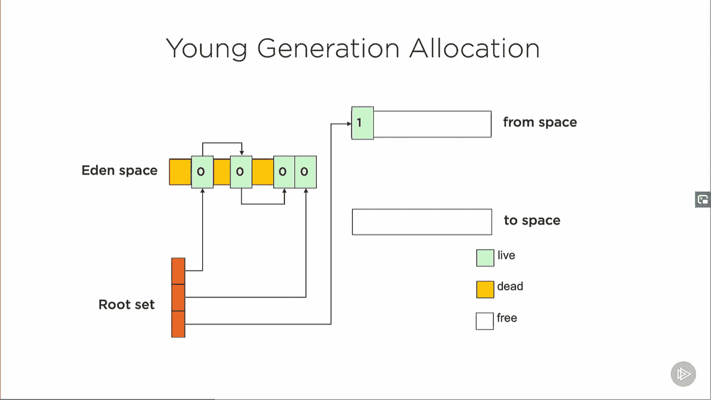
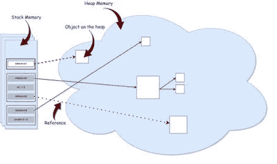
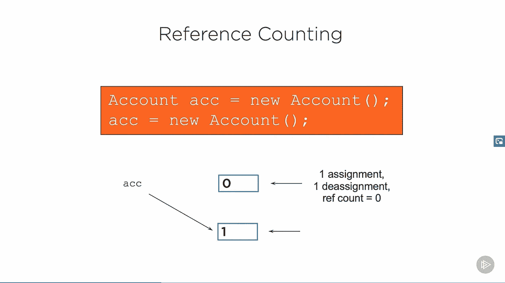
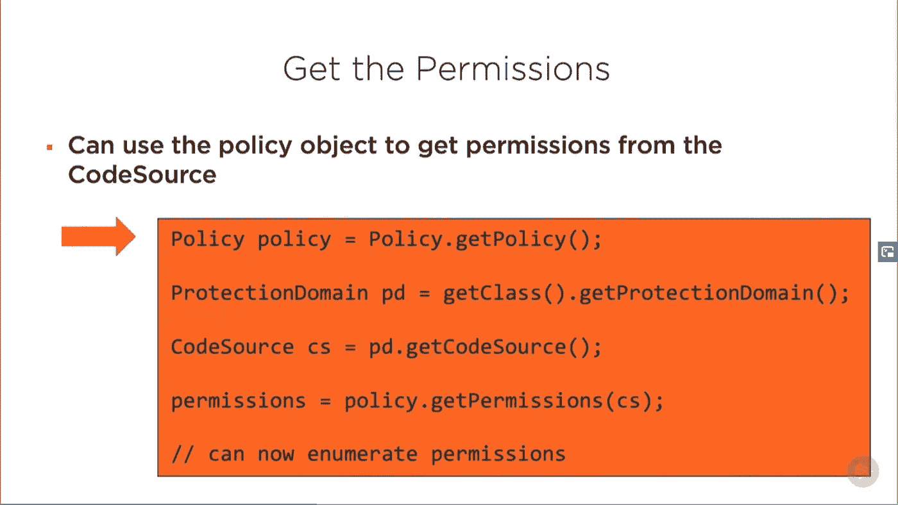
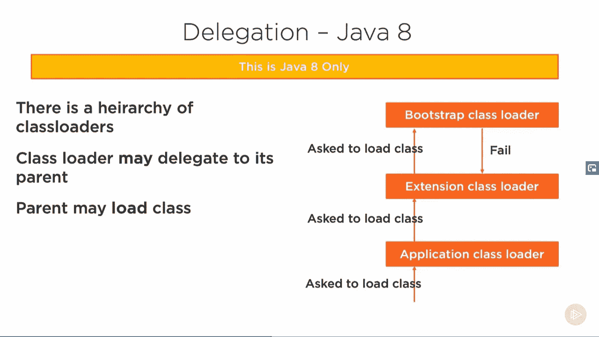

# 2023 年学习 JVM、垃圾收集和性能调优的 7 门最佳课程

> 原文：<https://medium.com/javarevisited/7-best-courses-to-learn-jvm-garbage-collection-and-performance-tuning-for-experienced-java-331705180686?source=collection_archive---------1----------------------->

image_credit — [了解 Java 虚拟机:内存管理](https://pluralsight.pxf.io/c/1193463/424552/7490?u=https%3A%2F%2Fwww.pluralsight.com%2Fcourses%2Funderstanding-java-vm-memory-management)

大家好，对于一个高级 Java 开发人员来说，了解 JVM 如何工作以及如何解决内存问题是很重要的，最明显的是 Java 应用程序和 Tomcat 之类的服务器中的[内存泄漏](http://javarevisited.blogspot.sg/2013/01/threadlocal-memory-leak-in-java-web.html#axzz57W6MT09l)。您可能会想，Java 中的内存泄漏是怎么回事？

内存不是由 JVM 和垃圾收集器管理的吗？嗯，这是真的，但是糟糕的编码或者一点点粗心都会导致 Java 中的内存泄漏。如果你不知道如何配置 JVM，在[堆](https://javarevisited.blogspot.com/2011/05/java-heap-space-memory-size-jvm.html#axzz5SDsAfcC8)，和[栈](http://www.java67.com/2016/10/difference-between-heap-and-stack-memory-in-java-JVM.html)上排查内存相关问题，你会在更高的层面上纠结。

这就是为什么随着经验的增长，有经验的 Java 开发人员花一些时间学习这些高级技能是非常重要的。如果您有相同的想法，并且今年对学习 JVM 内部、内存管理、GC 和性能调优感兴趣，那么您来对地方了。

过去，我曾分享过一些[书籍](https://javarevisited.blogspot.com/2018/07/top-5-java-performance-tuning-books-for.html)和[文章](http://www.java67.com/2016/08/10-jvm-options-for-java-production-application.html)来学习 JVM 内部机制和垃圾收集，而今天，我将分享一些你可以加入的学习 JVM 内部机制和性能调优的在线课程。

实际上没有多少课程可以详细学习 JVM 内部机制和垃圾收集算法，但幸运的是，Pluarlasight 中有一个系列文章详细探讨了 [JVM 内部机制](https://javarevisited.blogspot.com/2019/04/top-5-courses-to-learn-jvm-internals.html)，涵盖了类加载、内存管理和安全性。

那是我学到了一些有用信息，需要刷新知识的时候继续去的地方。除此之外，在 Udemy 上也有一些优秀的课程，教你 JVM 的内部机制和内存管理。如果你真的想让你的 Java 技能更上一层楼，我强烈建议你学习更多关于 JVM 内部的知识；这是一个可以区分有经验的 Java 开发人员和有几年经验的 Java 开发人员的话题。

# 学习 JVM 内部机制、垃圾收集和内存管理的前 7 门课程

正如我说过的，在线学习 JVM 内部机制、内存管理和垃圾收集调优的优秀课程并不多。这些在某种程度上被认为是一个高级话题，许多 Java 开发人员都懒得去了解它们。

但是随着性能变得越来越重要，事情正在发生变化，高级 Java 开发人员应该比现在更了解 JVM。

## 1. [Java 应用性能和内存管理](https://click.linksynergy.com/deeplink?id=JVFxdTr9V80&mid=39197&murl=https%3A%2F%2Fwww.udemy.com%2Fcourse%2Fjava-application-performance-and-memory-management%2F)

如果您是一名高级 Java 开发人员，并且希望提高您的 Java 应用程序性能技能，那么这可能是开始学习的最佳课程。在本课程中，您将首先了解哪些因素会导致 Java 应用程序中的性能问题，如线程、内存、垃圾收集，以及如何解决这些问题。

它还会教你一些 Java 开发人员在设计时可用的最佳实践，比如如何做出好的编码选择以获得最佳性能。

您将了解到**配置 Java 虚拟机以在运行时提供更好性能的各种方法**。我们将深入探讨虚拟机如何管理内存和垃圾收集过程。

**以下是参加本课程** — [Java 应用性能和内存管理](https://click.linksynergy.com/deeplink?id=JVFxdTr9V80&mid=39197&murl=https%3A%2F%2Fwww.udemy.com%2Fcourse%2Fjava-application-performance-and-memory-management%2F)的链接

在这个过程中，我们将学习即时编译器、性能测试和基准测试、反编译字节码、使用 **GraalVM** 作为替代虚拟机等等。简而言之，这是有经验的 Java 开发人员的最佳课程之一，他们希望将自己的技能提升到一个新的水平。

## 2. [Java 多线程、并发&性能优化](https://click.linksynergy.com/deeplink?id=JVFxdTr9V80&mid=39197&murl=https%3A%2F%2Fwww.udemy.com%2Fcourse%2Fjava-multithreading-concurrency-performance-optimization%2F)

这是另一门优秀的课程，面向希望成为 Java 多线程、并发并行编程专家的有经验的 Java 开发人员，重点强调高性能

在这门课程中，您将学习到排除性能和内存相关问题、线程相关问题以及 JVM 特定问题所需的所有[基本工具](https://www.java67.com/2018/04/10-tools-java-developers-should-learn.html)。

正如我以前说过的，工具真的很重要，因为一个 Java 开发者和他的工具一样优秀。如果您不知道如何分析您的 Java 应用程序，那么您永远也不会知道哪个对象占用了所有的内存，代码的瓶颈在哪里。类似地，如果你不能读取线程转储，那么你就不知道你的程序到底在哪里卡住了，它们是在等待数据库响应还是另一个服务器，或者等待某个文件锁定。如果您知道正确的工具，您可以快速有效地排除故障。

**这里是加入本课程的链接**——[Java 多线程、并发&性能优化](https://click.linksynergy.com/deeplink?id=JVFxdTr9V80&mid=39197&murl=https%3A%2F%2Fwww.udemy.com%2Fcourse%2Fjava-multithreading-concurrency-performance-optimization%2F)

这个课程的好处在于，它旨在教你**【如何钓鱼】**。您将学习并发编程的基础，而不是记忆类、库或 Java APIs，从完整的基础开始，一直到多线程中非常高级的主题。

## 3. [Java 内存管理](https://click.linksynergy.com/deeplink?id=JVFxdTr9V80&mid=39197&murl=https%3A%2F%2Fwww.udemy.com%2Fjava-memory-management%2F)

对于 Java 专业人员，尤其是经验丰富的 Java 开发人员来说，这是一门非常好的课程，他们需要深入了解 Java 中内存的工作原理。

在本课程中，您将了解 JVM 内存如何划分为不同的区域，如[堆](https://javarevisited.blogspot.com/2016/10/how-to-increase-heap-size-of-eclipse-OutOfMemoryError.html)、[栈](http://javarevisited.blogspot.sg/2013/01/difference-between-stack-and-heap-java.html)、[元空间](http://javarevisited.blogspot.sg/2011/09/javalangoutofmemoryerror-permgen-space.html#axzz5DmwFLA1K)等。您还将了解 Java 中可能出现的内存泄漏类型，以及如何避免它们。

此外，您将了解可用于分析应用程序性能和检测低效内存使用的工具，例如占用过多内存的对象或导致低效[垃圾收集](https://javarevisited.blogspot.com/2011/04/garbage-collection-in-java.html#axzz4zt6jlTWS)的问题。这个课程最精彩的部分是，你不仅会学到如何发现这些问题，还会学到一些在 Java 应用中解决这些问题的实际技巧。

**这里是加入本课程** — [Java 内存管理](https://click.linksynergy.com/deeplink?id=JVFxdTr9V80&mid=39197&murl=https%3A%2F%2Fwww.udemy.com%2Fjava-memory-management%2F)的链接

简而言之，这是一门学习 JVM 内存、垃圾收集、调优 VM 和避免 Java 内存泄漏的伟大课程，并向所有 Java 程序员强烈推荐它。

## 4.[Java 虚拟机(JVM)全面介绍](https://click.linksynergy.com/deeplink?id=JVFxdTr9V80&mid=39197&murl=https%3A%2F%2Fwww.udemy.com%2Fa-comprehensive-introduction-to-java-virtual-machine-jvm%2F)

这是学习 JVM 内部的另一门极好的课程，比如类加载、反射、垃圾收集、堆、栈和字节码指令集。

在这个课程中，讲师 Dheeru Mundluru 展示了他丰富的 JVM 知识，以及一个 [Java 开发人员](https://dev.to/javinpaul/10-things-java-developer-should-learn-1nil)应该了解的 JVM 知识。第一部分简要概述了 JVM 以及一些历史，然后继续介绍更有用的东西，如反射、 [JVM 内存](https://javarevisited.blogspot.com/2012/12/invalid-initial-and-maximum-heap-size.html)、垃圾收集等。

课程对题目来说不算长也不算短。在 4 个小时内，你将会学到一些关于 JVM 的关键知识，并且对垃圾收集和它的[算法](https://dev.to/javinpaul/50-data-structure-and-algorithms-problems-from-coding-interviews-4lh2)有一个坚实的理解。

**这里是加入本课程的链接**—[Java 虚拟机(JVM)综合介绍](https://click.linksynergy.com/deeplink?id=JVFxdTr9V80&mid=39197&murl=https%3A%2F%2Fwww.udemy.com%2Fa-comprehensive-introduction-to-java-virtual-machine-jvm%2F)

## 5.[了解 Java 虚拟机:内存管理](https://pluralsight.pxf.io/c/1193463/424552/7490?u=https%3A%2F%2Fwww.pluralsight.com%2Fcourses%2Funderstanding-java-vm-memory-management)

Pluralsight 有一个关于 JVM 的精彩系列，被凯文·琼斯称为“理解 Java 虚拟机”。这是一个由三部分组成的系列，每一部分都涵盖了关键的 JVM 概念，如内存管理、类加载和反射以及安全性。

本课程是本系列的第一部分，涵盖了 Java 中[垃圾收集](https://javarevisited.blogspot.com/2012/10/10-garbage-collection-interview-question-answer.html)的各个方面，包括如何将内存分成几代并进行管理。以及不同的垃圾收集器(如并发标记清除和 G1 垃圾收集器)是如何工作的。

本课程还涵盖了一些高级概念，允许你与垃圾收集进行交互，比如软引用、[弱引用](https://javarevisited.blogspot.com/2014/03/difference-between-weakreference-vs-softreference-phantom-strong-reference-java.html)和幻象引用类。

**这里是加入本课程** — [了解 Java 虚拟机:内存管理](https://pluralsight.pxf.io/c/1193463/424552/7490?u=https%3A%2F%2Fwww.pluralsight.com%2Fcourses%2Funderstanding-java-vm-memory-management)的链接

## 6.[了解 Java 虚拟机:安全性](https://pluralsight.pxf.io/c/1193463/424552/7490?u=https%3A%2F%2Fwww.pluralsight.com%2Fcourses%2Funderstanding-java-vm-security)

这是 Pluralsight 上“理解 Java 虚拟机”系列的第三部分，它主要关注安全性。如果您还记得的话，Java 安全性是围绕权限和策略的思想构建的。Java 代码根据当前有效的策略被授予权限。

在本课程中，您将学习安全管理器和访问控制器如何携手提供这种安全性。本课程还讲述了如何设置安全管理器，以及如何设置和编辑策略文件来授予代码所需的权限级别。

最后，它涵盖了“特权范围”的概念，它允许代码被授予一些权限，即使它们周围的代码应该导致授予失败。

**这里是加入本课程的链接** — [了解 Java 虚拟机:安全性](https://pluralsight.pxf.io/c/1193463/424552/7490?u=https%3A%2F%2Fwww.pluralsight.com%2Fcourses%2Funderstanding-java-vm-security)

总的来说，这是一门深入学习 JVM 安全性的综合课程，是任何想要掌握 JVM 内部知识的高级 Java 开发人员的必修课。

## 7.[了解 Java 虚拟机:类加载和反射](https://pluralsight.pxf.io/c/1193463/424552/7490?u=https%3A%2F%2Fwww.pluralsight.com%2Fcourses%2Funderstanding-java-vm-class-loading-reflection)

这是“理解 Java 虚拟机”系列的第二部分，重点是类加载和反射。

虽然本课程并不要求按任何顺序进行，但你可以先选择你想学的话题，然后再进一步探索。

在这个课程中，你将学习如何使用类加载机制工作以及如何编写类加载器。一旦理解了这个概念，就可以理解 Java 应用程序中类的热部署以及类的并行加载是如何工作的。您还将了解 Java 中的[类加载器](https://javarevisited.blogspot.com/2012/12/how-classloader-works-in-java.html#axzz5Y4KhSOWu)是如何工作的。

**这里是加入本课程的链接** — [了解 Java 虚拟机:类加载和反射](https://pluralsight.pxf.io/c/1193463/424552/7490?u=https%3A%2F%2Fwww.pluralsight.com%2Fcourses%2Funderstanding-java-vm-class-loading-reflection)

本课程涉及的另一个主题是反射，这是另一个帮助您与 JVM 交互的工具。Java 有丰富的类型系统和元数据。反射是一种机制，通过这种机制，您可以在运行时检查元数据，并使用该信息构建丰富的应用程序，如[工具](http://javarevisited.blogspot.sg/2017/03/10-tools-used-by-java-programming-Developers.html#axzz55lrMRnNC)，ide，如 [Eclipse](http://www.java67.com/2018/02/5-free-eclipse-and-junit-online-courses-java-developers.html) 和 [IntelliJIDEA](https://itnext.io/top-5-intellijidea-and-android-studio-courses-for-java-and-android-programmers-afcc27309b60) 等。

顺便说一句，你需要一个 Pluralsight 会员来访问这三个 JVM 在线课程，费用大约是每月 29 美元或每年 299 美元(14%的折扣)。

如果你还没有 [Pluralsight 会员资格](https://pluralsight.pxf.io/c/1193463/424552/7490?u=https%3A%2F%2Fwww.pluralsight.com%2Fpricing)，我鼓励你申请一个，因为它可以让你访问他们的 5000 多个在线课程，涉及所有最新的主题，如前端和后端开发、机器学习等。它还包括交互式测验、练习和最新的认证材料。

他们还提供了 [**10 天的免费试用**](https://pluralsight.pxf.io/c/1193463/424552/7490?u=https%3A%2F%2Fwww.pluralsight.com%2Flearn) 而没有任何承诺，这不仅是免费访问这门课程的好方法，也是在加入 Pluralsight 之前检查课程质量的好方法。

 [## 对个人来说

### Pluralsight 帮助个人学习者获得掌握最新软件开发所需的技术技能…

pluralsight.pxf.io](https://pluralsight.pxf.io/c/1193463/424552/7490?u=https%3A%2F%2Fwww.pluralsight.com%2Flearn) 

这就是学习 JVM 内部机制、垃圾收集和内存管理的一些最好的课程。您还将学习如何用 Java 在 Java 应用程序中寻找内存泄漏并修复它们。

就像我过去说过的，那么学习 JVM 内部和垃圾回收的优秀课程并不多，但这些是我目前为止得到的最好的。你也可以将这些课程与像《阿瓦表演权威指南》这样的书结合起来，这样可以两全其美。

其他**你可能喜欢的 Java 编程文章**

*   [2023 年 Java 开发者路线图](https://javarevisited.blogspot.com/2019/10/the-java-developer-roadmap.html)
*   [10 门免费数据结构与算法课程](http://www.java67.com/2019/02/top-10-free-algorithms-and-data.html)
*   [Spring MVC 在 Java 内部是如何工作的？](https://javarevisited.blogspot.com/2017/06/how-spring-mvc-framework-works-web-flow.html)
*   [面向 Java 开发人员的 10 门高级 Spring Boot 课程](/javarevisited/10-advanced-spring-boot-courses-for-experienced-java-developers-5e57606816bd?source=collection_home---4------0-----------------------)
*   2023 年 Java 开发者应该学会的 10 件事？
*   Java 和 Web 开发人员应该学习的 10 个框架
*   【Java 开发人员必备的 10 个测试工具
*   [面向初学者和有经验程序员的 10 门免费 Java 课程](http://www.java67.com/2018/08/top-10-free-java-courses-for-beginners-experienced-developers.html)
*   [2023 年成为更好的 Java 程序员的 10 个技巧](http://javarevisited.blogspot.sg/2018/05/10-tips-to-become-better-java-developer.html)
*   [在 Java 中使用 Spring 进行 REST API 开发的 7 个理由](http://javarevisited.blogspot.sg/2018/01/7-reasons-for-using-spring-to-develop-RESTful-web-service.html#axzz55a8rTeu7)
*   [2023 年每个 Java 开发人员都应该阅读的 10 本书](http://www.java67.com/2018/02/10-books-java-developers-should-read-in.html)
*   [深入学习 Java 并发的 5 门课程](https://javarevisited.blogspot.com/2018/06/top-5-java-multithreading-and-concurrency-courses-experienced-programmers.html#axzz5kEPsvqbp)

感谢您阅读本文。如果你喜欢这些 JVM 内部*和 Java 中的内存管理课程*，那么请分享给你的朋友和同事。如果您有任何问题或反馈，请留言。

**P.S.** —如果你喜欢看书，也可以看看这个 [**书籍列表，更好地学习 JVM 和垃圾收集**](https://javarevisited.blogspot.com/2018/07/top-5-java-performance-tuning-books-for.html) 。该文件包含一些关于 JVM 内部和性能调优主题的最佳书籍。

 [## 深入学习 Java 虚拟机、垃圾收集和性能的前 5 本书

### 在过去的几年里，我看到了许多 Java 开发人员想要学习更多关于 JVM 的知识的趋势…

www.java67.com](https://www.java67.com/2019/08/best-books-to-learn-java-virtual-machine-in-depth.html) 

**P. S. S.** —如果你需要更多关于 Java 性能的课程，我还建议你去看看 Udemy 网站上 Michael Pogrebinsky 的 [**Java 多线程、并发和性能优化**](https://click.linksynergy.com/deeplink?id=JVFxdTr9V80&mid=39197&murl=https%3A%2F%2Fwww.udemy.com%2Fcourse%2Fjava-multithreading-concurrency-performance-optimization%2F) ，我非常喜欢这门课程，我强烈推荐任何想学习高性能 Java 应用程序的人。

 [## Java 多线程、并发和性能优化

### 如果你有自己的喷气式飞机，你会开着它去杂货店，还是开着它环游世界？今天…

udemy.com](https://click.linksynergy.com/deeplink?id=JVFxdTr9V80&mid=39197&murl=https%3A%2F%2Fwww.udemy.com%2Fcourse%2Fjava-multithreading-concurrency-performance-optimization%2F)