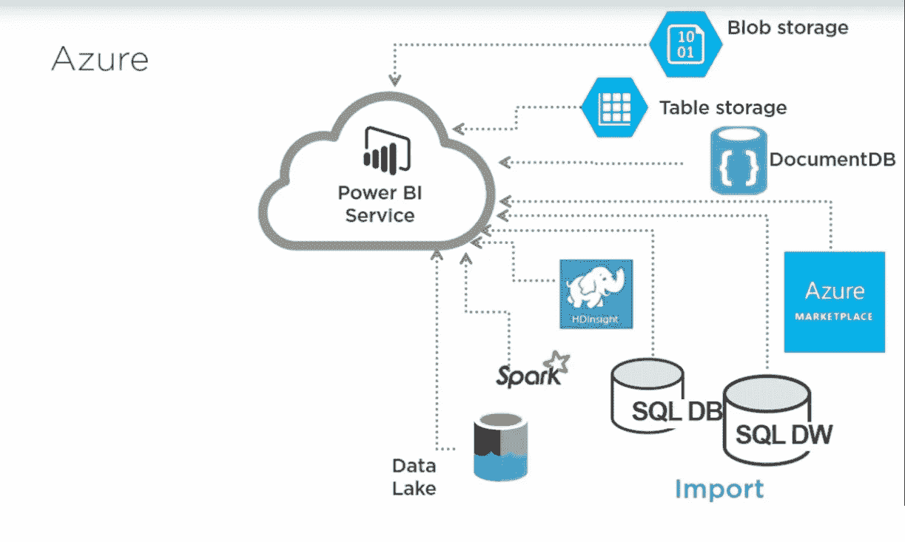
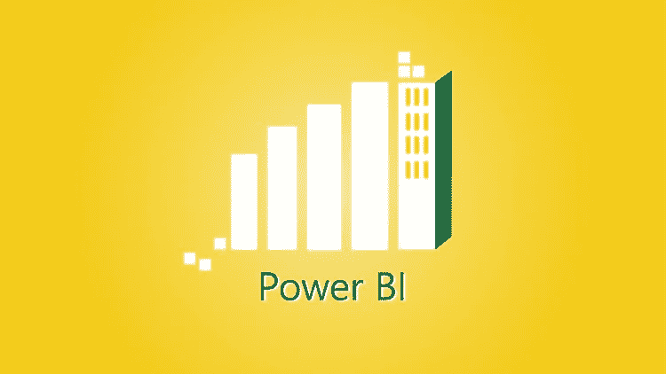
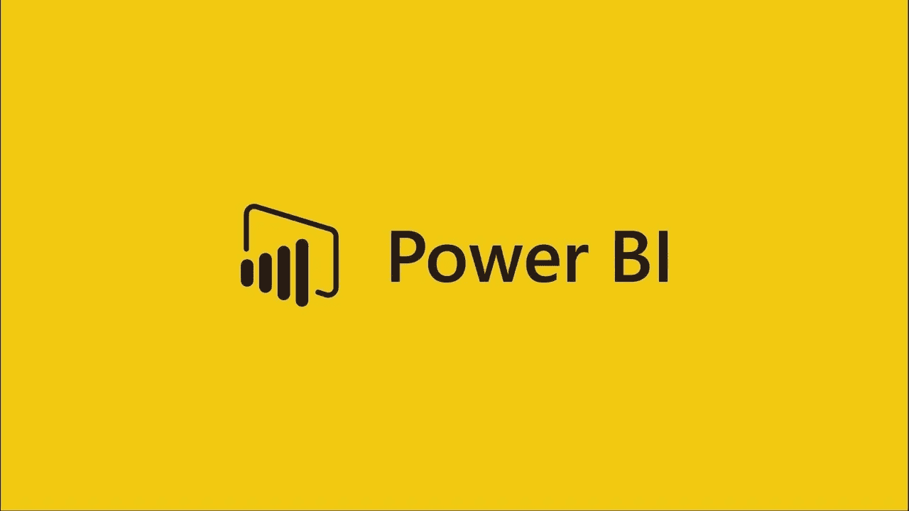
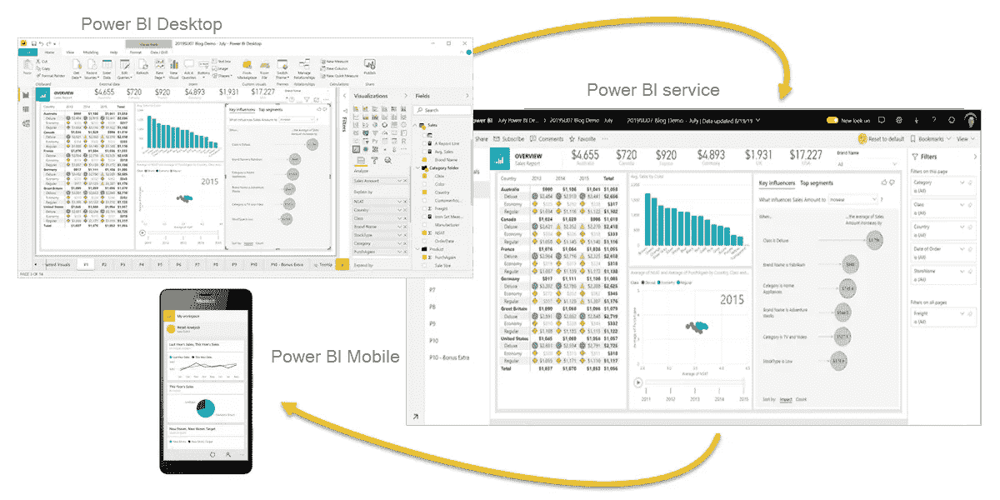

# 2023 年学习微软 Power BI 的 7 门最佳在线课程

> 原文：<https://medium.com/javarevisited/7-best-courses-to-learn-microsoft-power-bi-for-beginners-and-experienced-developers-83695c9428dc?source=collection_archive---------0----------------------->

大家好，如果你正在进行数据分析和数据可视化，那么你可能会遇到 **Microsoft Power BI** ，这是一款基于云的工具，在业务分析师和其他处理数据的技术人员中非常受欢迎。

Power BI 是微软公司提供的一种工具，可以使用您的数据创建各种类型的[可视化](https://javarevisited.blogspot.com/2019/09/top-5-courses-to-learn-d3js-best.html)，并生成令人惊叹的报告和仪表盘，以便您深入了解您的业务并做出正确的决策。

您可以在桌面上使用 Power BI，也可以在云上使用 Power BI，甚至可以在手机上作为一个应用程序使用，如何使用由您决定。

作为一名数据可视化工程师，拥有运行 [Power BI](https://javarevisited.blogspot.com/2020/07/top-5-courses-to-learn-microsoft-power-BI.html) 的技能不仅仅是一件好事，因为它让你只需按下一些按钮，就能在一个小领带上创建非常复杂的可视化。这种技能几乎在每个公司都非常需要，因为你可以帮助他们做出正确的决策并发展他们的业务。

如果你想在 2023 年学习微软 Power BI 那么你来对地方了。早些时候，我已经分享了[最佳免费 Power BI 课程](/javarevisited/10-free-microsoft-power-bi-courses-for-beginners-19ee524008e1)，在本文中，我将分享最佳在线课程，它们将帮助您掌握这一应用，并提升您在[数据可视化](https://javarevisited.blogspot.com/2019/09/top-5-courses-to-learn-microsoft-excel-macros-vba-and-data-visualization.html)方面的知识和职业生涯。

顺便说一下，如果你想学习 Power BI 以开始你的数据分析职业生涯，那么我也建议你看看 Coursera 上的 [**谷歌数据分析专业证书**](https://coursera.pxf.io/c/3294490/1164545/14726?u=https%3A%2F%2Fwww.coursera.org%2Fprofessional-certificates%2Fgoogle-data-analytics%23courses) ，这是最受欢迎的结构良好的数据分析认证之一，可以在 2023 年成为数据分析专业人员。超过 725，000 人已经加入。

<https://coursera.pxf.io/c/3294490/1164545/14726?u=https%3A%2F%2Fwww.coursera.org%2Fprofessional-certificates%2Fgoogle-data-analytics%23courses>  

# 2023 年学习微软 Power BI 的 7 门最佳在线课程

在不浪费您更多时间的情况下，这里列出了今年学习微软 Power BI 的最佳在线培训课程，用于[数据分析](https://javarevisited.blogspot.com/2019/10/top-5-courses-to-learn-pandas-for-data-analysis-python.html)、[数据分析](https://becominghuman.ai/5-best-courses-to-learn-pythons-pandas-libary-for-data-analysis-and-data-science-34b62abb0e96)和数据可视化。这些是最好的在线课程，由专家创建，对初学者和有经验的程序员都有用。

## 1.[微软 Power BI —完整介绍](https://click.linksynergy.com/deeplink?id=JVFxdTr9V80&mid=39197&murl=https%3A%2F%2Fwww.udemy.com%2Fcourse%2Fpowerbi-complete-introduction%2F)

在本课程中，您将学习 Power BI 的所有版本，例如桌面版、云版、移动版和高级版。你将从零开始，直到你有经验熟悉这个应用程序，并创建自己的项目。

从最简单的 Power BI 桌面开始，然后转向云版本，在云版本中，您将发现更先进的技术，并学习如何通过编程创建自己的视觉效果，而不是学习如何在移动设备上使用该应用程序。

在本课程中，您将学到:

*   使用各种版本的 Power BI。
*   制作自己的视觉效果。
*   使用手机访问您的仪表板。

本课程由 AcadMind 的 Maximillian Schwarzmuller 创建，他是我最喜欢的 Udemy 讲师之一，也是几本最畅销的 Udemy web 开发课程的作者。

**以下是加入本课程的链接—** [**微软 Power BI —完整介绍**](https://click.linksynergy.com/deeplink?id=JVFxdTr9V80&mid=39197&murl=https%3A%2F%2Fwww.udemy.com%2Fcourse%2Fpowerbi-complete-introduction%2F)

## 2. [Power 阿碧-Z:面向数据科学的实用 Power BI 培训！](https://click.linksynergy.com/deeplink?id=JVFxdTr9V80&mid=39197&murl=https%3A%2F%2Fwww.udemy.com%2Fcourse%2Fmspowerbi%2F)

大多数数据科学家使用 Python 或 R 等编程语言来进行可视化，并从数据中获得洞察力，但实际上，他们可以使用 power bi 工具来完成这项工作，这就是本课程的内容。

您将看到如何使用 Power BI 创建不同类型的图表、图形和漂亮的绘图，您可以使用它进行数据挖掘或生成强大的商业智能报告，以及使用来自真实世界企业的真实数据。

你将在这门课中学到:

*   **如何使用异能匕？**
*   创建各种类型的可视化。
*   创建商业智能报表。

这门课程是由基里尔·叶列缅科和他的超级数据科学团队创建的，他们在 Udemy 上创建了许多关于数据科学、机器学习和人工智能的精彩课程。

**此处是加入本课程的链接—** [**Power 阿碧-Z:数据科学实用 Power BI 培训！**](https://click.linksynergy.com/deeplink?id=JVFxdTr9V80&mid=39197&murl=https%3A%2F%2Fwww.udemy.com%2Fcourse%2Fmspowerbi%2F)

## 3.[Power BI—plural sight 入门](https://pluralsight.pxf.io/c/1193463/424552/7490?u=https%3A%2F%2Fwww.pluralsight.com%2Fcourses%2Fgetting-started-power-bi)

本课程面向希望掌握这一宝贵工具并增强其数据分析和生成更强大报告的初学者，以便从您的数据中获得更多洞察力，从而做出更好的业务决策。

在本课程中，您将学到:

*   如何创建可视化？
*   如何使用 Excel 2016？
*   增强您的数据可视化。

从如何收集和清理数据开始，然后转到如何在 Power BI 中使用这些数据并创建可视化，以及如何增强结果，本课程将介绍更多内容。

**以下是加入本课程的链接—**[**Power BI 入门— Pluralsight**](https://pluralsight.pxf.io/c/1193463/424552/7490?u=https%3A%2F%2Fwww.pluralsight.com%2Fcourses%2Fgetting-started-power-bi)

## 4.[微软 Power BI-Up&运行 Power BI 桌面](https://click.linksynergy.com/deeplink?id=JVFxdTr9V80&mid=39197&murl=https%3A%2F%2Fwww.udemy.com%2Fcourse%2Fmicrosoft-power-bi-up-running-with-power-bi-desktop%2F)

假设您了解数据可视化的基础知识，或者您知道如何使用一些编程语言来实现这一点，但您希望学习一些工具来简化您的工作，那么您应该在 Pluralsight 上看到这个入门课程。

[plural sight](https://javarevisited.blogspot.com/2019/10/udemy-vs-pluralsight-review-which-is-better-to-learn-code.html#axzz6UREzOgmx)上这两个小时的内容将向您展示如何使用 Power BI 创建有效且吸引人的报告，以及如何使用引人注目的报告增强这种可视化，并最终使其与用户互动。

您将在本课程中学习到:

*   关于功率 BI 的介绍。
*   如何创建报告和可视化。
*   如何提高你的成绩？
*   完成两个完整的指导项目

该课程由 Maven Analytics 的 Chris Dutton 和 Aaron Parry 创建，受到 74，500 多名学生的信任。它也是 Udemy 上评分最高的微软商务智能课程之一，超过 19400 名参与者的平均评分为 4.6

**以下是加入本课程的链接—** [**微软 Power BI — Up &运行 Power BI 桌面**](https://click.linksynergy.com/deeplink?id=JVFxdTr9V80&mid=39197&murl=https%3A%2F%2Fwww.udemy.com%2Fcourse%2Fmicrosoft-power-bi-up-running-with-power-bi-desktop%2F)

## 5.[功率 BI 基础— edX](https://www.awin1.com/cread.php?awinmid=6798&awinaffid=631878&clickref=&p=%5B%5Bhttps%3A%2F%2Fwww.edx.org%2Fcourse%2Fbasics-of-power-bi)

通过参加本课程，您可以学习 Power BI 工具的基础知识，从而掌握这一出色的可视化工具，而不是使用 PowerPoint 或 Excel 等其他方法。

在本课程中，您将学到:

*   电源 BI 简介。
*   分享你在 Power BI 上的工作。
*   设计一个漂亮的报告仪表板。

您还将看到关于如何使用该工具及其组件的介绍，例如如何使用 power BI 导航、分享您的作品、设计，这将教您如何向 life y data 讲述您的故事以及一份出色的 Power BI 报告。

**以下是加入本课程的链接—** [**电源 BI 基础知识— edX**](https://www.awin1.com/cread.php?awinmid=6798&awinaffid=631878&clickref=&p=%5B%5Bhttps%3A%2F%2Fwww.edx.org%2Fcourse%2Fbasics-of-power-bi)

## 6.[Tim Boles 的 Power BI 有效报告](https://pluralsight.pxf.io/c/1193463/424552/7490?u=https%3A%2F%2Fwww.pluralsight.com%2Fcourses%2Feffective-reporting-power-bi)

Power BI 使数据可视化变得非常简单，越来越多的公司使用 Power BI 从他们的数据中获得有价值的见解。

本 Pluralsight 课程将帮助您基本了解如何使用 Power BI Desktop 构建有效且引人入胜的报告。下面是你在这门课程中将学到的主要东西。如何将基本的可视化集成到报表中。
2。如何增强可视化以构建引人注目的报告？
3。完成本课程后，如何创建交互式报告和仪表板

。您将掌握 Power BI 中所有必要的技能和知识，通过清晰、引人注目的可视化方式呈现数据故事。

**以下是加入本课程的链接—** [**电力 BI 基础知识— edX**](https://www.awin1.com/cread.php?awinmid=6798&awinaffid=631878&clickref=&p=%5B%5Bhttps%3A%2F%2Fwww.edx.org%2Fcourse%2Fbasics-of-power-bi)

这是这个列表中的另一门课程，它不是来自 Udemy，你需要一个 [Pluralsight 会员](https://pluralsight.pxf.io/c/1193463/424552/7490?u=https%3A%2F%2Fwww.pluralsight.com%2Fpricing)才能进入这门课程，费用大约是每月 29 美元或每年 299 美元(14%的折扣)。或者，你也可以使用他们的 [**10 天免费试用**](https://pluralsight.pxf.io/c/1193463/424552/7490?u=https%3A%2F%2Fwww.pluralsight.com%2Flearn) 免费观看这个在线课程。

<https://pluralsight.pxf.io/c/1193463/424552/7490?u=https%3A%2F%2Fwww.pluralsight.com%2Flearn>  

## 7.[微软 Power BI [2023 版]全介绍](https://click.linksynergy.com/deeplink?id=JVFxdTr9V80&mid=39197&murl=https%3A%2F%2Fwww.udemy.com%2Fcourse%2Fpowerful-reports-and-dashboards-with-microsoft-powerbi%2F)

这是一个从零开始学习 Power BI 的绝佳课程。在本课程中，您将学习如何使用免费的 Microsoft Power BI 版本在几分钟内创建报告、分析数据和开发交互式仪表板。

要求:
1。需要具备[微软 excel](/javarevisited/5-advanced-courses-to-learn-microsoft-excel-in-depth-b556aaee5f6c)l 的基础知识
2。练习
3 需要免费的 Microsoft PowerBI 服务帐户。您需要下载微软
免费提供的 Power BI 桌面应用程序
以下是您将在本课程中学到的主要内容:
1 .如何使用 Power BI
2 创建报告和仪表板。如何使用任何设备在线发布报告和仪表板
3。如何创建数据模型并使用 DAX 公式语言开发强大的计算
4。如何使用拖放技术创建图表和高级可视化

完成本 Power BI 课程后，您将对使用 Power BI 获取和转换数据、增强数据分析以及生成报告和仪表板所需的基本技能有一个牢固的了解。

**这里是加入本课程的链接—** [微软 Power BI 全介绍【2023 版】](https://click.linksynergy.com/deeplink?id=JVFxdTr9V80&mid=39197&murl=https%3A%2F%2Fwww.udemy.com%2Fcourse%2Fpowerful-reports-and-dashboards-with-microsoft-powerbi%2F)

以上就是 2023 年**学习 Power BI 的最佳课程，面向初学者和有经验的开发者**。数据可视化是许多科学的核心，如机器学习和数据科学，以理解数据和获得洞察力，或让公司做出一些好的决策，这就是为什么你必须学习 Power BI。

而且，如果你需要一个现实世界的项目来学习微软 Power PI 那么你也可以在 Coursera 项目网上查看[**Power BI 桌面入门**](https://coursera.pxf.io/c/3294490/1164545/14726?u=https%3A%2F%2Fwww.coursera.org%2Fprojects%2Fpower-bi-desktop) 。这是 Coursera 推出的一项新服务，您可以通过 Power BI Desktop 分析信用卡违约数据来学习 Power BI。

<https://coursera.pxf.io/c/3294490/1164545/14726?u=https%3A%2F%2Fwww.coursera.org%2Fprojects%2Fpower-bi-desktop>  

而且，如果你喜欢 Coursera 的课程，因为它们是由知名公司如**谷歌**、 **IBM** 、**亚马逊**和世界上最好的大学创建的，我建议你加入 Coursera 的年度订阅计划 [**Coursera Plus**](https://coursera.pxf.io/c/3294490/1164545/14726?u=https%3A%2F%2Fwww.coursera.org%2Fcourseraplus) 。

这种单一订阅让你可以无限制地访问他们最受欢迎的**课程**、**专业化**、**职业证书**和**指导项目**。它每年花费大约 399 美元，但是它完全值你的钱，因为你得到了**无限证书**。

您可能喜欢的其他**编程文章和资源**:

*   [初学者学习数据科学的 10 门课程](https://hackernoon.com/10-machine-learning-data-science-and-deep-learning-courses-for-programmers-7edc56078cde)
*   [2023 年学习 Python 的 5 大课程](https://hackernoon.com/top-5-courses-to-learn-python-in-2018-best-of-lot-26644a99e7ec)
*   [你可以在线获得的 5 个数据科学学位](https://www.java67.com/2020/06/top-5-data-science-degree-you-can-earn-online-coursera-edx.html)
*   [面向数据科学家的 10 大 TensorFlow 课程](https://dev.to/javinpaul/10-of-the-best-tensorflow-courses-to-learn-machine-learning-from-coursera-and-udemy-37bf)
*   [初学者学习 Python 的 10 门免费课程](https://hackernoon.com/10-free-python-programming-courses-for-beginners-to-learn-online-38312f3b9912)
*   [学习数据科学 Python 的 5 本书](https://javarevisited.blogspot.com/2019/08/top-5-python-books-for-data-science-and-machine-learning.html)
*   [学习数据科学 Tableau 的前 5 门课程](https://javarevisited.blogspot.com/2019/07/top-5-tableau-online-courses-and-certifications-for-data-science-engineers.html)
*   [学习机器学习的 5 大免费课程](https://www.java67.com/2019/01/5-free-courses-to-learn-machine-and-deep-learning-in-2019.html)
*   [面向程序员的 10 门机器学习和深度学习课程](https://hackernoon.com/top-5-courses-to-learn-python-in-2018-best-of-lot-26644a99e7ec)
*   [2023 年学习 Python 的 10 个理由](https://hackernoon.com/10-reasons-to-learn-python-in-2018-f473dc35e2ee)
*   [面向数据科学和机器学习的 8 大 Python 库](https://javarevisited.blogspot.com/2018/10/top-8-python-libraries-for-data-science-machine-learning.html)
*   [学习高级数据科学的前 5 门课程](https://hackernoon.com/top-5-data-science-and-machine-learning-course-for-programmers-e724cfb9940a)
*   [初学者学习 TensorFlow 的 5 大课程](https://hackernoon.com/top-5-tensorflow-and-ml-courses-for-programmers-8b30111cad2c)

感谢您阅读本文。如果你喜欢这些面向 Web 开发者的 D3 课程，那么请分享给你的朋友和同事。如果您有任何问题或反馈，请留言。

**附言——**如果您热衷于学习微软 Power BI 工具，但正在寻找免费的在线培训课程，那么您也可以查看 Udemy 上的 [**了解 Power BI**](https://click.linksynergy.com/deeplink?id=JVFxdTr9V80&mid=39197&murl=https%3A%2F%2Fwww.udemy.com%2Fcourse%2Fgetting-to-know-power-bi%2F) 课程，开始您的 Microsoft Power BI 之旅。这是一门完全免费的课程，你只需要一个 Udemy 帐户就可以参加。

<https://click.linksynergy.com/deeplink?id=JVFxdTr9V80&mid=39197&murl=https%3A%2F%2Fwww.udemy.com%2Fcourse%2Fgetting-to-know-power-bi%2F> 