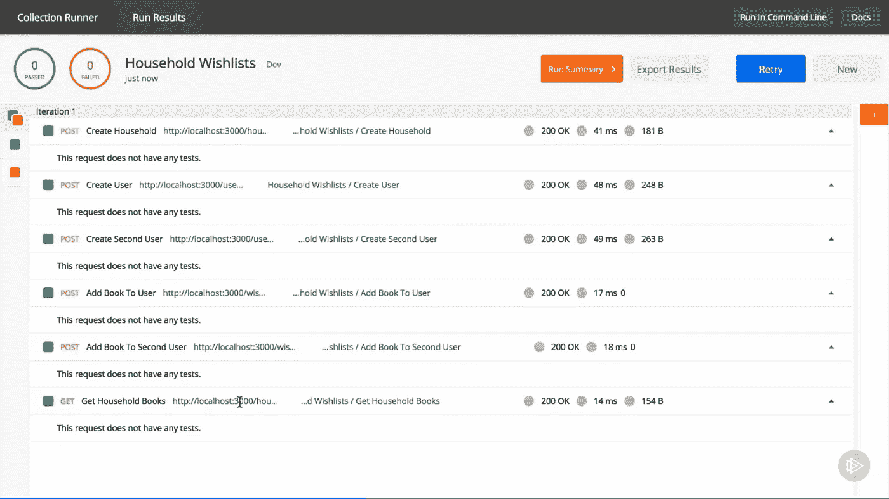
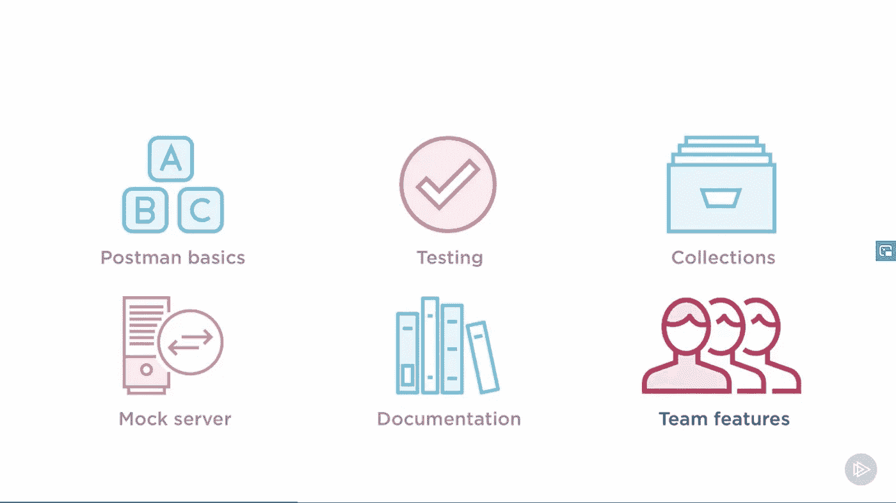
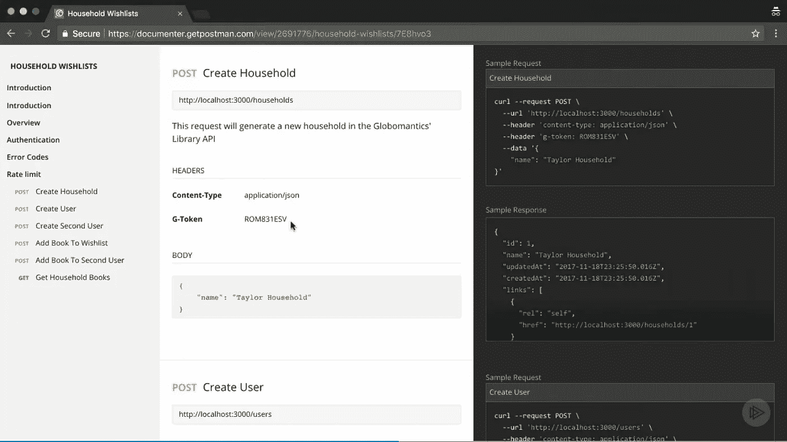
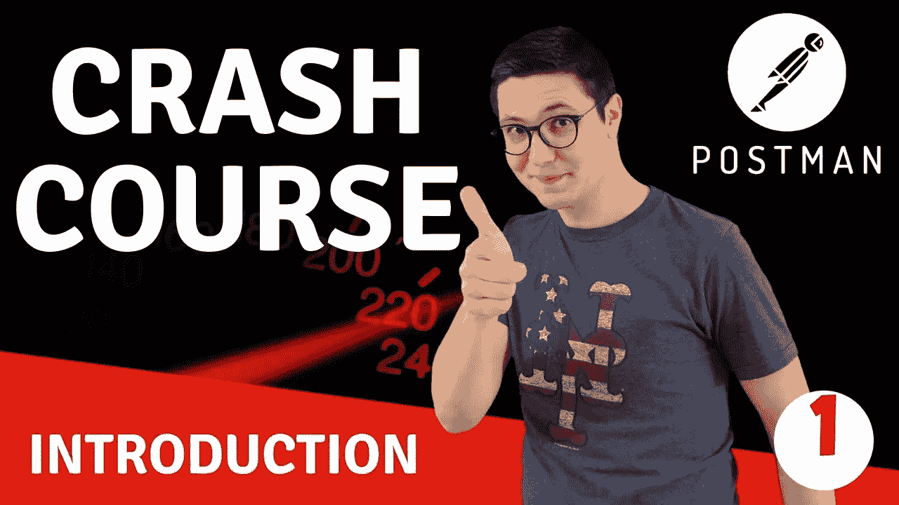
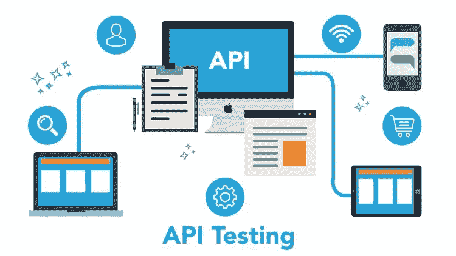

# 2023 年学习 Web 服务和 API 测试的 Postman 工具的 7 门最佳课程

> 原文：<https://medium.com/javarevisited/7-best-courses-to-learn-postman-tool-for-web-service-and-api-testing-f225c138fa5a?source=collection_archive---------0----------------------->

## 2023 年 Udemy 和 Pluralsight 学习 API 测试的最佳邮差课程

毫无疑问，Postman 是 REST API 开发和测试最流行和最基本的工具之一，尤其是对于前端 web 开发人员。全世界有超过 300 万开发人员使用它，这很好地表明了 Postman 是 REST API 开发和 API 测试的一个基本工具。

它也是 Web 开发人员的重要工具之一，我已经将 Postman 列入了我的[**2023 年**](https://javarevisited.blogspot.com/2020/01/10-things-web-developers-should-learn.html) 每个 Web 开发人员都应该学会的 10 件事的清单中。如果你同意我的观点，Postman 绝对值得前端和后端开发人员学习，并寻找一些优秀的资源来掌握这个令人敬畏的工具，那么你来对地方了。

在这篇文章中，我将分享一些*学习 Postman for API testing and development*的最佳在线课程和教程。

在探索 [Postman](https://javarevisited.blogspot.com/2020/02/top-5-postman-tutorials-and-courses-for-web-developers.html) 之前，我们先来谈谈 REST APIs，它完全改变了前端与后端系统的交互方式。在现代网络世界中，RESTful APIs 无处不在。

然而，与此同时，它们也变得越来越复杂，比如不同的 HTTP 方法、头文件、cookies、处理文件上传或使用 API 密钥的认证、令牌、 [OAuth 2](/javarevisited/top-10-courses-to-learn-spring-security-and-oauth2-with-spring-boot-for-java-developers-8f0222d6066d?source=---------5-----------------------) 等等。

作为一名开发人员，使用一个新的 API 并不容易，而且在开始花时间编写代码来检索 API 提供的数据之前，为什么不先测试一下请求以确保一切按预期运行呢？这就是邮差 App 的用武之地！ **Postman 允许您使用所需的 HTTP 方法和参数**快速创建请求，提交请求，并迅速检查结果。当使用一个 API 时，总是有很多东西需要记住，比如任何特殊的 API 键，不同环境的不同 URL，以及每个请求应该采取的形式。在这些课程中，您将了解到 [Postman](https://javarevisited.blogspot.com/2020/02/top-5-postman-tutorials-and-courses-for-web-developers.html) 如何帮助简化 API 的使用。

它允许您使用变量，以便相同的请求能够工作，无论是在测试环境还是阶段环境中。您还将学习如何创建自动化的 API 测试，从而确保您的 API 不会在不同的版本之间中断。

您甚至会看到 Postman 如何简化 API 的文档编写，以便您的用户能够对 API 的功能有一个最新的解释。本课程结束时，您将了解 Postman 的来龙去脉，并能够最大限度地与 API 互动。

# 2023 年 Udemy 和 Pluralsight 上的 7 门最佳邮递员在线课程

如果你想学习邮差工具，并寻找一些像教程和课程这样的优秀资源，那么你来对地方了。在不浪费你更多时间的情况下，这里是我列出的学习 Postman for REST API 开发和测试的一些最佳课程。

这些课程来自流行的在线平台，如 [Udemy](https://javarevisited.blogspot.com/2019/10/udemy-vs-pluralsight-review-which-is-better-to-learn-code.html) 、 [Pluralsight](https://javarevisited.blogspot.com/2017/12/top-10-pluralsight-courses-java-and-web-developers.html) 和 [Coursera](https://javarevisited.blogspot.com/2019/10/top-5-coursera-professional-certificates-for-programmers-IT-professionals.html) ，由精通 Postman 和真实世界 API 开发的 Web 和 API 开发专家讲授。

## 1. [Postman:完全指南— REST API 测试](https://click.linksynergy.com/deeplink?id=JVFxdTr9V80&mid=39197&murl=https%3A%2F%2Fwww.udemy.com%2Fcourse%2Fpostman-the-complete-guide%2F)

这是上一节课的作者 Valentin Despa 的另一个学习 Postman 和 REST API 测试的很棒的课程。前一个是速成课程，只有 1 个小时的内容，涵盖了 Post 和 API 测试的唯一最重要的方面，而本课程非常全面，包含超过 13.5 个小时的关于 Postman API 测试的内容，用于手动和自动测试。

你不仅将学习 Postman 应用程序的所有特性，还将编写 API 测试用例，并学习如何使用纽曼、[詹金斯](https://javarevisited.blogspot.com/2018/09/top-5-jenkins-courses-for-java-and-DevOps-Programmers.html)或任何其他 CI 工具实现自动化。

对于测试工程师和开发人员来说，这是一个非常有条理的课程和目标。所以，如果你是其中一个负责测试 REST APIs 的人，这个课程和工具就是为你准备的。

谈到社会证明，这门课程平均得到 2599 名参与者的 4.5 分，超过 13469 名学生已经对这门课程充满信心。

**这里是加入本课程的链接** — [邮差:完全指南— REST API 测试](https://click.linksynergy.com/deeplink?id=JVFxdTr9V80&mid=39197&murl=https%3A%2F%2Fwww.udemy.com%2Fcourse%2Fpostman-the-complete-guide%2F)

## 2.内特·泰勒的《邮递员基础》

这是一个很好的学习复视邮递员的课程。在本课程中，您将学习 Postman 的基础知识，如何发出请求，创建自动化 API 测试，甚至用 Postman 编写 API 文档。

您还将了解 Postman 如何简化 API 的文档编写，以便您的用户可以获得 API 正在做的事情的最新解释。

以下是您将在本课程中学到的主要内容:

1.  如何发出 API 请求
2.  如何自动化 API 测试
3.  如何编写 API 工作流脚本
4.  记录 API

完成本课程后，您将了解 Postman 的优点和缺点，并能够最大限度地与 API 进行交互。

**这里是加入本课程的链接** — [邮递员:完全指南— REST API 测试](https://click.linksynergy.com/deeplink?id=JVFxdTr9V80&mid=39197&murl=https%3A%2F%2Fwww.udemy.com%2Fcourse%2Fpostman-the-complete-guide%2F)

顺便说一句，你需要一个 Pluralsight 会员才能参加这个课程。如果你有 Pluralsight 会员资格，你应该参加这个课程来学习这个优秀的 API 测试工具。如果你没有 Pluralsight 会员资格，那么你也可以试试他们的 [**10 天免费试用**](http://pluralsight.pxf.io/c/1193463/424552/7490?u=https%3A%2F%2Fwww.pluralsight.com%2Flearn) ，提供 200 分钟的免费观看时间，免费访问这个课程。

<http://pluralsight.pxf.io/c/1193463/424552/7490?u=https%3A%2F%2Fwww.pluralsight.com%2Flearn>  

## 3. [REST API 测试，自动化使用 Postman](https://click.linksynergy.com/deeplink?id=JVFxdTr9V80&mid=39197&murl=https%3A%2F%2Fwww.udemy.com%2Fcourse%2Frest-api-testing-automation-using-postman%2F)

如果出于某种原因，你没有与瓦伦丁·德斯帕联系，需要一些其他选择，我推荐这个由 Tejasvi Hegde 创建的广泛的邮递员课程。这是一门非常动手和实用的课程，你会学到很多使用 Postman App 进行 [REST API 测试和自动化](https://www.java67.com/2022/03/best-tools-for-rest-api-development.html)的有用提示和技巧。

在本课程中，您将通过实例学习 Postman 工具的许多功能，例如如何通过设置代理来捕获网络流量，如何使用集合来组织请求，以及进行多部分文件上传。

您还将学习如何使用 POSTMAN 发送 SOAP 请求、执行数据驱动的测试(如点击一个按钮创建 1000 个订单)以及执行不同类型的身份验证，如 BASIC、OAuth 1.0 和 OAuth 2.0

无论您是开发 API 还是测试它们，本课程都将为您提供理解 Postman 提供的丰富功能所需的所有示例。

**这里是加入本课程的链接** — [REST API 测试，自动化使用邮差](https://click.linksynergy.com/deeplink?id=JVFxdTr9V80&mid=39197&murl=https%3A%2F%2Fwww.udemy.com%2Fcourse%2Frest-api-testing-automation-using-postman%2F)

## 4.[构建 REST APIs 的五个基本工具，作者 Elton Stoneman](https://pluralsight.pxf.io/c/1193463/424552/7490?u=https%3A%2F%2Fwww.pluralsight.com%2Fcourses%2Ffive-essential-tools-building-rest-api)

REST APIs 是一种将系统连接在一起的好方法，这也是它们受欢迎的原因。它们独立于平台，基于简单、成熟的标准，旨在支持高性能、大规模和安全通信。为了成为一名优秀的 API 开发者，了解像 Postman 这样的基本工具是至关重要的，本课程提供了一个工具集，用于交付更好的 REST APIs，满足客户的需求，运行速度快，可伸缩性好，易于维护。

如果你想随着邮差 App 学习更多的工具，那么这是一个加入的绝佳课程。

**这里是加入本课程的链接** — [构建 REST APIs 的五个必备工具](https://pluralsight.pxf.io/c/1193463/424552/7490?u=https%3A%2F%2Fwww.pluralsight.com%2Fcourses%2Ffive-essential-tools-building-rest-api)

同样，你需要一个 [Pluralsight 会员](https://dev.to/javinpaul/pluralsight-vs-udemy-review-which-is-better-for-software-developers-276c)才能进入本课程。如果您没有会员资格，您仍然可以通过加入他们的 [**10 天免费试用**](https://pluralsight.pxf.io/c/1193463/424552/7490?u=https%3A%2F%2Fwww.pluralsight.com%2Flearn) 来访问该课程，该课程允许 200 分钟免费访问他们的所有 7000+课程。

<https://pluralsight.pxf.io/c/1193463/424552/7490?u=https%3A%2F%2Fwww.pluralsight.com%2Flearn>  

## 5.[初级邮递员速成班—学习 API 测试](https://click.linksynergy.com/deeplink?id=JVFxdTr9V80&mid=39197&murl=https%3A%2F%2Fwww.udemy.com%2Fcourse%2Fpostman-crash-course-for-beginners-learn-rest-api-testing%2F)

这是一个简短且最好的 Postman 教程，它将教你所有关于 Postman 应用的基本知识，你需要为你的 REST API 编写测试用例。由 Postman 专家 Valentin Despa 教授，这门课程对于 API 开发者来说就像是上帝的礼物。

在这个面向初学者的 Postman 速成课程中，您将首先从探索 Postman 的本质特性、创建请求和构建简单的工作流开始。

之后，您将学习如何编写 API 测试，以及如何使用 Postman Collection Runner 自动运行 Postman 集合。学完本课程后，您应该对 Postman 应用程序以及如何使用 Postman 测试您的 API 有了足够的了解。

**这里是加入本课程的链接**——[邮递员速成班初学者——学习 API 测试](https://click.linksynergy.com/deeplink?id=JVFxdTr9V80&mid=39197&murl=https%3A%2F%2Fwww.udemy.com%2Fcourse%2Fpostman-crash-course-for-beginners-learn-rest-api-testing%2F)

谈到社会证明，这门课程受到了 25000 多名学生的信任，平均有近 2400 名参与者给它打了 4.4 分，这很了不起。如果你想在 2023 年学习一个优秀的工具，那就把它做成邮差，加入这个课程，掌握邮差 App。

## 6.[用放心 API 进行 Webservices API 测试&邮差 2023](https://click.linksynergy.com/deeplink?id=JVFxdTr9V80&mid=39197&murl=https%3A%2F%2Fwww.udemy.com%2Fcourse%2Fwebservices-testing-restassured-api-tutorial%2F)

这是另一个令人印象深刻的课程，学习在实际项目中使用 RestAssured API 和 POSTMAN 进行 Webservices API 自动化测试。如果你正在寻找一个单一的在线课程，涵盖邮差和放心，那么这是正确的课程给你。

以下是您将在本课程中学到的重要内容:

*   API 测试基础
*   SOAP 和 REST 的区别以及使用哪一个
*   可用于测试 web 服务的工具
*   深度邮递员
*   [REST API 方法](/javarevisited/why-spring-is-the-best-framework-for-developing-rest-apis-in-java-784590e484a4?source=collection_home---4------0-----------------------) —获取、发布、上传、删除等
*   重新发布的 API 和构建框架
*   处理 OAuth 认证
*   JSON 和 XML
*   杰克逊图书馆简介
*   TestNG、 [Jenkins](/javarevisited/7-best-courses-to-learn-jenkins-and-ci-cd-for-devops-engineers-and-software-developers-df2de8fe38f3) 、 [Maven](/javarevisited/top-10-free-courses-to-learn-maven-jenkins-and-docker-for-java-developers-51fa7a1e66f6?source=collection_home---4------3-----------------------) 和 [Git](/javarevisited/7-best-courses-to-master-git-and-github-for-programmers-d671859a68b2) / [Github](/@javinpaul/top-10-free-courses-to-learn-git-and-github-best-of-lot-967aa314ea) 等工具
*   类似并行执行、数据驱动和黄瓜 BDD 的概念
*   使用了许多实时 API

总的来说，这是学习 Web 服务和 API 测试的绝佳课程。如果你想成为一名手工测试人员，自动化测试人员，或者 DevOps 工程师，这个课程对你来说是一个很好的课程。

**以下是参加本课程的链接** — [放心 API web services API 测试& POSTMAN 2023](https://click.linksynergy.com/deeplink?id=JVFxdTr9V80&mid=39197&murl=https%3A%2F%2Fwww.udemy.com%2Fcourse%2Fwebservices-testing-restassured-api-tutorial%2F)

## 7.[学习 API & Webservices 测试](https://click.linksynergy.com/deeplink?id=JVFxdTr9V80&mid=39197&murl=https%3A%2F%2Fwww.udemy.com%2Fcourse%2Fwebservices-api-testing-with-postmansoapui-restassured%2F)

这是 Udemy 的另一个很棒的在线培训课程，学习 Postman、 [SOAPUI](https://javarevisited.blogspot.com/2021/11/top-5-courses-to-learn-soapui-online-in.html) 、ready API&[restassed](https://javarevisited.blogspot.com/2021/12/top-5-courses-to-learn-rest-assured-for.html)Java、TestNG & BDD 实时应用程序 API。

如你所见，本课程不仅涵盖了 Postman，还涵盖了其他 API 测试工具，如 SOAPU、Ready API 和放心。您还将了解什么是 web 服务和 API，它们的功能以及如何测试它们。

完成本课程后，您可以开始从事 API 和 Webservices 测试项目。

**以下是参加本课程** — [学习 API&web 服务测试](https://click.linksynergy.com/deeplink?id=JVFxdTr9V80&mid=39197&murl=https%3A%2F%2Fwww.udemy.com%2Fcourse%2Fwebservices-api-testing-with-postmansoapui-restassured%2F)的链接

以上就是 2023 年学习 REST API 开发和测试的 Postman 工具的一些**最好的课程。正如我说过的，Postman 是最强大的工具之一，它真的让使用 REST API 变得很容易。**

可以下载 Postman 桌面客户端，或者使用 Chrome 上的 Postman 扩展，有效地与 REST API 进行交互，进行开发和测试。学习像 Postman 这样的工具不仅能让你在日常工作中做得更好，还能让你在寻求改变时成为一个有价值的资源。对于 web 开发人员来说，这绝对是 2023 年需要学习的伟大工具。

其他 **Web 开发文章**你可能喜欢:

*   [完整的网络开发者路线图](https://dev.to/javinpaul/the-2019-web-development-frontend-backend-roadmap-4le2)
*   [2023 年 App 开发者可以学到的 10 件事](/javarevisited/10-frameworks-and-libraries-mobile-application-developers-can-learn-in-2020-e0b91391cade)
*   [10 个免费学习 JavaScript 的地方](https://hackernoon.com/10-websites-to-learn-javascript-for-beginners-31e13bbdbb5c)
*   【Java 开发者应该学习的 10 个 Web 开发框架
*   [完整的 React 开发者路线图](https://hackernoon.com/the-2018-react-js-roadmap-4d0a43814c02)
*   [初学者学习 GraphQL 的 5 大课程](https://hackernoon.com/top-5-graphql-courses-for-beginners-26cad52bcd3e)
*   [2023 年学习 Web 开发的十大课程](https://dev.to/javinpaul/top-6-courses-to-learn-web-development-best-of-lot-2fae)
*   [Web 开发人员应该学习的 10 个 JavaScript 框架](/javarevisited/10-of-the-most-popular-javascript-frameworks-libraries-for-web-development-in-2019-a2c8cea68094)
*   [深入学习 Angular 的前 5 门课程](https://javarevisited.blogspot.com/2018/06/5-best-courses-to-learn-angular.html)
*   [初学者学习 Vue.js 的 5 大课程](https://javarevisited.blogspot.com/2019/08/top-5-online-courses-to-learn-vue.js-best.html)
*   [2023 年学习 React 和 Redux 的 5 大课程](https://javarevisited.blogspot.com/2018/08/top-5-react-js-and-redux-courses-to-learn-online.html#axzz5r06B3egD)
*   [Web 开发的五大 Python 框架](https://javarevisited.blogspot.com/2019/04/top-5-python-web-development-frameworks.html)

感谢您阅读本文。如果这些最好的在线课程帮助你更好地学习邮递员，那么请与你的朋友和同事分享。如果您有任何问题或反馈，请留言。

**附言——**如果你喜欢这个工具，渴望学习和掌握它，但负担不起这些课程并寻找免费资源，那么你也可以在 Udemy 上查看由 tejasvi Hegde 提供的[**POSTMAN 简介—初学者指南**](https://click.linksynergy.com/deeplink?id=JVFxdTr9V80&mid=39197&murl=https%3A%2F%2Fwww.udemy.com%2Fcourse%2Fintroduction-to-postman-a-beginners-guide%2F) 免费课程。这是完全免费的，你只需要一个免费的 Udemy 帐户就可以参加这个课程。

<https://click.linksynergy.com/deeplink?id=JVFxdTr9V80&mid=39197&murl=https%3A%2F%2Fwww.udemy.com%2Fcourse%2Fintroduction-to-postman-a-beginners-guide%2F> 