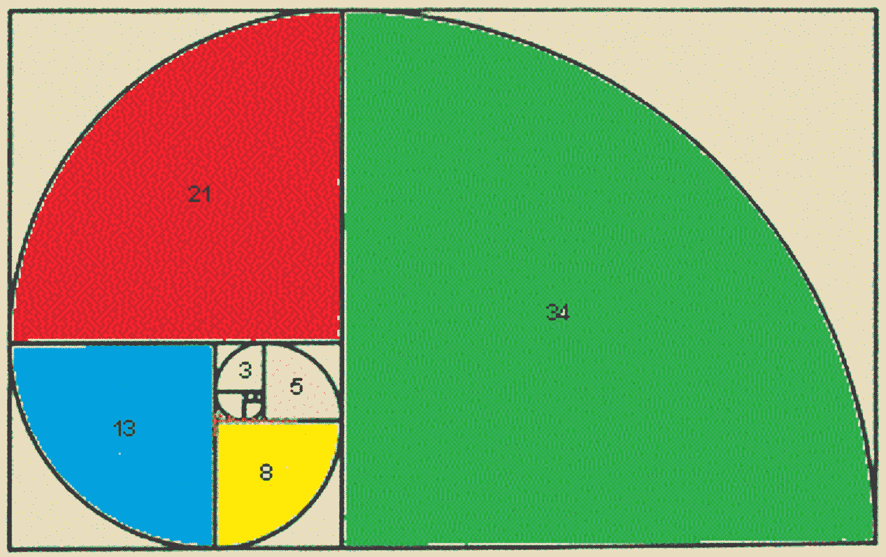
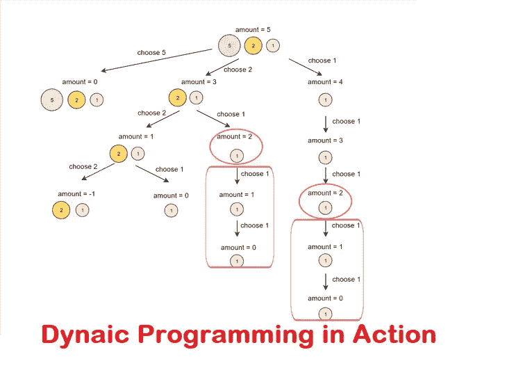
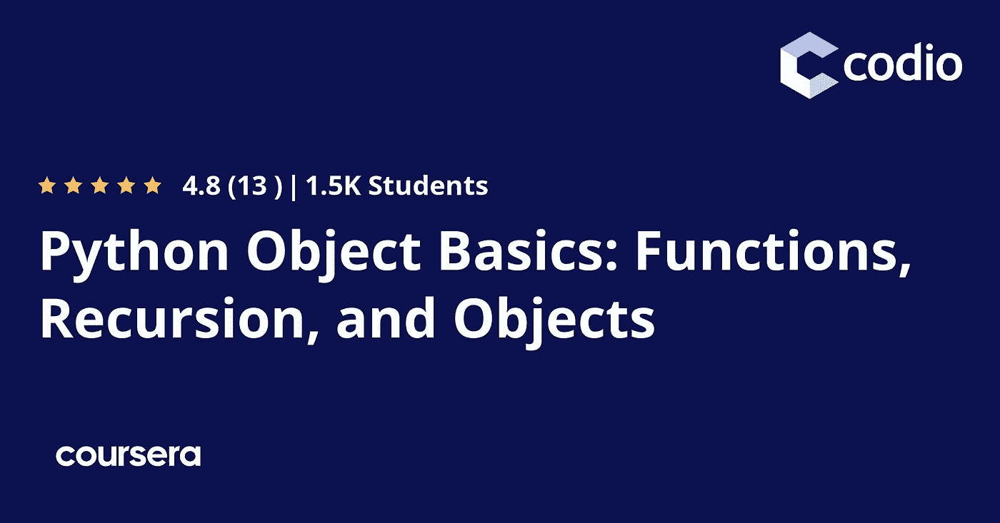
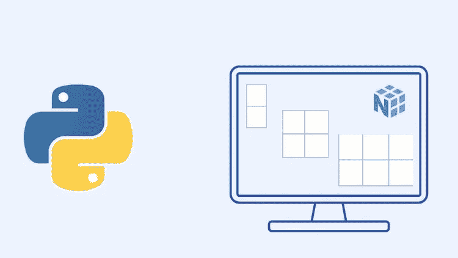

# 2023 年编码面试的 7 门最佳递归在线课程

> 原文：<https://medium.com/javarevisited/7-best-courses-to-learn-recursion-for-programming-and-coding-interviews-1f8b0bcfd44?source=collection_archive---------0----------------------->

## 这些是我最喜欢的学习递归的在线课程，用于编码面试和一般的编程

大家好，如果你想学习和掌握递归，并寻找最好的资源，如书籍、在线课程和教程，那么你来对地方了。前面我已经分享过 [**最佳动态编程课程**](https://www.java67.com/2021/11/best-dynamic-programming-courses-for.html) ， [**初学者 15 个递归练习**](https://www.java67.com/2021/07/recursion-programming-exercises-in-java.html) ，今天我要分享的是初学者学习递归的最佳课程。

递归是函数一次又一次直接或间接调用自己的过程。这些类型的函数称为递归函数。所有成功的软件程序员都需要了解递归函数是如何工作的，以及如何构建递归函数。

如果你是程序员，那么递归就是你的朋友。递归帮助你把大而复杂的程序分解成更小的部分。直接或间接调用自身的函数称为递归函数。

递归算法可以用来解决复杂的问题，特别是涉及递归数据结构的问题，如[链表](https://javarevisited.blogspot.com/2017/07/top-10-linked-list-coding-questions-and.html)、[二叉树](https://www.java67.com/2020/02/top-40-binary-tree-interview-questions.html)、[字符串](https://www.java67.com/2018/04/21-string-programming-and-coding-interview-questions-answers.html)、[数字](https://javarevisited.blogspot.com/2012/04/java-program-to-reverse-number-example.html)和图形。

在递归函数中，需要提供一个基本条件，然后用较小的问题来表达较大问题的解。这个基本条件将阻止递归函数无休止地执行并进入无限循环。一旦满足基本条件，递归函数将停止并退出。

递归背后的基本思想是将更大、更复杂的程序分解成更小、更易管理的部分。然后，您可以添加一个或多个基本条件来阻止函数无休止地循环。

递归函数用在 [C++](https://www.java67.com/2018/02/5-free-cpp-courses-to-learn-programming.html) 、 [Java](https://www.java67.com/2018/08/top-10-free-java-courses-for-beginners-experienced-developers.html) 、 [Python](https://www.java67.com/2020/05/top-5-courses-to-learn-python-in-depth.html) 等编程语言中。他们在解决基于动态编程的编码问题时也扮演着重要的角色，这些问题在编码面试中是非常具有挑战性的。

# 2023 年学习递归的 7 门最佳在线课程

毫无疑问，递归是一个很难掌握的概念。虽然说起来容易，但你只需要找到基本情况，它只不过是函数调用本身。理解并在现实世界的问题上应用递归，比如反转链表或二叉树，需要实践，而这正是你需要资源的地方。

我们编制了一份最佳课程清单，帮助你掌握递归函数，使你成为更专业的程序员。这些是从流行的在线学习网站如 [Udemy](https://click.linksynergy.com/deeplink?id=JVFxdTr9V80&mid=39197&murl=https%3A%2F%2Fwww.udemy.com%2F) 、 [Coursera](/javarevisited/18-coursera-courses-you-can-join-in-2020-to-learn-from-the-worlds-top-tech-companies-google-74af46967d1e) 、 [Educative](/javarevisited/20-free-educative-courses-for-programmers-and-software-engineers-a7135028350c) 和 [edX](/javarevisited/10-free-best-edx-certifications-and-courses-to-learn-online-3473d466f968) 学习递归的最佳在线课程。你可以在 2023 年加入这些课程中的任何一门或几门来学习和掌握递归。

请继续阅读，查看列表。

## 1.[Java 中的递归、回溯和动态编程](https://click.linksynergy.com/deeplink?id=JVFxdTr9V80&mid=39197&murl=https%3A%2F%2Fwww.udemy.com%2Fcourse%2Falgorithmic-problems-in-java%2F)

这是一门在 Udemy 平台上非常受欢迎的课程，超过 11，000 名学生给了它 4.6 星的评级。作为一名学生，你将会接触到不同种类的 Java 算法问题，重点是常见的面试问题。

您将了解不同种类的算法，如递归、回溯和分治算法。

本课程着重于 Java 中不同算法的基本概念。作为一个初露头角的程序员，你会知道这些算法非常重要，尤其是现在。这些算法可用于各种领域，可用于软件工程、投资银行和研发等领域。

您将了解不同种类的递归方法以及动态编程的含义。听起来很有趣，对吧？

本课程结束时，你将理解什么是回溯。这将帮助你从零开始实现超过 15 个算法问题。本课程将帮助你提高解决问题的技能，使你成为一个更强更全面的开发者。

**这里是加入本课程的链接**——[Java 中的递归、回溯和动态编程](https://click.linksynergy.com/deeplink?id=JVFxdTr9V80&mid=39197&murl=https%3A%2F%2Fwww.udemy.com%2Fcourse%2Falgorithmic-problems-in-java%2F)

## 2. [Python 对象基础:函数、递归和对象](https://coursera.pxf.io/c/3294490/1164545/14726?u=https%3A%2F%2Fwww.coursera.org%2Flearn%2Fpython-object-basics)

这是这个列表中最有帮助的课程之一，由 Coursera 提供。你想在几分钟内编写并运行你的第一个 python 程序吗？不安装任何特殊软件？报名参加这门课程。现在。

本课程的一个主要优势是，它将为你提供一个坚实的基础，不仅是 [Python 编程语言](https://becominghuman.ai/7-best-python-online-courses-for-beginners-to-learn-programming-abe12cecb1ad)，还有基本的计算机科学主题。学完这门课程后，你将能够学习任何其他计算机语言。正因为如此，这门课程非常适合编码经验有限的初学者。

这门课程分为不同的模块，你将学习函数、递归、对象和可变性等知识。本课程是由四门课程组成的 Python 专门化 的第三门课程，它将为您提供 Python 编程的实际操作介绍。

这门课是完全独特的，因为这门课没有视频，这意味着你将获得一个实用的编程入门。

**这里是加入这个递归课程的链接**——[Python 对象基础:函数、递归和对象](https://coursera.pxf.io/c/3294490/1164545/14726?u=https%3A%2F%2Fwww.coursera.org%2Flearn%2Fpython-object-basics)

顺便说一下，除了单独加入这些课程和专业，你还可以加入 [**Coursera Plus**](https://coursera.pxf.io/c/3294490/1164545/14726?u=https%3A%2F%2Fwww.coursera.org%2Fcourseraplus) ，这是 Coursera 的一个订阅计划，让你可以无限制地访问他们最受欢迎的课程、专业、专业证书和指导项目。

<https://coursera.pxf.io/c/3294490/1164545/14726?u=https%3A%2F%2Fwww.coursera.org%2Fcourseraplus>  

## 3.[递归](https://click.linksynergy.com/deeplink?id=JVFxdTr9V80&mid=39197&murl=https%3A%2F%2Fwww.udemy.com%2Fcourse%2Flearn-recursion%2F)【我的初学者最佳教程】

这是这个列表中最详细的课程之一，通过帮助你掌握递归函数并在你的程序中部署它们，你将成为一个无畏的程序员。该课程在 Udemy 上提供，是该平台上评分最高的课程之一，评分为 4.5。

在本课程中，你将学习如何用记忆和动态编程来优化你的递归函数。你将学习递归和尾部递归的基础知识。你还想从递归课程中得到什么？

你将学习不同种类的递归过程和基于递归的算法技术。你将会学到回溯和分治法等术语。你将能够把一个大问题分解成相同类型的更小的子问题，你可以很容易地解决它们。

在开始学习这门课程之前，你需要对不同的编程语言有一个基本的了解。

该课程包括 5 小时的点播视频讲座、3 篇文章、55 个可下载资源和 11 个编码练习。好的一面是，一旦你购买了这门课程，你就可以终生接触到所有这些内容。整个课程分为 23 节和 44 堂课。

**这里是加入 Udemy** — [**递归**](https://click.linksynergy.com/deeplink?id=JVFxdTr9V80&mid=39197&murl=https%3A%2F%2Fwww.udemy.com%2Fcourse%2Flearn-recursion%2F) 的最佳递归课程的链接

## 4.数据库:OLAP 和递归

如你所见，这门课与列表中的其他课程有些不同，它侧重于数据库。事实上，这是在 [edX 平台](/javarevisited/10-free-best-edx-certifications-and-courses-to-learn-online-3473d466f968)上的五门自学课程之一，它将教你所有关于数据库的知识。

这些课程由著名的斯坦福大学提供，于 2011 年秋季首次推出。

这门课程可以被认为是*数据库的续篇:关系数据库和 SQL。*它非常适合希望学习在线分析处理(OLAP)和 SQL 语言递归的学生。

这里是加入本课程的链接 — [数据库:OLAP 和递归](https://www.awin1.com/cread.php?awinmid=6798&awinaffid=631878&clickref=&p=%5B%5Bhttps%3A%2F%2Fwww.edx.org%2Fcourse%2Folap-and-recursion)

## 5.[Python 中的递归、回溯和动态编程](https://click.linksynergy.com/deeplink?id=JVFxdTr9V80&mid=39197&murl=https%3A%2F%2Fwww.udemy.com%2Fcourse%2Falgorithmic-problems-in-python%2F)【Udemy】

在这个列表的早期课程中，你看到了一个关于递归、回溯和 Java 动态编程的课程。嗯，这是清单上最好的课程之一，可以让你学习递归、回溯和 Python 语言中的动态编程。

这门课程也是由同一位讲师提供的，截至目前，已经有 6950 名学生在 Udemy 平台上注册了这门课程。我看不出你有什么理由不能成为第 6951 个。你还在等什么？

这是参加本课程的链接。[Python 中的递归、回溯和动态编程](https://click.linksynergy.com/deeplink?id=JVFxdTr9V80&mid=39197&murl=https%3A%2F%2Fwww.udemy.com%2Fcourse%2Falgorithmic-problems-in-python%2F)

## 6.[用 Java 编写面试代码的递归](https://www.educative.io/courses/recursion-for-coding-interviews-in-java?affiliate_id=5073518643380224)

如果你想学习编程面试中的递归，那么这就是适合你的课程。在本课程中，您不仅将学习如何用递归解决编码问题，还将学习如何以及何时对不同的数据类型和数据结构使用递归。

您还将接受一些最常见的递归面试问题的测试，以建立解决复杂的现实世界问题和真实编码面试中未知问题所需的知识和信心。

以防万一，如果您不熟悉 [JavaScript](https://javarevisited.blogspot.com/2018/06/top-10-courses-to-learn-javascript-in.html) ，本课程也提供 Python、C++和 Java 版本，您应该使用您最熟悉的语言。

**这里是加入本课程的链接**——[Java 编程面试的递归](https://www.educative.io/courses/recursion-for-coding-interviews-in-java?affiliate_id=5073518643380224)

如今，Educative 作为一个平台也是编写面试代码的一个很好的资源。他们有很棒的课程为编码面试做准备，比如[寻找系统设计面试](https://www.educative.io/trial?affiliate_id=5073518643380224)和[寻找编码面试模式](https://www.educative.io/collection/5668639101419520/5671464854355968?affiliate_id=5073518643380224)，在那里你将学到 15 种基本的编码模式，它们可以用来解决 100 多种 LeetCode 问题。

我强烈推荐你去看看那些课程，为编码面试做准备，你也可以通过加入 [**教育订阅**](https://www.educative.io/subscription?affiliate_id=5073518643380224) ，每月只需 14.9 美元就可以获得他们所有的课程。我向所有准备编程工作面试的人强烈推荐这一点

## 递归常见问题及答案

这里有一个程序员问的关于递归的常见问题列表，特别是那些刚刚开始学习递归或者想要学习递归概念的初学者。

**1。什么是递归？**

它被定义为一个函数一次又一次地直接或间接地调用自己的过程。

**2。递归有什么用？**

递归主要用于解决复杂的问题，将它们分解成更小的问题。这是在递归函数的帮助下完成的。

**3。谁发明了递归？**

递归背后的理论是由 Thoralf Albert Skolem 在 20 世纪首先发明的。

**4。什么是递归数据结构？**

[树](/javarevisited/20-binary-tree-algorithms-problems-from-coding-interviews-c5e5a384df30)、图和[链表](/javarevisited/top-20-linked-list-coding-problems-from-technical-interviews-90b64d2df093)是递归数据结构，因为如果你去掉一个元素，剩下的仍然是树、图或链表数据结构，你可以像处理原始的树、图或链表一样处理它们。

**5。递归的基础是什么？**

递归滚动或结束后的最后一种情况称为基础情况。例如`factorial(0)= 1`是计算阶乘的基本情况，到达链表或二叉树的末尾是基本情况。

如果你需要更多的[基于递归的编程问题](https://javarevisited.blogspot.com/2021/09/top-10-recursion-interview-questions.html)，你可以查看这个列表

<https://www.java67.com/2021/07/recursion-programming-exercises-in-java.html>  

以上就是 2023 年学习递归和动态编程的**最佳在线课程。递归是一种有用的编码技术，是计算机科学的概念和动态编程的基础，是每个程序员都应该学习和实践的东西。**

这些也是来自 Udemy，Coursera 和 edX 的最好的递归课程。这些课程会把你从一个初学程序员变成专家。这些课程都有各自的优势和 USPs。注册一个，你就会成为一名成功的软件开发人员。

其他**对采访编码有用的资源**:

*   [学习面试动态编程的前 5 门课程](https://javarevisited.blogspot.com/2019/12/top-5-courses-to-learn-dynamic-programming-for-interivews.html)
*   [学习面试系统设计的 10 门最佳课程](/javarevisited/10-best-system-design-courses-for-coding-interviews-949fd029ce65)
*   [初学者 25 道递归面试题](https://javarevisited.blogspot.com/2021/09/top-10-recursion-interview-questions.html?m=0)
*   [为编程工作面试做准备的 10 门课程](http://javarevisited.blogspot.sg/2018/02/10-courses-to-prepare-for-programming-job-interviews.html)
*   [学习数据结构与算法的 7 门最佳课程](/javarevisited/7-best-courses-to-learn-data-structure-and-algorithms-d5379ae2588)
*   [每个程序员都应该读的 10 本算法书](http://www.java67.com/2015/09/top-10-algorithm-books-every-programmer-read-learn.html)
*   [面向 Java 开发人员的五大数据结构和算法书籍](http://javarevisited.blogspot.sg/2016/05/5-free-data-structure-and-algorithm-books-in-java.html#axzz4uXETWjmV)
*   [五大免费数据结构与算法课程](https://javarevisited.blogspot.com/2018/01/top-5-free-data-structure-and-algorithm-courses-java--c-programmers.html)
*   [2023 年初级开发者应参加的 10 门算法课程](http://www.java67.com/2019/02/top-10-free-algorithms-and-data.html)
*   [20+字符串算法面试问题](https://hackernoon.com/20-string-coding-interview-questions-for-programmers-6b6735b6d31c)
*   [准备技术编程/编码工作面试的 10 本书](http://www.java67.com/2017/06/10-books-to-prepare-technical-coding-job-interviews.html)
*   [回顾一下这些面向程序员的 Java 面试问题](https://www.freecodecamp.org/news/review-these-50-questions-to-crack-your-java-programming-interview-69d03d746b7f/)
*   [20 多个基于数组的面试问题](/javarevisited/20-array-coding-problems-and-questions-from-programming-interviews-869b475b9121)
*   [程序员 25 个软件设计面试问题](/javarevisited/25-software-design-interview-questions-to-crack-any-programming-and-technical-interviews-4b8237942db0)
*   [30 大面向对象编程问题](http://www.java67.com/2015/12/top-30-oops-concept-interview-questions-answers-java.html)
*   [来自编码面试的 10 个动态编程问题](https://javarevisited.blogspot.com/2021/03/top-dynamic-programming-problems-for-coding-interviews.html)

感谢您阅读本文。如果你喜欢这个*最佳递归在线课程和教程*的列表，为什么不与你的朋友和家人分享呢？如果您有任何疑问或问题，请发表评论，我们会很快回复您。

**P. S. —** 如果你正在学习递归来解决动态编程，并且需要更多的练习，包括涵盖流行动态编程模式的几十个动态编程问题和解决方案，那么你也可以查看 [**寻找动态编程模式**](https://www.educative.io/collection/5668639101419520/5633779737559040?affiliate_id=5073518643380224) 来参加 Educative 上的编码面试，这是一个很好的开始资源。它将教你可以用来解决多种编码问题的通用 DP 模式。

<https://www.educative.io/collection/5668639101419520/5633779737559040?affiliate_id=5073518643380224> 