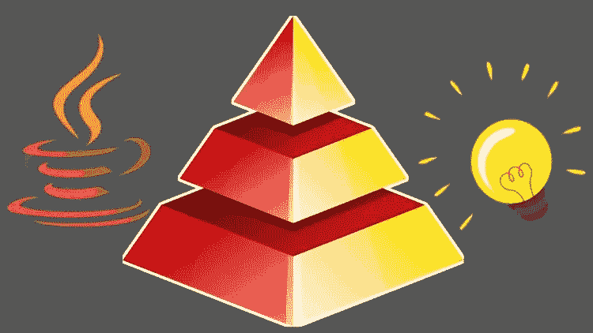
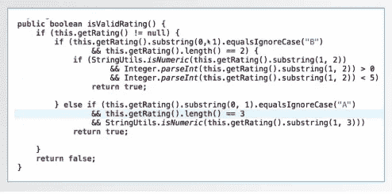
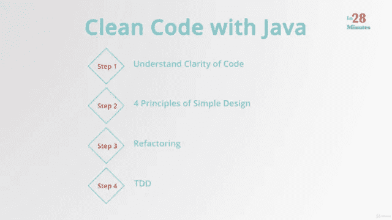
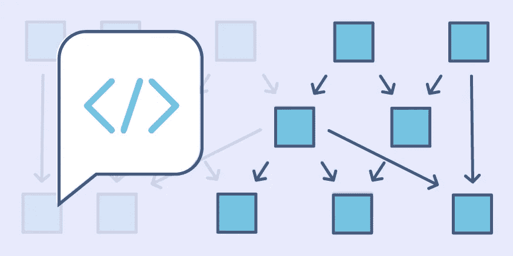
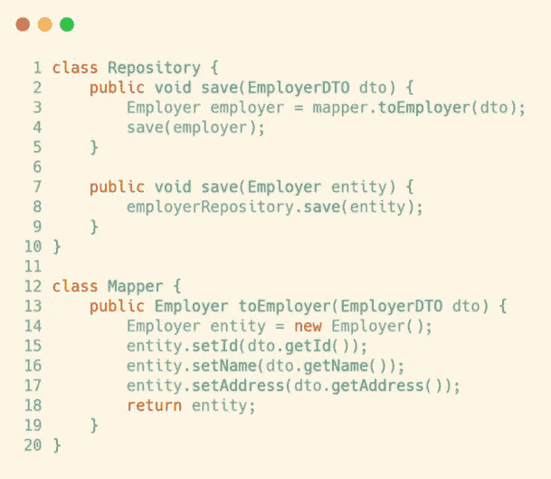
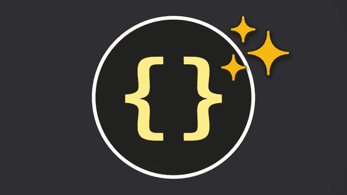

# 学习重构和提高 Java 编码技能的 7 门最佳课程

> 原文：<https://medium.com/javarevisited/7-best-courses-to-learn-refactoring-and-clean-coding-in-java-47bea3c67006?source=collection_archive---------0----------------------->

## 我最喜欢的在线课程，学习重构和最佳实践，以提高您的编码技能，成为一名更好的程序员。

> “任何傻瓜都能写出一台**计算机**能理解的代码。优秀的程序员写的代码是**人类**能够理解的。”— *马丁·福勒*

大家好，如果你想提高你的编码技能，学习重构和其他编码最佳实践，成为一名更好的开发人员，并寻找最好的在线课程来提高你的编码技能，重构和其他最佳实践，那么你来对地方了。

之前，我已经分享了 [**最佳设计模式课程**](/javarevisited/7-best-online-courses-to-learn-object-oriented-design-pattern-in-java-749b6399af59?source=---------10------------------) 和 [**最佳数据结构和算法课程**](/javarevisited/7-best-courses-to-learn-data-structure-and-algorithms-d5379ae2588?source=---------18------------------) ，今天，我将分享您可以加入的最佳在线课程，以提高您的编码和编程技能，成为一名更好的程序员。

在获得编程工作时，编程技能是最重要的区别之一。很简单，如果你不会编码，你就不能往上爬，也不能得到更好的工作。

良好的编码技能对于在金融、卫生、国防、航天、医疗和其他关键领域创建任务关键型应用程序的人员也很重要，在这些领域，一个简单的错误就可能导致灾难性的后果。

因为程序员总是希望 [**提高他们的编码技能**](https://www.java67.com/2016/02/5-books-to-improve-coding-skills-of.html) ，我也是其中之一。如果您编写的代码易于阅读并且足够灵活以适应未来的任何变化，这实际上会给您带来乐趣。

同时，没有指导，你的编码也不容易提高。你怎么知道你写的是好代码还是坏代码？你如何知道你的代码是否可以改进？嗯，与优秀的开发人员和 GitHub 评论一起工作会有所帮助，这可能是大多数人提高编码技能的方式。

现在大多数公司使用 [Github](/javarevisited/7-best-courses-to-master-git-and-github-for-programmers-d671859a68b2) 作为他们的代码库和基于分支的开发方法，这意味着新代码被写入特性分支，然后它们被合并到 master 中发布。

那时，开发人员提出一个 pull 请求(PR ),这个请求由当时另一个开发人员审阅，通常是一个高级开发人员或技术领导，他们提供建设性的反馈来改进您的代码。

这是值得信赖的，但要提高编码技能却是一条漫长而艰难的路。这也取决于你是否有好的帮手，这就是为什么我也建议人们花一些时间参加在线课程或阅读书籍来学习常用技术或 [**写更好的 cod** e](https://javarevisited.blogspot.com/2011/08/code-comments-java-best-practices.html#axzz6fvDCikIM) 。

过去，我曾分享过[提高编码技能的最佳书籍](https://www.java67.com/2016/02/5-books-to-improve-coding-skills-of.html)，现在我带来了最好的在线课程，学习用 [Java](/javarevisited/10-best-places-to-learn-java-online-for-free-ce5e713ab5b2) 、 [C#](/javarevisited/5-best-c-c-sharp-programming-courses-for-beginners-in-2020-494f7afc7a5c) 、 [JavaScript](/javarevisited/my-favorite-free-tutorials-and-courses-to-learn-javascript-8f4d0a71faf2) 和其他编程语言编写干净的代码、重构和坚实的原理，以提高你的编码技能。您可以加入他们，看看如何改进他们的代码，并从中吸取重要的经验教训。

# 2023 年提高程序员编码技能和重构的 7 门最佳在线课程

在不浪费你更多时间的情况下，这里有我最喜欢的在线课程来学习重构、设计原则、设计模式、TDD，并全面提高你的编码和编程技能。

虽然这是一项通用技能，并且您将在这里学到的大多数技巧都可以应用于任何编程语言，如 JavaScript 和 Python，但这些课程侧重于 Java 和 C#示例。

## 1.[重构金字塔(Java) —逐渐清理代码](https://click.linksynergy.com/deeplink?id=JVFxdTr9V80&mid=39197&murl=https%3A%2F%2Fwww.udemy.com%2Fcourse%2Fpyramid-of-refactoring-java-interpreter-factories%2F)

这是学习干净代码以及如何在代码中使用设计模式的另一个很好的课程。本课程由技术讲师和重构专家 Wlodek Krakowski 创建。

这是致力于实现干净代码的“重构金字塔”系列的第一门课程。在本模块中，教师将使用常见的重构技术来提高代码的可读性、灵活性以及更改和测试的简易性。

在这一部分，您将学习如何使用解释器设计模式作为您重构之旅的目标。解释器模式伴随着两种创造性的设计模式——[工厂方法](http://javarevisited.blogspot.sg/2011/12/factory-design-pattern-java-example.html#axzz51cvxH5kW)和 Fluent Builder，在这个过程中，您将学习以下常见的重构技术:

*   用流替换循环
*   如何提取委托/类
*   如何提取接口
*   如何提取参数对象
*   如何用方法对象替换方法
*   如何提取方法/变量
*   如何移动方法
*   如何内联方法/变量

本课程最大的好处是，你将看到如何通过应用上述重构技术和最佳实践，将糟糕的代码转化为好的代码。

讲师会实时进行所有更改，并让您有机会通过下载源代码来跟进，并与培训师一起一步一步地执行所有更改。

**这里是加入本课程的链接**——[重构金字塔(Java)——逐步清理代码](https://click.linksynergy.com/deeplink?id=JVFxdTr9V80&mid=39197&murl=https%3A%2F%2Fwww.udemy.com%2Fcourse%2Fpyramid-of-refactoring-java-interpreter-factories%2F)

总的来说，对于中级和有经验的 Java 开发人员来说都是一门很棒的课程。如果你正在寻找一个实践的、点对点的在线课程来学习</javarevisited/clean-code-a-must-read-coding-book-for-programmers-9dc80494d27c>**[**重构**](https://javarevisited.blogspot.com/2014/09/top-6-books-to-learn-programming-coding.html#axzz6fvDCikIM) 和 [**设计模式**](https://www.java67.com/2016/10/top-5-object-oriented-analysis-and-design-patterns-book-java.html) 比如解释器、流畅构建器、工厂方法，那么这个课程就是为你准备的。**

## **2.[用 Java 清理代码:学习简单设计，重构& TDD](https://click.linksynergy.com/deeplink?id=JVFxdTr9V80&mid=39197&murl=https%3A%2F%2Fwww.udemy.com%2Fcourse%2Fjava-clean-code-with-refactoring-and-tdd%2F)**

**这是 Java 开发人员学习干净代码的最佳课程之一。Ranga Karnam 不需要任何介绍，就 Java 和 Spring 技术而言，他是最好的 Udemy 导师之一。**

**很有可能你已经参加过他的 [**Spring Boot 和微服务**](https://click.linksynergy.com/fs-bin/click?id=JVFxdTr9V80&subid=0&offerid=323058.1&type=10&tmpid=14538&RD_PARM1=https%3A%2F%2Fwww.udemy.com%2Fmicroservices-with-spring-boot-and-spring-cloud%2F) 课程。**

**关于 Ranga 的课程，我最喜欢的是一步一步的指导，并专注于 80%的时间都在使用的 20%的重要事情，这个代码也不例外。**

**如果你看了介绍和预览，我强烈建议你知道什么是好代码，什么是坏代码，这就是你学习的地方。例如，看一下这段代码:**

****

**现在，看看这段代码，它是上述代码的改进版本:**

****

**Ranga 将首先向您展示糟糕的代码是什么样子，以及为什么难以维护，然后您将一步一步地将代码转换为良好的、生产质量的代码，并学习重构、[设计原则](/javarevisited/10-oop-design-principles-you-can-learn-in-2020-f7370cccdd31)，以及编写干净代码的有用技术。**

**如果你正在寻找关于干净代码、重构和测试驱动开发的大量实例的实践课程，那么这个课程就是为你准备的。我向初学者和希望在职业生涯中提高自己和成长的有经验的 Java 开发人员强烈推荐这个课程。**

****这里是加入本课程的链接** — [用 Java 清理代码:学习简单设计，重构& TDD](https://click.linksynergy.com/deeplink?id=JVFxdTr9V80&mid=39197&murl=https%3A%2F%2Fwww.udemy.com%2Fcourse%2Fjava-clean-code-with-refactoring-and-tdd%2F)**

****

## **3.[重构金字塔(Java)——将代码清理成链](https://click.linksynergy.com/deeplink?id=JVFxdTr9V80&mid=39197&murl=https%3A%2F%2Fwww.udemy.com%2Fcourse%2Fpyramid-of-refactoring-java-chain-of-poker-hands%2F)【Udemy】**

**这是重构金字塔系列的第二个课程，在这里你将学习如何使用重构金字塔和干净的代码规则，用责任链设计模式替换嵌套和混乱的 if-else 语句。本课程的目标是从一组难以阅读和维护的深度嵌套的条件 if/else 语句中解开代码库。这是一个非常常见的</javarevisited/20-binary-tree-algorithms-problems-from-coding-interviews-c5e5a384df30>**编码问题，如果它被搁置很长时间，那么它会导致后续代码更改后非常复杂的遗留代码。

讲师将使用重构技术，并现场执行所有更改，向您展示如何摆脱杂乱的 if-else 块，并提出更干净的方法，使您的逻辑更加明显。****

****你也可以下载源代码，和教练一起一步一步地做所有的改变。****

******这是加入本课程** — [重构金字塔(Java)——将代码清理成链](https://click.linksynergy.com/deeplink?id=JVFxdTr9V80&mid=39197&murl=https%3A%2F%2Fwww.udemy.com%2Fcourse%2Fpyramid-of-refactoring-java-chain-of-poker-hands%2F)的链接****

****<https://click.linksynergy.com/deeplink?id=JVFxdTr9V80&mid=39197&murl=https%3A%2F%2Fwww.udemy.com%2Fcourse%2Fpyramid-of-refactoring-java-chain-of-poker-hands%2F> **** 

## ****4.[通过实例重构设计模式](https://click.linksynergy.com/deeplink?id=JVFxdTr9V80&mid=39197&murl=https%3A%2F%2Fwww.udemy.com%2Fcourse%2Frefactoring-to-patterns%2F)【Udemy 课程】****

****这是另一个精彩的 udemy 课程，学习如何用 C#中的重构技术和设计模式来改进现有应用程序的内部设计。****

****是的，这门课程不是用 Java，而是用 C#编写的，C#与 Java 非常相似，因此它对 [C#](https://javarevisited.blogspot.com/2019/11/top-5-courses-to-learn-c-sharp-in.html) 和 [Java 开发人员](/javarevisited/25-topics-and-resources-to-crack-java-developer-interviews-in-2021-8fbfe317513)同样有用。本课程从一个现实的应用程序开始，这个应用程序没有被很好地考虑，也没有结合设计模式。演示应用程序将文本转换为视频字幕，这在实践中非常有用。****

****然而，由于其糟糕的结构和设计，进一步维护和开发这个应用程序几乎是不可能的。

这是课程开始的地方，一步一步地向你展示如何改进这段更容易修改和维护的代码。您将使用重构来提高代码质量，并在此过程中不断学习。在重构过程中，许多 [**设计模式**](/javarevisited/7-best-online-courses-to-learn-object-oriented-design-pattern-in-java-749b6399af59) 几乎不费吹灰之力就能就位。****

****在课程结束时，你将知道如何进行代码重构和设计模式——一个编码实践和一个设计实践——可以一起操作，并帮助彼此创建伟大的设计。****

****总的来说，这是一门非常实用的课程，生动的例子使得讲述起来更加容易。我建议你在课程中进行重构，以便更好地理解这个概念，因为主动学习会推动你的大脑，当你实际应用时，更容易记住知识。****

****有时候，我会暂停课程，回头回顾我做了什么，为什么要这样做，这也有助于我学得更好，你也可以这样做。我强烈推荐给各类 [Java](/javarevisited/10-free-courses-to-learn-java-in-2019-22d1f33a3915) 和 [C#](/javarevisited/5-best-c-c-sharp-programming-courses-for-beginners-in-2020-494f7afc7a5c) 开发者。****

******以下是加入本课程的链接—** [通过实例重构设计模式](https://click.linksynergy.com/deeplink?id=JVFxdTr9V80&mid=39197&murl=https%3A%2F%2Fwww.udemy.com%2Fcourse%2Frefactoring-to-patterns%2F)****

********

## ****5.[寻找编码面试:编码问题的模式](https://www.educative.io/collection/5668639101419520/5671464854355968?affiliate_id=5073518643380224)****

****这是一门类似的课程，主要是为你准备编码面试而开设的，但我真的发现它也有助于提高你的编码技能。它基于学习模式的一般概念，然后使用它们来解决多个问题。****

****你将学习一些有用的模式，如两个指针，快速和慢速指针，滑动窗口，合并间隔模式等。仅仅知道这些模式并使用它们来解决不同的编码问题将会建立编码意识并扩展你关于如何解决一般问题的知识。****

****而且，因为您将应用模式，您将逐渐学会如何在解决类似问题的同时编写更好的代码。无论你是否在为编码面试做准备，我都强烈建议你参加这个课程，以提高你的编码技能和解决问题的能力。****

******这是加入本课程的链接**——[寻找编码面试:编码问题的模式](https://www.educative.io/collection/5668639101419520/5671464854355968?affiliate_id=5073518643380224)****

********

****同样，Educative 有许多很棒的课程可以帮助你成为一名更好的程序员，比如他们的系统设计课程，该课程也是为编码面试而开设的，但为各种程序员提供了非常有用的课程。你可以获得 [**教育订阅**](https://www.educative.io/subscription?affiliate_id=5073518643380224) 来访问他们的所有课程，每月仅需 14.99 美元(现在有 70%的折扣)。****

****<https://www.educative.io/subscription?affiliate_id=5073518643380224> **** 

## ****6.[干净的代码:在 7 天内让你的编程生涯扶摇直上](https://click.linksynergy.com/deeplink?id=CuIbQrBnhiw&mid=39197&murl=https%3A%2F%2Fwww.udemy.com%2Fcourse%2Fsoftware-practices-and-writing-clean-code%2F)****

****这是 Udemy 上的另一门很棒的课程，供 Java 程序员学习如何编写干净的代码。在这个 Udemy 在线课程中，你将学习重要的软件实践，以一种实用的、易于遵循的方式编写干净的代码。****

****以下是您将在本课程中学到的主要内容:****

*   ****每个开发人员都应该知道的软件实践****
*   ****如何编写干净的代码****
*   ****如何编写易读的代码****
*   ****如何编写易于扩展的代码****
*   ****如何为类、方法和变量写更好的名字****
*   ****如何解耦代码****

****这门课程将帮助你成为一名更好的专业软件开发人员，并让你走上成为程序员超级明星的正确道路。****

****如果你已经是一个专业的软件开发人员，这个课程将会给你一个工具集，让你成为一个更好的程序员，并且让你与众不同。****

******这里是加入本课程的链接** — [干净的代码:在 7 天内让你的编程生涯扶摇直上](https://click.linksynergy.com/deeplink?id=CuIbQrBnhiw&mid=39197&murl=https%3A%2F%2Fwww.udemy.com%2Fcourse%2Fsoftware-practices-and-writing-clean-code%2F)****

********

## ****7.Maximillian Schwarzmuller 的《干净的代码》****

****如果你是一名 JavaScript 开发人员，正在寻找一门在线课程来学习如何用 JavaScript 编写干净的代码，那么这门课程就是为你准备的。我买这个课程只是因为 Max 创建了它，并且参加了他的[反应完全指南](https://click.linksynergy.com/deeplink?id=CuIbQrBnhiw&mid=39197&murl=https%3A%2F%2Fwww.udemy.com%2Fcourse%2Freact-the-complete-guide-incl-redux%2F)和其他课程，我确信这将是非常好的，我一点也不失望。****

****在这个 6.5 小时的长课程中，您将学习如何以示例驱动的方式一步一步地编写可读、可理解且可维护的代码。****

****这是关键，因为除非你看到例子并做练习，否则你是学不到的。它有简短、集中的例子，不使用特定的编程风格或范例。****

****在本课程中，你将学习什么是干净的代码，更重要的是，你如何编写干净的代码。因为如果你的代码是以一种简洁的方式编写的，它更容易阅读和理解，因此也更容易维护。****

****您还将了解与编写干净代码相关的常见编码模式、最佳实践、原则和规则。它还涵盖了编写干净代码时要记住的广泛概念、规则、想法、思想和原则。****

****如果你真的想提高你的 JavaScript 编码技能，我强烈推荐你参加这个课程。****

******这里是加入本课程的链接**——[马克西米里安·施瓦茨穆勒的《干净的代码》](https://click.linksynergy.com/deeplink?id=CuIbQrBnhiw&mid=39197&murl=https%3A%2F%2Fwww.udemy.com%2Fcourse%2Fwriting-clean-code%2F)****

********

****以上是你可以参加的提高编码技能的最佳在线课程**。这些课程非常适合希望提高编码和编程技能并在职业生涯中成长的 Java 开发人员。******

> ****正如我之前所说，编码技能是程序员最重要的资产之一，它将为你服务很长时间。****

****它还独立于编程语言，因为编写好的代码是一项通用技能，无论您是 python 开发人员还是 Java 开发人员，学习编写好代码的通用技术、设计原则和模式都会让您受益匪浅。****

****您可能喜欢的其他**编程文章和教程******

*   ****[完整的 Java 开发者路线图](/javarevisited/the-java-programmer-roadmap-f9db163ef2c2)****
*   ****[5 个编码面试准备网站](https://javarevisited.blogspot.com/2017/02/5-websites-for-practicing-data-structure-algorithms-for-coding-interviews.html#axzz6fvDCikIM)****
*   ****[每个 Java 开发人员都应该知道的 10 个工具](http://www.java67.com/2018/04/10-tools-java-developers-should-learn.html)****
*   ****[10 个免费学习 Git 和 Github 的网站](https://javarevisited.blogspot.com/2019/05/10-free-websites-to-learn-git-online.html)****
*   ****[5 个免费学习数据结构和算法的网站](https://javarevisited.blogspot.com/2017/02/5-websites-for-practicing-data-structure-algorithms-for-coding-interviews.html)****
*   ****[学习 Java 编程语言的 10 个理由](http://javarevisited.blogspot.sg/2013/04/10-reasons-to-learn-java-programming.html)****
*   ****[5 个免费学习 Python 的网站](https://javarevisited.blogspot.com/2019/09/5-websites-to-learn-python-for-free.html)****
*   ****[Java 和 Web 开发人员应该学习的 10 个框架](http://javarevisited.blogspot.sg/2018/01/10-frameworks-java-and-web-developers-should-learn.html)****
*   ****[5 个免费在线学习 SQL 的网站](https://javarevisited.blogspot.com/2015/06/5-websites-to-learn-sql-online-for-free.html)****
*   ****[成为更好的 Java 开发人员的 10 个技巧](http://javarevisited.blogspot.sg/2018/05/10-tips-to-become-better-java-developer.html)****
*   ****[21 个免费在线学习编码的网站](https://www.java67.com/2018/06/21-websites-to-learn-how-to-code-for.html)****
*   ****[你可以学习的 10 种编程语言](http://www.java67.com/2017/12/10-programming-languages-to-learn-in.html)****
*   ****[完整的 DevOps 工程师路线图](/hackernoon/the-2018-devops-roadmap-31588d8670cb)****
*   ****[程序员 50+数据结构面试问题](/hackernoon/50-data-structure-and-algorithms-interview-questions-for-programmers-b4b1ac61f5b0)****

****感谢您阅读本文。如果你发现这些*高级 java 课程对提高你的编码和重构技能有用*，那么请与你的朋友和同事分享。如果您有任何问题或反馈，请留言。****

****如果你喜欢阅读书籍，并寻找提高编码技能的最佳书籍，那么你也可以看看 Bob 叔叔 Robert C. Martin 的《干净的代码》<http://www.amazon.com/Clean-Code-Handbook-Software-Craftsmanship/dp/0132350882?tag=javamysqlanta-20>**,这是 Java 程序员的必读书籍之一。******

******<http://www.amazon.com/Clean-Code-Handbook-Software-Craftsmanship/dp/0132350882?tag=javamysqlanta-20> ******