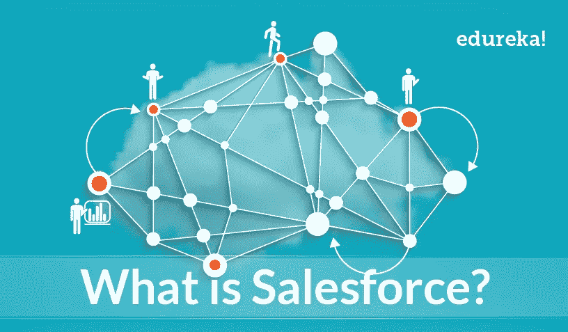
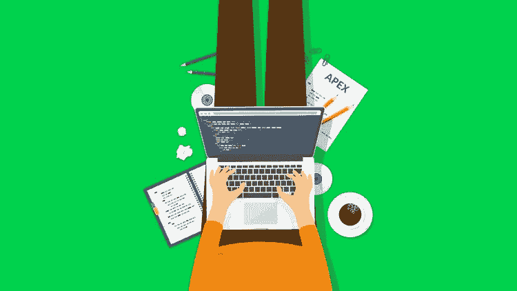
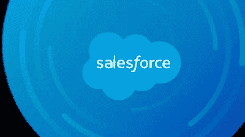
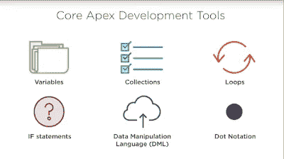

# 2023 年学习 Salesforce 发展的 7 门最佳课程

> 原文：<https://medium.com/javarevisited/7-best-courses-to-learn-salesforce-development-in-2021-1f861a0c2fff?source=collection_archive---------0----------------------->

## 如果您想在 2023 年成为 Salesforce 开发人员，那么这些是 2023 年 Salesforce 开发人员初学者认证的最佳在线课程。

image_credit — Edureka

大家好，如果你想在 2023 年成为 Salesforce 开发人员，并寻找最好的在线培训课程，那么你来对地方了。之前，我已经分享了学习云计算 的 [**最佳课程，今天，我将分享 20232 年学习 Salesforce 的最佳在线课程。**](/javarevisited/5-best-cloud-computing-courses-to-learn-in-2020-f5f091159401)

Salesforce 不仅是公司用来组织工作和保持工作流程的客户关系管理，也是开发人员可以用来创建应用程序、开发应用程序、定制应用程序和在服务器上部署应用程序的巨大平台。

出于这些目的，Salesforce 推出了许多认证计划，让您了解该平台如何工作以及如何使用，例如 [**Salesforce 平台应用构建器**](https://javarevisited.blogspot.com/2020/06/top-5-courses-to-crack-salesforce-platform-app-builder-certification-exam.html) 和 [Salesforce 管理员](https://javarevisited.blogspot.com/2020/06/top-5-courses-to-crack-salesforce-administrator-certification.html)，以及成为 Salesforce 开发人员所需的 Salesforce 开发培训。

Salesforce 开发培训是一个认证，教你如何用一种叫做 **Apex** 的编程语言编写 salesforce 应用程序，这种语言太类似于 [Java](/javarevisited/10-best-places-to-learn-java-online-for-free-ce5e713ab5b2) 来创建软件的后台，以及 visual-force 来创建软件的前端。

这意味着任何业务需求都不能用简单的内置特性来完成；开发人员将对特定需求进行编码。这项技能的平均年薪为 95，423 美元，是 IT 或软件开发行业薪酬最高的工作之一。

有许多 [*Salesforce 在线培训课程*](/javarevisited/7-best-salesforce-administrator-certification-exam-crt-101-courses-and-practice-tests-e8feeea4cc67) 可以教你这种 Salesforce 发展技能，但并不是所有的课程都值得你花费时间和金钱，陷入错误的课程会阻碍你的进步，这就是本文将帮助你的地方。

过去，我曾分享过 [**学习 Salesforce**](https://www.java67.com/2020/07/top-5-free-courses-to-learn-salesforce.html) 的免费课程，今天，我将分享您可以加入成为 Salesforce 开发人员的最佳在线课程。今天，我们将在本文中讨论一些最佳 Salesforce 开发培训课程，它将帮助您掌握这些特定的职业，并在该行业中找到工作。

</javarevisited/my-favorite-free-salesforce-training-courses-for-beginners-in-2021-3b6d5836605d>  

# 2023 年成为 Salesforce 开发人员的 7 门最佳在线课程

这里有一个在线 Salesforce 培训课程列表，您可以参加这些课程，从 Salesforce cloud 开始您的职业生涯，并打开巨大机会的大门。这些课程是根据专家的建议选择的，你可以在流行的在线培训平台上参加这门课程，如 [Udemy](/javarevisited/10-best-udemy-online-courses-for-java-developers-4c9ab70cd01f) 和 [Pluralsight](/javarevisited/top-10-pluralsight-courses-to-learn-programming-and-software-development-during-covid-19-stay-at-30b7d8a4f88f?source=---------11------------------) 。

## 1.[sales force 101:sales force 简介](https://click.linksynergy.com/deeplink?id=JVFxdTr9V80&mid=39197&murl=https%3A%2F%2Fwww.udemy.com%2Fcourse%2Fsalesforce-101-introduction-to-salesforce%2F)

这是学习 Salesforce 表单 scratch 的很好的入门课程。如果您不知道什么是 salesforce，那么您应该从本课程开始。

由 Francis Pindar 创建，他是 Salesforce 认证架构师和 7 次 Salesforce MVP，此 Udemy 课程适用于任何 Salesforce 新手和想要了解它和 Salesforce 销售的产品的人。

本课程结束时，您将了解 Salesforce 云服务、您在 Salesforce 工作可以获得的薪水、您可以获得的认证以及根据您的背景您可能希望从哪些认证开始。

本课程还提供了 Salesforce 的简短历史，以展示它是如何开始和发展的。如果您以前没有任何使用 Salesforce 的经验，那么我强烈建议您开始学习本课程。

**这里是加入这个最佳销售队伍课程**的链接——[销售队伍 101:销售队伍简介](https://click.linksynergy.com/deeplink?id=JVFxdTr9V80&mid=39197&murl=https%3A%2F%2Fwww.udemy.com%2Fcourse%2Fsalesforce-101-introduction-to-salesforce%2F)

## 2.[完成 Salesforce 认证平台开发人员 I 课程](https://click.linksynergy.com/deeplink?id=JVFxdTr9V80&mid=39197&murl=https%3A%2F%2Fwww.udemy.com%2Fcourse%2Fcomplete-salesforce-certified-platform-developer-i-course%2F)

如果您正在为 2023 年的 **Salesforce 认证平台开发人员**认证做准备，那么这是您可以参加的最佳在线课程，以帮助您做好准备。

本课程完全符合最新*sales force Certified Platform Developer I*版本的官方考试学习指南，涵盖了所有重要的考试主题。

官方考试大纲有很多小节；每个部分都有许多主题，并且在总共 60 个问题中有自己的问题权重(百分比)。这些是问题数量加权的不同部分:

1.  销售人员基础知识— 7%
2.  数据建模和管理— 13%
3.  流程自动化和逻辑— 38%
4.  用户界面— 25%
5.  测试、调试和部署工具— 17%

本课程涵盖了学习指南上述各部分中提到的每个主题，每个主题至少有一个视频讲座，分为一个演示和一个关于 Salesforce 环境的演示。

课程还包含超过 *100 个测验问题*，你可以用它们来检查你的准备情况。

**以下是参加本课程的链接** — [完成 Salesforce 认证平台开发人员 I 课程](https://click.linksynergy.com/deeplink?id=JVFxdTr9V80&mid=39197&murl=https%3A%2F%2Fwww.udemy.com%2Fcourse%2Fcomplete-salesforce-certified-platform-developer-i-course%2F)

## 3.[面向初学者的 Salesforce 开发培训](https://click.linksynergy.com/deeplink?id=JVFxdTr9V80&mid=39197&murl=https%3A%2F%2Fwww.udemy.com%2Fcourse%2Flearn-salesforce-apex-basic-to-advance%2F)

这个 14 小时的视频内容课程将教授如何使用 apex 编程语言进行编程，以创建 salesforce 软件的后端和一些高级技术，如触发器和继承等。这门课程是为那些编程新手和没有任何经验的人开设的。它有两个部分，一部分介绍如何使用 apex 编程，另一部分介绍一些高级编程方法，如 DML 语句等。

在本课程中，您将学到:

*   编程入门。
*   了解如何使用 Apex 编程。
*   高级编程技术。

**以下是加入本在线课程** — [面向初学者的 salesforce 发展培训](https://click.linksynergy.com/deeplink?id=JVFxdTr9V80&mid=39197&murl=https%3A%2F%2Fwww.udemy.com%2Fcourse%2Flearn-salesforce-apex-basic-to-advance%2F)的链接

## 4.[使用实时项目的 Salesforce 开发人员培训](https://click.linksynergy.com/deeplink?id=JVFxdTr9V80&mid=39197&murl=https%3A%2F%2Fwww.udemy.com%2Fcourse%2Fsalesforce-apex-rest-webservice-with-custom-app-development%2F)

本课程将通过使用 Apex 编程语言创建一些真实项目和其他项目来构建完整的 salesforce 应用程序，从而深入了解 salesforce 开发培训的世界。

它将教你如何从头开始创建 apex rest Webservice 和创建会议管理应用程序，并且你将使用 [Javascript](https://javarevisited.blogspot.com/2018/06/top-10-courses-to-learn-javascript-in.html) 和 visual force 来创建页面，因此该课程在技术上多于理论。

你将在这门课中学到:

*   创建真实世界的项目。
*   学习 apex 编程语言。
*   使用 JavaScript 和 visual force 创建页面。

**以下是参加本课程** — [Salesforce 开发人员实时项目培训](https://click.linksynergy.com/deeplink?id=JVFxdTr9V80&mid=39197&murl=https%3A%2F%2Fwww.udemy.com%2Fcourse%2Fsalesforce-apex-rest-webservice-with-custom-app-development%2F)的链接

## 5. [Apex 学院:基础销售人员编码技术](https://pluralsight.pxf.io/c/1193463/424552/7490?u=https%3A%2F%2Fwww.pluralsight.com%2Fcourses%2Fapex-fundamental-coding)

关于 Pluralsight 的课程完全是为理解编程或对技术有所了解的人设计的，因为它将向您展示如何使用 apex 编程语言来构建 salesforce 应用程序。

您将了解 apex 编程语言的基础知识，如变量和不同的语句，如 if 语句和循环等，学习基础知识后，您将学习高级技术，如 DML 和 SOQL 等。

在本课程中，您将学到:

*   用 apex 编程语言编码。
*   了解销售队伍开发工具。
*   学习 apex 编程语言的高级技术。

**以下是参加本课程的链接** — [Apex 学院:基础销售人员编码技术](https://pluralsight.pxf.io/c/1193463/424552/7490?u=https%3A%2F%2Fwww.pluralsight.com%2Fcourses%2Fapex-fundamental-coding)

顺便说一句，你需要成为 Pluralsight 会员才能参加这门课程，费用大约为每月 29 美元或每年 299 美元(14%的折扣)，这是你花钱买的最好的东西。或者，您也可以尝试他们的 [**10 天免费试用期**](https://pluralsight.pxf.io/c/1193463/424552/7490?u=https%3A%2F%2Fwww.pluralsight.com%2Flearn) 来免费访问此在线培训课程。

<https://pluralsight.pxf.io/c/1193463/424552/7490?u=https%3A%2F%2Fwww.pluralsight.com%2Flearn>  

## 6.[销售队伍发展培训](https://click.linksynergy.com/deeplink?id=JVFxdTr9V80&mid=39197&murl=https%3A%2F%2Fwww.udemy.com%2Fcourse%2Fsalesforce-development-training%2F)

这是针对 salesforce 开发人员的最完整的课程，包含超过 19 个小时的视频内容，介绍如何使用 apex 编程语言开发 salesforce 应用程序。

本课程将带你从初学者到高级水平，旨在让你认真获得**销售队伍发展认证**。以下是你将在本课程中学到的东西:

*   学习如何使用 Apex 编码
*   学习顶点的先进方法。
*   开发应用程序的真实场景。

您将从 apex 语言的基础开始，如在 Apex 中使用 static，处理数据、批处理、调试、调用和触发。最近，你会看到很多实时的场景开发，通过实践来更好地理解。

**以下是参加本 Salesforce 课程** — [Salesforce 发展培训](https://click.linksynergy.com/deeplink?id=JVFxdTr9V80&mid=39197&murl=https%3A%2F%2Fwww.udemy.com%2Fcourse%2Fsalesforce-development-training%2F)的链接

## 7. [SalesForce 开发者:面向初学者的人工智能](https://click.linksynergy.com/deeplink?id=JVFxdTr9V80&mid=39197&murl=https%3A%2F%2Fwww.udemy.com%2Fcourse%2Fsales-force-developer-artificial-intelligence%2F)

本课程绝对是独一无二的，因为它不仅向您展示如何使用 apex 编程语言编写 salesforce 应用程序，而且您还将看到如何在您的应用程序中实施人工智能。

您将使用多种语言如 [Python](https://www.java67.com/2020/05/top-5-courses-to-learn-python-in-depth.html) 、 [Java](https://javarevisited.blogspot.com/2020/04/top-10-advanced-core-java-courses-for-experienced-developers.html) 和 Json 来编写这些应用程序，并且您将使用许多人工智能技术如自然语言处理和图像分类来开发全面的 salesforce 应用程序。

在本课程中，您将学到:

*   在你的应用中实现人工智能。
*   使用多种编程语言。
*   使用视觉力量创建页面。

**以下是加入本课程的链接** — [SalesForce 开发者:人工智能初学者](https://click.linksynergy.com/deeplink?id=JVFxdTr9V80&mid=39197&murl=https%3A%2F%2Fwww.udemy.com%2Fcourse%2Fsales-force-developer-artificial-intelligence%2F)

以上是关于通过 Salesforce 开发培训认证并成为认证 Salesforce 开发人员的**最佳在线课程。现在，在阅读完这篇文章后，你可以立即参加许多课程，以建立作为 salesforce 开发人员的职业生涯，或者学习新的技能，如将 AI 应用到你的应用程序和升级你的工作流程。

其他**认证资源**面向 **IT 专业人员**和 Java 程序员**

*   [如何成为 Azure 认证管理员助理？](https://javarevisited.blogspot.com/2020/04/how-to-crack-microsoft-az-103-azure-administrator-associate-exam-certification.html)
*   [如何破解 Azure Fundamentals (AZ-900)认证](https://javarevisited.blogspot.com/2020/04/how-to-crack-microsoft-azure-fundamentals-certification-az-900-exam.html)
*   [程序员前 5 名 AZ-900 模拟测试](https://javarevisited.blogspot.com/2020/02/top-5-AZ-900-exam-Azure-Fundamentals-certification-practice-tests-and-mock-exams-to.html)
*   [学习 Docker 和 Kubernetes 的十大课程](https://dev.to/javinpaul/top-10-courses-to-learn-docker-and-kubernetes-for-programmers-4lg0)
*   [准备 AWS 系统运营管理员认证的前 5 门课程](https://javarevisited.blogspot.com/2020/06/top-5-aws-certified-sysops-admin-associate-certification-exam.html)
*   [成为 GCP 云工程师助理的前 5 门课程](https://javarevisited.blogspot.com/2020/05/top-5-course-to-crack-google-cloud-associate-cloud-engineer-certification-exam.html) r
*   [通过谷歌助理云工程师认证的前 5 门课程](https://javarevisited.blogspot.com/2019/07/top-5-google-cloud-platform-gcp-courses-certifications-online.html)
*   [如何破解甲骨文 2023 年 Java 认证？](https://medium.freecodecamp.org/how-to-pass-oracles-java-certifications-a-practical-guide-for-developers-e9b607ba6173)
*   [破解 AWS 解决方案架构师认证的 5 大课程](https://javarevisited.blogspot.com/2019/05/top-5-courses-to-crack-aws-solutions-architect-associate-certification-exam-SAA-C01.html#axzz5rHwAwycj)
*   [如何通过 Spring Core Professional 5.0 认证](https://javarevisited.blogspot.com/2018/08/how-to-crack-spring-core-professional-certification-exam-java-latest.html)
*   [破解 Azure 云架构师(AZ-300)考试的前 5 门课程](https://javarevisited.blogspot.com/2019/07/top-5-courses-to-crack-azure-architecture-technologies-certification-az-300-exam.html#axzz6E6VuRMsx)
*   [破解 AWS DevOps 工程师考试的前 5 门课程](https://javarevisited.blogspot.com/2020/04/top-5-course-to-crack-aws-certified-devops-engineer-professional-exam-certification.html)
*   [破解 AWS 解决方案架构师专业考试的前 5 门课程](https://javarevisited.blogspot.com/2020/04/top-5-course-to-crack-aws-solution-architect-professional-sap-c01-certification-exam.html)
*   [如何通过 AZ-300 Azure 解决方案架构师考试？](https://javarevisited.blogspot.com/2020/04/how-to-crack-microsoft-azure-solution-architect-exam-az-300.html)
*   [5 次免费 AWS 解决方案架构师实践测试](https://javarevisited.blogspot.com/2019/08/top-5-free-aws-solution-architect-Associate-certification-dumps-practice-questions.html)
*   [学习 Docker 和 Kubernetes 的十大课程](https://dev.to/javinpaul/top-10-courses-to-learn-docker-and-kubernetes-for-programmers-4lg0)
*   [通过谷歌助理云工程师认证的前 5 门课程](https://javarevisited.blogspot.com/2019/07/top-5-google-cloud-platform-gcp-courses-certifications-online.html)
*   [通过 AWS 云从业者认证的前 5 门课程](https://javarevisited.blogspot.com/2020/02/top-5-courses-to-crack-aws-certified-cloud-practitioner-exam-certification-clf-c01.html)

感谢您到目前为止阅读本课程。如果您认为这些*最佳 Salesforce 发展在线培训课程*有用，请与您的朋友和同事分享。如果您有任何问题或反馈，请留言。

**P. S.** —如果您是 Salesforce 世界的新手，想要了解更多关于 Salesforce 及其提供的职业机会，但正在寻找免费的在线培训课程，那么您也可以查看 Udemy 上的[**sales force 认证和职业规划简介**](https://click.linksynergy.com/deeplink?id=JVFxdTr9V80&mid=39197&murl=https%3A%2F%2Fwww.udemy.com%2Fcourse%2Fsalesforcecertification%2F) 课程。它完全免费加入，你需要的只是一个免费的 Udemy 帐户。

<https://click.linksynergy.com/deeplink?id=JVFxdTr9V80&mid=39197&murl=https%3A%2F%2Fwww.udemy.com%2Fcourse%2Fsalesforcecertification%2F> 