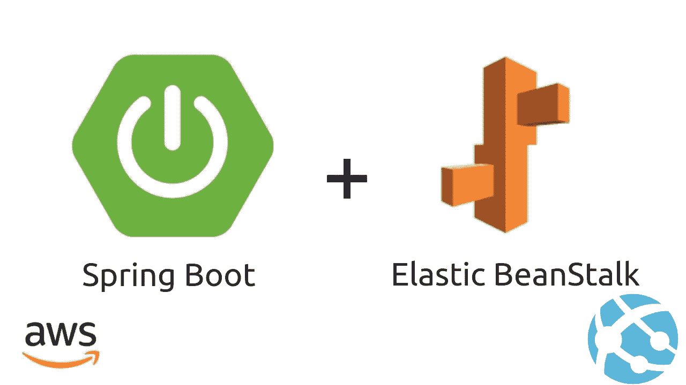
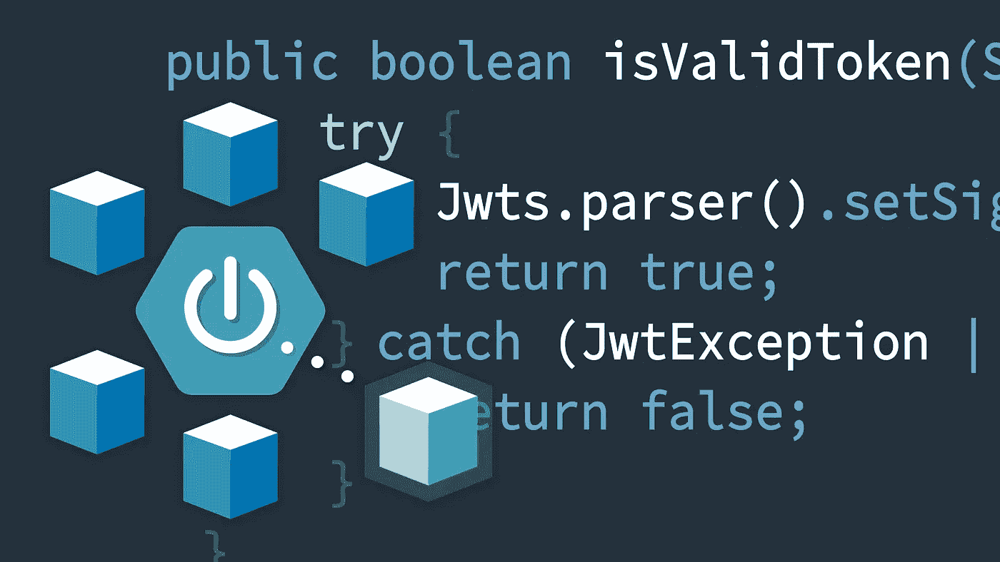
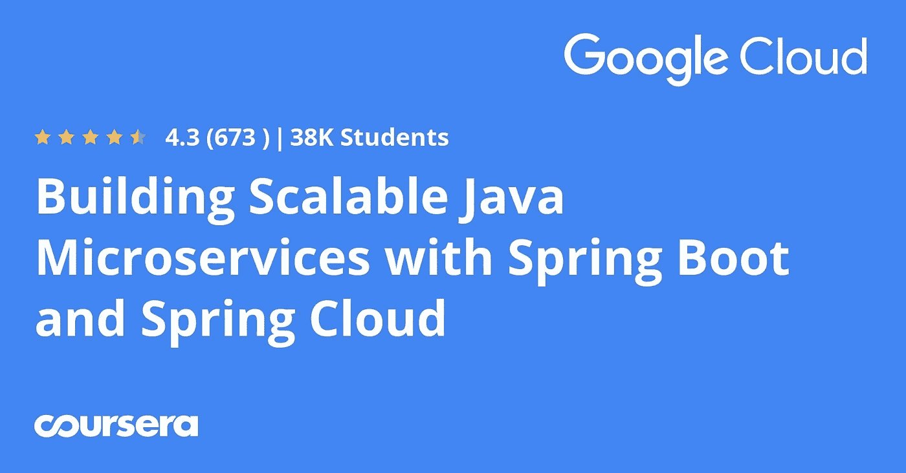
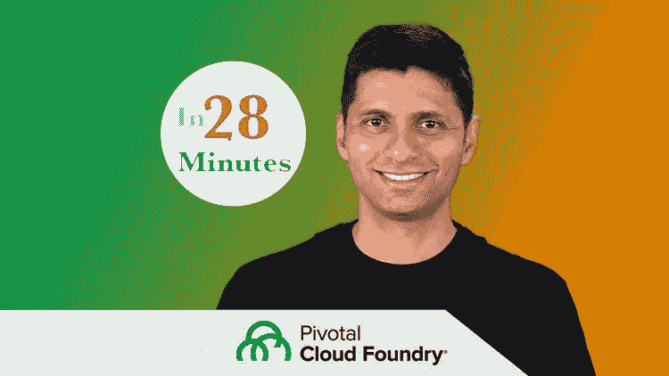
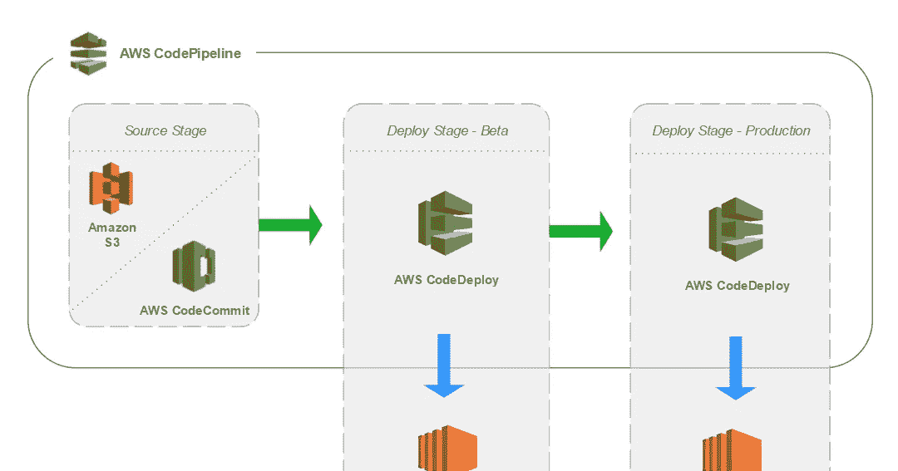

# 2023 年 AWS 和 Azure 的 7 个最佳 Spring Boot 和云原生 Java 课程

> 原文：<https://medium.com/javarevisited/7-best-courses-to-learn-spring-boot-with-aws-and-azure-cloud-platform-9f953d12bb93?source=collection_archive---------2----------------------->

## 我最喜欢的在线课程，学习如何在 AWS、Microsoft Azure 或 Pivotal Cloud Foundry 等公共云平台上开发和部署 Spring boot 微服务

大家好，如果你想学习如何在 AWS、Azure 和谷歌云平台等公共云平台上部署 Spring Boot 应用和微服务，并寻找在线课程等最佳资源，那么你来对地方了。

*披露——顺便说一句，其中一些链接是附属链接，如果你使用我的链接加入这些课程，我可能会得到报酬。*

此前，我已经分享了 [**我最喜欢的 Spring Boot 课程**](/javarevisited/top-10-courses-to-learn-spring-boot-in-2020-best-of-lot-6ffce88a1b6e) 和 [**最佳微服务课程**](/javarevisited/10-best-java-microservices-courses-with-spring-boot-and-spring-cloud-6d04556bdfed) ，在本课程中，我将分享一些高级水平的课程，以了解 Spring Boot 微服务在 AWS、Azure、Google 云平台，甚至在 legacy Cloud Foundry 上的容器化和部署。

如果您一直在阅读技术博客和文章，那么您可能会听说各种规模的公司都在广泛采用云技术。在过去的几年中，许多公司，无论大小，都已经将他们的基础架构转移到云上，或者正在这样做。

我毫不怀疑下一代 Java 应用程序将会为云而编写并在云中运行，这也是为什么 Java 开发人员了解云平台，如 AWS、Azure、GCP、Cloud Foundry 等是如此重要。

令人欣慰的是，像[**Spring Framework**](/javarevisited/10-best-online-courses-to-learn-spring-framework-in-2020-f7f73599c2fd)这样的 Java 框架正在认真对待这种云迁移，像 Spring cloud 这样的新框架正在流行，这使得开发基于云的应用程序变得容易。

虽然将重点从内部编写转移到云原生应用会有一些挑战，但采用[微服务架构](https://javarevisited.blogspot.com/2018/02/top-5-spring-microservices-courses-with-spring-boot-and-spring-cloud.html)和云原生 Java 可以帮助 Java 开发人员保持领先。

微服务架构非常适合公共云，其重点是利用按需资源进行弹性扩展。

由于大部分的 web 应用和微服务开发都是在 [Spring Boot](/javarevisited/10-free-spring-boot-tutorials-and-courses-for-java-developers-53dfe084587e?source=collection_home---4------7-----------------------) 上进行的，到目前为止你能学到的主要东西就是如何在不同的云平台上部署你的 Spring Boot 应用，比如 AWS 和微软的 [Azure 云平台](/javarevisited/10-best-microsoft-azure-courses-for-beginners-and-experienced-developers-d41a454834c0)

，而我已经分享了云计算资源，比如 [AWS](/javarevisited/5-best-aws-courses-for-beginners-and-experienced-developers-to-learn-in-2021-563212409fbd?source=rss-bb36d8439904------2&utm_source=dlvr.it&utm_medium=linkedin) 、 [Azure](/javarevisited/7-best-courses-for-az-104-microsoft-azure-administrator-associate-certification-exam-in-2021-7b620d61dcd8) ， 和 [GCP](/javarevisited/5-best-courses-to-learn-google-cloud-platform-gcp-in-2021-169093a3771a) 在过去，我的读者问我一些关于 [Java](https://javarevisited.blogspot.com/2017/12/10-things-java-programmers-should-learn.html#axzz5atl0BngO) 和 [Spring Boot](https://javarevisited.blogspot.com/2018/05/top-5-courses-to-learn-spring-boot-in.html#axzz6NYMQvHsA) 的问题，这就是为什么我要分享 5 个关于 Java 和 Spring Boot 的最佳云课程。

这些是**实用**和**实践课程**，将教你如何使用 Elastic Beanstalk、ECS 和 Fargat 将你的 Spring Boot 应用部署到 AWS，或者将 [Java 微服务](/javarevisited/10-best-java-microservices-courses-with-spring-boot-and-spring-cloud-6d04556bdfed)部署到 AWS 和其他云平台。

这些课程对于使用 Spring Boot 和云平台的初学者和有经验的 Java 开发人员以及负责管理云上 Java 应用的 [**DevOps 工程师**](https://javarevisited.blogspot.com/2018/09/the-2018-devops-roadmap-your-guide-to-become-DevOps-Engineer.html) 同样有用。

# 7 2023 年最佳 Spring Boot 带 AWS 和 Azure 初学者课程

在不浪费你更多时间的情况下，这里有一个面向 Java 和 Spring Boot 开发者的最佳实践云课程列表。目前，这些在线培训课程涵盖了云平台，如[亚马逊 Web 服务](/javarevisited/top-10-courses-to-learn-amazon-web-services-aws-cloud-in-2020-best-and-free-317f10d7c21d)、[微软 Azure](/javarevisited/10-best-microsoft-azure-courses-for-beginners-and-experienced-developers-d41a454834c0?source=---------0-----------------------) 、[谷歌云平台](/javarevisited/5-best-gcp-associate-cloud-engineer-certification-courses-in-2021-c93d7e35228a)和 Pivotal 的 Cloud Foundry 环境，但我会继续添加新的培训课程，这些课程侧重于 Java 和 Spring boot，但会教你如何在谷歌云平台和其他平台上部署 Spring Boot 应用程序和微服务。

## 1.[使用 Elastic Beanstalk 将 Java Spring Boot 应用部署到 AWS 上](https://click.linksynergy.com/deeplink?id=JVFxdTr9V80&mid=39197&murl=https%3A%2F%2Fwww.udemy.com%2Fcourse%2Fdeploy-java-spring-boot-to-aws-amazon-web-service%2F)

如果您想将 Spring Boot 应用程序部署到 AWS，这是您应该首先学习的课程之一。本课程将一步一步教你使用 Elastic Beanstalk 服务将 Java Spring Boot REST API 和全栈应用程序部署到 AWS。

由[**Ranga Rao Karnam**](https://click.linksynergy.com/deeplink?id=CuIbQrBnhiw&mid=39197&murl=https%3A%2F%2Fwww.udemy.com%2Fuser%2Fin28minutes%2F)创建，他是一位 Java 开发人员，也是最畅销的 Udemy 讲师。本课程不仅会教你核心 AWS 服务，如 EC2、S3、AWS CodePipeLine、AWS CodeBuild、SQS、IAM、CloudWatch，还会教你如何将 RESTful web 服务[部署到云中。

您将学习如何使用 Docker 封装您的 Java 和 Spring Boot 应用程序，然后将其部署到云中。您还将学习如何基于负载自动扩展您的 Java 应用程序，以及如何使用](/javarevisited/top-5-books-and-courses-to-learn-restful-web-services-in-java-using-spring-mvc-and-spring-boot-79ec4b351d12) [AWS](https://javarevisited.blogspot.com/2019/08/how-to-crack-aws-certified-solution-architect-exam.html) 中的 Elastic Beanstalk 服务在负载平衡器后面部署多个实例。

您还将学习如何使用 AWS 代码管道创建一个持续的交付管道，从 DevOps 的角度来看，这是非常重要的。

**这是加入本课程的链接**——[使用 Elastic Beanstalk 将 Java Spring Boot 应用部署到 AWS](https://click.linksynergy.com/deeplink?id=JVFxdTr9V80&mid=39197&murl=https%3A%2F%2Fwww.udemy.com%2Fcourse%2Fdeploy-java-spring-boot-to-aws-amazon-web-service%2F)

总的来说，这是一门非常实用和有用的课程，适合希望学习如何在 AWS 上部署、扩展和管理 Java 和 Spring boot 应用程序的有经验的 Java 开发人员。

## 2.[AWS 上的 Spring 框架 devo PS](https://click.linksynergy.com/deeplink?id=JVFxdTr9V80&mid=39197&murl=https%3A%2F%2Fwww.udemy.com%2Fcourse%2Fspring-core-devops-on-aws%2F)

这是 Java 开发人员的另一个很好的课程，他们希望了解如何在 AWS 上将 Spring Boot 应用程序部署到云上，以及如何在 AWS (CI/CD)中为 DevOps 实现持续集成和持续交付。

由我在 Udemy 上最喜欢的 Java 导师之一 Spring Framework Guru 的[约翰·汤姆逊](https://click.linksynergy.com/deeplink?id=CuIbQrBnhiw&mid=39197&murl=https%3A%2F%2Fwww.udemy.com%2Fuser%2Fjohn-thompson-2%2F)创建，本课程专注于 AWS 云平台上 Spring 应用的 DevOps。

在本课程中，您将学习如何将 Spring 应用程序部署到包括 AWS 在内的多个环境中。您将从基础开始，比如使用亚马逊 EC2 服务在 AWS 中创建一个服务器。

这是一门实践性很强的课程，为了充分利用这门课程，您需要一个 AWS 帐户。不要担心，您不需要花费任何额外的钱，因为您应该能够使用 AWS 免费层来完成课程任务。

在本课程中，您将学习如何在 Linux 服务器上安装 Jenkins。您将在 AWS 云中提供的服务器。您还将学习如何在 AWS 环境中使用 [Docker](/@javinpaul/10-free-courses-to-learn-docker-and-devops-for-frontend-developers-691ac7652cee) 和 [MySQL](/@javinpaul/top-5-courses-to-learn-mysql-in-2020-4ffada70656f) 数据库。

**这里是加入本课程的链接**—[Spring Framework devo PS on AWS](https://click.linksynergy.com/deeplink?id=JVFxdTr9V80&mid=39197&murl=https%3A%2F%2Fwww.udemy.com%2Fcourse%2Fspring-core-devops-on-aws%2F)

该课程还教授您企业软件开发中使用的最佳实践，例如使用持续集成服务器进行持续交付。

## 3.扩展、保护和对接 Spring Boot 微服务

这是另一个高级 Spring Boot 微服务课程，面向希望部署到 AWS 和 Azure 等公共云计算平台的 Java 开发人员。

部署到云之前的一个关键步骤是将您的 Spring Boot 应用容器化或对接，本课程将教您如何扩展、改进、强化、测试和“对接”您的 Spring Boot 微服务，并将它们转化为生产就绪型应用。

您还将了解如何链接到外部数据库，构建安全的 API，使用单元*和*集成测试来发现开发期间的应用程序缺陷，以及使用 Docker 容器配置可伸缩的部署选项。

总体而言，这是一门高级课程，旨在扩展、完善、强化、测试和“对接”您的 Spring Boot 微服务，并将它们转化为生产就绪型应用。

**这是参加本课程的链接** — [扩展、保护和对接 Spring Boot 微服务](http://linkedin-learning.pxf.io/c/1193463/449670/8005?u=https%3A%2F%2Fwww.linkedin.com%2Fextending-securing-and-dockerizing-spring-boot-microservices)

顺便说一下，你需要一个[LinkedIn Learning membership](http://By the way, you would need a LinkedIn Learning membership to watch this course which costs around $19.99 per month but you can also watch this course for FREE by taking their 1-month-free-trail which is a great way to explore their 16000+ online courses on the latest technology.)来观看这个课程，这个课程每月花费大约 19.99 美元，但是你也可以通过参加他们的 [**1 个月免费试用**](http://linkedin-learning.pxf.io/c/1193463/449670/8005?u=https%3A%2F%2Fwww.linkedin.com%2Flearning%2Fsubscription%2Fproducts) 来免费观看这个课程，这是一个探索他们 16000 多门最新技术在线课程的好方法。

## 4.[用 Spring Boot 和 Spring Cloud 构建可扩展的 Java 微服务](https://coursera.pxf.io/c/3294490/1164545/14726?u=https%3A%2F%2Fwww.coursera.org%2Flearn%2Fgoogle-cloud-java-spring)【Coursera】

这是 Coursera 提供的免费 Spring Boot 微服务课程，在这里你将学习如何在谷歌云平台上用 Spring Boot 和 Spring Cloud 微服务开发 Java 微服务

本课程由 Google Cloud Training 创建，因此您将从源头开始学习。在他的课程中，您将使用云运行时配置和 Spring Cloud Config 来管理应用程序的配置。

您将通过云发布/订阅和 Spring 集成来发送和接收消息。您还将使用 Cloud SQL 作为 Java 应用程序的托管关系数据库，并学习如何迁移到 Cloud Spanner，这是 Google Cloud 的全球分布式强一致性数据库服务。

它还将教你如何用 Stackdriver 跟踪和调试 Spring 应用程序。

**这里是加入本课程的链接**——[——*用 Spring Boot 和春云*构建可扩展的 Java 微服务](https://coursera.pxf.io/c/3294490/1164545/14726?u=https%3A%2F%2Fwww.coursera.org%2Flearn%2Fgoogle-cloud-java-spring)

顺便说一句，如果你发现 Coursera 的课程很有用，因为它们是由世界各地的知名公司和大学创建的，我建议你加入 Coursera Plus 的订阅计划，它可以让你无限制地访问他们最受欢迎的课程、专业知识、专业证书和指导项目。

<https://coursera.pxf.io/c/3294490/1164545/14726?u=https%3A%2F%2Fwww.coursera.org%2Fcourseraplus>  

## 5.[使用 Spring 微服务的 Master Pivotal Cloud Foundry(PCF)](https://click.linksynergy.com/deeplink?id=CuIbQrBnhiw&mid=39197&murl=https%3A%2F%2Fwww.udemy.com%2Fcourse%2Flearn-pivotal-cloud-foundry-pcf-deploying-spring-boot-apps%2F)

除了像 AWS、Azure 和 GCP 这样的主要云平台，还有像 Pivotal 的 Cloud Foundry(也称为 PFC)这样的专业云平台。如果你还记得，Pivotal 是 Spring Framework 背后的公司，他们也是云原生 Java 开发的先驱。

对了，PCF 现在叫坦子。PWS 已经不在了。您需要在本地机器上安装 PCF Dev 来使用 PCF。

如果您正在寻找一门课程来学习如何将 Java 或 Spring Boot 应用程序、RESTful API、[全栈应用程序](/javarevisited/10-best-java-full-stack-web-development-courses-to-join-in-2020-6cd6cd2e5868)和微服务部署到 Pivotal Cloud Foundry，那么这门课程最适合您。

在本课程中，您不仅将学习 Pivotal Cloud Foundry ( PCF)基础知识，还将学习如何将 Spring Boot REST API 部署到 Pivotal Cloud Foundry 环境中。

本课程涵盖了许多 PCF 服务，如数据库、Spring Cloud Services，包括服务注册和配置服务器，这对 Java 开发人员很重要。

你不仅要学习部署 REST APIS 和微服务，还要学习用 Java 和 Spring Boot 编写的全栈应用程序。

**这里是加入本次 Spring Boot 发生**——[Master Pivotal Cloud Foundry(PCF)搭配 Spring 微服务](https://click.linksynergy.com/deeplink?id=CuIbQrBnhiw&mid=39197&murl=https%3A%2F%2Fwww.udemy.com%2Fcourse%2Flearn-pivotal-cloud-foundry-pcf-deploying-spring-boot-apps%2F)的链接

您还将了解如何基于负载自动扩展应用程序，以及如何使用 Pivotal Cloud Foundry 在负载平衡器后部署多个实例。简而言之，这是一门从 Java 和 Spring boot 开发人员的角度了解 Pivotal Cloud Foundry 平台的实用课程。

## 6.[AWS 中的 Docker 将 Java Spring Boot 部署到 AWS Fargate & ECS](https://click.linksynergy.com/deeplink?id=CuIbQrBnhiw&mid=39197&murl=https%3A%2F%2Fwww.udemy.com%2Fcourse%2Fdeploy-spring-microservices-to-aws-with-ecs-and-aws-fargate%2F)

这是针对 Java 和 Spring Boot 开发人员的另一门 AWS 高级课程。它包含超过 8 个小时的在线培训材料，从 Java 开发人员的角度教你关于 AWS 需要知道的一切。

由[在 28 分钟](https://click.linksynergy.com/deeplink?id=CuIbQrBnhiw&mid=39197&murl=https%3A%2F%2Fwww.udemy.com%2Fuser%2Fin28minutes%2F)内创建，本课程从解释 AWS 基础知识开始，然后涵盖许多 AWS 服务，如 ECS —弹性容器服务、AWS Fargate、EC2 —弹性计算云、S3、AWS CodePipeLine、AWS CodeBuild、IAM、CloudWatch、ELB、Target Groups、X-Ray、AWS Parameter Store、AWS App Mesh 和 Route 53。

您不仅将学习如何为您的 Java [Spring Boot 微服务](https://hackernoon.com/5-books-to-learn-microservices-in-java-with-spring-boot-and-spring-cloud-0fdr3yd9)项目构建 Docker 映像，还将学习使用 ECS(弹性容器服务)实现容器编排的基础知识——集群、任务定义、任务、容器和服务。

您还将学习一些实用的东西，如使用 AWS 代码管道创建连续交付管道，以及如何使用服务事件和 AWS CloudWatch 日志调试部署容器的问题等。它还包括使用 AWS 参数存储为您的 Java Spring Boot 微服务实现集中式配置管理。

**以下是参加本课程的链接**——[将 Spring Boot 微服务部署到 AWS](https://click.linksynergy.com/deeplink?id=JVFxdTr9V80&mid=39197&murl=https%3A%2F%2Fwww.udemy.com%2Fcourse%2Fdeploy-spring-microservices-to-aws-with-ecs-and-aws-fargate%2F)

我向负责管理基于 Java 的微服务和 Spring boot 应用的[经验丰富的 Java 开发人员](https://javarevisited.blogspot.com/2020/04/top-10-advanced-java-books-for-experienced-programmers.html)和 [DevOps 工程师](/hackernoon/the-2018-devops-roadmap-31588d8670cb)强烈推荐这门课程。

总体来说，是面向 Java 和 Spring Boot 开发者的高级 AWS 课程。您将学到许多实用的东西，用于在 AWS 上部署、扩展、监控、故障排除和跟踪 Java 和 Spring boot 应用程序。

## 7.[掌握 Azure Web 应用——将 Java Spring Boot 应用带到 Azure](https://click.linksynergy.com/deeplink?id=JVFxdTr9V80&mid=39197&murl=https%3A%2F%2Fwww.udemy.com%2Fcourse%2Fdeploy-spring-boot-to-azure%2F)

这是 Ranga Karnam 的另一门 Spring Boot 课程，在这门课程中，他将教你如何将 Java Spring Boot REST API、全栈、Docker 和带有 Azure App Service 的 Web 应用以及 Azure Web 应用部署到 Microsoft Azure 平台中。

这与第一门课程没有太大的不同，第一门课程讲述了在 AWS 上部署 Spring Boot 应用程序，如果你已经学过这门课程，那么在 Azure 上部署将会容易得多，因为 AWS 和 Azure 都是如此。

尽管 AWS 和 Azure 都有不同的计算、存储和网络服务，但概念和流程是相同的。

像部署容器化版本这样的事情对 [AWS](/javarevisited/top-10-courses-to-learn-amazon-web-services-aws-cloud-in-2020-best-and-free-317f10d7c21d) 和 [Azure](https://javarevisited.blogspot.com/2020/02/top-5-AZ-900-exam-Azure-Fundamentals-certification-practice-tests-and-mock-exams-to.html) 都适用。好的一面是，您将学习如何在线部署您的 Java Spring Boot 应用程序以实时访问互联网，这是许多 Java 开发人员经常问的问题。看到你的应用在网上直播会给你很大的满足感，你也可以与你的朋友和同事分享链接。

**这是参加本课程的链接**——[将 Java Spring Boot 应用程序带到 Azure](https://click.linksynergy.com/deeplink?id=JVFxdTr9V80&mid=39197&murl=https%3A%2F%2Fwww.udemy.com%2Fcourse%2Fdeploy-spring-boot-to-azure%2F)

如果你有一个创业想法，那么你也可以使用在本课程中学到的技术来部署一个概念验证应用程序，并与你的客户和 beta tester 分享。总的来说，这是一门在 Microsoft Azure 平台上部署 Java 和 Spring Boot 应用程序的实用实践课程。

以上是关于如何在各种云平台(如 AWS、Microsoft Azure 和 Pivotal 的 CloudFoundary)上部署 Spring Boot 应用程序的一些**最佳课程**。

该列表不仅包括教你如何部署 Java 的基础课程 [AWS](/javarevisited/10-best-aws-certified-cloud-practitioner-clf-c01-online-courses-and-practice-test-to-crack-ecc0f913091e) 和 [Azure 基础知识](/javarevisited/5-best-azure-fundamentals-courses-to-pass-az-900-certification-exam-in-2020-9e602aea035d)，还包括一些高级课程，教你如何在互联网上部署 spring boot，如何通过 web 访问它，以及如何通过使用 AWS 提供的复杂服务根据负载自动伸缩。

其他 **Java 和 Spring 文章**你可能喜欢探索

*   [面向 Java 开发者的 5 门免费 Spring 框架课程](http://www.java67.com/2017/11/top-5-free-core-spring-mvc-courses-learn-online.html)
*   [与 Spring Boot 一起学习微服务的 5 大课程](https://javarevisited.blogspot.com/2018/02/top-5-spring-microservices-courses-with-spring-boot-and-spring-cloud.html#axzz6JJFPbsyP)
*   [深入学习 Spring 的五大课程](https://javarevisited.blogspot.com/2018/06/top-6-spring-framework-online-courses-Java-programmers.html)
*   [5 门免费学习核心 Java 的在线课程](http://javarevisited.blogspot.sg/2017/11/top-5-free-java-courses-for-beginners.html#axzz4zuIICRs9)
*   [面向有经验的 Java 开发人员的 5 大 Java 设计模式课程](http://javarevisited.blogspot.sg/2018/02/top-5-java-design-pattern-courses-for-developers.html)
*   [学习 Java 微服务的 7 大课程](/javarevisited/top-5-courses-to-learn-microservices-in-java-and-spring-framework-e9fed1ba804d)
*   [编程/编码工作面试的 10 门课程](http://javarevisited.blogspot.sg/2018/02/10-courses-to-prepare-for-programming-job-interviews.html)
*   [面向 Java 开发人员的 10 门高级 Spring Boot 课程](/javarevisited/10-advanced-spring-boot-courses-for-experienced-java-developers-5e57606816bd)
*   [初学者学习 Spring Cloud 的 5 大课程](https://javarevisited.blogspot.com/2018/04/top-5-spring-cloud-courses-for-java.html)
*   [10 个面向 Java 开发者的免费 Spring Boot 教程和课程](/javarevisited/10-free-spring-boot-tutorials-and-courses-for-java-developers-53dfe084587e)

感谢您阅读本文。如果你喜欢这些*最佳 Spring Boot 和云计算课程*，那么请与你的朋友和同事分享。如果您有任何问题或反馈，请留言。

**附言——**如果你正在寻找学习 Spring Boot 和云的免费课程，那么你也可以在 Udemy 上查看这个 [**Spring Boot 和 AWS S3**](https://click.linksynergy.com/deeplink?id=JVFxdTr9V80&mid=39197&murl=https%3A%2F%2Fwww.udemy.com%2Fcourse%2Fspring-boot-and-aws-s3%2F) 免费课程。本课程由 Nelson Djaolo 创建，它将教你如何上传图片和文件到亚马逊 S3。该课程完全免费，您只需创建一个免费的 Udemy 帐户即可注册该课程。

<https://click.linksynergy.com/deeplink?id=JVFxdTr9V80&mid=39197&murl=https%3A%2F%2Fwww.udemy.com%2Fcourse%2Fspring-boot-and-aws-s3%2F> 