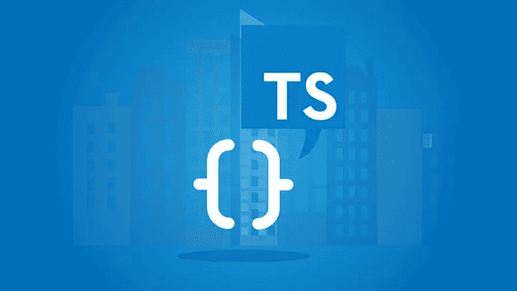
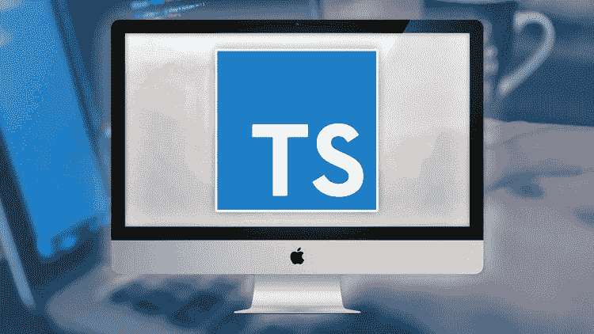
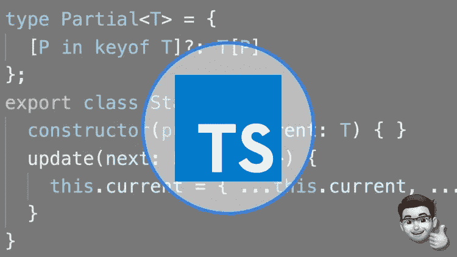
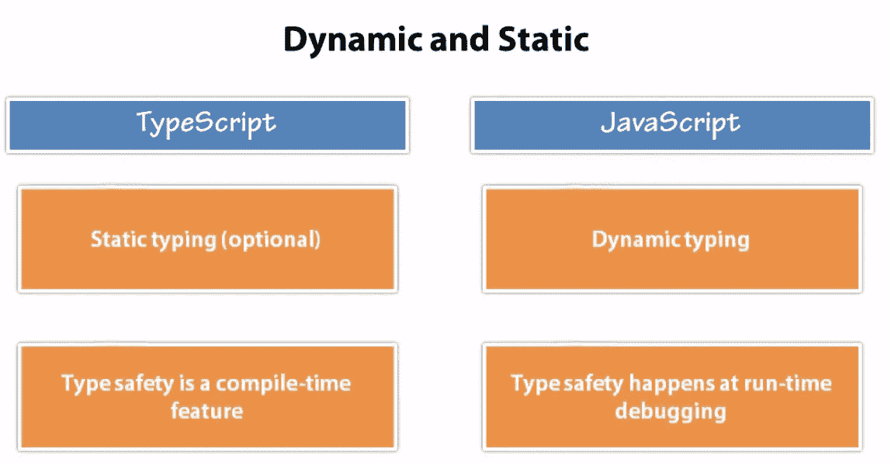
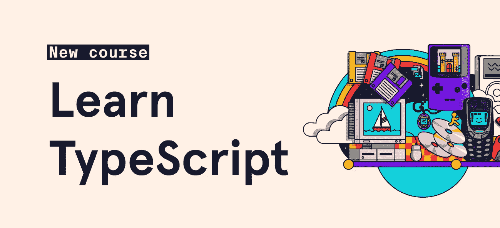
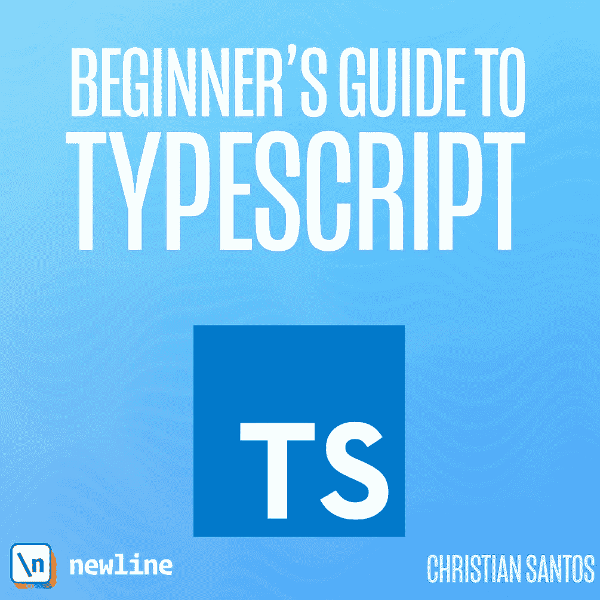
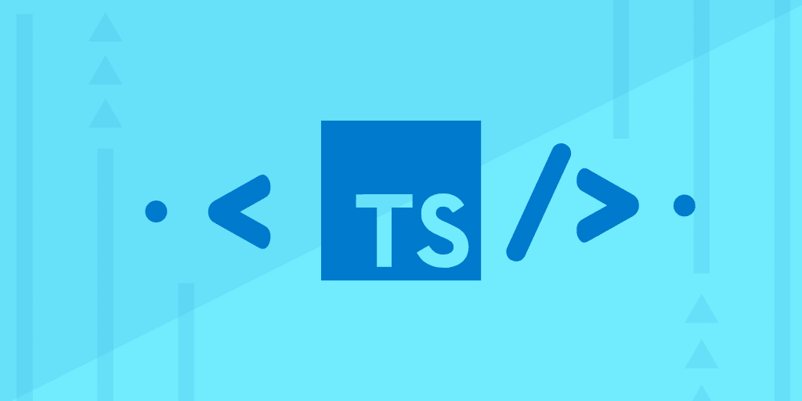

# 2023 年初学者学习的 10 门最佳打字稿课程

> 原文：<https://medium.com/javarevisited/7-best-courses-to-learn-typescript-in-depth-58439e1ce729?source=collection_archive---------0----------------------->

## 我最喜欢的学习 2023 初学者 TypeScript 的在线课程和书籍来自 Udemy，Pluralsight，Educative 等。

image_credit — [理解打字稿— 2023 版](https://click.linksynergy.com/fs-bin/click?id=JVFxdTr9V80&subid=0&offerid=323058.1&type=10&tmpid=14538&RD_PARM1=https%3A%2F%2Fwww.udemy.com%2Funderstanding-typescript%2F)

大家好，如果你今年想学习**打字稿****并寻找一些优秀的资源，如书籍、课程和教程，那么你来对地方了。在我的前几篇文章中，我已经分享了一些 [**最佳 Angular 框架教程**](/javarevisited/10-courses-to-learn-angular-for-web-development-6da1bd2856dc) 和[课程](https://javarevisited.blogspot.com/2018/06/5-best-courses-to-learn-angular.html)，今天，我将分享一些**最佳 TypeScript 在线课程**你可以加入来自学它。**

许多程序员和 web 开发人员正在学习 TypeScript，因为它强大的语法和高级的 OOP 特性，更重要的是，为了开发基于角度的应用程序。

既然 Angular 团队选择了 TypeScript 作为 Angular 开发的官方语言，那么如果你想充分利用 Angular，了解 [TypeScript](/javarevisited/top-10-free-typescript-courses-to-learn-online-best-of-lot-44bce9da41d1) 是至关重要的，但这并不是你应该学习 TypeScript 的唯一原因。

关于 TypeScript 最好的事情之一是，它通过改进的语法使 JavaScript 中面向对象的开发变得更容易，就像现在你可以在 [JavaScript](http://www.java67.com/2018/04/top-5-free-javascript-courses-to-learn.html) 中声明一个类，也可以有一个**类型**，是的，TypeScript 这个名字表明了这一点。

**TypeScript 可以看作是具有类型**的 JavaScript，这意味着您现在可以使用 String、integer、boolean 和其他静态类型的能力。这不仅会减少意外错误，如将整数变量存储到字符串中，反之亦然，还会使您的代码更具可读性。

而且，你仍然可以在 Firefox 或者 Chrome 这样的浏览器中运行你的 TypeScript 程序，因为 **TypeScript 编译器生成** [**JavaScript 代码**](https://javarevisited.blogspot.com/2018/04/top-5-java-frameworks-to-learn-in-2018_27.html#axzz5DmwFLA1K) ，可以在任何浏览器上运行。

那么，你还在等什么呢，读完这些课程，选择一门你最喜欢的课程，开始你的打字世界之旅吧。

# 2023 年学习 TypeScript 的 10 个最佳在线课程

由于在线课程是学习新技术、编程语言或一个框架的最佳方式，我建议你从它们开始，然后阅读一本书，以获得更全面的知识。

前面我已经分享了一些你们很多人喜欢的免费的 [Angular](http://www.java67.com/2018/01/top-5-free-angular-js-online-courses-for-web-developers.html) 和[打字稿课程](http://www.java67.com/2018/05/top-5-free-typescript-courses-to-learn.html)，但是我也收到关于最好的打字稿课程的反馈，不一定是免费的；这就是我写这篇文章的原因。

在这篇文章中，我将分享一些**市面上最好的打字稿在线培训课程**并且花费很少。

这些 TypeScript 课程中的大多数受到成千上万的程序员和 web 开发人员的信任，并且它们也非常实惠，因为你可以在 **$9.9** 在 [Udemy flash sales](https://click.linksynergy.com/fs-bin/click?id=JVFxdTr9V80&offerid=323058.9409&type=3&subid=) 中获得它们中的大多数，它们提供巨大的折扣，大约 90%。

无论如何，不再多说，下面是我列出的学习一门打字脚本编程语言的 7 门顶级课程:

## 1.[理解打字稿— 2023 版](https://click.linksynergy.com/fs-bin/click?id=JVFxdTr9V80&subid=0&offerid=323058.1&type=10&tmpid=14538&RD_PARM1=https%3A%2F%2Fwww.udemy.com%2Funderstanding-typescript%2F)

这是一门从零开始学习 TypeScript 的绝佳课程。它超越了 TypeScript 对 Angular 2 的使用，并解释了一些基础知识，例如，为什么 TypeScript 比 JavaScript 更好，以及它到底是如何工作的。

课程的结构也非常好，教你从安装 TypeScript 到编写全功能代码的一切，比如将 TypeScript 与 [ReactJS](http://www.java67.com/2018/02/5-free-react-courses-for-web-developers.html) 和 [Angular](https://javarevisited.blogspot.com/2018/01/10-frameworks-java-and-web-developers-should-learn.html) 一起使用。在本课程中，您将学习如何使用 TypeScript 及其高级功能，如类型、ES6 支持、类、模块、接口等。您将学习如何使用类型编写更好的代码。

**这是加入本课程**——[理解打字稿](https://click.linksynergy.com/fs-bin/click?id=JVFxdTr9V80&subid=0&offerid=323058.1&type=10&tmpid=14538&RD_PARM1=https%3A%2F%2Fwww.udemy.com%2Funderstanding-typescript%2F)的链接

您还将学习如何使用类和对象创建面向对象的代码，如何使用名称空间和模块来更好地组织代码，以及如何使用高级的类似 Java 的特性(如泛型)来编写代码，这样更易于维护和扩展。

总的来说，这是一门很好的课程，你可以从头开始学习打字稿，也可以学习一些高级概念。

## 2.[打字稿:完整的开发者指南【2023】—Udemy](https://click.linksynergy.com/deeplink?id=JVFxdTr9V80&mid=39197&murl=https%3A%2F%2Fwww.udemy.com%2Fcourse%2Ftypescript-the-complete-developers-guide%2F)

这是一门高级的 TypeScript 课程，通过学习流行的设计模式和构建复杂的项目，您将掌握 TypeScript。包括 React 和 Express！

这个课程的创始人不是别人，正是 Stephen Grider，他是 Udemy 最好的导师之一，也是我的最爱。参加了他的 React 和 GraphQL 课程后，我确信这也将是一个杰作，我没有失望。

以下是您将在他的课程中学到的主要内容:

*   如何为构建大型应用程序编写设计模式代码
*   如何将 Typescript 集成到 React/Redux 或 Express 项目中
*   理解组合和继承，以及何时使用它们
*   如何编写由类和接口驱动的可重用代码
*   为您自己的 Typescript 项目组装可重用的样板

**这里是加入本课程的链接** — [打字稿:完全开发者指南【2023】](https://click.linksynergy.com/deeplink?id=JVFxdTr9V80&mid=39197&murl=https%3A%2F%2Fwww.udemy.com%2Fcourse%2Ftypescript-the-complete-developers-guide%2F)

ZTM 学院也提供这门课程，但你需要一个 [**ZTM 会员**](https://academy.zerotomastery.io/p/academy?affcode=441520_zytgk2dn) 来观看这门课程，每月花费约 29 美元，但也提供了许多超级有趣和有用的课程，如他的 [Python Bootcamp 课程](https://academy.zerotomastery.io/p/complete-python-developer-zero-to-mastery?affcode=441520_zytgk2dn)和他的大规模 J [avaScript Web 项目:20 个项目来构建你的投资组合](https://academy.zerotomastery.io/p/javascript-projects?affcode=441520_zytgk2dn)课程。您还可以使用我的代码朋友 10 获得您选择的任何订阅的 10%的折扣。

 [## ZTM 学院

### 无论你是刚刚开始学习编码，还是想提高你的技能，零到精通学院将教你…

academy.zerotomastery.io](https://academy.zerotomastery.io/p/academy?affcode=441520_zytgk2dn) 

## 2.[打字稿大师班&免费电子书](https://click.linksynergy.com/fs-bin/click?id=JVFxdTr9V80&subid=0&offerid=323058.1&type=10&tmpid=14538&RD_PARM1=https%3A%2F%2Fwww.udemy.com%2Fcomplete-typescript-2-course%2F)

这是学习 TypeScript 的另一个极好的课程。与之前的课程相比，它更具实践性，因为您还将通过在 Typescript 中构建一个 Node REST API 来完成一个项目，并使用 Angular 6(Google 的 Angular framework 的最新版本)来查询它。

与之前的课程类似，这一节也重点讲述了[使用 TypeScript 的面向对象代码](/swlh/5-free-object-oriented-programming-online-courses-for-programmers-156afd0a3a73)。尽管如此，它还涉及到更实际的方面，如调试 TypeScript 和在旅途中构建小型应用程序。

您还将了解泛型、[装饰器](https://javarevisited.blogspot.com/2011/11/decorator-design-pattern-java-example.html)、类型安全，以及 TypeScript 的其他基本特性，如名称空间和模块。

简而言之，在办公室或家中舒适地自学打字的绝佳课程。如果你购买了本课程，你还可以得到一本免费的电子书，可以和课程一起使用。

**这里是加入本课程**——[打字大师班&免费电子书](https://click.linksynergy.com/fs-bin/click?id=JVFxdTr9V80&subid=0&offerid=323058.1&type=10&tmpid=14538&RD_PARM1=https%3A%2F%2Fwww.udemy.com%2Fcomplete-typescript-2-course%2F)的链接

## 3.专业人士打字稿【Udemy】

这是另一个从零开始学习 TypeScript 的很棒的在线课程。由微软 MVP 创建，这个课程将教你你需要知道的关于 TypeScript 的一切。

其他在线课程会教您基本的语法和功能，但只有本课程会向您展示如何将 TypeScript 应用于现实世界的项目，引导您如何构建自己的大型成功项目。

课程重点介绍用 TypeScript 进行 OOP 编程。如果你懂任何面向对象的语言，比如 [C++](http://www.java67.com/2018/02/5-free-cpp-courses-to-learn-programming.html) 或者 [Java](https://javarevisited.blogspot.com/2017/11/top-5-free-java-courses-for-beginners.html#axzz5Ie75bPFF) ，那么事情会变得简单明了，但是如果你不懂，那么事情会变得有点棘手。您将了解类和对象、[构造函数](https://javarevisited.blogspot.com/2012/12/what-is-constructor-in-java-example-chainning-overloading.html)和[方法重载](http://www.java67.com/2015/08/top-10-method-overloading-overriding-interview-questions-answers-java.html)、公共和私有成员、将对象作为参数传递等等。

您还将学习一些关于 TypeScript 的高级概念，如[继承](http://www.java67.com/2012/08/what-is-inheritance-in-java-oops-programming-example.html)、[多态](http://javarevisited.blogspot.sg/2011/08/what-is-polymorphism-in-java-example.html)、内部模块或名称空间以及外部模块。简而言之，这是一个在一个半小时内学习 TypeScript 基础知识的优秀的短期课程。

**这里是加入本课程的链接** — [专业人士打字稿](https://click.linksynergy.com/deeplink?id=JVFxdTr9V80&mid=39197&murl=https%3A%2F%2Fwww.udemy.com%2Fcourse%2Ftypescript-for-professionals%2F)

## 4.[打字基础](https://pluralsight.pxf.io/c/1193463/424552/7490?u=https%3A%2F%2Fwww.pluralsight.com%2Fcourses%2Ftypescript)【多视最佳教程】

我参加过一些关于 TypeScript 的课程，这是最完整和实用的课程之一。它首先介绍并解释为什么使用 TypeScript，然后详细介绍 TypeScript 的特性、语法、关键字和代码层次结构。

一旦你掌握了基础知识，课程就转移到工具和框架、IDE 和 Sublime 文本，以及其他你需要知道的使用 [TypeScript](https://javarevisited.blogspot.com/2018/07/top-5-courses-to-learn-typescript.html) 进行专业开发的有用细节。

你还会学到类和接口，模块，函数，箭头函数和[调试](http://www.java67.com/2018/01/how-to-remote-debug-java-application-in-Eclipse.html)，静态类型化等。总的来说，这是一门学习打字稿的好课程。这里有一张幻灯片为初学者描述了 TypeScript 和 JavaScript 之间的关键区别，

这里是加入本课程的链接— [打字基础](https://pluralsight.pxf.io/c/1193463/424552/7490?u=https%3A%2F%2Fwww.pluralsight.com%2Fcourses%2Ftypescript)

毫无疑问，这是学习 TypeScript 的一门极好的课程，但你需要一个 [Pluralsight 会员](http://pluralsight.pxf.io/c/1193463/424552/7490?u=https%3A%2F%2Fwww.pluralsight.com%2Flearn)，每月花费 29 美元左右。不过，它在 Pluralsight 上提供了超过 7000 门课程的完整访问，这使它物有所值。

顺便说一句，即使你不是会员，你也可以参加这个课程，因为 Pluralsight 提供了一个 [**10 天的免费试用**](http://pluralsight.pxf.io/c/1193463/424552/7490?u=https%3A%2F%2Fwww.pluralsight.com%2Flearn)**，可以让你观看 200 分钟的内容。**

** [## 对个人来说

### 无论你想进入一个新的领域，改善你的角色，还是把你的伟大想法变成现实，Pluralsight…

pluralsight.pxf.io](http://pluralsight.pxf.io/c/1193463/424552/7490?u=https%3A%2F%2Fwww.pluralsight.com%2Flearn)** 

## **5.[打字稿开发简介](https://click.linksynergy.com/fs-bin/click?id=JVFxdTr9V80&subid=0&offerid=323058.1&type=10&tmpid=14538&RD_PARM1=https%3A%2F%2Fwww.udemy.com%2Fintroduction-typescript-development%2F)**

**这是在购买任何 TypeScript 课程之前在 Udemy 上的又一门课程。如果你连接到指导员，那么你应该买这一个，因为约旦哈金斯已经做了一个很好的工作，用一些不平凡的例子解释关键概念。

课程从使用 [NPM](/javarevisited/top-10-online-courses-to-learn-node-js-in-depth-8ef0e31ca139) (节点管理器包管理器)安装 TypeScript 开始，然后解释基本的语法和结构。

您还将学习使用 TypeScript 的 TypeScript 闭包和面向对象的[编程](https://javarevisited.blogspot.com/2012/03/10-object-oriented-design-principles.html)。简而言之，这是一门很好的课程，与前两门课程没有太大的不同，但我发现这位老师比其他人更好，他解释了其他老师可能会忽略的小细节。**

****这里是加入本课程**—[TypeScript 开发简介](https://click.linksynergy.com/fs-bin/click?id=JVFxdTr9V80&subid=0&offerid=323058.1&type=10&tmpid=14538&RD_PARM1=https%3A%2F%2Fwww.udemy.com%2Fintroduction-typescript-development%2F)的链接**

****

## **6.[学习打字稿](https://www.pjatr.com/t/TUJGR0lLR0JHRklJSkhCR0ZISk1N?url=https%3A%2F%2Fwww.codecademy.com%2Flearn%2Flearn-typescript)【CodeCademy 最佳课程】**

**如果你正在寻找一个学习 TypeScript 的互动课程，那么你会喜欢这个来自 [Codecademy](https://bit.ly/codecademyhome) 的免费课程，它是最强大和最受欢迎的在线学习平台之一。**

**在这个长达 10 小时的 TypeScript 课程中，您将学习如何将您已经知道的 JavaScript 语法应用于 TypeScript 的类型系统。这将有助于您构建自己的编程体验，并使您的代码更具结构性。**

**以下是您将在本课程中学到的内容:**

1.  **类型**
2.  **功能**
3.  **复杂类型**
4.  **类型缩小**
5.  **高级对象类型**

**您还将使用 TypeScript 的 linter 来减少编译错误并加速工作流。如果你喜欢从交互式课程中学习，你可以直接从你的浏览器中执行 TypeScript 代码，那么你会喜欢这个课程。**

****这里是加入本课程的链接—** [学习打字稿](https://www.pjatr.com/t/TUJGR0lLR0JHRklJSkhCR0ZISk1N?url=https%3A%2F%2Fwww.codecademy.com%2Flearn%2Flearn-typescript)**

****

**顺便说一句，如果你喜欢 Codecademy 平台，那么你也可以加入 CodeCademy PRO ，这是一个面向程序员的高级订阅。它的年费大约是每月 15.99 美元，提供所有 Codecademy 的内容、课程、测验和项目。你可以利用这一点来赚取、实践&
应用就业准备技能**

** [## 学习编码最简单的方法:PRO | Codecademy

### 您学习编码所需的一切都由我们内部的专家团队设计。这意味着我们所有的独家…

bit.ly](https://bit.ly/codecademypro)** 

## **8.[打字初学者指南](https://gumroad.com/a/221148275/Esnzb)**

**如果你喜欢在学习在线培训课程的同时阅读书籍，并寻找学习 TypeScript 的最佳书籍，那么你会喜欢 NewLine 及其团队的这本书。**

**这个课程是由性能可视化小组的脸书工程师克里斯蒂安·桑托斯创建的。他曾帮助像 Jet.com(沃尔玛)这样的公司将他们的大型项目转换成打字稿。**

**以下是您将在本课程中学到的内容:**

*   **如何开始使用 TypeScript**
*   **各种类型的细节——所以你不必到处都用**
*   **用类型编写面向对象的代码**
*   **对 Node.js 使用 TypeScript**

**通过《TypeScript 初学者指南》,您和您的团队将快速掌握 TypeScript 在项目中的实际应用。我向初学者强烈推荐这本打字本。**

**这里是获得这本书的链接 — [打字初学者指南](https://gumroad.com/a/221148275/Esnzb)**

****

## **[9。学习打字稿:初学者完全教程](https://www.educative.io/courses/learn-typescript-complete-course?affiliate_id=5073518643380224)**

**这是在线学习 TypeScript 的另一个很好的课程。这门课程的 USP 是它完全基于文本，这意味着你不需要观看视频，如果你不喜欢就跳过它们。**

**在本课程中，您将从头开始，逐步学习更高级的概念，如类型检查、迭代器以及操纵对象和数组。**

**它还非常具有交互性，这意味着您可以在浏览器上运行 TypeScript 代码，这对学习像 TypeScript 这样的新编程语言非常有帮助。**

****这里是加入本课程的链接** — [学习打字稿:初学者的完整课程](https://www.educative.io/courses/learn-typescript-complete-course?affiliate_id=5073518643380224)**

****

**你可以购买这门课程，也可以选择 [**教育订阅**](https://www.educative.io/subscription?affiliate_id=5073518643380224) ，每月花费约 18 美元，但也可以访问 100 多门软件工程和开发课程。**

**我喜欢教育性订阅，因为它使学习变得容易，因为你可以不买就加入任何课程，相信我教育性有一些最好的编码课程，如[钻研系统设计面试](https://www.educative.io/collection/5668639101419520/5649050225344512?affiliate_id=5073518643380224)和[钻研编码面试模式](https://www.educative.io/collection/5668639101419520/5671464854355968?affiliate_id=5073518643380224)。**

** [## 探索系统设计面试——互动学习

### 系统设计问题已经成为软件工程面试过程的标准部分。在这些方面的表现…

www.educative.io](https://www.educative.io/collection/5668639101419520/5649050225344512?affiliate_id=5073518643380224) 

以上是关于在线学习 TypeScript 的**最佳课程**。TypeScript 将 JavaScript 提升到了一个新的高度，使得开发更广泛的 JavaScript 应用程序变得更加容易，就像 Java 的规模一样。尽管大多数开发人员都在学习 Angular 2 的 TypeScript，但是通过利用它的类型安全和更好支持的 OOP 特性，您可以做得更多。

其他**你可能喜欢的 Web 开发书籍和课程**

*   [完整的 Web 开发者路线图](https://javarevisited.blogspot.com/2019/02/the-2019-web-developer-roadmap.html)
*   [2023 年学习 React Native 的 5 门课程](http://javarevisited.blogspot.sg/2018/02/5-react-native-courses-to-learn-mobile-development-using-JavaScript.html)
*   [2023 年学习 Web 开发的五大课程](https://javarevisited.blogspot.com/2018/02/top-5-online-courses-to-learn-web-development.html)
*   [学习大数据和 Apache Spark 的 5 条途径](http://javarevisited.blogspot.com/2017/12/top-5-courses-to-learn-big-data-and.html)
*   [面向 Web 开发人员的十大 JavaScript 教程和课程](https://javarevisited.blogspot.com/2018/06/top-10-courses-to-learn-javascript-in.html)
*   [2023 年学习 Spring Boot 的 5 大课程](https://javarevisited.blogspot.com/2018/05/top-5-courses-to-learn-spring-boot-in.html)
*   [学习 Web 开发永远不晚](https://javarevisited.blogspot.com/2019/06/its-never-too-late-to-learn-web-development.html)。
*   [2023 年 React JS 开发者路线图](https://javarevisited.blogspot.com/2018/10/the-2018-react-developer-roadmap.html)
*   [2023 年最佳阿帕奇卡夫卡课程](https://javarevisited.blogspot.com/2018/04/top-5-apache-kafka-course-to-learn.html)
*   [面向 Java 开发者的 5 门免费 Spring 框架课程](http://www.java67.com/2017/11/top-5-free-core-spring-mvc-courses-learn-online.html)
*   [2023 年网络开发人员可以学到的 10 件事](https://javarevisited.blogspot.com/2020/01/10-things-web-developers-should-learn.html)
*   [2023 年 7 门免费学习 Bootstrap 的课程](/javarevisited/7-free-courses-to-learn-bootstrap-for-web-designers-and-developers-5135215648f1)

感谢您阅读本文。如果你喜欢这些打字稿课程，那么请分享给你的朋友和同事。如果您有任何问题或反馈，请留言。

**P. S.** —如果你在寻找今年学习打字稿的免费课程，你可以查看 Udemy 上的 [**打字稿介绍**](https://click.linksynergy.com/deeplink?id=JVFxdTr9V80&mid=39197&murl=https%3A%2F%2Fwww.udemy.com%2Ftypescript%2F) 课程。这是完全免费的，也是开始打字之旅的好方法。超过 44，000 名学生已经选修了这门课程。

 [## 免费打字教程-打字教程-免费学习打字

### 在开发界被称为“代码密语者”，丹尼尔·斯特恩被认为拥有一种超自然的…

udemy.com](https://click.linksynergy.com/deeplink?id=JVFxdTr9V80&mid=39197&murl=https%3A%2F%2Fwww.udemy.com%2Ftypescript%2F)**