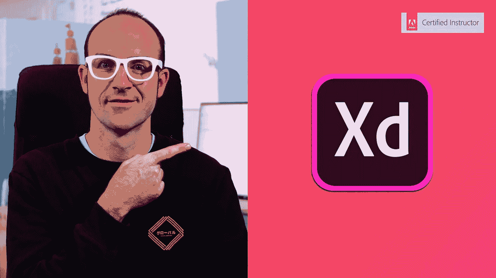

# 2023 年初学者学习 UI 和 UX 设计的 8 门最佳课程

> 原文：<https://medium.com/javarevisited/7-best-courses-to-learn-ui-and-ux-design-for-beginners-bc71c3e7499e?source=collection_archive---------0----------------------->

## 我最喜欢的 2023 年从 Udemy，Pluralsight，和 Coursera 学习 UI 和 UX 设计的在线培训课程。

image _ credit—undraw.co

大家好，如果你想学习 UX 设计，并在 2023 年成为 UX 设计师，并寻找最好的 UI/UX 设计在线课程，那么你来对地方了。

在过去，我已经分享了 [**最佳网页设计课程**](/javarevisited/8-best-responsive-design-courses-for-web-developers-e507f7952774) s 和 [**网页开发课程**](/better-programming/my-5-favorite-courses-to-learn-web-development-in-2019-a5e74167f8b2) 在这篇文章中，我将分享**最佳 UX 在线课程和认证**你可以加入在 2023 年成为 UX 设计师。

当今的就业市场对 UX/UI 和网页设计专业人才的需求持续增长。学习 UI 或 UX 技能可以打开许多本地和远程工作的大门。不言而喻，任何学科的证书都会让你在找工作时占得先机。对于任何一个 UX 设计师来说，接受培训都是一个可行的策略，可以让他从其他没有证书或自学成才的申请者中脱颖而出。一个高质量的 UX 培训项目不仅仅会让你在纸面上看起来很好，还会给你更多超越表面的深度技能和技巧。

不仅如此，那些已经对自己的 UX 设计能力很有信心的人也可以通过证书来更好地推销他们目前的知识，从而获得客户或工作。

也就是说，与其他一些数字技能如[云计算](https://javarevisited.blogspot.com/2019/07/top-5-online-courses-to-learn-cloud-computing-aws.html)不同，没有任何一个公认的 UX 认证能保证你在任何地方都有一席之地。在这种情况下，选择一个信誉良好、值得信赖的供应商是重要的第一步。

为了让你的搜索更容易，我们列出了一些*最好的 UX/UI 认证项目和在线培训课程*，它们都有很好的特点，让你的学习经历更有价值。以下课程可以帮助你建立和增长在 UX 领域取得成功所需的技能和知识。

# 2023 年 8 门最佳 UI/UX 设计初学者在线课程

为了不浪费你的时间，这里列出了 2023 年学习 UX 设计的 5 大在线培训课程。这些是来自 [Udemy](/javarevisited/my-favorite-udemy-online-courses-for-programmers-and-software-engineers-f9d941dd0035) 、 [Coursera](/javarevisited/18-coursera-courses-you-can-join-in-2020-to-learn-from-the-worlds-top-tech-companies-google-74af46967d1e) 和 [Pluralsight](/javarevisited/top-10-pluralsight-courses-to-learn-programming-and-software-development-during-covid-19-stay-at-30b7d8a4f88f) 的最好的在线 UI 课程，受到成千上万学习者的信赖。它们也完全在线，这意味着您现在可以在办公室和家里舒适地使用它们。无论你是想为一家跨国公司工作，还是只想做一些远程 UI/UX 的工作，这些课程都将为你提供做好工作所需的技能。

## 1.[Coursera 上的谷歌 UX 设计专业证书](https://coursera.pxf.io/c/3294490/1164545/14726?u=https%3A%2F%2Fwww.coursera.org%2Fprofessional-certificates%2Fgoogle-ux-design)

如果你是一个初学者，正在寻找一个综合的课程，不仅要深入学习用户界面和 UX 设计，还要获得一个有价值的证书，那么这个关于 UX 设计的谷歌专业证书是最好的开始课程。

在这个课程中，你将学到所有你想知道的关于用户界面和 UX 设计的东西，比如设计过程，与用户共情，定义痛点，构思解决方案，创建线框和原型，测试和迭代设计。

您还将了解 UX 研究的基本知识，如规划研究、进行访谈和可用性研究，以及综合研究结果，最重要的是他们通过创造世界上最受欢迎的产品而学到的谷歌 UX 设计技巧。

您还将学习如何应用基本的 UX 概念，如以用户为中心的设计、可访问性和注重公平的设计。

这也是一个动手的 UI 设计课程，你将创建一个专业的 UX 组合，其中包括 3 个端到端的项目:一个移动应用程序，一个响应网站，和一个跨平台的体验。简而言之，最好的 Courser 专业证书之一，开始你的 UI 和 UX 设计生涯。

**这里是加入本课程的链接**——[谷歌 UX 设计专业证书](https://coursera.pxf.io/c/3294490/1164545/14726?u=https%3A%2F%2Fwww.coursera.org%2Fprofessional-certificates%2Fgoogle-ux-design)

您可以单独加入该专业证书，也可以参加 [**Coursera Plus**](https://coursera.pxf.io/c/3294490/1164545/14726?u=https%3A%2F%2Fwww.coursera.org%2Fcourseraplus) 课程，无限制获取 Coursera 证书。

 [## Coursera Plus |无限制访问 7，000 多门在线课程

### 用 Coursera Plus 投资你的职业目标。无限制访问 90%以上的课程、项目…

coursera.pxf.io](https://coursera.pxf.io/c/3294490/1164545/14726?u=https%3A%2F%2Fwww.coursera.org%2Fcourseraplus) 

## 2. [UX 与网页设计硕士课程:战略、设计、开发](https://click.linksynergy.com/deeplink?id=JVFxdTr9V80&mid=39197&murl=https%3A%2F%2Fwww.udemy.com%2Fcourse%2Fux-web-design-master-course-strategy-design-development%2F)

这是在 Udemy 上学习 UX 和网页设计的最好的课程之一。它为那些刚刚开始学习 UX 设计背后的基本技能的人提供了一个稳定的基础。

由[乔·纳托利](https://click.linksynergy.com/deeplink?id=CuIbQrBnhiw&mid=39197&murl=https%3A%2F%2Fwww.udemy.com%2Fuser%2Fjoenatoli%2F)创建，这门课程相当全面，所以当你以后试图学习更高级的东西时，可以避免令人讨厌的间隙。他以引人入胜的方式向学生传授基础知识，鼓励记忆而不是传授知识。

在 *UX 和网页设计硕士课程:战略、设计、开发*中，你将不仅仅学习基本的 UX 主题，还将学习旨在指导你在基本网站或 CMS 驱动的网站(如 [WordPress](https://javarevisited.blogspot.com/2020/08/top-5-courses-to-learn-wordpress-in.html) )上实现 UX 设计的实践部分。对于那些有兴趣开发自己的 UX 产品的人来说，本课程再合适不过了。

**这里是加入本课程**——[UX 和网页设计硕士课程](https://click.linksynergy.com/deeplink?id=JVFxdTr9V80&mid=39197&murl=https%3A%2F%2Fwww.udemy.com%2Fcourse%2Fux-web-design-master-course-strategy-design-development%2F)的链接

## 3.[用户体验研究与设计](https://coursera.pxf.io/c/3294490/1164545/14726?u=https%3A%2F%2Fwww.coursera.org%2Fspecializations%2Fmichiganux)【Coursera 最佳课程】

UX 研究和设计是针对那些希望在 UX 有一个坚实的基础。该课程整合了 UX 的研究和设计，专为希望创造出考虑客户需求的精致产品并测试和评估原型的学生量身定制。

这个 [Coursera 认证课程](https://coursera.pxf.io/c/3294490/1164545/14726?u=https%3A%2F%2Fwww.coursera.org%2Fspecializations%2Fmichiganux)是由密歇根大学的一群教授设计的，所以你的证书可信度应该是相当可观的。

此外,“顶点工程”的可用性，它结合了 UX 的研究和设计原则来制造一个完整的产品，将最有可能使您的投资组合受益。

参加该课程不需要以前的经验，据报道，50%的课程参与者在完成专业化后可以开始新的职业生涯。

**这是加入本课程** — [用户体验研究与设计](https://coursera.pxf.io/c/3294490/1164545/14726?u=https%3A%2F%2Fwww.coursera.org%2Fspecializations%2Fmichiganux)的链接

顺便说一句，如果你觉得 Coursera 课程和专业有用，那么你也应该加入 Coursera Plus 的订阅计划，这是 Coursera 的一个订阅计划，它为你提供无限制访问最受欢迎的课程、专业、专业证书和指导项目的机会。它每年花费大约 399 美元，但是它完全值得你的钱，因为你得到了无限的证书

 [## Coursera Plus |无限制访问 7，000 多门在线课程

### 用 Coursera Plus 投资你的职业目标。无限制访问 90%以上的课程、项目…

coursera.pxf.io](https://coursera.pxf.io/c/3294490/1164545/14726?u=https%3A%2F%2Fwww.coursera.org%2Fcourseraplus) 

## 4 [用户体验设计要点——Adobe XD UI UX 设计](https://click.linksynergy.com/deeplink?id=JVFxdTr9V80&mid=39197&murl=https%3A%2F%2Fwww.udemy.com%2Fcourse%2Fui-ux-web-design-using-adobe-xd%2F)

这是另一个从 Udemy 学习 UI 设计和用户体验的惊人课程。在这个课程中，你不仅会学到 UI/UX 的基础知识，还会学到一些有用的 UI 设计工具，比如 Adobe Xd。

由 Daniel Walter Scott 创建的这门课程不仅涉及用户体验(UX)，还涉及用户界面(UI)和网页设计(WD)。通过用户体验设计要点，您可以以实惠的价格获得 1 个套餐中的 3 门课程。

你不用担心质量。尽管没有只关注 UX，但对于那些对项目设计中所有必要的组成部分感兴趣的人来说，它仍然是相当全面和完美的。这门课程的一个独特之处是有机会被邀请参加丹尼尔正在从事的一个现实生活中的自由职业项目。这有助于学习者做好处理真实项目的准备。使用 Adobe XD，UI/UX 设计是为那些已经有一些经验或者根本没有经验的人量身定做的。

**这里是加入本课程** — [用户体验设计要点](https://click.linksynergy.com/deeplink?id=JVFxdTr9V80&mid=39197&murl=https%3A%2F%2Fwww.udemy.com%2Fcourse%2Fui-ux-web-design-using-adobe-xd%2F)的链接

## 5.[用户体验(UX)设计:设计中的人文因素](https://www.awin1.com/cread.php?awinmid=6798&awinaffid=631878&clickref=&p=%5B%5Bhttps%3A%2F%2Fwww.edx.org%2Fcourse%2Fuser-experience-ux-design-human-factors-and-cultur)【edX 最佳课程】

这是从 [edX](https://www.awin1.com/cread.php?awinmid=6798&awinaffid=631878&clickref=&p=) 了解用户体验或 UX 的另一个令人惊叹的课程。在这个特别的课程中，你将进入一个领域，在那里 UX 设计是为用户的文化背景和能力的差异而量身定制的。

UX 不是设计的唯一因素，也是潜在客户的行为和人为因素。

和前面的课程类似，用户体验(UX)设计结合了 UX 和 UI，帮助[开发者](https://javarevisited.blogspot.com/2019/05/top-5-html-5-and-css-3-courses-for-web-developers.html)和[设计师](https://www.java67.com/2020/07/top-5-free-courses-to-become-web-design.html)开发更透彻的视角。心中有了一个具体的设计，你将被鼓励从文化的角度来逐步阐述它。有趣的是，这门课程主要面向对中国文化感兴趣的学习者。因此，对于对中国市场感兴趣的专业人士来说，这是为你准备的。

**这是参加本课程的链接—** 。[用户体验(UX)设计](https://www.awin1.com/cread.php?awinmid=6798&awinaffid=631878&clickref=&p=%5B%5Bhttps%3A%2F%2Fwww.edx.org%2Fcourse%2Fuser-experience-ux-design-human-factors-and-cultur)

## 6.[库柏速成班:三步设计思维](https://click.linksynergy.com/deeplink?id=JVFxdTr9V80&mid=39197&murl=https%3A%2F%2Fwww.udemy.com%2Fcourse%2Fcooper-crash-course%2F)

库珀速成班是 Udemy 中很受欢迎的 UX 设计入门课程。本课程由著名的软件设计师、程序员和 Visual Basic 开发人员[艾兰·库伯](https://click.linksynergy.com/deeplink?id=CuIbQrBnhiw&mid=39197&murl=https%3A%2F%2Fwww.udemy.com%2Fuser%2Fa3210557-0ea6-4a25-81f2-4d50277b6c14%2F)创建，它有助于您了解客户的观点以及他们的行为方式。

你会头脑风暴出创新的想法，并基于测试过的原型实现一个创造性的解决方案。我们向那些渴望在项目中融入以用户为中心的设计元素，但不知道如何去做的人推荐这门课程。

以下是加入本课程的链接— [库珀速成班:三步设计思维](https://click.linksynergy.com/deeplink?id=JVFxdTr9V80&mid=39197&murl=https%3A%2F%2Fwww.udemy.com%2Fcourse%2Fcooper-crash-course%2F)

## 7. [UX 基础](https://pluralsight.pxf.io/c/1193463/424552/7490?u=https%3A%2F%2Fwww.pluralsight.com%2Fcourses%2Fux-fundamentals-2426)【多视最佳课程】

这是初学者学习 UX 的最佳课程之一。本课程提供了一个系统框架，为任何渠道的任何产品或服务设计出色的体验。

设计简单、直观的体验可能很难，但本课程将为你提供创造以用户为中心的卓越体验的基础。

以下是您将在本课程中学到的内容:

1.  用户研究
2.  用户旅程和场景
3.  线框化
4.  样机研究
5.  可用性测试

总的来说，这是一门学习如何为用户设计简单直观的体验的好课程。

**这里是加入本课程的链接**——[UX 基础](https://pluralsight.pxf.io/c/1193463/424552/7490?u=https%3A%2F%2Fwww.pluralsight.com%2Fcourses%2Fux-fundamentals-2426)

顺便说一下，你需要一个 [Pluralsight 会员](http://pluralsight.pxf.io/c/1193463/424552/7490?u=https%3A%2F%2Fwww.pluralsight.com%2Flearn)才能加入这个课程，费用大约是每月 29 美元或每年 299 美元(14%的折扣)。我向所有程序员强烈推荐这个订阅，因为它提供了超过 7000 个在线课程的即时访问，以学习任何技术技能。或者，你也可以使用他们的 [**10 天免费通行证**](https://pluralsight.pxf.io/c/1193463/424552/7490?u=https%3A%2F%2Fwww.pluralsight.com%2Fpricing%2Ffree-trial) 免费观看这个课程。

 [## Pluralsight |个人免费试用

### 刚刚通过#思科 DEVASC 200-901 考试！考试很难，但这是一次很棒的经历。我很高兴能成为……

pluralsight.pxf.io](https://pluralsight.pxf.io/c/1193463/424552/7490?u=https%3A%2F%2Fwww.pluralsight.com%2Fpricing%2Ffree-trial) 

## 8.[全网&2023 年手机设计师:UI/UX、Figma、+more](https://academy.zerotomastery.io/p/complete-web-and-mobile-designer?affcode=441520_zytgk2dn)

这是另一个在线学习 Web 和移动开发 UI 设计的综合课程。

这个 UI 设计课程将带你从最基础的开始，我们谈论图形设计的原则和基础，一直到创造美丽的产品，学习 UX/UI 和交互，并为你创造一个完整的设计过程，供你在未来的项目和客户中使用。

本课程包括:

*   25 小时以上的点播、可下载高清视频
*   60 多篇文章和资源
*   进入实时、专属的 ZTM 社区
*   100 多种资产和高级设计模板
*   获得更多的工作机会和更高的薪水
*   竣工证明

您还将学习利用行业最新趋势的 UI/UX 最佳实践。您将学习使用 Figma 和世界上一些顶级设计师使用的其他工具为所有类型的设备进行设计

*这里是加入课程的链接*——[完整网页&2023 年手机设计师](https://academy.zerotomastery.io/p/complete-web-and-mobile-designer?affcode=441520_zytgk2dn)

这门课程是由安德烈·尼戈伊创建的，在 Udemy 和 [ZTM 学院](https://academy.zerotomastery.io/p/academy?affcode=441520_zytgk2dn)都可以上，安德烈的学院只需要一个[会员](https://academy.zerotomastery.io/p/academy?affcode=441520_zytgk2dn)就可以上他所有的课程。

 [## ZTM 学院

### 无论你是刚刚开始学习编码，还是想提高你的技能，零到精通学院将教你…

academy.zerotomastery.io](https://academy.zerotomastery.io/p/academy?affcode=441520_zytgk2dn) 

以上就是 2023 年学习 UX/UI 设计的**最佳课程**。如果你正在学习 UI/UX 设计，那么这些在线培训课程会有很大的帮助。正如我所说的，用户界面/UX 和网页设计技能需求很大，随着越来越多的公司、个人和商店将会上网，他们的需求只会增加。这是获得这些抢手技能的绝佳时机，也是抓住对 UI/UX 专业人员日益增长的需求的绝佳时机。

其他 **Web 开发文章**您可能喜欢探索

*   [完整的 Web 开发者路线图](/javarevisited/the-2019-web-developer-roadmap-ab89ac3c380e)
*   [2023 年学习 Vue.js 排名前五的课程](/javarevisited/top-5-online-courses-to-learn-vue-js-in-2021-249e66b60646)
*   [面向 Java 开发者的 5 门免费 Spring 框架课程](/javarevisited/top-10-free-courses-to-learn-spring-framework-for-java-developers-639db9348d25)
*   [2023 年学习 JavaScript 的 10 门课程](/javarevisited/10-best-online-courses-to-learn-javascript-in-2020-af5ed0801645)
*   [2023 年学习 HTML 和 CSS 的 5 大免费课程](/javarevisited/top-10-free-courses-to-learn-html-5-css-3-and-web-development-872d62d97a97)
*   [10 本书到教程学习棱角框架](/javarevisited/top-10-angular-books-and-courses-for-beginners-and-experienced-web-developers-best-of-lot-9a2dae87f04c)
*   [我最喜欢的 2023 年学习 Web 开发的课程](/better-programming/my-5-favorite-courses-to-learn-web-development-in-2019-a5e74167f8b2)
*   [深入学习 Bootstrap 的 5 门免费课程](/javarevisited/7-free-courses-to-learn-bootstrap-for-web-designers-and-developers-5135215648f1)
*   [初学者学习打字稿的 10 门免费课程](/javarevisited/top-10-free-typescript-courses-to-learn-online-best-of-lot-44bce9da41d1)
*   [为什么学习 Web 开发永远不晚](https://javarevisited.blogspot.com/2019/06/its-never-too-late-to-learn-web-development.html)
*   [2023 年学习 React 和 Redux 的 5 大课程](/@javinpaul/top-5-courses-to-learn-react-js-in-2019-best-of-lot-fa02cd96cdf0)
*   [深度学习 Angular 的 5 大课程](https://javarevisited.blogspot.com/2018/06/5-best-courses-to-learn-angular.html)
*   [2023 年学习 Node.js 的最佳课程之五](https://javarevisited.blogspot.com/2018/01/top-5-nodejs-and-express-js-online-courses-for-web-developers.html#axzz5VllnxgVT)
*   [如何在 2023 年成为一名现代 React JS 开发者](https://javarevisited.blogspot.com/2018/10/the-2018-react-developer-roadmap.html)

感谢您阅读本文，如果您发现这些*最佳 UI/UX 在线培训课程*有用，请与您的朋友和同事分享。如果您有任何问题或反馈，请留言。

**p . s .——**如果你想学习 UI 设计和网页设计技能，但负担不起这些在线培训课程，或者只是想找一个免费的课程开始，那么我也强烈推荐 [**给网页开发者的网页设计:建立漂亮的网站！Jonas Schedtmann 教授的课程，最好的网页设计入门课程之一，在 Udemy 上也是免费的。**](https://click.linksynergy.com/deeplink?id=JVFxdTr9V80&mid=39197&murl=https%3A%2F%2Fwww.udemy.com%2Fcourse%2Fweb-design-secrets%2F)

 [## 免费网页设计教程-网页开发人员的网页设计:建立美丽的网站！

### 重要提示:这门课的内容也包含在我的另一门关于网页设计和开发的课程中

udemy.com](https://click.linksynergy.com/deeplink?id=JVFxdTr9V80&mid=39197&murl=https%3A%2F%2Fwww.udemy.com%2Fcourse%2Fweb-design-secrets%2F)