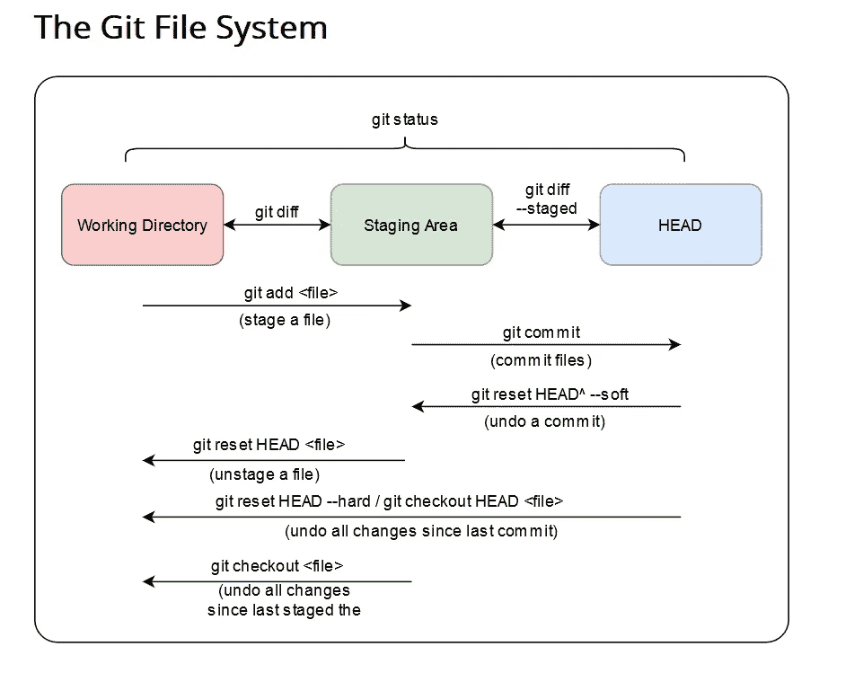
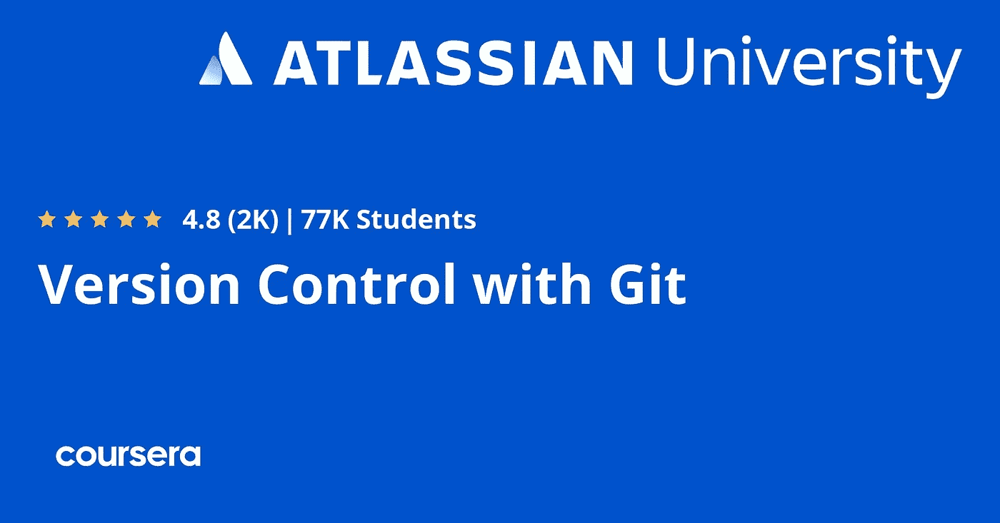
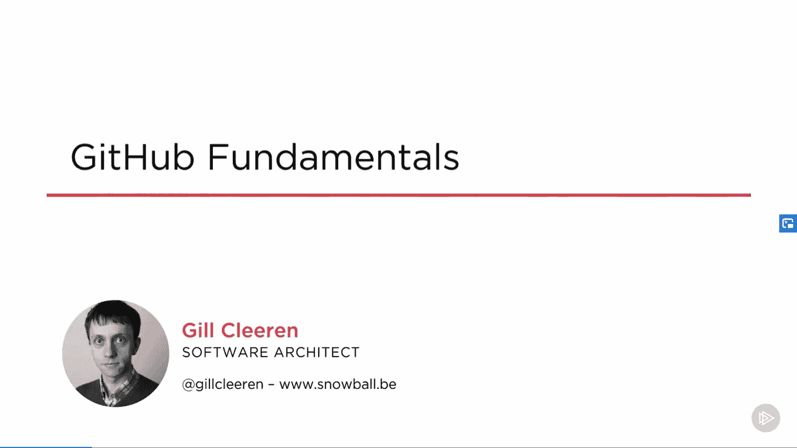
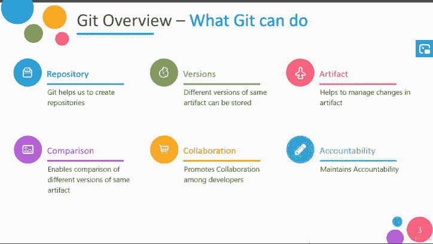
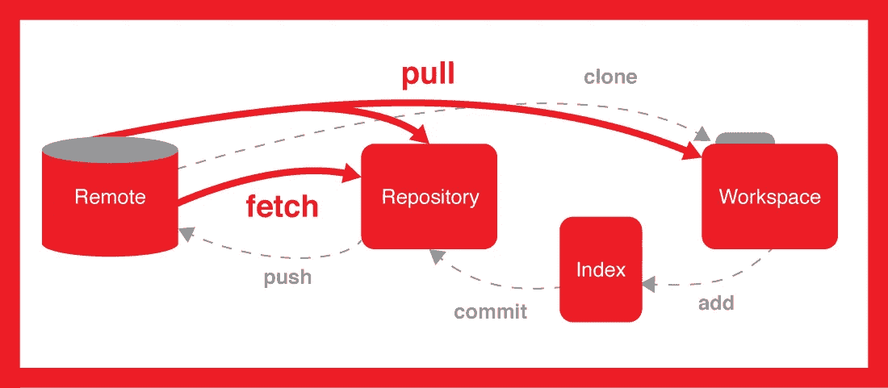
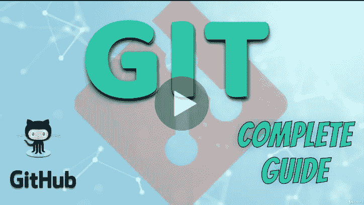
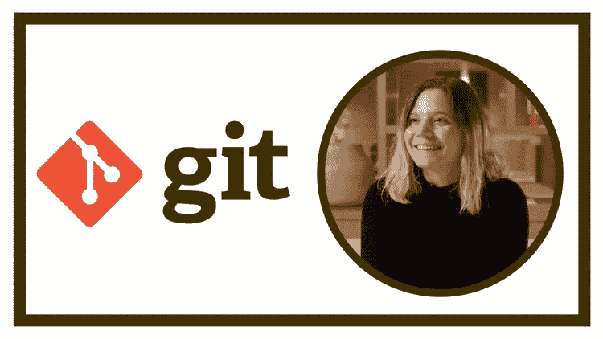

# 深入学习 Git 和 Github 的 10 个最佳在线课程

> 原文：<https://medium.com/javarevisited/7-best-courses-to-master-git-and-github-for-programmers-d671859a68b2?source=collection_archive---------0----------------------->

## 这些是从头开始学习 Git 的最佳课程，也是分支和合并等高级概念。它还包括一个学习 git 的免费课程

image _ credit—https://learngitbranching.js.org/

大家好，如果你想深入学习 Git & Github，并寻找最好的在线 Git 培训课程，那么你来对地方了。之前我已经分享了 [**我最喜欢的免费 Git 课程**](/@javinpaul/top-10-free-courses-to-learn-git-and-github-best-of-lot-967aa314ea?source=---------91------------------) 和 [**学习 Git 的最佳地点**](/javarevisited/11-best-online-places-to-learn-git-for-beginners-in-2021-6dc2b7c6ef48) ，今天我要分享的是深入学习 Git 和 Github 的最佳在线课程。

毫无疑问，无论是 [Git](https://javarevisited.blogspot.com/2018/01/5-free-git-courses-for-programmers-to-learn-online.html) 还是 [Github](https://javarevisited.blogspot.com/2019/05/10-free-websites-to-learn-git-online.html) 都已经成为软件开发者的标准源代码控制和代码仓库。曾经有一段时间，多个版本控制统治着世界，比如 CVS、SVN、VSS、Mercury 和 TFS，但是慢慢地，一切都向 Git 靠拢。

现在，几乎**70%到 80%的程序员使用 Git 进行版本控制**和 Github 库，包括公共的和私有的，来存储他们的源代码。当谈到使用像 SVN 或 CVS 这样的源代码控制工具时，大多数程序员使用 IDE 来使用它们，像来自 [IntelliJIDEA](https://javarevisited.blogspot.com/2018/09/top-5-courses-to-learn-intellij-idea-java-and-android-development.html) 或 [Eclipse](https://www.java67.com/2018/02/5-free-eclipse-and-junit-online-courses-java-developers.html) ，他们几乎不熟悉命令行。

对于像 SVN 和 CVS 这样的老源码控制软件来说尤其如此，但是 [Git & Github](/@javinpaul/top-10-free-courses-to-learn-git-and-github-best-of-lot-967aa314ea) 已经稍微改变了这种文化。

像 **Git bash** 这样的工具和一组 u **seful Git 命令**鼓励程序员在命令行和 ide 上使用 Git。这就是为什么对于一个软件开发人员来说，了解关键的 Git 命令如`git status`、`git add`、`git commit`、`git push`以及它们的标准选项变得至关重要。

[程序员](/swlh/10-things-every-programmer-should-know-26ba37cfcaf4)还应该了解源代码控制的基本概念，如为什么和如何，以及 Git 基础知识，如 l **本地与远程提交、**推送变更、拉取请求和**代码审查**。

这一切都很好，你会看到大多数程序员都熟悉基本的东西，但是一旦我们转向更高级的概念和它们的用法，比如**分支**和**合并**，他们就会感到吃力。由于在团队中开发软件时，分支和合并是必不可少的，开发人员需要对此有一个坚实的理解。

Git 的方法和对*“早期分支和经常分支”*的支持促进了分支文化，并鼓励[软件开发人员](https://dev.to/javinpaul/10-things-every-software-developer-should-know-39pe)遵循适当的程序来开发特性并坚持代码审查等。

我为什么要告诉你这一切？嗯，这些是我在为程序员选择一些最好的 Git 和 Github 课程时考虑的事情。那么，还等什么，让我们一起跳进**最佳在线课程列表，深入学习 Git 和 Github 吧！**

# 深入学习 Git 和 Github 的 10 个最佳在线课程

过去，我分享了一些学习 Git 的免费课程，虽然我的许多读者喜欢，但他们也问我是否可以分享一些既全面又最新的付费课程，那就太棒了。

这促使我写了这篇文章，包含了来自 [Udemy](https://click.linksynergy.com/fs-bin/click?id=JVFxdTr9V80&offerid=323058.9410&type=3&subid=0) 、 [Pluralsight](https://pluralsight.pxf.io/c/1193463/424552/7490?u=https%3A%2F%2Fwww.pluralsight.com%2Flearn) 和其他流行的[在线平台](https://javarevisited.blogspot.com/2019/05/10-free-websites-to-learn-git-online.html)的初学者和有经验的程序员的最佳 Git 课程。

这些在线培训课程不仅会教你**基本的 git 概念和命令**，还会帮助你征服分支和合并、提交和恢复，以及用 Git 做各种事情，包括疯狂的拉取请求和执行代码审查。

事不宜迟，这里有一些深入学习 Git 基础知识和 Github 的最佳课程

## 1.[Git Complete:Git 的权威分步指南](https://click.linksynergy.com/deeplink?id=JVFxdTr9V80&mid=39197&murl=https%3A%2F%2Fwww.udemy.com%2Fcourse%2Fgit-complete%2F)

这是一门学习 Git 源代码控制系统关键概念的极好课程。它提供了一步一步的指导整个 Git 工作流程。

你将学习如何在 Git 中比较不同的状态，在分支和提交之间进行比较，用 Git 管理文件(移动、重命名、删除)以及更新在 Git 之外维护的数据。

您还将学习**在 GitHub 上创建和派生存储库，并在本地工作后将更改推回**。该课程还有一个关于分支和合并的详细课程，你将学习如何像专业人员一样创建分支和解决合并冲突。

感谢导师[贾森·泰勒](https://click.linksynergy.com/deeplink?id=CuIbQrBnhiw&mid=39197&murl=https%3A%2F%2Fwww.udemy.com%2Fuser%2Fjasontaylor22%2F)打造了这门精品课程。谈到社会证明，这门课程平均有 4.4 分，来自近 33，000 名学生，这太令人惊讶了。

**这是加入本课程的链接**—[Git Complete:Git 的权威分步指南](https://click.linksynergy.com/deeplink?id=JVFxdTr9V80&mid=39197&murl=https%3A%2F%2Fwww.udemy.com%2Fcourse%2Fgit-complete%2F)

## 2.[Git 版本控制](https://coursera.pxf.io/c/3294490/1164545/14726?u=https%3A%2F%2Fwww.coursera.org%2Flearn%2Fversion-control-with-git)【Coursera 最佳课程】

如果你不知道，Coursera 有来自世界顶级大学以及像谷歌、AWS、IBM 等顶级公司的最好的技术课程，这是一个由 Atlassian 提供的学习 Git 的课程，Atlassian 是 Confluence 和 JIRA 的创始人。

Coursera 上的 Git 版本控制课程为你理解 Git 版本控制系统提供了坚实的实践基础。本课程假设您之前没有 Git 知识，但是如果您有 Git 经验，您会发现本课程既有用又有挑战性。

在这个[在线 Git 培训课程](https://coursera.pxf.io/c/3294490/1164545/14726?u=https%3A%2F%2Fwww.coursera.org%2Flearn%2Fversion-control-with-git)中，您将不会学到关于 Git 的所有知识，但是您将对该技术建立一个强有力的概念性理解，并且之后将能够自信地深入挖掘您感兴趣的任何主题。

这门课程有两条路径。两者都非常依赖动手实验室。一种方法假设您有使用命令行界面的经验，另一种方法使用 Sourcetree 图形客户端。

如果你没有使用[命令行](/javarevisited/7-best-linux-courses-for-developers-cloud-engineers-and-devops-in-2021-7415314087e1)的经验，我强烈推荐你使用 Sourcetree 路径。最终，您可能希望经历这两种途径，这样您就可以决定使用哪种工具来完成特定的任务。这门课程也为来自印度的学习者提供有限时间的免费证书。

**这里是加入这个 Git 课程的链接—** [用 Git](https://coursera.pxf.io/c/3294490/1164545/14726?u=https%3A%2F%2Fwww.coursera.org%2Flearn%2Fversion-control-with-git) 进行版本控制

除此之外，Google 在 Coursera 上的[**Git 入门和 GitHub 课程**](https://coursera.pxf.io/c/3294490/1164545/14726?u=https%3A%2F%2Fwww.coursera.org%2Flearn%2Fintroduction-git-github) 也是很棒的从零开始学习 Git 概念。这也是一门实践课程，是谷歌广受欢迎的 [**谷歌 IT 自动化与 Python 专业证书**](https://coursera.pxf.io/c/3294490/1164545/14726?u=https%3A%2F%2Fwww.coursera.org%2Fprofessional-certificates%2Fgoogle-it-automation) 的一部分，这意味着完成这门课程将计入该证书。

<https://coursera.pxf.io/c/3294490/1164545/14726?u=https%3A%2F%2Fwww.coursera.org%2Fprofessional-certificates%2Fgoogle-it-automation>  

顺便说一句，如果你喜欢在 Coursera 上学习，那么我建议你加入 Coursera Plus ，这是 Coursera 的一个订阅计划，让你无限制地访问他们最受欢迎的课程、专业、专业证书和指导项目，包括这个项目。

<https://coursera.pxf.io/c/3294490/1164545/14726?u=https%3A%2F%2Fwww.coursera.org%2Fcourseraplus>  

## 3.[吃了苦头才学会](https://www.educative.io/courses/learn-git-hard-way?affiliate_id=5073518643380224)【教育性最好的课程】

这是 Educative 为程序员、程序员和初学者提供的另一个学习 Git 的极好的课程，Educative 是一个面向 it 专业人员的基于文本的交互式在线学习平台。

提高生产力的最好方法之一就是学习 Git。现在就学，而且要学好。这将是你在职业发展过程中学习的一个重要工具。

您将从学习一些更基本的概念开始，比如初始化 Git 存储库、向存储库添加文件以及如何提交更改。

之后，您将探索如何克隆一个存储库，以及如何创建分支。然后，您将学习一些更高级的概念，如 Git stash、精选、使用多个存储库、推送代码等等。

这门课程最棒的一点是，你将完成四个评估，从核心基础开始，一直到高级 Git，以真正测试你的 Git 技能，这是学习 Git 的真正困难的方法。

完成本课程和评估后，您将掌握熟练的 Git 应用知识，这将在您的整个职业生涯中对您大有裨益。

**以下是加入本课程的链接—** [艰难地学习 Git](https://www.educative.io/courses/learn-git-hard-way?affiliate_id=5073518643380224)

此外，如果你找到了教育平台和他们基于文本的互动课程，那么考虑购买 [**教育订阅**](https://www.educative.io/subscription?affiliate_id=5073518643380224) ，每月只需 14.9 美元就可以访问他们的 210 多门课程。非常划算，非常适合准备编码面试。

<https://www.educative.io/subscription?affiliate_id=5073518643380224>  

## 4. [GitHub 基础知识](https://pluralsight.pxf.io/c/1193463/424552/7490?u=https%3A%2F%2Fwww.pluralsight.com%2Fcourses%2Fgithub-fundamentals)【plural sight 最佳课程】

这是一门学习 Git 和 Github 的 Pluralsight 课程。在本课程中，您将学习如何创建本地存储库、提交文件、将更改推送到远程存储库、修复提交中的错误，以及 Git 的许多其他特性。

您还将理解工作副本、暂存区和存储库本身之间的区别，从初学者的角度来看这是非常好的。 [Pluralsight](http://pluralsight.pxf.io/c/1193463/424552/7490?u=https%3A%2F%2Fwww.pluralsight.com%2Flearn) 也有一些高级课程，可以处理功能分支，合并变更而不产生冲突，完成这个初级课程后，你也可以去看看。

**这里是加入本课程** — [GitHub 基础](https://pluralsight.pxf.io/c/1193463/424552/7490?u=https%3A%2F%2Fwww.pluralsight.com%2Fcourses%2Fgithub-fundamentals)的链接

不过，你需要有一个 [Pluralsight 会员资格](http://pluralsight.pxf.io/c/1193463/424552/7490?u=https%3A%2F%2Fwww.pluralsight.com%2Flearn)才能进入这个课程，费用大约是每月 29 美元或每年 299 美元。乍一看，这似乎有点贵，但很值得，因为你可以在 Pluralsight 上获得超过 5000 门关于最新技术的在线课程。

在过去的 3 年里，我一直是 Pluralsight 的成员，我学到了很多东西。如果你能在学习上花些钱，那么我强烈建议你加入 Pluralsight，但即使你不能加入，你仍然可以通过利用他们的 [**10 天免费试用**](http://pluralsight.pxf.io/c/1193463/424552/7490?u=https%3A%2F%2Fwww.pluralsight.com%2Flearn) **，**免费获得这门课程，该课程提供 200 分钟的所有课程。

<http://pluralsight.pxf.io/c/1193463/424552/7490?u=https%3A%2F%2Fwww.pluralsight.com%2Flearn>  

## 5.Git & GitHub 完全大师班:从初学者到 Git 专家

这是在线学习 Git 和 Github 的另一个令人印象深刻的、可能是最全面的课程。本课程将向你介绍几乎所有你在使用 [Git](/javarevisited/top-10-free-courses-to-learn-git-and-github-best-of-lot-967aa314ea) 时需要了解的方面。它有正确的节奏和足够的简短练习来帮助你理解每个概念。谈到社会证明，这门课程在近 8000 名学生中平均获得 4.3 分，这令人印象深刻。

简而言之，从基础水平到高级水平学习 git 的完美课程。非常感谢比巴什·罗伊教练创建了这个优秀的课程。

**这里是加入本课程的链接** — [Git & GitHub 完全大师班:从初学者到 Git 专家](https://click.linksynergy.com/deeplink?id=JVFxdTr9V80&mid=39197&murl=https%3A%2F%2Fwww.udemy.com%2Fgit-basic-concept-fundamentals-github%2F)

## 6.[Git:4 小时成为 Git & GitHub 专家](https://click.linksynergy.com/deeplink?id=JVFxdTr9V80&mid=39197&murl=https%3A%2F%2Fwww.udemy.com%2Fgit-expert-4-hours%2F)【免费课程】

这是快速学习 Git 和 Github 的免费课程之一。如果你刚加入一家新公司，或者刚开始做一个将要用到 Git 的项目，那么你可以利用这个课程提前学习 Git。

虽然课程只包含 4.5 个小时的内容，但已经足够全面，涵盖了所有关键的 Git 概念。您将了解 Git 理论和工作流、Git 存储库、基本 Git 命令、高级 Git 命令，以及如何一起使用 [Git](https://git-scm.com/) 和 [Github](https://github.com/) 。谈到社会证明，这门课程得到了近 1.6 万名学生的平均 4.3 分的评价，非常优秀。非常感谢 Jad Khalili 老师创建了这个一流的课程。

**以下是加入本课程的链接**—[Git:4 小时内成为 Git & GitHub 专家](https://click.linksynergy.com/deeplink?id=JVFxdTr9V80&mid=39197&murl=https%3A%2F%2Fwww.udemy.com%2Fgit-expert-4-hours%2F)

## 7. [GitHub 终极版:Git 大师和 GitHub——初学者到专家](https://click.linksynergy.com/deeplink?id=JVFxdTr9V80&mid=39197&murl=https%3A%2F%2Fwww.udemy.com%2Fgithub-ultimate%2F)

通过循序渐进、无假设的学习，从 Git 和 GitHub 的完全新手变成专家。这是 Udemy 的另一个优秀的关于 Git 的综合课程。该课程从解释 Git 的核心概念开始，然后指导您下载并在您的机器上安装 Git。之后，它继续介绍基本的 git 任务，比如将文件添加到 Git 中，检查状态，提交更改，并将这些更改推送到远程服务器。一路上包含了很多 [Git 命令](https://dev.to/javinpaul/5-free-courses-to-learn-git-and-github-in-depth-jpp)为`git add`、`git status`、`git log`、`git commit`、`git pull`、`git push`。

本课程还涵盖了更高级的主题，如比较差异、使用 git reset 回滚更改以及 git revert 命令。它还解释了分支和合并解析，标记特殊事件，保存正在进行的工作，甚至一点时间旅行。

**以下是加入本课程的链接** — [GitHub 终极版:Git 大师和 GitHub —初学者到专家](https://click.linksynergy.com/deeplink?id=JVFxdTr9V80&mid=39197&murl=https%3A%2F%2Fwww.udemy.com%2Fgithub-ultimate%2F)

总的来说，这是一门极好的课程，可以深入探讨 Git。近 16000 名学生平均给它打了 4.4 分。平均而言，来自近 15000 名学生的 4.3 分的评分，简直令人难以置信。

## 8.[完整的 Git 指南:了解并掌握 Git 和 GitHub](https://click.linksynergy.com/deeplink?id=JVFxdTr9V80&mid=39197&murl=https%3A%2F%2Fwww.udemy.com%2Fcourse%2Fgit-and-github-complete-guide%2F)

顾名思义，这是学习和掌握编程和开发 Git 的高级课程之一。你将学习提交、分支、合并、重定基础、挤压和其他你作为软件开发人员需要的东西。

这是 Udemy 上的**完整的实用 Git 和 GitHub 指南**之一，包括大量的实践活动。最重要的是，你将学习 g it 是如何工作的，知道了这一点，你将能够更容易地使用 Git 特性，并在你的开发工作流程中修复错误。

**在练习部分，您将进行多次 Git 练习:**

1.  初始化新的 Git 储存库
2.  进行更改，将它们添加到临时区域并提交
3.  创建分支、签出分支和合并分支
4.  执行分支的快进和三向合并
5.  解决合并冲突
6.  进入分离头状态，并在那里进行实验性提交
7.  执行分支的重置

总的来说，这是软件开发人员掌握 Git 和 Github 的完美实践课程。你可以通过这个课程学习最流行的 git 工作流，开始使用它们，成为更好的开发者！

**以下是加入本课程的链接** — <https://click.linksynergy.com/deeplink?id=JVFxdTr9V80&mid=39197&murl=https%3A%2F%2Fwww.udemy.com%2Fcourse%2Fgit-and-github-complete-guide%2F>[完整 Git 指南:了解并掌握 Git 和 GitHub](https://click.linksynergy.com/deeplink?id=JVFxdTr9V80&mid=39197&murl=https%3A%2F%2Fwww.udemy.com%2Fcourse%2Fgit-and-github-complete-guide%2F)

## 9. [Git 基础:使用 Bitbucket 和 Sourcetree 学习 Git](https://click.linksynergy.com/deeplink?id=JVFxdTr9V80&mid=39197&murl=https%3A%2F%2Fwww.udemy.com%2Fcourse%2Fgit-with-bitbucket-and-sourcetree%2F)[Udemy]

这是在 Udemy 上学习 Git 命令和概念的又一个很棒的课程。本课程将帮助您快速掌握如何使用 Git 进行日常软件开发。

在本课程中，您将学到以下内容:

*   什么是版本控制和 Git？
*   什么是 Git 存储库和通用 Git 词汇表？
*   如何将 git 与 Sourcetree 和 Bitbucket 结合使用
*   用于 Github 项目的基本 Git 命令和概念

对于任何想学习 Git 和版本控制的人来说，这是一门很好的课程。它不像列表中的前两门课程那么全面，但是如果你需要使用 BitBucker 和 Sourcetree，你可以使用它。

**这里是加入本课程的链接** — [Git 基础知识:使用 Bitbucket 和 Sourcetree 学习 Git](https://click.linksynergy.com/deeplink?id=JVFxdTr9V80&mid=39197&murl=https%3A%2F%2Fwww.udemy.com%2Fcourse%2Fgit-with-bitbucket-and-sourcetree%2F)

## 10. [Git 学习之旅——Git(版本控制)学习指南](https://click.linksynergy.com/deeplink?id=JVFxdTr9V80&mid=39197&murl=https%3A%2F%2Fwww.udemy.com%2Fcourse%2Fgit-learning-journey%2F)

这是一个非常好的 Git 初学者培训课程。它从最基本的到分支、合并、与他人合作以及与远程存储库合作。甚至还包括了一些关于重置基础的课程。

本课程的重点是帮助你对 Git 如何工作有一个很好的心理模型，并使事情变得简单。

Anna Skoulikari 做了令人难以置信的工作，这可能是为什么该课程在 Udemy 上的平均评分为 4.6，并被授予最高评级的课程标签。

看看这些令人惊叹的评论，了解一下其他学生的想法吧！

**这里是加入本课程的链接**——[Git 学习之旅——学习 Git(版本控制)指南](https://click.linksynergy.com/deeplink?id=JVFxdTr9V80&mid=39197&murl=https%3A%2F%2Fwww.udemy.com%2Fcourse%2Fgit-learning-journey%2F)

以上是关于学习 Git 和 Github online 的一些**最佳课程。毫无疑问，Git 是版本控制和存储代码的行业标准，对于每个程序员来说，扎实的 Git 特性知识是必不可少的，比如分支和合并。**

如果你觉得你的 Git 技能有所欠缺，那么你可以加入这个课程列表来更新你的知识。档案里有免费和付费实习，你可以根据自己的喜好选择。

其他**面向程序员的免费在线课程和文章**

*   [完整的 Java 开发者路线图](https://javarevisited.blogspot.com/2019/10/the-java-developer-roadmap.html)
*   [学习 Linux 命令的 5 门免费课程](https://hackernoon.com/top-5-free-linux-courses-for-programmers-4a433b4edade)
*   [练习 Git 命令的 10 个免费网站](https://javarevisited.blogspot.com/2019/05/10-free-websites-to-learn-git-online.html)
*   [10 门免费学习数据结构和算法的课程](http://www.java67.com/2019/02/top-10-free-algorithms-and-data.html)
*   [Java 开发人员学习 Maven 和 Jenkins 的 5 门课程](http://www.java67.com/2018/02/6-free-maven-and-jenkins-online-courses-for-java-developers.html)
*   [程序员 10 门高级核心 Java 课程](https://javarevisited.blogspot.com/2020/04/top-10-advanced-core-java-courses-for-experienced-developers.html)
*   [学习 Learn RESTful Web 服务的 3 本书和课程](http://www.java67.com/2018/02/3-books-and-courses-to-learn-restful-web-services-with-spring.html)
*   [深入学习 Docker 的 10 门免费课程](https://javarevisited.blogspot.com/2018/02/10-free-docker-container-courses-for-Java-Developers.html)
*   [程序员学习 Bash 脚本的 5 门免费课程](http://www.java67.com/2019/04/top-5-free-course-to-learn-bash-shell-scripting-linux.html)
*   [面向 Java 开发人员的 10 门高级 Spring 课程](/javarevisited/10-advanced-spring-boot-courses-for-experienced-java-developers-5e57606816bd)
*   [学习 Oracle 和微软 SQL Server 数据库的 5 门课程](http://www.java67.com/2018/02/5-free-oracle-and-microsoft-sql-server-online-courses.html)
*   [免费学习区块链技术的 7 门课程](/javarevisited/7-free-courses-to-learn-blockchain-in-2020-764e66b47ebe)

感谢您阅读本文。如果你喜欢这些适合初学者和有经验的程序员的最佳 git 在线课程，那么请与你的朋友和同事分享。如果您有任何问题或反馈，请留言。

**P. S. —** 如果你正在寻找一些*免费课程来学习 Git 和 Github* ，那么你也可以在 Udemy 上查看 [**终极 GIT 5 天挑战**](http://bit.ly/2CtQTCW) 课程。它是完全免费的，而且只需几天就能学会 Git。

<http://bit.ly/2CtQTCW> 