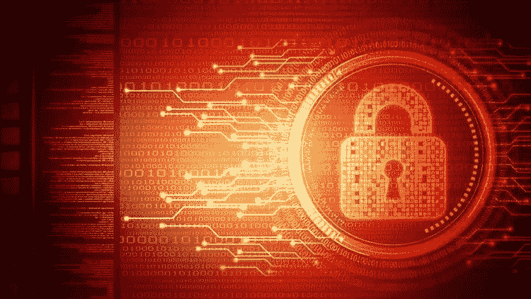
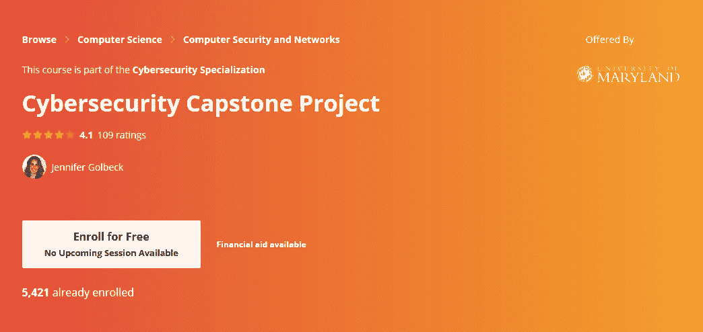
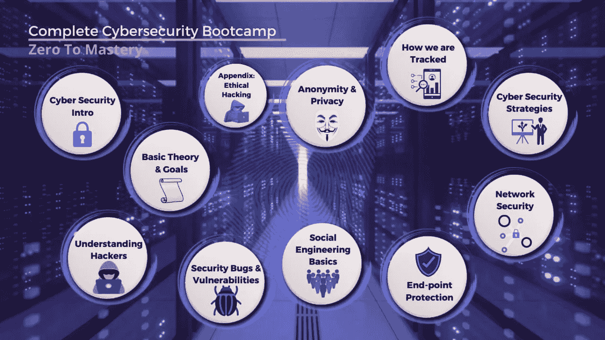
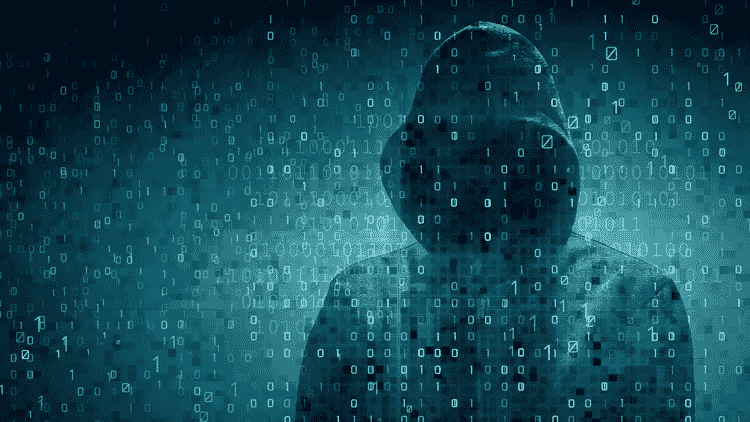
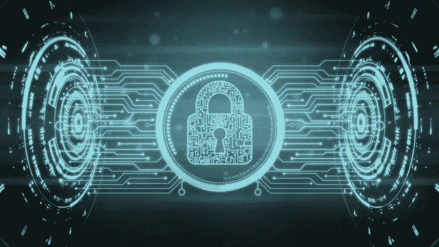
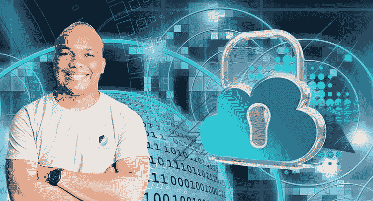
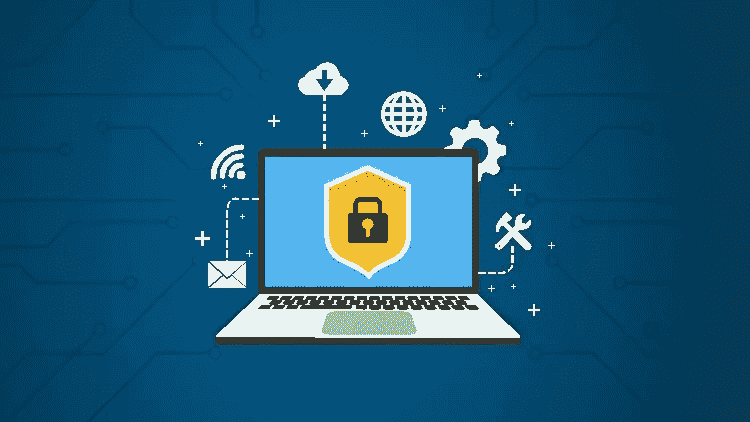
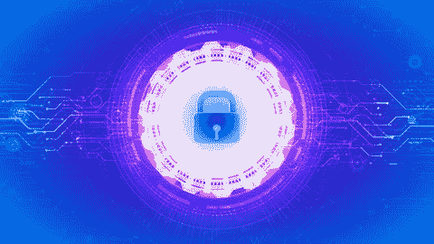
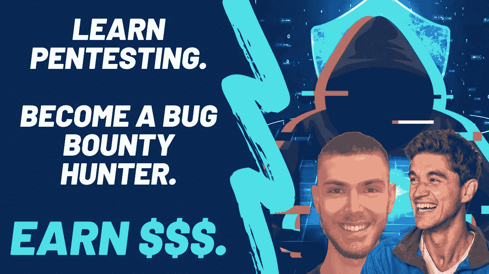

# 2023 年要学习的 10 个最佳网络安全认证和课程

> 原文：<https://medium.com/javarevisited/7-best-cyber-security-courses-for-programmers-and-developers-50afafae050b?source=collection_archive---------0----------------------->

## 这些是对 IT 专业人员和 Udemy、CodeCademy 和 Coursera 等网站的程序员来说最好的网络安全课程。

大家好，如果你想学习网络安全和信息安全，并寻找最好的网络安全课程，那么你来对地方了。之前我已经分享了 [**最佳 Linux 课程** s](/javarevisited/top-10-courses-to-learn-linux-command-line-in-2020-best-and-free-f3ee4a78d0c0?source=collection_home---4------0-----------------------) ，和 [**最佳渗透测试课程**](/javarevisited/10-free-courses-to-learn-ethical-hacking-and-penetration-testing-for-beginners-84e40104aa6c) ，今天我就来说说 2023 年你可以加入的 Udemy 和 Coursera 的最佳网络安全课程和认证。

毫无疑问，**网络安全**和**信息安全**对于当今环境中的企业非常重要，在这种环境中，公司面临着来自恶意软件、其他类型的软件病毒和在线威胁的高风险。

这也是程序员最容易忽视的领域之一，尤其是来自印度和东南亚的程序员，那里的大多数计算机工程师都想从事应用程序开发工作。

对网络安全专家有巨大的需求，许多计算机工程师和计算机科学毕业生可以在这一领域有很好的职业生涯。

如果你已经喜欢这个领域，并希望得到一份网络安全工作，那么你来对地方了。在这篇文章中，我将分享一些从网站上学习网络安全的最佳课程，如 [Udemy](https://javarevisited.blogspot.com/2019/08/top-10-udemy-courses-and-certifications-for-programmers.html) 、 [Pluralsight](https://javarevisited.blogspot.com/2017/12/top-10-pluralsight-courses-java-and-web-developers.html) 、 [Coursera](https://javarevisited.blogspot.com/2020/01/coursera-vs-udemy-which-is-better-for-programming-tech.html) 等。在线培训课程可能是最实惠、最好的培养需求技能的方式。20 年前，学习先进的安全概念和技术并不容易，但是今天你可以获得网络安全专家创造的许多资源。你可以在舒适的办公室或家里参加这些在线课程，按照自己的时间表学习网络安全概念，唯一需要的是付出真诚努力的意愿和承诺。当我看到一个计算机工程师，尤其是来自印度的工程师，在完成了 2 或 4 年的学位后没有工作，仅仅因为他没有市场需要的技术技能，我感到很难过。

部分责任在于教育系统，但我更愿意做的不仅仅是抱怨，而是鼓励人们在线学习急需的技能，以进一步增加你的机会和发展你的个人资料。

线上和线下都有很多机会，特别是在 IT 部门和电子商务领域，你需要做的就是努力抓住它们，网络安全就是其中之一。网络安全专家并不多，这就是为什么从[工作](https://javarevisited.blogspot.com/2018/02/top-10-highest-paying-technical-jobs-programmers-software-developers.html)和[职业](https://dev.to/javinpaul/top-5-coursera-professional-certificates-to-start-advance-your-career-in-technology-185p)的角度来看，这一领域的良好知识非常有用。

# 软件工程师十大网络安全课程

不浪费您更多的时间，让我们深入一些最好的课程，学习网络安全基础知识以及先进的技术，以防止在线威胁，如跟踪、隐私、恶意软件和其他类型的安全漏洞。

## 1.[完整的网络安全课程](https://click.linksynergy.com/deeplink?id=JVFxdTr9V80&mid=39197&murl=https%3A%2F%2Fwww.udemy.com%2Fcourse%2Fthe-complete-internet-security-privacy-course-volume-1%2F)

这是 Udemy 上学习网络安全最全面的课程之一。讲师内森·豪斯(Nathan house)是一名网络安全专家，也是网络安全公司 StationX 的首席执行官。

Nathan 在互联网安全领域拥有超过 25 年的经验，参与过价值数百万甚至数十亿美元的大大小小的项目。

这意味着你将从一位身经百战、拥有应对网络威胁实际经验的人那里学习网络安全的细节。

这是一门结构非常合理的课程，涵盖了关于网络安全和在线威胁的基础和高级主题。您将了解加密、数据如何在互联网上从一台主机传输到另一台主机，以及数据如何被窃取和更改。

这是你的网络安全隐私和匿名课程完整指南的第 1 卷，共 4 卷，是任何想成为安全、隐私和匿名专家的人的理想选择。本卷涵盖了该技能集所需的基础构建模块。

**这里是加入这个最佳网络安全课程** — [完整的网络安全课程](https://click.linksynergy.com/deeplink?id=JVFxdTr9V80&mid=39197&murl=https%3A%2F%2Fwww.udemy.com%2Fcourse%2Fthe-complete-internet-security-privacy-course-volume-1%2F)的链接

如果你真的想成为一名网络安全专家，那么我强烈建议你加入本课程的所有模块。内森是网络安全方面的大师，我很欣赏他总是开诚布公、毕恭毕敬地回答学生的每一个问题。

谈到社会证明，这门课程受到超过 14 万名学生的信任，平均得到 4.5 分，从接近 2.5 分不等，这是非常显著的，充分说明了这门课程的质量。

## 2.[网络安全专业课程](https://coursera.pxf.io/c/3294490/1164545/14726?u=https%3A%2F%2Fwww.coursera.org%2Fspecializations%2Fcyber-security)

你可能不知道，但是 Coursera 有一个很好的学习网络安全的课程，它是由马里兰大学提供的，网络安全专业。

[*网络安全专业*](https://coursera.pxf.io/c/3294490/1164545/14726?u=https%3A%2F%2Fwww.coursera.org%2Fspecializations%2Fcyber-security) 涵盖了构建安全系统的基本概念，从硬件到软件到人机界面，使用加密技术来保护交互。

该专业包含以下课程—

1.  可用安全性
2.  软件安全性
3.  密码系统
4.  硬件安全性
5.  网络安全顶点项目

这些概念用来自现代实践的例子来解释，并用涉及相关工具和技术的实践练习来补充。成功的参与者将形成一种以安全为导向的思维方式，更好地理解如何思考对手，以及如何构建防御对手的系统。

**这里是加入这个网络安全认证** — [网络安全专业课程](https://coursera.pxf.io/c/3294490/1164545/14726?u=https%3A%2F%2Fwww.coursera.org%2Fspecializations%2Fcyber-security)的链接

一旦你完成了与本专业相关的所有课程和项目，你还将获得一份结业证书，可以在你的 LinkedIn 个人资料和简历中展示

顺便说一下，如果你计划参加多个 Coursera 课程或专业，那么考虑参加 [**Coursera Plus 订阅**](https://coursera.pxf.io/c/3294490/1164545/14726?u=https%3A%2F%2Fwww.coursera.org%2Fcourseraplus) ，它将为你提供无限制的访问他们最受欢迎的课程、专业、专业证书和指导项目的机会。它每年花费大约 399 美元，但它完全物有所值，因为你可以获得**无限证书。**

<https://coursera.pxf.io/c/3294490/1164545/14726?u=https%3A%2F%2Fwww.coursera.org%2Fcourseraplus>  

## 3.[完整的网络安全训练营:零到精通](https://academy.zerotomastery.io/a/aff_swq47xdd/external?affcode=441520_zytgk2dn)

这是另一个最新的在线培训课程，学习 2023 年的网络安全工程师，并获得渗透测试员、网络安全工程师等职位的聘用。

这个长达 11 小时的网络安全训练营课程是由 Aleksa Tamburkovski 创建的，可在 ZTM 学院(botocamp 风格的在线学习门户之一)上找到，在那里您不仅可以找到本课程，还可以找到 Andrey Negaoie 等受欢迎的讲师提供的 50 多门课程。

在本课程中，您将学习最现代的工具和技术来保护您的网络，从而保护您的数字资源和基础设施。

你也将从零开始学习网络安全概念和生态系统。您还将学习如何开发世界一流的尖端终端保护和网络安全系统。

在此过程中，您将学习网络安全工程师在工作中取得成功以及保护数字资源和网络基础设施所需的所有技能。最终，在这个网络攻击的时代，您将拥有保护您的系统所需的一切。

**以下是参加本课程的链接**——[完整网络安全训练营:零到精通](https://academy.zerotomastery.io/a/aff_swq47xdd/external?affcode=441520_zytgk2dn)

顺便说一句，你需要一个 [***ZTM 会员***](https://academy.zerotomastery.io/a/aff_c0gnlvf7/external?affcode=441520_zytgk2dn) 来观看这个课程，这个课程每月花费大约 39 美元，但也提供了许多像这样超级吸引人和有用的课程。您还可以使用优惠券代码 FRIENDS10 获得本课程或您选择的任何订阅的 10%折扣。

<https://academy.zerotomastery.io/a/aff_c0gnlvf7/external?affcode=441520_zytgk2dn>  

## 4.[完整的网络安全课程:网络安全！](https://click.linksynergy.com/deeplink?id=JVFxdTr9V80&mid=39197&murl=https%3A%2F%2Fwww.udemy.com%2Fcourse%2Fnetwork-security-course%2F)

这是由内森·豪斯在 Udemy 上开设的网络安全课程的第二部分。在这一部分中，他介绍了网络安全、WiFi 安全、防火墙、Wireshark、安全网络、密码管理器和其他网络安全相关的概念。

本课程专为个人和家庭网络安全、隐私和匿名而设计。大多数主题同样适用于企业，但该课程就像是针对个人的个人网络安全、隐私和匿名而讲授的。
正如我之前说过的，内森是他所在领域的专家，也是 Udemy 上最好的导师之一。如果你真的想学习网络安全，那么你应该参加这个课程。

**这里是加入本网络安全课程** — [完整的网络安全课程:网络安全！](https://click.linksynergy.com/deeplink?id=JVFxdTr9V80&mid=39197&murl=https%3A%2F%2Fwww.udemy.com%2Fcourse%2Fnetwork-security-course%2F)

我还建议所有的 IT 专业人士和技术人员参加这个课程，以增强你对网络安全的了解，以及它如何影响你的日常网络生活。

## 5.[完整的网络安全课程:端点防护！](https://click.linksynergy.com/deeplink?id=JVFxdTr9V80&mid=39197&murl=https%3A%2F%2Fwww.udemy.com%2Fcourse%2Fthe-complete-cyber-security-course-end-point-protection%2F)

这实际上是 Nathan House 的完整网络安全课程的第 3 个模块。我跳过了关于匿名浏览的第三册，如果你感兴趣的话，你可以选修，这是一门很棒的课程。

在本课程中，一些成为网络安全专家所需的关键概念和技能，如如何应对反病毒&恶意软件、磁盘加密、查找并删除恶意软件、特洛伊木马和其他种类的软件病毒。谈到社会证明，已经有超过 50，000 名学生注册了这门课程，它在 3K 参与者中的平均评分为 4.5 分，这很令人惊讶。

如果你喜欢内森·豪斯的教学风格，我相信你会喜欢的，那么我强烈建议你完成本网络安全课程的所有 4 个**模块，学习热门技能，成为网络安全专家。**

**这是本在线课程的链接** — [完整的网络安全课程:端点防护！](https://click.linksynergy.com/deeplink?id=JVFxdTr9V80&mid=39197&murl=https%3A%2F%2Fwww.udemy.com%2Fcourse%2Fthe-complete-cyber-security-course-end-point-protection%2F)

## 6.[网络安全介绍](https://www.gopjn.com/t/TUJGR0lLR0JHRklJSkhCR0ZISk1N?url=https%3A%2F%2Fwww.codecademy.com%2Flearn%2Fintroduction-to-cybersecurity)【Codecademy】

如果你是 CodeCademy 的粉丝，那么你会很高兴地知道他们最近推出了一个新的免费网络安全互动课程，在这个课程中，你可以以有趣的方式学习基本的网络安全概念。

在这个免费的网络安全课程中，您将学习识别和保护自己免受常见网络威胁和攻击所需的基本概念。您还将学习网络安全的基础知识，以及如何检测常见的网络威胁，如恶意软件和网络钓鱼。

您还将了解原则和政策、常用的身份验证/授权技术以及网络安全基础知识。您还将创建一个作品集项目来展示您的技能。

该课程还有一套有趣的测验，用来测试你在网络安全和网络基础知识方面的知识。

**这里是加入免费网络安全课程**——[网络安全介绍](https://www.gopjn.com/t/TUJGR0lLR0JHRklJSkhCR0ZISk1N?url=https%3A%2F%2Fwww.codecademy.com%2Flearn%2Fintroduction-to-cybersecurity)的链接

顺便说一句，如果你喜欢在 CodeCademy 平台上学习，那么考虑加入他们的 [**CodeCademy Pro 会员资格**](https://bit.ly/codecademypro) ，该会员资格的年费约为每月 15.99 美元，提供所有 Codecademy 内容、课程、测验和项目的访问权限。你可以用这个来赚取、练习&
应用工作技能。

<https://bit.ly/codecademypro>  

## 7.[网络安全绝对初学者指南 2023—第 1 部分](https://click.linksynergy.com/deeplink?id=JVFxdTr9V80&mid=39197&murl=https%3A%2F%2Fwww.udemy.com%2Fcourse%2Fthe-absolute-beginners-guide-to-information-cyber-security%2F)

如果由于某种原因，你不能连接内森的房子，那么你可以看看亚历克斯的这个课程。

我真的很喜欢他的教学风格，他从基础层面提供信息，让你了解什么是防火墙，它是如何工作的，什么是恶意软件，它是如何工作的，网络安全人员做什么，以及他们如何真正防止在线攻击威胁。

是的，这是一门关于网络安全和信息安全的入门课程，这也是为什么它对想要成为网络安全专家或信息安全工程师的人非常有用。

这涵盖了网络安全概念，如跟踪、恶意软件、防火墙、蠕虫、网络钓鱼、加密、生物识别、自带设备等。Alex 是一名网络安全专家和 web 开发人员，因此他从不同的角度看待安全世界，这在他的课程中有所体现。

**以下是在 Udemy**——[2023 年网络安全绝对初学者指南](https://click.linksynergy.com/deeplink?id=JVFxdTr9V80&mid=39197&murl=https%3A%2F%2Fwww.udemy.com%2Fcourse%2Fthe-absolute-beginners-guide-to-information-cyber-security%2F)上加入本课程的链接

谈到社会证明，超过 17，000 名学生从这门课程中受益，近 6，000 名参与者对这门课程的平均评分为 4.5，这证明了这门课程的质量和他的教学风格。

我也向每一位[的 web 开发人员](https://javarevisited.blogspot.com/2019/02/the-2019-web-developer-roadmap.html)推荐这门课程，他们只是想成为一名更好的开发人员，因为了解安全概念对设计安全的 web 应用程序很有帮助。

## 8.[网络安全绝对初学者指南 2023—第二部分](https://click.linksynergy.com/deeplink?id=JVFxdTr9V80&mid=39197&murl=https%3A%2F%2Fwww.udemy.com%2Fcourse%2Fthe-complete-2018-cyber-security-guide-for-non-professionals%2F)

这是亚历克斯·奥尼之前课程的第二部分。在第一部分中，您将学习网络安全基础知识，在这一部分中，您将探索网络、恶意软件、加密、VPN、隐私、电子邮件安全、社会工程、备份等更多内容

本课程旨在为您提供知识和工具，不仅可以更好地保护您自己免受恶意软件和其他网络安全威胁，还可以为您在网络安全领域的职业生涯做准备(如果您愿意的话)。

您将学习当今网络安全领域使用的所有最新技术，并了解许多安全技术是如何在幕后工作的。对于任何想成为网络安全或信息安全专家的人，我强烈推荐本课程的两个模块。

**这里是加入本网络安全课程**——[网络安全绝对初学者指南](https://click.linksynergy.com/deeplink?id=JVFxdTr9V80&mid=39197&murl=https%3A%2F%2Fwww.udemy.com%2Fcourse%2Fthe-complete-2018-cyber-security-guide-for-non-professionals%2F)的链接

## 9.[网络安全——从零到英雄(2023)](https://click.linksynergy.com/deeplink?id=JVFxdTr9V80&mid=39197&murl=https%3A%2F%2Fwww.udemy.com%2Fcourse%2Fcyber-security-specialization-part-1%2F)

这是另一个来自 Udemy 的很棒的网络安全课程。由 Chinmay Kulkarni 和 Yash Kulkarni 创建的这个在线课程将教你程序员或开发人员应该知道的关于网络安全的一切。

您将学习与网络安全相关的整个网络，以及威胁、漏洞、事件、管理、攻击、利用、事件等术语

您还将学习和理解网络安全中的不同角色，如 CISO、CISM、CISA、渗透测试人员、事件响应团队等。

本课程非常适合网络安全爱好者和正在寻找网络安全完美开端的人，以及想知道什么是网络安全的初学者。

一旦你开始学习本课程，你就会对什么是网络安全有一个清晰的认识。本课程的结构是这样的，你会喜欢并在学习过程中不断学习。

**以下是参加本课程的链接**——[网络安全——从零到英雄(2023)](https://click.linksynergy.com/deeplink?id=JVFxdTr9V80&mid=39197&murl=https%3A%2F%2Fwww.udemy.com%2Fcourse%2Fcyber-security-specialization-part-1%2F)

## 10.[网络安全& Bug 赏金:2023 年学习渗透测试](https://academy.zerotomastery.io/p/learn-penetration-testing?affcode=441520_zytgk2dn)

这是 2023 年又一个学习网络安全、渗透测试和 Bug Bounty 的很棒的在线课程。你可以加入这个课程开始你的职业生涯，或者通过成为一个虫子赏金猎人来获得额外的收入。

不需要经验。您将从头开始学习渗透测试，并掌握 2023 年最现代的笔测试工具和最佳实践！。您还将学习如何修复漏洞、提高 web 安全性等等。

这个 10.5 小时以上的点播全高清课程将教你如何建立你的黑客实验室:Kali Linux 和虚拟机(与 Windows/Mac/Linux 一起工作)，并使用最佳实践来保护你未来的任何应用程序。

本课程还向您介绍常见的安全威胁以及如何预防这些威胁，如命令注入/执行、暴力攻击、安全错误配置、SQL 注入、日志记录和监控最佳实践、网络基础知识、HTML 注入等等。

**这里是加入本课程的链接** — [网络安全& Bug 赏金:2023 年学习渗透测试](https://academy.zerotomastery.io/p/learn-penetration-testing?affcode=441520_zytgk2dn)

它还附带 10+额外的文章和资源，并让您访问一个实时的，独家的 ZTM 社区。完成本课程后，您还将获得结业证书。

顺便说一句，你需要一个 [ZTM 会员](https://academy.zerotomastery.io/a/aff_c0gnlvf7/external?affcode=441520_zytgk2dn)才能观看这个课程，这个课程每月花费大约 39 美元，但也提供了许多超级吸引人和有用的课程和职业道路。您还可以使用我的代码 **FRIENDS10** 获得您选择的任何套餐的 10%折扣。

<https://academy.zerotomastery.io/p/learn-penetration-testing?affcode=441520_zytgk2dn>  

以上是 2023 年学习网络安全的一些**最佳课程。正如我所说，公司，无论是大公司还是小公司，都非常关注互联网安全，也花费了大量的预算。**

这可能是成为网络安全专家的最佳时机，如果你想学习网络安全并获得一份安全专家的工作，这些课程可以帮助你很多。

总的来说，我也建议每一个技术人员参加一个这样的课程，只是为了知道你是如何被跟踪的，以及如何避免被跟踪。

在当今的网络世界中，与您相关的一切都在网上，如您的银行账户、健康信息、个人信息等，学习越来越多的网络安全和互联网安全知识是有意义的，因为您可能会避免一些您知道的事情，但您永远无法避免一些您不知道的事情。

其他**认证资源**面向 **IT 专业人士**和 Java 程序员

*   [如何通过 Azure 云架构师(AZ-300)认证](https://javarevisited.blogspot.com/2019/07/top-5-courses-to-crack-azure-architecture-technologies-certification-az-300-exam.html)
*   [如何破解甲骨文 2023 年 Java 认证](https://medium.freecodecamp.org/how-to-pass-oracles-java-certifications-a-practical-guide-for-developers-e9b607ba6173)
*   [VMware Spring 认证对工作和职业生涯有帮助吗？](https://javarevisited.blogspot.com/2017/07/does-spring-certification-help-in-job-and-career.html)
*   [面向初学者的 5 门最佳 CompTIA Security+课程](https://javarevisited.blogspot.com/2020/06/top-5-courses-to-crack-comptia-security-certification-exam-sy0-501.html)
*   [如何通过 Spring Core Professional 5.0 认证](https://javarevisited.blogspot.com/2018/08/how-to-crack-spring-core-professional-certification-exam-java-latest.html)
*   [学习数据结构和算法的 10 门免费课程](http://www.java67.com/2019/02/top-10-free-algorithms-and-data.html)
*   [破解 AWS 解决方案架构师认证的 5 大课程](https://javarevisited.blogspot.com/2019/05/top-5-courses-to-crack-aws-solutions-architect-associate-certification-exam-SAA-C01.html)
*   [如何在 2023 年成为 DevOps 工程师](https://javarevisited.blogspot.com/2018/09/the-2018-devops-roadmap-your-guide-to-become-DevOps-Engineer.html)
*   [每个软件开发人员都应该学会的 10 件事](https://dev.to/javinpaul/10-things-every-software-developer-should-know-39pe)
*   [通过 AWS 解决方案架构师助理考试的 5 次免费模拟测试](https://javarevisited.blogspot.com/2019/08/top-5-free-aws-solution-architect-Associate-certification-dumps-practice-questions.html)
*   [学习 Linux 命令行的 5 门免费课程](https://hackernoon.com/top-5-free-linux-courses-for-programmers-4a433b4edade)
*   [程序员学习 Git 的 5 大免费课程](https://javarevisited.blogspot.com/2018/01/5-free-git-courses-for-programmers-to-learn-online.html)
*   [面向开发者的 15 门最佳 Docker 和 Kubernetes 课程](/javarevisited/top-15-online-courses-to-learn-docker-kubernetes-and-aws-for-fullstack-developers-and-devops-d8cc4f16e773)
*   [我最喜欢的面向初学者的 AWS 和云计算课程](/javarevisited/top-10-courses-to-learn-amazon-web-services-aws-cloud-in-2020-best-and-free-317f10d7c21d)

感谢您阅读本文。如果你喜欢这些网络安全课程，请与你的朋友和同事分享。如果您有任何问题或反馈，请留言。

**附注——如果**你想学习网络安全和信息安全，但正在寻找免费的在线课程，那么你也可以在 Udemy 上查看这个免费的网络安全课程: [**初学者网络安全课程——01 级**](https://click.linksynergy.com/deeplink?id=JVFxdTr9V80&mid=39197&murl=https%3A%2F%2Fwww.udemy.com%2Fcourse%2Fcertified-secure-netizen%2F) 。

<https://click.linksynergy.com/deeplink?id=JVFxdTr9V80&mid=39197&murl=https%3A%2F%2Fwww.udemy.com%2Fcourse%2Fcertified-secure-netizen%2F> 