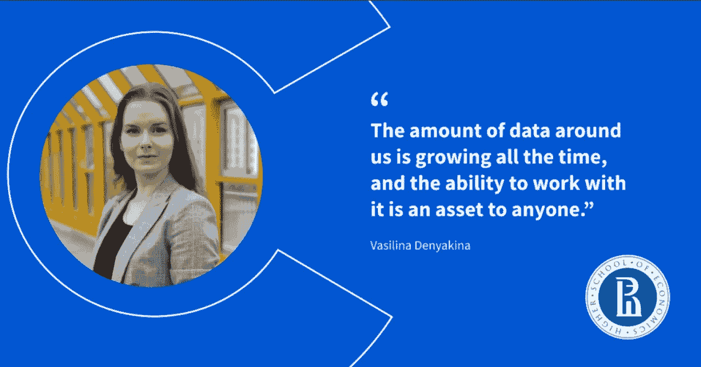
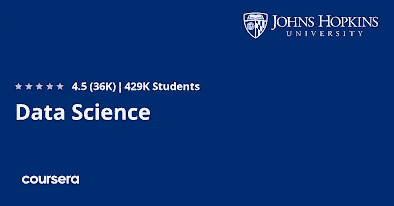
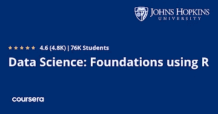
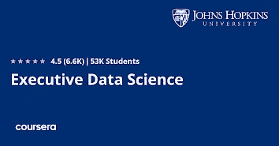
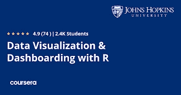
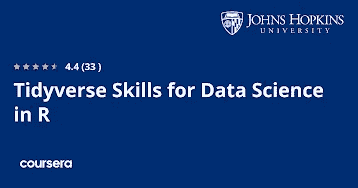
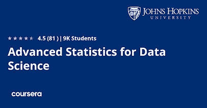

# Coursera 上的 7 门最佳数据科学课程，证书将在 2023 年成为数据科学家

> 原文：<https://medium.com/javarevisited/7-best-data-science-courses-with-certificates-on-coursera-from-jhu-usa-to-become-a-data-scientist-445a24882e8b?source=collection_archive---------1----------------------->

## 想成为 2023 年的数据科学家？以下是美国约翰霍普金斯大学学习数据科学的最佳 Coursera 课程和认证。

image_credit — coursera

大家好，如果你想在 2023 年开始数据科学和机器学习的职业生涯，并寻找最好的资源，如带证书的在线课程，那么你来对地方了。

前面我已经分享了学习 [*软件开发*](/javarevisited/10-best-software-development-courses-certifications-from-coursera-4ccc59aae201) 、 [***Python 编程***](/javarevisited/7-best-google-professional-certificates-on-coursera-to-learn-data-analytics-python-and-it-support-42147311cfe2) 、 [**云计算**](https://javarevisited.blogspot.com/2020/08/top-10-coursera-certifications-to-learn-cloud-computing-aws.html) 、 [Web 开发](https://javarevisited.blogspot.com/2020/08/top-10-coursera-certifications-to-learn-web-development.html#axzz6ddRPg7l6)的最好的 Coursera 课程，而在这篇文章中，我准备分享约翰霍普金斯大学最好的在线课程和认证，让 Python 和 r 都从零开始学习数据科学

约翰·霍普斯金大学是位于马里兰州巴尔的摩的世界一流大学之一。它成立于 1876 年，也是美国第一所研究型大学，是 9 个世界级学术部门作为一所大学共同工作的所在地。

现在，有了 Coursera，你可以在家里学习像约翰霍普金斯大学这样的世界级大学，在这篇文章中，我将为初学者和有经验的 IT 专业人员分享约翰霍普金斯大学最好的数据科学项目。

事实上， [**Coursera**](https://coursera.pxf.io/c/3294490/1164545/14726?u=https%3A%2F%2Fwww.coursera.org%2F) 拥有许多约翰·霍普金斯大学的在线课程、专业和认证，受到全球数百万学习者的信赖。如果你想知道什么是 Coursera 专业化，让我给你一个简单的概述。

 [## Coursera |学位、证书和免费在线课程

### 在网上课程中学习新的工作技能，这些技能来自行业领导者，如 Google、IBM 和 Meta。借助 top…推进您的职业发展

coursera.pxf.io](https://coursera.pxf.io/c/3294490/1164545/14726?u=https%3A%2F%2Fwww.coursera.org%2F) 

Coursera 专业化是帮助你掌握一项技能的一系列课程。它在专业结束时还有一个项目，让你有机会将所学知识应用到实践中。完成专业化认证后，您还将获得一份证书。

此外，当您订阅属于[专业](https://javarevisited.blogspot.com/2020/09/google-it-support-professional-certification-coursera-review.html)的课程时，您将自动订阅完整的专业。只完成一门课程是可以的，因为您可以暂停学习或终止订阅。您还可以使用学员仪表盘跟踪课程注册和进度。

最棒的是，你也可以免费参加这些课程，也就是所谓的免费审核，你可以看着他们学习，但你不能做评估，你也不会得到任何认证。如果你需要证书，那么你必须加入这个专业，或者你可以参加 [**Coursera Plus**](https://coursera.pxf.io/c/3294490/1164545/14726?u=https%3A%2F%2Fwww.coursera.org%2Fcourseraplus) ，这是一个订阅计划，提供他们的大多数证书和 7000 多个课程和项目。

 [## Coursera Plus |无限制访问 7，000 多门在线课程

### 在 Coursera 上可以无限制地访问 90%以上的课程、项目、专业和专业证书

coursera.pxf.io](https://coursera.pxf.io/c/3294490/1164545/14726?u=https%3A%2F%2Fwww.coursera.org%2Fcourseraplus) 

# 2023 年约翰霍普金斯大学 Coursera 上的 7 门最佳数据科学课程证书

现在你已经了解了 Coursera 的专业和项目，让我们来看看 2023 年约翰霍普金斯大学学习数据科学的最佳项目。你可以选择这些课程中的任何一门，或者将它们结合起来学习数据科学，开始你的职业生涯。

## 1.[JHU 大学数据科学专业](https://coursera.pxf.io/c/3294490/1164545/14726?u=https%3A%2F%2Fwww.coursera.org%2Fspecializations%2Fjhu-data-science)

这是约翰霍普金斯大学最受欢迎的数据科学专业，非常适合开始你的数据科学职业生涯。该专业包含十门课程的数据科学入门课程，这些课程由约翰霍普金斯大学的领先教授
Jeff Leek 博士、Roger D. Peng 博士和 Brian Caffo 博士精心组织、开发和讲授。

以下是您将在该数据科学专业中学习到的关键技能。

*   如何使用 R 编程语言来清理、分析和可视化数据？
*   从数据采集到发布的整个数据科学管道。
*   如何使用 GitHub 管理数据科学项目并与其他数据科学家合作
*   如何使用回归模型进行回归分析、最小二乘法和推断。

如果你想用 R 和 Python 学习数据科学，这个 JHU 课程是完美的。你会学到很多抢手的技能像 R 编程，机器学习，数据分析，回归分析，数据操纵，[数据分析](/javarevisited/11-best-coursera-certifications-and-courses-for-data-science-and-analysis-in-2021-65ce1ac810a5)，聚类分析，还有像 R Studio， [Git](https://www.java67.com/2019/04/top-5-courses-to-learn-git-and-github.html) ，[正则表达式](https://javarevisited.blogspot.com/2020/04/top-5-courses-to-learn-regular-expression-regex.html#axzz6d6JZB400)等工具。

超过 40 万人已经加入该计划开始他们的数据科学职业生涯，其中 38%的人在完成该专业后开始了新的职业生涯，19%的人获得了加薪或晋升。

**这是参加本课程**—[JHU](https://coursera.pxf.io/c/3294490/1164545/14726?u=https%3A%2F%2Fwww.coursera.org%2Fspecializations%2Fjhu-data-science)数据科学专业的链接

## 2.[数据科学:使用 R 的基础](https://coursera.pxf.io/c/3294490/1164545/14726?u=https%3A%2F%2Fwww.coursera.org%2Fspecializations%2Fdata-science-foundations-r)

这是来自约翰霍普金斯大学的另一个流行的数据科学项目，面向那些想用 R 编程语言学习数据科学的人。

这个项目涵盖了基础数据科学工具和技术，包括检索，清理，探索数据，R 语言编程，以及进行可重复的研究。

这种专业化适合于希望先开始并完成课程的基础部分，然后再进入[数据科学](https://javarevisited.blogspot.com/2020/12/udemy-course-review-data-science-bootcamp-course.html#axzz6hL5FIXGv)、[统计学](https://javarevisited.blogspot.com/2019/09/top-5-statistics-and-mathematics-course-for-data-science.html)和[机器学习](https://javarevisited.blogspot.com/2018/03/top-5-data-science-and-machine-learning-online-courses-to-learn-online.html)的更高级主题的学习者。该计划中有 5 门课程，这些课程构成了数据科学专业的前半部分。

完成这个专业之后，你可以参加数据科学:统计和机器学习专业，在这个专业中，你将有机会使用真实世界的数据构建一个数据产品。

**这是加入本课程的链接** — [数据科学:使用 R 的基础](https://coursera.pxf.io/c/3294490/1164545/14726?u=https%3A%2F%2Fwww.coursera.org%2Fspecializations%2Fdata-science-foundations-r)

顺便说一句，你不需要参加所有这些课程，你可以选择并参加你与导师联系的课程，如果你想参加多个课程，你也可以参加 Coursera Plus 的**订阅计划，让你无限制地访问 Coursera 的 7000+课程、专业化、专业证书和指导项目。**

** [## Coursera Plus |无限制访问 7，000 多门在线课程

### 在 Coursera 上可以无限制地访问 90%以上的课程、项目、专业和专业证书

coursera.pxf.io](https://coursera.pxf.io/c/3294490/1164545/14726?u=https%3A%2F%2Fwww.coursera.org%2Fcourseraplus)** 

## **3.[高管数据科学专业](https://coursera.pxf.io/c/3294490/1164545/14726?u=https%3A%2F%2Fwww.coursera.org%2Fspecializations%2Fexecutive-data-science)**

**如果您是负责领导数据科学团队的团队负责人、项目经理或高级经理，并且正在寻找数据科学速成班，以更好地理解技术对话和数据科学术语及流程，则此计划非常适合您。**

**在这一高管数据科学专业化认证中，您将获得数据科学速成课程，以精通该领域并了解您作为领导者的角色。**

**通过学习本课程，您将对[数据科学](/javarevisited/my-favorite-data-science-and-machine-learning-courses-from-coursera-udemy-and-pluralsight-eafc73acc73f)管道的结构、每个阶段的目标以及如何让您的团队始终保持目标有一个大致的了解。**

**你还将学习如何招募、组建、评估和发展一个具有互补技能和角色的团队。最后，您将学习一些实用的技能，帮助您克服经常干扰数据科学项目的常见挑战。**

****这是参加本课程的链接** — [高管数据科学专业](https://coursera.pxf.io/c/3294490/1164545/14726?u=https%3A%2F%2Fwww.coursera.org%2Fspecializations%2Fexecutive-data-science)**

****

## **4.[数据可视化&带 R 的仪表板](https://coursera.pxf.io/c/3294490/1164545/14726?u=https%3A%2F%2Fwww.coursera.org%2Fspecializations%2Fjhu-data-visualization-dashboarding-with-r)**

**对于任何数据科学家来说，数据可视化都是最重要的技能之一，因为如果您不能以易于理解和可视化的方式呈现数据以获得洞察力，那么到目前为止您在获取数据、清理数据、转换数据和分析数据方面所做的所有工作都是无用的。**

**你经常需要向高层管理人员和负责运营、增长和其他部门的人展示这些结果，掌握好[数据可视化](https://javarevisited.blogspot.com/2020/08/top-10-coursera-certifications-to-learn-Data-Science-Visualization-and-Data-Analysis.html#axzz6lxG136PO)会让你的工作变得容易。**

**该计划面向希望培养使用 R 可视化数据的能力的学习者。在 Coursera 的这一数据可视化专业中，您将通过五门课程[学习如何使用 R](/javarevisited/10-best-r-programming-courses-for-data-science-and-statistics-8f84ebec4974) 创建静态和交互式数据可视化并将其发布到 web 上，这将帮助您为多种类型的受众提供见解。**

**假设你每周花 4 个小时完成这个项目，大约需要 4 个月的时间。**

****这里是加入本课程** — [数据可视化&带 R 的仪表板](https://coursera.pxf.io/c/3294490/1164545/14726?u=https%3A%2F%2Fwww.coursera.org%2Fspecializations%2Fjhu-data-visualization-dashboarding-with-r)的链接**

****

## **5.[R 中数据科学的反向技能](https://coursera.pxf.io/c/3294490/1164545/14726?u=https%3A%2F%2Fwww.coursera.org%2Fspecializations%2Ftidyverse-data-science-r)**

**这是约翰·霍普金斯大学的另一个令人惊叹的项目，面向那些寻求用整洁的工具从数据中获得洞察力的人。Tidyverse 包提供了一种简单而强大的数据科学方法，可以从最基本的分析扩展到大规模的数据部署，您将学习如何使用 Tidyverse R 包导入、讨论、可视化和建模数据。**

**该程序面向熟悉 R 编程语言的数据科学家和那些寻求使用 Tidyverse 系列软件包进行数据科学研究的人。**

**在这个项目中有 5 门课程，你将使用强大的 Tidyverse 框架学习数据的导入、争论、可视化和建模。本课程涵盖了数据科学项目的整个生命周期，并为每个阶段提供了具体的工具。**

**按照每周 3 小时的安排，该课程将需要大约 7 个月的时间来完成。学完每一门课程，完成动手项目后，还会获得证书。**

****以下是参加本课程的链接—**[R](https://coursera.pxf.io/c/3294490/1164545/14726?u=https%3A%2F%2Fwww.coursera.org%2Fspecializations%2Ftidyverse-data-science-r)中的数据科学技术**

****

## **6.[数据科学:统计学和机器学习](https://coursera.pxf.io/c/3294490/1164545/14726?u=https%3A%2F%2Fwww.coursera.org%2Fspecializations%2Fdata-science-statistics-machine-learning)**

**这是约翰霍普金斯大学的高级数据科学专业，面向熟悉数据科学基础知识和 R 编程语言的人。这个项目继续并发展了数据科学的材料:使用 R 专门化的基础。**

**在这个项目中，你将学习统计推断、回归模型、机器学习和数据产品的开发。**

**在顶点项目中，您将应用通过使用真实世界的数据构建数据产品而学到的技能。完成后，学习者将有一个文件夹，展示他们对材料的掌握程度。**

**该专业的五门课程与数据科学专业的第二部分课程相同，数据科学专业是列表中的第一个项目。这种专业化适合于已经掌握了基础知识并想直接跳到更高级课程的学习者。**

**以下是参加 JHU 课程的链接— [数据科学:统计和机器学习](https://coursera.pxf.io/c/3294490/1164545/14726?u=https%3A%2F%2Fwww.coursera.org%2Fspecializations%2Fdata-science-statistics-machine-learning)**

****

## **7.[数据科学专业高级统计](https://coursera.pxf.io/c/3294490/1164545/14726?u=https%3A%2F%2Fwww.coursera.org%2Fspecializations%2Fadvanced-statistics-data-science)**

**静力学对于数据科学家来说至关重要，这是一门为数据科学学习统计学的神奇课程。您可以参加本课程，熟悉概率和统计、数据分析和数据科学线性模型的基本概念。**

**这个项目从数理统计训练营开始，特别是生物统计学应用中的概念和方法。这些范围从概率、分布和可能性概念到假设检验和病例对照抽样。**

**以下是您将在本课程中学到的内容:**

*   **概率、期望值、条件概率、分布、置信区间、自举、二项式比例等。**
*   **线性模型的典型例子。**
*   **线性回归模型的矩阵代数。**

**这个项目有 4 门课程。它们将为学习者回归建模的线性代数处理打下坚实的基础，并极大地增强应用数据科学家对回归模型的一般理解。**

****这是参加本课程** — [数据科学专业高级统计](https://coursera.pxf.io/c/3294490/1164545/14726?u=https%3A%2F%2Fwww.coursera.org%2Fspecializations%2Fadvanced-statistics-data-science)的链接**

****

**以上是关于 2023 年约翰霍普金斯大学的**最佳认证和学习数据科学的课程。JHU 有 Python 和 R 编程语言两种学习数据科学的课程，你可以选择符合你需要的课程。****

**约翰·霍普金斯大学不仅在美国，而且在世界上都是一所知名的大学，在学习数据科学等热门技能方面，他们有一些非常好的教授和教育工作者。**

**许多人试图进入 JHU，但谢天谢地，你不需要去美国向精英中的精英学习；你可以加入 Coursera 的这些课程和专业，在家或办公室在线学习。Coursera 通过提供顶级大学课程材料和教师访问，使在线学习变得更加容易。**

**顺便说一下，除了单独加入这些课程和专业，你还可以加入 Coursera Plus 的 [**，**](https://coursera.pxf.io/c/3294490/1164545/14726?u=https%3A%2F%2Fwww.coursera.org%2Fcourseraplus) 订阅计划，让你无限制地访问他们最受欢迎的课程、专业、专业证书和指导项目。**

** [## Coursera Plus |无限制访问 7，000 多门在线课程

### 在 Coursera 上可以无限制地访问 90%以上的课程、项目、专业和专业证书

coursera.pxf.io](https://coursera.pxf.io/c/3294490/1164545/14726?u=https%3A%2F%2Fwww.coursera.org%2Fcourseraplus) 

你可能喜欢的其他 **Coursera 资源文章**:

*   [2023 年 15 门免费 Coursera 课程供初学者加入](https://javarevisited.blogspot.com/2021/05/15-free-coursera-courses-to-learn-online.html)
*   [开始职业生涯的十大 Coursera 认证](/javarevisited/top-10-coursera-certificates-to-start-your-career-in-cloud-data-science-ai-mainframe-and-it-558690c83587)
*   [学习 Python 的 10 个 Coursera 专业化和认证](https://javarevisited.blogspot.com/2020/02/10-best-coursera-courses--for-python.html)
*   [面向程序员和开发人员的 Coursera 十大项目](https://javarevisited.blogspot.com/2020/08/top-10-coursera-projects-to-learn-essential-programming-skills.html)
*   Udemy vs. CodeCademy vs. OneMonth？
*   [5 个最佳 Coursera 程序员职业证书](https://javarevisited.blogspot.com/2019/10/top-5-coursera-professional-certificates-for-programmers-IT-professionals.html)
*   [Udemy vs . Educative vs . CodeCademy？新手用哪个比较好](/javarevisited/codecademy-or-pluralsight-which-is-a-better-platform-to-learn-coding-skills-59251a080642)
*   [2023 年学习 Python 可以做的 8 个项目](/javarevisited/8-projects-you-can-buil-to-learn-python-in-2020-251dd5350d56)
*   [你可以在 Coursera 上在线申请的前 5 个计算机科学学位](https://javarevisited.blogspot.com/2020/04/is-it-possible-to-get-master-of-computer-science-degree-online-coursera.html)
*   [Coursera Plus Review——在 Coursera 上学习的更好方式](https://javarevisited.blogspot.com/2020/08/coursera-plus-better-way-to-take-coursera-courses-specilizations-certification.html)
*   [Udemy vs Coursera？学理工和编程哪个好](https://javarevisited.blogspot.com/2020/01/coursera-vs-udemy-which-is-better-for-programming-tech.html)
*   [Coursera 证书对工作和事业有帮助吗](https://javarevisited.blogspot.com/2020/02/does-udemy-coursera-edx-educative-or.html)？
*   [2023 年学习人工智能的 7 门最佳课程](/javarevisited/7-best-courses-to-learn-artificial-intelligence-in-2020-26d59d62f6fe)
*   [Udemy vs 复数视线？哪个学习平台比较好？](https://javarevisited.blogspot.com/2019/10/udemy-vs-pluralsight-review-which-is-better-to-learn-code.html)
*   你可以在 Coursera Online 上获得 5 个数据科学学位

感谢您阅读本文。如果你喜欢约翰霍普金斯大学 Coursera 上的这些 b *est 数据科学认证和课程*，请分享给你的朋友和同事。如果您有任何问题或反馈，请留言。

**P. S. —** 如果你喜欢 Udemy 的课程，还可以在 Udemy 上查看 [**数据科学课程 2023:365 Careers 完成的数据科学训练营**](https://click.linksynergy.com/deeplink?id=CuIbQrBnhiw&mid=39197&murl=https%3A%2F%2Fwww.udemy.com%2Fcourse%2Fthe-data-science-course-complete-data-science-bootcamp%2F) 课程。这是在 Udemy 上学习数据科学的最佳课程之一，你只需花 10 美元就可以在 Udemy sales 上获得，这种情况时有发生。

 [## Udemy 的何塞·波尔蒂利亚 2023 年学习 Python、SQL 和数据科学的前 5 名课程——最好的

### 大家好，如果你参加了 Udemy 的任何课程，我相信你会有你最喜欢的老师，我有很多…

javarevisited.blogspot.com](https://javarevisited.blogspot.com/2022/02/top-5-jose-portilla-courses-from-udemy.html)**