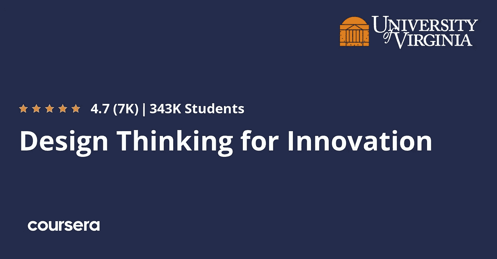
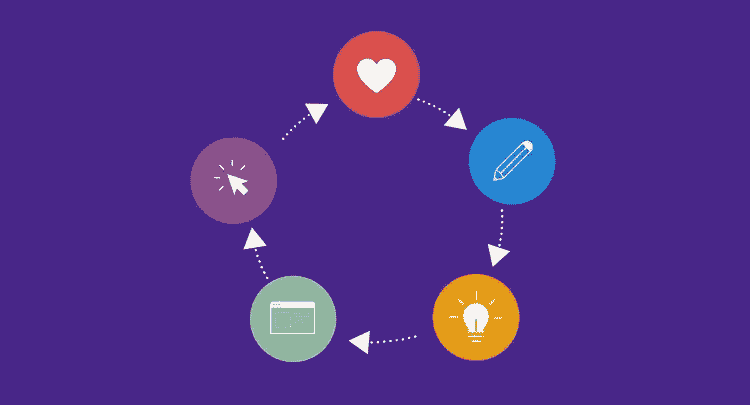
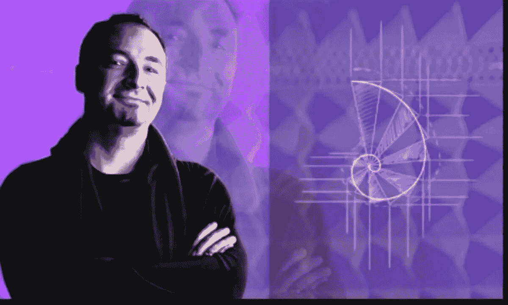
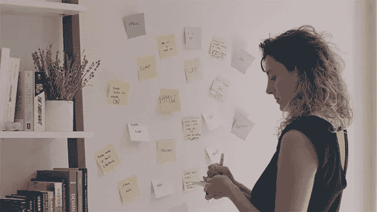

# 2023 年初学者和有经验者的 7 门最佳设计思维课程

> 原文：<https://medium.com/javarevisited/7-best-design-thinking-courses-for-beginners-fd605849a081?source=collection_archive---------0----------------------->

## 我最喜欢的在线课程是在 Udemy、Coursera、edX 和其他流行的在线网站上从头开始学习设计思维概念、工具和过程。

大家好，如果你想学习设计思维方法和技术，并寻找最好的资源，那么你来对地方了。在这篇文章中，我准备分享 2023 年初学者学习设计思维的**最佳在线课程。**

这份清单包括来自像 [Udemy](https://click.linksynergy.com/deeplink?id=CuIbQrBnhiw&mid=39197&murl=https%3A%2F%2Fwww.udemy.com%2F) 、 [Coursera](https://coursera.pxf.io/c/3294490/1164545/14726?u=https%3A%2F%2Fwww.coursera.org%2F) 和 [edX](https://www.awin1.com/cread.php?awinmid=6798&awinaffid=631878&clickref=&p=) 这样的网站的课程，这些课程是由专家创建的，受到成千上万想学习设计思维的人的信任。你可以加入他们，不仅了解设计思维是如何工作的，还可以用他们来解决问题和设计用户喜欢的产品。

如果你对创造性的想法和解决方案感兴趣，那么你可能听说过设计思维技术。**设计思维是制造适合用户的优秀产品的过程**，也是通过关注人们的需求并发现满足这些需求的最佳创意解决方案来解决问题的方法。

设计思维**由五个过程**组成，第一个是**感同身受**，这是理解用户问题的阶段，第二个是**定义理解**用户的需求和挑战，第三个是**想法**，在这里你将开发可能解决这些问题的想法。

第四个是**原型**你把这些想法拿来设计一个可以在用户身上测试的最终产品，第五个也是最后一个是测试，你要在用户身上尝试，看看它是如何工作和执行的。根据国家组织和员工的经验等许多因素，设计思维工作的工资被设定在每年 5.6 万美元到大约 9.6 万美元之间。如果你喜欢你在这篇文章中读到的内容，并且你想在网上看到一些课程，这些课程会深入地教你这些技能，那么请继续阅读以获得更多的信息和课程。

# 2023 年学习设计思维的 7 门最佳在线课程

在不浪费你更多时间的情况下，这里有你可以参加的从零开始学习设计思维的最好的在线课程。这些课程选自像 Udemy T1、T2 Coursera T3 和 T4 edX T5 这样的网站，可以帮助你从零开始掌握设计思维。它们也很实惠，Udemy 的课程只需花 10 美元就能在不时举行的 Udemy 大减价上买到。

## 1.[三步走的设计思路](https://click.linksynergy.com/deeplink?id=JVFxdTr9V80&mid=39197&murl=https%3A%2F%2Fwww.udemy.com%2Fcourse%2Fdesignit-design-thinking%2F)

如果你想在短时间内学习深入的设计思维，了解你的受众的需求，并创造性地提出解决方案，那么你可能会在 3 步课程中看到设计思维。

以下是您将在本课程中学到的关键技能:

*   了解设计思维的各个阶段。
*   创造并选择正确的想法。
*   将这些想法应用到现实世界的问题中。

您还将学习设计思维概念，如**了解您的受众**，他们是谁，他们的需求是什么，以及如何确定您的研究目标，开展您的研究，创建您的原型人物，等等。

以下是加入本课程的链接— [三步设计思维](https://click.linksynergy.com/deeplink?id=JVFxdTr9V80&mid=39197&murl=https%3A%2F%2Fwww.udemy.com%2Fcourse%2Fdesignit-design-thinking%2F)

## 2.[开发您的创新——认证设计思维训练营](https://click.linksynergy.com/deeplink?id=JVFxdTr9V80&mid=39197&murl=https%3A%2F%2Fwww.udemy.com%2Fcourse%2Fdevelop-your-idea-design-thinking-bootcamp%2F)

假设你有 IT 背景，你想使用工具来设计和创新想法，以解决客户的问题和需求，那么你可以在 Udemy 上观看本课程。

以下是您将在本课程中学到的重要知识:

*   设计思维导论。
*   设计思维的五个阶段。
*   选择最佳创意。

在整个课程中，你将学习解决问题的技巧，并将你的行动转化为商业理念和模式。此外，在本课程中，如何在产品中运用设计思维的过程将遵循我们之前谈到的五个阶段。

**以下是参加本课程的链接**——[认证设计思维训练营](https://click.linksynergy.com/deeplink?id=JVFxdTr9V80&mid=39197&murl=https%3A%2F%2Fwww.udemy.com%2Fcourse%2Fdevelop-your-idea-design-thinking-bootcamp%2F)

## 3.[创新的设计思维](https://coursera.pxf.io/c/3294490/1164545/14726?u=https%3A%2F%2Fwww.coursera.org%2Flearn%2Fuva-darden-design-thinking-innovation)【Coursera 最佳课程】

这是 Coursera 上学习设计思维最好的课程。如果你是领导一家公司的企业家，你想为你的客户创造创新和想法，从市场中获得洞察力并开发解决方案，那么你可以参加 [Coursera](https://coursera.pxf.io/c/3294490/1164545/14726?u=https%3A%2F%2Fwww.coursera.org%2F) 的这个专业。你将从如何提高你的创造力开始，为你提供一些实现目标的经历和活动。接下来，你将为制定战略决策做好准备，从而了解公司如何在创新中竞争。

本课程是 [**引领现代商业专业化**](https://coursera.pxf.io/c/3294490/1164545/14726?u=https%3A%2F%2Fwww.coursera.org%2Fspecializations%2Fleading-modern-day-business) 的一部分，您将在本课程中学到以下内容:

*   公司如何在创新中竞争。
*   尝试各种活动，了解更多关于创新的知识。
*   学习设计思维。

此外，你将进行设计思维，尝试一些方法来发现见解和创新。

以下是加入本课程的链接— [**创新设计思维**](https://coursera.pxf.io/c/3294490/1164545/14726?u=https%3A%2F%2Fwww.coursera.org%2Flearn%2Fuva-darden-design-thinking-innovation)

而且，如果你觉得 Coursera 的课程和证书有用，那么你也应该加入 Coursera Plus 的订阅计划，这是 Coursera 的一个订阅计划，它可以让你无限制地访问他们最受欢迎的课程、专业、专业证书和指导项目。

 [## Coursera Plus |无限制访问 7，000 多门在线课程

### 用 Coursera Plus 投资你的职业目标。无限制访问 90%以上的课程、项目…

coursera.pxf.io](https://coursera.pxf.io/c/3294490/1164545/14726?u=https%3A%2F%2Fwww.coursera.org%2Fcourseraplus) 

## 4.[micro master 在 edX 上设计思维程序](https://www.awin1.com/cread.php?awinmid=6798&awinaffid=631878&clickref=&p=%5B%5Bhttps%3A%2F%2Fwww.edx.org%2Fmicromasters%2Fritx-design-thinking)

完成专业化课程后，你会学到很多关于设计思维的主题，比如解决问题和以用户为中心的研究，并获得为你的观众创造创意的技能。

你将学习设计思维原则和创新理念，以及如何识别任何商业问题，如何解决它，如何做研究，如何从你的受众问题中提取想法，并利用这些想法创造最终产品，并在你的用户身上进行测试。

你将在本课程中学到:

*   做以用户为中心的研究。
*   发挥创意。
*   如何检验你的想法？

总的来说，这是一个很好的在线学习设计思维来开发创新产品的资源。如果你喜欢 edX 课程，如果你能负担得起 MicroMaster 项目，我强烈推荐这个在 2023 年加入。

**这里是加入这个项目** — [设计思维项目](https://www.awin1.com/cread.php?awinmid=6798&awinaffid=631878&clickref=&p=%5B%5Bhttps%3A%2F%2Fwww.edx.org%2Fmicromasters%2Fritx-design-thinking)的链接

## 5.[初学者的设计思维:开发创新的想法](https://click.linksynergy.com/deeplink?id=JVFxdTr9V80&mid=39197&murl=https%3A%2F%2Fwww.udemy.com%2Fcourse%2Fdesign-thinking-for-beginners%2F)

本文的最后一个课程是一个小课程，它将帮助你学习和应用从移情到在你的用户身上测试你的最终产品的设计思维过程的五个步骤。

在本课程中，您将学到:

*   设计思维的五个阶段。
*   发展想法。
*   将想法带入生活。

从设计思维的好处和换位思考的方法开始，与你的客户互动，从你的数据中提取想法，确定你工作的受众，最后将你的想法付诸实践。

**这里是加入本课程**——[初学者设计思维](https://click.linksynergy.com/deeplink?id=JVFxdTr9V80&mid=39197&murl=https%3A%2F%2Fwww.udemy.com%2Fcourse%2Fdesign-thinking-for-beginners%2F)的链接

## 6.[完整的设计思维大师班|包含电子书](https://click.linksynergy.com/deeplink?id=CuIbQrBnhiw&mid=39197&murl=https%3A%2F%2Fwww.udemy.com%2Fcourse%2Fdesign-thinking-masterclass%2F)

这是 Udemy 推出的又一门学习设计思维的神奇课程。在本课程中，你将学习到在 2023 年成为一名成功的设计思维专家所需的步骤、流程和工具。

在这个长达 4.5 小时的 Udemy 课程中，你将学到以下内容:

*   如何应对现实生活中的设计挑战。
*   如何进行客户研究，并利用这些知识产生结果。
*   完全整合的方法创造了独特的设计思维过程
*   整个*设计思维过程*是如何运作的
*   如何让您或您的客户的业务为交付已设计的体验做好准备

你还将着手一个实际的商业案例——我们将运用设计思维创造你梦想中的餐厅体验。

这将让你完全理解设计思维工具是如何工作的——我们不仅会向你展示这些工具，还会展示结果的真实例子 **ts** ，这样你就能确切地知道每种方法会带来什么样的结果。

**这里是加入本课程** — [完整设计思维大师班](https://click.linksynergy.com/deeplink?id=CuIbQrBnhiw&mid=39197&murl=https%3A%2F%2Fwww.udemy.com%2Fcourse%2Fdesign-thinking-masterclass%2F)的链接

## 7.[设计思维大师班，创新&创意](https://click.linksynergy.com/deeplink?id=CuIbQrBnhiw&mid=39197&murl=https%3A%2F%2Fwww.udemy.com%2Fcourse%2Fmasterclass-in-design-thinking-innovation-creativity%2F)

这是另一个实践课程，学习从开始到验证的设计思维过程，了解用户，发现见解，原型和测试。

由 [Rinat Sherzer](https://click.linksynergy.com/deeplink?id=CuIbQrBnhiw&mid=39197&murl=https%3A%2F%2Fwww.udemy.com%2Fuser%2Frinat-sherzer-2%2F) 创建，在这门大师课中，你将通过设计思维学习目的驱动创新的**来龙去脉**。你将从真实的案例研究和顶尖的创意工具中学到东西。

以下是您将在本课程中学到的内容:

*   从开始到验证，通过解决自己的挑战来完成整个设计思考过程
*   增强您的创造力和创新技能的工具
*   研究方法来了解你的受众。
*   发现惊人的见解
*   学会将问题转化为机遇
*   培养集思广益和构思的能力

在这个令人惊叹的设计思维大师班结束时，你将已经深入了解了你的目标受众，发现了令人惊讶的见解，提出了许多令人兴奋的想法，然后与真实用户一起原型化和测试了所选的想法。

**这里是加入本课程**——[设计思维大师班&创意](https://click.linksynergy.com/deeplink?id=CuIbQrBnhiw&mid=39197&murl=https%3A%2F%2Fwww.udemy.com%2Fcourse%2Fmasterclass-in-design-thinking-innovation-creativity%2F)的链接

以上是 2023 年**最佳设计思维课程**。现代社会中的每一家医院和大学都应该为其客户或用户提供卓越的体验，为了实现这一目标，他们需要了解用户的问题需求，找到解决问题的方法，并在用户身上进行测试，这就是设计思维这个术语。

其他**网页设计与开发文章**你可能喜欢探索

*   [成为全栈式 Web 开发人员的 10 大在线课程](/@javinpaul/top-10-online-courses-to-become-a-fullstack-web-developer-in-2020-d608a6b63232)
*   [Java 和 Web 开发人员应该学习的 10 个框架](http://javarevisited.blogspot.sg/2018/01/10-frameworks-java-and-web-developers-should-learn.html)
*   [2023 年成为网页设计师的 5 门免费课程](https://www.java67.com/2020/07/top-5-free-courses-to-become-web-design.html)
*   [Web 开发人员学习 Angular 的 10 门免费课程](https://javarevisited.blogspot.com/2019/04/10-free-angular-and-react-courses-for.html)
*   [2023 年前端开发者路线图](https://javarevisited.blogspot.com/2019/02/the-2019-web-developer-roadmap.html)
*   [2023 年学习 JavaScript 的 12 门免费课程](/javarevisited/12-free-courses-to-learn-javascript-and-es6-for-beginners-and-experienced-developers-aa35874c9a32)
*   [在线学习 React.js 的五大课程](https://javarevisited.blogspot.com/2018/08/top-5-react-js-and-redux-courses-to-learn-online.html)
*   [学习使用 Python 进行全栈 web 开发的 5 门课程](https://javarevisited.blogspot.com/2020/06/top-5-courses-to-learn-python-full-stack-web-development.html)
*   [2023 年学习 Web 开发的十大课程](https://dev.to/javinpaul/top-6-courses-to-learn-web-development-best-of-lot-2fae)
*   [10 门免费学习 Web 开发打字脚本的课程](/javarevisited/top-10-free-typescript-courses-to-learn-online-best-of-lot-44bce9da41d1)

感谢您阅读本文。如果你喜欢这些最棒的*设计思维与创新课程*，那么请分享给你的朋友和同事。如果您有任何问题或反馈，请留言。

**p . s .**——如果你热衷于学习设计思维并寻找*免费的设计思维课程*开始，那么你也可以查看弗吉尼亚大学 Coursera 上的 [**敏捷遇上设计思维**](https://click.linksynergy.com/deeplink?id=JVFxdTr9V80&mid=40328&murl=https%3A%2F%2Fwww.coursera.org%2Flearn%2Fuva-darden-getting-started-agile) 课程。你可以免费注册这门课程。

 [## 敏捷符合设计思维

### 尽管每个人都有良好的意图、努力的工作和坚实的想法，但是太多的团队最终创造出了没有人…

udemy.com](https://click.linksynergy.com/deeplink?id=JVFxdTr9V80&mid=40328&murl=https%3A%2F%2Fwww.coursera.org%2Flearn%2Fuva-darden-getting-started-agile)