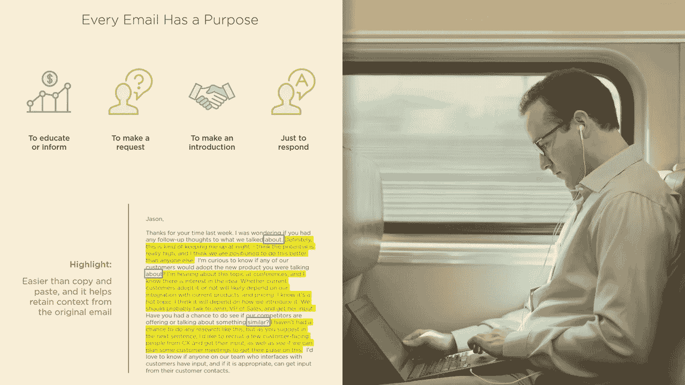
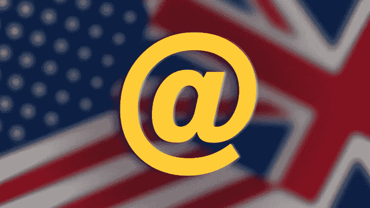
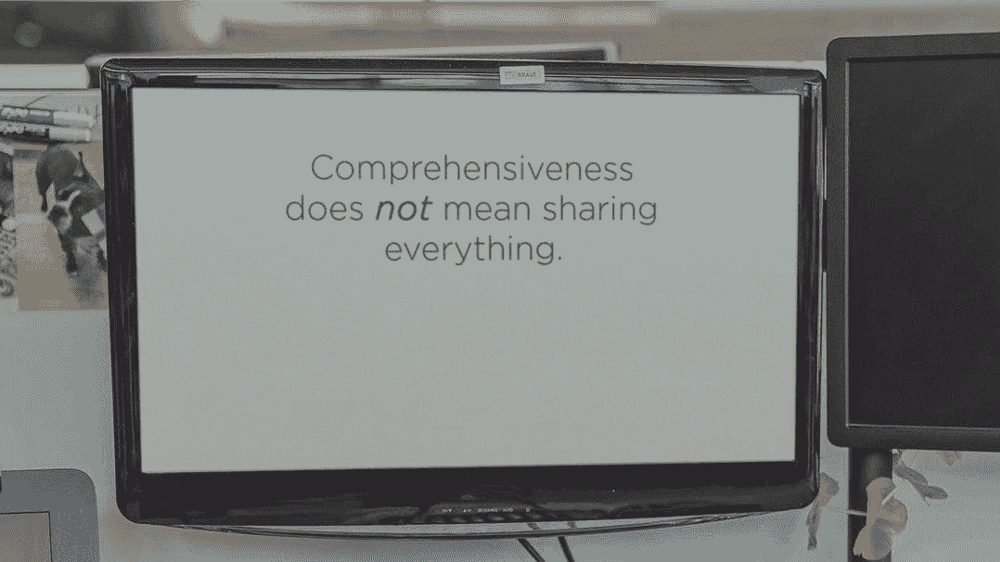

# 2023 年 IT 专业人士和数字营销人员的 7 门最佳邮件写作课程

> 原文：<https://medium.com/javarevisited/7-best-email-writing-online-courses-for-it-professionals-and-digital-marketers-in-2020-2f13e475d4f9?source=collection_archive---------0----------------------->

## 2023 年在线学习 Udemy、Pluralsight、Coursera 的 7 门最佳电子邮件写作课程

电子邮件写作:写有效邮件的有效策略！乌德米

你好，伙计们，如果你正在努力写好电子邮件，并且真的想提高你的电子邮件写作技巧，那么你来对地方了。过去，我已经分享了[最佳软技能书籍](https://javarevisited.blogspot.com/2017/12/5-career-development-and-soft-skill-books-for-programmers.html#axzz6ZRhtSJTI)，今天，我将与您分享您可以加入的最佳在线课程，以提高您的电子邮件写作技能。这些课程是由专家和大量学习电子邮件礼仪的资源创建的

我的一位读者几天前给我发了一封电子邮件，问我是否可以提出一些建议来提高他的电子邮件写作技巧？他说，他非常擅长工作和编程，但写电子邮件却很糟糕，正因为如此，他从未得到应有的关注，导致没有晋升或职业发展。

这听起来是一个普遍的问题，尤其是在母语不是英语的[程序员](http://www.java67.com/2018/01/top-10-web-mobile-and-big-data-framework-libraries-technologies-programmers-should-learn-in-2018.html)中，他们从未参加过任何商业或电子邮件写作课程。

事实上，这对我来说也是一个问题，但是我慢慢地学会了，尽管我仍然远远落后于我认识的许多拥有优秀电子邮件沟通技巧的人。

老实说，在当今的企业和网络世界中，我们在全球范围内工作，与分布在世界各地的客户、用户和程序员进行互动，电子邮件是最重要的工具之一。

这对职业发展变得更加重要。例如，如果你想成为一名[软件架构师](https://javarevisited.blogspot.com/2018/02/5-must-read-books-to-become-software-architect-solution.html)或[项目经理](https://javarevisited.blogspot.com/2018/10/top-5-carrer-options-for-experienced-java-programmers.html)，那么你必须拥有出色的书面沟通技巧，这基本上就是写一封可靠的电子邮件。

**很少有人能看到你的长相或说话方式，但很多人会看你的邮件，他们会通过看你的邮件对你产生一种感知。一封来自经验丰富的权威人士的电子邮件总是给人一种印象，即他是一个主持大局或做决定的人。对于一个高级开发人员来说也是一样，他给人的印象是他知道自己在说什么。甚至我也遇到过这样的例子，那些拥有出色的电子邮件写作技巧但缺乏经验的人听起来像是项目负责人，纯粹是因为他们写的内容和他们陈述事实或信息的方式。正如 TJ·沃克在他的经典著作《11 项职业必备软技能》中提到的那样，你，你自己，是你职业生涯的主宰，如果你认为这是阻碍你前进的一项技能，那么今天就是开始思考如何提高你的职业电子邮件写作技能的绝佳时机。**

# 2023 年，程序员和 IT 专业人员可以加入 7 门在线课程来学习和提高电子邮件写作技能

当你考虑学习一项新技能时，你能做的最好的事情就是从一个在线课程开始。它们不仅给你一个良好的开端，而且比书本更具互动性，你可以和真实的人打交道。你可以提出问题，澄清你的疑问，并且有人会检查你的工作。

我一直是一个书迷，从书中学到了大部分技能，但从最近几年来，在线课程已经成为我学习新东西的首选方法。我去年在 Udemy 的[快闪拍卖](https://click.linksynergy.com/fs-bin/click?id=JVFxdTr9V80&offerid=323058.9410&type=3&subid=0)中购买了 100 多门课程，他们以 10.99 美元或 9.99 美元

出售课程。记住这一点，我将分享给程序员和 IT 专业人士一些*最佳电子邮件写作在线课程。如果你想提高你的电子邮件写作技巧，那么这些课程将为你提供所有你需要的知识、工具和经验。这里是我列出的 7 门最好的电子邮件写作课程，我相信程序员、营销人员和 IT 专业人士可以参加这些课程来提高他们的电子邮件写作技能。*

## 1.[写更好的邮件:更聪明的团队沟通策略](https://click.linksynergy.com/deeplink?id=JVFxdTr9V80&mid=39197&murl=https%3A%2F%2Fwww.udemy.com%2Fcourse%2Fwrite-better-emails%2F)

这是学习掌握电子邮件写作艺术的最佳 Udemy 课程。顾名思义，本课程将教你如何写更好的电子邮件，以实现更智能的团队沟通，并在你的项目和团队中建立你的回购协议。

在本课程中，您将学习以下技能

*   如何用简单的步骤提高你的电子邮件写作技巧
*   学习适当的电子邮件礼仪和商务写作技巧，让你获得成效
*   避免让人们困惑的电子邮件中的常见错误
*   如何改善团队内部的沟通
*   节省写邮件和回复邮件的时间
*   写清楚的电子邮件，准确解释你想要什么

简而言之，专业人士学习电子邮件写作的最佳在线课程之一。对于经常通过电子邮件与其团队成员交流的组织中的 IT 专业人员来说，这是一门理想的课程

**这是参加本课程的链接**——[写更好的电子邮件:更聪明的团队沟通策略](https://click.linksynergy.com/deeplink?id=JVFxdTr9V80&mid=39197&murl=https%3A%2F%2Fwww.udemy.com%2Fcourse%2Fwrite-better-emails%2F)

## [2。有效的电子邮件沟通](http://pluralsight.pxf.io/c/1193463/424552/7490?u=https%3A%2F%2Fwww.pluralsight.com%2Fcourses%2Feffective-email-communication)

正如我所说，掌握电子邮件沟通对你的职业和商业成功至关重要。它有时也意味着保住或丢掉一份工作或得到或失去一份合同的区别。

你必须学习可靠、有效的电子邮件沟通的基本知识，以保持你的职业生涯在正轨上，这是一个很好的开始课程。

在本课程中，您将学习如何设置您的电子邮件信息，以增加被打开和回复的机会，并对读者产生最大的影响。在学习本课程的过程中，你将学会如何在你的电子邮件客户端中设置一些东西，并构建适当且有影响力的信息。你将学会如何与他人互动，以及回复复杂的电子邮件。

**以下是参加本课程** — [有效的电子邮件沟通](http://pluralsight.pxf.io/c/1193463/424552/7490?u=https%3A%2F%2Fwww.pluralsight.com%2Fcourses%2Feffective-email-communication)的链接

顺便说一下，你需要一个 [Pluralsight 会员资格](/javarevisited/pluralsight-or-udemy-d9a94d2e8ee) p 才能加入这个课程，费用大约是每月 29 美元或每年 299 美元(14%的折扣)。我向所有程序员强烈推荐这个订阅，因为它提供了超过 7000 个在线课程的即时访问，以学习任何技术技能。或者，你也可以使用他们的 [**10 天免费通行证**](https://pluralsight.pxf.io/c/1193463/424552/7490?u=https%3A%2F%2Fwww.pluralsight.com%2Flearn) 免费观看这门课程。

 [## 个人技术技能|多视角

### 培养你在职业生涯中更快发展所需的技术技能。掌握最新的技术与数以千计的…

pluralsight.pxf.io](https://pluralsight.pxf.io/c/1193463/424552/7490?u=https%3A%2F%2Fwww.pluralsight.com%2Flearn) 

## [3。商业技巧:每个人都应该知道的电子邮件礼仪规则](https://click.linksynergy.com/fs-bin/click?id=JVFxdTr9V80&subid=0&offerid=323058.1&type=10&tmpid=14538&RD_PARM1=https%3A%2F%2Fwww.udemy.com%2Femail-etiquette-for-business%2F)

这是我在 Udemy 上学习电子邮件礼仪和规则的最好的课程之一。当我回头看我的旧邮件时，我惊讶地发现我犯了这么多错误。不恰当的电子邮件礼仪会对职业形象产生负面影响，并损害你的形象。

本课程通过指导你特殊的电子邮件礼仪，帮助你将风险降至最低。当然，这包括对职场职业精神、行为、邮件结构、格式、拼写、拼写和语法的重要性、最重要的主题等等的关注。

**这是参加本课程的链接** — [商业技能:每个人都应该知道的电子邮件礼仪规则](https://click.linksynergy.com/fs-bin/click?id=JVFxdTr9V80&subid=0&offerid=323058.1&type=10&tmpid=14538&RD_PARM1=https%3A%2F%2Fwww.udemy.com%2Femail-etiquette-for-business%2F)

## [4。正式电子邮件写作—商务英语](https://click.linksynergy.com/fs-bin/click?id=JVFxdTr9V80&subid=0&offerid=323058.1&type=10&tmpid=14538&RD_PARM1=https%3A%2F%2Fwww.udemy.com%2Fbusiness-english-formal-email-writing%2F)

这是一个写官方邮件的速成班。你将很快学会基本的电子邮件礼仪以及如何写正式的电子邮件。它还会教你如何恰当地组织你的电子邮件，使用什么语言，以及避免那些即使是母语人士也会犯的可耻错误。

简而言之，写更好的电子邮件的完美课程，掌握格式、语法、短语，避免常见错误。我强烈推荐每一个程序员加入这个课程。

**以下是参加本课程** — [正式电子邮件写作—商务英语](https://click.linksynergy.com/fs-bin/click?id=JVFxdTr9V80&subid=0&offerid=323058.1&type=10&tmpid=14538&RD_PARM1=https%3A%2F%2Fwww.udemy.com%2Fbusiness-english-formal-email-writing%2F)的链接

## [5。完美的电子邮件:学习有效的电子邮件礼仪写作](https://click.linksynergy.com/fs-bin/click?id=JVFxdTr9V80&subid=0&offerid=323058.1&type=10&tmpid=14538&RD_PARM1=https%3A%2F%2Fwww.udemy.com%2Femail-etiquette-email-netiquette-email-guidelines%2F)

这是一个关于理解电子邮件礼仪的完美在线课程，学习如何专业地写有风格的结构化电子邮件。

面向所有使用电子邮件的人，比如程序员、业务分析师、项目经理、测试人员，甚至业务用户和客户。

为了在你的职业生涯中成长，不仅要努力工作，而且你需要说你正在做这项工作，没有什么比电子邮件更能为你的工作创造积极的氛围了。如果你缺乏实用的电子邮件写作技巧，这些课程将帮助你提高技能，实现你应得的。

**这里是加入本课程的链接**——[完美的电子邮件:学习有效的电子邮件礼仪写作](https://click.linksynergy.com/fs-bin/click?id=JVFxdTr9V80&subid=0&offerid=323058.1&type=10&tmpid=14538&RD_PARM1=https%3A%2F%2Fwww.udemy.com%2Femail-etiquette-email-netiquette-email-guidelines%2F)

## 6.[通过 LinkedInLearning 写邮件](http://linkedin-learning.pxf.io/c/1193463/449670/8005?u=https%3A%2F%2Fwww.linkedin.com%2Flearning%2Fwriting-email)

这是另一个很棒的课程，教你如何通过精心设计你的信息和表达方式，写出有力的电子邮件，让你的同事阅读和回复。在这个简短的课程中，作家兼商务写作教授@Judy Steiner-Williams 向你展示如何写邮件以获得最大的可读性和影响力。

以下是您将在本课程中学到的重要内容:

*   为电子邮件建立一个明确的目的，并有效地传达它。
*   确定一封邮件的受众是谁，并相应地写下来。
*   运用各种规则和技巧来创造强有力的信息。
*   评估抄送和密件抄送的需求，并仔细选择收件人。
*   引用发送电子邮件的一般礼仪规则。

在这个过程中，你将学会如何精心制作一个引人注目的开场白，如何在正确的时间给正确的人发信息，以及如何利用礼仪将电子邮件作为你的团队和公司的众多沟通工具之一。

**这是参加本课程**——[撰写电子邮件的链接学习](http://linkedin-learning.pxf.io/c/1193463/449670/8005?u=https%3A%2F%2Fwww.linkedin.com%2Flearning%2Fwriting-email)

顺便说一句，你需要 LinkedIn Learning 会员才能观看这门课程，每月费用约为 29.99 美元，但你也可以通过参加他们的 [**1 个月免费试用**](http://linkedin-learning.pxf.io/c/1193463/449670/8005?u=https%3A%2F%2Fwww.linkedin.com%2Flearning%2Fsubscription%2Fproducts) 来免费观看这门课程，这是探索他们 16000 多门最新技术在线课程的好方法。

 [## LinkedIn 学习价格|选择学习计划| LinkedIn

### 为 LinkedIn Learning 选择按月付费或按年付费

linkedin-learning.pxf.io](http://linkedin-learning.pxf.io/c/1193463/449670/8005?u=https%3A%2F%2Fwww.linkedin.com%2Flearning%2Fsubscription%2Fproducts) 

## [7。工作场所的写作:电子邮件、备忘录、报告和社交信息](http://pluralsight.pxf.io/c/1193463/424552/7490?u=https%3A%2F%2Fwww.pluralsight.com%2Fcourses%2Fwriting-workplace-email-memos-reports-social)

这是 Pluralsight 为程序员和软件工程师编写专业电子邮件、备忘录、报告和社交信息的另一门优秀课程，但我认为每个在工作场所进行某种形式写作的人都应该参加这门课程。

本课程涵盖了最常见的、可重复的内部办公室沟通类型，如何创建这种写作，以及如何修改它以获得最大的影响和价值。

**这是参加本课程的链接** — [职场写作:电子邮件、备忘录、报告和社交信息](http://pluralsight.pxf.io/c/1193463/424552/7490?u=https%3A%2F%2Fwww.pluralsight.com%2Fcourses%2Fwriting-workplace-email-memos-reports-social)

以上是学习有效的电子邮件写作的一些最佳课程。重要的是，你首先要学习基本的电子邮件礼仪，你的电子邮件的正确结构，比如在第一行介绍最重要的信息和电子邮件的语气。这些课程将帮助你学习写好电子邮件的基础和高级技巧。

其他**对程序员有用的资源**你可能喜欢:
[为什么每个作家都要用语法？](https://javarevisited.blogspot.com/2019/07/why-every-blogger-should-use-grammarly.html)
[5 门面向 Java 开发者的免费 Spring 框架课程](http://www.java67.com/2017/11/top-5-free-core-spring-mvc-courses-learn-online.html)
[5 门学习 Linux 中 Shell 脚本的课程](http://javarevisited.blogspot.sg/2018/02/5-courses-to-learn-shell-scripting-in-linux.html)
[5 门面向 Java 和 Web 开发者的 Node JS 课程](http://javarevisited.blogspot.sg/2018/01/top-5-nodejs-and-express-js-online-courses-for-web-developers.html)
[5 门免费学习核心 Java 的在线课程](http://javarevisited.blogspot.sg/2017/11/top-5-free-java-courses-for-beginners.html#axzz4zuIICRs9)
[5 门免费学习 Angular 的在线培训课程](http://www.java67.com/2018/01/top-5-free-angular-js-online-courses-for-web-developers.html)
[5 门免费学习大数据和 Apache Spark](http://javarevisited.blogspot.com/2017/12/top-5-courses-to-learn-big-data-and.html)
[5 门免费 算法](http://javarevisited.blogspot.sg/2018/01/top-5-free-data-structure-and-algorithm-courses-java--c-programmers.html#axzz55lOcYrUM)
[Java 开发者学习 Android 的 5 条路径](http://javarevisited.blogspot.sg/2017/12/top-5-android-online-training-courses-for-Java-developers.html)
[5 门免费课程学习 Git 和 Github](http://javarevisited.blogspot.sg/2018/01/5-free-git-courses-for-programmers-to-learn-online.html#axzz568Oo1Jao)
[前 5 名 Selenium with Java Web Driver 课程](http://javarevisited.blogspot.sg/2018/02/top-5-selenium-webdriver-with-java-courses-for-testers.html)
[Java 开发者学习 Kotlin 编程的 5 条路径](http://javarevisited.blogspot.sg/2018/02/5-courses-to-learn-kotlin-programming-java-android.html#axzz56R4AatoQ)
[5 门课程准备编程工作面试](http://javarevisited.blogspot.sg/2018/02/10-courses-to-prepare-for-programming-job-interviews.html)
[2023 年全栈 Web 开发者路线图](/javarevisited/the-2019-web-developer-roadmap-ab89ac3c380e)
[如何成为](/hackernoon/the-2018-devops-roadmap-31588d8670cb)

感谢阅读这篇文章。如果你喜欢这些针对 IT 专业人士和数字营销人员的*最佳电子邮件写作课程*，那么请与你的朋友和同事分享。如果你觉得缺少了什么，或者你有一门课要添加到这个列表中，请随意留言。

**附言——**如果你渴望提高你的电子邮件写作技巧，但又在寻找免费的在线课程，那么你也可以看看 Udemy 上的 [**电子邮件写作——如何撰写有效的电子邮件**](https://click.linksynergy.com/deeplink?id=JVFxdTr9V80&mid=39197&murl=https%3A%2F%2Fwww.udemy.com%2Fcourse%2Femail-writing-how-to-write-effective-emails%2F) 课程。这是完全免费的，你只需要一个免费的 Udemy 帐户就可以参加这个课程。

 [## 免费电子邮件礼仪教程-电子邮件写作-如何写有效的电子邮件

### 这是 Alex Melwyn，一个认证的谷歌教育 1 级和 2 级，也是微软认证的创新教育有…

udemy.com](https://click.linksynergy.com/deeplink?id=JVFxdTr9V80&mid=39197&murl=https%3A%2F%2Fwww.udemy.com%2Fcourse%2Femail-writing-how-to-write-effective-emails%2F)