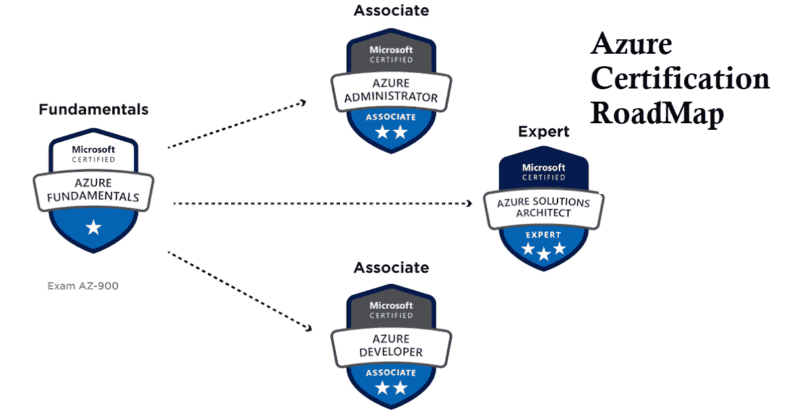
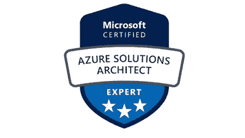
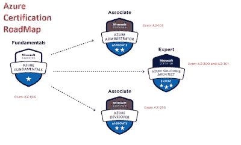
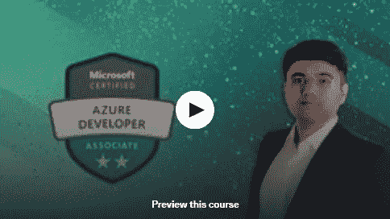

# 成为微软认证的 7 门最佳免费课程:2023 年 Azure 解决方案架构师专家

> 原文：<https://medium.com/javarevisited/7-best-free-azure-solution-architect-resources-to-crack-az-303-or-az304-exam-f2b525eba09b?source=collection_archive---------2----------------------->

## 我最喜欢的准备 Azure 解决方案架构师技术考试 AZ 305 的在线课程和练习测试

大家好，如果你正在准备 Azure Solution architect technologies certification(代码为 AZ-305)并寻找免费的在线课程来开始准备，那么你来对地方了。

以前我分享过通过[**Azure 基础**](/javarevisited/5-best-azure-fundamentals-courses-to-pass-az-900-certification-exam-in-2020-9e602aea035d) ， [**Azure 管理员**](/javarevisited/7-best-courses-for-az-104-microsoft-azure-administrator-associate-certification-exam-in-2021-7b620d61dcd8) ， [**初级 Azure 课程**](/javarevisited/10-best-microsoft-azure-courses-for-beginners-and-experienced-developers-d41a454834c0) **，**今天我要分享的是免费在线课程，准备参加 Azure 解决方案架构师考试，2023 年成为微软认证:Azure 解决方案架构师专家。

Azure 是微软的产品。这是目前最好的云服务之一。在 [AWS](https://javarevisited.blogspot.com/2020/05/top-5-amazon-web-services-aws-courses-for-beginners-and-experienced-programmers.html) 之后，如果你能依靠什么，那就是微软 Azure 平台。在安全性和效率方面，它有时甚至优于 AWS。

你做了一个很大的决定，出现在[蔚蓝云架构师协理考试](https://javarevisited.blogspot.com/2020/04/how-to-crack-microsoft-azure-solution-architect-exam-az-300.html)，这是为了解决方案架构师这个角色，所以如果你是 spring 成为软件架构师和解决方案架构师，这个认证可以帮到你。

准备 AZ-305 考试成为 Azure 认证解决方案架构师是有意义的。

在本指南中，我将分享*五门免费课程，以优异的成绩通过 Azure cloud Architect Associate 考试*。你必须注意，下面列出的所有课程都是由行业专家创建的，你可以信赖这些课程。

顺便说一句，如果你真的想通过 AZ-305 考试并成为 Azure 解决方案架构师，并且不介意为这样一个有价值的认证花几个钱，那么我强烈建议你去看看 Udemy 上由 Scott Duffy 开设的[**AZ-300/AZ-303 Azure Architecture Technologies Exam Prep 2023**](https://click.linksynergy.com/deeplink?id=JVFxdTr9V80&mid=39197&murl=https%3A%2F%2Fwww.udemy.com%2Fcourse%2F70534-azure%2F)课程。

<https://click.linksynergy.com/deeplink?id=JVFxdTr9V80&mid=39197&murl=https%3A%2F%2Fwww.udemy.com%2Fcourse%2F70534-azure%2F>  

本课程不是免费的，但这 20 小时的课程是本次考试的最佳准备材料，它已更新，涵盖了 AZ-303 示例的所有新主题，如 [NoSQL 数据库](/javarevisited/10-free-online-courses-to-learn-mongodb-and-nosql-942609611664)、Azure SQL 数据库等等。超过 100，000 名学生信任这门课程。

# 7 门免费的 Azure 云架构师技术认证考试课程(AZ-303、AZ-304)

这里是你可以参加的最好的免费在线课程列表，开始准备代码为 AZ -305 的 Azure 云架构师考试。

正如我所说的，AZ-305 考试还没有专门的免费课程，这些是开始准备的好材料。我们还会在找到合适的在线课程和模拟考试时更新这个列表。

但在继续进行课程列表之前，建议注册每门课程并按照列表进行学习。这是因为所有这些课程都是相互关联的，只有完成了清单上的第一门课程，你才能理解第二门课程。因此，不要跳过列表中的任何课程

## 1.[蔚蓝安全真实世界——新手动手](https://click.linksynergy.com/deeplink?id=JVFxdTr9V80&mid=39197&murl=https%3A%2F%2Fwww.udemy.com%2Fcourse%2Fazure-security-real-world-hands-on-for-beginners%2F)【免费】

现在，您有了一个基础，可以开始构建特定主题的知识。从 Azure 开始，微软 Azure 概念课程是你的最佳选择。Linux 学院开设了这门课程，到目前为止，已经有超过 31000 名学生注册了这门课程。本课程使用坚如磐石的视觉效果和插图来处理 Azure 的复杂主题。这是一个 1 小时 13 分钟长的课程，参加这个课程，你会发现它非常有趣，由于视觉效果。

本课程专门讲微软 Azure 因此，它将教授 Azure 的基础知识、术语以及在其他云平台上使用 Azure 的好处。

为了在你的 [Azure 云架构师助理考试](https://javarevisited.blogspot.com/2019/07/top-5-courses-to-crack-azure-architecture-technologies-certification-az-300-exam.html#axzz6E6VuRMsx)中表现出色，学习这些基础知识很重要，本课程将帮助你简要了解 Azure 平台的每一点。

**这里是加入本课程的链接** — [微软 Azure 概念](https://click.linksynergy.com/deeplink?id=JVFxdTr9V80&mid=39197&murl=https%3A%2F%2Fwww.udemy.com%2Fcourse%2Fazure-security-real-world-hands-on-for-beginners%2F)

## 3. [Azure SQL 数据仓库 Synapse 分析—模块 1(免费)](https://click.linksynergy.com/deeplink?id=JVFxdTr9V80&mid=39197&murl=https%3A%2F%2Fwww.udemy.com%2Fcourse%2Fazure-sql-data-warehouse-synapse-analytics-free-version%2F)

在这个免费课程中，你学习了 Azure 概念基础，那个课程是完全基础的，但是这个课程实现了概念并指导你如何使用 Azure 的元素。

虽然本课程是针对其他 [Azure 考试](https://javarevisited.blogspot.com/2020/11/top-10-azure-certifications-you-can-aim.html#axzz6e8hmwujv)的，但它将在你的 Azure 云架构师助理考试中发挥至关重要的作用，本课程将向你展示如何在日常项目中使用 Azure，除此之外，你还将了解 Azure 的不同组件及其实时实现。Eshant Garg 创建了这门课程，到目前为止已经有超过一万名学生注册了这门课程。根据讲师的说法，这是有史以来最好的微软 Azure 课程之一，在检查一些视频时，我觉得这实际上是一门关于 [Azure 平台](https://javarevisited.blogspot.com/2020/09/top-5-courses-to-learn-microsoft-azure.html)的非常有信息量的课程。

**以下是参加本课程的链接** — [Azure SQL 数据仓库 Synapse Analytics —模块 1(免费)](https://click.linksynergy.com/deeplink?id=JVFxdTr9V80&mid=39197&murl=https%3A%2F%2Fwww.udemy.com%2Fcourse%2Fazure-sql-data-warehouse-synapse-analytics-free-version%2F)

## 3.[云架构基础](https://www.cybrary.it/course/cloud-architecture-foundations/)

要开始你的 Azure 考试准备，重要的是打好坚实的基础；本课程将帮助您创建一个。它可以在 Cybrary.it 网站上获得，尽管它是一个高级平台，因为它提供了有限功能的试用期，您可以使用它来完成您的课程。

是一个 7 小时 31 分钟长的视频课程；因此，完成它不会花太多时间。本课程将教授您云体系结构的各个方面，这一信息丰富的课程将作为您准备之旅的基础。

本课程在 [AWS 平台](https://www.java67.com/2020/08/top-5-free-courses-to-pass-aws-developer-associate-certification.html)上实施概念。如果你愿意，你可以跳过这一部分；这对你的考试没有帮助，因为你会参加 Azure 考试。

## 4. [AZ-301 备考:设计微软 Azure 架构](https://cloudacademy.com/learning-paths/az-301-exam-preparation-designing-a-microsoft-azure-architecture-390/)

到目前为止，我们已经完成了基础工作，现在是时候转向 Azure 架构了。在本课程中，讲师将教你 Azure 架构的每一个细节。一旦你完成了课程，我可以向你保证，你几乎完成了 Azure 云架构助理考试的准备工作。

这门课程可以在 cloudacademy.com 这个付费平台上学习，不过在试用期内，你可以免费快速学习这门课程。

这是一个 16 个小时的课程，分为不同的部分，每个部分都有一个考试，你必须通过考试才能证明你确实从课程中学到了东西。除此之外，还要感谢老师们，他们定期给课程添加新的信息。

如果你想详细了解 Azure 架构概念，你必须注册这门课程。

## 5. [AZ-204 为微软 Azure 开发解决方案](https://click.linksynergy.com/deeplink?id=JVFxdTr9V80&mid=39197&murl=https%3A%2F%2Fwww.udemy.com%2Fcourse%2Faz-204-free-training%2F)

Azure 平台上最详细的课程之一。这个课程不仅很长，而且是目前互联网上 Azure 上信息量最大的课程之一。这个免费的 Azure 课程可以在 Udemy 上找到。，同样，使用试用期，您可以注册本课程，并且无需花费任何费用即可完成本课程。在本课程中，你将获得实际项目和作业的实践经验。除此之外，它还向您介绍基础架构的部署和配置、工作负载的实施以及不同的安全方面。

本课程是专门为 [AZ-303 (Azure 技术架构师考试](https://javarevisited.blogspot.com/2019/07/top-5-courses-to-crack-azure-architecture-technologies-certification-az-300-exam.html))设计的，但由于它与您的 Azure 云架构师助理考试类似，因此本课程也将对您的准备工作有所帮助。如果上述课程不是很有效，那么你必须考虑这个 2 小时长的视频课程。

以上是为 Azure 云解决方案架构师考试做准备的**免费培训课程。正如我所说，您需要通过 AZ-300 和 AZ-301 才能成为解决方案架构师 bug 鉴于 AZ-300 即将退役，您应该通过 AZ-305 考试，它将取代 AZ-300 考试。

这些课程都是精挑细选，完全靠谱。如果你遇到了一些更丰富和可靠的课程，让我知道它们是否符合我们的标准，然后我会把它们添加到这个列表中。**

这都是关于通过 Azure 架构师助理考试的课程的指南。

其他**IT 专业人士**和 Java 程序员认证资源

*   [微软 Azure 基础知识五大模拟测试](https://javarevisited.blogspot.com/2020/02/top-5-AZ-900-exam-Azure-Fundamentals-certification-practice-tests-and-mock-exams-to.html)
*   [破解 AWS 解决方案架构师认证的 5 大课程](https://javarevisited.blogspot.com/2019/05/top-5-courses-to-crack-aws-solutions-architect-associate-certification-exam-SAA-C01.html#axzz5rHwAwycj)
*   [破解 Azure 开发人员助理考试的前 5 门课程](https://javarevisited.blogspot.com/2020/06/top-5-course-to-crack-Microsoft-Azure-Developer-Certification-Exam-AZ-203.html)
*   [如何破解 AWS 解决方案架构师考试](https://javarevisited.blogspot.com/2019/08/how-to-crack-aws-certified-solution-architect-exam.html)
*   [学习微软 Azure 概念的 5 门免费课程](https://www.java67.com/2020/07/5-free-courses-to-learn-microsoft-azure-cloud.html)
*   [破解 Azure 管理员认证的 5 门最佳课程](https://javarevisited.blogspot.com/2020/06/top-5-course-to-become-microsoft-azure-administrator-certification-exam.html)
*   [通过 Azure 开发人员助理认证的 5 门在线课程](https://javarevisited.blogspot.com/2020/06/top-5-course-to-crack-Microsoft-Azure-Developer-Certification-Exam-AZ-203.html)
*   [通过 Azure 云架构考试的前 5 门课程](https://javarevisited.blogspot.com/2019/07/top-5-courses-to-crack-azure-architecture-technologies-certification-az-300-exam.html)
*   [如何破解 AWS 解决方案架构师考试](https://javarevisited.blogspot.com/2019/08/how-to-crack-aws-certified-solution-architect-exam.html)
*   [学习 Docker 和 Kubernetes 的十大课程](https://dev.to/javinpaul/top-10-courses-to-learn-docker-and-kubernetes-for-programmers-4lg0)
*   [10 门数据科学和机器学习认证课程](https://dev.to/javinpaul/10-data-science-and-machine-learning-courses-for-programmers-looking-to-switch-career-57kd)
*   Spring 认证对工作和职业生涯有帮助吗？
*   [破解 AWS 解决方案架构师认证的 5 大课程](https://javarevisited.blogspot.com/2019/05/top-5-courses-to-crack-aws-solutions-architect-associate-certification-exam-SAA-C01.html#axzz5rHwAwycj)
*   [程序员前 5 名 AZ-900 模拟测试](https://javarevisited.blogspot.com/2020/02/top-5-AZ-900-exam-Azure-Fundamentals-certification-practice-tests-and-mock-exams-to.html)

感谢您阅读本文。如果你喜欢这些*免费课程和练习测试，想在 2023 年*成为 Azure Solution Architect，那么请分享给你的朋友和同事。如果您有任何问题或反馈，请留言。

**P. S.** —如果你真的想通过 AZ-305 考试并成为 Azure 解决方案架构师，那么我强烈建议你查看一下 [**AZ-303 Azure Architect 技术认证 2023**](https://click.linksynergy.com/deeplink?id=CuIbQrBnhiw&mid=39197&murl=https%3A%2F%2Fwww.udemy.com%2Fcourse%2Faz-102-azure-administrator-certification-transition%2F) ，这不是免费的，但这个 24 小时的课程是这次考试的最佳准备材料，它还有 150 多个练习题供最后准备。

<https://click.linksynergy.com/deeplink?id=CuIbQrBnhiw&mid=39197&murl=https%3A%2F%2Fwww.udemy.com%2Fcourse%2Faz-102-azure-administrator-certification-transition%2F> 