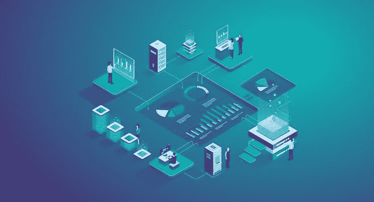
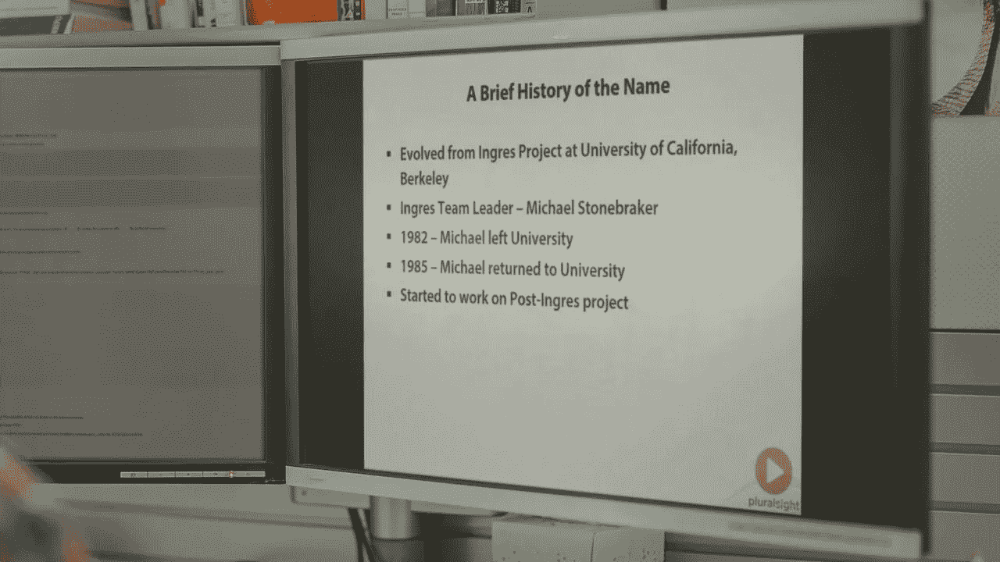
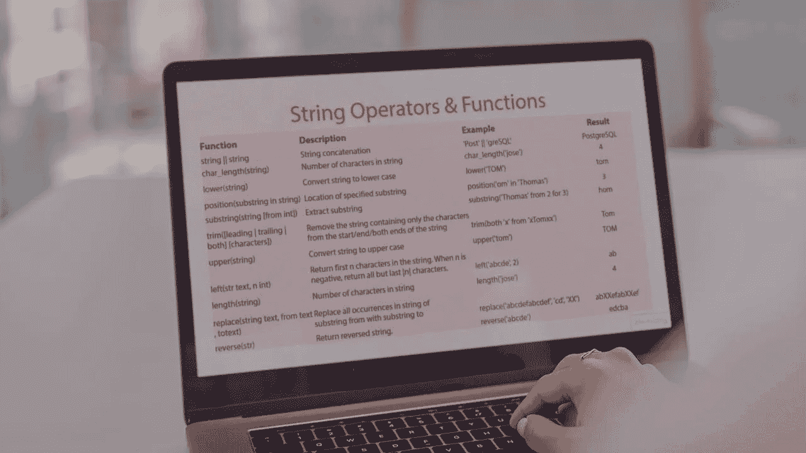

# 2023 年 7 门最好&免费的 PostgreSQL 初学者学习课程

> 原文：<https://medium.com/javarevisited/7-best-free-postgresql-courses-for-beginners-to-learn-in-2021-3bf369d73794?source=collection_archive---------0----------------------->

## 2023 年学习 PostgreSQL 的最佳在线课程列表。该列表还包含 2 门来自 freecodecamp 和 Udemy 的针对初学者的免费课程。

大家好，如果你想在 2023 年学习 PostgreSQL 数据库，并寻找最好的免费 Postgres 在线课程，那么你来对地方了。早些时候，我已经分享了学习 MySQL 和 [**微软 SQL Server**](/javarevisited/5-best-courses-to-learn-microsoft-sql-server-in-depth-e9f11b73c14a?source=---------40----------------------------) 的 [**最佳课程，今天，我将分享来自 Udemy、Pluralsight 和其他在线门户网站的*最佳和免费 PostgreSQL 课程*。**](/javarevisited/top-5-courses-to-learn-mysql-in-2020-4ffada70656f)

PostgreSQL 是继三巨头 [Oracle](https://javarevisited.blogspot.com/2019/01/top-6-free-database-and-sql-courses-to-learn-online.html#axzz6DQiA7ebw) 、 [SQL Server](https://www.java67.com/2018/02/5-free-oracle-and-microsoft-sql-server-online-courses.html) 和 [MySQL](/javarevisited/top-10-free-courses-to-learn-php-and-mysql-for-web-development-e96e69982675) 之后最受欢迎的数据库之一。 [PostgreSQL](https://www.postgresql.org/) 俗称 Postgres，通常被称为世界上最先进的开源数据库。

如果你想在 2023 年学习 PostgreSQL，并寻找一些有用的资源，如书籍、教程和课程，那么你来对地方了。在这篇文章中，我将为初学者分享一些最好的 PostgreSQL 在线课程。

这些课程将涵盖从安装到编写基本查询和从表中检索数据的主题。您还将探索 [SQL Joins](https://javarevisited.blogspot.com/2013/05/difference-between-left-and-right-outer-join-sql-mysql.html) 的逻辑，以及一些在现实世界、生产 PostgreSQL 数据库中工作时必不可少的最佳实践。

对于不知道 PostgreSQL 是什么，为什么要学习它的人，我来给大家做一些基本的介绍。PostgreSQL 是一个开源的对象关系数据库管理系统(ORDBMS)，于 1996 年由加州大学伯克利分校开发。它现在由 PostgreSQL 全球开发小组管理。

PostgreSQL 是用 [C 编程语言](https://javarevisited.blogspot.com/2019/11/top-5-courses-to-learn-c-programming-in.html)实现的，不像 [MySQL](https://javarevisited.blogspot.com/2018/05/top-5-mysql-courses-to-learn-online.html) 有多个存储引擎，它只有一个存储引擎。

> PostgreSQL 最好的一点是它符合 ANSI SQL 标准，但也增加了一些功能，这将帮助您编写更好的查询。

PostgreSQL 是世界上最先进的开源关系数据库。它在可靠性、数据完整性和健壮性方面享有盛誉。正因为如此，PostgreSQL 是世界上最流行和最广泛使用的数据库系统之一。使用 PostgreSQL 的公司包括苹果、思科、Spotify、富士通、Skype、网飞和 IMDb。

[PostgreSQL](https://javarevisited.blogspot.com/2020/02/top-5-courses-to-learn-postgresql-in.html) 还附带了许多功能，旨在帮助开发人员构建应用程序，帮助管理员保护数据完整性和构建容错环境，并帮助您管理无论大小的数据集。除了免费和开源之外，PostgreSQL 还具有高度的可扩展性，这使得它成为现代新开发人员的宠儿。

# **SQL 和 PostgreSQL 有什么区别？**

这是所有 IT 专业人士的普遍疑虑之一。有些人误解 SQL 和 PostgreSQL 是相同的，这是不正确的。

SQL 是一种语言。特别是“结构化查询语言”

PostgreSQL 是几个数据库系统之一，或 RDMS(关系数据库管理系统)。PostgresSQL 是几个 RDBMSs 中的一个，其他的还有 [Oracle](/javarevisited/top-10-free-courses-to-learn-microsoft-sql-server-and-oracle-database-in-2020-6708afcf4ad7) 、Informix、 [MySQL](https://www.java67.com/2018/02/5-free-php-and-mysql-courses-for-web-developers.html) 和 [MSQL](https://javarevisited.blogspot.com/2020/02/top-5-courses-to-learn-microsoft-sql-server-mssql.html) 。

所有这些 RDBMSs 都使用 SQL 作为它们的语言。他们中的每一个在他们使用的 SQL 的“方言”上有微小的变化，但是它仍然是 SQL。例如，SQL Server 具有 Oracle 中没有的 TOP 关键字。

同样，PostgreSQL 也有很多其他数据库没有的功能。早些时候，我已经分享了关于 [T-SQL vs Pl/SQL vs SQL](https://javarevisited.blogspot.com/2017/03/difference-between-sql-tsql-and-plsql.html) 的内容，这是相同的，不是 T-SQL，而是 PostgreSQL。

# 初学者学习 PostgreSQL 数据库的 7 门最佳免费课程

无论如何，不要再浪费你的时间了，这里是我从 Udemy，Pluralsight，Coursera 等门户网站上列出的 2023 年学习 PostgreSQL 的最佳在线课程

## 1.[完整的 Python 和 PostgreSQL 开发者课程](https://click.linksynergy.com/deeplink?id=JVFxdTr9V80&mid=39197&murl=https%3A%2F%2Fwww.udemy.com%2Fcourse%2Fthe-complete-python-postgresql-developer-course%2F)

这是一门收费课程，在这门课程中，您将在一节课中同时学习 Python 和 PostgreSQL。如果你的目标是通过构建真实世界的项目来学习 Python 和 PostgreSQL，那么这是最适合你的课程。

在本课程中，您将构建 9 个项目，并掌握 [Python](/better-programming/top-5-courses-to-learn-python-in-2018-best-of-lot-26644a99e7ec) 和 PostgreSQL 两项基本的现代技术。本课程也深入 Python，但会给你足够的知识来使用 PostgreSQL 数据库。由我在 Udemy 何塞·萨尔瓦蒂耶拉上最喜欢的一位导师创建，这门课程非常适合试图通过构建个人项目学习 Python 和 PostgreSQL 的新开发人员。

**这里是加入这个最好的 PostgreSQL 课程的链接** — [完整的 Python 和 PostgreSQL 开发者课程](https://click.linksynergy.com/deeplink?id=JVFxdTr9V80&mid=39197&murl=https%3A%2F%2Fwww.udemy.com%2Fcourse%2Fthe-complete-python-postgresql-developer-course%2F)

谈到社会证明，这门课程得到了近 3，513 名参与者的平均 4.5 分，超过 22，774 名学生已经信任这门课程。

## 2.[面向初学者的 SQL 和 PostgreSQL](https://click.linksynergy.com/deeplink?id=JVFxdTr9V80&mid=39197&murl=https%3A%2F%2Fwww.udemy.com%2Fcourse%2Fsql-and-postgresql-for-beginners%2F)

SQL 是各行各业最受欢迎的技术技能之一，学习 SQL 是促进职业发展的最佳方式之一，但仅仅学习 SQL 是不够的。

你还需要挑一个 PostgreSQL 之类的数据库，而这是[学习 SQL](https://hackernoon.com/top-5-sql-and-database-courses-to-learn-online-48424533ac61) & PostgreSQL 教程，用 PostgreSQL 和 PgAdmin 4 编写 SQL 查询的最好课程之一。

该课程结构良好，带你了解 SQL 概念的基础，对于完全的初学者来说是极好的。完成本课程后，您将有信心继续学习更高级的 [SQL 主题](https://javarevisited.blogspot.com/2017/02/top-6-sql-query-interview-questions-and-answers.html)。

如果你的目标是*2023 年学习 SQL 和 PostgreSQL，*这是最适合你的课程。谈到社会证明，这门课程得到了近 1，029 名参与者的平均 4.5 分，超过 6，076 名学生已经注册这门课程。

**这里是加入本 SQL 课程的链接** — [SQL 和 PostgreSQL 初学者](https://click.linksynergy.com/deeplink?id=JVFxdTr9V80&mid=39197&murl=https%3A%2F%2Fwww.udemy.com%2Fcourse%2Fsql-and-postgresql-for-beginners%2F)

## 3.[PostgreSQL:Pinal Dave 入门](https://pluralsight.pxf.io/c/1193463/424552/7490?u=https%3A%2F%2Fwww.pluralsight.com%2Fcourses%2Fpostgresql-getting-started)

这是初学者在 Pluralsight 上学习 PostgreSQL 最好的课程之一。由 SQL 专家和 Pluralsight 开发人员传道者之一 Pinal Dave 教授，这是从头开始学习 PostgreSQL 的一门极好的课程。在本课程中，您将首先学习 PostgreSQL 的基础知识，涵盖从安装到编写基本查询和从表中检索数据的主题。

之后，你还将探索加盟的逻辑和一些最佳实践。这是一个相对较短的课程，只有 1 小时 53 分钟的内容，但有助于快速学习 PostgreSQL。

**这里是加入这个初级课程** — [PostgreSQL:入门](https://pluralsight.pxf.io/c/1193463/424552/7490?u=https%3A%2F%2Fwww.pluralsight.com%2Fcourses%2Fpostgresql-getting-started)的链接

## 4.[初学者使用 PgAdmin 介绍 PostgreSQL 数据库](https://click.linksynergy.com/deeplink?id=JVFxdTr9V80&mid=39197&murl=https%3A%2F%2Fwww.udemy.com%2Fcourse%2Fintro-to-postgresql-databases-with-pgadmin%2F)

世界上有许多数据库，但 PostgreSQL 一直是从数据分析到基本 web 开发的顶级数据库，以及这两者之间的一切，如果你想从头开始学习 PostgreSQL 数据库，那么这是 2023 年学习 Postgresql 的最佳课程之一。

在本课程中，您将学习用于创建数据库和编写 [SQL 查询的 SQL 和 PostgreSQL](https://www.java67.com/2013/04/10-frequently-asked-sql-query-interview-questions-answers-database.html)使用 PostgreSQL 和 PgAdmin 4

谈到社交证明，本课程得到了近 127 名参与者的平均 4.5 分的评分，3328 名学生已经注册了本课程。

**以下是参加本课程**—[PgAdmin 介绍 PostgreSQL 数据库](https://click.linksynergy.com/deeplink?id=JVFxdTr9V80&mid=39197&murl=https%3A%2F%2Fwww.udemy.com%2Fcourse%2Fintro-to-postgresql-databases-with-pgadmin%2F)的链接

## 5.[Youtube 香奈儿免费代码营上的免费 PostgreSQL 课程](https://www.youtube.com/watch?v=qw--VYLpxG4)

FreeCodeCamp Youtube 频道有很多深入的课程，为程序员和开发者学习各种技术技能。因为他们是非营利组织，所以他们所有的课程都是免费的，大部分是由社区和不同领域的专家贡献的。

在这门完整的课程中，你将从头开始学习如何使用 PostgreSQL。PostgreSQL 是一个通用的对象关系数据库管理系统。它是最先进的开源数据库系统，广泛用于构建后端系统。你可以在 Youtube 上查看这个课程，它是完全免费的，如果你不介意从免费资源中学习，那么这是你的 PostgreSQL 之旅的一个很好的起点。

下面是 Youtube 上的 PostgreSQL 完整视频课程供您观看

## 6. [SQL 速成班:PostgreSQL 初学者](https://click.linksynergy.com/deeplink?id=JVFxdTr9V80&mid=39197&murl=https%3A%2F%2Fwww.udemy.com%2Fcourse%2Fsql-crash-course-postgresql-for-beginners%2F)(免费)

这是 2023 年又一个学习 PostgreSQL 的免费在线课程。由 Star Tech Academy 创建的这门 SQL 课程为初学者讲述了 SQL 数据库 ( PostgreSQL)的商业智能的重要主题

以下是您将在本课程中学到的重要内容

1.  了解所有基本的 SQL 命令
2.  了解如何编写 SQL 查询，如 SELECT、CREATE 和 ALTER
3.  深入了解 SQL

这是一个 1.5 小时的在线课程，在 Udemy 上是免费的，你需要的只是一个免费的 Udemy 帐户来参加这个课程。

这里是加入免费 PostgreSQL 课程的链接——[SQL 速成班:PostgreSQL 初学者](https://click.linksynergy.com/deeplink?id=JVFxdTr9V80&mid=39197&murl=https%3A%2F%2Fwww.udemy.com%2Fcourse%2Fsql-crash-course-postgresql-for-beginners%2F)

## 6.[PostgreSQL:Pinal Dave 的高级 SQL 查询](https://pluralsight.pxf.io/c/1193463/424552/7490?u=https%3A%2F%2Fwww.pluralsight.com%2Fcourses%2Fpostgresql-advanced-sql-queries)

这是另一个学习 PostgreSQL 的好课程。这就像前面课程的第二部分，你应该在完成最后一个课程后加入这个。在本课程中，您将探索 PostgreSQL 的高级查询，还将了解函数和运算符、类型转换和事务，正是这些使 PostgreSQL 成为如此强大的开源数据库。

**这是 PostgreSQL 课程** — [PostgreSQL:高级 SQL 查询](https://pluralsight.pxf.io/c/1193463/424552/7490?u=https%3A%2F%2Fwww.pluralsight.com%2Fcourses%2Fpostgresql-advanced-sql-queries)的链接

以上就是 2023 年学习 PostgreSQL 数据库的一些**最佳在线课程**。如我所说，PostgreSQL 非常流行，到处都在使用。如果您正在为您的新项目探索 RDBS，PostgreSQL 可能是一个不错的选择。

这些课程对于从头开始学习 PostgreSQL 很有帮助，但对于学习像 **PgAdmin** 这样的工具以及学习一些使用 PostgreSQL 的[高级 SQL 查询](https://javarevisited.blogspot.com/2017/02/top-6-sql-query-interview-questions-and-answers.html)也很有用。如果你发现任何其他优秀的 PostgreSQL 课程应该在这个列表中，那么请随意提出建议。

其他**有用的编程资源**你可能喜欢:
[学习 SQL 和数据库基础知识的 5 大课程](https://javarevisited.blogspot.com/2018/05/top-5-sql-and-database-courses-to-learn-online.html)
[2023 年 Java 开发者路线图](https://javarevisited.blogspot.com/2019/10/the-java-developer-roadmap.html#123)
[5 大免费课程学习微软 SQL Server 和 Oracle 数据库](https://www.java67.com/2018/02/5-free-oracle-and-microsoft-sql-server-online-courses.html)
[学习 MySQL 数据库的 5 大课程](https://javarevisited.blogspot.com/2018/05/top-5-mysql-courses-to-learn-online.html)
[2023 年前端和后端开发者路线图](https://javarevisited.blogspot.com/2019/02/the-2019-web-developer-roadmap.html)

面向程序员的高级 SQL 书籍
[面向程序员和 DBA 的 5 门免费 T-SQL 和 SQL Server 课程](https://javarevisited.blogspot.com/2018/12/top-5-free-microsoft-sql-server-and-transact-sql-online-courses.html)
[每个程序员都应该学会的 10 件事](https://javarevisited.blogspot.com/2019/01/10-things-every-programmer-and-software-engineer-should-know.html)
[学习 SQL 和数据库的 7 门免费课程](/javarevisited/7-free-courses-to-learn-database-and-sql-for-programmers-and-data-scientist-e7ae19514ed2)
[2023 年学习 Python 3 的前 5 门课程](https://javarevisited.blogspot.com/2018/03/top-5-courses-to-learn-python-in-2018.html)
[2023 年 Java 开发人员应该学会的 11 件事](/javarevisited/9-things-java-programmers-should-learn-in-2018-3f0b2207dfc4)

感谢阅读本文 如果你喜欢这些 *PostgreSQL 在线课程*，那么请分享给你的朋友和同事。如果您有任何问题或反馈，请留言。

</hackernoon/top-5-sql-and-database-courses-to-learn-online-48424533ac61> 