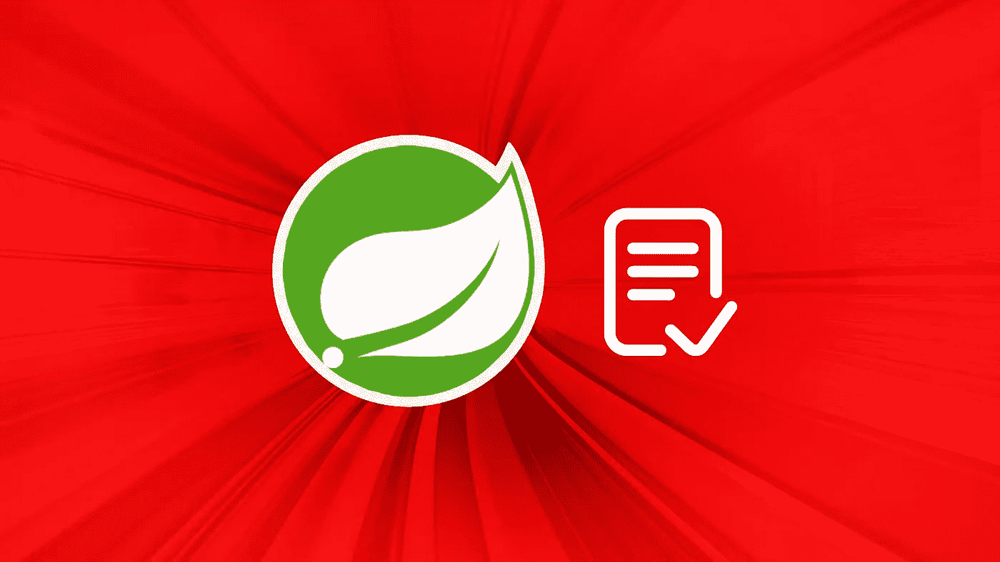
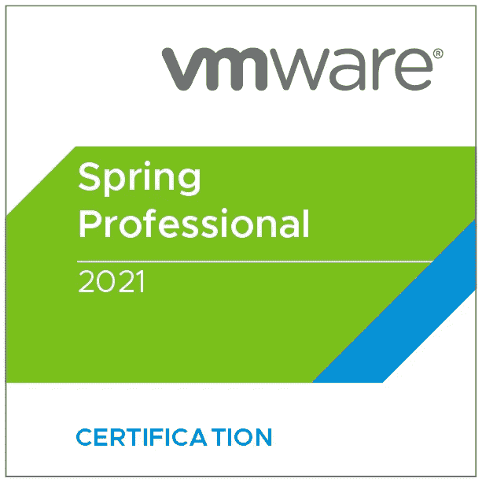
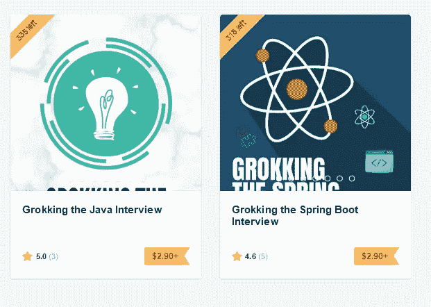

# 2023 年面向 Java 程序员的 8 门最佳免费 Spring 专业认证课程和实践测试

> 原文：<https://medium.com/javarevisited/7-best-free-spring-professional-certification-courses-practice-tests-for-java-programmers-317f56c486ea?source=collection_archive---------0----------------------->

## 这些是为 Java 程序员准备 2023 年春季专业认证的最好的在线课程和练习测试。

你好 Java 程序员，如果你正在准备 2023 年的 Spring Professional 认证，并且正在寻找最好的 Spring 认证课程和练习测试，那么你来对地方了。

早些时候，我已经分享了[最佳 Spring 框架课程](/javarevisited/10-best-online-courses-to-learn-spring-framework-in-2020-f7f73599c2fd)和[书籍](/javarevisited/10-best-spring-framework-books-for-java-developers-360284c37036)，在本文中，我将分享最佳在线课程、实践测试、考试模拟器和模拟测试，为 Vmware Java 开发人员的这一声望很高的 IT 认证做准备。

许多 Java 开发人员不知道，类似于甲骨文的 [Java 认证](https://javarevisited.blogspot.com/2018/08/latest-OCPJP-exam-java-8-certification-oracle-java-se-8.html)，Spring 认证项目认证你的 Spring 框架技能。之前，该认证由 Pivotal 提供，但现在在收购后，Vmware 组织并认证 IT 专业人员的 Spring 框架技能。

Spring Professional 认证考试，也称为 Vmware Certified Spring Professional 考试(VMware EDU-1202)，认证你关于 [Spring 框架](/javarevisited/top-10-free-courses-to-learn-spring-framework-for-java-developers-639db9348d25)、 [Spring MVC 技能](/javarevisited/my-favorite-spring-mvc-courses-for-java-developers-5ede7f85dd88)、 [Spring Boot](/javarevisited/top-10-courses-to-learn-spring-boot-in-2020-best-of-lot-6ffce88a1b6e?source=---------39------------------) 、 [Spring 数据 JPA](https://www.java67.com/2021/01/spring-data-jpa-interview-questions-answers-java.html) 、用 Spring 和 Spring Boot 进行测试以及其他高级 Spring 技能的知识。

许多 Java 开发人员对 spring 认证不了解或不感兴趣的原因之一是 Spring 认证的[高昂成本。此前，它专门面向注册 Pivotal now Vmware 昂贵的在线春季课程的开发人员。

这些培训的费用非常昂贵，如果你自掏腰包，在美国、北美或欧洲参加培训大约需要 3200 美元，在印度参加培训大约需要 50，000 印度卢比。

如果你将此与 Java 认证相比较，后者的费用约为 **246 美元**，这是非常昂贵的。由于 Spring 认证(VMware EDU-1202)的高昂成本，许多使用 Spring 认证的 Java 开发人员并不热衷于获得认证，但情况已经发生了变化。

但是现在，](http://javarevisited.blogspot.sg/2017/06/what-is-cost-of-spring-framework-certification-training-India-USA.html#axzz4pbqSY8Ua)[为了获得 Spring 认证，不强制进行 Spring 培训](http://www.java67.com/2017/06/is-it-possible-to-take-spring-certification-without-training.html)。您可以直接从 Vmware 网站购买考试优惠券，价格约为 **200 美元**，并出现在考试中。

如果通过，您将成为 VMware certified Spring Professional，并将获得一个如下所示的徽章，添加到您的简历中:

以下是春季认证考试的一些重要信息。

*   *名称—VMware Certified Spring Professional 认证*
*   *持续时间— 90 分钟，或 1.5 小时*
*   *类型—监考、多项选择*
*   *问题数量——50 个问题*
*   *考试费——200 美元*
*   *资格/先决条件—无*
*   *及格分数— 76%*
*   *考试代码——edu-1202*

你可以看到[春季认证考试](https://javarevisited.blogspot.com/2018/08/how-to-crack-spring-core-professional-certification-exam-java-latest.html)是基于计算机的，考试总共有 50 个问题，你将有 90 分钟的时间来回答它们。

及格分数是 **76%，**也就是说你需要答对 50 道题中的 38 道，这从很多专业认证来看是相当高的。

但是好的一面是你不需要写代码，这意味着时间足够解决这些问题。他们主要测试你的核心概念。如果你练习得很好，并解决了一些练习题，如我在 UdemyT3 上的春季认证课程中给出的问题，那么你将在真正的考试中处于良好的状态。

<https://www.udemy.com/course/spring-professional-practice-test-questions-vmware-edu-certification/?referralCode=7419B0A2C8AB79F0520E>  

# 面向 Java 开发人员的 8 门最佳 Spring 认证课程和实践测试

用自学的方式准备春季认证，你需要一个好的学习指南和好的考试模拟器。在过去的几篇文章中，我已经分享了一些[春季认证](http://www.java67.com/2017/07/top-5-spring-certification-study-guides-exam-core-web-integeration.html)的最佳学习指南，今天我将分享一些最佳的春季模拟考试，它们可以在互联网上免费获得以供练习。在购买全长度春季考试模拟器之前，您可以使用这些测试来检查您的知识和问题的质量。

以下是我收集的一些最好的 Spring Core Professional 在线课程、认证转储和在线练习测试。这既包括免费提供的付费测试和练习题，也包括一些付费课程和来自 Udemy 和其他值得购买的网站的练习课程。

## 1.[春季职业认证考试教程](https://click.linksynergy.com/deeplink?id=CuIbQrBnhiw&mid=39197&murl=https%3A%2F%2Fwww.udemy.com%2Fcourse%2Fspring-certified-tutorial%2F)【课程】

这是准备春季专业认证的最佳课程资料。它解释并回答了 Spring Professional 认证学习指南中的所有问题，这些问题对于认证和 Java 面试都很有用。

每个答案都详细解释了视频教程，描述和一个很好的例子，让你对讨论的主题有深入的理解。通过本课程，您将获得通过春季专业认证考试(VMware EDU-1202)所需的所有知识和技能。

整个课程分为 8 个模块，每个模块都有单独的课程:
模块 01 —容器、依赖、IoC
模块 02 —面向方面编程
模块 03 —数据管理:JDBC、事务、JPA、Spring 数据
模块 04 — [Spring Boot](/hackernoon/top-5-spring-boot-and-spring-cloud-books-for-java-developers-75df155dcedc?source=---------23------------------)
模块 05 — [Spring MVC 和 Web 层](/javarevisited/21-spring-mvc-rest-interview-questions-answers-for-beginners-and-experienced-developers-21ad3d4c9b82)
模块 06 —安全
模块 07 — REST
模块 08 —测试在里面，你可以找到 Spring Professional Certification Study Guide 第一部分所有主题的答案，第一部分是容器、依赖和 IoC。

**这里是加入本次春季认证课程** — [春季专业认证考试教程—模块 01](https://click.linksynergy.com/deeplink?id=CuIbQrBnhiw&mid=39197&murl=https%3A%2F%2Fwww.udemy.com%2Fcourse%2Fspring-certified-tutorial%2F) 的链接

如果你真的想通过 Spring 专业认证，我也建议你参加其他 Spring 课程模块，比如 Spring 专业认证[第二部分](https://click.linksynergy.com/deeplink?id=CuIbQrBnhiw&mid=39197&murl=https%3A%2F%2Fwww.udemy.com%2Fcourse%2Fspring-professional-certification-exam-tutorial-module-02%2F)，3、4、5。

<https://click.linksynergy.com/deeplink?id=CuIbQrBnhiw&mid=39197&murl=https%3A%2F%2Fwww.udemy.com%2Fcourse%2Fspring-professional-certification-exam-tutorial-module-02%2F>  

现在，我们来看一些 2023 年春季认证的免费模拟测试。

# 2023 年 Java 程序员的 8 个最佳春季认证练习题、模拟测试和考试转储

在不浪费你更多时间的情况下，这里有最好的在线考试模拟器、练习题、模拟测试和春季认证考试转储，可以更好地为 2023 年及以后的春季专业认证做准备。

这包括来自 Udemy、Whizlabs、认证问题和其他流行的在线门户网站的资源。

## 1.[大卫·梅耶尔的春季 5.0 模拟题](https://www.certification-questions.com/practice-exam/spring/professional?affiliateCode=fcff36fd-557a-4713-abf6-973e9924770f&utm_source=Javin&utm_medium=affiliate&utm_campaign=affiliate)【299 题】

这是网上最好的春季模拟考试之一。它包含 299 个问题，您可以在线参加基于时间的测试或下载 PDF 进行离线阅读。

它包含 Spring professional 考试转储，即 Spring professional 考试中的实际问题，由过去参加过 Spring 认证的考生提供。它会让你很好地了解在真正的考试中你能预料到的问题的难度。

春季认证的自由练习测试并不多。那些少数可用的也没有足够的问题来练习；因此，如果你对 Spring 认证很认真，我建议你购买这个考试的完整版本，它包含了 299 个 Spring 认证的高质量问题。

**下面是获得这个测试的链接**——[大卫·梅尔的春季 5.0 模拟试题](https://www.certification-questions.com/practice-exam/spring/professional?affiliateCode=fcff36fd-557a-4713-abf6-973e9924770f&utm_source=Javin&utm_medium=affiliate&utm_campaign=affiliate)

他们还有一个[免费测试，包含 10 个问题](https://www.certification-questions.com/practice-exam/spring/professional?affiliateCode=fcff36fd-557a-4713-abf6-973e9924770f&utm_source=Javin&utm_medium=affiliate&utm_campaign=affiliate)，来自他们的春季认证转储；你也可以试着在承诺之前先了解一下问题。

## 2.我在 Udemy [ [250 题](https://www.udemy.com/course/spring-professional-practice-test-questions-vmware-edu-certification/?referralCode=7419B0A2C8AB79F0520E) ]上的春季认证模拟考试

你们很多人已经知道我在 Udemy 上有 Java 和 Spring 认证实践测试，里面包含了 250 个高质量的问题，用来评估你对 Spring 认证的准备水平。

我已经涵盖了官方考试指南中提到的所有考试主题，以完成评估。这些 *250 个问题*分为 5 个*全长测试*和对所涉及的各种基本弹簧框架概念的适当解释。

我建议你在真实的考试场景中进行那些模拟测试，以便很好地了解你的准备水平。您还可以使用这些练习题来测试通过这项久负盛名的 Spring professional 认证所需的速度和准确性。

**这里是加入本次考试的链接—** [我的春季专业实践考试](https://www.udemy.com/course/spring-professional-practice-test-questions-vmware-edu-certification/?referralCode=7419B0A2C8AB79F0520E)

## 3. [VMware 认证 Spring 专业认证](http://shrsl.com/32acy)【whiz labs】

这是另一个高质量的 Spring 认证模拟测试，您可以参加该测试来评估自己的准备水平，并提高通过这一享有盛誉的 VmWare Spring Professional 认证所需的速度和准确性。

Whizlabs 以高质量的练习题和考试模拟器而闻名，我过去也曾亲自使用 Whizlabs 通过了几个 [Java 认证](/javarevisited/my-favorite-books-and-courses-to-pass-java-se-8-certification-ocajp-8-and-ocpjp-8-b657a195aa07)，这次考试也不例外。

这个在线模拟测试包含 4 个完整长度的模拟考试，有超过 **200 个独特的**VMware Certified Spring Professional 考试问题及其答案和详细解释。

您将终身获得他们的模拟测试，并获得 Spring 专家的支持，以解决您的任何疑问。

**以下是参加本次春季测试的链接**—[VMware Certified Spring Professional 认证](http://shrsl.com/32acy)

他们还有一个免费的春季认证测试，有 20 个问题供练习；如果你正在寻找一个免费的春季专业考试，你可以用它来熟悉考试题目和难度。

顺便说一句，如果你正在准备认证，可以考虑参加 [**Whizlabs 订阅**](https://shareasale.com/r.cfm?b=1551042&u=880419&m=43514&urllink=&afftrack=) ，它提供了对 AWS、Java、Cloud、Docker 和 Kubernetes 等不同认证的所有在线培训课程和实践测试的完全访问权限，每年仅需 99 美元(现在有 50%的折扣)。

## 4.Java 与电影 Spring 4.2 认证题( [50 题](http://javaetmoi.com/wp-content/uploads/2016/01/spring-certification-4_2-mock-exam-antoine.pdf))

这是目前最好的免费 Spring 认证测试之一。他们分享了 50 道 Spring Core 4.2 专业考试的样题。模拟考试包含所有主要主题的练习题；以下是每个主题的问题数量:

1.  容器(13)
2.  测试(5)
3.  AOP (10)
4.  数据访问(5)
5.  交易(5)
6.  春季 MVC (3)
7.  春天的安全(3)
8.  远程处理(2)
9.  联合医务处(2)
10.  JMX (2)

您还可以在 PDF 文档的末尾找到所有问题的答案。如果你正在考虑准备这个话题，那么，没有单一的课程或书籍。你需要从几个来源获得帮助，比如**[**【Spring Framework 5:初学者到大师**](https://click.linksynergy.com/fs-bin/click?id=JVFxdTr9V80&subid=0&offerid=323058.1&type=10&tmpid=14538&RD_PARM1=https%3A%2F%2Fwww.udemy.com%2Fspring-framework-5-beginner-to-guru%2F) 涵盖了这个主题的大部分内容。另外，这是 Spring 5 认证的最新主题列表**

****

**要深入准备 REST 和 Spring Security，建议你去查一下同道博主 Eugen Paraschive 的 [**学 Spring Security:认证类**](https://courses.baeldung.com/p/learn-spring-security-the-certification-class?utm_source=javarevisited&utm_medium=web&utm_campaign=lss&affcode=22136_bkwjs9xa) 和 [**REST 用 Spring 认证类**](http://courses.baeldung.com/p/rest-with-spring-the-certification-class?affcode=22136_bkwjs9xa) 课程；两者都很优秀，不仅仅是证书，而是专业工作所需的全部经验和知识。**

**<http://courses.baeldung.com/p/rest-with-spring-the-certification-class?affcode=22136_bkwjs9xa> ** 

## **5.Vojtech Ruzicka 的 Spring 4.2 问题集( [200 个问题](https://github.com/vojtechruz/spring-web-cert-notes-4.2/raw/master/Spring%20Web%20Certification.apkg))【免费】**

**Vojtech Ruzicka 为 Spring core 和 Spring web 考试分享了一些有用的提示、笔记和练习题。如果你正在准备 Pivotal 认证的 Spring Professional，那么他的练习题是得心应手的。他还用 Anki 软件制作了一套抽认卡。问题基本来源于他的春季核心学习笔记。Anki 提供桌面客户端和移动应用程序，以便在旅途中学习。

一旦你下载了他的一套考题，你就可以方便的在桌面或者手机上使用。该资料包含近 200 个问题，您可以使用 File → Import 在 Anki 中导入该资料。**

## **6.Java 和 Moies Spring 3.0 认证题( [50 题](http://javaetmoi.com/wp-content/uploads/2012/02/spring-certification-3-mock-exam-antoine.pdf))**

**这是准备春季专业认证的最好的免费资源之一。包含模拟题准备核心 Spring 3.x 认证:免费 50 道选择题/ 88 分钟/及格分数= 76 % (38 题答对成功)。**

**虽然这不是最新的，比如它没有涵盖 Spring 5 版本，但它仍然足以检查您的基本 Spring 框架知识。**

**你可以从这个链接下载这些 Spring 问题的 PDF。即使这些问题对于 Spring 3.0 认证来说仍然是有用的，你可以通过它来检查你对 Spring 核心框架的知识和理解。**

## **7. [50 道免费 Spring 认证练习题](https://javarevisited.blogspot.com/2022/05/50-free-spring-professional-certification-questions.html?m=1)**

**我还在 Udemy 上分享了我春季认证课程中的 50 多个免费问题。你不仅可以用这些问题来检查你的知识，还可以学习有用的概念，如果你喜欢这些问题，你还可以在 Udemy 上购买全长测试**

**<https://javarevisited.blogspot.com/2022/05/50-free-spring-professional-certification-questions.html?m=1> ** 

## **7.[春季职业认证实务考试模块 01 -08](https://click.linksynergy.com/deeplink?id=CuIbQrBnhiw&mid=39197&murl=https%3A%2F%2Fwww.udemy.com%2Fcourse%2Fspring-professional-certification-practice-tests-module-04%2F)**

**这是 2023 年春季专业认证备考最全面的一套题之一。由广受欢迎的春季认证预备课程的作者多米尼克·塞布拉创建，这些是针对主题的春季认证考试。**

**共有 8 门*实践测试课程，*每门课程涵盖官方 Spring 认证指南中的一个模块，并有基于这些模块的 300 个问题来彻底检查您的知识。**

**请注意，这些不是正式的考试问题或考试总结；然而，它们是精心设计的，以确保从特定模块中获取所有必需的知识。**

**如果您正在寻找一套全面的 spring 认证问题，您可以加入本课程。**

****以下是参加本课程** — [春季专业认证实践测试模块 01 -08](https://click.linksynergy.com/deeplink?id=CuIbQrBnhiw&mid=39197&murl=https%3A%2F%2Fwww.udemy.com%2Fcourse%2Fspring-professional-certification-practice-tests-module-04%2F) 的链接**

****

**以上是网上免费提供的一些**最佳春季认证实践测试(VMware EDU-1202)、**。如果你是一个准备 Spring 认证的 Java 程序员，我已经分享了一些最有用的资源来帮助你准备这个博客。**

**该列表包括 Spring core 和 Spring Web 认证的 Spring 认证笔记、Spring 模拟考试、免费的 Spring 认证转储、[Spring 认证书籍](http://www.java67.com/2017/07/3-spring-certification-books-best-of.html)和官方 Spring 认证指南。你可以在你的空闲时间检查它们。**

**如果你喜欢书，你也会很高兴地知道，我写了一本关于 Spring Boot 面试的书，名为 [**走遍 Spring Boot 面试**](https://gum.co/hrUXKY) ，在那里我试图回答来自官方 Spring 认证指南的大多数 Spring 和 Spring Boot 相关的问题。**

****

**如果你正在准备春季认证，那么你也可以使用该书进行快速复习。如果有兴趣，可以在 Gumroad 上预购这本书。**

**您可能喜欢的其他 **Java 和 Spring 认证文章**:**

*   **[Spring 初学者认证资源](/javarevisited/top-5-spring-professional-certification-exam-resources-for-java-developers-3ef9fa42fe13)**
*   **[如何利用自学准备春季认证](http://javarevisited.blogspot.sg/2017/06/how-to-prepare-for-spring-framework-certifications.html#axzz4pbqSY8Ua)**
*   **[如何破解 Spring 5 专业认证考试](https://javarevisited.blogspot.com/2018/08/how-to-crack-spring-core-professional-certification-exam-java-latest.html)**
*   **[如何购买代金券和安排春季认证](https://javarevisited.blogspot.com/2018/01/how-to-purchase-spring-certification-voucher-online.html)**
*   **[面向程序员的 5 大免费 Java 11 实践测试](https://javarevisited.blogspot.com/2019/07/top-4-java-11-certification-free-mock-exams-practice-tests-ocajp11-ocpjp11-1z0-815-16-questions.html)**
*   **[如何破解 2023 年 AWS 解决方案架构师考试](https://javarevisited.blogspot.com/2019/08/how-to-crack-aws-certified-solution-architect-exam.html)**
*   **[如何破解甲骨文 2023 年 Java 认证](https://medium.freecodecamp.org/how-to-pass-oracles-java-certifications-a-practical-guide-for-developers-e9b607ba6173)**
*   **Spring 认证对工作和职业生涯有帮助吗？**
*   **[2023 年 Java 开发者路线图](https://javarevisited.blogspot.com/2019/10/the-java-developer-roadmap.html)**
*   **[学习数据结构和算法的 10 门免费课程](http://www.java67.com/2019/02/top-10-free-algorithms-and-data.html)**
*   **[通过 AWS 解决方案架构师助理考试的 5 次免费模拟测试](https://javarevisited.blogspot.com/2019/08/top-5-free-aws-solution-architect-Associate-certification-dumps-practice-questions.html)**
*   **[每个软件开发人员都应该学习的 10 件事](https://dev.to/javinpaul/10-things-every-software-developer-should-know-39pe)**
*   **[2023 年破解 PMP 认证的 5 大课程](https://javarevisited.blogspot.com/2019/09/top-5-courses-to-crack-pmp-project-management-professional-certification-exam.html)**
*   **[程序员学习 Git 的五大免费课程](https://javarevisited.blogspot.com/2018/01/5-free-git-courses-for-programmers-to-learn-online.html)**
*   **[OCAJP 和 OCPJP 考试 10 道免费样题](http://www.java67.com/2017/05/10-free-java-8-certification-sample-questions-OCAJP8-OCPJP8-Mock-Exams.html)**

****p . s .**——如果你是一名使用 Spring 框架 3 到 5 年的经验丰富的 Java 开发人员，并希望获得技能认证，我建议你去参加 [**大卫·梅尔的在线 Spring 模拟测试**](https://www.certification-questions.com/practice-exam/spring/professional?affiliateCode=fcff36fd-557a-4713-abf6-973e9924770f&utm_source=Javin&utm_medium=affiliate&utm_campaign=affiliate)**；这是一个在线测试。如果你能考到 80%以上，那么你就准备好真正的考试了。****

**<https://www.certification-questions.com/practice-exam/spring/professional?affiliateCode=fcff36fd-557a-4713-abf6-973e9924770f&utm_source=Javin&utm_medium=affiliate&utm_campaign=affiliate> **