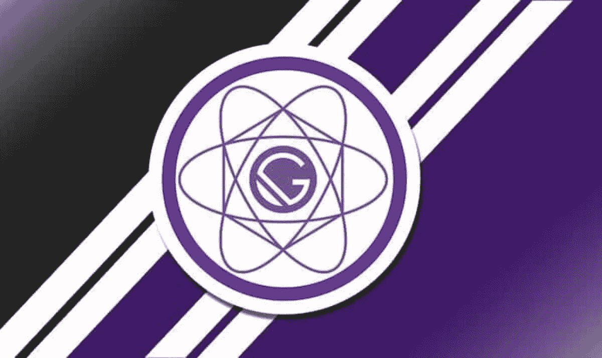
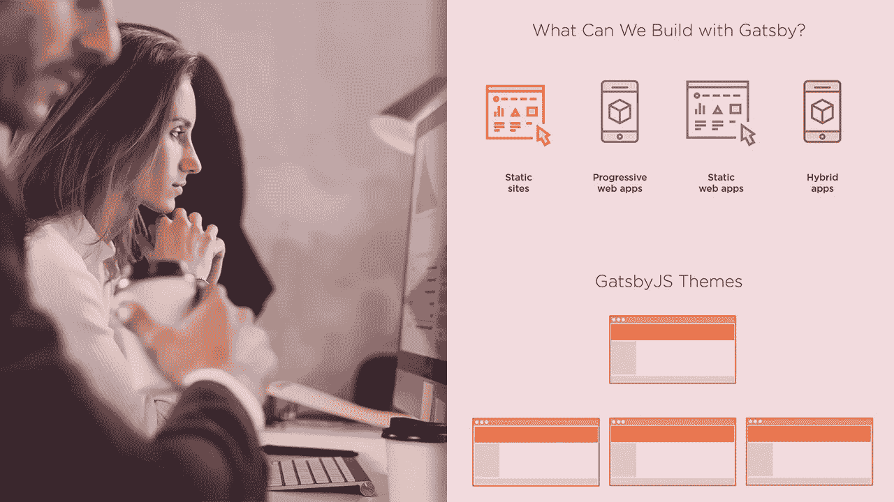
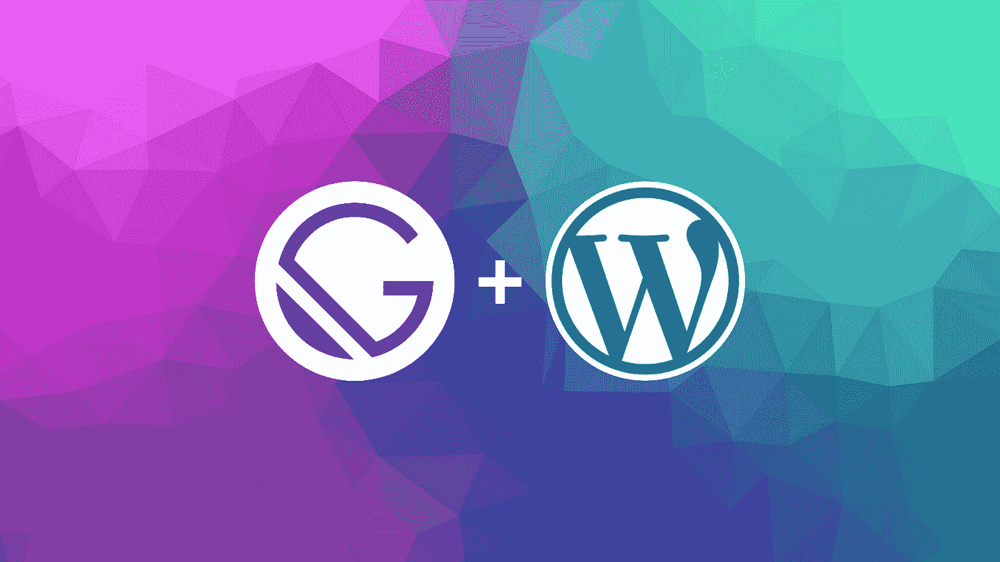
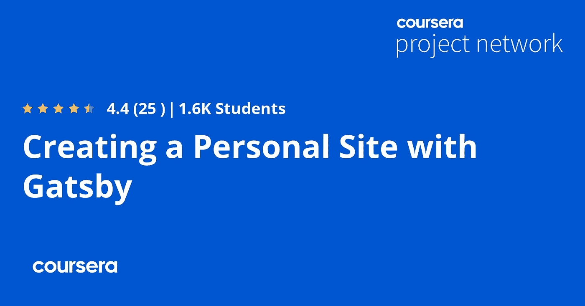

# 2023 年初学者学习的 7 门最佳 Gatsby.js 在线课程

> 原文：<https://medium.com/javarevisited/7-best-gatsby-online-courses-for-beginners-14269efa140c?source=collection_archive---------1----------------------->

## 我最喜欢从 Udemy，Pluralsight，Coursera 和 FreeCodecamp 学习盖茨比的在线课程。这个列表包含了初学者最好的和免费的课程

《盖茨比》大师级的 Udemy

大家好，如果你想在 2023 年学习盖茨比，并寻找学习盖茨比的最佳在线课程，那么你来对地方了。在过去，我已经分享了 [**最佳 React 课程**](https://javarevisited.blogspot.com/2018/08/top-5-react-js-and-redux-courses-to-learn-online.html#axzz5r06B3egD) ，今天，我将分享初学者的最佳 Gatsby 课程，这是一个使用 React 创建静态网站的可怕框架。

如果你不知道，Gatsby 是一个 [JavaScript 框架](/javarevisited/10-javascript-frameworks-and-libraries-to-learn-in-2020-best-of-lot-5f61f86c60b4)，用于创建高速网站和网络应用。它由 React 和 GraphQL 提供支持，它为您提供了构建和启动下一个项目所需的一切，甚至是一个[渐进式 web 应用程序](/javarevisited/6-best-progressive-web-application-development-pwa-courses-for-beginners-860e67bee024)或通常称为 PWA。

gatsby.js 在最近几年变得非常流行，并且随着 React.js 的流行而增加，react . js 是前端开发框架事实上的领导者。

换句话说，Gatsby.js 是一个基于 react 的静态站点生成器，由 GraphQL 提供支持。通常，它通过结合 React.js、react-router、Webpack、 [GraphQL](https://javarevisited.blogspot.com/2019/05/top-5-courses-to-learn-graphql-in-2019.html) 和其他有用的前端工具的最佳部分来提供令人愉快的开发体验。

了解盖茨比会增加你作为 [React 开发者](/javarevisited/the-2019-react-js-developer-roadmap-9a8e290b8a56)的价值。在本文中，我们将列出能帮助您学习 gatsby.js 的前五门课程。

顺便说一句，对 React.js 的良好了解对有效地使用 Gatsby 大有帮助，如果你不熟悉 React.js，那么我强烈建议你首先参加一个全面的 React 课程，如 Udemy 上 Stephen Grider 的[**Modern React with Redux【2023 update】**](https://click.linksynergy.com/deeplink?id=JVFxdTr9V80&mid=39197&murl=https%3A%2F%2Fwww.udemy.com%2Fcourse%2Freact-redux%2F)。

这是一门深入学习 React 的极好课程，我强烈推荐给任何想学习 Reactjs 的人，它涵盖了所有基本的 React 概念，如 Redux、React 路由器、Webpack 和 React Hooks。

<https://click.linksynergy.com/deeplink?id=JVFxdTr9V80&mid=39197&murl=https%3A%2F%2Fwww.udemy.com%2Fcourse%2Freact-redux%2F>  

# 2023 年学习盖茨比的 7 门最佳在线课程

这里列出了从零开始学习盖茨比的*最佳在线课程*。这些课程是由专家创建的，受到了全球成千上万开发人员的信任。它们由像 [Udemy](/javarevisited/15-best-udemy-courses-programmers-can-buy-on-black-friday-and-cyber-monday-2020-a803874f41d9) 、 [Coursera](/javarevisited/18-coursera-courses-you-can-join-in-2020-to-learn-from-the-worlds-top-tech-companies-google-74af46967d1e?source=collection_home---4------0-----------------------) 和 [Pluralsight](/javarevisited/top-10-pluralsight-courses-to-learn-programming-and-software-development-during-covid-19-stay-at-30b7d8a4f88f) 这样的网站提供，你也可以加入它们来深入了解盖茨比。

## 1.[盖茨比 V3 教程及项目课程](https://click.linksynergy.com/deeplink?id=JVFxdTr9V80&mid=39197&murl=https%3A%2F%2Fwww.udemy.com%2Fcourse%2Fgatsby-tutorial-and-projects-course%2F)【Udemy 最佳课程】

如果你想详细了解盖茨比，那么 udemy 的“*盖茨比教程与项目课程”*是个完美的选择。由约翰·斯米加创建，是 Udemy 上最畅销也是最受欢迎的盖茨比课程。这门课程可以分为两部分。

在第一部分中，有几个版块是导师讲解盖茨比的一切，以及如何用 [React.js](https://javarevisited.blogspot.com/2020/08/top-10-pluralsight-courses-to-learn-React.js.html) 来创建网站。

第二部分完全致力于使用在第一部分中学到的知识创建一个项目。教师深入钻研这两个部分，并不着急地解释一切。
要求

*   对 react 的基本了解

这是一门初级课程，是为那些想详细了解盖茨比的人开设的。这个课程非常庞大，因为整个视频内容超过 37 个小时。所以选择这门课程，如果你准备好给它适当的时间。

**这是加入这个了不起的盖茨比课程**——[盖茨比 V3 教程和项目课程](https://click.linksynergy.com/deeplink?id=JVFxdTr9V80&mid=39197&murl=https%3A%2F%2Fwww.udemy.com%2Fcourse%2Fgatsby-tutorial-and-projects-course%2F)的链接

## 2.[盖茨比 JS 和 Firebase:混合盖茨比实时+静态站点](https://click.linksynergy.com/deeplink?id=JVFxdTr9V80&mid=39197&murl=https%3A%2F%2Fwww.udemy.com%2Fcourse%2Fgatsby-js-firebase-hybrid-realtime-static-sites%2F)

这是 udemy 又一个畅销的盖茨比课程。在本课程中，您将学习 gatsby 以及如何设置 gatsby 以实现页面。该课程还解释了如何通过 gatsby 将 [firebase](/javarevisited/5-best-firebase-and-firestore-courses-for-frontend-developers-88052b0d3e74) 用于服务器端。

要求

*   对 React 的理解
*   理解 git 和终端命令
*   对 NPM 的了解

课程恰当地描述了使用盖茨比的好处。它是一个中级水平，总视频内容接近六个小时。本课程中涉及的其他重要概念包括与 gatsby 的 React 挂钩、云函数、存储、Auth 和 GraphQL。

**这里是加入本课程** — [盖茨比 JS 和 Firebase](https://click.linksynergy.com/deeplink?id=JVFxdTr9V80&mid=39197&murl=https%3A%2F%2Fwww.udemy.com%2Fcourse%2Fgatsby-js-firebase-hybrid-realtime-static-sites%2F) 的链接

## 3.[盖茨比 JS:入门](https://pluralsight.pxf.io/c/1193463/424552/7490?u=https%3A%2F%2Fwww.pluralsight.com%2Fcourses%2Fgatsbyjs-getting-started)【plural sight 最佳课程】

这是 Pluralsight 学习盖茨比最好的课程之一。本课程涵盖了盖茨比用来创建现代静态网站的核心概念。

讲师从 gatsby 和 JAMstack 的基础开始，然后逐步使用 gatsby 和 react。最后，讲师描述了 [GraphQL 与 gatsby](/javarevisited/top-5-graphql-tutorials-and-courses-for-beginners-fb5543506fc2) 的使用。所以总的来说，这门课涵盖了《盖茨比》的所有基本核心概念。

这里是您将在本课程中学到的关键技能

1.  如何用盖茨比创建静态网站
2.  如何创建可重用的 React 组件
3.  使用盖茨比的插件
4.  使用 GraphQL 查询数据

是一个简短的初级课程，总视频内容超过两个小时。因此，如果你对 React.js 有所了解，并希望通过 React 和 GraphQL 掌握 gatsby 的基础知识，那么这门课程非常适合你。

**这里是加入本课程的链接**——[盖茨比:入门](https://pluralsight.pxf.io/c/1193463/424552/7490?u=https%3A%2F%2Fwww.pluralsight.com%2Fcourses%2Fgatsbyjs-getting-started)

顺便说一下，你需要一个[**Pluralsight 会员**](https://pluralsight.pxf.io/c/1193463/424552/7490?u=https%3A%2F%2Fwww.pluralsight.com%2Flearn) 才能加入这个课程，费用大约是每月 29 美元或每年 299 美元(14%的折扣)。我向所有程序员强烈推荐这个订阅，因为它提供了超过 7000 个在线课程的即时访问，以学习任何技术技能。或者，你也可以使用他们的 [**10 天免费通行证**](https://pluralsight.pxf.io/c/1193463/424552/7490?u=https%3A%2F%2Fwww.pluralsight.com%2Flearn) 来免费观看这个课程。

<https://pluralsight.pxf.io/c/1193463/424552/7490?u=https%3A%2F%2Fwww.pluralsight.com%2Flearn>  

此外，作为他们四月免费项目[的一部分，所有 Pluralsight 课程本月都是免费的，这是一个用 Pluralsight 学习新知识的好机会，比如 Gatsby。](https://pluralsight.pxf.io/c/1193463/424552/7490?u=https%3A%2F%2Fwww.pluralsight.com%2Flearn)

## 4. [Gatsby JS:用 React WordPress & GraphQL](https://click.linksynergy.com/deeplink?id=JVFxdTr9V80&mid=39197&murl=https%3A%2F%2Fwww.udemy.com%2Fcourse%2Fgatsby-js-react-wordpress-graphql%2F) 构建静态站点

如果你想学习如何以 WordPress 为后端使用 Gatsby 创建网站，那么 Udemy 的“Gatsby JS:用 React WordPress 和 GraphQL 构建静态网站”在线课程是最好的选择。

在这门实践性的最新 Gatsby 课程中，讲师解释了如何在前端使用 react 和 GraphQL，在后端使用 [WordPress](https://javarevisited.blogspot.com/2020/08/top-5-courses-to-learn-wordpress-in.html) 。

这是一个初级课程，视频总内容为四个小时。如果你没有任何创建网站的经验，这个课程最适合你。你将学习如何使用 WordPress、GraphQL 和 Gatsby 创建网站。

要求

*   对 react 的基本了解

如果你知道一点 React，并且想用 Gatsby 建立网站，那么这是你的最佳选择，你只需花 10 美元就可以在 Udemy 上购买，这种事情时有发生。

这里是加入盖茨比课程的链接——[盖茨比 JS:用 React WordPress & GraphQL](https://click.linksynergy.com/deeplink?id=JVFxdTr9V80&mid=39197&murl=https%3A%2F%2Fwww.udemy.com%2Fcourse%2Fgatsby-js-react-wordpress-graphql%2F)

## 5.[学习 Gatsby.js](http://linkedin-learning.pxf.io/c/1193463/449670/8005?u=https%3A%2F%2Fwww.linkedin.com%2Flearning%2Flearning-gatsby-14442452) 【领英学习】

这是另一个在 LinkedIn Learning 上学习 Gatsby.js 的动手课程。这就像一个速成班，你将学到一个非常简短的课程，解释如何使用 Gatsby 创建快速网站。

要求

*   对 react 的基本了解

如果你想学习如何在不涉及太多细节的情况下用 Gatsby 建立快速网站，那么选择这门课程。

如上所述，课程非常短，视频内容不到一个小时。这是一门初级课程，但从这里开始是很好的，因为你将学习基础知识并构建一些很酷的东西。

**以下是加入本课程** — [学习 Gatsby.js](http://linkedin-learning.pxf.io/c/1193463/449670/8005?u=https%3A%2F%2Fwww.linkedin.com%2Flearning%2Flearning-gatsby-14442452) 的链接

顺便说一句，你需要一个 LinkedIn Learning 会员资格才能观看这个课程，这个课程每月花费大约 19.99 美元，但是你也可以通过参加他们的 1 个月免费试用课程来免费观看这个课程，这是一个探索他们 17500 多门最新技术在线课程的好方法。

  

## 6.了不起的盖茨比训练营——完整的 Gatsby.js 教程[免费]

这是一个在 FreeCodeCamp 的 YouTube 频道上学习盖茨比的完全免费的教程课程。与其他免费课程不同的是。长达 5 小时的盖茨比课程是最新的，全面的，引人入胜的，为什么不呢，它是由我最喜欢的 Udemy 导师之一、[最佳节点的作者](https://click.linksynergy.com/deeplink?id=JVFxdTr9V80&mid=39197&murl=https%3A%2F%2Fwww.udemy.com%2Fcourse%2Fthe-complete-nodejs-developer-course-2%2F) [**安德鲁·米德**](https://click.linksynergy.com/deeplink?id=JVFxdTr9V80&mid=39197&murl=https%3A%2F%2Fwww.udemy.com%2Fuser%2Fandrewmead%2F) 创建的。Udemy 上的 JS 课程。

Gatsby 是一个创建高速网站和网络应用程序的框架。由 React 和 GraphQL 提供支持，Gatsby 为您提供了构建和启动下一个项目所需的一切。

在本教程中，您将学习用 Gatsby 构建和发布您的第一个网站所需的一切。您将从头开始构建一个网站，并学习如何将其部署到生产中。

你可以在 YouTube 或者这里观看免费的盖茨比课程

## 7.与盖茨比一起创建个人网站

这是 Coursera 的另一个很棒的基于项目的课程。如果你知道，Courser 已经开始了一个指导项目，在这个项目中，你将与讲师一起以一步一步的指导方式建立一些东西，在这个 2 小时长的基于项目的课程中，你将学习如何与 Gatsby 一起创建一个个人网站。

以下是你一路走来将学到的关键技能:
1。了解 Gatsby 项目的项目结构
2。了解如何在我们的网站
3 上创建和设计页面布局模板。了解如何在 Netlify

上发布我们的网站这个指导性项目是为任何具有 HTML、CSS 和中级 JavaScript 基础知识的人准备的。如果你想在 Github 上免费发布你的网站，你也应该有一个 Github 账户。

**这里是加入这个项目的链接**——[与盖茨比一起创建个人网站](https://coursera.pxf.io/c/3294490/1164545/14726?u=https%3A%2F%2Fwww.coursera.org%2Fprojects%2Fcreating-personal-site-gatsby)

顺便说一下，如果你计划参加多个 Coursera 课程或专业，那么考虑参加 [**Coursera Plus 订阅**](https://coursera.pxf.io/c/3294490/1164545/14726?u=https%3A%2F%2Fwww.coursera.org%2Fcourseraplus) ，它将为你提供无限制的访问他们最受欢迎的课程、专业、专业证书和指导项目的机会。

<https://coursera.pxf.io/c/3294490/1164545/14726?u=https%3A%2F%2Fwww.coursera.org%2Fcourseraplus>  

以上就是 2023 年学习盖茨比的**最好的免费在线课程。React 很受欢迎，为了增加你作为 react 开发人员的价值，你应该尝试学习 Gatsby。如果你对 *React.js* 有了适当的了解，那么理解《盖茨比》就不会太难了。在本文中，我们列出了能帮助你学习《盖茨比》的前五门课程。**

这些课程也有额外的概念，如 [GraphQL](/javarevisited/top-5-graphql-tutorials-and-courses-for-beginners-fb5543506fc2?source=---------75------------------) 、 [Firebase](https://javarevisited.blogspot.com/2020/03/top-5-courses-to-learn-firebase-in-2020.html) 和 [WordPress](/javarevisited/5-best-wordpress-courses-for-beginners-and-experienced-website-developers-b45f7976ee40) 。这些课程选自顶级教育网站 Udemy 和 Pluralsight。所以仔细阅读列表，然后做出相应的选择。

其他 **Web 开发** **文章和教程**你可能喜欢

*   [2023 年学习 React Native 的 5 门课程](http://javarevisited.blogspot.sg/2018/02/5-react-native-courses-to-learn-mobile-development-using-JavaScript.html)
*   [我最喜欢的学习 Web 开发的课程](/better-programming/my-5-favorite-courses-to-learn-web-development-in-2019-a5e74167f8b2)
*   [盖茨比官方初学者教程](https://www.gatsbyjs.com/docs/tutorial/)
*   [面向 Java 开发者的 5 门免费 Spring 框架课程](http://www.java67.com/2017/11/top-5-free-core-spring-mvc-courses-learn-online.html)
*   [2023 年学习 Python 的 5 大课程](http://www.java67.com/2018/02/5-free-python-online-courses-for-beginners.html)
*   [2023 年 React JS 开发者路线图](https://javarevisited.blogspot.com/2018/10/the-2018-react-developer-roadmap.html)
*   [10 JavaScript 框架 Fullstack 开发者应该知道的](http://www.java67.com/2019/01/top-10-javascript-frameworks-and-libraries-for-web-developers.html)
*   [学习 Web 开发 Python 的十大课程](/javarevisited/top-10-courses-to-learn-python-for-web-development-in-2020-best-of-lot-efe11fb6d212)
*   [面向 Web 开发人员的十大 JavaScript 教程和课程](https://javarevisited.blogspot.com/2018/06/top-10-courses-to-learn-javascript-in.html)
*   [2023 年学习 Spring Boot 的 5 大课程](https://javarevisited.blogspot.com/2018/05/top-5-courses-to-learn-spring-boot-in.html)
*   [初学 3 门最佳 Svelete.js 课程](https://javarevisited.blogspot.com/2020/05/top-3-courses-to-learn-sveltejs-in-2020.html)
*   [2023 年网络开发者路线图](https://javarevisited.blogspot.com/2019/02/the-2019-web-developer-roadmap.html)
*   [10 个免费的初学者角度课程](/javarevisited/top-10-free-courses-to-learn-angular-framework-in-2020-bb62148c73d3)
*   [2023 年学习 Web 开发的五大课程](https://javarevisited.blogspot.com/2018/02/top-5-online-courses-to-learn-web-development.html)
*   [学习大数据和 Apache Spark 的 5 门课程](http://javarevisited.blogspot.com/2017/12/top-5-courses-to-learn-big-data-and.html)
*   [12 门面向网络开发者的免费 JavaScript 课程](/javarevisited/12-free-courses-to-learn-javascript-and-es6-for-beginners-and-experienced-developers-aa35874c9a32)
*   [深入学习 JavaScript 的 10 门最佳课程](/javarevisited/10-best-online-courses-to-learn-javascript-in-2020-af5ed0801645)
*   [初学者学习 TypeScript 的 7 门最佳课程](/javarevisited/7-best-courses-to-learn-typescript-in-depth-58439e1ce729)

感谢您阅读本文。如果你喜欢这些*最佳盖茨比在线课程*，那么请与你的朋友和同事分享。如果您有任何问题或反馈，请留言。

如果你知道一个了不起的盖茨比资源不在这个列表中，但应该在这里，那么请留言，我会把它包括在这个列表中。

**P. S. —** 对 React.js 的充分了解对有效地使用 Gatsby 大有帮助，如果你还不熟悉 React.js，那么我强烈建议你先在 Udemy 上完成一个全面的 React 课程[**React—Maximilian Schwarz muller 的完全指南**](https://click.linksynergy.com/deeplink?id=JVFxdTr9V80&mid=39197&murl=https%3A%2F%2Fwww.udemy.com%2Fcourse%2Freact-the-complete-guide-incl-redux%2F) 。这是一门深入学习 React 的优秀课程，我强烈推荐给任何想学习 Reactjs 的人。

<https://click.linksynergy.com/deeplink?id=JVFxdTr9V80&mid=39197&murl=https%3A%2F%2Fwww.udemy.com%2Fcourse%2Freact-the-complete-guide-incl-redux%2F> 