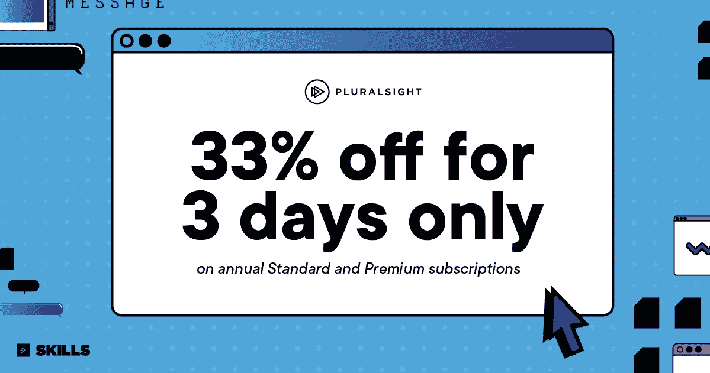
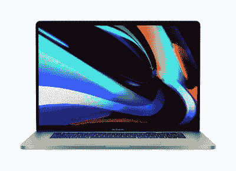
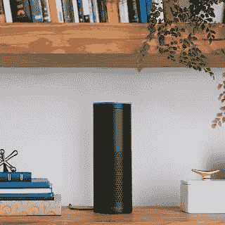

# 2023 年程序员的 7 个最佳圣诞和新年礼物创意

> 原文：<https://medium.com/javarevisited/7-best-gift-ideas-for-programmers-and-technology-geeks-bb799cc05da1?source=collection_archive---------0----------------------->

## 想给你的程序员朋友或同事送上最好的礼物吗？以下是给软件开发人员和技术极客的 7 份最好的礼物

照片由[抢笑](https://unsplash.com/@roblaughter?utm_source=medium&utm_medium=referral)上 [Unsplash](https://unsplash.com?utm_source=medium&utm_medium=referral)

所以，又到了一年中你开始考虑给你的程序员男友、丈夫、同事或你最亲近的人买礼物的时候了。即使挑选礼物并不困难，如果你的朋友碰巧是一名程序员，那就有点难了。

你可能听说过程序员是冷漠、书呆子和技术狂，好吧，你没听错。程序员更喜欢一个人呆在自己的世界里，但他们也喜欢礼物，你说对了；他们是书呆子，所以他们喜欢书籍、小玩意、音乐和有助于他们学习的东西，比如 [Udemy](https://click.linksynergy.com/fs-bin/click?id=JVFxdTr9V80&offerid=323058.9409&type=3&subid=0) 、[教育性](https://www.educative.io/collection/5668639101419520/5649050225344512?affiliate_id=5073518643380224)或 [PluralSight](http://pluralsight.pxf.io/c/1193463/424552/7490?u=https%3A%2F%2Fwww.pluralsight.com%2Flearn) 会员。

2021 年，像 Apple Watch、 [**新款 15 寸 Mac Book Pro**](https://www.amazon.com/Apple-MacBook-16-inch-16GB-Storage/dp/B081FV1Y57?tag=javamysqlanta-20) 和三星 Gears 这样的小玩意正在风靡，但这正是每个人都在购买的东西，所以如果你想与众不同，就从这个列表中选择一款吧。

# 2023 年给软件工程师和开发人员的 7 个最佳圣诞和新年礼物创意

下面是我挑选的 5 件礼物，你可以在这个假期和新年里给你的程序员男友或同事买。它们是你可以送给你的程序员朋友的一些有价值的礼物，它们令人兴奋，提供价值，并且它们也符合你的预算。

## 1 [赠送 Udemy 课程](https://click.linksynergy.com/fs-bin/click?id=JVFxdTr9V80&subid=0&offerid=323058.1&type=10&tmpid=14494&RD_PARM1=https%253A%252F%252Fwww.udemy.com%252F)

程序员都爱在线课程，包括我，Udemy 是最大的在线课程集合。它有超过 125，000 门在线课程，可以学习任何东西，从流行的编程语言如 [Java](/javarevisited/10-best-udemy-online-courses-for-java-developers-4c9ab70cd01f) 和 [Python](/javarevisited/10-best-python-3-courses-on-udemy-ddd4e3ec5dbf) 到先进的技术，如大数据、自动化、云计算、人工智能、机器学习、机器人等。

Udemy 允许你发送课程或礼品卡给你的程序员朋友，你只需要在购买课程时输入他的邮箱。

老婆送给我的 [**机器学习 A-Z:数据科学**](http://bit.ly/2BYyDkV) 动手 Python & R，我简直爱不释手。如果你的丈夫对数据科学、机器学习或人工智能感兴趣，那么你也可以把这些作为礼物。

如果你知道你老公或者男朋友喜欢什么，那么你可以选择 Udemy 的一些优秀课程；不然我就直接给他们买了礼品卡。这也是你可以给程序员朋友买的最实惠的礼物之一，因为大多数 Udemy 课程在销售时不到 10 美元就可以买到。

他们还提供他们所选课程的个人计划，你也可以考虑给他们，这可能会花费更多，但他/她会喜欢它。

## 2. [Pluralsight 订阅(33%折扣)](http://pluralsight.pxf.io/c/1193463/424552/7490?u=https%3A%2F%2Fwww.pluralsight.com%2Flearn)

尽管我有点偏见，因为我是 Pluralsight 用户，我仍然认为 Pluralsight 订阅是任何程序员或软件开发人员的最佳礼物之一，因为它太有价值了。现在 Pluralsight 上有这么多课程，每个开发者都应该订阅。

有点贵，一年的订阅费大约 299 美元，但是很珍贵，你的程序员朋友每次用他的订阅学东西都会感激你。

这也是一个假期，所以他们可能会提供传统的 33%折扣，你可以查看他们的网站，如果有的话，你也可以利用这一点。

## 3.[新款 16 英寸 MacBook Pro](https://www.amazon.com/Apple-MacBook-16-inch-16GB-Storage/dp/B081FV1Y57?tag=javamysqlanta-20)

程序员喜欢小工具，当谈到小工具时，没有什么能打败苹果。如果你是一名程序员，朋友没有 MacBook Pro，那么把它送给他们是一个完美的主意。

苹果公司宣布了一款新的 16 英寸 MacBook Pro，许多人称之为终极开发者机器，我也认为这是今年最好的程序员礼物。

除了苹果修复键盘问题，以下是 [***新款 16 英寸 MacBook Pro***](https://www.amazon.com/Apple-MacBook-16-inch-16GB-Storage/dp/B081FV1Y57?tag=javamysqlanta-20) 的一些主要亮点，看起来像一台令人敬畏的开发者机器:

*   16 英寸视网膜显示屏
*   最高可配 8 核处理器
*   高达 8TB 的固态硬盘存储
*   高达 64GB 的内存
*   长达 11 小时的电池续航时间
*   专用退出键
*   专用箭头按钮
*   AMD 镭龙 Pro 5000M 系列显卡
*   六扬声器音响系统和录音室品质的话筒

当然，这很贵，但如果他是你爱的人或非常亲近的人，那么这绝对是值得的，无论你送谁礼物，他都不会忘记你很久。事实上，这是给程序员的终极礼物，如果你想送给我的话，它也在愿望清单上:-)

## 4.[亚马逊回声](https://www.amazon.com/dp/B07XKF75B8?tag=javamysqlanta-20)

对于一个有家室的程序员来说，这是最完美的礼物。起初，我对这个设备持怀疑态度，但我家里的每个人都喜欢它。可以设置定时器、播放音乐、列购物清单，非常方便。

最重要的是，它还有一个 API，可以扩展来构建自定义应用程序，以保持您的程序员朋友的兴趣。简而言之，送给程序员家庭朋友的完美礼物。

还有亚马逊 Echo 的新版本也要来了，亚马逊 Echo Plus，如果发货时间适合你的需要，还可以预购。

## 5. [Kolibri 相机无人机 Delta-Recon FPV App 四轴飞行器无人机](https://www.amazon.com/Kolibri-Delta-Recon-Quadcopter-Altitude-Beginners/dp/B01M32TXTW/?tag=javamysqlanta-20)

这是今年最受程序员和科技极客欢迎的礼物之一，我预计这一趋势在未来几年也将继续。

Kolibri 相机无人机 Delta-Recon FPV 应用程序四轴飞行器无人机具有自动起飞和降落高度，支持无头模式 VR 功能的 iPhone 和 Android 初学者无人机，顾名思义，它就是如此强大和神奇。它可以自动起飞，还可以虚拟现实，你也可以用手机控制它。简而言之，你的程序员朋友会喜欢它的。这不仅是给程序员，也是给他们的家人或任何技术极客的绝佳礼物。

## 6.[华硕 ROG PG348Q 34 寸超宽 QHD Swift 曲面游戏显示器](https://www.amazon.com/Asus-PG348Q-34-Inch-Ultra-wide-Monitor/dp/B01C83BE6U/?tag=javamysqlanta-20)

我使用华硕全高清 1080p 144Hz 1ms DP HDMI DVI 眼部护理游戏 LED 照明 27 英寸显示器已经有一段时间了。事实上，我曾经有两台显示器连接到我的电脑上，但我开始认为曲面超宽显示器可能是程序员的终极显示器选择。

我还没有为自己挑选一台超宽显示器，但我刚刚订购了一台华硕曲面 34 英寸超宽 QHD 游戏显示器。事实上，这是送给程序员、游戏爱好者和技术爱好者的最好礼物。

## 7.[带 WiFi 的 CanaKit Raspberry Pi 2 终极入门套件](https://www.amazon.com/exec/obidos/ASIN/B00G1PNG54/?tag=javamysqlanta-20)

Raspberry Pi 是你能买到的最好的小型电脑，这个套件只要 99 美元。虽然它只有信用卡大小，但它可以插入电视和键盘，并通过编程制作电子表格、游戏等。

该套件包括 Raspberry Pi 2 (RPi2)型号 B 四核 900 MHz 1 GB RAM、8 GB Micro SD、CanaKit WiFi 适配器和快速入门指南。Raspberry Pi 基金会的使命是教孩子们如何编程，但他们在娱乐成年人和经验丰富的开发人员方面也做得很好。

# 学习在线课程礼物的想法

如果你需要更多的 Git 想法，这里有几个

1.  [Gift educative . io membership](https://www.educative.io/subscription?affiliate_id=5073518643380224)——如果你的朋友正在找新工作或准备编码面试，那么这将是给他的最好礼物

<https://www.educative.io/subscription?affiliate_id=5073518643380224>  

2.ZTM 会员礼品——这是另一个很棒的在线门户网站，如果你想给他们一份学习礼物，赠送会员也是一个好主意。它有很多关于编码面试、Python 和 JavaScript 的很棒的课程。

你也可以使用优惠券代码 **FRIENDS10 在这门课程或你选择的任何订阅上获得 10%的折扣**。

<https://academy.zerotomastery.io/a/aff_c0gnlvf7/external?affcode=441520_zytgk2dn>  

以上就是你能为你的程序员朋友买的一些最好的礼物。我知道礼物不仅仅是钱。事实上，花钱很容易，但找到合适的礼物要困难得多。

但送出一份完美礼物的喜悦，既有价值又令人惊叹，值得所有这些为程序员寻找理想礼物的烦恼。顺便说一句，如果你在寻找选择，你也可以看看我去年的 [**礼物创意清单**](http://javarevisited.blogspot.sg/2015/12/3-gifts-for-your-java-programmer.html) 。

**p . s .**——如果你不能选择礼物或者没有足够的时间来选择，赠送[教育性](https://www.educative.io/collection/5668639101419520/5649050225344512?affiliate_id=5073518643380224)或 [Pluralsight](http://pluralsight.pxf.io/c/1193463/424552/7490?u=https%3A%2F%2Fwww.pluralsight.com%2Flearn) 会员资格永远不会介意，因为每个程序员都热爱学习。他们还提供了 50%的优惠<https://www.educative.io/collection/5668639101419520/5649050225344512?affiliate_id=5073518643380224>****(教育性的)和 33%的优惠<http://pluralsight.pxf.io/c/1193463/424552/7490?u=https%3A%2F%2Fwww.pluralsight.com%2Flearn>**(多见)。******

******<https://www.educative.io/collection/5668639101419520/5649050225344512?affiliate_id=5073518643380224> ******