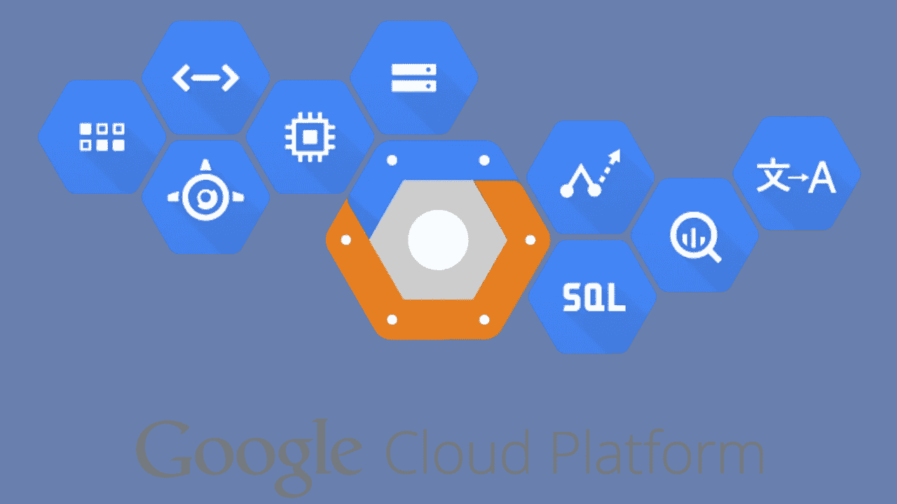
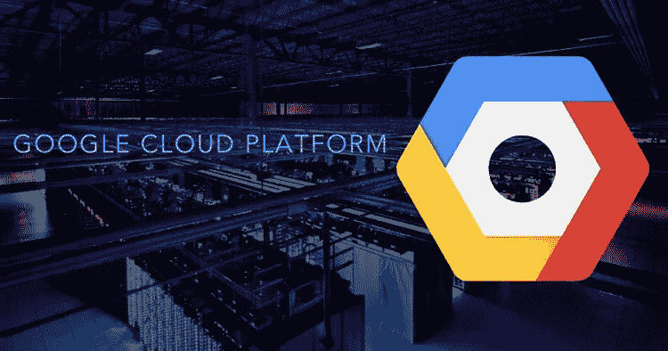
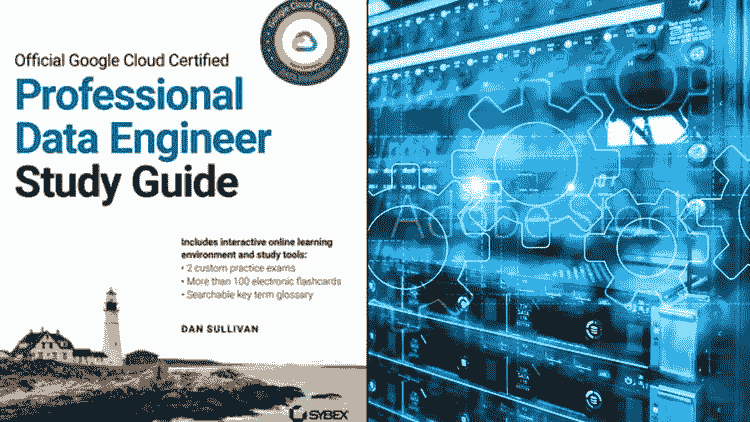
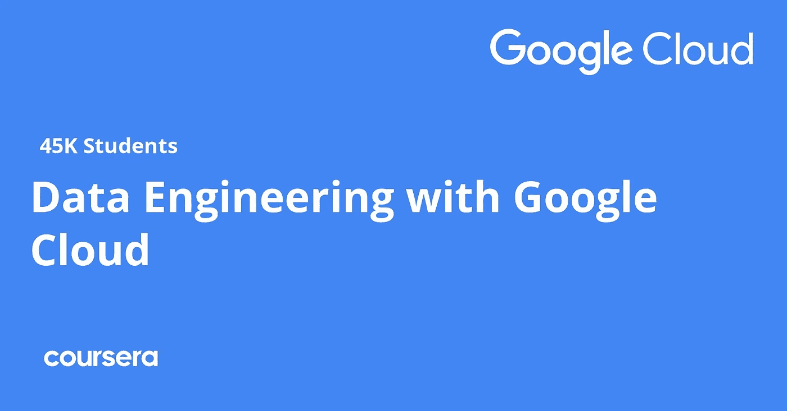
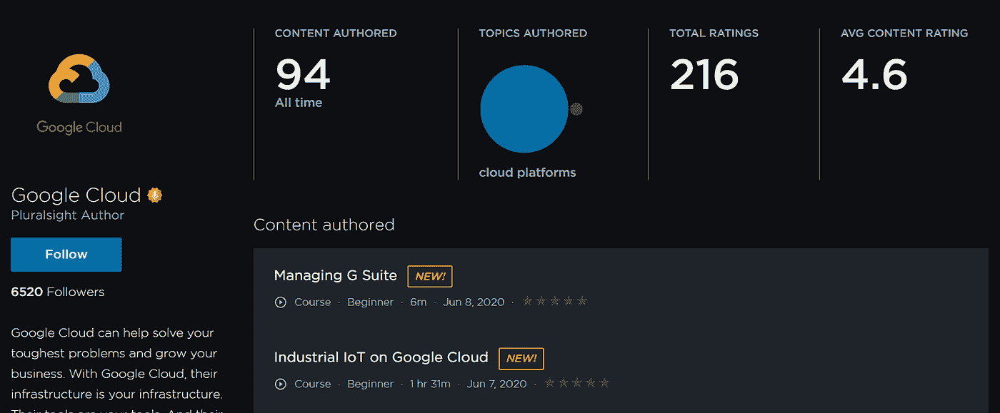
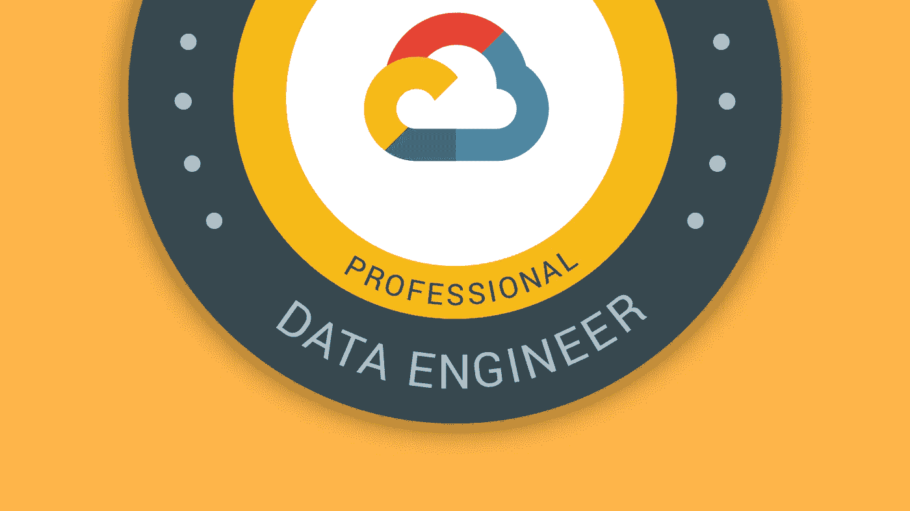
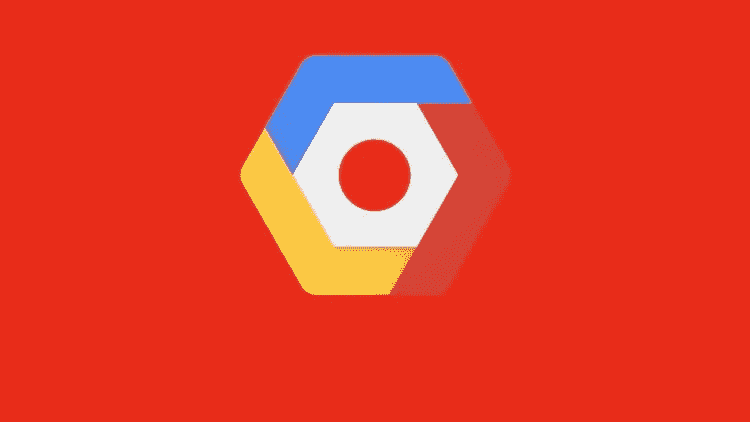

# 2023 年 7 门最佳谷歌云专业数据工程师认证考试课程

> 原文：<https://medium.com/javarevisited/7-best-google-cloud-professional-data-engineer-certification-exam-courses-in-2021-dd15631a6ebd?source=collection_archive---------0----------------------->

## 这些是 2023 年 Udemy、Pluralsight、Coursera 和 Whizlabs 为初学者提供的最佳谷歌云数据工程师认证课程。

大家好，如果你想在 2023 年成为谷歌云认证的专业数据工程师，并寻找最好的在线资源，那么你来对地方了。之前我已经分享了 [**最佳谷歌云平台课程**](/javarevisited/5-best-courses-to-learn-google-cloud-platform-gcp-in-2021-169093a3771a) 今天我要分享的是 2023 年谷歌云数据工程师认证最佳在线课程。

**谷歌云专业数据工程师**目前很受欢迎，因为他们有能力维持积累、转换和发布数据的过程，并具备一定的专业水平。

众所周知，他们有能力将机器学习模型投入运行，创建和构建数据处理系统以准确工作，并确保数据的安全性和可扩展性。

在谷歌云的[数据科学](/javarevisited/my-favorite-data-science-and-machine-learning-courses-from-coursera-udemy-and-pluralsight-eafc73acc73f)团队中，这是一个非常重要的角色，因为**专业数据工程师**的技能使数据管理过程更加高效。它允许数据团队的其他成员更轻松地完成他们的任务。

从事谷歌云数据工程的人大多是那些对自己的[编程技能有信心并希望对数据和数据技术进行深入研究的人。如果你对](/javarevisited/top-10-pluralsight-courses-to-learn-programming-and-software-development-during-covid-19-stay-at-30b7d8a4f88f)[编程](/javarevisited/top-10-free-interactive-programming-courses-from-educative-for-beginners-to-learn-in-2021-713cbf96d4eb)和操纵数据技术感兴趣，那么建议你去看看数据工程。

至于成为**谷歌云数据工程师**的额外奖励，你有可能获得超过 11.7 万美元的平均年薪。费率可能会有所不同，这取决于你在数据工程方面拥有多少经验，因为数据工程最好是通过大量实践来学习。

 [## 准备谷歌云认证:云数据工程师

### 我们帮助数以百万计的组织提高员工的能力，服务他们的客户，并为他们的…

coursera.pxf.io](https://coursera.pxf.io/c/3294490/1164545/14726?u=https%3A%2F%2Fwww.coursera.org%2Fprofessional-certificates%2Fgcp-data-engineering) 

# 2023 年加入的 7 门最佳谷歌云专业数据工程师课程

为了成为一名谷歌云数据工程师，你必须首先通过考试，这将证明他们是一名数据工程师。这项考试由谷歌在线进行，测试用户的数据工程知识。

取得该证书没有必要的先决条件，但建议您在参加考试之前对数据工程有一个透彻的了解和一些实践。网上有很多课程可以帮助你。

*以下是 2023 年谷歌云数据工程师认证 7 大推荐课程:*

## 1. [GCP:完整的谷歌数据工程师和云架构师指南](https://click.linksynergy.com/deeplink?id=JVFxdTr9V80&mid=39197&murl=https%3A%2F%2Fwww.udemy.com%2Fcourse%2Fgcp-data-engineer-and-cloud-architect%2F)

这是 2023 年成为谷歌数据工程师最好的 Udemy 课程。它的课程由两位讲师教授，他们在成功完成谷歌云的数据工程师认证考试后，作为云数据工程师在谷歌工作了 7 年。

本课程的全部视频内容长达 28 小时，以一种非常吸引人和实用的方式教授，并提供可下载的材料以获取更多信息和练习。它们以一种参与者将发现容易理解并在认证考试中应用的方式分解复杂的主题。

课程只能通过[我的](/javarevisited/my-favorite-udemy-online-courses-for-programmers-and-software-engineers-f9d941dd0035?source=---------14----------------------------)进入。Udemy 是一个在线学习平台，对他们的每门课程都使用一次性付款，如果你对自己选择的课程不满意，他们还会在 30 天内退款。

**这里是加入这个谷歌云课程的链接**——[完整的谷歌数据工程师指南](https://click.linksynergy.com/deeplink?id=JVFxdTr9V80&mid=39197&murl=https%3A%2F%2Fwww.udemy.com%2Fcourse%2Fgcp-data-engineer-and-cloud-architect%2F)

他们在价格上也给了很好的折扣，这使得他们的课程非常实惠。Udemy 也有一个区域，你可以在那里问老师关于课程的问题。他们一般会在 24 小时或更短时间内回答这些问题。

## 2.[谷歌云专业数据工程师:获得认证 2023](https://click.linksynergy.com/deeplink?id=JVFxdTr9V80&mid=39197&murl=https%3A%2F%2Fwww.udemy.com%2Fcourse%2Fgoogle-cloud-professional-data-engineer-get-certified%2F)

这是又一门通过谷歌云专业数据工程师考试的牛逼 Udemy 课程。你不仅要准备考试，还要学习构建可扩展的、可靠的数据管道、数据库和机器学习应用程序。

*本课程由官方 Google Cloud 专业数据工程师考试指南的作者和在数据库、数据架构和机器学习领域拥有 20 多年经验的数据架构师设计和开发。*

本课程**将讲座、测验和动手实践环节**相结合，以确保您了解如何获取数据、在云数据流中创建数据处理管道、部署关系数据库、设计高性能 Bigtable、BigQuery 和 Cloud Spanner 数据库、查询 [Firestore 数据库](/javarevisited/5-best-firebase-and-firestore-courses-for-frontend-developers-88052b0d3e74)，以及使用 Cloud Dataproc 创建 [Spark](/javarevisited/5-free-courses-to-learn-apache-spark-in-2020-bdff2d60c800) 和 [Hadoop](/javarevisited/top-10-courses-to-learn-big-data-and-hadoop-best-of-lot-23ef8691633f) 集群。

该课程还包括**一个 50 题的模拟考试**，该考试将测试您的数据工程概念知识，并帮助您确定您可能需要进一步学习的领域。

**这里是参加这个 GCP 课程的链接**——[谷歌云专业数据工程师:获得认证 2023](https://click.linksynergy.com/deeplink?id=JVFxdTr9V80&mid=39197&murl=https%3A%2F%2Fwww.udemy.com%2Fcourse%2Fgoogle-cloud-professional-data-engineer-get-certified%2F)

课程的最后一部分致力于考试中最具挑战性的部分: [**机器学习**](/javarevisited/top-10-resources-to-learn-data-science-and-machine-learning-best-of-lot-f153e1f44e89) 。如果你不熟悉反向传播、随机梯度下降、过拟合、欠拟合和特征工程等概念，那么你还没有准备好参加考试。

而且，如果你喜欢看书，亚马逊上也有这本书，你可以在这里买到这本书。

 [## 官方谷歌云认证专业数据工程师学习指南

### 亚马逊网站:官方谷歌云认证专业数据工程师学习指南电子书:沙利文，丹:Kindle 商店

www.amazon.com](https://www.amazon.com/Official-Google-Certified-Professional-Engineer-ebook/dp/B086Q6V6G6?tag=javamysqlanta-20) 

## 3.[拥有谷歌云专业证书的数据工程](https://coursera.pxf.io/c/3294490/1164545/14726?u=https%3A%2F%2Fwww.coursera.org%2Fprofessional-certificates%2Fgcp-data-engineering)【Coursera】

这个针对谷歌云平台的最好的 Coursera 课程已经为它的许多学生找到了谷歌云数据工程的工作。它是由**谷歌云团队自己**提供的，由许多来自顶级公司和大学的认证讲师授课。

参加本课程后，您将获得大量资源，帮助您应用谷歌云技术并通过谷歌云数据工程证书考试。课程结束后，还会给您颁发结业证书。要进入该课程，你需要每月花费 49 美元购买 [Coursera 订阅](https://coursera.pxf.io/c/3294490/1164545/14726?u=https%3A%2F%2Fwww.coursera.org%2Fcourseraplus)，但是如果你想确认你对该课程是否满意，你可以开始 7 天的免费试用，之后可以随时取消。

**这里是加入本课程的链接**——[拥有谷歌云专业证书的数据工程](https://coursera.pxf.io/c/3294490/1164545/14726?u=https%3A%2F%2Fwww.coursera.org%2Fprofessional-certificates%2Fgcp-data-engineering)

而且，如果你觉得 Coursera 的课程和证书很有用，那么你也应该加入 Coursera Plu 的订阅计划，这是 Coursera 的一个订阅计划，为你提供无限制的访问 T21 最受欢迎的课程、专业、专业证书和指导项目的机会。

它每年花费大约 399 美元，但它完全值得你花这笔钱，因为你可以获得无限的证书，而且非常划算。

 [## Coursera Plus |无限制访问 7，000 多门在线课程

### 用 Coursera Plus 投资你的职业目标。无限制访问 90%以上的课程、项目…

coursera.pxf.io](https://coursera.pxf.io/c/3294490/1164545/14726?u=https%3A%2F%2Fwww.coursera.org%2Fcourseraplus) 

## 4.[谷歌云上的数据工程](https://pluralsight.pxf.io/c/1193463/424552/7490?u=https%3A%2F%2Fwww.pluralsight.com%2Fpaths%2Fdata-engineering-on-google-cloud-platform) [ [Pluralsight](https://pluralsight.pxf.io/c/1193463/424552/7490?u=https%3A%2F%2Fwww.pluralsight.com%2Fpaths%2Fdata-engineering-on-google-cloud-platform) ]

由 Google Cloud 设计，Pluralsight 上的这一课程为从初级到高级数据工程的所有级别提供云数据工程师培训。

你将学习成为谷歌云数据工程师所需的所有必要技能，例如处理和流式传输数据、构建数据处理系统以及管理数据管道。

这都是通过一系列的演示、演示和实验完成的。关于[谷歌云认证](https://www.java67.com/2021/01/top-10-google-cloud-certifications.html)需要注意的一点是，从你通过考试的数据开始，它们的有效期为两年，到期后，你需要重新认证自己。

**这是参加 GCP 课程** — [谷歌云数据工程](https://pluralsight.pxf.io/c/1193463/424552/7490?u=https%3A%2F%2Fwww.pluralsight.com%2Fpaths%2Fdata-engineering-on-google-cloud-platform)的链接

顺便说一下，你需要一个 plur sight 会员才能观看这个课程，费用大约是每月 29 美元或每年 299 美元(14%的折扣)，但 plur sight 也提供了一个 [**10 天的免费试用**](https://pluralsight.pxf.io/c/1193463/424552/7490?u=https%3A%2F%2Fwww.pluralsight.com%2Flearn) ，你可以用它来观看这个课程，但在试用结束后，如果你想继续，你必须每月支付 29 美元的费用。

 [## GCP:谷歌云平台:数据工程师、云架构师

### GCP 课程为您提供了掌握成为云架构师所需概念的工具。GCP 是一个大…

click.linksynergy.com](https://click.linksynergy.com/deeplink?id=JVFxdTr9V80&mid=39197&murl=https%3A%2F%2Fwww.udemy.com%2Fcourse%2Fgcp-google-cloud-platform-data-engineer-cloud-architect%2F) 

## 5. [GCP:谷歌云平台:数据工程师、云架构师](https://click.linksynergy.com/deeplink?id=JVFxdTr9V80&mid=39197&murl=https%3A%2F%2Fwww.udemy.com%2Fcourse%2Fgcp-google-cloud-platform-data-engineer-cloud-architect%2F)

这个 Udemy 在线课程由两位讲师教授，他们在谷歌云数据工程和指导其他希望进入该领域的人方面拥有多年的经验。

他们非常注意确保参加课程的个人将获得 GCP 概念和示例的全面知识，以了解承担数据工程师的任务是什么样的。在此之前，他们将向您展示如何在您的电脑上设置[谷歌云平台](https://javarevisited.blogspot.com/2020/08/top-10-coursera-certifications-to-learn-cloud-computing-aws.html)，以便跟随他们一起进行演示，这样您就可以在参加课程的同时获得产品的实际操作体验。

本课程时长 8.5 小时，包含许多可下载的培训材料资源，可帮助您完成讲座。你会得到所有这些材料，不需要任何额外的费用。

**以下是加入本课程的链接**——[GCP:谷歌云平台:数据工程师、云架构师](https://click.linksynergy.com/deeplink?id=JVFxdTr9V80&mid=39197&murl=https%3A%2F%2Fwww.udemy.com%2Fcourse%2Fgcp-google-cloud-platform-data-engineer-cloud-architect%2F)

## 6.[whiz labs 的谷歌云数据工程师课程](https://www.shareasale.com/r.cfm?b=1479639&u=880419&m=43514&urllink=&afftrack=)

说到 it 认证，我会去 Whizlabs，他们有最好的 IT 和云认证在线课程。我过去使用他们的课程和实践测试通过了 Java、AWS 和另一个云认证，这个 Google 云数据工程师课程是 Whizlabs 的另一个瑰宝。

这个 7 个多小时的培训课程非常详细地涵盖了所有考试主题，帮助专业人员为实际的认证考试做好准备。

一个人需要浏览所有的培训视频，并出现在所有的谷歌 [**云认证专业数据工程师实践测试**](https://www.shareasale.com/r.cfm?b=1426176&u=880419&m=43514&urllink=&afftrack=) 中，为谷歌云认证专业数据工程师认证考试做好充分准备。这会让你对考试充满信心，这样你就能在第一次尝试中通过考试。

**这里是加入这个 Whizlabs 课程**——[谷歌云数据工程师课程](https://www.shareasale.com/r.cfm?b=1479639&u=880419&m=43514&urllink=&afftrack=)的链接

## 7.[谷歌云专业数据工程师课程](https://click.linksynergy.com/deeplink?id=JVFxdTr9V80&mid=39197&murl=https%3A%2F%2Fwww.udemy.com%2Fcourse%2Flearn-gcp-become-a-certified-data-engineer-express-course%2F)【Udemy】

这个 Udemy 课程时长 4.5 小时，虽然很短，但它所关注的内容弥补了这个不足。它由经过认证的谷歌云专业数据工程师教授，他拥有丰富的数据技术工作经验。

本课程通过解释每种产品的作用以及 [GCP](https://javarevisited.blogspot.com/2019/07/top-5-google-cloud-platform-gcp-courses-certifications-online.html) 的应用，建立在你对 GCP 产品的基础之上，你需要知道这些才能通过考试。每个部分的末尾都有测验，旨在帮助你应用和记住你所学的信息。

然而，在开始课程之前，有一些要求，包括 [SQL 基础知识](https://javarevisited.blogspot.com/2020/02/top-5-courses-to-learn-microsoft-sql-server-mssql.html)以及对关系数据库和 [NoSQL](/javarevisited/5-best-mongodb-courses-to-learn-nosql-for-beginners-in-2020-42df5af5496c?source=---------13----------------------------) 的理解。这些概念不难理解，只需要谷歌搜索一两次就够了。

这里是加入本课程的链接。[谷歌云专业数据工程师课程](https://click.linksynergy.com/deeplink?id=JVFxdTr9V80&mid=39197&murl=https%3A%2F%2Fwww.udemy.com%2Fcourse%2Flearn-gcp-become-a-certified-data-engineer-express-course%2F)

以上是 2023 年成为谷歌云平台数据工程师的**最佳在线课程**。这些课程是专门针对这一享有盛誉的云认证而设计的，涵盖了官方考试指南中指定的所有主题。

如果你正在准备谷歌云认证，特别是数据工程师，那么你应该从这些课程中受益，以便更好地准备。

其他 **IT 和云认证文章**您可能喜欢:

*   [成为谷歌云认证助理云工程师的 5 门课程](https://javarevisited.blogspot.com/2020/05/top-5-course-to-crack-google-cloud-associate-cloud-engineer-certification-exam.html)
*   [破解 AWS DevOps 工程师考试的前 5 门课程](https://javarevisited.blogspot.com/2020/04/top-5-course-to-crack-aws-certified-devops-engineer-professional-exam-certification.html)
*   [破解 AWS 解决方案架构师专业考试的前 5 门课程](https://javarevisited.blogspot.com/2020/04/top-5-course-to-crack-aws-solution-architect-professional-sap-c01-certification-exam.html)
*   [如何通过 Spring Core Professional 5.0 认证](https://javarevisited.blogspot.com/2018/08/how-to-crack-spring-core-professional-certification-exam-java-latest.html)
*   [通过 AWS 认证开发人员考试的前 5 门课程](https://javarevisited.blogspot.com/2020/05/top-5-courses-to-crack-aws-certified-developer-associate-certification-exam.html)
*   [如何成为 Azure 认证管理员助理？](https://javarevisited.blogspot.com/2020/04/how-to-crack-microsoft-az-103-azure-administrator-associate-exam-certification.html)
*   [程序员前 5 名 AZ-900 模拟测试](https://javarevisited.blogspot.com/2020/02/top-5-AZ-900-exam-Azure-Fundamentals-certification-practice-tests-and-mock-exams-to.html)
*   [如何破解甲骨文 2023 年 Java 认证？](https://medium.freecodecamp.org/how-to-pass-oracles-java-certifications-a-practical-guide-for-developers-e9b607ba6173)
*   [成为 GCP 云工程师助理的前 5 名课程](https://javarevisited.blogspot.com/2020/05/top-5-course-to-crack-google-cloud-associate-cloud-engineer-certification-exam.html) r
*   [如何通过 AZ-300 Azure 解决方案架构师考试？](https://javarevisited.blogspot.com/2020/04/how-to-crack-microsoft-azure-solution-architect-exam-az-300.html)
*   [破解 Azure 云架构师(AZ-300)考试的前 5 门课程](https://javarevisited.blogspot.com/2019/07/top-5-courses-to-crack-azure-architecture-technologies-certification-az-300-exam.html#axzz6E6VuRMsx)
*   [5 次免费的 AWS 解决方案架构师实践测试](https://javarevisited.blogspot.com/2019/08/top-5-free-aws-solution-architect-Associate-certification-dumps-practice-questions.html)
*   [如何破解 Azure Fundamentals (AZ-900)认证](https://javarevisited.blogspot.com/2020/04/how-to-crack-microsoft-azure-fundamentals-certification-az-900-exam.html)
*   [学习 Docker 和 Kubernetes 的十大课程](https://dev.to/javinpaul/top-10-courses-to-learn-docker-and-kubernetes-for-programmers-4lg0)
*   [通过谷歌助理云工程师认证的前 5 门课程](https://javarevisited.blogspot.com/2019/07/top-5-google-cloud-platform-gcp-courses-certifications-online.html)
*   [通过 AWS 云从业者认证的前 5 门课程](https://javarevisited.blogspot.com/2020/02/top-5-courses-to-crack-aws-certified-cloud-practitioner-exam-certification-clf-c01.html)

感谢您阅读本文。如果你觉得这些*最佳谷歌云平台数据工程师课程*有用，那么请在脸书、Twitter 和 LinkedIn 上与你的朋友和同事分享。如果您有任何问题或疑问，请留言。

**P. S.** —除了学习这些 GCP 云工程师助理课程之外，您还可以查看考试指南或参加[**实践考试**](https://click.linksynergy.com/deeplink?id=JVFxdTr9V80&mid=39197&murl=https%3A%2F%2Fwww.udemy.com%2Fcourse%2Fgoogle-cloud-certified-professional-data-engineer-pr-tests-k%2F) ，这将有助于您在准备过程中确定并专注于主要领域。

 [## 谷歌云认证专业数据工程师:Pr。试验

### 专业数据工程师通过收集、转换和发布数据来实现数据驱动的决策。一个…

udemy.com](https://click.linksynergy.com/deeplink?id=JVFxdTr9V80&mid=39197&murl=https%3A%2F%2Fwww.udemy.com%2Fcourse%2Fgoogle-cloud-certified-professional-data-engineer-pr-tests-k%2F)