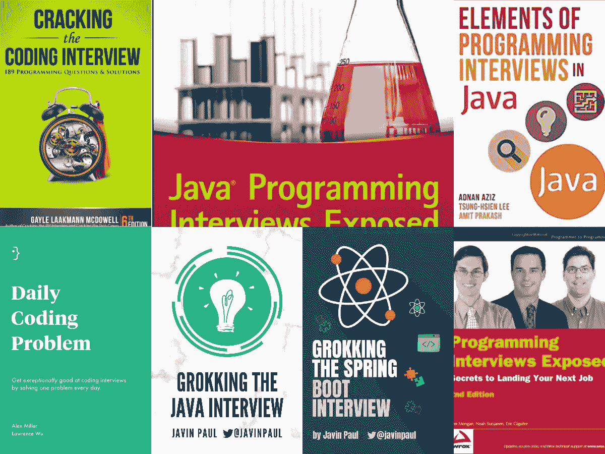
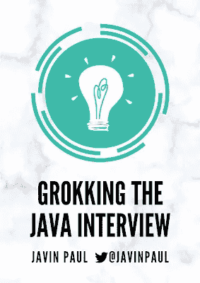
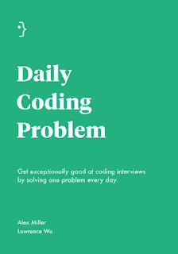

# 准备 2023 年 Java 和 Spring Boot 开发者面试的 7 本最佳书籍

> 原文：<https://medium.com/javarevisited/7-best-java-and-spring-developer-interview-books-and-courses-8df45282b67b?source=collection_archive---------0----------------------->

## 我最喜欢的书籍和在线课程来准备和破解 Java 开发人员面试

你好，Java 程序员如果你正在准备 Java 编程和开发人员面试，并在寻找最好的资源，那么你来对地方了。过去 10 年来，我一直在我的博客 Javaevisited 上分享 Java 面试问题，到目前为止，它已经帮助了数百万 Java 开发人员，而且还在增加。

在本文中，我将分享更多的资源，您可以利用这些资源更好地准备 Java 开发人员面试。

除了博客和文章，你还应该借助我的书( [**钻研 Java 面试**](https://gumroad.com/l/QqjGH) )和专门为 Java 面试编写的[课程](https://javarevisited.blogspot.com/2018/02/10-courses-to-prepare-for-programming-job-interviews.html#axzz5oeVu3CYQ)。虽然没有什么可以取代实际的工作经验，但破解编码面试有点不同。

即使你有很好的经验，你也可能很难通过在线编码测试，这对所有经验水平的 Java 开发人员来说都是非常具有挑战性的。

类似地，如果你不打算找一份完全相同的工作，那么你会从 Java 领域的大量话题中想到一大堆问题，这些问题你以前可能没有听说过。

这就是为什么良好的计划和准备是任何 Java 开发面试的关键。无论对于没有专业经验的新手，还是有多年 Java 开发经验的前辈，都同样重要。

在一次 Java 开发人员面试中，你经常会遇到两种问题，第一种是核心 Java 开发角色，主要关注核心 Java 概念，如[多线程](http://javarevisited.blogspot.com/2011/07/java-multi-threading-interview.html)、[并发](https://javarevisited.blogspot.com/2018/06/top-5-java-multithreading-and-concurrency-courses-experienced-programmers.html)、[设计模式](https://javarevisited.blogspot.com/2018/02/top-5-java-design-pattern-courses-for-developers.html)、 [OOP](http://www.java67.com/2015/12/top-30-oops-concept-interview-questions-answers-java.html) 、错误处理、[集合](http://javarevisited.blogspot.com/2011/11/collection-interview-questions-answers.html)、 [JVM 内部机制](https://javarevisited.blogspot.com/2019/04/top-5-courses-to-learn-jvm-internals.html)、GC 和 Java 性能调优。

第二种 Java 面试是针对 Java EE 或 Java web 开发角色的，主要关注与 Java EE 相关的技术，如 JSP、Servlet、EJB、JDBC，以及框架，如 [Spring](http://java67.blogspot.com/2012/08/spring-interview-questions-answers.html) 、 [Hibernate](https://javarevisited.blogspot.com/2018/01/top-5-hibernate-and-jpa-courses-for-java-programmers-learn-online.html) ，web 服务，如 [REST 和 SOAP、](/javarevisited/10-best-java-web-services-rest-soap-and-api-courses-for-beginners-724a8f51298d)以及消息传递技术，如 JMS 和 MQ 服务。

但是，在这两种情况下，你都需要通过在线编码测试，而且总会有一些关于数据结构和算法以及软件设计的问题，这些对于任何没有实践经验的程序员来说都是非常困难的。

在这篇文章中，我介绍了两种类型的书籍，第一种是专门为帮助编程面试而写的，涵盖了从[面向对象设计](https://www.java67.com/2016/07/top-5-object-oriented-design-interview-questions.html)、[编码](https://javarevisited.blogspot.com/2021/09/top-10-recursion-interview-questions.html)、[数据结构、算法](/javarevisited/50-data-structure-and-algorithms-interview-questions-for-programmers-b4b1ac61f5b0)、[计算机科学](/javarevisited/8-best-computer-science-courses-for-beginners-to-learn-online-696379aa4e96)、网络、[数据库](https://javarevisited.blogspot.com/2021/05/sql-and-database-phone-interview-questions.html)、 [SQL](https://www.java67.com/2019/08/microsoft-sql-server-phone-interview-questions-answers.html) 、XML 以及解决问题的技巧

和一旦你看完了这些书，你就可以自信地参加任何 Java 面试了。

# 2023 年 Java 编程和 Spring 开发者访谈的 7 本书

Java 面试通常有两种问题，一种是基于 Java 编程语言和 API 的事实和概念，其他是典型的编程问题，有些是基于数据结构和算法，[软件设计](/javarevisited/25-software-design-interview-questions-to-crack-any-programming-and-technical-interviews-4b8237942db0)，计算机科学基础。

有些需要你开发逻辑和编码，有些与面向对象编程和设计模式有关。

如果你正在准备核心 Java 或 Java Web 开发人员面试，以前通常被称为 Java EE 或 Java Spring 开发人员面试，那么你还需要问一些关于流行框架的问题，如 JSF、Spring MVC 和 Hibernate。

在这个列表中，我将分享 7 本最好的书，它们将涵盖你准备 Java 编程面试需要的所有主题，包括在线编码测试。

## 1.。[破解编码面试:189 道编程题](http://www.amazon.com/dp/098478280X/?tag=javamysqlanta-20)

这可能是 Java 和编程工作面试最受欢迎的书。它与任何编码面试准备书非常相似，但它有更多的问题，也涵盖了更多的主题，更好的解释，并涵盖了像如何谈判工作机会这样的事情。
一旦你做了本书中给出的练习，你会对去参加 Java 面试更有信心。

如果你想成为一名高级 Java 开发人员，如果你想在系统设计等特定领域有所提高，这通常是最困难的，那么我建议你查看一下 Educative 上的 [**系统设计面试**](https://www.educative.io/collection/5668639101419520/5649050225344512?affiliate_id=5073518643380224) 课程，这是一个新的基于文本的在线学习平台。这门课程是由曾在谷歌、微软、亚马逊和苹果等科技公司担任招聘经理的人准备的，你一定会学到很多知识来解决这个最难的编程面试话题。

## 2.[摸索 Java 面试](https://www.amazon.com/dp/B08P55JZBX/?tag=javamysqlanta-20)【我的书】

**钻研 Java 面试**书籍包含了常见的 Java 问题，这些问题来自重要的主题，如:
T5 1。面向对象编程

2。Java 基础

3。Java 合集

4。Java 多线程

5。碎片帐集

6.JDBC

7。仿制药

8。设计模式

9.电话面试问题

如果你正在准备核心 Java 面试，那么我强烈建议你在电话面试或面对面面试之前仔细阅读这些 *Java 面试问题*，你不仅会获得回答任何 Java 问题的信心和知识，还会学会如何让 Java 面试对你有利。

是的，这是我破解 Java 面试的最大秘密，你需要鼓励面试官从你擅长的领域提问，这样你就可以展示你知识的深度。

**下载免费样稿** — [**搜 Java 面试**](https://javinpaul.gumroad.com/l/HMOAv)

如果你有兴趣购买整本书，那么你可以在 Gumroad 上购买，你也可以使用代码 **friends20** 获得 **20%的折扣**

## 3.[Java 编程面试的要素:内部人员指南](https://www.amazon.com/Elements-Programming-Interviews-Java-Insiders/dp/1517671272/?tag=javamysqlanta-20)

这是另一本优秀的书，特别是为 Java 编程概念和 API 的问题做准备。在这本书里，你会找到破解任何 Java 面试所需的一切。这就像是 Java 编程面试的终极指南。这本书对于通过在线编码测试特别有用，现在在线编码测试是任何 Java 开发人员面试中不可或缺的一部分。仅仅通过了解 Java 概念就可以获得 Java 开发人员工作的日子已经一去不复返了，现在你还需要通过一项严重基于算法和数据结构的编码测试。

如果编码和数据结构是你的弱项，那么这本书可以真正帮助你，如果你需要更多的实践指导，那么你也可以将这本书与 [**数据结构&算法结合起来——面试！！**](https://click.linksynergy.com/fs-bin/click?id=JVFxdTr9V80&subid=0&offerid=323058.1&type=10&tmpid=14538&RD_PARM1=https%3A%2F%2Fwww.udemy.com%2Flearn-data-structure-algorithms-with-java-interview%2F)Udemy 上的课程，用于讲师指导培训。它将帮助你通过在线编码测试，这是任何软件工程面试的第一关。

这本书不仅涵盖了这些，还涵盖了[设计模式](/javarevisited/7-best-books-to-learn-design-patterns-for-java-programmers-5627b93eefdb?source=---------15------------------)、[软件设计问题](/javarevisited/25-software-design-interview-questions-to-crack-any-programming-and-technical-interviews-4b8237942db0)、[面向对象编程和设计](https://javarevisited.blogspot.com/2020/05/object-oriented-programming-questions-answers.html#axzz6vwZEctyQ)、[关于 JVM 的问题](https://www.java67.com/2020/02/50-garbage-collection-interview-questions-answers-java.html)、[多线程](https://javarevisited.blogspot.com/2014/07/top-50-java-multithreading-interview-questions-answers.html#axzz6hX6XfwBD)，以及其他所有你在面试中需要了解的与 Java 相关的话题。

我过去参考过这本书，现在，比起这本书，我更喜欢这本书的第一本书，但它仍然是一本相关的书。如果你读了这本书，你也会发现它很有趣。

这些书的好处是，它充满了图表，有助于更快更好地理解这个概念。

## 4.搜寻 Spring Boot 的采访[我的书]

这是我的另一本书，你可以参考它来准备 Java 和 Spring Boot 开发者面试。这本书触及了所有这些基本主题，并有问题来测试你对这些主题的了解。

您可以使用这些问题来快速修改那些基本的 Spring 概念，也可以使用这些问题来进一步探索 Spring 框架和 Spring Boot。

它包含一些常见问题，涉及 Spring 的基本主题，如

1.容器、依赖项和 IOC

2.春豆生命周期

3.面向方面编程( [AOP](https://javarevisited.blogspot.com/2021/03/spring-aop-interview-questions-answers.html#axzz6nwXUSoGH)

4.[春天 MVC](https://javarevisited.blogspot.com/2018/11/top-20-spring-mvc-interview-questions-answers-for-java-developers.html)

5. [Spring Boot 简介](https://www.java67.com/2018/06/top-15-spring-boot-interview-questions-answers-java-jee-programmers.html)

6. [Spring Boot 汽车配置](https://javarevisited.blogspot.com/2020/05/top-20-spring-boot-interview-questions-answers.html)

7.Spring Boot 起动机依赖

8. [Spring Boot 执行器](https://www.java67.com/2021/02/spring-boot-actuator-interview-questions-answers-java.html)

9.Spring Boot CLI

10. [Spring Boot 测试](https://javarevisited.blogspot.com/2021/02/-spring-boot-testing-interview-questions-answers-java.html)

11.[春云](https://www.java67.com/2021/01/spring-cloud-interview-questions-with-answers-java.html)

12.[春季数据 JPA](https://www.java67.com/2021/01/spring-data-jpa-interview-questions-answers-java.html)

13.[春天的安全](https://javarevisited.blogspot.com/2021/02/spring-security-interview-questions-answers-java.html#axzz6lIcZ8tnd)

如果你正在准备 Java 和 Spring Boot 的面试，那么我强烈建议你在电话面试或面对面面试之前仔细阅读这些 Spring Boot 和春天的问题，你不仅会获得回答问题的信心和知识，还会学会如何让 Java 面试对你有利。

如果你有兴趣购买整本书，那么你可以在 Gumroad 上购买，你也可以使用代码 **friends20** 获得 **20%的折扣**

**下载免费样本**——[寻找春季新兵面试](https://javinpaul.gumroad.com/l/grokking-springboot-interview-sample)

这本书现在在亚马逊 Kindle 上也有售，价格为 9.9 美元，对于我们的印度朋友来说，价格为 449 卢比，如果你喜欢从亚马逊订购，那么你可以使用这个链接— [**在亚马逊上搜索 Spring Boot 采访**](https://www.amazon.com/dp/B08V1NN4LW/?tag=javamysqlanta-20) 来获得你的副本，价格仅为 9.9 美元。

 [## 苦读 Spring Boot 的采访

### Spring Boot 访谈- Kindle 版。下载一次，然后在你的 Kindle 设备上阅读…

www.amazon.com](https://www.amazon.com/dp/B08V1NN4LW/?tag=javamysqlanta-20) 

## 5.[马卡姆曝光的 Java 编程访谈](http://www.amazon.com/Java-Programming-Interviews-Exposed-Markham/dp/1118722868?tag=javamysqlanta-20)

这显然是关于 Java 面试的最佳书籍之一。它涵盖了你需要准备的每一个主题，包括 Java 基础知识、数据结构和算法、多线程和并发性、单元测试和 JUnit、框架，比如 Spring 和 Hibernate、JVM 内部机制和 GC，甚至 Android、Scala 和其他 JVM 语言。这显然是一本适合 Java 开发人员的书，不管你是去参加核心 Java、JEE 还是 Android 的面试。我怎么推荐这本书都不为过；当然，你自己也需要一本来准备电话面试和面对面的 Java 面试。

如果你需要更多 Java 特有的问题，也可以查看 Udemy 上 Ranga Rao Karnam 的 [**Java 面试指南:200+面试问答**](https://click.linksynergy.com/fs-bin/click?id=JVFxdTr9V80&subid=0&offerid=323058.1&type=10&tmpid=14538&RD_PARM1=https%3A%2F%2Fwww.udemy.com%2Fjava-interview-questions-and-answers%2F) 课程。

 [## 准备 Java 面试(200 多个练习题)

### Ranga 是经认证的谷歌云助理云工程师、AWS 认证解决方案架构师助理、AWS 认证…

udemy.com](https://click.linksynergy.com/fs-bin/click?id=JVFxdTr9V80&subid=0&offerid=323058.1&type=10&tmpid=14538&RD_PARM1=https%3A%2F%2Fwww.udemy.com%2Fjava-interview-questions-and-answers%2F) 

## 6.[编程面试曝光](http://www.amazon.com/dp/1118261364/?tag=javamysqlanta-20)

这又是一本准备编程面试的优秀书籍，包括 Java。在他们发布 Java 编程访谈曝光之前，我曾经读过这本书，因为它也涵盖了许多好的主题，如数据结构，如[数组](/javarevisited/20-array-coding-problems-and-questions-from-programming-interviews-869b475b9121)、[字符串](/javarevisited/top-21-string-programming-interview-questions-for-beginners-and-experienced-developers-56037048de45)、[二叉树](/javarevisited/20-binary-tree-algorithms-problems-from-coding-interviews-c5e5a384df30)、[数据库和 SQL](https://javarevisited.blogspot.com/2017/02/top-6-sql-query-interview-questions-and-answers.html) 、网络、编码等等。

这本书的一个好处是，它还涵盖了像 HR 面试这样的非技术性面试，以及如何与他们谈判。

的确，这是一本准备编程工作面试的好书，即使在今天，我仍然参考这本书来更新我的概念，尤其是关于数据结构和算法的概念。

如果你想为这本书配套一门课程，我强烈推荐你参加 ZTM 学院 Andrei Negaoid 教授的 [**掌握编码面试:大技术(FAANG)面试课程**](https://academy.zerotomastery.io/p/master-the-coding-interview-faang-interview-prep?affcode=441520_zytgk2dn) 。

这是为网飞、谷歌、亚马逊、脸书、微软、苹果等大型科技公司的编码面试做准备的绝佳课程。本课程为如何解决他们最棘手的问题提供了循序渐进的指导！

 [## 掌握编码面试:大技术(FAANG)面试

### 在顶级科技公司(谷歌、亚马逊、脸书、苹果、微软、网飞及其他公司)的编码面试中胜出…

academy.zerotomastery.io](https://academy.zerotomastery.io/p/master-the-coding-interview-faang-interview-prep?affcode=441520_zytgk2dn) 

顺便说一句，你需要一个 [**ZTM 会员**](https://academy.zerotomastery.io/p/academy?affcode=441520_zytgk2dn) 来观看这个课程，这个课程每月花费大约 39 美元，但是也提供了许多超级吸引人和有用的课程，比如这个 [Python 课程](/javarevisited/my-review-of-the-complete-python-developer-in-2021-zero-to-mastery-course-udemy-ztm-academy-371f6de92019)和这个 [JavaScript Web 项目:20 个项目来建立你的作品集](/javarevisited/10-best-online-courses-to-learn-javascript-in-2020-af5ed0801645)课程。您还可以使用我的代码朋友 10 获得您选择的任何订阅的 10%的折扣。

 [## ZTM 学院

### 无论你是刚刚开始学习编码，还是想提高你的技能，零到精通学院将教你…

academy.zerotomastery.io](https://academy.zerotomastery.io/p/academy?affcode=441520_zytgk2dn) 

## 7.[日常编码问题:获得格外好](https://www.amazon.com/Daily-Coding-Problem-exceptionally-interviews/dp/1793296634/?tag=javamysqlanta-20)

这是另一本专注于编码技巧的书，如果你想通过在线编码测试，这是一本必备的书，这通常是任何 Java 开发人员面试的第一个障碍。这本书充满了编程和编码难题，这是任何编程工作面试的主要话题。

他们的解释很深入，你会学到几种解决特定编码问题的策略，比如动态编程、递归、贪婪算法、记忆化等等。

如果你已经做过第一册和第二册的程序，你可以试试这本。这将有助于你面试时的编码技巧

顺便说一句，你也可以将这本书与教育性课程上的 [**探索编码面试:编码问题的模式**](https://www.educative.io/collection/5668639101419520/5671464854355968?affiliate_id=5073518643380224) 结合起来，掌握常见面试问题的潜在模式，这样你就能应对面试中遇到的任何问题

 [## 探索编码面试:编码问题的模式——互动学习

### 更新:这个课程已经帮助 3 万多名用户在顶级公司找到了工作，包括谷歌、脸书、亚马逊和…

www.educative.io](https://www.educative.io/collection/5668639101419520/5671464854355968?affiliate_id=5073518643380224) 

而且，如果你发现教育平台和他们的搜索课程，比如[搜索系统设计面试](https://www.educative.io/collection/5668639101419520/5649050225344512?affiliate_id=5073518643380224)，[搜索面向对象编程面试](https://www.educative.io/collection/5668639101419520/5692201761767424?affiliate_id=5073518643380224)，那么考虑购买 [**教育订阅**](https://www.educative.io/subscription?affiliate_id=5073518643380224) ，每月只需 14.9 美元就可以访问他们的 100 多门课程。非常划算，非常适合准备编码面试。

以上就是这份 7 本**优秀书籍准备 Java 编程面试**的清单。你可以用这些书来准备核心 Java 和 Java EE 的面试，因为有几本书有关于 Java EE 技术和框架以及 Servlet、JSP、EJB、JMS、Spring Framework、Hibernate Framework 等的问题。

其他**对编码工作面试有用的资源**

*   如何用 Java 设计自动售货机？([解](https://javarevisited.blogspot.com/2016/06/design-vending-machine-in-java.html)
*   10 数据结构与算法课程破解编码面试([课程](https://hackernoon.com/10-data-structure-algorithms-and-programming-courses-to-crack-any-coding-interview-e1c50b30b927)
*   5 网站备考数据结构和算法题([见](http://javarevisited.blogspot.sg/2017/02/5-websites-for-practicing-data-structure-algorithms-for-coding-interviews.html#axzz4jaJmaqbE))
*   前 20 个字符串算法面试问题([列表](http://javarevisited.blogspot.sg/2015/01/top-20-string-coding-interview-question-programming-interview.html))
*   程序员 30 大数组面试问题([列表](http://javarevisited.blogspot.sg/2015/06/top-20-array-interview-questions-and-answers.html#axzz4jalUj7fS))
*   破解编码工作面试的 10 门在线课程([课程](https://javarevisited.blogspot.com/2018/02/10-courses-to-prepare-for-programming-job-interviews.html#axzz5oeVu3CYQ)
*   通过技术性工作面试的 5 本书([书](https://javarevisited.blogspot.com/2016/06/top-5-books-for-programming-coding-interviews-best.html)
*   亚马逊和谷歌的 20 大编程问题([列表](http://javarevisited.blogspot.sg/2016/01/top-20-amazon-and-google-programming-interview-questions.html#axzz4jalUj7fS))
*   访谈中的前 10 个 SQL 查询([查询](http://javarevisited.blogspot.sg/2017/02/top-6-sql-query-interview-questions-and-answers.html#axzz4jalUj7fS))
*   前 5 个面向对象设计面试问题([练习](https://www.java67.com/2016/07/top-5-object-oriented-design-interview-questions.html))
*   50 大编程电话面试问题([列表](http://javarevisited.blogspot.sg/2015/02/50-programmer-phone-interview-questions-answers.html#axzz4jalUj7fS))
*   过去 5 年的 133 个核心 Java 面试问题([列表](https://javarevisited.blogspot.com/2015/10/133-java-interview-questions-answers-from-last-5-years.html))
*   50+数据结构与算法面试问题([列表](https://dev.to/javinpaul/50-data-structure-and-algorithms-problems-from-coding-interviews-4lh2))
*   程序员十大数据结构和算法书籍([书籍](https://hackernoon.com/10-data-structure-algorithms-books-every-programmer-should-read-d50487313127))
*   面试 10 门编程和 SQL 课程([课程](https://dev.to/javinpaul/10-data-structure-algorithms-sql-and-java-courses-to-crack-any-programming-job-interview-11f6))
*   深入学习数据结构的前 5 门课程([课程](https://javarevisited.blogspot.com/2018/11/top-5-data-structures-and-algorithm-online-courses.html#axzz5YFaOvjsh))

感谢您阅读本文。如果你喜欢这些书籍推荐，那么请分享给你的朋友和同事。如果你有任何问题或建议，或者有任何你想看的书，请留言。

**【p . s .】**—如果你正在寻找更多的资源，那么我强烈推荐你去看看 Educative 上的[**Ace Java 编码面试跟踪**](https://www.educative.io/track/ace-java-coding-interview?affiliate_id=5073518643380224) ，一个交互式学习平台。这个专题包含一个很棒的课程，可以让你为 Java 面试做好准备。根据他们的年度计划，每月只需 14.9 美元，你就可以获得他们所有的课程。

 [## java 编码面试中的王牌

### 如果你能在 Java 技术面试中胜出，你就有可能永远拥有一份好工作。好消息:当你完成…

www.educative.io](https://www.educative.io/track/ace-java-coding-interview?affiliate_id=5073518643380224)